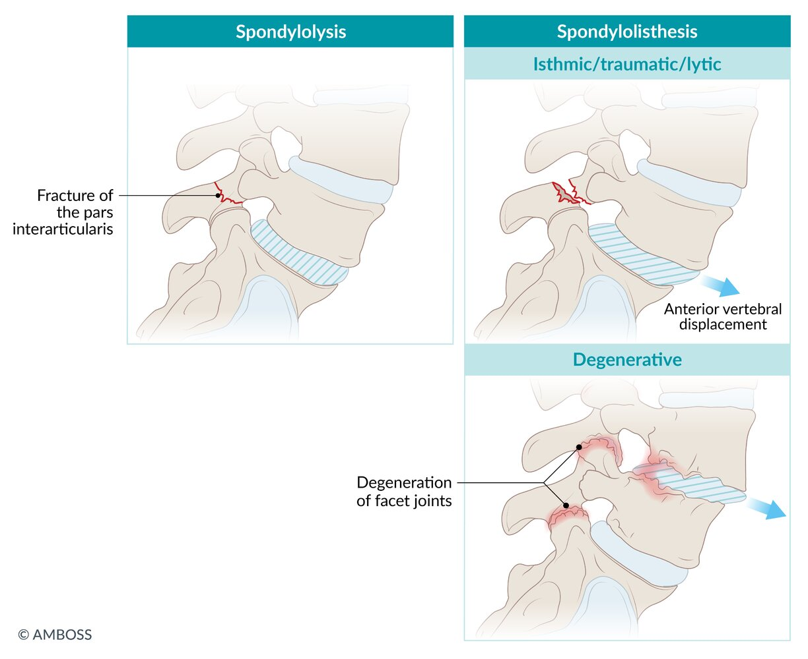
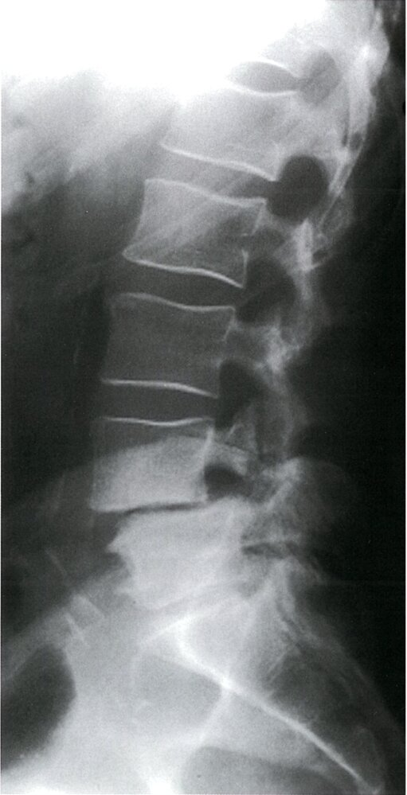
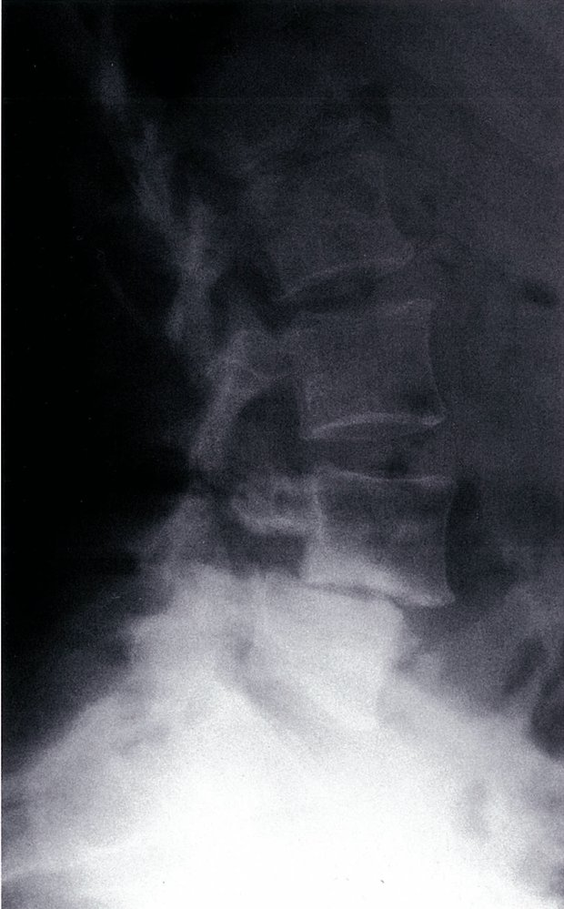
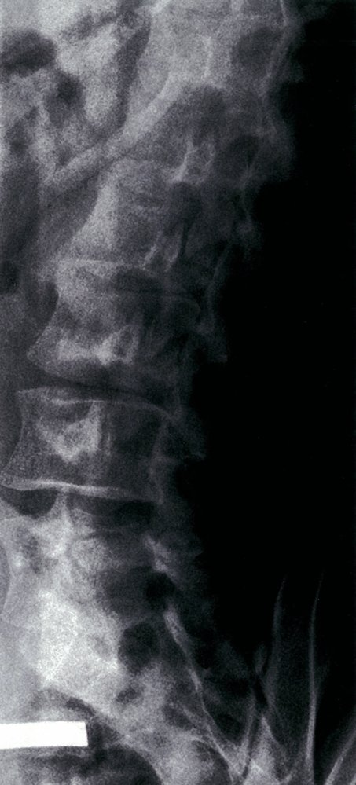
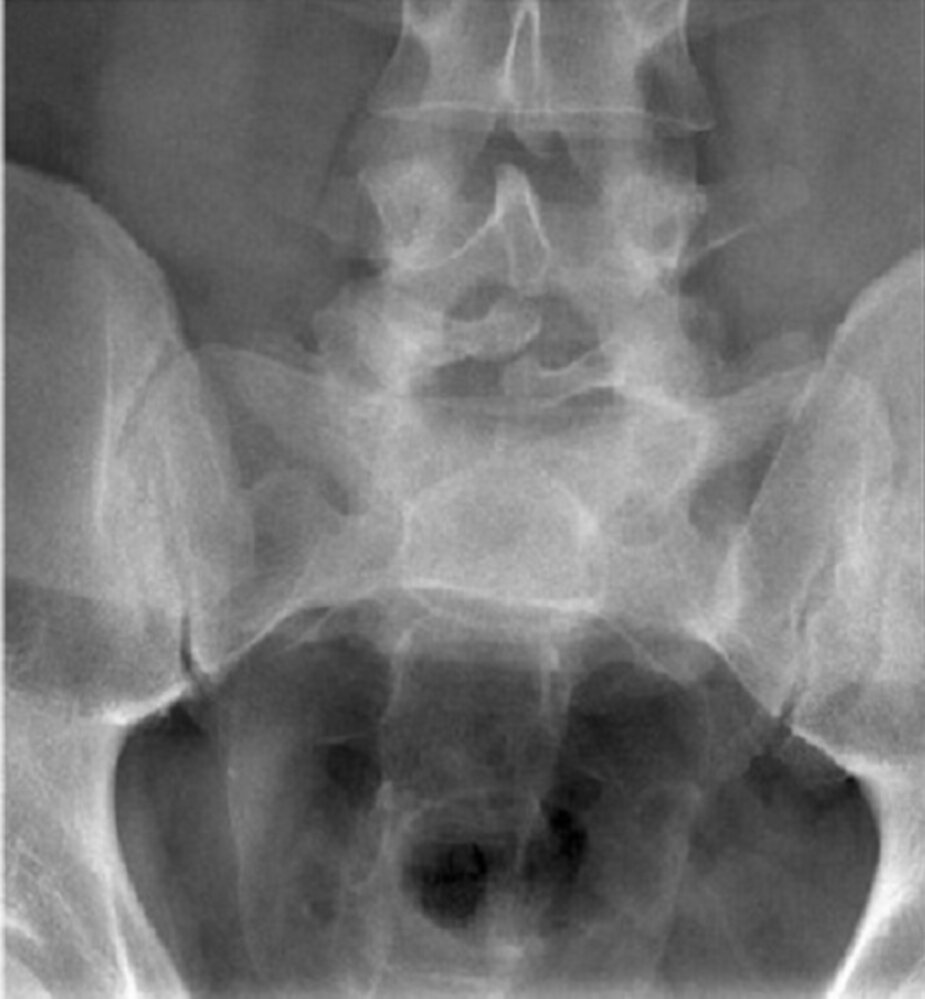
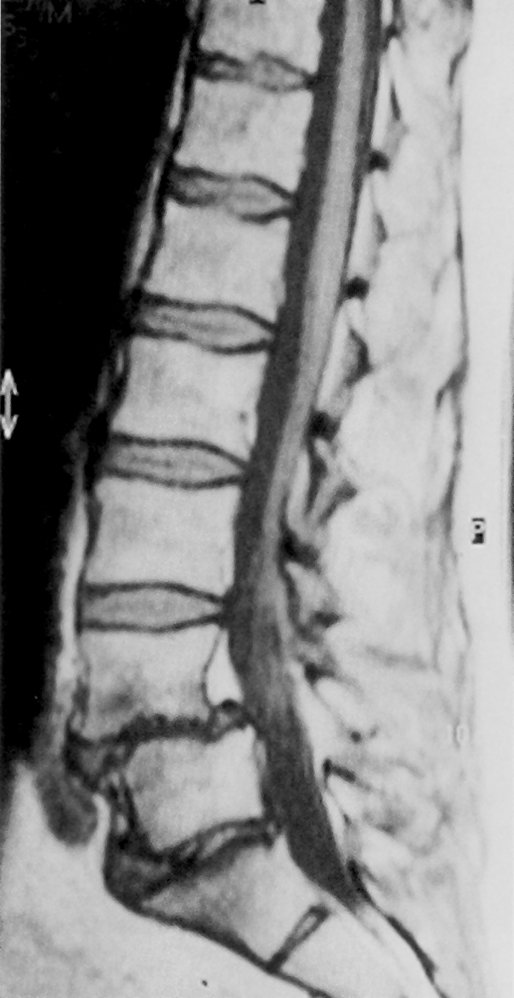
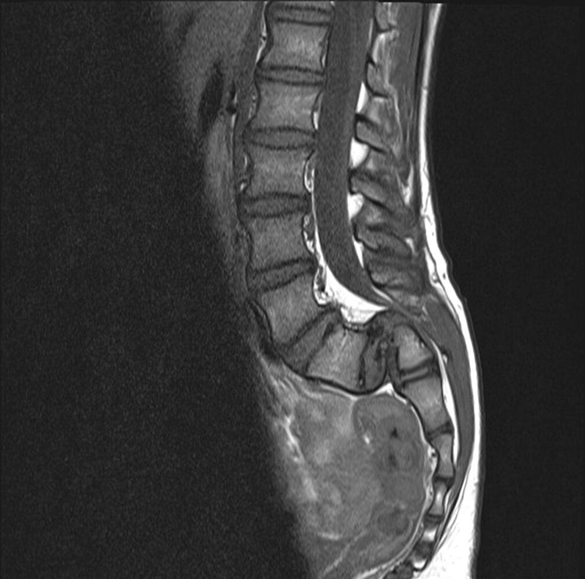

# Spondylolisthesis

*Categories: Clinical knowledge > Emergency medicine > Musculoskeletal and rheumatic disorders > Spondylolisthesis*

[Original Article Link](https://coursology-qbank.com/amboss/article/PQ0Wwf)

---

## Summary

Spondylolisthesis is a condition in which a <u>vertebral body</u> slips anteriorly in relation to the subjacent <u>vertebrae</u>. The condition affects up to 10% of the population. The two most common forms of spondylolisthesis are isthmic and degenerative. <u>Isthmic spondylolisthesis</u> is associated with a disruption of the <u>vertebral</u> ring and most commonly occurs at L5–<u>S1</u>. This form is most prevalent in children and <u>adolescents</u> and is often associated with repetitive hyperextension of the <u>spine</u> (e.g., in gymnasts). <u>Degenerative spondylolisthesis</u> occurs at L4–L5 and most commonly affects individuals over 50 years of age. Other forms of spondylolisthesis may be associated with congenital disease, trauma or bone <u>fractures</u>, and underlying bone pathology (e.g., Paget disease). Spondylolisthesis may be asymptomatic or cause lumbar <u>pain</u> on exertion, gait problems, radiculopathic <u>pain</u>, or <u>urinary incontinence</u>. Some patients have a palpable <u>step-off sign</u> at the lumbosacral area. Diagnosis is established with imaging. Most patients achieve good symptomatic control with <u>conservative treatment</u> (e.g., <u>physical therapy</u>). Surgical treatment (e.g., <u>vertebral</u> fusion, decompression <u>laminectomy</u>) is reserved for patients with refractory symptoms and/or neurological deficits. Overall, children and <u>adolescents</u> have better outcomes than adults and elderly patients.

---

## Definitions

* Spondylolisthesis: <u>anterior</u> slippage of a <u>vertebral body</u> over the subjacent <u>vertebra</u>

* Isthmic spondylolisthesis (<u>spondylolytic</u> form): spondylolisthesis resulting from an abnormality in the <u>pars interarticularis</u> [[1]](https://coursology-qbank.com/amboss/article/25XTjA)

* Degenerative spondylolisthesis: spondylolisthesis resulting from degenerative changes, without an associated disruption or defect in the <u>vertebral</u> ring [[2]](https://coursology-qbank.com/amboss/article/r9YfKr)

* Congenital spondylolisthesis: spondylolisthesis secondary to congenital anomalies (e.g., <u>hypoplastic</u> facets, sacral deficits, poorly developed <u>pars interarticularis</u>).

---

## Epidemiology

* Affects up to 10% of the population

* Most common in children and <u>adolescents</u> < 18 years (congenital and <u>isthmic spondylolisthesis</u>) and adults aged > 50 years (<u>degenerative spondylolisthesis</u>)

* Sex: <u>♂</u> > <u>♀</u> (congenital and <u>isthmic spondylolisthesis</u>); <u>♀</u> > <u>♂</u> (<u>degenerative spondylolisthesis</u>)

* Defect most commonly occurs in the <u>lumbar spine</u> (typically L5-<u>S1</u> in <u>isthmic spondylolisthesis</u>, L4-L5 in <u>degenerative spondylolisthesis</u>) [[3]](https://coursology-qbank.com/amboss/article/sqXt-_)

References:[[1]](https://coursology-qbank.com/amboss/article/25XTjA)[[4]](https://coursology-qbank.com/amboss/article/Gs0Bwh)[[5]](https://coursology-qbank.com/amboss/article/f0ak2Q)[[6]](https://coursology-qbank.com/amboss/article/g0aF2Q)[[7]](https://coursology-qbank.com/amboss/article/S0ay2Q)[[8]](https://coursology-qbank.com/amboss/article/vmXAhA)[[9]](https://coursology-qbank.com/amboss/article/9PXNSy)

Epidemiological data refers to the US, unless otherwise specified.

---

## Etiology

* Spondylolysis: lytic defect in the <u>pars interarticularis</u>, permitting forward slippage of the superjacent <u>vertebra</u> [[1]](https://coursology-qbank.com/amboss/article/25XTjA)[[10]](https://coursology-qbank.com/amboss/article/sPXtTy)

* Leads to <u>isthmic spondylolisthesis</u> if <u>spondylolysis</u> is bilateral

* Most commonly in young individuals

* <u>Risk factors</u>

* Repetitive hyperextension and rotation movements (e.g., in gymnastics, swimming, weight lifting)

* <u>Scheuermann disease</u>

* Typically causes spondylolisthesis at L5–<u>S1</u> level

* Degenerative disease

* Most commonly in older individuals

* Typically causes spondylolisthesis at the L4–L5 level

* Congenital <u>malformation</u> (<u>dysplasia</u> or <u>hypoplasia</u>) of the <u>lumbosacral joints</u>

* Trauma

* Local or systemic pathology (e.g., <u>tumor</u>, Paget's disease, <u>osteogenesis imperfecta</u>, <u>TB</u>)

Spondylolysis & Spondylolisthesis

---

## Clinical features

The severity of symptoms often correlates with the degree of <u>vertebral</u> slippage. [[1]](https://coursology-qbank.com/amboss/article/25XTjA)[[2]](https://coursology-qbank.com/amboss/article/r9YfKr)[[3]](https://coursology-qbank.com/amboss/article/sqXt-_)[[10]](https://coursology-qbank.com/amboss/article/sPXtTy)[[11]](https://coursology-qbank.com/amboss/article/7UY4eo)

* Asymptomatic (majority of patients) [[4]](https://coursology-qbank.com/amboss/article/Gs0Bwh)[[11]](https://coursology-qbank.com/amboss/article/7UY4eo)[[12]](https://coursology-qbank.com/amboss/article/rUYfeo)

* Acute or chronic lumbar <u>pain</u> that worsens with activity and/or with <u>spine</u> extension [[2]](https://coursology-qbank.com/amboss/article/r9YfKr)[[3]](https://coursology-qbank.com/amboss/article/sqXt-_)[[8]](https://coursology-qbank.com/amboss/article/vmXAhA)

* Radiates to the gluteal and <u>posterior</u> thigh regions

* Often associated with numbness, <u>paresthesias</u>, and <u>muscle weakness</u>  [[1]](https://coursology-qbank.com/amboss/article/25XTjA)[[10]](https://coursology-qbank.com/amboss/article/sPXtTy)

* Gait problems (e.g., <u>waddling gait</u>, <u>neurogenic claudication</u>)

* Other features of neurological involvement include : [[2]](https://coursology-qbank.com/amboss/article/r9YfKr)

* <u>Radiculopathy</u>

* Urinary or <u>bowel incontinence</u>

* <u>Cauda equina syndrome</u> in severe cases

* Possible <u>physical examination</u> findings [[9]](https://coursology-qbank.com/amboss/article/9PXNSy)[[13]](https://coursology-qbank.com/amboss/article/G9YBKr)

* <u>Spine</u>

* Reduced lumbar <u>range of motion</u> and reduced lumbar <u>lordosis</u>

* Step-off sign (seen in advanced stages)

* Procedure: Observe and palpate the <u>spinous processes</u> to identify any slippage of the <u>vertebrae</u>.

* Positive sign: visible or palpable <u>step-off sign</u> at the lumbosacral area  [[9]](https://coursology-qbank.com/amboss/article/9PXNSy)

* Lower limbs

* Tight, contracted <u>hamstring muscles</u>

* <u>Weakness</u> and <u>atrophy</u> in lower legs; reduced sensation and reflexes

* <u>Straight leg raise test</u>: A positive test indicates <u>lumbar radiculopathy</u>.

---

## Diagnosis

* Consider in patients with characteristic clinical features; in asymptomatic patients, the diagnosis may be incidental.

* Imaging studies confirm the diagnosis, help monitor progression, and are needed to guide the treatment.

> [!TIP]
> Spondylolisthesis is often an incidental finding.

### <u>X-ray</u> lumbosacral <u>spine</u> [[2]](https://coursology-qbank.com/amboss/article/r9YfKr)[[8]](https://coursology-qbank.com/amboss/article/vmXAhA)

* Indications: initial test for all patients in whom spondylolisthesis is suspected

* Views

* <u>Lateral</u>, PA, and oblique

* Dynamic <u>flexion</u>-extension (<u>lateral</u> view): Consider performing to assess for <u>spinal instability</u>.

* Supportive findings: <u>anterior</u> <u>vertebral</u> displacement (<u>anterolisthesis</u>)   [[8]](https://coursology-qbank.com/amboss/article/vmXAhA)

* L4 over L5: most common in <u>degenerative spondylolisthesis</u>

* L5 over <u>S1</u>: most common in <u>isthmic spondylolisthesis</u>

* Additional findings

* Degenerative changes, e.g., disk space narrowing, vacuum phenomenon, endplate <u>sclerosis</u> [[8]](https://coursology-qbank.com/amboss/article/vmXAhA)

* <u>Spondylolysis</u>: in the isthmic form  [[8]](https://coursology-qbank.com/amboss/article/vmXAhA)

* <u>Scottie dog with a collar sign</u>   [[8]](https://coursology-qbank.com/amboss/article/vmXAhA)

* High-grade spondylolisthesis of L5 over <u>S1</u> due to bilateral <u>spondylolysis</u> (inverted Napoleon hat sign)   [[3]](https://coursology-qbank.com/amboss/article/sqXt-_)

* <u>Spinal instability</u>  [[9]](https://coursology-qbank.com/amboss/article/9PXNSy)

|  Meyerding classification    [[9]](https://coursology-qbank.com/amboss/article/9PXNSy)  |  |  |  |
| --- | --- | --- | --- |
| Grade | Slippage |  |  |
| I | < 25% |  |  |
| II | 25–50% |  |  |
| III | 51–75% |  |  |
| IV | 76–100% |  |  |
| V |  > 100%, referred to as spondyloptosis   |  |  |
|   * Low-grade slippage: grades I and II  * High-grade slippage: grades ≥ III    |  |  |  |

Spondylolisthesis

Spondylolysis with spondylolisthesis

Spondylolysis (Scottie dog sign with collar)

Inverted Napoleon-hat sign in spondylolisthesis

Spondylolisthesis of L4 on L5

Spondyloptosis (grade V spondylolisthesis)

### Additional imaging studies [[1]](https://coursology-qbank.com/amboss/article/25XTjA)[[2]](https://coursology-qbank.com/amboss/article/r9YfKr)[[8]](https://coursology-qbank.com/amboss/article/vmXAhA)

Order to assess for <u>spinal stenosis</u> and impingement of <u>nerve roots</u> in patients with signs of neurological involvement.

* Indications

* Clinical features of <u>radiculopathy</u> or <u>myelopathy</u>

* Suspected underlying condition (e.g., <u>metastatic</u> disease)

* Suspected <u>cauda equina syndrome</u> (i.e., <u>bladder</u> or bowel complaints)

* Options [[14]](https://coursology-qbank.com/amboss/article/r6Xfm_)[[15]](https://coursology-qbank.com/amboss/article/QqXuy_)

* First-line: <u>MRI</u> lumbosacral <u>spine</u>  [[1]](https://coursology-qbank.com/amboss/article/25XTjA)[[2]](https://coursology-qbank.com/amboss/article/r9YfKr)[[8]](https://coursology-qbank.com/amboss/article/vmXAhA)

* Second-line [[1]](https://coursology-qbank.com/amboss/article/25XTjA)[[2]](https://coursology-qbank.com/amboss/article/r9YfKr)

* <u>CT myelography</u> or CT lumbosacral <u>spine</u>

* For patients with <u>contraindications to MRI</u>; can also be used as a guide to surgical treatment

---

## Differential diagnoses

See also “Differential diagnosis of <u>lower back pain</u>.”

* Facet joint syndrome

* Irritation of the <u>facet joints</u>, usually due to spondyloarthritis

* Symptoms can be nonspecific but often include <u>radiating pain</u> to the buttocks or groin

* It is differentiated from other spinal pathologies (especially discogenic <u>pain</u>) by the fact that <u>pain</u> is not exacerbated with increased <u>intra-abdominal pressure</u> (e.g., <u>Valsalva maneuver</u>)

* <u>Ankylosing spondylitis</u>

* <u>Multiple myeloma</u>

* <u>Spinal disk herniation</u>

* <u>Metastatic bone disease</u>

References:[[4]](https://coursology-qbank.com/amboss/article/Gs0Bwh)

The differential diagnoses listed here are not exhaustive.

---

## Treatment

### General principles

* Treatment goals are to reduce <u>pain</u>, restore mobility, and prevent disease progression.

* <u>Conservative treatment</u> can be attempted initially in most patients.

* Surgical treatment is usually reserved for patients with high-grade slippage or persistent symptoms.

> [!WARNING]
> Immediate <u>surgery</u> consultation is required for patients with motor deficit or <u>cauda equina syndrome</u> to evaluate the need for emergency surgical decompression. [[16]](https://coursology-qbank.com/amboss/article/MqXM__)

### <u>Conservative treatment</u>  [[2]](https://coursology-qbank.com/amboss/article/r9YfKr)[[8]](https://coursology-qbank.com/amboss/article/vmXAhA)[[17]](https://coursology-qbank.com/amboss/article/79Y4Kr)[[18]](https://coursology-qbank.com/amboss/article/EMX8qA)

* Indications

* Initial treatment for patients with low-grade slippage and no significant neurological involvement

* Consider as initial treatment for high-grade <u>degenerative spondylolisthesis</u> with no significant neurological involvement. [[8]](https://coursology-qbank.com/amboss/article/vmXAhA)[[11]](https://coursology-qbank.com/amboss/article/7UY4eo)

* General recommendations [[8]](https://coursology-qbank.com/amboss/article/vmXAhA)[[17]](https://coursology-qbank.com/amboss/article/79Y4Kr)

* <u>Physical therapy</u>: e.g., bracing, back-strengthening exercises  [[8]](https://coursology-qbank.com/amboss/article/vmXAhA)

* Physical activity restriction: e.g., 1–2 days of rest during acute symptoms, stopping sports that contribute to spondylolisthesis

* Management of comorbidities that might contribute to symptoms and disease progression: e.g., <u>osteoporosis</u> or <u>obesity</u> [[8]](https://coursology-qbank.com/amboss/article/vmXAhA)

* <u>Pain management</u>

* First-line: <u>oral analgesics</u> (preferably nonopioid); <u>acetaminophen</u> is the preferred option in elderly patients.  [[8]](https://coursology-qbank.com/amboss/article/vmXAhA)

* In patients with persistent symptoms, consider <u>steroid</u> or <u>anesthetic</u> injections (epidural or <u>nerve root</u>) [[1]](https://coursology-qbank.com/amboss/article/25XTjA)[[2]](https://coursology-qbank.com/amboss/article/r9YfKr)[[3]](https://coursology-qbank.com/amboss/article/sqXt-_)

### Surgical treatment [[1]](https://coursology-qbank.com/amboss/article/25XTjA)[[2]](https://coursology-qbank.com/amboss/article/r9YfKr)[[11]](https://coursology-qbank.com/amboss/article/7UY4eo)[[17]](https://coursology-qbank.com/amboss/article/79Y4Kr)[[18]](https://coursology-qbank.com/amboss/article/EMX8qA)

The best surgical approach and indications should be discussed in consultation with a specialist.

* Common indications 

* High-grade spondylolisthesis (<u>Meyerding classification</u> grades ≥ III)

* Significant <u>neurogenic claudication</u> or <u>radiculopathy</u>

* Progressive or persistent symptoms (e.g., after 3–6 months) despite <u>conservative treatment</u>

* Traumatic spondylolisthesis and <u>spinal instability</u>

* <u>Bladder</u> or bowel symptoms

* Treatment options 

* <u>Vertebral</u> fusion: standard procedure

* Decompressive <u>laminectomy</u>

* Consider in addition to <u>vertebral</u> fusion for patients with symptomatic <u>spinal stenosis</u>.

* Consider as a first-line approach for patients with low-grade degenerative <u>spinal stenosis</u> with symptoms refractory to <u>conservative treatment</u>. [[2]](https://coursology-qbank.com/amboss/article/r9YfKr)

---