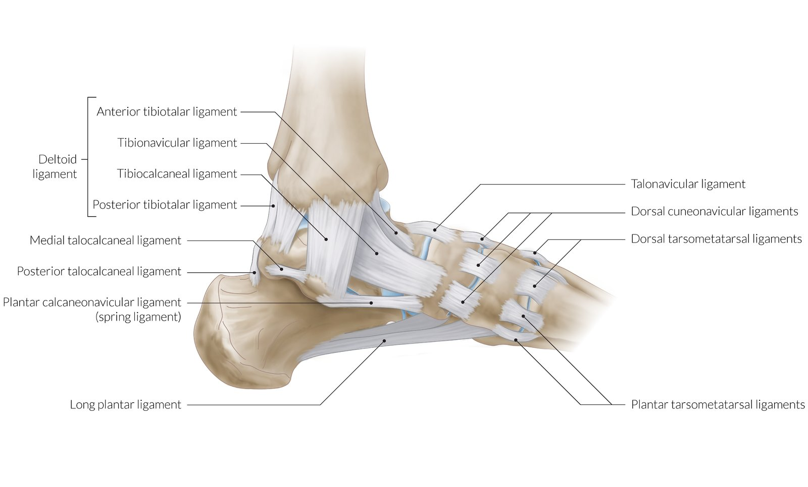
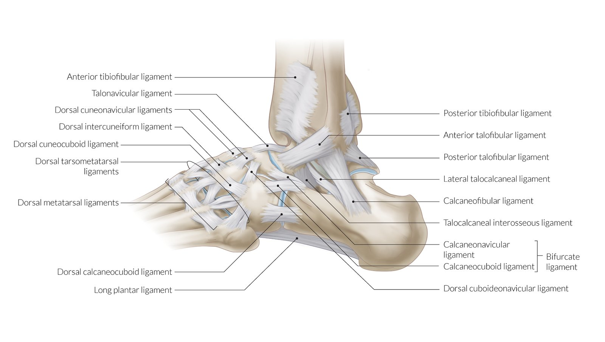
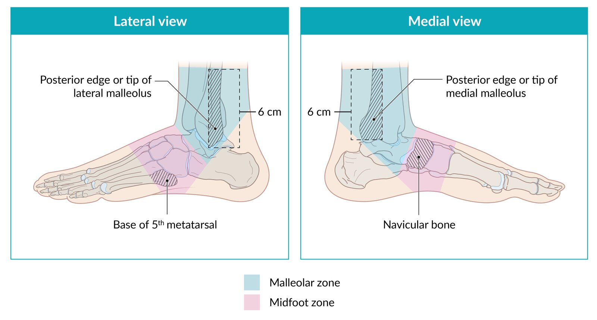
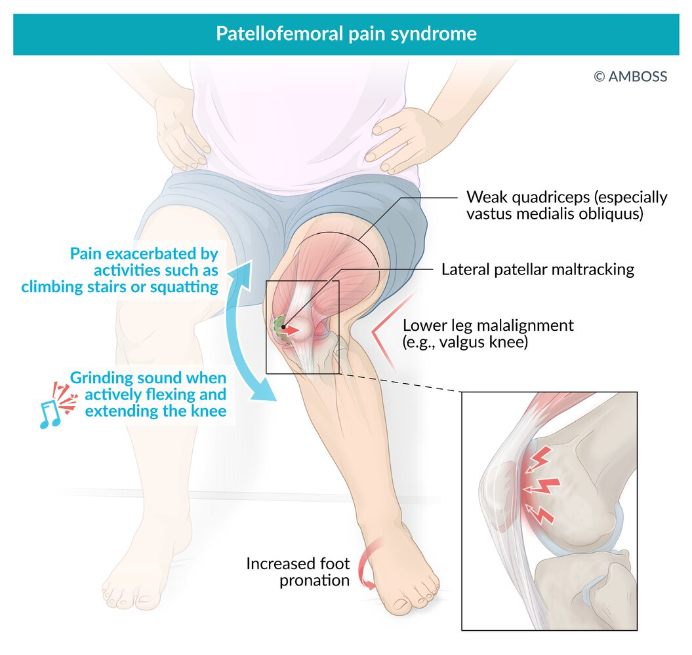

# Sports injuries

*Categories: Clinical knowledge > Emergency medicine > Musculoskeletal and rheumatic disorders > Sports injuries*

[Original Article Link](https://coursology-qbank.com/amboss/article/AM0Rrg)

---

## Summary

This article focuses on injuries that are commonly associated with sporting activities, but they can also occur at work or during <u>activities of daily living</u>. Sports injuries are usually the result of direct trauma or a sudden increased load on the <u>joints</u>, <u>ligaments</u>, and/or muscles. Acute <u>joint</u> and <u>ligament injuries</u> typically result from nonphysiological movements in the <u>joints</u> (e.g., excessive <u>supination</u> of the ankle). Treatment of acute sports injuries usually follows the <u>POLICE principle</u> (protection, optimal loading, ice, compression, and elevation). Definitive therapy depends on the extent of the injury (e.g., the presence or absence of <u>fractures</u>) and ranges from <u>immobilization</u> of the affected region (e.g., casts, <u>braces</u>, supportive wraps) to surgical repair. <u>Compression neuropathies</u>, especially of the <u>peripheral nerves</u> of the upper extremity, are commonly associated with sport. In most cases, <u>compression neuropathies</u> can be treated with <u>conservative management</u> (e.g., rest, activity modification, <u>physical therapy</u>); surgical decompression may be considered for those with symptoms that are refractory to <u>conservative management</u>.

---

## Initial management of sports injuries

### Diagnosis [[1]](https://coursology-qbank.com/amboss/article/xaWE5P0)

* Clinical evaluation

* Examine the extremity for open injuries or <u>joint</u> deformity.

* Assess active and passive <u>range of motion</u> (<u>ROM</u>).

* Identify areas of tenderness.

* Test for <u>ligamentous injury</u> with <u>stress</u> testing.

* Assess major muscle group strength.

* Perform a thorough <u>neurovascular examination</u>.

* Imaging

* Indicated if there is a concern for <u>fracture</u> and/or <u>dislocation</u>.

* Protocols and guidelines can reduce unnecessary testing.

* <u>Ottawa ankle rules</u>

* <u>Ottawa knee rules</u>

* The threshold to obtain advanced imaging, e.g., <u>MRI</u>, is often lower for professional or elite athletes.

Ottawa ankle rules

Ottawa knee rules

### Treatment by injury phase [[2]](https://coursology-qbank.com/amboss/article/paWLlP0)

The treatment strategy depends on the pathophysiological phase of the injury.

* Acute [[2]](https://coursology-qbank.com/amboss/article/paWLlP0)

* <u>Acute local inflammation</u>

* Clinical features: warmth, <u>erythema</u>, swelling, reduced function

* Duration: typically 1–3 days

* Treatment goals include protecting injured tissue and reducing inflammation.

* Subacute [[2]](https://coursology-qbank.com/amboss/article/paWLlP0)

* <u>Chronic local inflammation</u> and impaired tissue strength

* Clinical features: limited <u>ROM</u>, <u>pain</u>

* Duration: days to months

* Treatment goals include increasing <u>ROM</u>, increasing strength, and improving <u>proprioception</u>.

* Chronic [[2]](https://coursology-qbank.com/amboss/article/paWLlP0)

* <u>Chronic local inflammation</u> and/or excessive collagenous response to the original injury

* Clinical features: <u>pain</u> and stiffness at rest that improves with activity

* Treatment goals include avoiding aggravating activities, maintaining <u>ROM</u>, and reducing <u>chronic inflammation</u>.

### POLICE principle [[3]](https://coursology-qbank.com/amboss/article/ZmXZVA)[[4]](https://coursology-qbank.com/amboss/article/AN1Rdh0)

* Protection; : <u>immobilization</u> (e.g., with a <u>brace</u>, crutches) after a brief period of <u>relative rest</u> to prevent further injury

* Optimal Loading

* Frequent movement of the affected limb within a <u>pain</u>-free range in order to restore function

* Optimal loading depends on injury location and severity.

* Ice

* Cool the injured area immediately.  [[5]](https://coursology-qbank.com/amboss/article/nWW7N40)[[6]](https://coursology-qbank.com/amboss/article/4aW3kP0)

* Apply an ice pack for ≤ 30 minutes each session; repeat as needed for <u>pain control</u> and swelling.

* To reduce the risk of <u>frostbite</u>, do not apply ice directly to the <u>skin</u>.

* Compression

* Use an <u>elastic compression bandage</u>. 

* Apply <u>elastic bandage</u> <u>distal</u> to the injury and continue proximally

* A change in the character of <u>pain</u> (e.g., sharp to throbbing <u>pain</u>) may indicate tissue <u>ischemia</u>; remove, assess, and reapply the dressing.

* Taping (tape bandages) should not be used during the first 12–24 hours.

* Continue compression as long as there is a risk of swelling.  [[2]](https://coursology-qbank.com/amboss/article/paWLlP0)

* Elevation: Maintain the injured area above the level of the <u>heart</u>.

### RICE principle

* <u>RICE</u> = Rest, Ice, Compression, Elevation

* No longer recommended because early mobilization has been shown to improve postinjury function [[2]](https://coursology-qbank.com/amboss/article/paWLlP0)

### <u>Rehabilitation</u> [[7]](https://coursology-qbank.com/amboss/article/afWQkk0)

The transition from acute care to performance care often involves multiple caregivers, especially for elite athletes and/or major injuries.

* Consider early referral to a sports medicine clinic for comprehensive care.

* Physical therapists can assist with acute care, restoration of motion, and improved neuromuscular coordination.

* Medically directed strength and <u>conditioning</u> programs may be necessary to restore full performance.

### Activity modification for athletes [[1]](https://coursology-qbank.com/amboss/article/xaWE5P0)[[8]](https://coursology-qbank.com/amboss/article/-2WD4k0)[[9]](https://coursology-qbank.com/amboss/article/ZfWZkk0)

#### General principles

* Premature return to full activity can worsen acute and overuse injuries, which risks prolonging disability.

* Adherence to activity restriction can be challenging, especially for patients who are highly motivated to continue their sport.

* Consult a sports medicine specialist or the athlete's team physician, whenever available, to guide the activity modification plan.

* Activities likely to exacerbate the injury are best avoided.

* Exercises that maintain tone, <u>ROM</u>, and flexibility of unaffected muscles, bones, or <u>joints</u> are typically safe to continue.

* A gradual return to activity is typically preferred.

#### Return to play (<u>RTP</u>)

<u>RTP</u> decisions are complex and involve input from <u>healthcare providers</u>, the patient, and parents or guardians (when applicable).

* Criteria for <u>RTP</u> include:[[1]](https://coursology-qbank.com/amboss/article/xaWE5P0)[[8]](https://coursology-qbank.com/amboss/article/-2WD4k0)[[9]](https://coursology-qbank.com/amboss/article/ZfWZkk0)

* The status of acute or chronic injury makes further harm unlikely.

* The sport-specific function of the injured body part has returned.

* The individual can perform safely (may require a <u>brace</u>, orthotic, or equipment modification).

* Overall musculoskeletal, cardiovascular, pulmonary, and psychological functions have been restored.

* Participation does not put individual or other participants at risk.

* Local and/or governing body regulations are fulfilled.

* Minor injuries: <u>RTP</u> decision can be made on an individual basis by experienced general care providers.

* Major injuries: <u>RTP</u> decisions are best made by sports medicine specialists.

---

## Ankle sprains

### Definitions [[10]](https://coursology-qbank.com/amboss/article/iaWJ4P0)[[11]](https://coursology-qbank.com/amboss/article/l1WvS40)

* <u>Lateral</u> low <u>ankle sprain</u>: a <u>sprain</u> of ≥ 1 of the following <u>lateral</u> <u>ligaments</u>.  

* <u>Anterior</u> talofibular <u>ligament</u> (ATFL): most commonly affected [[10]](https://coursology-qbank.com/amboss/article/iaWJ4P0)

* Calcaneofibular <u>ligament</u> (CFL)

* <u>Posterior</u> talofibular <u>ligament</u> (PTFL)

* <u>Medial</u> low <u>ankle sprain</u>: a <u>sprain</u> of the <u>medial</u> (<u>deltoid ligament</u>) complex which connects the <u>medial malleolus</u> to the <u>talus</u>

* High ankle sprain (<u>syndesmotic ankle sprain</u>): a <u>sprain</u> of the syndesmotic <u>ligaments</u> that connect the <u>tibia</u> and <u>fibula</u> in the lower leg (less common)

Ligaments of the ankle and foot

Ligaments of the ankle and foot

### Etiology [[10]](https://coursology-qbank.com/amboss/article/iaWJ4P0)[[11]](https://coursology-qbank.com/amboss/article/l1WvS40)[[12]](https://coursology-qbank.com/amboss/article/N1W-S40)

* Supination injury: excessive <u>inversion</u> of the <u>ankle joint</u>

* Typically injures the ATFL and other <u>lateral</u> <u>ligaments</u> (CFL, PTFL)

* The <u>anterior</u> inferior tibiofibular <u>ligament</u> is most commonly involved in <u>high ankle sprains</u>.

* <u>Pronation</u> injury: excessive <u>eversion</u> of the <u>ankle joint</u> causes a <u>sprain</u> of the <u>medial</u> <u>deltoid ligament</u>

> [!NOTE]
> In <u>supination injuries</u>, the Anterior TaloFibular <u>ligament</u> Always T<u>ears</u> First.

> [!TIP]
> The most common cause of an <u>ankle sprain</u> is a forceful <u>inversion</u> of the ankle that damages the <u>lateral</u> <u>ligament</u>.

### Classification [[10]](https://coursology-qbank.com/amboss/article/iaWJ4P0)[[11]](https://coursology-qbank.com/amboss/article/l1WvS40)[[12]](https://coursology-qbank.com/amboss/article/N1W-S40)

* Grade I: no macroscopic changes

* Grade II: partial tear

* Grade III: complete tear

### Clinical features [[10]](https://coursology-qbank.com/amboss/article/iaWJ4P0)[[11]](https://coursology-qbank.com/amboss/article/l1WvS40)[[12]](https://coursology-qbank.com/amboss/article/N1W-S40)

* <u>Soft tissue</u> swelling

* Limited <u>ROM</u> at the <u>ankle joint</u>

* Tenderness over the sprained <u>ligament</u>

* Increased <u>joint</u> laxity and a prominent <u>talus</u> compared to the uninjured ankle

* Impaired <u>weight-bearing</u> and/or <u>antalgic gait</u>

* <u>Hematoma</u> may be visible

### Diagnosis [[10]](https://coursology-qbank.com/amboss/article/iaWJ4P0)[[11]](https://coursology-qbank.com/amboss/article/l1WvS40)[[12]](https://coursology-qbank.com/amboss/article/N1W-S40)

<u>Ankle sprain</u> is a <u>clinical diagnosis</u>.

#### Clinical evaluation

* <u>Neurovascular examination</u>: Examine for <u>peroneal nerve injury</u> (can occur with <u>high ankle sprains</u>).

* <u>Ligament</u> integrity tests

* Anterior drawer test of the ankle

* The <u>tibia</u> is held fixed with the knee and ankle at 90° and the foot is grasped behind the heel and pulled in an <u>anterior</u> direction.

* <u>Anterior</u> <u>translation</u> or laxity suggests ATFL rupture.

* <u>Talar tilt test</u>: <u>Supination</u> between the <u>talus</u> and <u>tibia</u> > 25° suggests CFL rupture.

* <u>Kleiger external rotation test</u>: can help identify <u>high ankle sprain</u>

#### <u>Ottawa ankle rules</u>

* Used to assess whether <u>x-rays</u> for ankle and midfoot injuries are necessary to identify <u>fractures</u>. [[13]](https://coursology-qbank.com/amboss/article/PwbWQD)

* Ankle <u>x-rays</u> are typically indicated for <u>distal</u> malleolar tenderness and/or inability to bear weight immediately after the injury or at the time of evaluation.

* For detailed criteria, see “<u>Ottawa foot and ankle rules</u>” in “<u>Ankle fractures</u>.”

Ottawa ankle rules

Ottawa ankle and foot rules

#### Imaging [[4]](https://coursology-qbank.com/amboss/article/AN1Rdh0)

* If initial <u>x-rays</u> are indicated (e.g., to rule out <u>fracture</u> or <u>dislocation</u>), obtain anteroposterior, <u>lateral</u>, and <u>mortise views</u> of the ankle.

* <u>X-rays</u> may appear normal or show evidence of soft-tissue swelling around the <u>medial</u> and/or <u>lateral</u> malleoli.

* See “<u>Ankle fracture</u>” for other abnormal findings.

* Consider <u>MRI</u> extremity for persistent symptoms and/or chronic ankle instability

### Differential diagnosis [[10]](https://coursology-qbank.com/amboss/article/iaWJ4P0)

* <u>Ankle fracture</u>

* <u>Cuboid syndrome</u>

* <u>Osteochondral lesion</u>

### Treatment [[10]](https://coursology-qbank.com/amboss/article/iaWJ4P0)[[11]](https://coursology-qbank.com/amboss/article/l1WvS40)[[12]](https://coursology-qbank.com/amboss/article/N1W-S40)

* Apply the <u>POLICE principle</u>.

* Consider <u>NSAIDs</u>.

* Mild to moderate <u>sprains</u>: Provide functional support (e.g., ankle <u>brace</u>) for 4–6 weeks.

* Severe injuries: Immobilize the ankle.

* A duration of ≤ 10 days is recommended.  [[11]](https://coursology-qbank.com/amboss/article/l1WvS40)[[12]](https://coursology-qbank.com/amboss/article/N1W-S40)

* Grade II <u>sprain</u>: <u>lower extremity splint</u> or <u>walking boot</u>

* Grade III <u>sprain</u>: Consider a <u>short leg cast</u>. [[14]](https://coursology-qbank.com/amboss/article/61Wj340)

* Refer the following to orthopedic <u>surgery</u>: [[14]](https://coursology-qbank.com/amboss/article/61Wj340)

* Symptoms that do not resolve with <u>conservative management</u>

* Severe grade III <u>lateral</u> ankle <u>sprains</u>

* <u>Medial</u> <u>ligament</u> (<u>deltoid ligament</u>) disruption

* High-grade <u>syndesmotic ankle sprain</u>

* Chronic ankle instability

> [!TIP]
> The majority of <u>lateral</u> ankle <u>sprains</u> can be managed without <u>surgery</u>. [[14]](https://coursology-qbank.com/amboss/article/61Wj340)

### Prognosis

* Full recovery is likely, but recovery time is related to <u>sprain</u> severity.  [[10]](https://coursology-qbank.com/amboss/article/iaWJ4P0)

* Chronic ankle instability and/or persistent symptoms are common.  [[11]](https://coursology-qbank.com/amboss/article/l1WvS40)

* <u>Proprioception</u> and balance training prevent recurrent <u>sprains</u>. [[11]](https://coursology-qbank.com/amboss/article/l1WvS40)[[12]](https://coursology-qbank.com/amboss/article/N1W-S40)

---

## Patellofemoral pain syndrome

### Background

* Definition: A syndrome of <u>pain</u> behind or around the patella that is aggravated by <u>weight bearing</u> on a flexed knee. [[15]](https://coursology-qbank.com/amboss/article/WfWPOk0)

* <u>Epidemiology</u> [[16]](https://coursology-qbank.com/amboss/article/mIYVWq)[[17]](https://coursology-qbank.com/amboss/article/8aWOmP0)[[18]](https://coursology-qbank.com/amboss/article/uaWpmP0)

* One of the most common causes of <u>anterior</u> <u>knee pain</u>

* Common in young athletes

* <u>♀</u> > <u>♂</u>

* Etiology [[16]](https://coursology-qbank.com/amboss/article/mIYVWq)[[17]](https://coursology-qbank.com/amboss/article/8aWOmP0)[[18]](https://coursology-qbank.com/amboss/article/uaWpmP0)

* Overuse

* Malalignment of <u>the knee joint</u>

### Clinical features [[16]](https://coursology-qbank.com/amboss/article/mIYVWq)[[17]](https://coursology-qbank.com/amboss/article/8aWOmP0)[[18]](https://coursology-qbank.com/amboss/article/uaWpmP0)

* Retropatellar or peripatellar <u>pain</u> worsened by:

* <u>Flexion</u> of the knee while <u>weight-bearing</u>, e.g., jumping, squatting, running, ascending or descending stairs

* Periods of prolonged sitting

* Tenderness over <u>medial</u> and <u>lateral</u> patellar facets

* <u>Crepitus</u> during knee <u>flexion</u> [[18]](https://coursology-qbank.com/amboss/article/uaWpmP0)

* Buckling of the knee during <u>weight-bearing</u>

Patellofemoral pain syndrome

### Diagnosis [[16]](https://coursology-qbank.com/amboss/article/mIYVWq)[[17]](https://coursology-qbank.com/amboss/article/8aWOmP0)[[18]](https://coursology-qbank.com/amboss/article/uaWpmP0)

* <u>Clinical diagnosis</u>: characteristic clinical features present without signs of other tibiofemoral pathology (e.g., locking, clicking, effusions, <u>erythema</u>, or warmth)

* The <u>patellar grind test</u> is no longer recommended to evaluate for <u>PFPS</u>.  [[19]](https://coursology-qbank.com/amboss/article/efWxOk0)[[20]](https://coursology-qbank.com/amboss/article/2fWTlk0)

* Full knee <u>X-ray</u> series is indicated if there is: [[18]](https://coursology-qbank.com/amboss/article/uaWpmP0)

* Concern for an alternative diagnosis, e.g., <u>fracture</u>, <u>osteoarthritis</u>, <u>osteochondritis</u>

* No improvement after 4–8 weeks of <u>conservative management</u>

### Differential diagnosis

* Chondromalacia patellae: damage (softening, fragmentation, or <u>erosion</u>) of the <u>articular cartilage</u> of the patella due to overuse (especially during <u>flexion</u>) or trauma  [[16]](https://coursology-qbank.com/amboss/article/mIYVWq)[[21]](https://coursology-qbank.com/amboss/article/q1WC340)

* <u>Osteoarthritis</u>

* <u>Osgood-Schlatter disease</u>

* Patellar <u>stress fracture</u>

* <u>Patellar tendinopathy</u>

### Treatment [[16]](https://coursology-qbank.com/amboss/article/mIYVWq)[[17]](https://coursology-qbank.com/amboss/article/8aWOmP0)[[18]](https://coursology-qbank.com/amboss/article/uaWpmP0)

* Acute phase  [[2]](https://coursology-qbank.com/amboss/article/paWLlP0)

* <u>POLICE principle</u>

* <u>NSAIDs</u>

* <u>Relative rest</u>

* Recovery phase 

* <u>Physical therapy</u>

* Hip and knee exercises (e.g., <u>quadriceps</u> strengthening)

* Foot <u>orthoses</u> (for overpronation)

* Temporary activity modification: switching to low-impact activities (e.g., biking, swimming)

* Consider <u>weight management</u> for <u>overweight or obese</u> patients. [[22]](https://coursology-qbank.com/amboss/article/VfWGOk0)

* <u>Surgery</u> (often a last resort) [[23]](https://coursology-qbank.com/amboss/article/bYWHnP0)

* Indications: severe knee malalignment, symptoms persist after <u>conservative treatment</u>

* Does not usually provide sustained symptom improvement

---

## Medial tibial stress syndrome

### Background [[24]](https://coursology-qbank.com/amboss/article/s1WtR40)[[25]](https://coursology-qbank.com/amboss/article/G1WBR40)

* Definition: Exercise-induced <u>pain</u> along the posteromedial border of the <u>tibia</u>;  that is not the result of <u>ischemia</u> or a <u>stress fracture</u>; also known as <u>shin splints</u> [[25]](https://coursology-qbank.com/amboss/article/G1WBR40)

* <u>Epidemiology</u>: common in runners and military recruits

* Etiology: overuse injury

* Pathophysiology: <u>periostitis</u> with an imbalance of bone formation and resorption in the tibial cortex, which causes increased bone degradation

### Clinical features

* Exercise-induced <u>pain</u> along the middle and <u>distal</u> posteromedial <u>tibia</u>

* Early stages: <u>Pain</u> begins with activity and resolves during continued exercise.

* Late stages: <u>Pain</u> persists during exercise and may continue at rest.

* Tenderness of the surrounding muscles

* Diffuse tenderness of the <u>distal</u> two-thirds of the posteromedial border of the <u>tibia</u>

### Diagnosis

* <u>Clinical diagnosis</u>: typical clinical features and absence of pathological findings other than minimal swelling (e.g., no <u>neurovascular injury</u>, warmth, or significant swelling)

* Imaging

* Obtain only if the diagnosis is unclear. [[24]](https://coursology-qbank.com/amboss/article/s1WtR40)[[25]](https://coursology-qbank.com/amboss/article/G1WBR40)

* <u>MRI</u> may help differentiate <u>MTSS</u> from <u>tibial stress fractures</u>.

### Differential diagnosis of exercise-induced leg <u>pain</u> [[25]](https://coursology-qbank.com/amboss/article/G1WBR40)

* <u>Medial tibial stress syndrome</u>

* Tibial <u>stress fracture</u>  [[25]](https://coursology-qbank.com/amboss/article/G1WBR40)

* <u>Exertional compartment syndrome</u>

* Nerve or vascular entrapment

### Treatment

* <u>POLICE principle</u>

* <u>Immobilization</u> and/or bracing are not recommended.

* <u>Surgery</u> is rarely indicated.

---

## Knee tendon injuries

### Overview

Tendinous injuries of the knee include <u>patellar tendon rupture</u> or tear and <u>quadriceps tendon rupture</u> or tear.

#### Shared features

* History of <u>quadriceps</u> contraction with the foot planted (more strongly associated with <u>quadriceps tendon rupture</u>)

* Clinical features of <u>acute internal knee derangement</u>, e.g., sudden <u>pain</u>, swelling, decreased <u>ROM</u>

* Impaired or absent active knee extension

#### Distinguishing features

| Distinguishing features of knee tendon injuries |  |  |  |  |
| --- | --- | --- | --- | --- |
|  | <u>Patellar tendon rupture</u> |  | <u>Quadriceps tendon rupture</u> |  |
| Etiology |  * Direct trauma to the infrapatellar region   |  |  * Direct trauma to the suprapatellar region   |  |
| Clinical features |   * Palpable gap in <u>tendon</u> inferior to the patella  * High-riding patella on examination    |  |   * Palpable gap in <u>tendon</u> superior to the patella  * Low-riding patella on examination  * Cracking or tearing sensation    |  |
| Distinguishing <u>X-ray</u> findings |   * High-riding patella  * Infrapatellar <u>soft tissue</u> mass    |  |   * Low-riding patella  * Forward shift of the <u>proximal</u> pole of the patella    |  |

> [!WARNING]
> Signs of <u>acute internal knee derangement</u> can initially mask the distinguishing physical findings of knee <u>tendon</u> injuries and any associated <u>knee ligament injuries</u>.

### Initial management of knee tendon injuries [[4]](https://coursology-qbank.com/amboss/article/AN1Rdh0)

* Begin management of <u>acute internal knee derangement</u>, e.g., <u>acute pain management</u> and <u>immobilization</u>.

* Imaging is typically indicated.

* Full knee <u>X-ray</u> series is preferred initially.

* Consider <u>MRI</u> or <u>ultrasound</u> if a partial <u>tendon</u> tear and/or other injuries are suspected.

* Initiate <u>non-weight-bearing status</u>.

* Consult orthopedic <u>surgery</u> urgently.

---