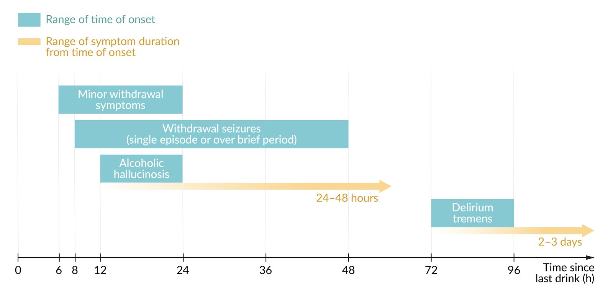

# Alcohol withdrawal

*Categories: Clinical knowledge > Emergency medicine > Neurologic disorders > Alcohol withdrawal*

[Original Article Link](https://coursology-qbank.com/amboss/article/Jq0szS)

---

## Summary

<u>Alcohol</u> withdrawal syndrome (AWS) refers to the excitatory state that develops after a sudden cessation of or reduction in <u>alcohol</u> consumption following a period of prolonged <u>heavy drinking</u>. It is characterized by a variety of clinical features, including <u>tremor</u>, <u>insomnia</u>, <u>anxiety</u>, and <u>autonomic instability</u>. AWS is considered to be complicated if patients present with or develop <u>alcohol withdrawal seizures</u>, <u>alcohol withdrawal delirium</u>, or <u>alcohol-induced psychotic disorder</u>. AWS is a <u>clinical diagnosis</u> of exclusion based on characteristic symptoms in at-risk patients with recent reduction or cessation of <u>alcohol</u> consumption. Patients with AWS may also present with concomitant diseases that require treatment (e.g., <u>alcoholic hepatitis</u>, complicated <u>cirrhosis</u>) or develop AWS during periods of hospitalization for unrelated comorbidities. The management of uncomplicated and <u>complicated AWS</u> includes hydration, <u>nutritional support</u>, and <u>thiamine</u> to prevent or treat concomitant <u>Wernicke encephalopathy</u>, as well as pharmacological management with <u>benzodiazepines</u> and/or <u>anticonvulsants</u> to reduce symptoms and prevent disease progression and <u>death</u>. Most patients require hospital admission for monitoring and treatment.

---

## Definitions

A transient excitatory state caused by a sudden cessation of or reduction in <u>alcohol</u> consumption after a prolonged period of <u>heavy drinking</u>

References [[1]](https://coursology-qbank.com/amboss/article/KRbULt)[[2]](https://coursology-qbank.com/amboss/article/HIXKVz)

---

## Clinical features

AWS is typically described as the progression through the stages of <u>alcohol</u> withdrawal, from minor to severe withdrawal with or without complicated disease. Not all patients progress through all of the stages of AWS, especially elderly patients and/or patients taking hypnotic or <u>anxiolytic</u> medications.

### <u>Alcohol</u> withdrawal syndrome (uncomplicated) [[2]](https://coursology-qbank.com/amboss/article/HIXKVz)[[3]](https://coursology-qbank.com/amboss/article/DvY1Xr)

* Onset: : usually 6–24 hours after cessation of or reduction in <u>alcohol</u> consumption [[2]](https://coursology-qbank.com/amboss/article/HIXKVz)

* Clinical features: can appear on a spectrum of severity from mild to severe (see “Classification”)

* Autonomic symptoms (e.g., <u>palpitations</u>, sweating, <u>tachycardia</u>, <u>elevated blood pressure</u>, <u>hyperthermia</u>)

* <u>Anxiety</u>, <u>insomnia</u>, vivid dreams

* <u>Tremor</u>, <u>hyperreflexia</u>

* <u>Headaches</u>

* <u>Anorexia</u>, <u>nausea</u>, <u>vomiting</u>

### Alcohol withdrawal seizures [[2]](https://coursology-qbank.com/amboss/article/HIXKVz)[[3]](https://coursology-qbank.com/amboss/article/DvY1Xr)

* Onset: : usually 8–48 hours after cessation of or reduction in <u>alcohol</u> consumption  [[2]](https://coursology-qbank.com/amboss/article/HIXKVz)

* Clinical features

* Usually brief, generalized <u>tonic-clonic</u> <u>seizures</u>

* Often a single episode

> [!TIP]
> Withdrawal <u>seizures</u> may occur without prior significant features of AWS and may be the presenting symptom in some patients.

### Alcohol-induced psychotic disorder (<u>alcoholic hallucinosis</u>) [[2]](https://coursology-qbank.com/amboss/article/HIXKVz)[[3]](https://coursology-qbank.com/amboss/article/DvY1Xr)

* Onset: : usually 12–24 hours after cessation of or reduction in <u>alcohol</u> consumption [[2]](https://coursology-qbank.com/amboss/article/HIXKVz)

* Clinical features

* Consciousness is usually intact.

* <u>Vital signs</u> may be normal.

* Auditory and/or visual <u>hallucinations</u> are common;  (<u>tactile hallucinations</u> are also possible).

* <u>Delusions</u>

* Duration: 24–48 hours after onset [[2]](https://coursology-qbank.com/amboss/article/HIXKVz)

> [!NOTE]
> It may be challenging to distinguish <u>alcoholic hallucinosis</u> from the <u>hallucinations</u> associated with <u>delirium</u>; patients with <u>delirium</u> usually have impaired consciousness and abnormal <u>vital signs</u>.

### Alcohol withdrawal delirium (<u>delirium tremens</u>) [[2]](https://coursology-qbank.com/amboss/article/HIXKVz)[[3]](https://coursology-qbank.com/amboss/article/DvY1Xr)

* Definition: : persistent alteration of consciousness and <u>sympathetic</u> hyperactivity due to <u>alcohol</u> withdrawal

* Onset: usually 72–96 hours after cessation of or reduction in <u>alcohol</u> consumption

* Clinical features

* Symptoms of <u>altered mental status</u> 

* Impaired consciousness and <u>disorientation</u>

* Visual and <u>tactile hallucinations</u> (usually small moving objects, e.g., mice, crawling insects), oneirism (a condition characterized by <u>visual hallucinations</u>, typically experienced during a waking state, that are dreamlike and rich in detail)

* Increased suggestibility

* Worsening symptoms of <u>autonomic instability</u>

* <u>Tachycardia</u>

* <u>Hypertension</u>

* <u>Anxiety</u>

* <u>Nausea</u>

* Sweating

* Worsening symptoms of neurological impairment

* <u>Psychomotor agitation</u> (e.g., fidgeting, restlessness, tearfulness)

* <u>Alcohol withdrawal seizures</u> can occur during this phase.

* <u>Insomnia</u>

* Rest and <u>intention tremor</u> (first high frequency, then low frequency)

* Duration: : usually 2–3 days; may be lethal

Timeline of alcohol withdrawal symptoms

---

## Diagnosis

### Approach [[2]](https://coursology-qbank.com/amboss/article/HIXKVz)[[3]](https://coursology-qbank.com/amboss/article/DvY1Xr)

* <u>Clinical diagnosis</u>: Suspect AWS in patients with characteristic clinical features and a history of <u>alcohol use disorder</u> who have recently ceased or reduced their <u>alcohol</u> consumption (use the “<u>DSM-5 criteria for AWS</u>”).

* <u>Complicated AWS</u> should be considered if any of the following are present: 

* <u>Alcohol-induced psychotic disorder</u>: Consultation with a <u>psychiatrist</u> is advised for a workup of <u>psychotic disorders</u>.

* <u>Alcohol withdrawal delirium</u>: Patients should also fulfill the <u>DSM-5 diagnostic criteria for delirium</u>.

* <u>Alcohol withdrawal seizures</u>: Perform a <u>diagnostic workup of seizure disorders</u>.

* Additional investigations

* Order routine diagnostic studies and <u>blood alcohol concentration</u>.

* Consider additional investigations based on suspected comorbidities  and <u>differential diagnoses for substance intoxication</u>.

* Screen for <u>depressive disorder</u> and <u>suicidal ideation</u>.

> [!WARNING]
> Patients with AWS often have other disorders that also require urgent identification and treatment (e.g., <u>alcoholic hepatitis</u>, <u>sepsis</u>, <u>traumatic brain injury</u>, <u>Wernicke encephalopathy</u>, <u>decompensated liver cirrhosis</u>).

> [!TIP]
> Individuals with chronic <u>alcohol</u> use who are hospitalized often develop <u>withdrawal symptoms</u> 48–72 hours after admission because they do not have access to <u>alcohol</u> in the hospital. Consider screening admitted patients for <u>alcohol use disorder</u> using a validated tool (e.g., <u>CAGE</u> or <u>AUDIT-C test</u>).

### Clinical diagnostic criteria [[6]](https://coursology-qbank.com/amboss/article/Nta-dm)

| DSM-5 diagnostic criteria for alcohol withdrawal syndrome |  |
| --- | --- |
| Fundamental criteria |  * Abrupt cessation of or reduction in chronic, <u>heavy alcohol use</u>   |
| Presence of ≥ 2 symptoms |   * Minor AWS features  * Autonomic hyperactivity (e.g., sweating, <u>tachycardia</u>)  * Increased hand <u>tremor</u>  * <u>Insomnia</u>  * <u>Nausea</u>/<u>vomiting</u>  * <u>Anxiety</u>  * <u>Complicated AWS</u> features  * <u>Seizures</u> (generalized <u>tonic-clonic</u>)  * <u>Psychomotor agitation</u>  * Transient <u>hallucinations</u> or <u>illusions</u> (visual, tactile, or auditory)    |
|  Symptom characteristics   |   * Produce significant <u>distress</u> or impairment (e.g., social, occupational)  * Not attributable to or better explained by another medical or mental disorder    |

### Additional investigations [[2]](https://coursology-qbank.com/amboss/article/HIXKVz)

* Routine <u>laboratory studies</u>: Laboratory alterations detected in patients with AWS are often attributable to chronic <u>alcohol use disorder</u>.

* <u>CBC</u>

* <u>BMP</u>

* Extended <u>electrolytes</u>: e.g., <u>calcium</u>, <u>magnesium</u>, <u>phosphate</u>

* <u>Liver chemistries</u>

* Other markers of <u>liver function</u>: e.g., <u>INR</u>, <u>albumin</u>

* <u>Amylase</u>, <u>lipase</u>

* <u>Blood gas analysis</u>

* <u>Blood alcohol concentration</u> (<u>BAC</u>): Symptoms that occur while <u>BAC</u> is still detectable or high carry a poor prognosis for progression to severe AWS.

* Other tests to consider [[7]](https://coursology-qbank.com/amboss/article/rzbf8w)

* Toxicological screening for suspected co-ingested substances.

* <u>Septic workup</u>

* <u>Delirium workup</u>

* <u>Neuroimaging</u>

* <u>HIV</u> and <u>hepatitis</u> screening.

* <u>PHQ-2</u> and modified SAD PERSONS scale

> [!TIP]
> Laboratory findings in AWS are usually attributable to chronic <u>alcohol use disorder</u> and tend to be mild. Marked alterations should prompt suspicion for comorbid conditions.

---

## Management

### Approach [[2]](https://coursology-qbank.com/amboss/article/HIXKVz)[[8]](https://coursology-qbank.com/amboss/article/WsXPFz)

* Anticipate and prevent <u>alcohol</u> withdrawal in at-risk patients hospitalized for other reasons.

* Classify AWS severity using a validated scale, e.g., <u>CIWA-Ar</u>.

* Perform risk assessment for AWS (to predict severe or <u>complicated AWS</u>): e.g., identify <u>red flags for alcohol withdrawal</u> and/or calculate <u>PAWSS</u> score.

* Adjust pharmacotherapy and disposition according to individual symptom severity and risk of progression (see “<u>Management algorithm for AWS</u>”).

* Consider using severity scale (e.g., <u>CIWA-Ar</u>) to monitor response to treatment.

* Identify and manage any complications without delay (see “<u>Management of complicated AWS</u>”).

* <u>Alcohol withdrawal seizures</u>: Immediately administer IV <u>benzodiazepines</u>.

* <u>Alcohol-induced psychotic disorder</u>: Consider ; low-dose <u>antipsychotics</u> (e.g., <u>haloperidol</u>; , <u>risperidone</u>) in combination with <u>benzodiazepines</u> (not as monotherapy).

* <u>Alcohol withdrawal delirium</u>: Consider referral to critical care unit for high-dose IV <u>benzodiazepines</u> and monitoring.

* Provide <u>supportive care</u> to all patients during the withdrawal episode (e.g., nutritional and metabolic support).

* Offer <u>treatment of alcohol use disorder</u>.

* Consider brief interventional <u>counseling on alcohol use disorder</u> during hospitalization.

* Provide referral for long-term therapy if the patient is interested.

> [!TIP]
> In the event of <u>alcohol withdrawal seizures</u>, <u>benzodiazepines</u> are preferred over other <u>anticonvulsants</u> to prevent further <u>seizures</u>.

### Pharmacotherapy

See “<u>Pharmacological treatment regimens for AWS</u>” for detailed recommendations and dosages.

* First-line: <u>benzodiazepines</u>

* Shorter or intermediate-acting (e.g., <u>oxazepam</u>, <u>lorazepam</u>): Consider in patients with a slow metabolism (e.g., the elderly, those with <u>liver</u> failure).

* Longer acting (e.g., <u>chlordiazepoxide</u>, <u>diazepam</u>): preferred in all other patients

* Second-line: <u>Anticonvulsants</u> can be used in AWS if there are <u>contraindications for benzodiazepines</u> or as adjunctive treatment in resistant AWS.

> [!NOTE]
> Lorazepam, Oxazepam, and Temazepam are preferred for individuals who drink a LOT (have <u>alcohol-associated liver disease</u>), because hepatic dysfunction does not have a strong effect on their metabolism. All <u>benzodiazepines</u> are metabolized by the <u>liver</u>, but these three undergo <u>biotransformation</u> through <u>glucuronidation</u>, not <u>CYP</u> 450 activation, and are less affected by <u>liver</u> disease. [[9]](https://coursology-qbank.com/amboss/article/6NYjXp)

### <u>Supportive care</u> [[2]](https://coursology-qbank.com/amboss/article/HIXKVz)

* Hydration: : Provide <u>IV fluid therapy</u> as needed and start <u>fluid balance monitoring</u>.

* Metabolic support: Assess <u>nutritional status</u> and need for <u>vitamin</u> and mineral replacement.

* Consider multivitamins.

* Provide <u>folate</u> DOSAGE for critically ill patients.  [[2]](https://coursology-qbank.com/amboss/article/HIXKVz)

* <u>Electrolyte repletion</u>: e.g., for <u>hypokalemia</u>, <u>hyponatremia</u>, or <u>hypomagnesemia</u>

* <u>Treatment of hypoglycemia</u>: oral <u>glucose</u> or IV <u>50% dextrose</u> (see also “<u>Alcoholic ketoacidosis</u>”)

* <u>Thiamine</u> supplementation 

* Patients with <u>Wernicke encephalopathy</u>: therapeutic-dose <u>thiamine</u> DOSAGE

* All other patients: prophylactic-dose <u>thiamine</u> DOSAGE

* Fixed-dose combined <u>vitamin</u> and mineral replacement (i.e., the “banana bag” approach): no longer recommended as part of routine management;  [[2]](https://coursology-qbank.com/amboss/article/HIXKVz)[[10]](https://coursology-qbank.com/amboss/article/h8Xcm-)

* Comorbidites: Treat any identified coexisting illnesses, e.g., toxic co-ingestions, <u>GI bleeding</u>, <u>sepsis</u>, <u>alcoholic hepatitis</u>, <u>pancreatitis</u>, injuries, <u>depression</u>, <u>suicidality</u>

> [!WARNING]
> Do not delay <u>glucose</u> administration when indicated; evidence suggests that it is safe to administer <u>glucose</u> without prior <u>thiamine</u> supplementation. [[2]](https://coursology-qbank.com/amboss/article/HIXKVz)[[11]](https://coursology-qbank.com/amboss/article/s2btQG)

---