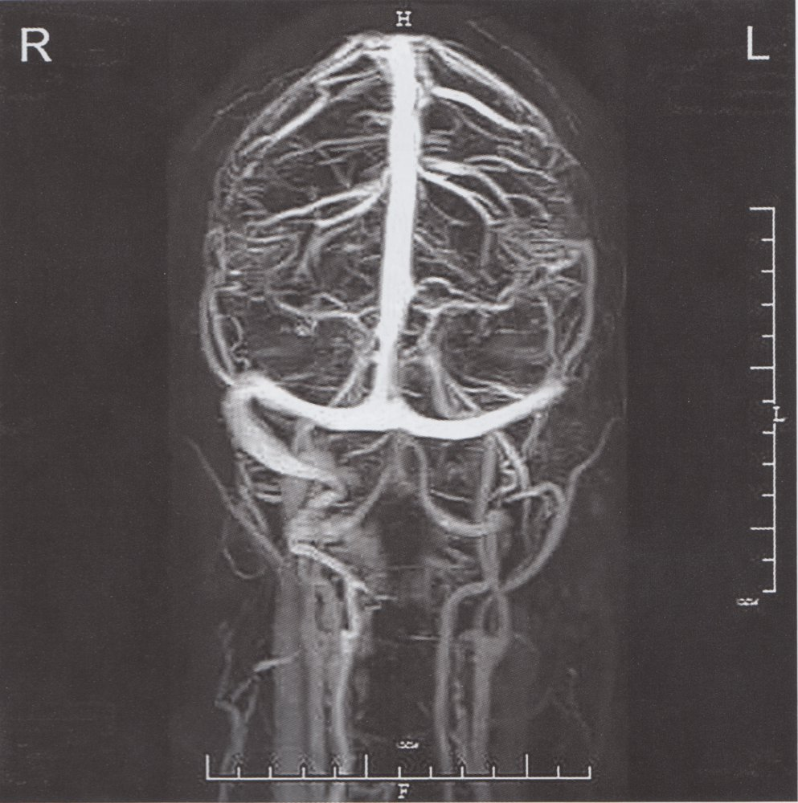
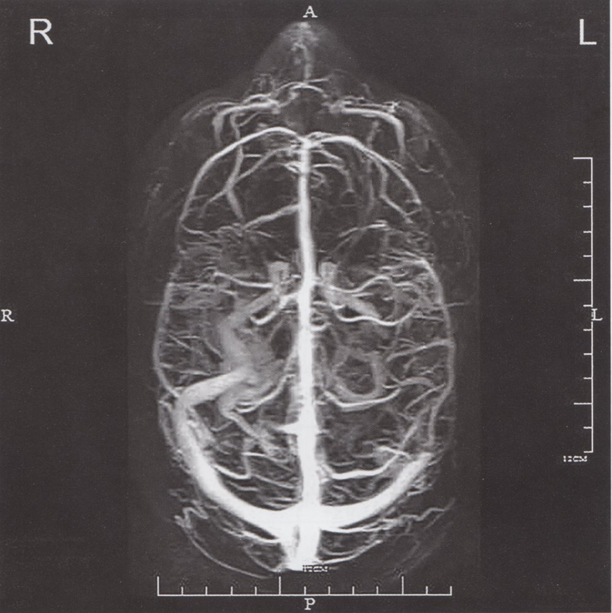
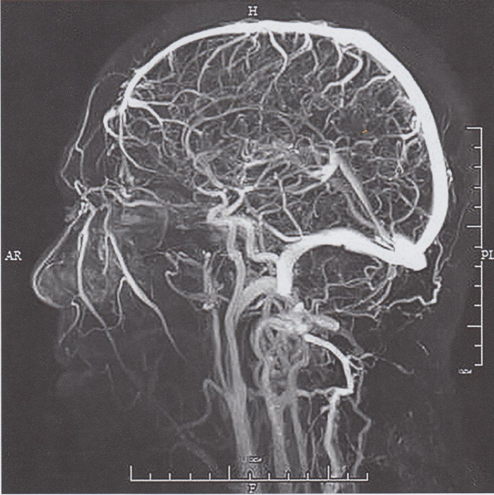
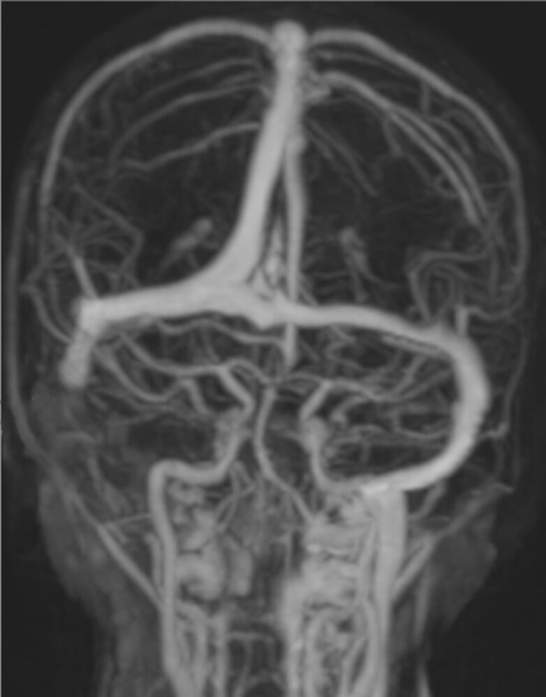
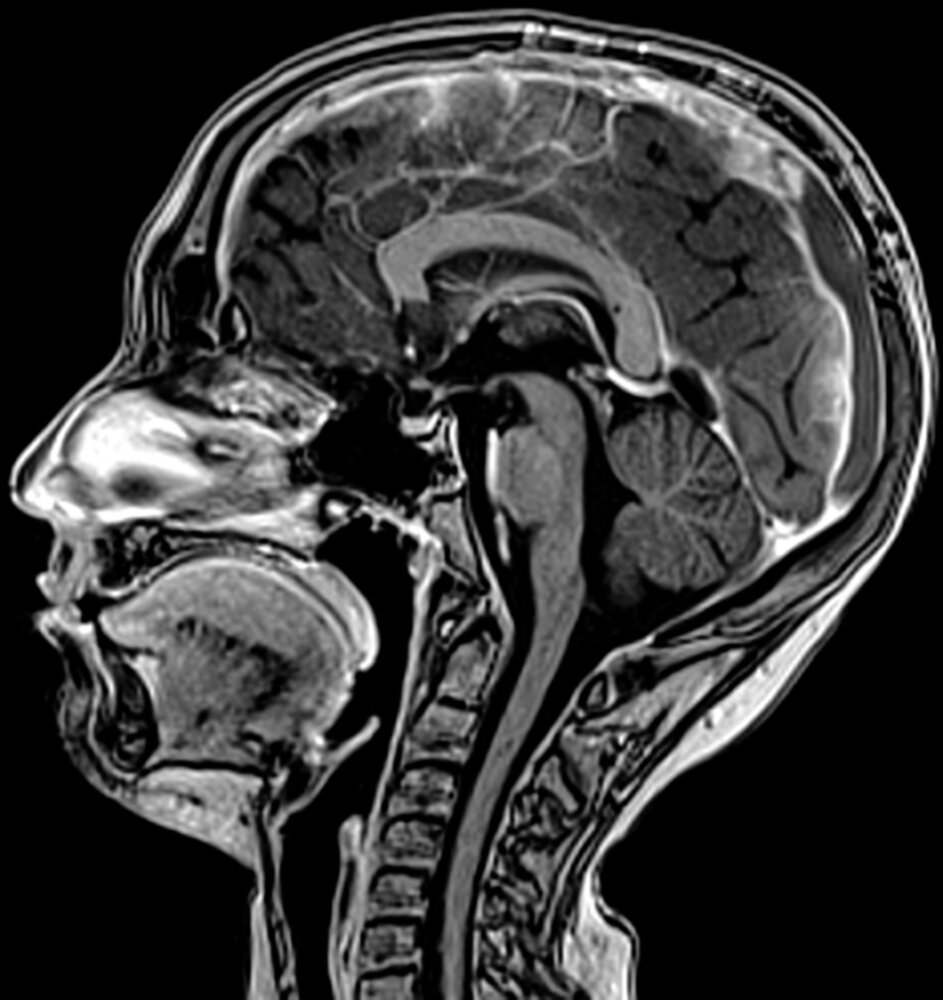
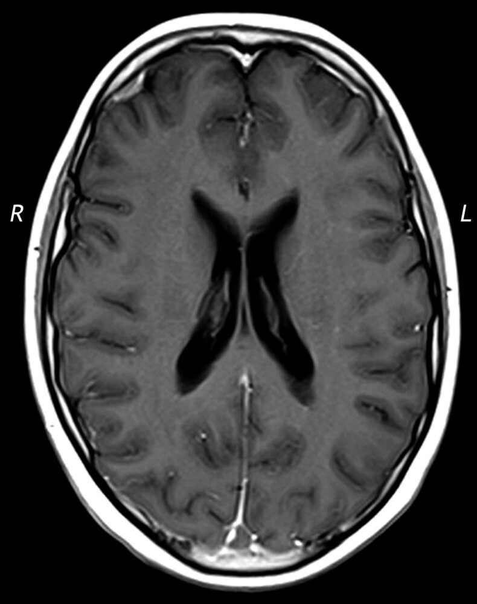

# Cerebral venous thrombosis

*Categories: Clinical knowledge > Emergency medicine > Neurologic disorders > Cerebral venous thrombosis*

[Original Article Link](https://coursology-qbank.com/amboss/article/SR0ymf)

---

## Summary

Cerebral venous <u>thrombosis</u> (CVT) is a <u>thrombotic</u> obstruction of the cerebral venous system that can lead to <u>ischemic</u> lesions (or hemorrhages) in the <u>brain</u>. The condition can occur at any age and is often associated with a <u>hypercoagulable state</u>, a trigger (e.g., delivery, <u>head injury</u>, <u>CNS</u> instrumentation) or an infection (i.e., as in <u>septic CVT</u>). Women are affected more frequently than men, possibly as a result of the additional <u>risk factors</u> of <u>pregnancy</u> and <u>oral contraceptive</u> use. <u>Cavernous sinus thrombosis</u> is a rare subset of CVT that is most often due to infections in the paranasal region. <u>Headache</u> is the most common symptom of CVT and, depending on the size and location of the clot, may be accompanied by visual impairment, <u>focal neurological deficits</u>, <u>seizures</u>, or signs of <u>raised intracranial pressure</u>. <u>Neuroimaging</u> (<u>MRI</u> or CT <u>venography</u>) of the cerebral <u>veins</u> and <u>dural sinus</u> is used to establish the diagnosis. The mainstay of management is anticoagulation alongside the treatment of any potential underlying cause (e.g., <u>antibiotics</u> for <u>septic CVT</u>). Surgical intervention (e.g., endovascular <u>thrombolysis</u> or <u>decompressive craniectomy</u>) may be necessary in patients with significant symptoms who do not respond to anticoagulation.

Cavernous sinus thrombosis and syndrome

---

## Definitions

* Cerebral venous <u>thrombosis</u> (CVT) or cerebral venous sinus <u>thrombosis</u> (CVST): a <u>thrombotic</u> obstruction of the cerebral <u>veins</u> and/or related anatomical structures (<u>dural sinuses</u>) which drain blood from the <u>brain</u>. Common subtypes include <u>transverse sinus</u> <u>thrombosis</u> and <u>superior sagittal sinus</u> <u>thrombosis</u>. [[1]](https://coursology-qbank.com/amboss/article/95YNmp)

* Septic cerebral venous thrombosis: a subtype of CVT of infectious origin (see “Etiology”).

* Cavernous sinus thrombosis: a rare subtype of CVT, typically <u>septic</u> in origin, that is associated with <u>cavernous sinus syndrome</u>.

---

## Etiology

### Noninfectious [[2]](https://coursology-qbank.com/amboss/article/HP0KTT)[[5]](https://coursology-qbank.com/amboss/article/6P0jfT)[[6]](https://coursology-qbank.com/amboss/article/JP0sfT)[[7]](https://coursology-qbank.com/amboss/article/IP0YTT)

* <u>Hypercoagulable states</u>

* <u>Oral contraceptives</u>, <u>pregnancy</u>, and <u>postpartum period</u>

* Blood clotting disorders (e.g., <u>factor V Leiden</u>, <u>protein C deficiency</u>, <u>protein S deficiency</u>, <u>antiphospholipid syndrome</u>)

* Hematologic diseases (e.g., <u>polycythemia</u>, sickle-cell <u>anemia</u>)

* Malignancies

* <u>Head trauma</u>

* Neurosurgical procedures (e.g., <u>lumbar puncture</u>)

* Additional associated systemic conditions 

* <u>Inflammatory bowel disease</u> (e.g., <u>Crohn's disease</u>)

* <u>Collagen vascular diseases</u> and blood vessel disorders (e.g., <u>lupus</u> erythematosus, <u>granulomatosis with polyangiitis</u>, <u>temporal arteritis</u>)

* <u>Hyperhomocysteinemia</u>

* Hematologic conditions (e.g., <u>paroxysmal nocturnal hemoglobinuria</u>, <u>thrombotic thrombocytopenic purpura</u>, <u>sickle cell disease</u>)

* <u>Nephrotic syndrome</u>

* <u>Dehydration</u>

### Infectious [[2]](https://coursology-qbank.com/amboss/article/HP0KTT)[[7]](https://coursology-qbank.com/amboss/article/IP0YTT)[[8]](https://coursology-qbank.com/amboss/article/v5YANp)

* Rhinogenic (e.g., after <u>sinusitis</u> - paranasal, <u>sphenoid</u>, maxillary, and <u>ethmoid</u>)

* Mid-facial infections (<u>cellulitis</u> or <u>abscess</u>)

* Dental infections

* Otogenic (e.g., after <u>acute otitis media</u>) → generally infection of the <u>lateral sinuses</u> (transverse/sigmoid sinuses) or <u>mastoiditis</u>

* <u>Meningitis</u>

* <u>Pharyngitis</u>

* <u>Tonsillitis</u>

* Orbital and <u>periorbital cellulitis</u>

References:[[2]](https://coursology-qbank.com/amboss/article/HP0KTT)[[5]](https://coursology-qbank.com/amboss/article/6P0jfT)[[6]](https://coursology-qbank.com/amboss/article/JP0sfT)[[7]](https://coursology-qbank.com/amboss/article/IP0YTT)[[8]](https://coursology-qbank.com/amboss/article/v5YANp)

---

## Pathophysiology

* Thrombogenesis occurs in the cerebral venous system, including the <u>dural sinuses</u>  → ↓ cerebral drainage → ↑ <u>intracranial pressure</u> → clinical features; ;  (see below) [[5]](https://coursology-qbank.com/amboss/article/6P0jfT)[[7]](https://coursology-qbank.com/amboss/article/IP0YTT)

* Additionally, <u>thrombus formation</u> → congestion within the venous system of the <u>brain</u> → blood stasis → ↓ oxygenated blood in <u>brain</u> tissue → <u>cerebral edema</u> and/or <u>infarcts</u>/<u>stroke</u> [[7]](https://coursology-qbank.com/amboss/article/IP0YTT)

---

## Clinical features

Symptoms vary depending on the size and location of the <u>thrombosis</u>. They are often nonspecific and may be masked by the underlying disorder(s), necessitating a high degree of clinical suspicion. Patients may have any <u>symptoms of increased ICP</u> or cerebral <u>ischemia</u>. [[2]](https://coursology-qbank.com/amboss/article/HP0KTT)[[9]](https://coursology-qbank.com/amboss/article/gXbFxH)[[10]](https://coursology-qbank.com/amboss/article/kXbmyH)

* <u>Headache</u> [[11]](https://coursology-qbank.com/amboss/article/euYxJI)

* Most common symptom (∼ 90% of patients)

* Acute, subacute, or chronic

* May progress in severity over days or weeks

* Signs associated with <u>intracranial hypertension</u>

* Bilateral <u>papilledema</u>

* <u>Vision</u> impairment (<u>diplopia</u>, <u>vision loss</u>)

* <u>Nausea and vomiting</u>

* Impaired <u>level of consciousness</u>

* <u>Seizures</u> (focal or generalized)  [[12]](https://coursology-qbank.com/amboss/article/4Rb3Mt)

* Signs of <u>cranial nerve</u> dysfunction, including: [[9]](https://coursology-qbank.com/amboss/article/gXbFxH)[[10]](https://coursology-qbank.com/amboss/article/kXbmyH)

* <u>Diplopia</u>, <u>tinnitus</u>, unilateral <u>deafness</u>, <u>facial palsy</u>

* <u>Cavernous sinus syndrome</u>

* Other <u>focal neurological symptoms</u>

* Behavioral changes (e.g., <u>delirium</u>, <u>amnesia</u>)

> [!TIP]
> Since the <u>thrombus</u> develops gradually, clinical symptoms usually appear progressively and vary in magnitude.

---

## Diagnosis

Diagnosis of CVT is based on <u>neuroimaging</u> with <u>venography</u>. <u>Laboratory studies</u> can help identify underlying conditions (e.g., infections) and to assess baseline organ function prior to therapy. [[11]](https://coursology-qbank.com/amboss/article/euYxJI)

### <u>Neuroimaging</u> [[11]](https://coursology-qbank.com/amboss/article/euYxJI)[[13]](https://coursology-qbank.com/amboss/article/OXbIyH)[[14]](https://coursology-qbank.com/amboss/article/8DYOTr)

* Preferred modalities

* <u>MRI</u> head with <u>MR venography</u> (<u>MRV</u>): modality of choice (highest <u>sensitivity</u>)   [[15]](https://coursology-qbank.com/amboss/article/2XbTxH)[[16]](https://coursology-qbank.com/amboss/article/u1bpis)

* CT head with CT <u>venography</u> (CTV): if <u>MRI</u> is unavailable or is contraindicated

* Findings: Typically similar in CTV and <u>MRV</u>

* Absence of flow in <u>venography</u> (Evidenced by filling defect in a <u>vein</u> or sinus)

* Intraluminal <u>venous thrombus</u>

* Focal <u>edema</u> secondary to <u>ischemia</u>

* <u>Intraparenchymal hemorrhage</u>

* Empty delta sign

* A radiological finding in <u>contrast-enhanced CT</u>/<u>MRI</u> that resembles the Greek letter delta (Δ)

* Consists of a central <u>hypodensity</u> (representing the <u>thrombus</u>) with a triangular outline of <u>contrast enhancement</u>

* May be seen in cerebral venous <u>thrombosis</u> of the <u>superior sagittal sinus</u>.

* Additional modalities

* <u>Direct cerebral venography</u>: if <u>MRV</u>/CTV are inconclusive or for procedural planning. Findings include filling defects  and venous congestion

* Noncontrast head CT 

* Normal in 70% of patients with CVT [[11]](https://coursology-qbank.com/amboss/article/euYxJI)

* The <u>thrombus</u> may appear as a <u>hyperdense</u> <u>vein</u> or sinus.

* <u>Hypodense</u> <u>ischemic</u> area of <u>brain</u> <u>parenchyma</u> with/without a hemorrhagic component

Sigmoid sinus thrombosis (1/3)

Sigmoid sinus thrombosis (2/3)

Sigmoid sinus thrombosis (3/3)

Cerebral venous sinus thrombosis

Sinus vein thrombosis

Superior sagittal sinus thrombosis (1/2)

Superior sagittal sinus thrombosis (2/2)

### Additional evaluation [[9]](https://coursology-qbank.com/amboss/article/gXbFxH)[[11]](https://coursology-qbank.com/amboss/article/euYxJI)[[13]](https://coursology-qbank.com/amboss/article/OXbIyH)

* Routine <u>laboratory studies</u>

* <u>D-dimer</u>

* Typically elevated in acute disease

* Normal levels indicate a lower <u>probability</u> for CVT but do not exclude the diagnosis.  [[11]](https://coursology-qbank.com/amboss/article/euYxJI)[[17]](https://coursology-qbank.com/amboss/article/TXb6xH)

* <u>CBC</u>  [[18]](https://coursology-qbank.com/amboss/article/dhbo1t)

* Baseline <u>renal function tests</u>

* <u>Coagulation studies</u>

* Additional studies to consider: to evaluate underlying etiology or complications

* <u>CRP</u> and <u>blood cultures</u>  [[19]](https://coursology-qbank.com/amboss/article/qZbCcH)

* <u>Lumbar puncture</u>  [[11]](https://coursology-qbank.com/amboss/article/euYxJI)

* <u>ESR</u> and <u>antibody</u> studies

* <u>Liver function</u> tests  [[9]](https://coursology-qbank.com/amboss/article/gXbFxH)

* <u>Thrombophilia screening</u>: see “Diagnostics” in <u>hypercoagulable states</u>  [[11]](https://coursology-qbank.com/amboss/article/euYxJI)[[13]](https://coursology-qbank.com/amboss/article/OXbIyH)

* Individual decision based on <u>pretest probability</u> (e.g., positive <u>family history</u>, young age)

* Should be initiated 2–4 weeks after anticoagulation is discontinued, not during the acute phase

* <u>EEG</u>: if <u>seizures</u> are present

* Determines <u>seizure</u> focus

* May show focal abnormalities if a unilateral <u>infarct</u> occurs

---

## Treatment

Initial management consists of general stabilization procedures (control of <u>seizures</u>, administration of fluids, treatment of <u>intracranial hypertension</u>) and treatment of the underlying cause. All patients require anticoagulation, and those with underlying infection require <u>antimicrobial therapy</u>. Surgical intervention should be considered if there is no improvement with medical therapy.

### Medical management [[11]](https://coursology-qbank.com/amboss/article/euYxJI)[[13]](https://coursology-qbank.com/amboss/article/OXbIyH)

* Anticoagulation: indicated for all patients with CVT (<u>intracerebral hemorrhage</u> and underlying infection are not <u>absolute contraindications</u>)   [[8]](https://coursology-qbank.com/amboss/article/v5YANp)[[11]](https://coursology-qbank.com/amboss/article/euYxJI)[[13]](https://coursology-qbank.com/amboss/article/OXbIyH)[[20]](https://coursology-qbank.com/amboss/article/igbJEG)

* Acute phase

* First line: <u>low molecular weight heparin</u> (<u>LMWH</u>): e.g., <u>Enoxaparin</u> DOSAGE

* Second-line: <u>unfractionated heparin</u> DOSAGE

* Long-term anticoagulation: Transition to <u>vitamin K</u> <u>antagonists</u>, e.g., <u>warfarin</u> DOSAGE, while in-hospital.  [[11]](https://coursology-qbank.com/amboss/article/euYxJI)[[13]](https://coursology-qbank.com/amboss/article/OXbIyH)[[21]](https://coursology-qbank.com/amboss/article/ehbx1t)
* Duration of treatment: 3–12 months  [[15]](https://coursology-qbank.com/amboss/article/2XbTxH)

* <u>Empiric antibiotic therapy</u>: only indicated for suspected <u>septic CVT</u> (see also <u>empiric antibiotic therapy for bacterial meningitis</u>).

* Sample regimen: combination therapy including an antistaphylococcal agent   [[22]](https://coursology-qbank.com/amboss/article/3XbSBH)

* <u>Vancomycin</u> DOSAGE [[23]](https://coursology-qbank.com/amboss/article/MRbMnt)

* PLUS a third- or fourth-generation <u>cephalosporin</u>, e.g., <u>ceftriaxone</u> DOSAGE

* PLUS <u>metronidazole</u> DOSAGE for anaerobic coverage

* Duration of treatment: 3–4 weeks (tailored to clinical response) [[22]](https://coursology-qbank.com/amboss/article/3XbSBH)

* <u>Antifungals</u>

* CVT is rarely caused by fungal infection.

* <u>Immunosuppression</u> (e.g., <u>neutropenia</u>, <u>diabetes mellitus</u>) is the most important <u>risk factor</u>. [[24]](https://coursology-qbank.com/amboss/article/2WbTks)[[25]](https://coursology-qbank.com/amboss/article/fWbkks)

* Initial treatment option: <u>amphotericin B</u> DOSAGE  [[8]](https://coursology-qbank.com/amboss/article/v5YANp)[[26]](https://coursology-qbank.com/amboss/article/4Xb3yH)

* <u>Supportive care</u>

* <u>Fluid resuscitation</u>

* <u>Neuroprotective measures</u>

* <u>ICP management</u>

* Consider <u>anticonvulsants</u>: Indicated in patients with a <u>seizure</u> and <u>supratentorial</u> lesions on imaging, otherwise not routinely recommended.  [[11]](https://coursology-qbank.com/amboss/article/euYxJI)[[13]](https://coursology-qbank.com/amboss/article/OXbIyH)

* Consider <u>corticosteroids</u> in the following:

* Treating other complications, e.g., <u>hypopituitarism</u>

* Treating underlying conditions: e.g., <u>corticosteroids</u> for or <u>Behcet disease</u>.

* Highly controversial: reducing <u>vasogenic edema</u>  [[11]](https://coursology-qbank.com/amboss/article/euYxJI)[[13]](https://coursology-qbank.com/amboss/article/OXbIyH)

### Invasive procedures [[11]](https://coursology-qbank.com/amboss/article/euYxJI)[[13]](https://coursology-qbank.com/amboss/article/OXbIyH)

* Endovascular interventions

* Indications

* Absolute <u>contraindications to anticoagulation</u>

* Significant symptoms  despite anticoagulation

* Procedures

* Endovascular <u>thrombolysis</u>

* <u>Catheter thrombectomy</u>

* <u>Surgery</u>

* Indications

* Progressive neurological worsening (despite adequate anticoagulation), e.g., visual loss, <u>signs of ↑ ICP</u> or <u>cerebral herniation syndrome</u>

* <u>Purulent</u> collections requiring drainage

* Procedures   [[27]](https://coursology-qbank.com/amboss/article/SWbyks)

* <u>Decompressive craniectomy</u>

* <u>Hematoma</u> evacuation

* Shunt placement

* <u>Abscess</u> drainage

---