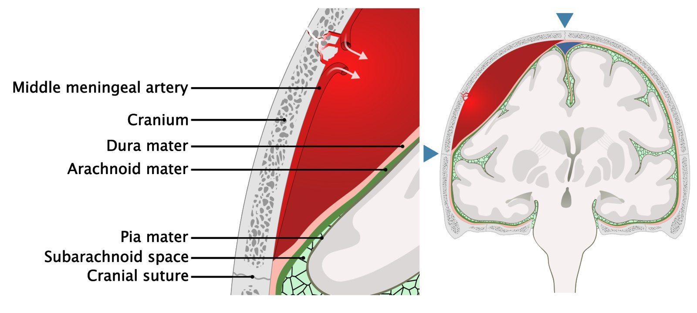
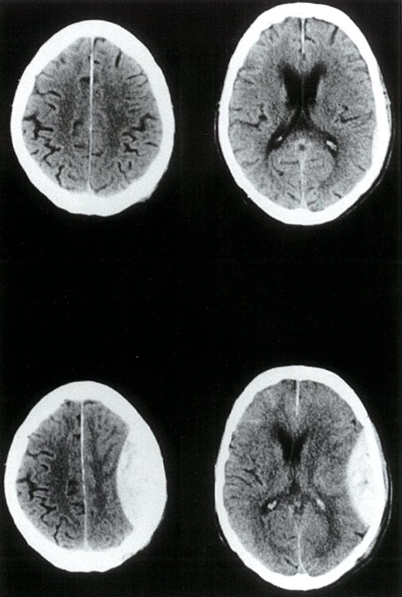

# Epidural hematoma

*Categories: Clinical knowledge > Emergency medicine > Neurologic disorders > Epidural hematoma*

[Original Article Link](https://coursology-qbank.com/amboss/article/VR0GNf)

---

## Summary

Intracranial epidural <u>hematoma</u> (EDH) refers to bleeding between the <u>dura mater</u> and the <u>calvarium</u>. Most cases of EDH are traumatic, resulting from a <u>head injury</u> with an associated <u>skull fracture</u> that ruptures or tears the <u>middle meningeal artery</u>, which lies in close proximity to the <u>skull</u> and <u>dura mater</u>. EDH is more common in individuals 20–30 years of age, as the <u>dura mater</u> is not yet densely adherent to the <u>calvarium</u> at this age. The classic manifestation of EDH is an initial <u>loss of consciousness</u>, followed by a <u>lucid interval</u> in which the patient gains normal or near-normal consciousness, followed by rapid neurological decline. An <u>ipsilateral</u> <u>dilated pupil</u> (<u>anisocoria</u>) and <u>contralateral</u> <u>hemiparesis</u> are manifestations of <u>transtentorial uncal herniation</u> and signal imminent neurological decline. <u>Neuroprotective measures</u> to prevent <u>secondary brain injury</u> take precedence over diagnostic tests. Diagnosis is confirmed on a noncontrast CT head, on which EDH appears as a biconvex, <u>hyperdense</u> lesion, typically in the temporal or temporoparietal region. Surgical decompression with <u>craniotomy</u> is indicated in patients with large EDH, <u>GCS</u> ≤ 8, and evidence of neurological deterioration. Small, asymptomatic EDH in patients with <u>GCS</u> > 8 can be <u>managed conservatively</u> with close observation and serial <u>CT scanning</u>. The prognosis depends on several factors, including the <u>GCS</u> at presentation, size of the EDH, and, crucially, the time from the onset of <u>brain herniation</u> to decompressive <u>surgery</u>. Early intervention in patients with signs of <u>brain herniation</u> is associated with good neurological outcomes and lower <u>mortality rates</u>.

For epidural <u>hematoma</u> limited to the <u>spine</u>, see “<u>Spinal epidural hematoma</u>.”

---

## Definitions

* Hemorrhage into the intracranial <u>epidural space</u>, which lies between the <u>dura mater</u> and the inner table of the <u>skull</u> or <u>calvarium</u> [[1]](https://coursology-qbank.com/amboss/article/35YSPp)[[2]](https://coursology-qbank.com/amboss/article/26bT4u)

---

## Epidemiology

* <u>Incidence</u>: occurs in approx. 10% of patients with moderate to <u>severe traumatic brain injury</u> (<u>TBI</u>)  [[3]](https://coursology-qbank.com/amboss/article/ZyYZd7)[[4]](https://coursology-qbank.com/amboss/article/b6bHju)

* Sex: <u>♂</u> > <u>♀</u> (4:1)

* Age [[4]](https://coursology-qbank.com/amboss/article/b6bHju)

* Most commonly seen in individuals between 20–30 years

* Uncommon in individuals older than 50 years of age

Epidemiological data refers to the US, unless otherwise specified.

---

## Etiology

### Inciting event

* Traumatic EDH

* <u>Head injury</u> (most common; e.g., due to <u>motor vehicle accidents</u>, falls, assault) [[2]](https://coursology-qbank.com/amboss/article/26bT4u)

* Traumatic removal of <u>epidural catheter</u> (especially in patients taking anticoagulation medication)

* Nontraumatic EDH (rare) [[5]](https://coursology-qbank.com/amboss/article/c6baPu)[[6]](https://coursology-qbank.com/amboss/article/16b2Pu)

* Infections

* Coagulopathies

* Dural vascular <u>malformation</u>

* Dural <u>metastases</u>

### Source of hemorrhage [[2]](https://coursology-qbank.com/amboss/article/26bT4u)[[7]](https://coursology-qbank.com/amboss/article/tobXdu)

* Arterial EDH

* Source: <u>middle meningeal artery</u> rupture or tear (a branch of the maxillary <u>artery</u> and the most common source of hemorrhage in EDH)  [[2]](https://coursology-qbank.com/amboss/article/26bT4u)

* Sites of rupture  [[2]](https://coursology-qbank.com/amboss/article/26bT4u)[[8]](https://coursology-qbank.com/amboss/article/hobcbu)

* <u>Pterion</u> (most common): the thinnest part of the <u>skull</u> and a site at which the <u>middle meningeal artery</u> lies in close proximity to the <u>skull</u>  [[4]](https://coursology-qbank.com/amboss/article/b6bHju)

* <u>Skull base</u> (<u>foramen spinosum</u>)

* Venous EDH (rare)

* Source

* Middle meningeal <u>vein</u> rupture or tear

* <u>Dural venous sinus</u> injury

* Rupture of a dural vascular <u>malformation</u>

* Sites of rupture [[7]](https://coursology-qbank.com/amboss/article/tobXdu)

* <u>Posterior fossa</u> (injury to the <u>transverse sinus</u>, sigmoid sinus, or confluence of venous sinuses)

* <u>Middle cranial fossa</u> (sphenoparietal sinus injury)

* Vertex (<u>superior sagittal sinus</u> injury)

---

## Pathophysiology

* <u>Head trauma</u> (usually severe) → <u>skull</u> <u>fracture</u> → rupture of <u>middle meningeal artery</u> (most common) → hemorrhage into the <u>epidural space</u>, typically in the temporal or temporoparietal region   [[2]](https://coursology-qbank.com/amboss/article/26bT4u)[[9]](https://coursology-qbank.com/amboss/article/oFY0QI)

* Venous shunting of blood out from the <u>epidural space</u> and initial asymptomatic compression of the <u>anterior</u> <u>temporal lobe</u> → <u>lucid interval</u> [[2]](https://coursology-qbank.com/amboss/article/26bT4u)[[10]](https://coursology-qbank.com/amboss/article/v50ANg)

* Continued expansion of EDH → <u>increased intracranial pressure</u> → <u>transtentorial uncal herniation</u> (<u>Monro-Kellie principle</u>) which leads to: [[2]](https://coursology-qbank.com/amboss/article/26bT4u)

* Compression of the <u>ipsilateral</u> <u>oculomotor nerve</u> and loss of <u>parasympathetic</u> supply to the <u>pupillary sphincter</u> → <u>ipsilateral</u> <u>dilated pupil</u> (<u>anisocoria</u>)

* Compression of the <u>brain stem</u> → rapid neurological decline, <u>Cushing triad</u>, and either of the following:

* Compression of <u>ipsilateral</u> <u>cerebral peduncle</u> (more common) → <u>contralateral</u> <u>hemiparesis</u>

* Compression of the <u>contralateral</u> <u>cerebral peduncle</u> against the <u>contralateral</u> tentorial edge (less common) → <u>ipsilateral</u> <u>hemiparesis</u> (<u>false localizing sign</u> known as <u>Kernohan syndrome</u>)

* Unrelieved <u>brain stem</u> compression → <u>coma</u> and <u>death</u>

Pathophysiology of an epidural hematoma

---

## Clinical features

The features of EDH depend on the size and location of the <u>hematoma</u>. The majority of patients have an associated <u>skull fracture</u>.

* Classic presentation of EDH [[2]](https://coursology-qbank.com/amboss/article/26bT4u)[[10]](https://coursology-qbank.com/amboss/article/v50ANg)
1. * Initial <u>loss of consciousness</u> immediately following a <u>head injury</u>
2. * Temporary recovery of consciousness with return to normal or near-normal neurological function (lucid interval): in 20–50% of patients with EDH  [[11]](https://coursology-qbank.com/amboss/article/zNbrd8)[[12]](https://coursology-qbank.com/amboss/article/qobC1u)
3. * Renewed decline in neurological status and onset of symptoms caused by <u>hematoma</u> expansion and <u>mass effect</u>: 

* <u>Contralateral</u> <u>focal neurological deficits</u>

* <u>Signs of ↑ ICP</u> (e.g., <u>headache</u>, <u>Cushing triad</u>) [[13]](https://coursology-qbank.com/amboss/article/E508Ng)

* <u>Pupillary</u> abnormalities (sign of <u>uncal herniation</u>) [[9]](https://coursology-qbank.com/amboss/article/oFY0QI)

* <u>Anisocoria</u> with <u>ipsilateral</u> <u>mydriasis</u> (most common)

* Unilateral or bilateral <u>fixed dilated pupils</u>

* Potentially <u>contralateral</u> or bilateral <u>mydriasis</u>

* Signs of <u>cerebral herniation syndromes</u>

* <u>Coma</u>, <u>death</u>

* Signs of associated <u>skull fractures</u>;  (e.g., scalp <u>hematoma</u>, <u>liquorrhea</u>, <u>CSF rhinorrhea</u>, <u>otorrhea</u>, <u>Battle sign</u>, <u>raccoon eyes</u>)

* See also “Clinical features” in “<u>Traumatic brain injury</u>.”

> [!TIP]
> A <u>lucid interval</u> is seen in up to 50% of patients with EDH. [[11]](https://coursology-qbank.com/amboss/article/zNbrd8)[[12]](https://coursology-qbank.com/amboss/article/qobC1u)

> [!TIP]
> The majority (70–95%) of patients with EDH have an associated <u>skull fracture</u>. [[2]](https://coursology-qbank.com/amboss/article/26bT4u)[[8]](https://coursology-qbank.com/amboss/article/hobcbu)

> [!WARNING]
> Neurological decline following a <u>lucid interval</u> can be rapid (“talk and deteriorate”) and fatal without urgent intervention. [[14]](https://coursology-qbank.com/amboss/article/B50zmg)[[15]](https://coursology-qbank.com/amboss/article/3pbS6u)

---

## Diagnosis

### General principles [[1]](https://coursology-qbank.com/amboss/article/35YSPp)[[3]](https://coursology-qbank.com/amboss/article/ZyYZd7)

* Follow trauma protocols for patients with traumatic EDH

* Immediate initiation of <u>neuroprotective measures</u> takes precedence over diagnostics.

* Diagnostics should not delay transfer to a <u>neurocritical care unit</u> if needed.

* See “<u>Initial management of TBI</u>” for details.

* CT head without IV contrast is the first-line imaging modality for all patients with suspected EDH.

* Imaging should not delay transfer for neurosurgical care in patients who already meet the criteria for intervention. [[3]](https://coursology-qbank.com/amboss/article/ZyYZd7)

* In cases of rapidly declining neurological status or evidence of <u>brain herniation</u>, consider emergency temporizing <u>surgery</u> even in the absence of confirmatory imaging (see “Definitive management of EDH” below). [[14]](https://coursology-qbank.com/amboss/article/B50zmg)[[16]](https://coursology-qbank.com/amboss/article/-pbDHu)

### Imaging [[7]](https://coursology-qbank.com/amboss/article/tobXdu)[[17]](https://coursology-qbank.com/amboss/article/CNbqW8)

#### CT head without IV contrast

* Indications: first-line imaging in patients with suspected acute EDH

* Characteristic findings

* Biconvex (lenticular shaped), sharply demarcated <u>extraaxial lesion</u>

* Typically <u>hyperdense</u> in appearance  [[7]](https://coursology-qbank.com/amboss/article/tobXdu)[[18]](https://coursology-qbank.com/amboss/article/Fobgdu)[[19]](https://coursology-qbank.com/amboss/article/vobAdu)

* Limited by suture lines

* Common locations

* Arterial EDH: temporal or temporoparietal region  [[7]](https://coursology-qbank.com/amboss/article/tobXdu)[[9]](https://coursology-qbank.com/amboss/article/oFY0QI)[[20]](https://coursology-qbank.com/amboss/article/8obOdu)

* Venous EDH: <u>posterior cranial fossa</u> [[7]](https://coursology-qbank.com/amboss/article/tobXdu)

* Evidence of <u>skull fracture</u>, if present

* Initial <u>CT scan</u> may be normal in patients with delayed EDH and small lesions can quickly expand in size    [[21]](https://coursology-qbank.com/amboss/article/M8bMMv)

Epidural hematoma

Cranial vault fracture with epidural hematoma

Epidural hematoma

Epidural and subdural hematomas

#### <u>MRI</u> head without IV contrast [[7]](https://coursology-qbank.com/amboss/article/tobXdu)[[17]](https://coursology-qbank.com/amboss/article/CNbqW8)

* Indications 

* Stable patients with suspected small EDH (i.e., normal or near-normal initial <u>CT scan</u>)

* Follow-up <u>neuroimaging</u> in stable patients with neurological deterioration not explained by CT findings.

* Difficulty distinguishing EDH from <u>SDH</u> on <u>CT scan</u>

* Characteristic findings

* Similar to those on <u>CT scan</u>

* Lesion would appear <u>hypointense</u> on a <u>T2-weighted</u> scan  [[7]](https://coursology-qbank.com/amboss/article/tobXdu)

#### Additional imaging

* Traumatic EDH: See “<u>Diagnostics in TBI</u>.”

* Nontraumatic EDH: Consider <u>angiography</u> if a dural vascular <u>malformation</u> is suspected. [[22]](https://coursology-qbank.com/amboss/article/xobEVu)[[23]](https://coursology-qbank.com/amboss/article/BobzVu)

* Suspected associated <u>cerebral venous sinus thrombosis</u>: Consider <u>venography</u>.  [[7]](https://coursology-qbank.com/amboss/article/tobXdu)

### <u>Laboratory studies</u>

* Traumatic EDH: See “<u>Diagnostics in TBI</u>” for routine <u>laboratory studies</u> that should be obtained in all patients with <u>TBI</u>.

* Nontraumatic EDH: <u>coagulation panel</u> and additional studies for <u>coagulopathy</u>, if suspected [[24]](https://coursology-qbank.com/amboss/article/wobhVu)[[25]](https://coursology-qbank.com/amboss/article/CobqVu)

> [!NOTE]
> Noncontrast CT of the head is essential for diagnosing epidural <u>hematoma</u>.

> [!WARNING]
> The initial <u>CT scan</u> may be normal if the bleed is slow (e.g., small arterial EDH in the <u>middle cranial fossa</u>, venous EDH). <u>Neuroimaging</u> should be repeated if there are any signs of clinical deterioration in patients with <u>neuroimaging</u> that is initially normal.

---

## Differential diagnoses

See “<u>Overview of intracranial hemorrhage</u>” for a table comparing:

* Epidural <u>hematoma</u>

* <u>Subdural hematoma</u>

* <u>Subarachnoid hemorrhage</u>

* <u>Intracerebral hemorrhage</u>

The differential diagnoses listed here are not exhaustive.

---

## Treatment

### General principles

EDH is a neurosurgical emergency, as <u>hematoma</u> expansion can rapidly lead to <u>brain herniation</u> and <u>death</u>.

* The main aspects of EDH management are:

* <u>Primary survey</u> with simultaneous initiation of <u>neuroprotective measures</u> (see “<u>Initial management of TBI</u>” for an algorithmic approach)

* Empiric <u>ICP management</u>

* Urgent <u>craniotomy</u> and <u>hematoma</u>/clot evacuation

* <u>Prevention of complications in brain injuries</u> (e.g., <u>anticoagulant reversal</u> to prevent <u>hematoma</u> expansion)

* <u>Conservative management</u> with close observation and serial <u>CT scans</u> can be considered for a small, asymptomatic EDH.

* Consider <u>skull trephination</u> (<u>burr hole surgery</u>) as a temporizing procedure in patients with neurological deterioration if neurosurgical expertise is not immediately available.

* Minimize the duration of time between the onset of neurological decline and surgical clot evacuation.

* When to restart anticoagulation and <u>antithrombotic therapy</u> should be decided on an individual basis.  [[26]](https://coursology-qbank.com/amboss/article/pFYLQI)[[27]](https://coursology-qbank.com/amboss/article/NHb-qE)[[28]](https://coursology-qbank.com/amboss/article/0Dbe1D)

* See “<u>Management of moderate and severe TBI</u>” for details on <u>anticoagulant reversal</u> and <u>seizure</u> prophylaxis.

> [!WARNING]
> Expect rapid neurological deterioration following a <u>lucid interval</u> and do not delay initiation of therapy and patient transfer to a <u>trauma center</u> or <u>neurocritical care unit</u>. [[4]](https://coursology-qbank.com/amboss/article/b6bHju)

> [!TIP]
> All patients with EDH require emergency neurosurgical consultation. If a neurosurgeon is not available on site, then transfer for definitive care is indicated.

### Definitive management of EDH

#### <u>Surgery</u> [[9]](https://coursology-qbank.com/amboss/article/oFY0QI)

* Indications: Patients fulfilling any or all of these criteria should be operated on urgently. [[4]](https://coursology-qbank.com/amboss/article/b6bHju)

* EDH volume > 30 mL (30 cm3) regardless of <u>GCS</u>

* EDH thickness > 15 mm

* Midline shift > 5 mm

* <u>GCS</u> ≤ 8

* <u>Focal neurological deficit</u>

* Evidence of neurological deterioration: <u>pupillary</u> abnormalities, signs of <u>brain herniation</u>

* Associated <u>brain</u> injuries (e.g. <u>SDH</u>, <u>depressed skull fracture</u>) that meet surgical criteria

* Timing: as soon as possible (preferably within 2 hours of <u>loss of consciousness</u> in patients with neurological deterioration and/or <u>GCS</u> ≤ 8)  [[9]](https://coursology-qbank.com/amboss/article/oFY0QI)[[29]](https://coursology-qbank.com/amboss/article/sNbtc8)[[14]](https://coursology-qbank.com/amboss/article/B50zmg)[[30]](https://coursology-qbank.com/amboss/article/d6boPu)

* Preoperative <u>antibiotic prophylaxis</u>: recommended in all patients to prevent <u>meningitis</u> (e.g., <u>cefazolin</u> DOSAGE).  [[1]](https://coursology-qbank.com/amboss/article/35YSPp)[[31]](https://coursology-qbank.com/amboss/article/BYbzrH)[[32]](https://coursology-qbank.com/amboss/article/YpbnLu)

* Procedures [[9]](https://coursology-qbank.com/amboss/article/oFY0QI)

* First-line: urgent <u>craniotomy</u>, <u>hematoma</u> evacuation, and ligation of the ruptured blood vessel

* Emergency temporizing procedure: <u>skull trephination</u>  [[14]](https://coursology-qbank.com/amboss/article/B50zmg)[[33]](https://coursology-qbank.com/amboss/article/hpbc6u) 

* Indication: suspected or confirmed EDH with <u>GCS</u> ≤ 8 and/or signs of <u>brain herniation</u> or <u>coma</u> in a facility without an on-site neurosurgeon

* Further management: urgent transfer to a <u>neurocritical care unit</u> for definitive management by a neurosurgeon  [[14]](https://coursology-qbank.com/amboss/article/B50zmg)

> [!WARNING]
> <u>Skull trephination</u> should only be considered if there is evidence of <u>brain herniation</u> or <u>coma</u> attributable to an EDH and access to definitive neurosurgical care is delayed.

#### <u>Conservative management</u>

* Indications: Absence of all indications for <u>surgery</u> (see above)  [[9]](https://coursology-qbank.com/amboss/article/oFY0QI)[[34]](https://coursology-qbank.com/amboss/article/5ZbiXH)[[35]](https://coursology-qbank.com/amboss/article/NZb-bH)

* Procedure

* Admission to <u>neuro-ICU</u> or <u>ICU</u> [[36]](https://coursology-qbank.com/amboss/article/mZbVXH)

* Frequent <u>GCS</u> monitoring and <u>neurological checks</u> for at least 72 hours  [[3]](https://coursology-qbank.com/amboss/article/ZyYZd7)[[36]](https://coursology-qbank.com/amboss/article/mZbVXH)

* Serial <u>CT scans</u> to monitor for early <u>hematoma</u> expansion [[37]](https://coursology-qbank.com/amboss/article/qFYCQI)[[37]](https://coursology-qbank.com/amboss/article/qFYCQI)[[38]](https://coursology-qbank.com/amboss/article/MZbMXH)

* If clinically stable: Repeat within 4–6 hours.

* Clinical deterioration or new neurologic deficits: Repeat immediately.

* Failure of <u>conservative management</u> (EDH progression during observation): Perform <u>craniotomy</u> and <u>hematoma</u> evacuation.  [[34]](https://coursology-qbank.com/amboss/article/5ZbiXH)[[36]](https://coursology-qbank.com/amboss/article/mZbVXH)[[37]](https://coursology-qbank.com/amboss/article/qFYCQI)[[38]](https://coursology-qbank.com/amboss/article/MZbMXH)

---