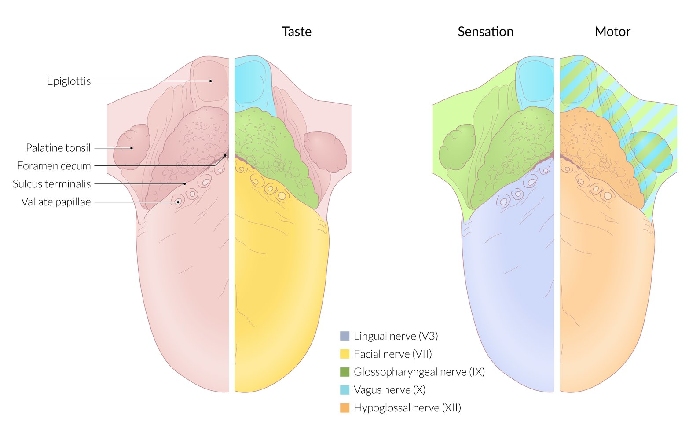
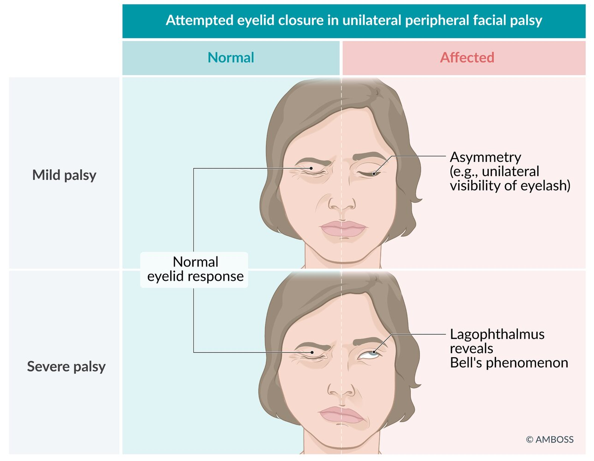

# Facial nerve palsy

*Categories: Clinical knowledge > Emergency medicine > Neurologic disorders > Facial nerve palsy*

[Original Article Link](https://coursology-qbank.com/amboss/article/FR0gKf)

---

## Summary

<u>Facial nerve</u> palsy is the partial (<u>paresis</u>) and/or total (<u>paralysis</u>) loss of <u>facial nerve</u> (<u>cranial nerve VII</u>) function. The most common cause is <u>idiopathic</u> <u>peripheral facial nerve palsy</u>, also known as <u>Bell palsy</u>. Secondary causes include trauma, infections, <u>brainstem</u> <u>stroke</u>, tumors, and metabolic disorders. Clinical features include decreased or absent movement of the facial muscles, <u>hyperacusis</u>, alterations in <u>taste</u>, and dry eyes and mouth. <u>Facial nerve</u> palsy is a <u>clinical diagnosis</u> made after obtaining a thorough history and <u>physical examination</u>, which includes assessing for <u>motor signs in central and peripheral facial palsy</u> in order to differentiate between central <u>upper motor neuron lesions</u> (e.g., as a result of <u>stroke</u>) and peripheral <u>lower motor neuron lesions</u> (e.g., <u>idiopathic</u>, or caused by infection or trauma). If a secondary cause is suspected following assessment, diagnostic studies may be performed. <u>Idiopathic peripheral facial nerve palsy</u> is treated with oral <u>glucocorticoids</u> with or without antivirals and most cases resolve within three weeks. If secondary causes are identified, the underlying cause is treated. Complications include incomplete recovery of <u>facial nerve</u> function, <u>facial synkinesis</u>, and ocular complications related to incomplete <u>eye</u> closure.

---

## Etiology

* <u>Idiopathic</u> (most common cause of <u>peripheral facial nerve palsy</u>): Acute <u>idiopathic peripheral facial palsy</u> is also known as Bell palsy. [[1]](https://coursology-qbank.com/amboss/article/jxb_wD)

* Secondary

* Trauma (e.g., <u>temporal bone fracture</u>)

* Infection 

* <u>Herpes zoster</u> (<u>Ramsay Hunt syndrome</u>)

* <u>Borreliosis</u> (<u>Lyme disease</u>)

* <u>HSV</u> reactivation

* <u>HIV</u>

* <u>Malignant otitis externa</u>

* Tumors (<u>parotid gland</u> tumors, <u>acoustic neuroma</u>)

* <u>Pregnancy</u>

* <u>Diabetes mellitus</u>

* <u>Guillain-Barré syndrome</u>

* <u>Sarcoidosis</u> (<u>Heerfordt syndrome</u>)

* <u>Amyloidosis</u>

* <u>Stroke</u>

References:[[2]](https://coursology-qbank.com/amboss/article/IaaYNQ)[[3]](https://coursology-qbank.com/amboss/article/s-atAM)[[4]](https://coursology-qbank.com/amboss/article/QxbuwD)[[5]](https://coursology-qbank.com/amboss/article/Nxb-9D)

---

## Pathophysiology

* The muscles responsible for <u>eyelid</u> and forehead movements are innervated by fibers from both sides.

* <u>Central facial palsy</u>: There is a unilateral <u>upper motor neuron lesion</u> between the cortex and <u>nuclei</u> in the <u>pons</u> (<u>corticobulbar tract</u>), but the muscles of the eyelids and forehead are still supplied by input from the other side, so function is preserved (forehead sparing).

* <u>Peripheral facial palsy</u>: There is a unilateral <u>lower motor neuron lesion</u> between the <u>nuclei</u> and muscles, which results in the <u>paralysis</u> of the <u>ipsilateral</u> <u>eyelid</u> and forehead muscles because no other input reaches these muscles.

* The lower facial muscles are only innervated by fibers from the <u>contralateral</u> hemisphere (via <u>ipsilateral</u> <u>nuclei</u> and the <u>ipsilateral</u> peripheral nerve), so they are paralyzed in both <u>central and peripheral facial palsy</u>.

Examination findings in facial nerve palsy

References:[[6]](https://coursology-qbank.com/amboss/article/tMbXq8)

---

## Clinical features

### <u>Central vs. peripheral facial nerve palsy</u> [[6]](https://coursology-qbank.com/amboss/article/tMbXq8)

| Motor signs in central and peripheral facial palsy |  |  |
| --- | --- | --- |
| Clinical feature |  Central (signs are <u>contralateral</u> to the lesion) |  Peripheral (signs are <u>ipsilateral</u> to the lesion)  |
| Ability to frown or lift eyebrows |  * Intact   |  * Impaired   |
| Ability to close the eyelids completely |  * Intact   |  * Impaired   |
|  Mouth drooping  |  * Present   |  |

### Additional signs of <u>peripheral facial palsy</u>

* Sensory disturbances

* Painful sensation around or behind <u>the ear</u>   [[6]](https://coursology-qbank.com/amboss/article/tMbXq8)

* Impairment of <u>taste</u> in the <u>anterior</u> <u>tongue</u>

* <u>Hyperacusis</u>

* Dry mouth (as a result of decreased saliva production)

* Ocular features

* Bell's phenomenon: a physiologic, reflexive movement of the <u>eye</u> (upward and outward) that occurs when the <u>eyelid</u> is actively closed

* <u>Lagophthalmos</u>: The patient cannot fully close the eyes (due to <u>paralysis</u> of the orbicular oculi muscle). [[7]](https://coursology-qbank.com/amboss/article/PxbW9D)

* Decreased <u>lacrimation</u>

* Corneal <u>ulceration</u> and <u>keratitis</u>

* <u>Ectropion</u>

* Facial synkinesis; : involuntary movements of the facial muscles;  (e.g., facial spasms while closing the eyes)

> [!NOTE]
> In <u>central facial palsy</u>, <u>paralysis</u> is <u>contralateral</u> to the lesion, and <u>eyelid</u> and forehead muscles are not affected!

Examination findings in facial nerve palsy

Peripheral right facial nerve palsy

Innervation of the tongue

Impaired eyelid closure with visible eyelashes and Bell's phenomenon in left facial paralysis

Ectropion

---

## Diagnosis

### Clinical evaluation [[8]](https://coursology-qbank.com/amboss/article/8QbOBt)[[9]](https://coursology-qbank.com/amboss/article/OxbI9D)[[10]](https://coursology-qbank.com/amboss/article/wNchW10)

<u>Bell palsy</u> is a <u>clinical diagnosis</u> of exclusion.

* <u>Medical history</u>

* Ask about symptom onset and duration (e.g., acute vs. progressive).

* Assess for possible secondary causes, e.g., <u>stroke</u>, tumors, recent infections,  and;  exposure from outdoor trips.

* <u>Physical examination</u> 

* Evaluate for facial asymmetry at rest.

* Ask the patient to perform facial movements. 

* Assess for asymmetries and facial muscle strength.

* Differentiate between <u>motor signs in central and peripheral facial palsy</u>.

* Perform a complete <u>neurological examination</u>: Look for <u>focal neurological signs</u>.

* Evaluate for signs indicative of a secondary cause, e.g., <u>shingles</u> , <u>herpes zoster oticus</u> , <u>erythema migrans</u> , <u>tick bites</u>, signs of trauma.

> [!TIP]
> Typical features of <u>Bell palsy</u> include acute (< 72 hours), nonprogressive, unilateral <u>peripheral facial nerve paralysis</u>, with no identified cause after thorough clinical evaluation. [[9]](https://coursology-qbank.com/amboss/article/OxbI9D)

> [!WARNING]
> When an acute central cause is suspected (e.g., other acute <u>focal neurological symptoms</u> are present), evaluate for <u>ischemic stroke</u>. Consider a <u>tumor</u> in patients with gradual onset, or slowly progressing neurological symptoms (e.g., <u>change in mental status</u>, involvement of select branches of the <u>facial nerve</u> and/or other <u>cranial nerves</u>, or other subacute <u>focal neurological deficits</u>). [[4]](https://coursology-qbank.com/amboss/article/QxbuwD)[[9]](https://coursology-qbank.com/amboss/article/OxbI9D)

Examination findings in facial nerve palsy

Herpes zoster oticus

Herpes zoster

Erythema migrans in stage-I Lyme disease

#### Severity assessment [[9]](https://coursology-qbank.com/amboss/article/OxbI9D)[[11]](https://coursology-qbank.com/amboss/article/dmcoe10)

* Determine the level of dysfunction of forehead movements, <u>eye</u> closure, and mouth closure.

* Consider the use of a validated severity scale.

### Diagnostic studies [[8]](https://coursology-qbank.com/amboss/article/8QbOBt)[[9]](https://coursology-qbank.com/amboss/article/OxbI9D)[[10]](https://coursology-qbank.com/amboss/article/wNchW10)

Diagnostic studies are not routinely needed for acute unilateral <u>facial nerve</u> palsy unless a secondary cause is suspected (see “Etiology”) based on atypical symptoms and/or abnormal <u>physical examination</u> findings (See “Clinical features” and “Clinical evaluation”). Specialist consultation is advised.

* <u>Laboratory studies</u>: Consider for select infectious causes.

* <u>VZV</u>: e.g., <u>PCR</u> or <u>serological studies</u> (See “<u>Diagnostics for shingles</u>.”)

* <u>Lyme disease</u>: e.g., <u>ELISA</u> <u>IgM</u> and <u>IgG antibodies</u> for <u>Borrelia</u>, <u>Western blot</u> (See “<u>Diagnostics for Lyme disease</u>.”)

* <u>Neuroimaging</u> should be performed if <u>neoplastic</u>, vascular, or traumatic causes are suspected, for example:

* Suspected peripheral nerve tumors: e.g., <u>cholesteatoma</u>, facial <u>schwannoma</u>, <u>parotid gland</u> <u>tumor</u>, <u>infratemporal fossa</u> tumors  [[9]](https://coursology-qbank.com/amboss/article/OxbI9D)

* Suspected primary <u>brain tumor</u> or <u>metastasis</u>

* Acute <u>stroke</u> (See “<u>Diagnosis of stroke</u>.”)

* <u>Traumatic brain injury</u>, e.g., <u>basilar skull fracture</u> (See also “<u>Diagnostics for TBI</u>.”)

* Other neurological studies

* Consider <u>nerve conduction studies</u>: e.g., for patients with <u>Bell palsy</u> PLUS complete <u>facial nerve</u> <u>paralysis</u>, or suspected <u>polyneuropathy</u> (e.g., <u>multiple sclerosis</u>, <u>Guillain Barré syndrome</u>)

* Consider audiology to evaluate for <u>sensorineural hearing loss</u> (<u>SNHL</u>): e.g., in patients with <u>VZV</u>, <u>TBI</u>, and suspected peripheral nerve or <u>brain tumors</u>

> [!TIP]
> Up to 25% of acute <u>facial nerve</u> palsy cases may be attributed to <u>Lyme disease</u> in highly <u>endemic</u> areas. [[9]](https://coursology-qbank.com/amboss/article/OxbI9D)

Global distribution of Lyme disease and its vectors

Lyme disease fact sheet and US endemicity map

---

## Treatment

Recommendations in this section are consistent with the 2013 American Academy of Otolaryngology-Head and Neck <u>Surgery</u> (<u>AAO-HNS</u>) <u>Bell palsy</u> guidelines and the 2012 American Academy of <u>Neurology</u> (<u>AAN</u>) guideline update on <u>steroids</u> for <u>Bell palsy</u> (reaffirmed in January 2020). [[8]](https://coursology-qbank.com/amboss/article/8QbOBt)[[9]](https://coursology-qbank.com/amboss/article/OxbI9D)

> [!WARNING]
> Begin initial <u>management of ischemic stroke</u> without delay if acute <u>central facial nerve palsy</u> is suspected.

### Symptomatic therapy [[8]](https://coursology-qbank.com/amboss/article/8QbOBt)[[9]](https://coursology-qbank.com/amboss/article/OxbI9D)[[10]](https://coursology-qbank.com/amboss/article/wNchW10)

Provide symptom-based treatment for all patients (regardless of the cause).

* Incomplete <u>eye</u> closure: : Initiate <u>eye</u> care;  (e.g., artificial tears; , <u>eye</u> ointment, and/or taping or patching of the <u>eye</u>).  [[9]](https://coursology-qbank.com/amboss/article/OxbI9D)

* Incomplete mouth closure: Advise the patient on proper lip and <u>mouth care</u>.

* Persistent <u>facial nerve</u> <u>paresis</u> (≥ 3 months): Consider <u>physical therapy</u> and facial reconstructive options.  [[9]](https://coursology-qbank.com/amboss/article/OxbI9D)[[10]](https://coursology-qbank.com/amboss/article/wNchW10)

> [!TIP]
> Consider early ophthalmology referral for patients with severe <u>facial nerve</u> palsy, severe, persistent <u>lagophthalmos</u>, or other ocular symptoms (e.g., <u>pain</u>, itching, irritation). [[9]](https://coursology-qbank.com/amboss/article/OxbI9D)

### Targeted treatment

#### <u>Bell palsy</u> [[8]](https://coursology-qbank.com/amboss/article/8QbOBt)[[9]](https://coursology-qbank.com/amboss/article/OxbI9D)[[10]](https://coursology-qbank.com/amboss/article/wNchW10)

<u>Idiopathic peripheral facial nerve palsy</u> is <u>self-limited</u>, but early treatment is recommended to improve recovery time and prevent incomplete recovery. [[9]](https://coursology-qbank.com/amboss/article/OxbI9D)

* Oral <u>glucocorticoids</u>: Consider for all patients (regardless of severity). ;  [[9]](https://coursology-qbank.com/amboss/article/OxbI9D)

* Start early (i.e., within 48–72 hours of symptom onset)

* Available agents: <u>prednisone</u> DOSAGE OR <u>prednisolone</u> DOSAGE [[9]](https://coursology-qbank.com/amboss/article/OxbI9D)

* Antivirals

* Consider adding an antiviral to <u>steroid</u> therapy (do not use as monotherapy).  [[8]](https://coursology-qbank.com/amboss/article/8QbOBt)[[9]](https://coursology-qbank.com/amboss/article/OxbI9D)

* Available agents: <u>acyclovir</u>;  DOSAGE OR <u>valacyclovir</u> DOSAGE

* Surgical decompression [[9]](https://coursology-qbank.com/amboss/article/OxbI9D)[[10]](https://coursology-qbank.com/amboss/article/wNchW10)

* Not routinely recommended because of severe risks and unclear benefits

* Consider urgent surgical (e.g., plastic <u>surgery</u>, ENT) referral for patients with severe <u>facial nerve</u> involvement (confirmed on <u>nerve conduction studies</u>).  [[9]](https://coursology-qbank.com/amboss/article/OxbI9D)

* Follow up with specialist consult  and/or advanced studies  if the patient has any of the following: [[9]](https://coursology-qbank.com/amboss/article/OxbI9D)[[12]](https://coursology-qbank.com/amboss/article/UXbbxH)

* No signs of improvement in 2–3 weeks  [[10]](https://coursology-qbank.com/amboss/article/wNchW10)

* Persistent (≥ 3 months), progressive, and/or recurrent symptoms

> [!TIP]
> Initiate therapy (i.e., oral <u>glucocorticoids</u> with or without antivirals) within 48–72 hours of symptom onset. [[8]](https://coursology-qbank.com/amboss/article/8QbOBt)[[9]](https://coursology-qbank.com/amboss/article/OxbI9D)[[10]](https://coursology-qbank.com/amboss/article/wNchW10)

#### Secondary <u>facial nerve</u> palsy

Consider the following depending on the suspected etiology.

* Peripheral causes

* <u>Antiviral therapy for herpes zoster</u> (see “Treatment” in “<u>Shingles</u>”) [[13]](https://coursology-qbank.com/amboss/article/Xnc9710)

* <u>Antibiotic therapy for Lyme disease</u> or <u>otitis media</u> (see “Treatment” in “<u>Lyme disease</u>” and “<u>Otitis media</u>”) [[14]](https://coursology-qbank.com/amboss/article/4L03Bg)

* <u>Immunosuppressants</u> for autoimmune diseases or autoinflammatory diseases (see “Treatment” sections in “<u>Guillain-Barré syndrome</u>” and “<u>Sarcoidosis</u>”)

* Central causes: Consult the appropriate specialist  to determine the best treatment options (See “Treatment” sections in “<u>Ischemic stroke</u>,” “<u>Intracerebral hemorrhage</u>,” “<u>Multiple sclerosis</u>,” and “<u>Brain tumors</u>.”)

* Traumatic facial nerve palsy: a common complication of <u>basilar skull fractures</u> (e.g., <u>temporal bone fractures</u>) [[15]](https://coursology-qbank.com/amboss/article/r71fMR0)

* Obtain urgent surgical consult (e.g., neurosurgery, ENT).

* Delayed or incomplete <u>paralysis</u>: <u>conservative management</u> with high-dose <u>corticosteroid</u> therapy

* Immediate and complete <u>paralysis</u>: surgical exploration and decompression

---

## Prognosis

* <u>Idiopathic</u> facial palsy: complete recovery in ∼ 85% of cases (within 3 weeks)

* Misdirected regrowth of nerve fibers can lead to persistent disorders (e.g., synkinesias)

References:[[16]](https://coursology-qbank.com/amboss/article/O70INh)[[17]](https://coursology-qbank.com/amboss/article/raafNQ)

---