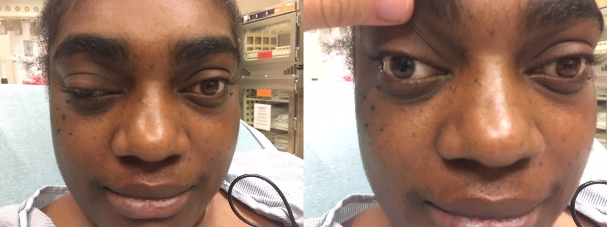

# Migraine

*Categories: Clinical knowledge > Emergency medicine > Neurologic disorders > Migraine*

[Original Article Link](https://coursology-qbank.com/amboss/article/hi0crf)

---

## Summary

Migraine is a <u>primary headache</u> characterized by recurrent episodes of unilateral, localized <u>pain</u> that are frequently accompanied by <u>nausea</u>, <u>vomiting</u>, and <u>sensitivity</u> to light and sound. In approximately 25% of cases, patients experience an <u>aura</u> preceding the <u>headache</u>, which involves reversible focal neurological abnormalities lasting less than an hour, e.g., <u>visual field</u> defects (<u>scotomas</u>) or <u>paresis</u>. Migraine is a <u>clinical diagnosis</u> and imaging is generally not indicated. Treatment of attacks consists of general measures (e.g., minimizing light and sound) together with administration of <u>nonsteroidal antiinflammatory drugs</u> (e.g., <u>ibuprofen</u>) and <u>antiemetics</u> (e.g., <u>prochlorperazine</u>) if <u>nausea</u> is present. In moderate to severe cases, additional medication (e.g., <u>triptans</u>) may be used. Prophylactic treatment, e.g., <u>beta blockers</u> or <u>calcitonin gene-related peptide</u> (<u>CGRP</u>) inhibitors, may be indicated if migraines are especially frequent or long-lasting or if abortive therapy fails or is contraindicated.

Migraine fact sheet

---

## Epidemiology

* <u>Prevalence</u>: ∼ 17% of female individuals and ∼ 6% of male individuals [[1]](https://coursology-qbank.com/amboss/article/yiXd8B)

* Peak <u>incidence</u>: 30–39 years  [[2]](https://coursology-qbank.com/amboss/article/BiXzFB)[[3]](https://coursology-qbank.com/amboss/article/bQXHuB)

* Migraine is the second most common type of <u>headache</u>.

> [!TIP]
> Among patients presenting to the emergency department with a <u>headache</u>, migraine is the most common cause. [[4]](https://coursology-qbank.com/amboss/article/QDcuVe0)

Epidemiological data refers to the US, unless otherwise specified.

---

## Etiology

* The exact etiology is unclear.  [[5]](https://coursology-qbank.com/amboss/article/VZYG0n)

* Genetic predisposition

* Potential triggers of migraine

* Certain food and beverages: <u>nicotine</u>, citrus fruits, <u>alcohol</u>, dairy products, food containing <u>tyramine</u> (e.g., chocolate, red wine)

* <u>Fasting</u>, <u>dehydration</u>

* Poor sleeping habits

* Emotional <u>stress</u>

* Weather changes

* Hormonal changes in women: <u>menstruation</u>; , <u>hormone</u> intake (<u>oral contraceptive pills</u>)

---

## Pathophysiology

* The pathophysiology of migraine is not fully understood.

* Various factors are thought to contribute to the development and severity of migraines.

* Activation of meningeal <u>nociceptors</u>

* Dilatation of intracranial blood vessels → activation of meningeal <u>nociceptors</u>

* Activation of the trigeminovascular pathway: activation of <u>trigeminal</u> <u>neurons</u> → release of vasoactive neuropeptides such as <u>substance P</u> or calcitonin gene-related peptide (<u>CGRP</u>) → vasodilatation and release of proinflammatory molecules (<u>histamine</u>, <u>bradykinin</u>, <u>serotonin</u>, <u>prostaglandins</u>) → <u>neurogenic inflammation</u> → activation of meningeal <u>nociceptors</u> [[6]](https://coursology-qbank.com/amboss/article/4KX3g_)

* <u>Cortical spreading depression</u>: excitation and inhibition of the cerebral cortex → changes in cortical enzymatic activity (proinflammatory molecules) → <u>neurogenic inflammation</u> → activation of meningeal <u>nociceptors</u> [[7]](https://coursology-qbank.com/amboss/article/eZYx0n)

* Dysregulation of <u>pain sensitization</u> in the <u>trigeminal</u> system (<u>CN V</u>): cortical spreading <u>depression</u> → dysregulation of trigeminovascular <u>neurons</u> → <u>neurogenic inflammation</u> → hypersensitization → <u>nausea</u>, loss of appetite, yawning, fatigue, <u>anxiety</u>, <u>depression</u> [[8]](https://coursology-qbank.com/amboss/article/dKXo2_)

* Genetic predisposition: in individuals with migraine, the <u>brain</u> does not have the ability to habituate itself to external stimuli (e.g., <u>stress</u>, hormonal changes) → hyperexcitable <u>brain</u> [[7]](https://coursology-qbank.com/amboss/article/eZYx0n)

* Activation of the <u>autonomic nervous system</u>; : external physiological and emotional stimulation (e.g., hormonal changes, <u>stress</u>) → <u>hypothalamic</u> response to the change in <u>homeostasis</u> → <u>hypothalamic</u> <u>neurons</u> influence the autonomic nervous system → shift toward a <u>parasympathetic</u> tone → constriction and dilatation of intracranial, especially the meningeal, <u>blood vessels</u>  [[7]](https://coursology-qbank.com/amboss/article/eZYx0n)

> [!NOTE]
> Vasodilatation is now considered an epiphenomenon rather than the primary cause of migraine <u>headache</u>. [[6]](https://coursology-qbank.com/amboss/article/4KX3g_)

---

## Clinical features

Migraine is characterized by recurrent attacks and may occur with <u>aura</u> (∼ 25% of cases)  or without <u>aura</u> (∼ 75% of cases). A typical migraine attack passes through four stages, and the <u>aura</u> (if present) typically occurs before the <u>headache</u>. However, migraine patterns may differ and not follow the characteristic stages.

### 1. Prodrome (facultative)

* 24–48 hours before the <u>headache</u> starts

* Excessive yawning

* Difficulties with writing or reading

* Sudden hunger or lack of appetite

* Mood changes

### 2. Aura

<u>Paroxysmal</u>, focal, neurological symptoms that precede (or, in some cases, occur during) the <u>headache</u>.

#### Typical <u>aura</u> [[9]](https://coursology-qbank.com/amboss/article/lGYvzq)[[10]](https://coursology-qbank.com/amboss/article/lXbvyH)

* Visual disturbances, sensory and/or speech symptoms (positive ;  and/or negative ;) 

* Scintillating scotoma: an arch-shaped <u>scotoma</u> that starts centrally and shifts peripherally (appears for ∼ 15–30 minutes)

* <u>Central scotoma</u>

* Flashing lights

* Distorted color perception

* Fortification spectra: star-like, zigzag figures

* Sensory deficits, <u>paresthesia</u>

* <u>Aphasia</u>

* No motor symptoms

* Develops gradually

* Completely reversible

* Symptoms last ≤ 60 minutes each

#### Atypical <u>aura</u>

* <u>Paresis</u>

* <u>Dizziness</u>

* Persistent or long-lasting symptoms

Cranial nerve III palsy in artery aneurysm

### 3. <u>Headache</u>

* Localization

* Typically unilateral, but bilateral <u>headache</u> is possible

* Especially frontal, frontotemporal, retro-orbital

* Duration: usually 4–24 hours (rarely over 72 hours)

* Course: progression of pulsating, throbbing, or pounding <u>pain</u>

* Exacerbated by physical activity

* Accompanying symptoms: <u>photophobia</u>, <u>phonophobia</u>, and <u>nausea</u>/<u>vomiting</u>

### 4. Postdrome (facultative)

* Feeling of exhaustion or euphoria

* <u>Muscle weakness</u>

* <u>Anorexia</u> or food cravings

> [!NOTE]
> The typical migraine <u>headache</u> is “POUND”: Pulsatile, One-day duration, Unilateral, Nausea, Disabling intensity.

---

## Diagnosis

Migraine is a <u>clinical diagnosis</u> based on history and <u>physical examination</u>. The most important step is to exclude <u>red flags for headache</u> that suggest a <u>secondary headache</u> (e.g., infection, hemorrhage, intracranial mass) and require more exhaustive investigation (e.g., imaging). Suspect a <u>primary headache</u> when no <u>red flags</u> are identified, and confirm the diagnosis using the <u>diagnostic criteria for migraine</u>. [[9]](https://coursology-qbank.com/amboss/article/lGYvzq)[[16]](https://coursology-qbank.com/amboss/article/q0bCSH)

> [!TIP]
> Migraine is a <u>clinical diagnosis</u> that is based on <u>patient history</u> and <u>physical examination</u>.

### Diagnostic criteria

|  Diagnostic criteria for migraine [[9]](https://coursology-qbank.com/amboss/article/lGYvzq)[[17]](https://coursology-qbank.com/amboss/article/HqWK-m0)  |  |  |
| --- | --- | --- |
|  | Migraine without <u>aura</u> | <u>Migraine with aura</u> |
|  Number of attacks (total lifetime) |  * ≥ 5   |  * ≥ 2   |
|  Duration  |  * 4–72 hours   |  * N/a   |
| Characteristics |  * ≥ 2 of the following:  * Unilateral  * Pulsating  * Moderate or severe <u>pain</u>  * Worsened by routine physical activity   |  * ≥ 1 of the following <u>aura</u> symptoms:  * Visual  * Sensory  * Speech  * Motor  * <u>Brainstem</u>  * Retinal   |
|  * Concomitant symptoms (≥ 1 of the following):  * <u>Nausea</u>/<u>vomiting</u>  * <u>Photophobia</u> and <u>phonophobia</u>   |  * ≥ 3 of the following <u>aura</u> characteristics:  * ≥ 1 spreads gradually over ≥ 5 minutes.  * ≥ 2 occur in succession.  * Each one lasts 5–60 minutes.  * ≥ 1 is unilateral.  * ≥ 1 involves a positive symptom.  * Accompanied or followed by <u>headache</u> (within 60 minutes)   |  |

> [!WARNING]
> Avoid <u>anchoring bias</u> in patients with known migraines and pursue a <u>diagnostic workup for headache</u> in patients with <u>red flags for headache</u>.

### <u>Laboratory studies</u>

* Not routinely indicated

* Consider a urine <u>pregnancy test</u> to guide pharmacotherapy choices in women of childbearing age.

### Imaging [[16]](https://coursology-qbank.com/amboss/article/q0bCSH)[[18]](https://coursology-qbank.com/amboss/article/p0bLSH)[[19]](https://coursology-qbank.com/amboss/article/r0bfhH)

Neurological imaging is not routinely indicated for uncomplicated migraine.

* Indications

* Clinical features suggest a <u>secondary headache</u> (see “<u>Red flags for headache</u>” and “<u>High-risk headache</u>”).

* Migraine with the following characteristics: [[19]](https://coursology-qbank.com/amboss/article/r0bfhH)

* Unusual, prolonged, or persisting <u>aura</u>

* First episode of <u>brainstem</u> <u>aura</u>, <u>hemiplegic migraine</u>, <u>retinal migraine</u>, <u>aura</u> without <u>headache</u>

* Change in baseline migraine clinical features (frequency, severity, <u>aura</u>)

* Consider in first migraine

* Procedure

* <u>MRI</u> is preferred over CT (except in emergency settings if there is suspicion of a vascular hemorrhagic event).

* See “<u>Imaging for headaches</u>.”

* Findings [[19]](https://coursology-qbank.com/amboss/article/r0bfhH)

* Typically normal

* Nonspecific white-matter changes may be seen  [[19]](https://coursology-qbank.com/amboss/article/r0bfhH)

> [!WARNING]
> Avoid imaging in patients presenting with a recurrent known migraine unless new concerning features are present, e.g., <u>seizures</u>, <u>focal neurological deficits</u>, or recent change in <u>headache</u> pattern.

---

## Differential diagnoses

* See “<u>Differential diagnoses of headache</u>.”

* <u>Paroxysmal hemicrania</u>

* <u>Medication overuse headache</u>

Differential diagnoses of primary headaches fact sheet

The differential diagnoses listed here are not exhaustive.

---

## Management

See also “<u>Migraine management in pregnancy</u>” and “<u>Migraine in children</u>.”

### Approach [[13]](https://coursology-qbank.com/amboss/article/wxdhAH0)[[17]](https://coursology-qbank.com/amboss/article/HqWK-m0)[[20]](https://coursology-qbank.com/amboss/article/_vd5cH0)

* Start treatment of acute migraine based on nature and severity of symptoms. [[21]](https://coursology-qbank.com/amboss/article/bvYHAI)[[22]](https://coursology-qbank.com/amboss/article/Dxd1AH0)

* Provide long-term management.

* Discuss <u>lifestyle modifications for migraine prevention</u>.

* Counsel on appropriate use of abortive medications and <u>prevention of medication overuse headache</u>.

* Offer <u>pharmacological migraine prophylaxis</u>, if indicated, to: [[20]](https://coursology-qbank.com/amboss/article/_vd5cH0)

* Improve response to acute treatment

* Reduce frequency, severity, and duration of attacks

* Patients with <u>aura</u> considering <u>contraception</u>: Review preferred options (e.g., <u>progestin-only contraception</u>, <u>nonhormonal contraception</u>). [[15]](https://coursology-qbank.com/amboss/article/pidLsp0)[[23]](https://coursology-qbank.com/amboss/article/XHd9Kr0)

> [!WARNING]
> <u>Migraine with aura</u> is an <u>absolute contraindication</u> (<u>USMEC category 4</u>) for using <u>estrogen</u>-containing <u>contraceptives</u> (i.e, <u>combined hormonal contraceptives</u>) due to the increased risk of <u>ischemic stroke</u>. [[15]](https://coursology-qbank.com/amboss/article/pidLsp0)

### Overview of migraine pharmacotherapy [[17]](https://coursology-qbank.com/amboss/article/HqWK-m0)[[22]](https://coursology-qbank.com/amboss/article/Dxd1AH0)

* Treatment of acute migraine [[24]](https://coursology-qbank.com/amboss/article/rEdfC70)

* Nonspecific <u>analgesics</u> (e.g., <u>NSAIDs</u>, <u>acetaminophen</u>, or combinations including <u>caffeine</u>)

* Migraine-specific agents, e.g.:

* <u>Triptans</u>

* <u>Ergot</u> alkaloids

* <u>CGRP receptor antagonists</u> (e.g., <u>ubrogepant</u>, <u>rimegepant</u>)

* <u>Lasmiditan</u> (a <u>5-HT1F receptor agonist</u>)

* Antidopaminergic <u>antiemetics</u> (e.g., <u>metoclopramide</u>, <u>prochlorperazine</u>) [[22]](https://coursology-qbank.com/amboss/article/Dxd1AH0)[[25]](https://coursology-qbank.com/amboss/article/5GYi-q)

* Effective for the <u>management of migraine</u>-related <u>pain</u> and <u>nausea</u>

* Monitor for and treat <u>extrapyramidal symptoms</u> (e.g., <u>akathisia</u> or <u>acute dystonia</u>).

* <u>Migraine prophylaxis</u> [[13]](https://coursology-qbank.com/amboss/article/wxdhAH0)

* <u>Beta blockers</u>: <u>propranolol</u>, <u>metoprolol</u>

* <u>Anticonvulsant drugs</u>

* <u>Antidepressants</u>

* <u>CGRP receptor antagonists</u>

* <u>CGRP</u> <u>monoclonal antibodies</u>

* <u>Candesartan</u>

* <u>Botulinum toxin</u>

| Overview of <u>triptans</u> and <u>ergot</u> alkaloids |  |  |
| --- | --- | --- |
|  | Triptans | <u>Ergot</u> alkaloids |
| Agents |  * Sumatriptan, zolmitriptan, almotriptan, rizatriptan   |   * Ergotamine  * Dihydroergotamine    |
| Mechanism of action |   * 5-HT1B/1D <u>receptor</u> <u>agonists</u> that cause:  * <u>Vasoconstriction</u> of (dilated) <u>cranial</u> and basilar <u>arteries</u>  * Inhibition of <u>trigeminal nerve</u> <u>nociception</u>  * Inhibition of vasoactive <u>peptide</u> secretion  * Most effective if taken at the onset of <u>headache</u>    |  * <u>Vasoconstriction</u> by binding to 5-HT1B/1D <u>serotonin</u> <u>receptors</u> and <u>alpha-adrenergic receptors</u> [[26]](https://coursology-qbank.com/amboss/article/6NYjXp)   |
| Indications |   * Migraine <u>headaches</u>  * <u>Cluster headaches</u>    |  |
| Side effects |   * Vasospasm of coronary vessels → coronary <u>ischemia</u> (rare)  * <u>Paresthesia</u> and sensation of cold in the extremities  * <u>Serotonin syndrome</u> (if taken with other <u>5-HT</u> <u>agonists</u>)  * Temporary blood pressure increase (very common)  * <u>Dizziness</u>, <u>malaise</u>, flashes  * Frequent intake (≥ 10 x/month) can lead to <u>headaches</u>.  * <u>Hypertension</u>    |   * <u>ECG</u> changes  * <u>Ischemia</u>  * <u>Nausea</u>/<u>vomiting</u>  * Numbness, <u>paresthesia</u>, <u>myalgia</u>, <u>weakness</u>  * Ergot toxicity   * An intoxication that causes <u>convulsive</u> (e.g., <u>fasciculations</u>, <u>paresthesias</u>, and <u>seizures</u>) and/or gangrenous symptoms (e.g., peripheral <u>necrosis</u>)  * Historically, it occurred from consumption of <u>ergot</u> alkaloids produced by fungi (e.g., contaminated rye).  * Nowadays, it is only rarely seen due to overdosing or pharmacological interactions with <u>ergot-derived</u> drugs (e.g., <u>ergotamine</u>).    |
| Contraindications |   * <u>Coronary artery disease</u>  * <u>Vasospastic angina</u>  * <u>Peripheral artery disease</u>  * <u>Hypertension</u>    |   * <u>Pregnancy</u>  * <u>Peripheral vascular disease</u>  * <u>Coronary artery disease</u>  * <u>Hypertension</u>  * <u>Drug interactions</u>    |

> [!WARNING]
> Avoid <u>opioids</u> as first-line treatment for acute migraines, given their unclear <u>efficacy</u> and potential harm (e.g., worse <u>nausea and vomiting</u>). [[24]](https://coursology-qbank.com/amboss/article/rEdfC70)[[25]](https://coursology-qbank.com/amboss/article/5GYi-q)[[27]](https://coursology-qbank.com/amboss/article/oDc02e0)

> [!WARNING]
> Remember to check for <u>drug interactions</u> (e.g., with <u>SSRIs</u> or <u>macrolides</u>) before starting <u>triptans</u> or <u>ergotamines</u> to avoid <u>adverse events</u>. <u>Coronary spasm</u> and/or <u>serotonin syndrome</u> can occur if <u>triptans</u> and <u>ergotamines</u> are combined.

> [!NOTE]
> A SUMo wrestler TRIPs ANd falls on his head: SUMaTRIPtANs are used for headaches (cluster and migraine).

---

## Treatment of acute migraine

### All patients

* Start pharmacological therapy as soon as possible after <u>headache</u> onset. [[24]](https://coursology-qbank.com/amboss/article/rEdfC70)

* Limit stimuli (e.g., light, loud noises) and activity.

* Ensure adequate hydration.

* Treat <u>nausea and vomiting</u>, if present.

### Mild to moderate <u>headache</u>  [[9]](https://coursology-qbank.com/amboss/article/lGYvzq)[[17]](https://coursology-qbank.com/amboss/article/HqWK-m0)[[21]](https://coursology-qbank.com/amboss/article/bvYHAI)[[24]](https://coursology-qbank.com/amboss/article/rEdfC70)

* First line: <u>NSAIDs</u>, <u>acetaminophen</u>, or combinations including <u>caffeine</u>

* Oral agents

* <u>Ibuprofen</u> DOSAGE

* <u>Aspirin</u> DOSAGE

* <u>Acetaminophen</u> DOSAGE

* <u>Acetaminophen</u>-<u>aspirin</u>-<u>caffeine</u> DOSAGE

* Parenteral agents (e.g., if <u>nausea</u> and/or <u>vomiting</u> are present)

* <u>Ketorolac</u> DOSAGE

* <u>Diclofenac</u> DOSAGE

* Inadequate response or contraindications to first-line therapy: Treat as moderate to severe <u>headache</u>.

### Moderate to severe <u>headache</u>  [[9]](https://coursology-qbank.com/amboss/article/lGYvzq)[[27]](https://coursology-qbank.com/amboss/article/oDc02e0)

#### Emergency department treatment [[25]](https://coursology-qbank.com/amboss/article/5GYi-q)[[28]](https://coursology-qbank.com/amboss/article/9xdNAH0)

Trial a parenteral antidopaminergic agent OR start a migraine-specific agent.

* Parenteral antidopaminergics 

* <u>Metoclopramide</u> DOSAGE  [[25]](https://coursology-qbank.com/amboss/article/5GYi-q)[[27]](https://coursology-qbank.com/amboss/article/oDc02e0)

* <u>Prochlorperazine</u> DOSAGE PLUS <u>diphenhydramine</u> DOSAGE  [[25]](https://coursology-qbank.com/amboss/article/5GYi-q)[[27]](https://coursology-qbank.com/amboss/article/oDc02e0)

* Migraine-specific agents: <u>triptans</u> (e.g., <u>sumatriptan</u>) OR <u>ergotamine</u>; do not combine these agents! ;  [[29]](https://coursology-qbank.com/amboss/article/LlYwx6)

* First-line: <u>triptans</u>

* Oral agents

* <u>Sumatriptan</u>-<u>naproxen</u> DOSAGE

* <u>Zolmitriptan</u> DOSAGE

* Nonoral agents (e.g., for patients with <u>nausea</u>, <u>vomiting</u>, and/or higher <u>analgesic</u> requirement)

* Subcutaneous or intranasal <u>sumatriptan</u> DOSAGE

* Intranasal <u>zolmitriptan</u> DOSAGE

* Second-line: consider a parenteral <u>ergotamine</u> (e.g., <u>dihydroergotamine</u> DOSAGE)

* Additional agents: <u>ubrogepant</u>, <u>rimegepant</u> (<u>CGRP receptor antagonists</u>); <u>lasmiditan</u> (5-HT1F <u>agonist</u>) [[17]](https://coursology-qbank.com/amboss/article/HqWK-m0)[[24]](https://coursology-qbank.com/amboss/article/rEdfC70)

* Short-term recurrence prevention: Consider IV <u>dexamethasone</u>. DOSAGE  [[30]](https://coursology-qbank.com/amboss/article/IGYY0I)

* Refractory <u>headache</u>: See “<u>Status migrainosus</u>.”

> [!TIP]
> Parenteral antidopaminergics (i.e., IV <u>metoclopramide</u> or IV <u>prochlorperazine</u>) are effective first-line agents for migraine regardless of GI symptoms or ability to tolerate oral medication.

> [!TIP]
> In the emergency department, consider IV <u>dexamethasone</u> to reduce the risk of recurrent migraine after discharge. [[25]](https://coursology-qbank.com/amboss/article/5GYi-q)

#### Outpatient treatment [[17]](https://coursology-qbank.com/amboss/article/HqWK-m0)[[24]](https://coursology-qbank.com/amboss/article/rEdfC70)

* Preferred: <u>NSAIDs</u> or <u>acetaminophen</u>, PLUS <u>triptan</u> if inadequate response [[24]](https://coursology-qbank.com/amboss/article/rEdfC70)

* Oral <u>triptan</u> options include:

* <u>Sumatriptan</u>-<u>naproxen</u> DOSAGE

* <u>Zolmitriptan</u> DOSAGE

* Nonoral <u>triptans</u> (e.g., for patients with <u>nausea</u> and/or <u>vomiting</u>)

* Subcutaneous or intranasal <u>sumatriptan</u> DOSAGE

* Intranasal <u>zolmitriptan</u> DOSAGE

* Alternatives [[22]](https://coursology-qbank.com/amboss/article/Dxd1AH0)

* <u>Ergot</u> alkaloids

* <u>CGRP receptor antagonists</u>

* <u>Lasmiditan</u>

* <u>Antiemetics</u> (e.g., <u>metoclopramide</u>, <u>prochlorperazine</u>)

---

## Migraine prevention

### Nonpharmacological migraine prophylaxis [[31]](https://coursology-qbank.com/amboss/article/TWb6ks)

* Lifestyle modifications for migraine prevention

* Exercise in moderation

* Maintain a healthy diet

* Identify and try to avoid potential triggers

* Follow a regular sleeping schedule

* Other: There is some evidence that the following nonpharmacological interventions have some benefits for patients with migraine

* <u>Acupuncture</u>  [[32]](https://coursology-qbank.com/amboss/article/w8XhK-)

* Noninvasive neuromodulation

* <u>Behavioral therapy</u>

* Relaxation techniques

* <u>Biofeedback</u>

### Pharmacological migraine prophylaxis [[13]](https://coursology-qbank.com/amboss/article/wxdhAH0)[[17]](https://coursology-qbank.com/amboss/article/HqWK-m0)[[20]](https://coursology-qbank.com/amboss/article/_vd5cH0)

* Indications [[17]](https://coursology-qbank.com/amboss/article/HqWK-m0)

* Contraindications to abortive pharmacotherapy

* Inadequate response to or major side effects from abortive pharmacotherapy

* Meeting <u>diagnostic criteria for medication overuse headache</u>

* Attacks that:  

* Significantly impact daily functioning despite use of abortive pharmacotherapy

* Occur ≥ 3 times/month and produce severe disability

* Occur ≥ 4 times/month and produce moderate disability

* Occur ≥ 6 times/month

* Certain subtypes of migraine (e.g., <u>hemiplegic migraine</u>, <u>migraine with brainstem aura</u>)

* Patient preference

* Medication initiation and monitoring [[14]](https://coursology-qbank.com/amboss/article/y0bdiH)

* Consider comorbidities when selecting a drug.

* Encourage <u>headache</u> diary to assess response to treatment.

* Start with a low dose and increase until reaching the therapeutic goal.

* Drugs for episodic <u>migraine prophylaxis</u>   [[20]](https://coursology-qbank.com/amboss/article/_vd5cH0)[[33]](https://coursology-qbank.com/amboss/article/HEdKC70)

* <u>Beta blockers</u>, e.g., <u>propranolol</u> DOSAGE, <u>metoprolol</u> (<u>off-label</u>) DOSAGE [[14]](https://coursology-qbank.com/amboss/article/y0bdiH)

* <u>Anticonvulsants</u> (e.g., divalproex;  DOSAGE, <u>topiramate</u>  DOSAGE)

* <u>Tricyclic antidepressant</u> (e.g., <u>amitriptyline</u>  DOSAGE)

* <u>Serotonin-norepinephrine reuptake inhibitors</u>, e.g., <u>venlafaxine</u> (<u>off-label</u>) DOSAGE [[14]](https://coursology-qbank.com/amboss/article/y0bdiH)[[20]](https://coursology-qbank.com/amboss/article/_vd5cH0)

* Oral <u>CGRP receptor antagonists</u> (e.g., <u>atogepant</u> DOSAGE, <u>rimegepant</u> DOSAGE)

* Subcutaneous <u>CGRP</u> <u>monoclonal antibodies</u> (e.g., <u>erenumab</u> ; DOSAGE, <u>fremanezumab</u>  DOSAGE) [[33]](https://coursology-qbank.com/amboss/article/HEdKC70)

* Consider <u>off-label</u> <u>candesartan</u>.  [[20]](https://coursology-qbank.com/amboss/article/_vd5cH0)[[33]](https://coursology-qbank.com/amboss/article/HEdKC70)[[34]](https://coursology-qbank.com/amboss/article/dBdo-H0)

* Drugs for <u>menstrual migraine</u> prophylaxis: See “<u>Menstrual migraine</u>.”

* Drugs for <u>chronic migraine</u> prophylaxis include: [[33]](https://coursology-qbank.com/amboss/article/HEdKC70)

* Drugs for episodic <u>migraine prophylaxis</u>

* <u>Botulinum toxin</u> (e.g., OnabotulinumtoxinA DOSAGE) [[10]](https://coursology-qbank.com/amboss/article/lXbvyH)[[35]](https://coursology-qbank.com/amboss/article/PXbWyH)

---

## Special patient groups

### Management of migraine in pregnancy

#### Treatment of acute migraine [[42]](https://coursology-qbank.com/amboss/article/PBdWas0)

* First-line: <u>acetaminophen</u> DOSAGE (can be combined with <u>caffeine</u>)  [[42]](https://coursology-qbank.com/amboss/article/PBdWas0)

* Alternatives

* <u>Triptans</u>: <u>Sumatriptan</u> has the most evidence for use in <u>pregnancy</u>.

* <u>NSAIDs</u> (<u>second trimester</u> only)

* <u>Metoclopramide</u> DOSAGE with or without <u>diphenhydramine</u> DOSAGE: also treats <u>nausea and vomiting</u>

> [!WARNING]
> Avoid <u>opioids</u> during <u>pregnancy</u>; use can exacerbate <u>nausea</u> and/or <u>vomiting</u> and cause neonatal withdrawal syndrome if used in the <u>third trimester</u>. [[42]](https://coursology-qbank.com/amboss/article/PBdWas0)

> [!WARNING]
> <u>Ergot</u> alkaloids are contraindicated in <u>pregnancy</u> because they induce uterine contractions. [[42]](https://coursology-qbank.com/amboss/article/PBdWas0)

#### Prophylactic therapy [[42]](https://coursology-qbank.com/amboss/article/PBdWas0)

Prophylactic medications are considered in addition to <u>lifestyle modifications for migraine prevention</u>.

* First-line

* <u>Calcium channel blockers</u>

* <u>Antihistamines</u> (e.g., <u>cyproheptadine</u>)

* Alternatives (e.g., <u>beta-blockers</u>, <u>magnesium</u>) may be considered in consultation with a specialist.

### Migraine in children and adolescents [[43]](https://coursology-qbank.com/amboss/article/JGYsZI)[[44]](https://coursology-qbank.com/amboss/article/bEdH870)

#### <u>Epidemiology</u>

* <u>Prevalence</u> increases with age. [[45]](https://coursology-qbank.com/amboss/article/dEdou70)

* 3–7 years: 1–3%

* 7–11 years: 4–11%

* 12–15 years: 8–23%

* Before <u>puberty</u>: <u>♂</u> = <u>♀</u>; after <u>puberty</u>: <u>♀</u> > <u>♂</u> [[46]](https://coursology-qbank.com/amboss/article/BxdzAH0)

#### Etiology

Similar to <u>etiology of migraine</u> in adults.

#### Clinical features

Clinical features vary depending on patient age. [[9]](https://coursology-qbank.com/amboss/article/lGYvzq)[[47]](https://coursology-qbank.com/amboss/article/aEdQ870)

* <u>Infants</u> and young children: <u>vomiting</u>, abdominal <u>pain</u>, signs of discomfort (e.g., head movements)

* Older children and <u>adolescents</u>

* <u>Aura</u> is absent in the majority of children with migraine.

* <u>Aura</u> may manifest as bilateral <u>vision</u> abnormalities.

* <u>Headache</u> is typically bilateral and frontotemporal; occipital <u>pain</u> is rare.

* <u>Cranial</u> autonomic symptoms (e.g., <u>conjunctival injection</u>, <u>lacrimation</u>, nasal congestion, <u>miosis</u>, <u>ptosis</u>) are usually bilateral. [[47]](https://coursology-qbank.com/amboss/article/aEdQ870)

* See also “<u>Clinical features of migraine</u>.”

* All patients: The following associated conditions may be present. [[9]](https://coursology-qbank.com/amboss/article/lGYvzq)

* Abdominal migraine

* <u>Cyclic vomiting syndrome</u>

* <u>Benign paroxysmal vertigo</u>

* <u>Benign paroxysmal torticollis</u>

* <u>Infantile colic</u>

* <u>Alternating hemiplegia</u>

* <u>Child maltreatment</u> [[47]](https://coursology-qbank.com/amboss/article/aEdQ870)[[48]](https://coursology-qbank.com/amboss/article/4Dd3eH0)

> [!TIP]
> Migraine episodes in children are generally shorter in duration than in adults. [[9]](https://coursology-qbank.com/amboss/article/lGYvzq)

#### Diagnosis

The adult <u>diagnostic criteria for migraine</u> apply to children, with the following considerations for migraine without <u>aura</u>: [[9]](https://coursology-qbank.com/amboss/article/lGYvzq)[[47]](https://coursology-qbank.com/amboss/article/aEdQ870)

* Shorter duration in children: 2–72 hours

* <u>Photophobia</u> and <u>phonophobia</u> can be inferred from behavior.

#### Management

##### Treatment of acute migraine [[43]](https://coursology-qbank.com/amboss/article/JGYsZI)

* Start pharmacological treatment for <u>headache</u> as soon as possible.

* Initial: <u>ibuprofen</u> (preferred), other <u>NSAIDs</u>, or <u>acetaminophen</u> (for dosages, see “<u>Nonopioid oral analgesia in children</u>”)

* Alternative: <u>triptans</u>

* Children ≥ 6 years: <u>rizatriptan</u> DOSAGE

* Children ≥ 12 years: <u>sumatriptan</u>-<u>naproxen</u> DOSAGE, <u>almotriptan</u> DOSAGE

* For <u>nausea and vomiting</u>, consider:

* <u>Antiemetics</u>

* Non-oral agents for <u>migraine treatment</u> (e.g., intranasal <u>zolmitriptan</u> or <u>sumatriptan</u>)

* Refractory <u>headache</u> or <u>status migrainosus</u>: Consult <u>neurology</u> and consider hospital admission.

> [!WARNING]
> Avoid <u>aspirin</u> when managing <u>migraine in children</u> due to risk of <u>Reye syndrome</u>. [[47]](https://coursology-qbank.com/amboss/article/aEdQ870)

##### Long-term management [[45]](https://coursology-qbank.com/amboss/article/dEdou70)

* Recommend <u>lifestyle modifications for migraine prevention</u>.

* Counsel on appropriate use of abortive medications and <u>prevention of medication overuse headache</u>.

* Refer patients with frequent, severe, and/or disabling migraines to a specialist for consideration of preventive treatment, e.g.:  [[45]](https://coursology-qbank.com/amboss/article/dEdou70)

* <u>Amitriptyline</u> plus <u>cognitive behavioral therapy</u>

* <u>Topiramate</u>

* <u>Propranolol</u>

> [!TIP]
> Avoid <u>medication overuse headache</u> by limiting <u>triptan</u> use to ≤ 9 days per month and all <u>analgesic</u> use to ≤ 14 days per month. [[43]](https://coursology-qbank.com/amboss/article/JGYsZI)[[45]](https://coursology-qbank.com/amboss/article/dEdou70)

---