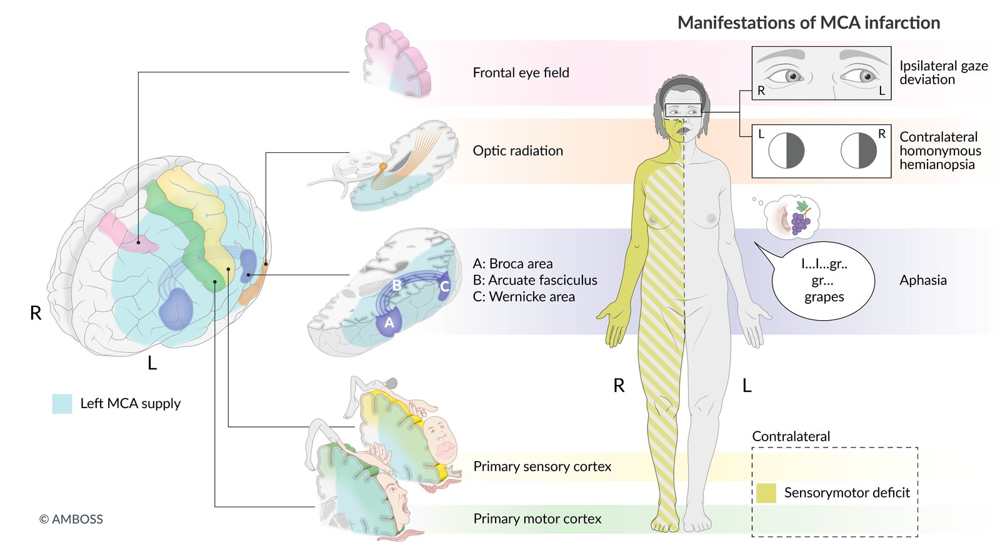
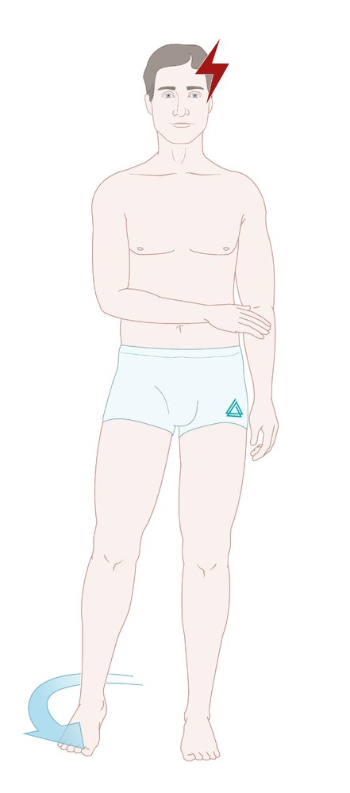
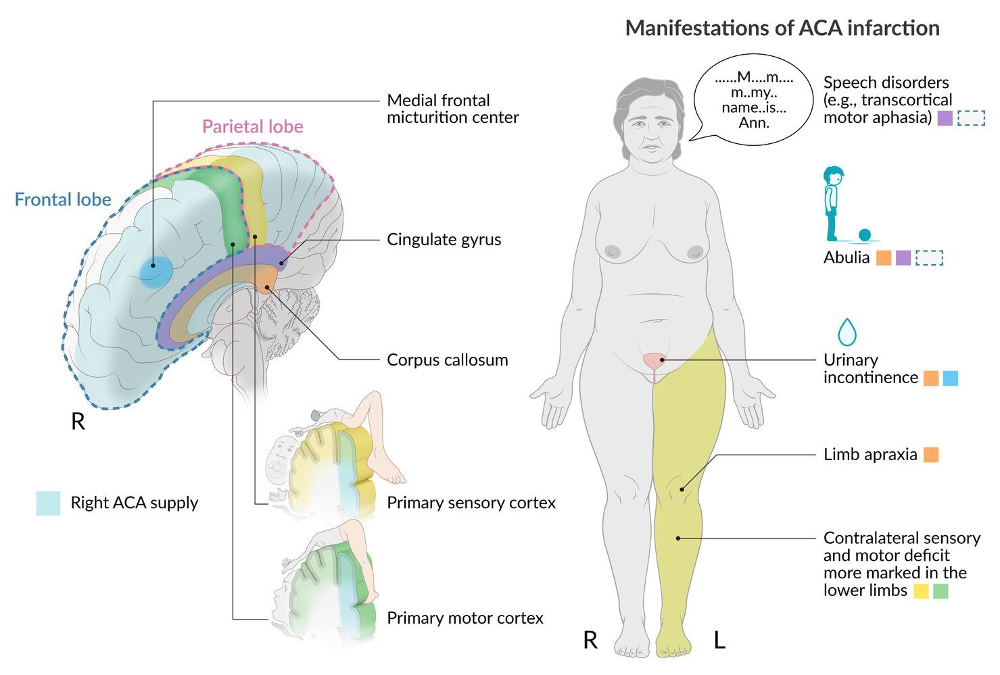
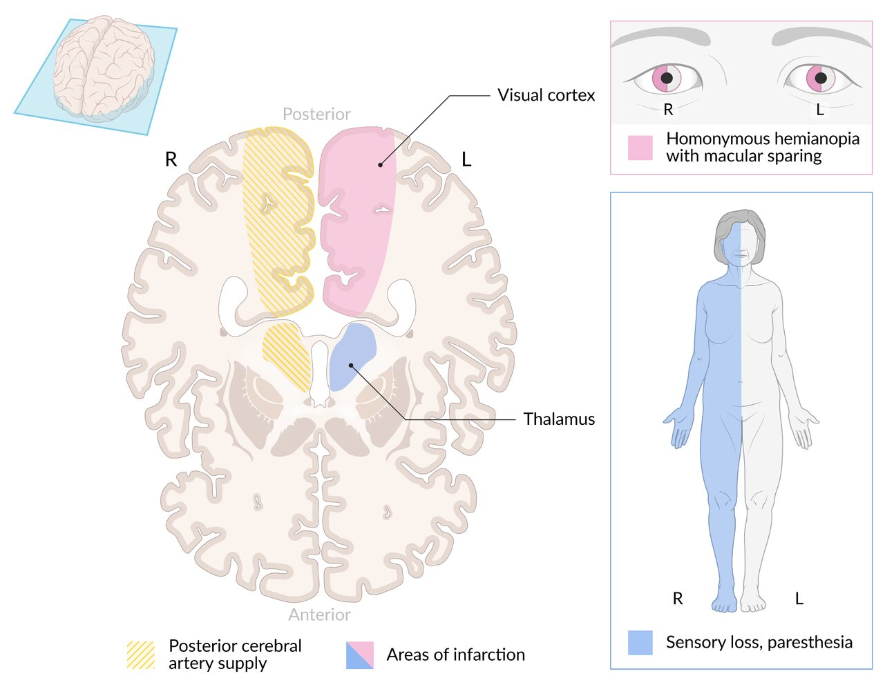
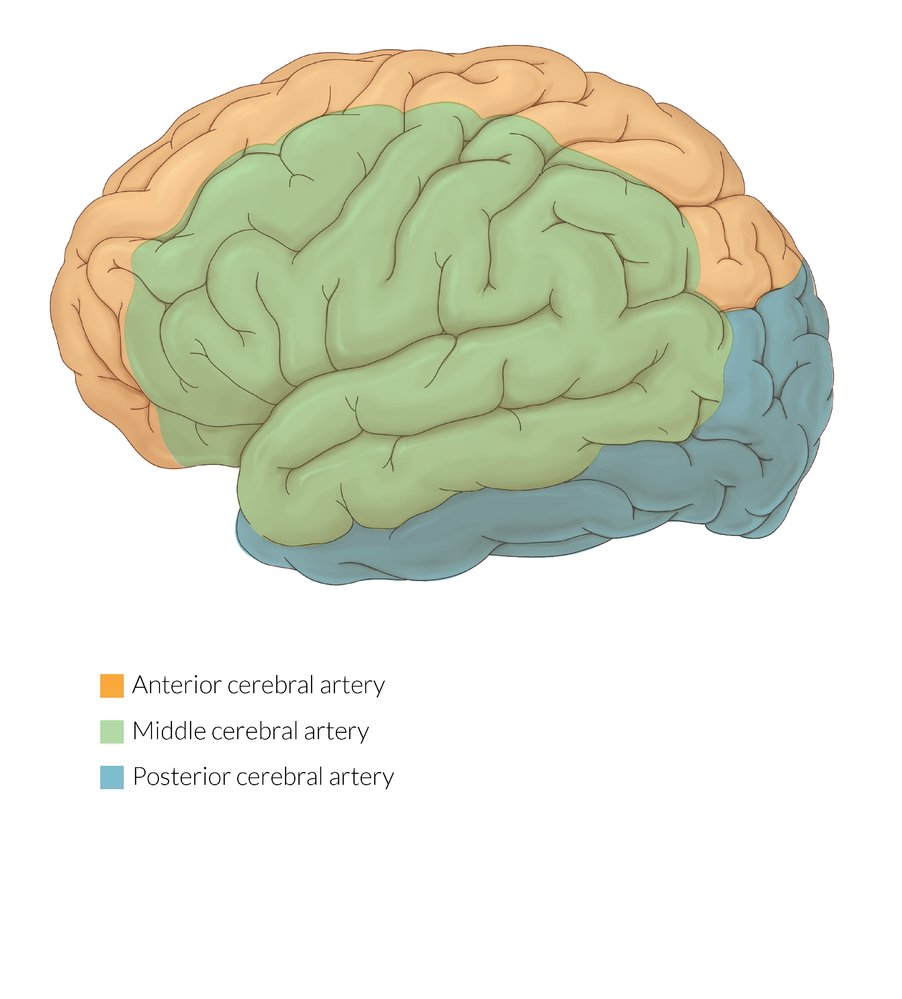
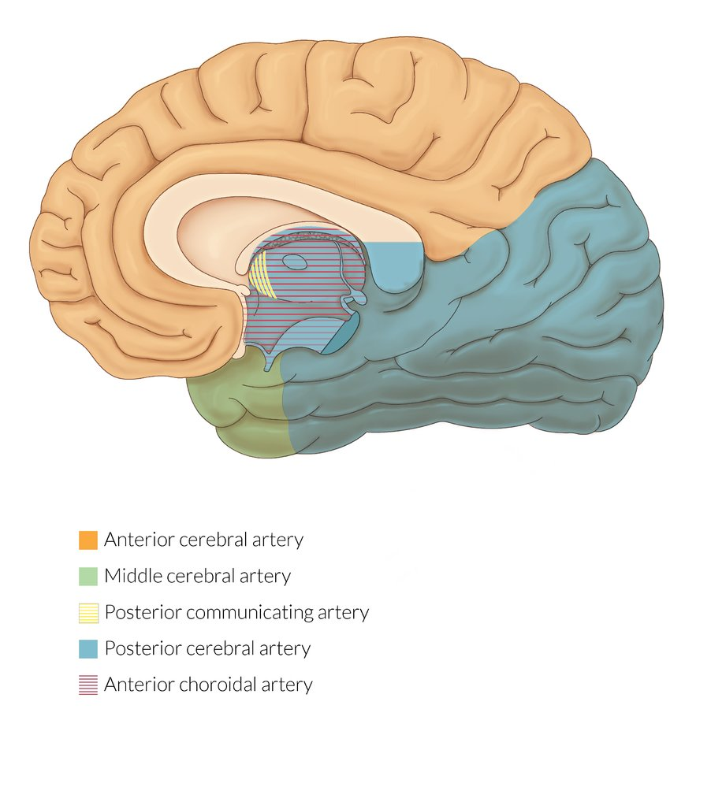
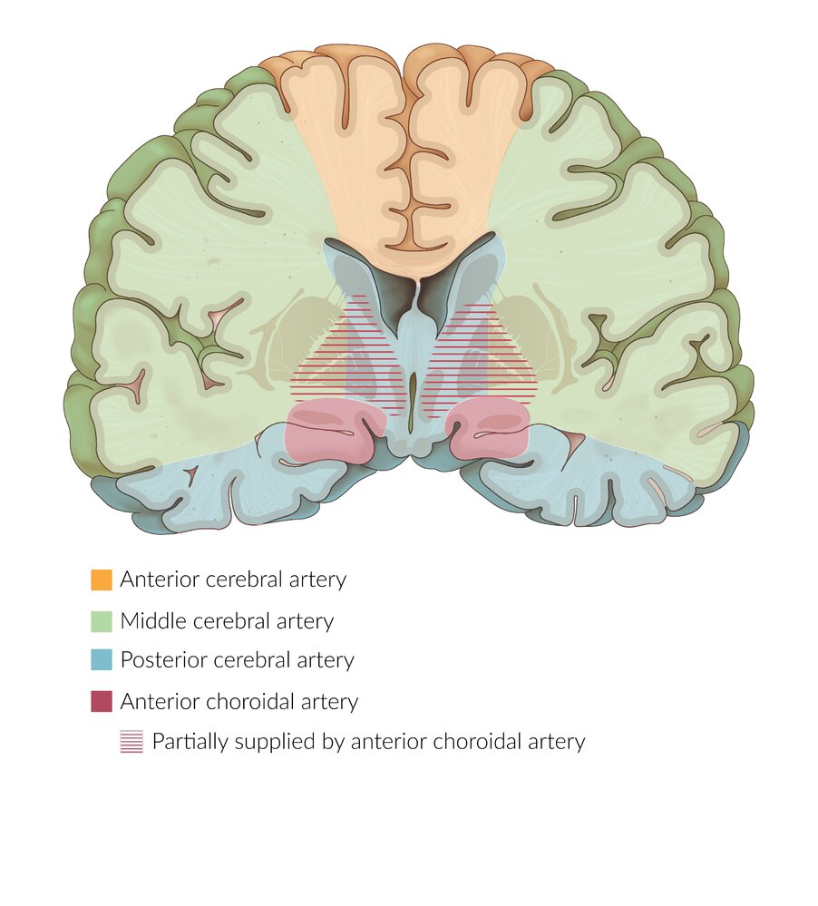
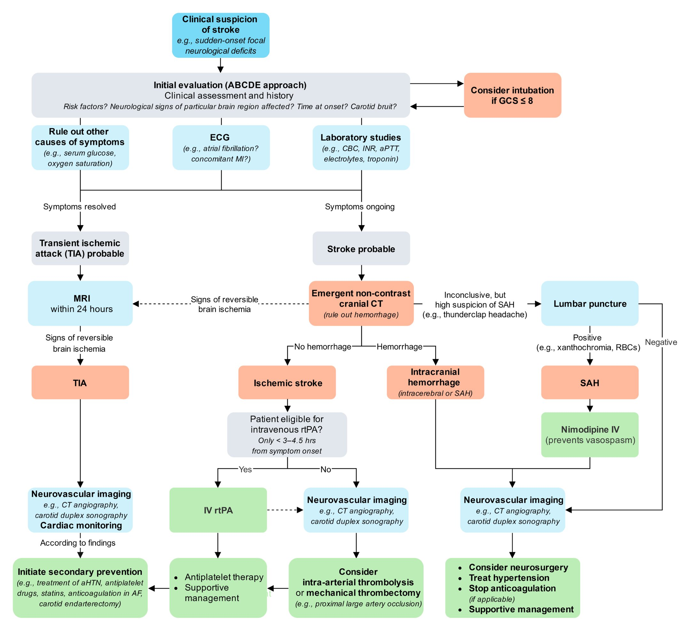

# Overview of stroke

*Categories: Clinical knowledge > Emergency medicine > Neurologic disorders > Overview of stroke*

[Original Article Link](https://coursology-qbank.com/amboss/article/UR0bmf)

---

## Summary

A <u>stroke</u> is an acute neurological condition resulting from a disruption in cerebral <u>perfusion</u>, either due to <u>ischemia</u> (<u>ischemic strokes</u>) or hemorrhage (<u>hemorrhagic strokes</u>). <u>Hemorrhagic strokes</u> are further classified as intracerebral or subarachnoid. Systemic <u>hypertension</u> and other cardiovascular diseases are common <u>risk factors</u> for both <u>ischemic</u> and <u>hemorrhagic strokes</u>. Clinically, <u>strokes</u> are characterized by the acute onset of <u>focal neurological deficits</u>, including <u>hemiparesis</u>, <u>paresthesias</u>, and <u>hemianopsia</u>. The pattern of clinical features is determined by the affected vessel. Distinguishing between <u>ischemic</u> and <u>hemorrhagic strokes</u> based on <u>physical examination</u> is difficult and requires initial evaluation with a noncontrast head CT. Further <u>neurovascular imaging</u> may be required before deciding on treatment options. In <u>ischemic strokes</u>, immediate <u>revascularization</u> of the affected vessel is vital to preserve <u>brain</u> tissue and prevent further damage. <u>Hemorrhagic strokes</u> are treated with supportive measures and neurosurgical evacuation of blood. Long-term management and prevention of all types of <u>stroke</u> focuses on the reduction of <u>modifiable risk factors</u> (e.g., <u>hypertension</u> and <u>atherosclerosis</u>).

For more information, see respective articles “<u>Ischemic stroke</u>,” “<u>Intracerebral hemorrhage</u>,” and “<u>Subarachnoid hemorrhage</u>.”

---

## Definitions

* <u>Stroke</u>: acute neurologic injury caused by <u>ischemia</u> or hemorrhage

* <u>Ischemic stroke</u>: acute neurological dysfunction caused by <u>brain</u>, spinal cord, or retinal <u>infarction</u>  [[1]](https://coursology-qbank.com/amboss/article/F7dgnr0)

* <u>Transient ischemic attack</u>: temporary, focal cerebral <u>ischemia</u>;  that results in neurologic deficits without acute <u>infarction</u> or permanent loss of function (previously defined as lasting < 24 hours) [[2]](https://coursology-qbank.com/amboss/article/75Y4lp)

* <u>Hemorrhagic stroke</u>: Acute neurological injury caused by nontraumatic <u>CNS</u> hemorrhage [[1]](https://coursology-qbank.com/amboss/article/F7dgnr0)

* <u>Intracerebral hemorrhage</u>: bleeding within the <u>brain</u> <u>parenchyma</u>

* <u>Subarachnoid hemorrhage</u>: bleeding into the <u>subarachnoid space</u>

* <u>Intraventricular hemorrhage</u>: bleeding within the ventricles

---

## Overview

The following table focuses on nontraumatic cerebral <u>ischemia</u> and <u>intracranial hemorrhage</u>.

| Overview |  |  |  |
| --- | --- | --- | --- |
|  |  <u>Ischemic stroke</u>  | <u>Intracerebral hemorrhage</u> | <u>Subarachnoid hemorrhage</u> |
| <u>Epidemiology</u> |  * ∼ 85% of all <u>strokes</u>   |  * ∼ 10% of all <u>strokes</u>   |  * ∼ 5% of all <u>strokes</u>   |
| Etiology |   * <u>Thromboembolism</u> (atherosclerotic)  * Cerebral embolism (e.g., cardiogenic)  * Small vessel occlusion (<u>lipohyalinosis</u>)  * Systemic <u>hypoperfusion</u>    |   * Ruptured cerebral <u>artery</u> or microaneurysm  * Trauma (see “<u>Traumatic brain injury</u>”)  * <u>Reperfusion injury</u> after <u>ischemic stroke</u>    |   * Ruptured <u>berry aneurysm</u>  * <u>Arteriovenous malformation</u>  * Trauma (see “<u>Traumatic brain injury</u>”)    |
| <u>Risk factors</u> |   * Age > 65 years  * <u>Hypertension</u>  * <u>Atrial fibrillation</u>  * <u>Diabetes mellitus</u>  * <u>Carotid artery stenosis</u>    |   * Age > 65 years  * <u>Hypertension</u>  * <u>Vasculitis</u>  * <u>Malignancy</u>  * <u>Ischemic stroke</u>    |   * <u>Hypertension</u>  * Tobacco use  * <u>Family history</u>    |
| Clinical features |   * Sudden onset of <u>focal neurologic deficits</u>  * Embolic <u>stroke</u>: possibly, <u>spectacular shrinking deficit</u>    |   * <u>Headache</u>, confusion, <u>nausea</u>  * Sudden onset of <u>focal neurologic deficits</u>    |   * Rapid onset of severe <u>headache</u>  * <u>Meningeal signs</u>  * Sudden onset of <u>focal neurologic deficits</u>    |
| Diagnosis |   * Noncontrast head CT to rule out hemorrhage  * <u>MRI</u>  * <u>CTA</u>/<u>MRA</u>    |   * Noncontrast head CT  * <u>MRI</u>  * <u>CTA</u>/<u>MRA</u>    |   * Noncontrast head CT  * <u>CTA</u>  * <u>Lumbar puncture</u>    |
| Findings on noncontrast head CT |   * <u>Hyperdense MCA sign</u>  * Effacement of sulci  * Loss of cortico-medullary differentiation  * <u>Edema</u>    |  * <u>Hyperdense</u> lesion within cerebral <u>parenchyma</u>   |  * Extensive area of <u>hyperdense</u> signals around the <u>circle of Willis</u> (most common location)   |
| Treatment |   * Intravenous <u>thrombolysis</u>  * Thrombectomy  * <u>Aspirin</u> or <u>clopidogrel</u> for <u>reducing subsequent stroke risk</u>    |   * Reversal of <u>coagulopathy</u>  * Blood pressure management  * Surgical intervention if there are signs of <u>herniation</u> or <u>increased ICP</u>    |   * Reversal of <u>coagulopathy</u>  * Blood pressure management  * Prevention of vasospasm  * Surgical <u>clipping</u>  * <u>Endovascular coiling</u>    |
| Pathology |  * <u>Pale infarct</u> → <u>liquefactive necrosis</u> and <u>glial scarring</u>   |  * <u>Hematoma</u> surrounded by <u>pale infarct</u> and <u>edema</u> → <u>hemosiderin</u>-lined cavity with glial scarring   |  |

> [!TIP]
> For both <u>ischemic</u> and <u>hemorrhagic strokes</u>, age is the most important <u>nonmodifiable risk factor</u> and <u>arterial hypertension</u> is the most important <u>modifiable risk factor</u>.

---

## Epidemiology

* <u>Stroke</u> is the fourth leading <u>cause of death</u> and the leading cause of disability in the US. [[3]](https://coursology-qbank.com/amboss/article/WX1PC20)

* <u>Stroke</u> is responsible for ∼ 5% of deaths in the US. [[4]](https://coursology-qbank.com/amboss/article/R3alR4)

* See <u>ischemic stroke</u>, <u>intracerebral hemorrhage</u>, and <u>subarachnoid hemorrhage</u> for specific <u>risk factors</u>.

Epidemiological data refers to the US, unless otherwise specified.

---

## Etiology

* <u>Ischemic stroke</u> (∼ 85%)

* <u>Hemorrhagic stroke</u> (∼ 15%)

* <u>Intracerebral hemorrhage</u> (∼ 10%)

* <u>Subarachnoid hemorrhage</u> (∼ 5%)

References:[[5]](https://coursology-qbank.com/amboss/article/U30b3f)

---

## Stroke symptoms by affected vessel

| Clinical features of stroke by affected vessel |  |  |
| --- | --- | --- |
|  Affected vessel  |  |  Clinical features [[6]](https://coursology-qbank.com/amboss/article/G5YBlp)[[7]](https://coursology-qbank.com/amboss/article/tMbXq8)  |
|  <u>Middle cerebral artery</u> (<u>MCA</u>) (most commonly affected vessel)   |  |   * <u>Contralateral</u> <u>weakness</u> and sensory loss more marked in the upper limbs and lower half of the face than in lower limbs  * Gaze deviates toward the side of <u>infarction</u>  * <u>Contralateral</u> <u>homonymous hemianopia</u> without <u>macular sparing</u> or superior/inferior <u>quadrantanopia</u>  [[7]](https://coursology-qbank.com/amboss/article/tMbXq8)[[8]](https://coursology-qbank.com/amboss/article/8wbOkD)  * <u>Aphasia</u> if in dominant hemisphere (usually left <u>MCA</u> territory)  * <u>Broca aphasia</u> (lesion to inferior frontal <u>gyrus</u>, which is supplied by the superior division of <u>MCA</u>)  * <u>Wernicke aphasia</u>  * Occurs in lesion to <u>superior temporal gyrus</u>, which is supplied by the inferior division of <u>MCA</u>  * Can be associated with right superior quadrant <u>visual field</u> defect  * <u>Conduction aphasia</u> (lesion to supramarginal <u>gyrus</u>, which is supplied by the inferior division of <u>MCA</u>)  * Hemineglect if in nondominant hemisphere (usually right <u>MCA</u> territory)  * Unawareness of and unresponsiveness to unilateral stimuli due to a <u>brain</u> unilateral injury, most commonly <u>strokes</u> (not due to a primary motor or sensory lesion)  * Typically associated with right hemisphere damage resulting in neglect (esp. visual) of the left side [[9]](https://coursology-qbank.com/amboss/article/ZCYZqr)  * The lesion is usually <u>contralateral</u> to the stimuli   * Motor neglect  * Sensory or perceptual neglect    |
|  <u>Anterior cerebral artery</u> (<u>ACA</u>)   |  |   * <u>Contralateral</u> <u>weakness</u> and sensory loss in the lower limbs more marked than in upper limbs  * <u>Abulia</u>  * <u>Urinary incontinence</u>  * <u>Dysarthria</u>  * <u>Transcortical motor aphasia</u>  * <u>Frontal release signs</u>  * Limb <u>apraxia</u>    |
|  <u>Posterior cerebral artery</u> (PCA)   |  |   * General findings  * <u>Contralateral</u> <u>homonymous hemianopia</u> with <u>macular sparing</u> due to <u>occipital lobe</u> involvement  * <u>Contralateral</u> sensory loss due to <u>lateral</u> thalamic involvement: <u>light touch</u>, pinprick, and positional sense may be reduced.  * <u>Memory</u> deficits  * <u>Vertigo</u>, <u>nausea</u>  * Hemisphere-dependent findings  * PCA territory of the dominant hemisphere (usually left):   * <u>Alexia without agraphia</u>  * <u>Anomic aphasia</u>  * <u>Agnosia</u>: impairment of recognition of sensory stimulus (most commonly visual) [[10]](https://coursology-qbank.com/amboss/article/t8aXom)  * PCA territory of the nondominant hemisphere (usually right): <u>prosopagnosia</u>  [[7]](https://coursology-qbank.com/amboss/article/tMbXq8)[[11]](https://coursology-qbank.com/amboss/article/AwbRlD)  * <u>Midbrain syndromes</u>  * <u>Medial midbrain syndrome</u> (<u>Weber syndrome</u>)  * <u>Lateral</u> <u>midbrain syndrome</u> (<u>Claude syndrome</u>)  * <u>Paramedian midbrain syndrome</u> (<u>Benedikt syndrome</u>)  * <u>Dorsal midbrain syndrome</u> (<u>Parinaud syndrome</u>)  * Features of thalamic injury [[12]](https://coursology-qbank.com/amboss/article/iRaJ54)   * Decreased arousal  * Variable sensory loss  * <u>Aphasia</u>  * <u>Visual field</u> losses  * <u>Apathy</u>, <u>agitation</u>, <u>personality</u> changes    |
| <u>Posterior inferior cerebellar artery</u> |  |  * <u>Lateral medullary syndrome</u> (<u>Wallenberg syndrome</u>; see below)   |
| <u>Anterior inferior cerebellar artery</u> |  |  * See <u>lateral pontine syndrome</u> below.   |
|  <u>Lenticulostriate arteries</u> (penetrating <u>arteries</u>) |  |   * See <u>lacunar syndromes</u> below.  * Occlusion is often caused by <u>lipohyalinosis</u> (<u>hyaline</u> <u>arteriosclerosis</u>) secondary to unmanaged <u>hypertension</u>.    |
| <u>Basilar artery</u> |  |   * Consciousness is preserved if the <u>reticular activating system</u> is not affected.  * Vertebrobasilar insufficiency [[13]](https://coursology-qbank.com/amboss/article/t5YXNp)   * <u>Vertigo</u>, <u>drop attacks</u>, <u>tinnitus</u>, <u>hiccups</u>, <u>dysarthria</u>, <u>dysphagia</u>  * <u>Ipsilateral</u> <u>cranial nerve</u> deficits  * <u>Diplopia</u>  * <u>Gait ataxia</u>  * <u>Paresthesias</u>  * <u>Pontine syndromes</u> [[14]](https://coursology-qbank.com/amboss/article/F5YgNp)  * <u>Ventral pontine syndrome</u>  * <u>Lateral pontine syndrome</u>  * <u>Inferior medial pontine syndrome</u>  * <u>Locked-in syndrome</u> (complete <u>basilar artery</u> occlusion)  * <u>Cerebellar syndromes</u>    |
| Extracranial <u>arteries</u> | <u>Internal carotid artery</u> |   * <u>Ipsilateral</u> <u>amaurosis fugax</u>  * <u>Dysphagia</u>, <u>tongue</u> deviates to <u>ipsilateral</u> side (<u>CN XII</u>)  * Numerous <u>contralateral</u> symptoms can occur (e.g., <u>hemiparesis</u>, hemisensory loss, <u>homonymous hemianopsia</u>).    |
| <u>Common carotid artery</u> |   * <u>Horner syndrome</u>  * Signs of <u>middle cerebral artery</u> <u>infarction</u>    |  |
| <u>Vertebral artery</u> |   * <u>Lateral medullary syndrome</u> (see below)  * <u>Medial medullary syndrome</u> (see below)  * <u>Neck pain</u>  * Signs of <u>posterior cerebral artery</u> <u>infarction</u> (see <u>carotid and vertebral artery dissection</u>)    |  |
| <u>Anterior spinal artery</u> |  * <u>Medial medullary syndrome</u> (see below)   |  |

Circle of Willis

Middle cerebral artery infarct

Hemiplegic gait

Anterior cerebral artery infarct

Posterior cerebral artery infarct

Motor homunculus

Sensory homunculus

Arterial supply of the cerebral cortex

Arterial supply of the cerebral cortex

Arterial supply of the cerebral cortex

References:[[12]](https://coursology-qbank.com/amboss/article/iRaJ54)[[15]](https://coursology-qbank.com/amboss/article/ZR0Zlf)[[16]](https://coursology-qbank.com/amboss/article/QRau54)

---

## Stroke symptoms by affected region

### Lacunar syndromes [[7]](https://coursology-qbank.com/amboss/article/tMbXq8)[[17]](https://coursology-qbank.com/amboss/article/YMYnMp)

* <u>Lacunar strokes</u> most commonly occur in <u>ischemic stroke</u> but can also arise as a result of microbleeds

* There are no cortical signs (e.g., neglect, <u>aphasia</u>, <u>visual field</u> loss) in any of the types of <u>lacunar stroke</u>.

| Overview of <u>lacunar strokes</u> |  |  |
| --- | --- | --- |
| <u>Lacunar stroke</u> type | Location | Clinical features |
| Pure motor stroke |   * <u>Posterior</u> limb of the <u>internal capsule</u> (most common)  * May also involve <u>striatum</u>, corona radiata, basal <u>pons</u>, <u>medial</u> medulla  * Often caused by occlusion of the <u>lenticulostriate artery</u>    |   * <u>Contralateral</u> <u>hemiparesis</u> of the face, arm, and leg (causes <u>circumduction gait</u>)  * In some cases, <u>dysarthria</u>  * No sensory impairment  * Most common type of <u>lacunar stroke</u> (> 50%)    |
| Pure sensory stroke |   * <u>Thalamus</u> (most common)  * May also involve the <u>posterior</u> limb of the <u>internal capsule</u>, <u>pontine</u> <u>tegmentum</u>, corona radiata    |  * <u>Contralateral</u> numbness and <u>paresthesia</u> of the face, arm, and leg   |
| Sensorimotor stroke |   * <u>Posterior</u> limb of the <u>internal capsule</u> (most common)  * May also involve the <u>thalamus</u>, <u>lateral</u> medulla, <u>putamen</u>    |  * <u>Contralateral</u> <u>hemiparesis</u> and sensory impairment   |
| Ataxic hemiparesis |   * <u>Posterior</u> limb of the <u>internal capsule</u> (most common)  * May also involve the corona radiata, <u>thalamus</u>, <u>cerebral peduncle</u>, <u>pons</u>    |  * <u>Ipsilateral</u> <u>weakness</u> with impaired coordination (e.g., <u>ataxia</u>, gait instability)  [[18]](https://coursology-qbank.com/amboss/article/3CbS7D)[[19]](https://coursology-qbank.com/amboss/article/RCbl7D)   |
| Dysarthria-clumsy hand syndrome |  * Caudate, <u>posterior</u> limb of the <u>internal capsule</u>, <u>putamen</u>, base of the <u>pons</u>   |  * <u>Contralateral</u> facial and hand <u>weakness</u> with <u>dysarthria</u>   |
| <u>Hemiballismus</u> |  * <u>Caudate nucleus</u>, <u>putamen</u>, <u>thalamus</u>, <u>globus pallidus</u>, corona radiata, <u>subthalamic nucleus</u>   |  * <u>Contralateral</u>, involuntary, large flinging movements of the arm or leg   |

> [!TIP]
> <u>Infarction</u> of the <u>posterior</u> limb of the <u>internal capsule</u> is the most common type of <u>lacunar stroke</u> and may manifest clinically with <u>pure motor stroke</u>, <u>pure sensory stroke</u> (rare), <u>sensorimotor stroke</u>, <u>dysarthria-clumsy</u> hand syndrome, and/or <u>ataxic hemiparesis</u>.

### Brainstem syndromes [[7]](https://coursology-qbank.com/amboss/article/tMbXq8)[[20]](https://coursology-qbank.com/amboss/article/D9b1pD)

#### General considerations

* <u>Brainstem syndromes</u> involve the <u>cranial nerves</u> and/or their <u>nuclei</u> (produce symptoms ipsilaterally to the lesion) and major <u>brainstem</u> tracts (produce symptoms contralaterally to the lesion unless they are uncrossed or double-crossed).

* Disruption of <u>reticular activating system</u>, if present, results in decreased <u>level of consciousness</u> or <u>coma</u>.

#### Midbrain syndromes [[21]](https://coursology-qbank.com/amboss/article/u9bp6D)[[22]](https://coursology-qbank.com/amboss/article/E9b86D)[[23]](https://coursology-qbank.com/amboss/article/v9bA6D)

| Overview of <u>midbrain syndromes</u> |  |  |  |
| --- | --- | --- | --- |
| Syndrome | Affected vessel | Affected structures | Resulting symptom |
|  Ventral midbrain syndrome (<u>Weber syndrome</u>) |  * Branches of the <u>posterior cerebral artery</u>   |  * <u>Oculomotor nerve</u> <u>nucleus</u>   |  * <u>Ipsilateral</u> <u>oculomotor nerve palsy</u>   |
|  * <u>Corticospinal tract</u> (<u>cerebral peduncle</u>)   |  * <u>Contralateral</u> <u>hemiparesis</u>   |  |  |
| Claude syndrome |  * <u>Oculomotor nerve</u> fibers   |  * <u>Ipsilateral</u> <u>oculomotor nerve palsy</u>   |  |
|   * <u>Superior cerebellar peduncles</u>  * <u>Red nucleus</u>    |  * <u>Contralateral</u> <u>ataxia</u>   |  |  |
|  Paramedian midbrain syndrome (<u>Benedikt syndrome</u>) |  * <u>Oculomotor nerve</u> fibers   |  * <u>Ipsilateral</u> <u>oculomotor nerve palsy</u>   |  |
|  * <u>Corticospinal tract</u> (<u>cerebral peduncle</u>)   |  * <u>Contralateral</u> <u>hemiparesis</u>   |  |  |
|  * <u>Red nucleus</u>   |  * <u>Contralateral</u> <u>rubral tremor</u>   |  |  |
|  Dorsal midbrain syndrome (<u>Parinaud syndrome</u>) |   * Branches of the <u>posterior cerebral artery</u>  * Often result from compression, e.g., by <u>pinealomas</u>    |  * <u>Tectal</u> plate and <u>medial longitudinal fasciculus</u>   |   * <u>Vertical gaze palsy</u>  * <u>Eyelid</u> <u>retraction</u> (<u>Collier sign</u>)  * <u>Pupillary</u> light-near dissociation (pseudo-<u>Argyll Robertson pupils</u>)  * <u>Convergence</u>-<u>retraction</u> <u>nystagmus</u>    |
| Nothnagel syndrome |  * <u>Superior colliculi</u>   |  * <u>Ipsilateral</u> or bilateral oculomotor palsy   |  |
|  * <u>Superior cerebellar peduncle</u>   |  * <u>Ipsilateral</u> <u>cerebellar ataxia</u>   |  |  |

#### Pontine syndromes

| Overview of <u>pontine syndromes</u> |  |  |  |
| --- | --- | --- | --- |
| Syndrome | Affected vessel | Affected structures | Resulting symptom |
|  Ventral pontine syndrome (<u>Millard-Gubler syndrome</u>) |  * <u>Basilar artery</u>   |  * <u>Facial nerve</u>   |  * <u>Ipsilateral</u> facial <u>muscle weakness</u>   |
|  * <u>Abducens nerve</u>   |  * <u>Ipsilateral</u> <u>eye</u> <u>abduction</u> palsy   |  |  |
|  * <u>Pyramidal tracts</u>   |  * <u>Contralateral</u> <u>hemiparesis</u>   |  |  |
|  Lateral pontine syndrome (<u>Marie-Foix syndrome</u>) |   * <u>Anterior inferior cerebellar artery</u>  * Rarely perforating branches of <u>basilar artery</u>    |  * <u>Lateral</u> <u>spinothalamic tract</u>   |  * <u>Contralateral</u> loss of <u>pain</u> and <u>temperature sensation</u>   |
|  * Middle and <u>inferior cerebellar peduncles</u>   |  * <u>Ipsilateral</u> limb and <u>gait ataxia</u>   |  |  |
|  * Spinal <u>trigeminal nerve</u> <u>nucleus</u>   |  * <u>Ipsilateral</u> loss of facial sensation to <u>pain</u> and temperature   |  |  |
|  * <u>Facial nerve</u> <u>nuclei</u>   |   * <u>Ipsilateral</u> facial <u>muscle weakness</u>  * <u>Ipsilateral</u> decreased <u>lacrimation</u> and salivation  * <u>Ipsilateral</u> loss of <u>taste</u> sensation from <u>anterior</u> ⅔ of the <u>tongue</u>    |  |  |
|   * <u>Vestibulocochlear nerve</u> <u>nuclei</u>  * Labyrinth of <u>inner ear</u> (can be affected if <u>labyrinthine artery</u> is involved)    |  * <u>Ipsilateral</u> <u>vertigo</u>, <u>nystagmus</u>, and <u>hearing loss</u>   |  |  |
|  * <u>Sympathetic</u> fibers   |  * <u>Ipsilateral</u> <u>Horner syndrome</u>   |  |  |
|  Inferior medial pontine syndrome (<u>Foville syndrome</u>) |  * Paramedian branches of <u>basilar artery</u>   |  * <u>Pyramidal tracts</u>   |  * <u>Contralateral</u> <u>hemiparesis</u>   |
|  * <u>Facial nerve</u>   |  * <u>Ipsilateral</u> facial <u>muscle weakness</u>   |  |  |
|  * <u>Abducens nerve</u>   |  * <u>Ipsilateral</u> <u>eye</u> <u>abduction</u> palsy   |  |  |
|  * <u>Medial longitudinal fasciculus</u>   |  * <u>Ipsilateral</u> <u>internuclear ophthalmoplegia</u>   |  |  |
| <u>Locked-in syndrome</u> |  * See the article on <u>locked-in syndrome</u>.   |  |  |

> [!NOTE]
> Facial droop means <u>AICA</u> has swooped: involvement of facial <u>nuclei</u> (not the <u>facial nerve</u> as in other <u>pontine syndromes</u>) is characteristic of <u>AICA</u> <u>stroke</u>.

### Medullary syndromes

| Overview of <u>medullary syndromes</u> |  |  |  |
| --- | --- | --- | --- |
| Syndrome | Affected vessel | Affected structures | Resulting symptom |
|  Medial medullary syndrome (<u>Dejerine syndrome</u>) | Paramedian branches of the <u>anterior spinal artery</u> and/or <u>vertebral arteries</u> |  <u>Nucleus</u> and fibers of the <u>hypoglossal nerve</u>  | <u>Ipsilateral</u> <u>tongue</u> palsy (deviation of the tip to the <u>ipsilateral</u> side) |
| <u>Corticospinal tract</u> | <u>Contralateral</u> <u>hemiparesis</u> |  |  |
| <u>Medial lemniscus</u> | <u>Contralateral</u> decrease in <u>proprioception</u> |  |  |
|  <u>Lateral medullary syndrome</u> (<u>Wallenberg syndrome</u>)    | <u>Posterior inferior cerebellar artery</u> | <u>Nucleus ambiguus</u> (<u>CN IX</u>, X, XI) | <u>Ipsilateral</u> <u>bulbar palsy</u> (<u>dysphagia</u>, <u>dysphonia</u>, <u>hiccups</u>, decreased <u>gag reflex</u>) |
| <u>Vestibular nuclei</u> | <u>Ipsilateral</u> <u>nystagmus</u> and <u>vertigo</u> |  |  |
| <u>Lateral</u> <u>spinothalamic tract</u> | <u>Contralateral</u> decrease in <u>pain</u> and temperature sensations in the trunk and limbs |  |  |
| <u>Spinal trigeminal nucleus</u> | <u>Ipsilateral</u> decrease in <u>pain</u> and temperature sensations in the face |  |  |
| <u>Inferior cerebellar peduncle</u> | <u>Ipsilateral</u> <u>limb ataxia</u> and <u>dysmetria</u> |  |  |
| <u>Sympathetic</u> fibers | <u>Ipsilateral</u> <u>Horner syndrome</u> |  |  |

> [!NOTE]
> To remember the cause and the symptoms of the <u>lateral medullary syndrome</u>: Try not to pick a (PICA) horse (<u>hoarseness</u>) that can't eat (<u>dysphagia</u>).

### Clinical features of <u>strokes</u> affecting other regions

| Overview of clinical features of <u>strokes</u> affecting other regions |  |
| --- | --- |
| Location of lesion |  Clinical features [[7]](https://coursology-qbank.com/amboss/article/tMbXq8)[[14]](https://coursology-qbank.com/amboss/article/F5YgNp)  |
| <u>Putamen</u> |   * <u>Contralateral</u> <u>hemiparesis</u> and <u>paresthesia</u>  * Gaze palsy and <u>homonymous hemianopia</u>  * <u>Aphasia</u> (if dominant hemisphere is affected)  * <u>Hemineglect</u> (if nondominant hemisphere is affected)  * <u>Stupor</u> and <u>coma</u>    |
| <u>Cerebellum</u> |   * Classic cerebellar stroke signs: <u>ataxia</u>, <u>nystagmus</u>, slurred speech  * <u>Cerebellar hemispheres</u>: <u>ipsilateral</u> <u>limb ataxia</u>, <u>intention tremor</u>  * <u>Cerebellar vermis</u>: <u>truncal ataxia</u> (wide-based “drunken sailor” gait), <u>nystagmus</u>  * Facial <u>weakness</u>, gaze palsy  * <u>Headache</u>, <u>vomiting</u>, neck stiffness  * No <u>hemiparesis</u>  * See <u>cerebellar syndromes</u> and <u>cerebellum</u>.    |
| <u>Thalamus</u> |   * <u>Contralateral</u> <u>hemiparesis</u> and <u>paresthesia</u>  * <u>Miotic</u> and unreactive <u>pupils</u>, <u>upgaze palsy</u> with gaze deviation away from the side of the lesion (wrong way eyes)    |
| Cortex |   * <u>Frontal lobe</u>  * <u>Contralateral</u> <u>weakness</u> or <u>paralysis</u> of the leg with relative sparing of the arm  * <u>Frontal eye fields</u>: gaze deviation toward the affected side and away from the side of <u>hemiplegia</u> (occurring in case of a disruptive lesion, e.g., <u>MCA</u> <u>stroke</u>)  * Disinhibition, poor judgment  * Poor concentration, orientation  * <u>Primitive reflexes</u>  * <u>Parietal lobe</u>  * <u>Contralateral</u> sensory loss  * <u>Disorientation</u>  * Dominant hemisphere: Damage to angular <u>gyrus</u> results in <u>Gerstmann syndrome</u>.  * <u>Agraphia</u>  * Finger <u>agnosia</u>  * Left-right <u>disorientation</u>  * <u>Acalculia</u>  * Nondominant hemisphere: <u>contralateral</u> <u>agnosia</u> (<u>hemispatial neglect</u>)  * <u>Occipital lobe</u>: <u>contralateral</u> <u>homonymous hemianopsia</u> (with <u>macular sparing</u>)  * <u>Temporal lobe</u>  * <u>Wernicke aphasia</u> (if dominant hemisphere affected)  * <u>Contralateral</u> superior quadrant <u>hemianopsia</u>    |
|  <u>Watershed</u> border-zone    |   * <u>Watershed areas</u> are most sensitive to profound <u>hypoperfusion</u>. [[24]](https://coursology-qbank.com/amboss/article/9zYNE7)  * <u>Anterior</u> cerebral/middle cerebral cortical <u>border zone</u>: <u>proximal</u> upper and lower extremity <u>weakness</u> (man-in-the-barrel syndrome)  * <u>Posterior</u> cerebral/middle cerebral cortical <u>border zone</u>: visual dysfunction    |
| <u>Retina</u> |  * Sudden, painless unilateral loss of <u>vision</u> (see “<u>Central retinal artery occlusion</u>”)   |

Motor homunculus

Sensory homunculus

Lateral view of the cerebral lobes

Cerebral watershed areas

References:[[25]](https://coursology-qbank.com/amboss/article/kRamM4)[[26]](https://coursology-qbank.com/amboss/article/lRavM4)[[27]](https://coursology-qbank.com/amboss/article/9iYNFK)

---

## Diagnosis

Management of stroke

### Initial evaluation

* <u>Primary survey</u>

* Clinical assessment and history

* Identify <u>risk factors</u> for <u>ischemic stroke</u> or <u>risk factors for hemorrhagic stroke</u>, including the presence of <u>carotid bruits</u>.

* Identify signs (above) that indicate the affected vessel and/or region of the <u>brain</u>.

* Determine the time of onset of symptoms (e.g., “last known normal”): The time of <u>stroke</u> onset determines whether <u>thrombolytic therapy</u> is an option (see below).

### Imaging [[28]](https://coursology-qbank.com/amboss/article/dMYonp)[[29]](https://coursology-qbank.com/amboss/article/eRaxN4)

* Approach
1. * Noncontrast head CT to evaluate for acute hemorrhage
2. * <u>Diffusion</u>-weighted <u>MRI</u> to detect acute <u>ischemia</u>
3. * Consider further <u>neurovascular imaging</u> depending on the type of <u>stroke</u>

* Noncontrast head CT (first-line imaging)  

* Allows for detection of acute hemorrhage

* Allows for detection of <u>ischemic</u> changes that occur after 6–24 hours (cannot be used to reliably identify earlier <u>ischemia</u>)

* Indicated in all patients suspected of having an acute <u>stroke</u> to rule out <u>intracranial hemorrhage</u> before administering <u>thrombolytic therapy</u>

* <u>Diffusion-weighted MRI</u> 

* Allows identification of <u>ischemia</u> earlier than a CT (within 3–30 minutes after onset)  [[30]](https://coursology-qbank.com/amboss/article/bc1Haf0)

* Allows detection of hyperacute hemorrhage

* Evaluates reversibility of <u>ischemic</u> injury

* Perfusion-weighted imaging (<u>PWI</u>): visualizes areas of decreased <u>perfusion</u> and allows quantification of <u>perfusion parameters</u>, e.g., mean transit time (<u>MTT</u>), <u>cerebral blood flow</u> (<u>CBF</u>) and cerebral blood volume (CBV)

* Perfusion-diffusion mismatch MRI: allows identification of the penumbra (or “tissue-at-risk”)

* See <u>ischemic stroke</u>, <u>subarachnoid hemorrhage</u>, and <u>intracerebral hemorrhage</u> for specific imaging findings and other modalities.

Acute ischemic stroke with hyperdense middle cerebral artery sign

### Laboratory evaluation

* Initial: serum <u>glucose</u>

* Additional evaluation 

* <u>Complete blood count</u>, <u>electrolytes</u>

* <u>Coagulation parameters</u> (e.g., <u>INR</u>, <u>PTT</u>)

* <u>Urine drug screen</u> for <u>recreational substances</u> (e.g., <u>cocaine</u>), <u>blood alcohol level</u>

* Serum <u>troponin</u>

> [!WARNING]
> <u>Laboratory studies</u> should not delay imaging for patients with acute <u>stroke</u>. [[28]](https://coursology-qbank.com/amboss/article/dMYonp)

---

## Differential diagnoses

* Neurologic

* <u>Seizures</u>

* <u>Postictal paralysis</u>

* <u>Brain tumor</u>

* <u>Migraine aura</u>

* <u>Cerebral venous sinus thrombosis</u>

* Toxic/metabolic

* <u>Hyponatremia</u>

* <u>Hypoglycemia</u>

* <u>DKA</u>

* <u>Alcohol withdrawal</u>

* Drug intoxication (e.g., <u>heroin</u>, <u>barbiturates</u>)

* <u>Osmotic demyelination syndrome</u>

* ENT 

* <u>Vestibular neuritis</u>

* <u>Meniere disease</u>

* <u>BPPV</u>

* Infectious

* <u>Meningitis</u>

* <u>Encephalitis</u>

* <u>Meningoencephalitis</u>

* Cerebral/epidural <u>abscess</u>

* <u>Progressive multifocal leukoencephalopathy</u>

* <u>Lyme disease</u>

* Psychiatric

* <u>Conversion disorder</u>

* <u>Malingering</u>

* Trauma

* <u>Traumatic brain injury</u>

* <u>Subdural hematoma</u>

* <u>Epidural hematoma</u>

* <u>Brown-Sequard syndrome</u>

* <u>Paraneoplastic syndromes</u>/autoimmune disorders

* <u>Multiple sclerosis</u>

* <u>Bell palsy</u>

* <u>Guillain-Barré syndrome</u>

* <u>Anti-NMDA encephalitis</u>

* <u>Lung cancer</u>

The differential diagnoses listed here are not exhaustive.

---

## Treatment

### Management

Management of stroke

* See <u>ischemic stroke</u>, <u>subarachnoid hemorrhage</u>, and <u>intracerebral hemorrhage</u> for specific management.

> [!TIP]
> If symptoms of a suspected <u>ischemic stroke</u> began less than 4.5 hours prior to presentation and there are no signs of <u>intracranial bleeding</u>, begin reperfusion therapy immediately.

### Stabilization and monitoring [[28]](https://coursology-qbank.com/amboss/article/dMYonp)

See “<u>Secondary brain injury and neuroprotective measures</u>.”

* Maintain <u>euvolemia</u> with <u>fluid replacement</u> as needed.

* Maintain a sufficient oxygen supply and consider <u>intubation</u> if the patient shows <u>signs of increased intracranial pressure</u> (e.g., <u>altered mental state</u>).

* Maintain <u>euglycemia</u> (e.g., blood <u>glucose</u> levels within 140–180 mg/dL).

* Maintain <u>normothermia</u> (e.g., <u>antipyretics</u>).

* <u>Cardiac monitoring</u> (for at least 24 hours)

* Maintain a normal acid-base status.

* <u>Electrolyte repletion</u> as needed

* <u>Analgesia</u> as needed

* Monitor for <u>signs of elevated intracranial pressure</u> (see <u>elevated intracranial pressure and brain herniation</u>).

* <u>Seizures</u> should be treated pharmacologically.

* Evaluate for <u>dysphagia</u>.

### Blood pressure management [[28]](https://coursology-qbank.com/amboss/article/dMYonp)[[31]](https://coursology-qbank.com/amboss/article/oaa0lQ)

* Always treat <u>hypotension</u> (e.g., with <u>fluid replacement</u>, <u>vasopressors</u>).

* <u>Ischemic stroke</u>: <u>permissive hypertension</u> 

* See “Treatment” in “<u>Ischemic stroke</u>.”

* Only treat severe <u>hypertension</u> (> 220 systolic pressure and/or 120 mm Hg <u>diastolic</u> pressure).

* <u>Hemorrhagic stroke</u>

* Reduce systolic blood pressure to approx. 140–160 mm Hg.

* See “Treatment” sections in ”<u>Subarachnoid hemorrhage</u>” and “<u>Intracerebral hemorrhage</u>.”

> [!WARNING]
> <u>Nitrates</u> should be avoided because they can increase <u>intracranial pressure</u>.

References:[[29]](https://coursology-qbank.com/amboss/article/eRaxN4)[[31]](https://coursology-qbank.com/amboss/article/oaa0lQ)[[32]](https://coursology-qbank.com/amboss/article/qRaCL4)[[33]](https://coursology-qbank.com/amboss/article/GRaBo4)

---

## Complications

### Medical complications

* <u>Aspiration pneumonia</u>

* Cardiac dysfunction (<u>arrhythmias</u>, <u>myocardial infarction</u>)

* <u>Deep vein thrombosis</u> and <u>pulmonary embolism</u>

* <u>Urinary tract infections</u>

* Bleeding (e.g., <u>gastrointestinal bleeding</u>)

* <u>Delirium</u>

* <u>Depression</u>

* Poststroke bone <u>fractures</u>

### Neurologic complications [[34]](https://coursology-qbank.com/amboss/article/Rialr4)

#### All <u>strokes</u>

* <u>Elevated intracranial pressure and brain herniation</u> (<u>Cushing triad</u>)

* <u>Seizures</u>

* Syndrome of inappropriate secretion of <u>antidiuretic hormone</u> (<u>SIADH</u>)

* Persistent neurologic deficits (<u>hemiparesis</u>, <u>aphasia</u>) and disability  [[35]](https://coursology-qbank.com/amboss/article/IRaYo4)

* <u>Central neuropathic pain</u>, e.g., central poststroke pain syndrome [[36]](https://coursology-qbank.com/amboss/article/SMYyLp)[[37]](https://coursology-qbank.com/amboss/article/gMYFLp)

* Affects < 10% of all <u>stroke</u> patients

* Can occur with thalamic lesions

* Initial <u>paresthesia</u> followed by <u>neuropathic pain</u> (e.g., <u>allodynia</u>, <u>dysesthesia</u>)

* Symptoms typically occur on the <u>contralateral</u> side if the trunk and extremities are affected and in the hemifacial region <u>ipsilateral</u> to the <u>stroke</u>.

#### <u>Ischemic stroke</u>

* Hemorrhagic transformation: occurrence of hemorrhage in the same region as previous <u>ischemia</u> [[38]](https://coursology-qbank.com/amboss/article/Tjc6-X0)[[39]](https://coursology-qbank.com/amboss/article/gjcF-X0)

* Onset: usually 1–2 days after the inciting <u>ischemic</u> event

* <u>Risk factors</u>: thrombolytic medications (e.g., <u>alteplase</u>), <u>antiplatelet therapy</u> (e.g., <u>aspirin</u>, <u>clopidogrel</u>), and/or <u>thrombosis</u> prophylaxis (e.g., <u>heparin</u>, <u>enoxaparin</u>) within 24 hours of <u>ischemic</u> injury

* Management: discontinuation of anticoagulation and/or <u>antiplatelet therapy</u>, admission to a <u>neurointensive care unit</u>, and <u>neuroprotective measures</u>

* <u>Vascular dementia</u>

#### <u>Hemorrhagic stroke</u>

* Vasospasm (typically occurs 5–7 days after <u>SAH</u>) → <u>ischemic stroke</u>

* Recurrent hemorrhage

* <u>Intraventricular hemorrhage</u>

* <u>Hydrocephalus</u>

We list the most important complications. The selection is not exhaustive.

---

## Prevention

The following strategies apply to <u>primary prevention of ischemic stroke</u> and <u>intracerebral hemorrhage</u>. [[40]](https://coursology-qbank.com/amboss/article/XHd9Kr0)

* Recommend <u>primary prevention of ASCVD</u> strategies to all patients.

* Assess for and manage <u>risk factors for ischemic stroke</u> and <u>causes of intracerebral hemorrhage</u>.

### Reduction of <u>risk factors</u> for <u>stroke</u>

Most <u>stroke</u> risk can be attributed to <u>modifiable risk factors</u>. [[40]](https://coursology-qbank.com/amboss/article/XHd9Kr0)

|  Strategies to reduce risk of <u>stroke</u> in selected conditions [[40]](https://coursology-qbank.com/amboss/article/XHd9Kr0)  |  |
| --- | --- |
| <u>Risk factor</u> | Strategies |
| <u>ASCVD</u> and <u>ASCVD risk factors</u> |   * Individualize <u>risk factor</u> management based on <u>ASCVD risk assessment</u>.  * See “<u>Management of ASCVD</u>.”    |
| <u>Atrial fibrillation</u> |  * See “<u>Prevention of thromboembolic complications in atrial fibrillation</u>.”   |
| <u>Valvular heart disease</u> |   * See “<u>Antithrombotic therapy for patients with prosthetic aortic valves</u>.”  * See “<u>Treatment of mitral valve stenosis</u>.”    |
| <u>Carotid artery stenosis</u> |  * See “<u>Management of carotid artery stenosis</u>.”   |
|  Cerebral small vessel disease  [[41]](https://coursology-qbank.com/amboss/article/np17J30)[[42]](https://coursology-qbank.com/amboss/article/2-bT9w)[[43]](https://coursology-qbank.com/amboss/article/sdWtr40)  |   * Optimize <u>management of hypertension</u>. [[44]](https://coursology-qbank.com/amboss/article/FdWg740)  * If possible, avoid medications that increase bleeding risk in patients.  * In patients with <u>Afib</u> , use <u>DOACs</u> instead of <u>vitamin K antagonists</u> or consider <u>left atrial appendage</u> closure.  [[41]](https://coursology-qbank.com/amboss/article/np17J30)[[44]](https://coursology-qbank.com/amboss/article/FdWg740)  * Avoid <u>aspirin</u> for <u>primary prevention of ischemic stroke</u>.  [[41]](https://coursology-qbank.com/amboss/article/np17J30)    |
| <u>Sickle cell disease</u> |  * See “<u>Screening for complications of sickle cell disease</u>.”   |
| <u>Migraine with aura</u> |   * Advise <u>smoking cessation</u>.  * Avoid <u>estrogen</u>-containing <u>contraception</u>; see also “<u>Contraindications for contraceptive methods</u>.”    |
| <u>Antiphospholipid syndrome</u> (<u>APS</u>) |  * Provide <u>thromboprophylaxis for APS</u> based on <u>thrombosis</u> risk.   |
|  <u>Estrogen</u> use   |   * For patients receiving <u>contraception counseling</u>, consider:  * Minimizing dose of <u>estrogen</u> in <u>combined hormonal contraception</u>  * <u>Contraindications to hormonal contraception</u> in patients with <u>stroke</u> <u>risk factors</u>  * Consider risk of <u>stroke</u> before initiating <u>pharmacological treatment of menopause</u>.  [[40]](https://coursology-qbank.com/amboss/article/XHd9Kr0)    |
| Substance use |  * See “<u>Management of substance use disorders</u>.”   |
| <u>Hypertensive disorders in pregnancy</u> |  * See “<u>Management of hypertensive pregnancy disorders</u>.”   |

> [!TIP]
> Adverse <u>social determinants of health</u> affect several <u>stroke</u> <u>risk factors</u>. Identify and address <u>SDOH</u> in all patients. [[40]](https://coursology-qbank.com/amboss/article/XHd9Kr0)

> [!TIP]
> In individuals with chronic <u>HFrEF</u>, <u>antithrombotic therapy</u> for <u>stroke</u> prevention is not recommended, unless high-<u>risk factors</u> (e.g., <u>VTE</u>, <u>A-fib</u>, cardioembolic source) are present. [[45]](https://coursology-qbank.com/amboss/article/-p1DH30)

---