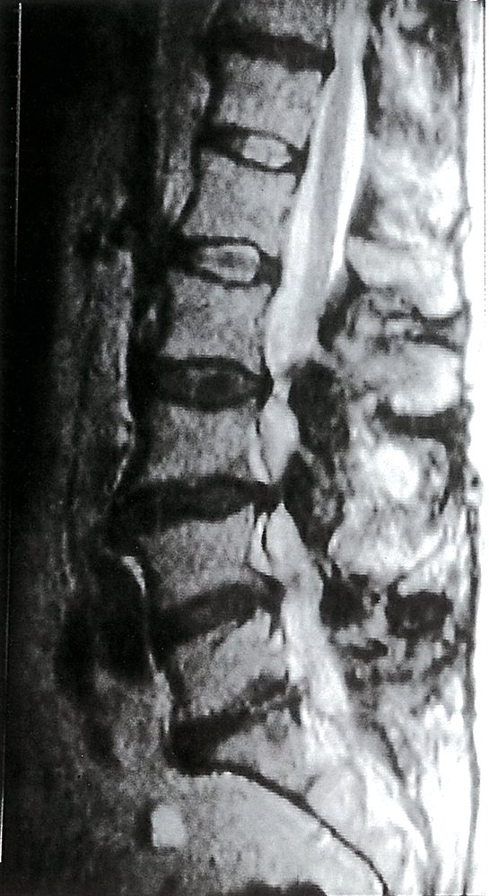

# Sciatica

*Categories: Clinical knowledge > Emergency medicine > Neurologic disorders > Sciatica*

[Original Article Link](https://coursology-qbank.com/amboss/article/Mt0MV3)

---

## Summary

Sciatica is <u>pain</u> radiating from the buttock down the lower extremity that is caused by compression or injury to the <u>sciatic nerve</u>. It is the most common form of <u>lumbosacral radiculopathy</u>, usually resulting from a <u>herniated disc</u> or <u>spinal stenosis</u> in the low <u>lumbar spine</u>. Characteristic features of sciatica include burning, stabbing, or aching <u>pain</u>, which may be accompanied by <u>weakness</u> and numbness in the lower extremity. Diagnosis is usually clinical, supported by findings from maneuvers such as the <u>straight leg test</u>. Imaging may be considered if there are <u>red flags for acute back pain</u>, diagnostic uncertainty, or refractory symptoms. The majority of cases are <u>self-limiting</u>, with symptoms resolving within three months; <u>conservative management</u> can be used for symptom control but supporting evidence for most interventions is weak. <u>Surgery</u> is reserved for patients with severe or refractory sciatica and clear abnormalities seen on imaging.

---

## Etiology

Sciatica is caused by compression or injury of the <u>sciatic nerve</u> anywhere from its origin at the <u>lumbosacral plexus</u> to the apex of the <u>popliteal fossa</u> where it bifurcates into the tibial and fibular nerves.  [[1]](https://coursology-qbank.com/amboss/article/_tW5TM0)

### Spinal causes of sciatica [[1]](https://coursology-qbank.com/amboss/article/_tW5TM0)

Spinal causes are the most common <u>etiology of sciatica</u>.

* <u>Degenerative disc disease</u> (e.g., <u>intervertebral disc herniation</u>) 

* Most commonly affected <u>intervertebral discs</u>: L4–L5 and L5–<u>S1</u>

* Less commonly affected <u>intervertebral discs</u>: L3–L4

* <u>Spondylolisthesis</u> or <u>lumbar spinal stenosis</u> (e.g., due to <u>spinal osteoarthritis</u>)

* <u>Mass effect</u> (e.g., <u>neurofibroma</u>, <u>arachnoid cyst</u>, <u>facet joint</u> synovial cyst)

* Inflammation of the <u>arachnoid mater</u>  [[2]](https://coursology-qbank.com/amboss/article/M-WMBL0)

Innervation of the lower extremity (dorsal view)

Spinal disk herniation with migration (2/3)

Spondylolisthesis of L4 on L5

Lumbar spinal stenosis

### Nonspinal causes of sciatica [[1]](https://coursology-qbank.com/amboss/article/_tW5TM0)

* Musculoskeletal

* <u>Piriformis syndrome</u>

* <u>Hip fracture</u> or <u>hip dislocation</u>

* Injury to the <u>hamstrings</u>

* Neuropathic

* <u>Diabetic radiculopathy</u>

* <u>Zoster sine herpete</u>

* Gynecologic/obstetric

* <u>Endometriosis</u>

* <u>Ovarian cyst</u> and/or uterine enlargement during <u>pregnancy</u>

* Prolonged <u>lithotomy position</u> (e.g., during <u>labor</u>)

* Other

* <u>Lumbosacral plexitis</u>

* Vascular impingement

* Pressure neuropathy

* <u>Iatrogenic</u> (e.g., gluteal injection site injury)

---

## Clinical features

* <u>Pain</u> radiating from the buttock down the leg [[1]](https://coursology-qbank.com/amboss/article/_tW5TM0)

* Aching, burning, and/or sharp in nature

* Often unilateral

* Onset may be acute or gradual.

* Additional clinical features depend on the cause and location of nerve compression or injury and may include: [[1]](https://coursology-qbank.com/amboss/article/_tW5TM0)

* <u>Low back pain</u>

* <u>Paresthesias</u>, numbness, and/or <u>weakness</u> [[3]](https://coursology-qbank.com/amboss/article/vzWAuL0)

* Clinical features of <u>lumbosacral radiculopathy</u>

* <u>Clinical features of degenerative disc disease</u>

* <u>Clinical features of spinal stenosis</u>

---