# Subarachnoid hemorrhage

*Categories: Clinical knowledge > Emergency medicine > Neurologic disorders > Subarachnoid hemorrhage*

[Original Article Link](https://coursology-qbank.com/amboss/article/2R0Tmf)

---

## Summary

Subarachnoid hemorrhage (SAH) refers to bleeding into the <u>subarachnoid space</u>. While SAH is often caused by trauma, 5–10% of cases are nontraumatic or spontaneous, in which case they are often due to the rupture of an <u>aneurysm</u> involving the <u>circle of Willis</u> (<u>aneurysmal</u> SAH). Nontraumatic SAH typically manifests with sudden and severe <u>headache</u>, which may be accompanied by <u>nausea</u>, <u>vomiting</u>, signs of <u>meningism</u>, and/or acute <u>loss of consciousness</u>. The best initial diagnostic test is a head <u>CT without contrast</u>, in which acute subarachnoid bleeding can be seen as <u>hyperdensities</u> in the <u>subarachnoid space</u>. If a head CT is negative for SAH, this diagnosis can be ruled out in many patients. However, if clinical suspicion remains high, it may be necessary to perform a <u>lumbar puncture</u> or <u>CT angiography</u>. Once SAH is confirmed, <u>angiography</u> is always necessary in order to identify the source of bleeding (e.g., <u>aneurysms</u> or other vascular abnormalities) and plan definitive treatment. The management of traumatic and nontraumatic SAH consists mostly of <u>neuroprotective measures</u> (e.g., control of blood pressure) to prevent <u>secondary brain injuries</u>. In <u>aneurysmal</u> SAH, microsurgical <u>clipping</u> or <u>endovascular coiling</u> of the <u>aneurysm</u> is indicated to prevent potentially fatal rebleeding. <u>Aneurysmal</u> SAH has a high <u>mortality rate</u> as a result of complications such as rebleeding and <u>delayed cerebral ischemia</u>.

See also “<u>Overview of stroke</u>” and “<u>Traumatic brain injury</u>” for more information.

---

## Definitions

* Subarachnoid hemorrhage: bleeding into the <u>subarachnoid space</u> that may be traumatic or spontaneous

* <u>Intracerebral hemorrhage</u>: bleeding within the <u>brain</u> <u>parenchyma</u>

* <u>Intracranial hemorrhage</u>: a broad term used to describe any bleeding within the <u>skull</u> (including <u>intracerebral hemorrhage</u>, subarachnoid hemorrhage, or <u>subdural hemorrhage</u>)

* <u>Hemorrhagic stroke</u>: <u>cerebral infarction</u> due to hemorrhage

* <u>Intraventricular hemorrhage</u>: bleeding within the ventricles

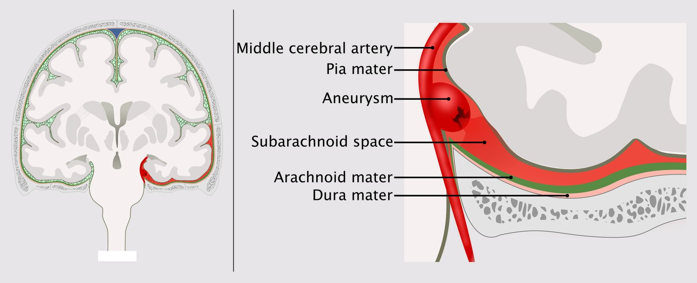

Subarachnoid hemorrhage

---

## Epidemiology

* Traumatic

* <u>Head trauma</u> is the most common cause of SAH.

* 40–60% of patients with <u>traumatic brain injury</u> have subarachnoid bleeding. [[1]](https://coursology-qbank.com/amboss/article/9LYN-p)

* Nontraumatic

* Ruptured <u>cerebral aneurysm</u> is the most common cause of nontraumatic SAH.

* Peak <u>incidence</u>: approx. 50 years of age

* <u>♀</u> > <u>♂</u> (3:2)

* Nontraumatic SAH is responsible for 5–10% of all <u>strokes</u>. [[2]](https://coursology-qbank.com/amboss/article/l5Yv4p)[[3]](https://coursology-qbank.com/amboss/article/tDbXTD)

References:[[2]](https://coursology-qbank.com/amboss/article/l5Yv4p)[[4]](https://coursology-qbank.com/amboss/article/qMYCpp)

Epidemiological data refers to the US, unless otherwise specified.

---

## Etiology

* Traumatic SAH: <u>traumatic brain injury</u>  [[5]](https://coursology-qbank.com/amboss/article/CDbqgD)

* Nontraumatic (spontaneous) SAH

* Causes

* Ruptured <u>intracranial aneurysms</u> 

* Most commonly occur in the <u>circle of Willis</u>  [[6]](https://coursology-qbank.com/amboss/article/vDbATD)

* <u>Berry aneurysms</u> account for approx. 80% of cases of nontraumatic SAH. [[7]](https://coursology-qbank.com/amboss/article/Eeb80G)

* See “<u>Cerebral aneurysm</u>” in the article on <u>aneurysms</u> for more information.

* Ruptured <u>arteriovenous malformations</u> (<u>AVM</u>)

* Others: cortical <u>thrombosis</u>, angioma, <u>neoplasm</u>, infection

* Triggers: most cases unknown, may be triggered by an acute rise in blood pressure;  (e.g., <u>caffeine</u> consumption, fits of anger, physical exertion) [[7]](https://coursology-qbank.com/amboss/article/Eeb80G)

* <u>Risk factors</u> [[7]](https://coursology-qbank.com/amboss/article/Eeb80G)[[8]](https://coursology-qbank.com/amboss/article/FDbgTD)[[9]](https://coursology-qbank.com/amboss/article/EDb8TD)

* Smoking

* <u>Hypertension</u>

* High <u>alcohol</u> consumption

* <u>Family history</u> of SAH

* <u>Methamphetamine</u> and <u>cocaine</u> use

* Large <u>aneurysms</u>  [[9]](https://coursology-qbank.com/amboss/article/EDb8TD)

* <u>Aneurysm</u> location  [[9]](https://coursology-qbank.com/amboss/article/EDb8TD)

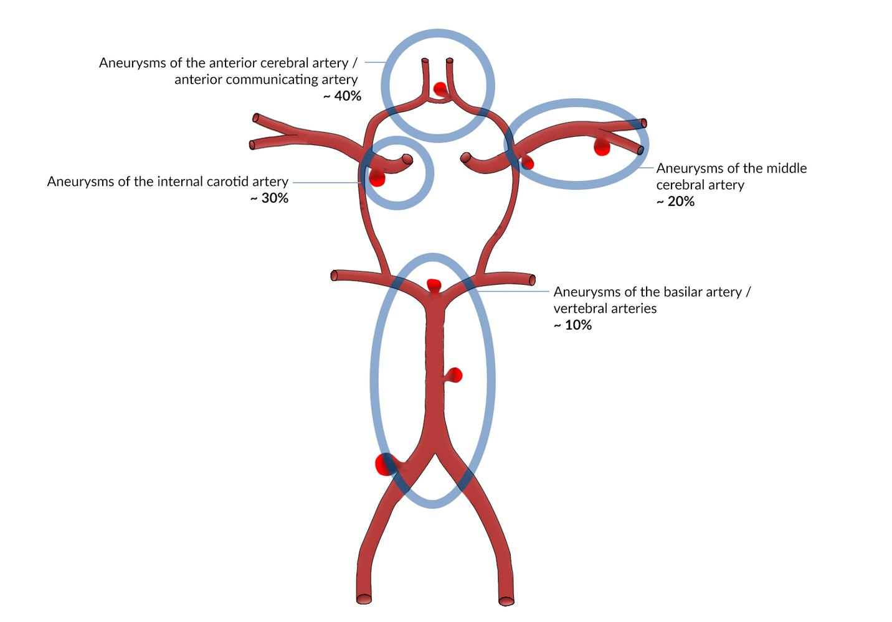

Common sites of intracerebral aneurysms

Subarachnoid hemorrhage

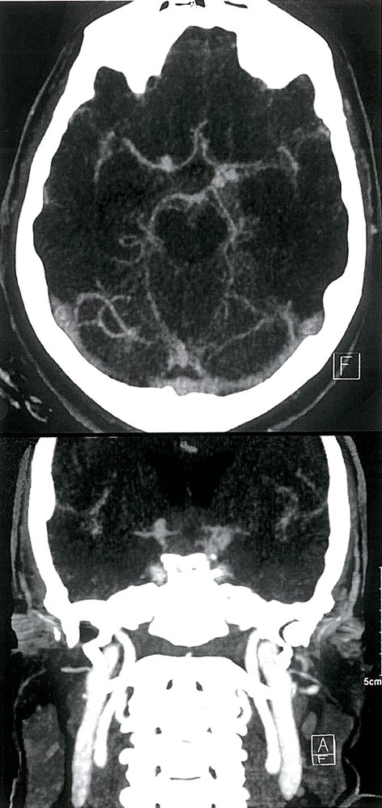

Multiple cerebral aneurysms

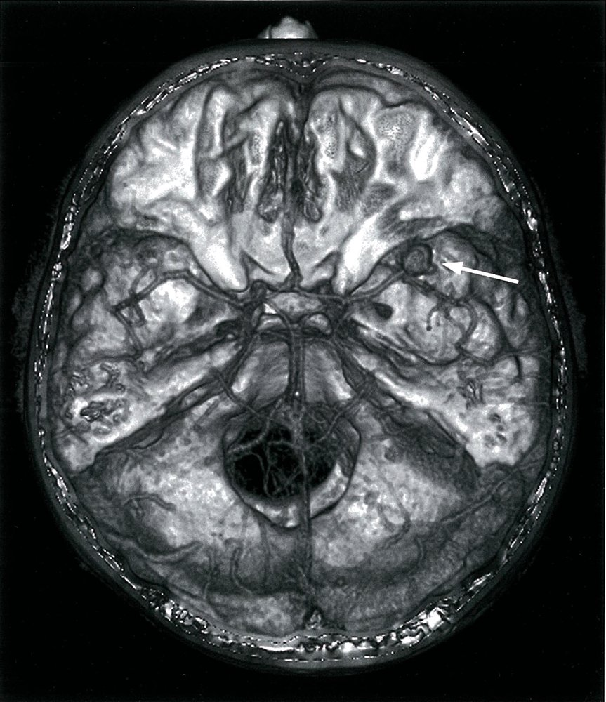

Cerebral aneurysm

---

## Clinical features

* Thunderclap headache

* Sudden, severely painful <u>headache</u> (often described by patients as the worst <u>headache</u> they have ever experienced)

* <u>Holocephalic</u>

* Radiates to the neck and back

* May present with <u>opisthotonus</u>

* <u>Meningeal signs</u>: 

* Neck stiffness

* <u>Photophobia</u>

* <u>Nausea and vomiting</u>

* <u>Kernig sign</u>

* <u>Brudzinski sign</u>

* Nonspecific signs

* Impaired consciousness (<u>somnolent</u> to <u>comatose</u>)

* <u>Fever</u>

* Sweating, <u>hemodynamic instability</u>

* Signs due to <u>mass effect</u>

* <u>Cranial nerve disorders</u>

* <u>Altered mental status</u> (e.g., <u>delirium</u>)

* <u>Focal neurological deficits</u>: See <u>stroke symptoms by affected vessel</u> and <u>stroke symptoms by affected region</u>.

* <u>Seizures</u>

* <u>Prodromal</u> symptoms due to sentinel leak (a "<u>warning leak</u>")

* 30–50% of patients with SAH report <u>prodromal</u> symptoms days-to-weeks prior to SAH. [[17]](https://coursology-qbank.com/amboss/article/naa7OQ)

* Sudden, severe <u>headache</u>

* Transient <u>diplopia</u>

* Likely due to low-grade leak of blood into the <u>subarachnoid space</u> → <u>thrombus</u> formation → <u>fibrinolysis</u> → hemorrhage

> [!WARNING]
> Maintain a high index of suspicion for SAH in patients with isolated <u>headache</u> or <u>cranial nerve</u> palsy, as they are more often misdiagnosed, resulting in poor outcomes due to delayed diagnosis and interventions. [[14]](https://coursology-qbank.com/amboss/article/BFcz4V0)

References:[[2]](https://coursology-qbank.com/amboss/article/l5Yv4p)[[4]](https://coursology-qbank.com/amboss/article/qMYCpp)[[11]](https://coursology-qbank.com/amboss/article/wDbhgD)

---

## Spontaneous SAH

The following information applies to the diagnostic workup of suspected SAH in patients without a history of trauma. See “<u>Management of traumatic SAH</u>” for the treatment of patients with SAH due to <u>head trauma</u>.

---

## Diagnostics

### Approach [[10]](https://coursology-qbank.com/amboss/article/CWbqns)[[18]](https://coursology-qbank.com/amboss/article/oaa0lQ)[[19]](https://coursology-qbank.com/amboss/article/BWbzns)[[20]](https://coursology-qbank.com/amboss/article/Deb1aG)

Since a missed <u>diagnosis of SAH</u> can have devastating consequences, clinicians should maintain a high index of suspicion when deciding whether to pursue testing.

* Common indications for testing

* <u>Headache</u> with impaired consciousness or abnormal findings on <u>neurological examination</u> (see also “<u>Red flags for headache</u>”)

* Clinical suspicion for SAH in patients fulfilling criteria of the <u>Ottawa SAH clinical decision rule</u>

* Best initial test: immediate head <u>CT without contrast</u> [[19]](https://coursology-qbank.com/amboss/article/BWbzns)[[21]](https://coursology-qbank.com/amboss/article/aPXQWy)

* Confirmation of SAH: Obtain <u>angiography</u> to confirm source of bleeding and plan treatment.

* Nondiagnostic head CT but persisting suspicion: Perform second-line diagnostic tests.

* Nondiagnostic CT in the first 6 hours in a neurologically intact patient: SAH unlikely; consider other differential diagnoses.  [[21]](https://coursology-qbank.com/amboss/article/aPXQWy)

* Second-line tests: <u>lumbar puncture</u> (<u>LP</u>) or <u>CT angiography</u> (<u>CTA</u>) ;  [[18]](https://coursology-qbank.com/amboss/article/oaa0lQ)[[21]](https://coursology-qbank.com/amboss/article/aPXQWy)

* <u>Lumbar puncture</u> 

* <u>LP</u> positive: Identify the source of bleeding with <u>angiography</u> (e.g., <u>CTA</u>, <u>DSA</u>) and plan intervention.

* <u>LP</u> negative; : SAH can be ruled out in most cases. If suspicion remains high, obtain <u>CTA</u>.

* <u>CTA</u> (alternative) 

* <u>CTA</u> positive: Consider if additional angiographic imaging is necessary (e.g., <u>DSA</u>, <u>MRA</u>) and plan intervention.

* <u>CTA</u> negative: SAH can be ruled out; consider other diagnoses. If suspicion remains high (which is rare), consider additional imaging (e.g., <u>DSA</u>, <u>MRA</u>).

* Additional studies: Obtain <u>CBC</u>, <u>BMP</u>, <u>coagulation panel</u>, and <u>type and screen</u>.

> [!WARNING]
> If patients are unstable or have <u>signs of increased ICP</u>, diagnostics should not delay stabilizing and <u>neuroprotective measures</u>.

### The Ottawa SAH clinical decision rule  [[21]](https://coursology-qbank.com/amboss/article/aPXQWy)[[22]](https://coursology-qbank.com/amboss/article/XPX9Wy)

<u>The Ottawa SAH clinical decision rule</u> can be used as a tool to exclude SAH in selected patients presenting to the emergency department with acute <u>headache</u>.

* Inclusion criteria (all of the following need to be fulfilled): 

* Age > 15 years

* Neurologically intact and alert (<u>GCS</u> 15)

* New, nontraumatic, severe <u>headache</u>, reaching maximum intensity in < 1 hour

* Risk features

* Age ≥ 40 years

* Reported <u>neck pain</u> or stiffness

* Witnessed <u>loss of consciousness</u>

* <u>Headache</u> triggered by physical exertion

* <u>Thunderclap headache</u> (peak intensity at onset)

* Neck rigidity on <u>physical examination</u>

* Interpretation  [[22]](https://coursology-qbank.com/amboss/article/XPX9Wy)

* Presence of 0 risk features: SAH ruled out

* Presence of ≥ 1 risk feature: SAH cannot be ruled out

Ottawa SAH rule for headache evaluation

### CT head without contrast [[11]](https://coursology-qbank.com/amboss/article/wDbhgD)[[18]](https://coursology-qbank.com/amboss/article/oaa0lQ)[[23]](https://coursology-qbank.com/amboss/article/F8bgov)

* Indication: all patients with suspected acute SAH

* Timing: as early as possible (when performed within 6 hours of onset, <u>sensitivity</u> is close to 100%)  [[19]](https://coursology-qbank.com/amboss/article/BWbzns)[[21]](https://coursology-qbank.com/amboss/article/aPXQWy)

* Defining feature: blood in <u>subarachnoid space</u> (<u>hyperdense</u>) with variable extension and location ;  [[11]](https://coursology-qbank.com/amboss/article/wDbhgD)[[23]](https://coursology-qbank.com/amboss/article/F8bgov)

* <u>Aneurysmal</u> SAH: typically located in the <u>basal cisterns</u>

* Nonaneurysmal SAH (uncommon)

* Ruptured <u>AVM</u>: Bleeding is often seen adjacent to the <u>dural venous sinuses</u>.  [[24]](https://coursology-qbank.com/amboss/article/HuXKs-)[[25]](https://coursology-qbank.com/amboss/article/VEXGu-)

* Perimesencephalic SAH: bleeding around perimesencephalic cisterns, with no extension into the ventricles or <u>parenchyma</u>  [[11]](https://coursology-qbank.com/amboss/article/wDbhgD)[[26]](https://coursology-qbank.com/amboss/article/vebA0G)

* Additional findings: bleeding in other compartments (see “<u>Differential diagnosis of intracranial hemorrhage</u>”)

> [!TIP]
> If there is a high index of suspicion for SAH, a negative CT head does not exclude the diagnosis and second-line tests are necessary. [[18]](https://coursology-qbank.com/amboss/article/oaa0lQ)

Ruptured middle cerebral artery aneurysm

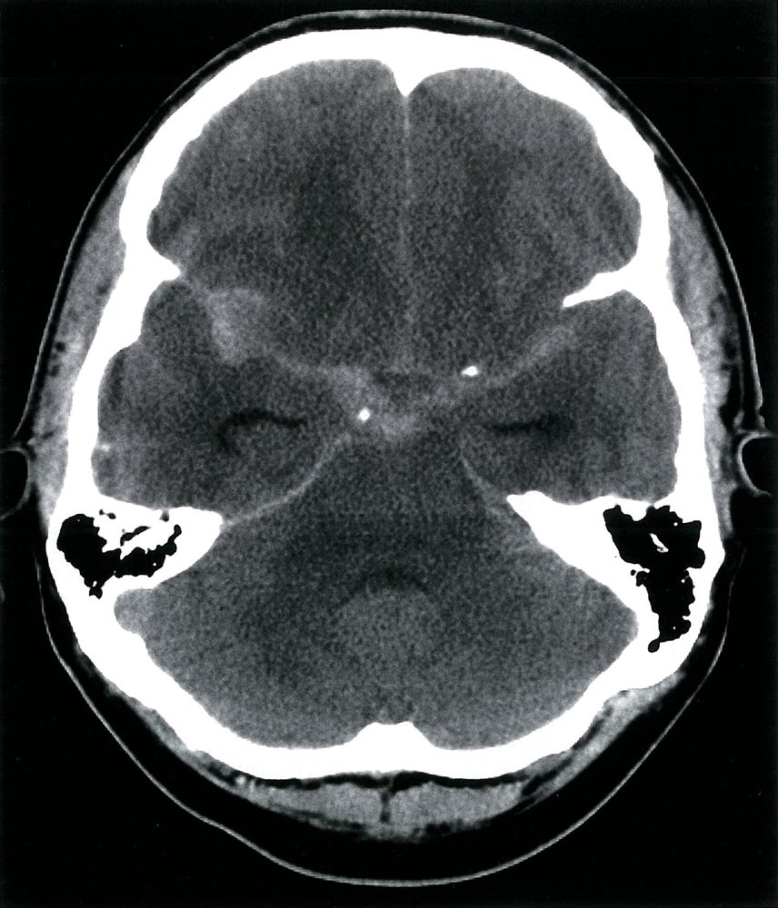

Subarachnoid hemorrhage

Subarachnoid hemorrhage

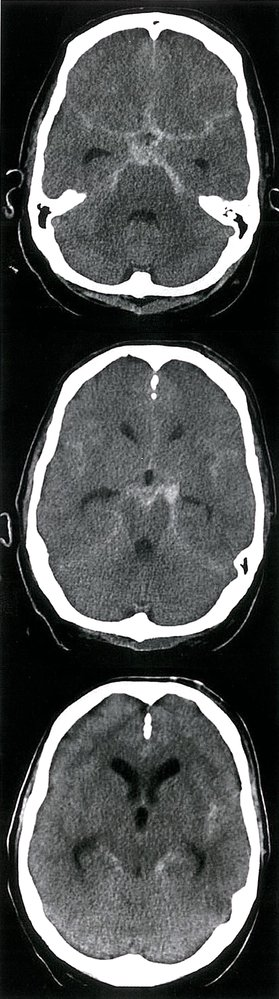

Subarachnoid hemorrhage

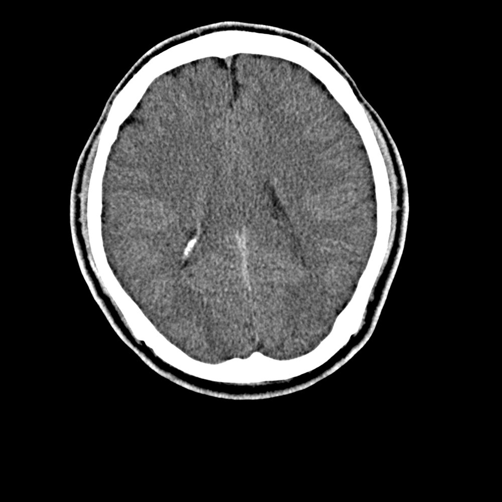

Subarachnoid hemorrhage

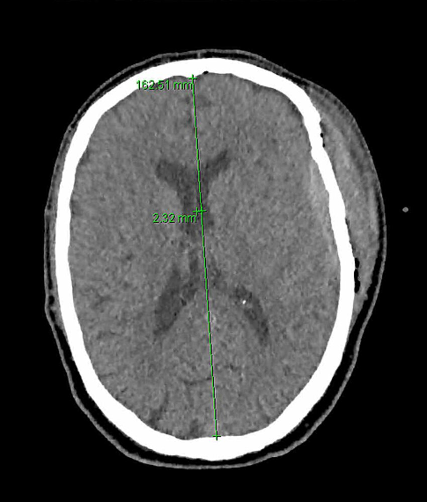

Traumatic epidural hematoma and subarachnoid hemorrhage

### <u>Lumbar puncture</u> (<u>LP</u>)  [[21]](https://coursology-qbank.com/amboss/article/aPXQWy)[[27]](https://coursology-qbank.com/amboss/article/3dbSps)[[28]](https://coursology-qbank.com/amboss/article/Y9XnNZ0)

* Indication: history and/or examination that is concerning for SAH, but negative CT head [[29]](https://coursology-qbank.com/amboss/article/dPXody)

* <u>Opening pressure</u>: normal or elevated

* The following may be evaluated to identify <u>cerebrospinal fluid</u> (<u>CSF</u>) features suggestive of SAH:

* <u>CSF</u> color

* Early findings: pink to red blood-tinged discoloration  [[30]](https://coursology-qbank.com/amboss/article/bEcH8V0)[[31]](https://coursology-qbank.com/amboss/article/XEc98V0)

* Late findings: xanthochromia; , which is the presence of <u>bilirubin</u> in the <u>CSF</u> secondary to the <u>breakdown of RBCs</u>, resulting in yellow discoloration  [[20]](https://coursology-qbank.com/amboss/article/Deb1aG)

* Cell count (normal <u>RBC</u>:<u>WBC</u> <u>ratio</u>) 

* <u>RBC count</u>: elevated (no specific threshold)  [[30]](https://coursology-qbank.com/amboss/article/bEcH8V0) [[19]](https://coursology-qbank.com/amboss/article/BWbzns)[[32]](https://coursology-qbank.com/amboss/article/JjXsYy)

* <u>WBC count</u>: may be mildly elevated

* <u>Glucose</u>: normal

* Protein: elevated

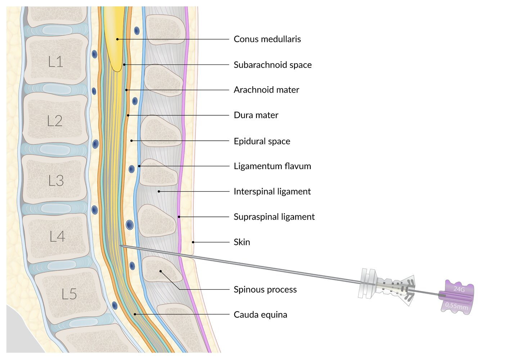

Anatomical structures in lumbar puncture, spinal anesthesia, and epidural anesthesia

> [!WARNING]
> Concerns for <u>elevated ICP</u> (e.g., on <u>physical examination</u> or <u>CT scan</u>) or <u>coagulopathy</u> are relative <u>contraindications for LP</u>.

### <u>Neurovascular imaging</u> [[10]](https://coursology-qbank.com/amboss/article/CWbqns)[[18]](https://coursology-qbank.com/amboss/article/oaa0lQ)[[19]](https://coursology-qbank.com/amboss/article/BWbzns)[[33]](https://coursology-qbank.com/amboss/article/c8calV0)

* <u>CT angiography</u> (<u>CTA</u>)

* Indications [[33]](https://coursology-qbank.com/amboss/article/c8calV0)[[34]](https://coursology-qbank.com/amboss/article/35YSPp)[[35]](https://coursology-qbank.com/amboss/article/TCY6rr)

* Patients with SAH identified on CT head without contrast

* First-line imaging  in patients with suspected SAH and ≥ 2 first-degree relatives with known <u>aneurysmal</u> SAH

* Patients with a negative CT head who decline or have <u>contraindications to LP</u>

* Benefits

* Widely available and minimally invasive

* High <u>sensitivity</u> and <u>specificity</u> for <u>aneurysms</u> larger than 3–4 mm

* Can typically provide enough information to plan <u>aneurysm</u> repair [[11]](https://coursology-qbank.com/amboss/article/wDbhgD)[[36]](https://coursology-qbank.com/amboss/article/GQXBxB)

* Findings  [[37]](https://coursology-qbank.com/amboss/article/TEX6E-)

* Visualization of <u>aneurysms</u> (accumulation of contrast)

* May detect extravasation of contrast in the case of active bleeding

* No blood visualized or a <u>perimesencephalic SAH</u> blood pattern: No further imaging is required. [[38]](https://coursology-qbank.com/amboss/article/REclvV0)

* Diffuse or peripheral SAH blood pattern: Proceed to catheter-directed <u>angiography</u> with <u>DSA</u>. [[18]](https://coursology-qbank.com/amboss/article/oaa0lQ)[[33]](https://coursology-qbank.com/amboss/article/c8calV0)[[39]](https://coursology-qbank.com/amboss/article/18c2lV0)

* May detect vascular abnormalities (e.g., <u>AVM</u>)

* <u>Digital subtraction angiography</u> (<u>DSA</u>): <u>gold standard</u> for cerebral vessel imaging  ;  [[11]](https://coursology-qbank.com/amboss/article/wDbhgD)

* Indications 

* Detection of small <u>aneurysms</u> in selected patients with a negative CT

* To plan interventions (when <u>CTA</u> is insufficient)

* Invasive imaging modality

* Findings: similar to <u>CTA</u>

* <u>MRI</u> and/or <u>MR angiography</u> [[11]](https://coursology-qbank.com/amboss/article/wDbhgD)[[18]](https://coursology-qbank.com/amboss/article/oaa0lQ)[[36]](https://coursology-qbank.com/amboss/article/GQXBxB)[[40]](https://coursology-qbank.com/amboss/article/BjXzcy)

* Used to rule out <u>differential diagnoses of headache</u>

* Consider if other studies are nondiagnostic.

* May show bleeding not detected by <u>CT scans</u>, especially several days after the incident

> [!TIP]
> <u>CTA</u> has poor <u>sensitivity</u> for detecting <u>aneurysms</u> < 3 mm in size and <u>aneurysms</u> that overlie bone (e.g., at the <u>skull base</u>). [[18]](https://coursology-qbank.com/amboss/article/oaa0lQ)[[33]](https://coursology-qbank.com/amboss/article/c8calV0)[[39]](https://coursology-qbank.com/amboss/article/18c2lV0)

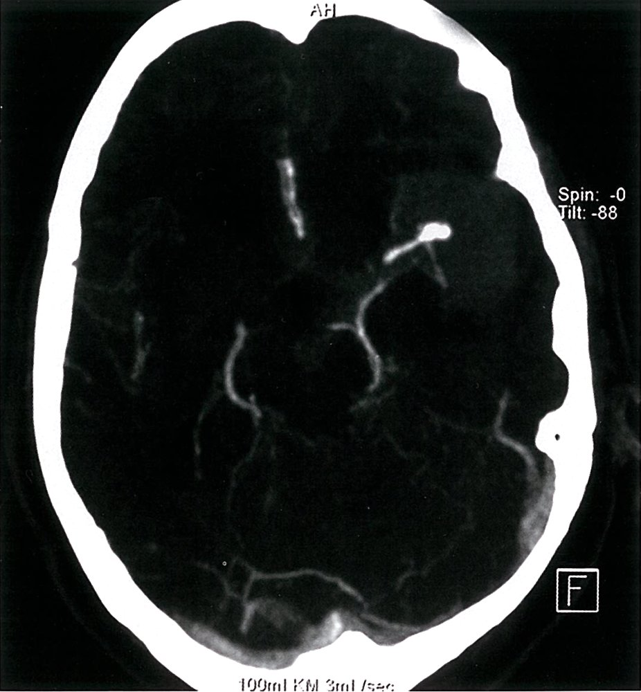

Ruptured middle cerebral artery aneurysm

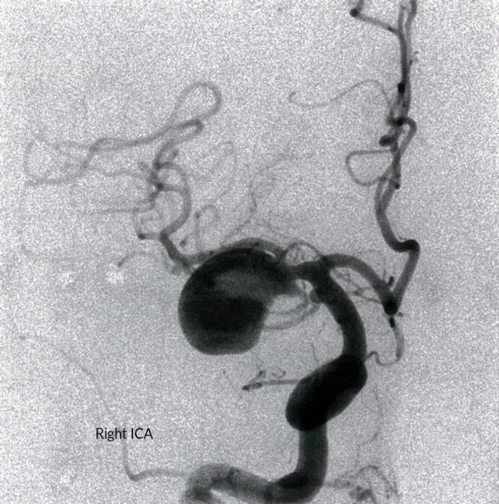

Cerebral artery aneurysm

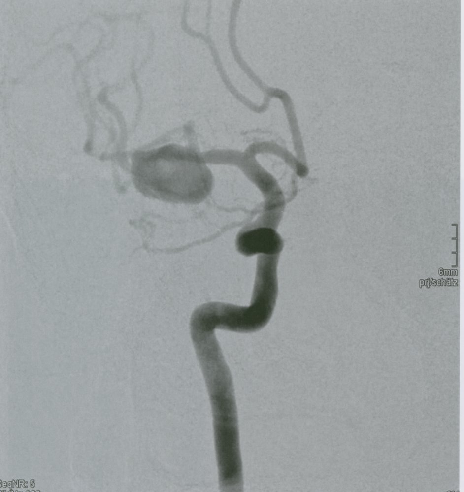

Cerebral artery aneurysm

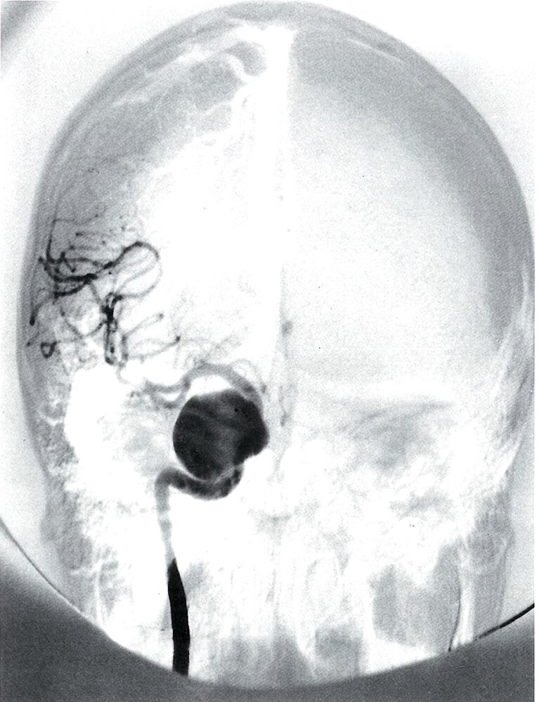

Internal carotid artery aneurysm

---

## Management

The initial management of all patients with spontaneous SAH is similar, but further management depends on the underlying etiology. While <u>aneurysmal</u> hemorrhage can be treated with <u>endovascular coiling</u> or microsurgical <u>clipping</u>, there are few specific definite treatment options for nonaneurysmal SAH.

### Initial management [[11]](https://coursology-qbank.com/amboss/article/wDbhgD)[[18]](https://coursology-qbank.com/amboss/article/oaa0lQ)[[20]](https://coursology-qbank.com/amboss/article/Deb1aG)

Primary measures should be initiated urgently in the ED. The goal is to stabilize the patient and prevent early rebleeding and <u>secondary brain injury</u>.

* Stabilization

* Perform an <u>ABCDE survey</u>.

* <u>Secure the airway</u> if indicated; If patients are unconscious or have a declining <u>GCS</u> score, <u>manage the airway</u> while considering precautions for <u>intubating patients with increased ICP</u>.

* Provide <u>hemodynamic support</u> as needed.

* Prevention of rebleeding 

* <u>Anticoagulant reversal</u>

* Management of blood pressure and <u>cerebral perfusion pressure</u> ; (<u>CPP</u>; ): See “<u>Blood pressure control in brain injury</u>” for a general approach. .

* Start IV <u>antihypertensive agents</u> if blood pressure is elevated.

* Target <u>SBP</u> < 160 mm Hg (reasonable for patients with <u>aneurysmal</u> SAH)  [[18]](https://coursology-qbank.com/amboss/article/oaa0lQ)

* Suspected <u>increased ICP</u>: Consider permissible <u>hypertension</u> (e.g., <u>MAP</u> > 90 mm Hg) to maintain <u>cerebral perfusion pressure</u>  and prevent cerebral <u>hypoperfusion</u>. [[41]](https://coursology-qbank.com/amboss/article/d8colV0)[[42]](https://coursology-qbank.com/amboss/article/QEcuvV0)

* Consider placing an <u>arterial line</u> for continuous <u>invasive blood pressure monitoring</u>.

* Control symptoms that can increase <u>ICP</u>: Administer <u>pain management</u> and <u>antiemetics</u> as needed.  [[20]](https://coursology-qbank.com/amboss/article/Deb1aG)

* <u>Antifibrinolytic therapy</u>: not routinely recommended; potentially useful for patients with an expected delay in <u>aneurysm</u> repair  [[18]](https://coursology-qbank.com/amboss/article/oaa0lQ)[[43]](https://coursology-qbank.com/amboss/article/FFYgPI)

* Other <u>neuroprotective measures</u> [[11]](https://coursology-qbank.com/amboss/article/wDbhgD)

* Start <u>ICP management</u> (e.g., elevate head 30°, IV <u>mannitol</u>, short-term controlled <u>hyperventilation</u>).

* Treatment goals

* <u>Euvolemia</u>

* <u>Euglycemia</u> (See “<u>Glycemic management in secondary brain injury</u>.”)

* <u>Normothermia</u> (see “<u>Targeted temperature management</u>.”)

* <u>Eunatremia</u>: Patients are at risk for <u>cerebral salt wasting</u> and <u>SIADH</u>.

* Consider <u>neuroprotective seizure prophylaxis following an intracranial event</u>.

* Consults and disposition

* Consult neurosurgery and interventional radiology.

* Admit to neurological critical care or, if possible, transfer to a high-volume center.  [[43]](https://coursology-qbank.com/amboss/article/FFYgPI)

> [!TIP]
> Rebleeding is a life-threatening complication that most commonly occurs in the first 6 hours after SAH. Start measures to prevent rebleeding immediately. [[11]](https://coursology-qbank.com/amboss/article/wDbhgD)[[18]](https://coursology-qbank.com/amboss/article/oaa0lQ)

> [!WARNING]
> Generally avoid <u>nitrates</u> for <u>blood pressure control in brain injury</u>, as they may elevate <u>ICP</u>. Consider alternative agents (e.g., titratable <u>nicardipine</u> or <u>labetalol</u>). [[18]](https://coursology-qbank.com/amboss/article/oaa0lQ)

Cerebral perfusion pressure (CPP)

### Treatment of <u>aneurysmal</u> SAH [[18]](https://coursology-qbank.com/amboss/article/oaa0lQ)[[43]](https://coursology-qbank.com/amboss/article/FFYgPI)

All <u>aneurysmal</u> SAHs require definitive endovascular or microsurgical <u>aneurysm</u> repair as early as possible. Patients should be admitted to critical care for further management to prevent and treat <u>secondary brain injury</u> and systemic complications.

#### <u>Intracranial aneurysm repair</u> [[18]](https://coursology-qbank.com/amboss/article/oaa0lQ)

|  Intracranial aneurysm repair [[10]](https://coursology-qbank.com/amboss/article/CWbqns)[[18]](https://coursology-qbank.com/amboss/article/oaa0lQ)[[29]](https://coursology-qbank.com/amboss/article/dPXody)  |  |  |
| --- | --- | --- |
|  |  Endovascular coiling  | Microsurgical clipping |
| Characteristics |   * Minimally invasive  * Higher risk of incomplete obliteration and recurrent bleeding    |   * More invasive  * Higher rate of complete <u>aneurysm</u> occlusion  * Lower risk of recurrent bleeding    |
| Indications |   * Poor surgical candidates  * <u>Posterior</u> circulation <u>aneurysms</u>  * Vasospasm    |   * Large intracerebral <u>hematoma</u> (e.g., with <u>increased ICP</u>)  * <u>Middle cerebral artery</u> <u>aneurysms</u>  * Difficult endovascular access  * Failed endovascular treatment    |
| Procedure |   * Insertion of a catheter under <u>fluoroscopic</u> guidance  * Placement of metal coils in the <u>aneurysm</u> lumen to interrupt blood flow and induce <u>thrombotic</u> occlusion    |   * <u>Craniotomy</u> and exposure of the <u>aneurysm</u>  * Mechanical occlusion of the neck of the <u>aneurysm</u> using titanium clips    |

#### Further management [[43]](https://coursology-qbank.com/amboss/article/FFYgPI)

* Prevention of vasospasm and <u>delayed cerebral ischemia</u>

* Administer oral <u>nimodipine</u> DOSAGE in all patients, preferably within 96 hours of symptom onset.
 [[18]](https://coursology-qbank.com/amboss/article/oaa0lQ)[[20]](https://coursology-qbank.com/amboss/article/Deb1aG)[[29]](https://coursology-qbank.com/amboss/article/dPXody)

* Ensure appropriate <u>neurological monitoring</u>: [[11]](https://coursology-qbank.com/amboss/article/wDbhgD)[[43]](https://coursology-qbank.com/amboss/article/FFYgPI)

* <u>Neurological examination</u> every 1–2 hours

* Head CT 24–48 hours after <u>aneurysm</u> repair

* Other measures to consider include daily <u>transcranial Doppler scan</u>, repeated <u>angiography</u>, monitoring of <u>ICP</u> and <u>cerebral perfusion pressure</u>, and continuous <u>EEG</u>.

* <u>Transfusion</u> of <u>packed RBCs</u>: Consider <u>transfusions</u> to keep the <u>hemoglobin concentration</u> 8–10 g/dL.  [[43]](https://coursology-qbank.com/amboss/article/FFYgPI)

* <u>Treatment of hydrocephalus</u>: may include an <u>external ventricular drain</u> (<u>EVD</u>), lumbar drainage, or permanent <u>ventriculoperitoneal shunt</u> [[10]](https://coursology-qbank.com/amboss/article/CWbqns)[[18]](https://coursology-qbank.com/amboss/article/oaa0lQ)

* Detection of cardiopulmonary complications  [[11]](https://coursology-qbank.com/amboss/article/wDbhgD)[[44]](https://coursology-qbank.com/amboss/article/hxXcwZ0)

* Chest <u>x-ray</u>: to exclude pulmonary complications (e.g., <u>pulmonary edema</u>)

* Serum <u>troponin</u>: to detect <u>myocardial</u> <u>ischemia</u>  [[45]](https://coursology-qbank.com/amboss/article/wPXhSy)

* <u>ECG</u>: to exclude <u>myocardial</u> <u>ischemia</u> and <u>arrhythmias</u>

* <u>Echocardiography</u>: to assess contractility and ventricular function

* <u>DVT prophylaxis</u>: mechanical from the beginning, and pharmacological 24 hours after <u>aneurysm</u> repair (preferably with <u>unfractionated heparin</u>)

> [!WARNING]
> Only administer <u>nimodipine</u> orally or via <u>enteral tube</u>; Parenteral administration is associated with significant adverse effects (e.g., severe <u>hypotension</u> and <u>cardiac arrest</u>).

### Treatment of nonaneurysmal SAH

Depending on the etiology, some specific measures may help improve the outcome.

* <u>Arteriovenous malformations</u> [[25]](https://coursology-qbank.com/amboss/article/VEXGu-)[[46]](https://coursology-qbank.com/amboss/article/_uX5F-)

* Admit to <u>neurocritical care unit</u> and start <u>neuroprotective measures</u>.

* Emergency <u>surgery</u> may be necessary for <u>hemorrhage control</u> and evacuation of larger <u>hematomas</u>.

* Endovascular embolization may be performed preoperatively  or as definitive treatment.

* Complete obliteration of the <u>AVM</u> is achieved via planned microsurgery or <u>stereotactic radiosurgery</u>.

* SAH without associated vascular abnormalities (rare): Consider repeating <u>DSA</u> to look for <u>aneurysms</u> that were overlooked before. [[11]](https://coursology-qbank.com/amboss/article/wDbhgD)[[26]](https://coursology-qbank.com/amboss/article/vebA0G)

* Perimesencephalic hemorrhage: Provide supportive measures.

* Other nonaneurysmal hemorrhages: Treatment is mainly supportive and management depends on local/institutional protocols.

---

## Complications

* Vasospasm

* Occurs in approx. 30% of patients with SAH [[18]](https://coursology-qbank.com/amboss/article/oaa0lQ)

* Transcranial <u>doppler ultrasound</u> study can help identify vasospasm.

* Pathophysiology

* Impaired <u>CSF</u> reabsorption from the arachnoid villi → nonobstructive (communicating) <u>hydrocephalus</u> → ↑ intracranial pressure → ↓ cerebral <u>perfusion</u> pressure → <u>ischemia</u>

* Release of <u>clotting factors</u> and vasoactive substances → diffuse vasospasm of cerebral vessels  → <u>ischemia</u>

* Can lead to <u>ischemic stroke</u>

* Most common in patients with nontraumatic SAH due to a ruptured <u>aneurysm</u>

* Usually occurs between 3–10 days after SAH

* Increases the risk of developing communicating and/or <u>obstructive hydrocephalus</u>

* Recurrent bleeding

* Occurs in 4–14% of patients with SAH in the first 24 hours [[18]](https://coursology-qbank.com/amboss/article/oaa0lQ)

* Risk of rebleeding is highest in the first 2–12 hours after SAH

* The cumulative risk of recurrent bleeding within the first six months is about 50%.

* <u>Hydrocephalus</u>

* Occurs in 20–30% of patients with SAH [[52]](https://coursology-qbank.com/amboss/article/e70xkh)

* Acute <u>obstructive hydrocephalus</u> 

* Usually occurs within minutes to hours after SAH

* Can lead to <u>coma</u> and <u>death</u>

* Chronic <u>communicating hydrocephalus</u>

* Usually occurs weeks or months after SAH

* SAH impairs <u>CSF</u> resorption from the <u>arachnoid villi</u>.

* Other complications [[18]](https://coursology-qbank.com/amboss/article/oaa0lQ)

* Delayed cerebral ischemia

* A complication of <u>aneurysmal</u> subarachnoid hemorrhage (SAH) defined as a worsening neurological status that cannot be attributed to other causes (e.g., <u>hypoxemia</u> or <u>seizures</u>)

* Typically occurs 3 days to 2 weeks after SAH

* While it is associated with cerebral vasospasm, the exact pathophysiology is not known

* <u>Elevated ICP</u>: <u>hypertension</u>, <u>bradycardia</u>, and irregular breathing (see <u>Cushing triad</u>)

* <u>Seizures</u>

* <u>SIADH</u>

* Cerebral salt wasting (rare)

* Causes <u>hypovolemic</u>, <u>hypotonic hyponatremia</u>, although the mechanism is poorly understood.

* Classically, its onset occurs within 10 days of an inciting event within the <u>central nervous system</u> (particularly subarachnoid hemorrhage) or neurosurgical procedure.

* Severe symptoms are treated with <u>hypertonic saline</u> and <u>fludrocortisone</u>.

* Cardiac dysfunction (e.g., <u>arrhythmias</u>, acute <u>MI</u>)

* Terson syndrome (20% of cases): <u>preretinal hemorrhage</u> due to SAH

References:[[18]](https://coursology-qbank.com/amboss/article/oaa0lQ)

We list the most important complications. The selection is not exhaustive.

---

## Prognosis

* Approx. 30% <u>mortality rate</u> in the U.S. within the first 30 days  [[18]](https://coursology-qbank.com/amboss/article/oaa0lQ)

* Survivors: increased rates of neurologic impairment (e.g., cognitive, mood changes, functional, <u>epilepsy</u>) and increased risk of recurrent SAH

---