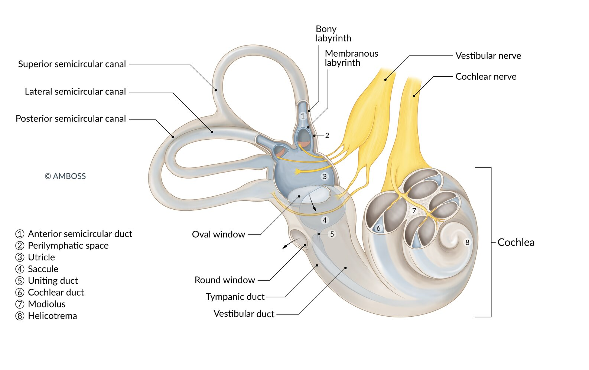

# Vestibular neuritis

*Categories: Clinical knowledge > Emergency medicine > Neurologic disorders > Vestibular neuritis*

[Original Article Link](https://coursology-qbank.com/amboss/article/Si0yIf)

---

## Summary

Vestibular <u>neuritis</u> (VN) is the <u>idiopathic</u> inflammation of the vestibular nerve. Although the etiology is unclear, it is thought to be viral in origin because it commonly occurs after <u>upper airway</u> infections. The disorder manifests as <u>acute vestibular syndrome</u> with persistent, acute-onset <u>vertigo</u>, <u>nausea and vomiting</u>, and gait instability in otherwise healthy patients. When <u>hearing loss</u> is present, it is sometimes referred to as <u>labyrinthitis</u>. Diagnosis is clinical and should include a complete otoneurological examination to exclude a central cause of <u>acute vestibular syndrome</u>, such as <u>cerebellar stroke</u> or <u>lateral medullary syndrome</u>. <u>Vestibular rehabilitation therapy</u> is the most important aspect of treatment and should be initiated as soon as possible. Symptomatic therapy with <u>vestibular suppressants</u> may be considered during the acute phase. <u>Glucocorticoids</u> are no longer routinely recommended as there is insufficient evidence regarding their long-term <u>efficacy</u>. The acute phase of severe <u>vertigo</u> usually lasts a few days and symptoms typically resolve in 2–3 weeks with treatment. In refractory cases, which are rare, vestibular <u>ablation therapy</u> or <u>surgery</u> involving the <u>inner ear</u> may be necessary.

See also “<u>Vertigo</u>.”

---

## Definitions

See also “<u>Acute vestibular syndrome</u>.”

* Vestibular <u>neuritis</u>: inflammation of the vestibular nerve with features of vestibular hypofunction, such as <u>vertigo</u>, <u>nausea</u>, <u>vomiting</u>, and gait instability, usually without <u>hearing loss</u>   [[1]](https://coursology-qbank.com/amboss/article/mibVHt)[[2]](https://coursology-qbank.com/amboss/article/DNb1W8)

* <u>Labyrinthitis</u>: <u>ipsilateral</u> <u>sensorineural hearing loss</u> associated with features of vestibular <u>neuritis</u> [[1]](https://coursology-qbank.com/amboss/article/mibVHt)

* Acute peripheral vestibulopathy: a term used to encompass peripheral causes of <u>acute vestibular syndrome</u> (i.e., vestibular <u>neuritis</u> and <u>labyrinthitis</u>) [[3]](https://coursology-qbank.com/amboss/article/e5XxQA)

> [!TIP]
> The term <u>dizziness</u> is nonspecific and is variably used to describe distinct symptoms such as <u>vertigo</u>, <u>presyncope</u>, imbalance, and confusion.

Anatomy of the inner ear

---

## Etiology

* <u>Idiopathic</u> inflammation of the vestibular nerve

* Tends to occur more often after <u>upper airway</u> infections  [[2]](https://coursology-qbank.com/amboss/article/DNb1W8)[[5]](https://coursology-qbank.com/amboss/article/5-YiB7)

---

## Clinical features

* Acute or subacute onset ;  [[1]](https://coursology-qbank.com/amboss/article/mibVHt)[[4]](https://coursology-qbank.com/amboss/article/XSb9yG)

* Severe <u>vertigo</u>: persistent and continuous, often exacerbated by head motion

* <u>Nausea and vomiting</u>

* Gait instability

* Increased risk of falling toward the affected side

* <u>Nystagmus</u> (spontaneous horizontal unilateral)

* <u>Oscillopsia</u>

* Progression and duration of symptoms

* Usually develop over several hours

* Severe symptoms usually last for 1–2 days

* Mild symptoms may persist for weeks or even months.

* Examination

* Characteristic findings on <u>HINTS examination</u>

* <u>Neurological examination</u> is otherwise normal.

> [!TIP]
> <u>Cochlear symptoms</u> (e.g., <u>hearing loss</u>, <u>tinnitus</u>) are usually absent in vestibular <u>neuritis</u>.

> [!WARNING]
> The presence of neurological abnormalities (e.g., <u>truncal ataxia</u>) in a patient with <u>acute vestibular syndrome</u> should raise suspicion for a central cause (e.g., <u>cerebellar stroke</u>, <u>lateral medullary syndrome</u>).

---

## Subtypes and variants

### Labyrinthitis

* Definition: inflammation of the <u>inner ear</u>, notably the <u>membranous labyrinth</u>

* <u>Epidemiology</u>

* Peak <u>incidence</u>: 30–50 years of age [[6]](https://coursology-qbank.com/amboss/article/dh1o1g0)

* <u>♀</u> > <u>♂</u> (1,5:1) [[6]](https://coursology-qbank.com/amboss/article/dh1o1g0)

* Etiology

* Infectious: <u>viruses</u>, bacteria, fungi

* Viral labyrinthitis 

* Congenital: <u>rubella</u>, <u>cytomegalovirus</u>

* Acquired: <u>mumps</u>, <u>measles</u>, <u>herpes simplex virus</u>, <u>influenza</u>, <u>HIV</u>, <u>varicella zoster virus</u> (see “<u>Herpes zoster oticus</u>”)

* Bacterial labyrinthitis; : typically a complication of <u>acute otitis media</u>, <u>meningitis</u>, <u>mastoiditis</u>, <u>syphilis</u>, or <u>cholesteatoma</u> [[7]](https://coursology-qbank.com/amboss/article/Vh1G1g0)

* Autoimmune systemic diseases (e.g., due to <u>vasculitis</u>)

* Other: <u>head trauma</u>, vascular <u>ischemia</u>, <u>ototoxic drugs</u> (e.g., <u>aminoglycosides</u>)

* Pathophysiology: toxins or bacteria spread to the <u>inner ear</u> (labyrinth) through the round or <u>oval window</u>

* Clinical features

* Severe <u>vertigo</u>, <u>nausea</u>, and <u>vomiting</u>

* <u>Hearing loss</u>, <u>tinnitus</u>

* <u>Nystagmus</u> direction toward healthy <u>ear</u>: <u>Labyrinthitis</u> causes decreased vestibular activity (due to damage) and is typically associated with <u>nystagmus</u> toward the healthy <u>ear</u>.  [[8]](https://coursology-qbank.com/amboss/article/_uc5FV0)[[9]](https://coursology-qbank.com/amboss/article/zucrFV0)

* <u>Fever</u>, <u>ear</u> <u>rash</u>, facial <u>paralysis</u> in case of <u>herpes zoster oticus</u>

* Diagnostics

* See “Diagnostics” below

* <u>Bacterial labyrinthitis</u>

* Complication of <u>otitis media</u>: change of lateralization in <u>Weber test</u>

* <u>Audiometry</u> confirms <u>sensorineural hearing loss</u>

* Treatment: based on the underlying cause

* Viral: See “Treatment” section below.

* Bacterial

* IV <u>antibiotics</u> PLUS <u>tympanostomy</u> with insertion of <u>tympanostomy</u> tube PLUS <u>glucocorticoids</u>

* <u>Mastoidectomy</u> (to treat the source of infection in <u>acute otitis media</u>)

* Autoimmune: <u>corticosteroids</u>

> [!TIP]
> <u>Labyrinthitis</u> can be distinguished from vestibular <u>neuritis</u> based on the presence of <u>hearing loss</u>.

---

## Diagnosis

See “<u>Approach to vertigo</u>” for details on clinical evaluation, targeted testing (e.g., <u>HINTS examination</u>), and <u>neuroimaging</u> for patients with undifferentiated <u>acute vestibular syndrome</u>.

* Vestibular <u>neuritis</u> is a <u>clinical diagnosis</u>.

* Perform a complete otoneurological examination to <u>distinguish between peripheral and central vertigo</u> in all patients.

* Obtain urgent <u>neuroimaging</u> if clinical evaluation suggests <u>central vertigo</u> and in patients with <u>risk factors for ischemic stroke</u>.

* Viral testing (culture or <u>serology</u>) is not routinely recommended [[1]](https://coursology-qbank.com/amboss/article/mibVHt)

* See also “<u>Diagnostic testing for vertigo</u>” for information on additional investigations for <u>causes of peripheral vertigo</u> ,e.g., <u>audiometry</u> and <u>caloric testing</u>.

---

## Treatment

Hospital admission may be necessary in patients with severe symptoms or if there is any concern for a central etiology of symptoms.

### Pharmacotherapy

Therapy is primarily supportive; see “<u>Management of peripheral vertigo</u>” for more information.

* <u>Antiemetics</u> and <u>vestibular suppressants</u>: only indicated in the acute setting.

* <u>Corticosteroids</u> (e.g., <u>prednisone</u> DOSAGE) [[12]](https://coursology-qbank.com/amboss/article/93bNkt)

* Not routinely recommended  [[13]](https://coursology-qbank.com/amboss/article/2hbTWt)

* There is evidence they improve recovery at the one-month mark, but long-term benefits are uncertain. [[14]](https://coursology-qbank.com/amboss/article/3hbSdt)

* If considered , they should be started within 72 hours of symptom onset. [[15]](https://coursology-qbank.com/amboss/article/fhbkWt)

* <u>Antiviral therapy</u>: not routinely recommended  [[4]](https://coursology-qbank.com/amboss/article/XSb9yG)[[15]](https://coursology-qbank.com/amboss/article/fhbkWt)

### Other therapies [[16]](https://coursology-qbank.com/amboss/article/v3bA4t)

* <u>Vestibular rehabilitation therapy</u>: facilitates central vestibular compensation and accelerates recovery.

* Interventional therapy

* Overview: reduce or eliminate sensory information output to the <u>brain</u> to allow for central compensation

* Indication: consider in patients with refractory symptoms

* Procedures

* Chemical <u>labyrinthectomy</u>: transtympanic <u>gentamicin</u> infusion  [[17]](https://coursology-qbank.com/amboss/article/D3b1kt)

* <u>Surgery</u>: <u>vestibular neurectomy</u> or <u>labyrinthectomy</u>

---