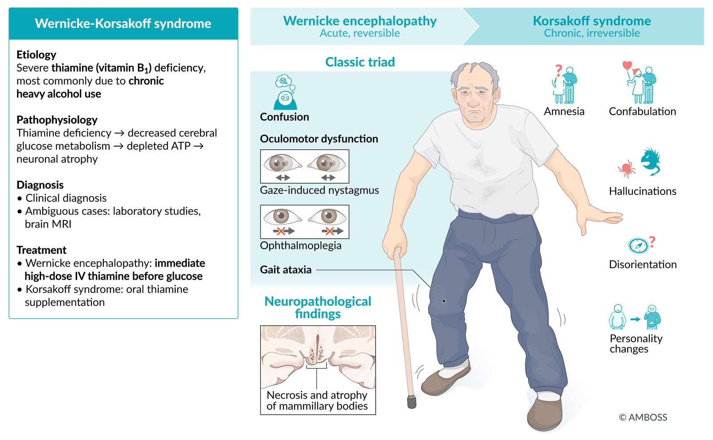
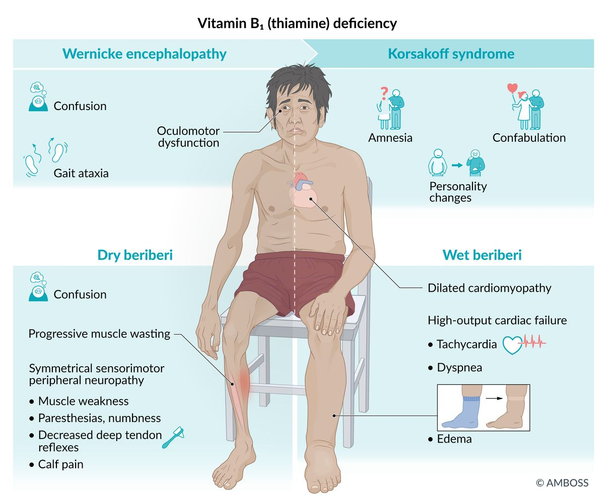
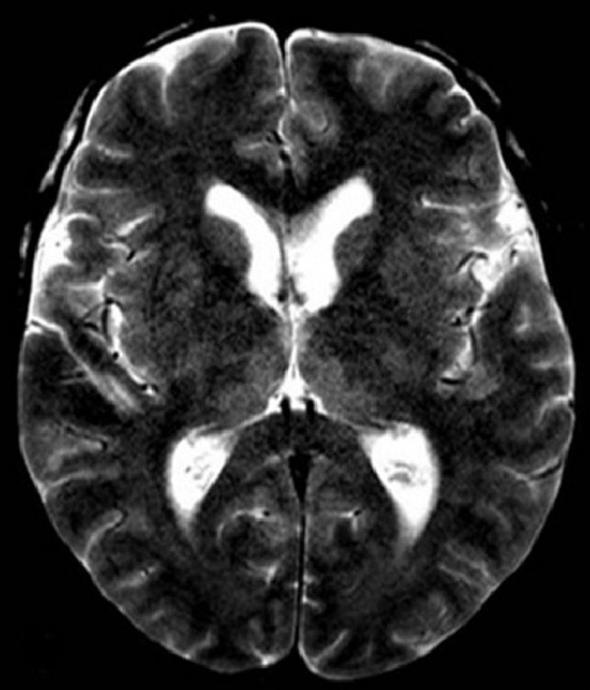
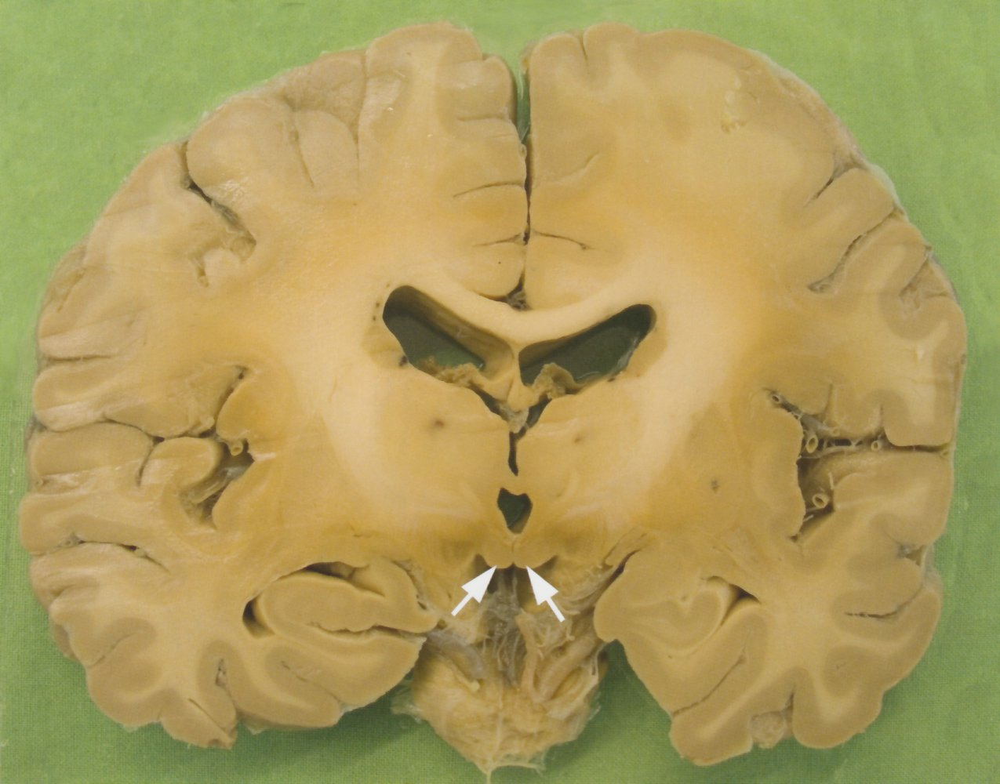

# Wernicke encephalopathy and Korsakoff syndrome

*Categories: Clinical knowledge > Emergency medicine > Neurologic disorders > Wernicke encephalopathy and Korsakoff syndrome*

[Original Article Link](https://coursology-qbank.com/amboss/article/9R0N6f)

---

## Summary

<u>Wernicke encephalopathy</u> is an acute, reversible condition caused by severe <u>thiamine</u> (<u>vitamin B1</u>) deficiency, often due to chronic <u>heavy alcohol use</u>. Inadequate intake, impaired absorption, or increased excretion of <u>thiamine</u> can also cause <u>Wernicke encephalopathy</u>. The classical triad of confusion, oculomotor dysfunction, and <u>gait ataxia</u> is seen in about a third of patients. Chronic <u>thiamine deficiency</u>, especially in patients with <u>alcohol use disorder</u>, frequently progresses to <u>Korsakoff syndrome</u>, which is characterized by irreversible <u>personality</u> changes, anterograde and <u>retrograde amnesia</u>, and <u>confabulation</u>. The diagnosis of both <u>Wernicke encephalopathy</u> and <u>Korsakoff syndrome</u> is clinical, but laboratory tests confirming <u>thiamine deficiency</u> and <u>brain</u> imaging may be considered in ambiguous cases. <u>Wernicke encephalopathy</u> is an emergency and requires immediate high-dose IV <u>thiamine</u> therapy followed by long-term <u>thiamine</u> supplementation. Abstaining from <u>alcohol</u> is vital in both conditions. While the prognosis in <u>Wernicke encephalopathy</u> is good if treated accordingly, that in <u>Korsakoff syndrome</u> is generally poor.

Wernicke-Korsakoff syndrome fact sheet

---

## Etiology

* <u>Wernicke encephalopathy</u> and <u>Korsakoff syndrome</u> are caused by a severe <u>deficiency of thiamine</u> (<u>vitamin B1</u>).

* <u>Thiamine deficiency</u> can be due to:

* Chronic <u>heavy alcohol use</u> (most common): due to inadequate intake, absorption, and hepatic storage of <u>thiamine</u>

* Inadequate intake

* <u>Thiamine</u>-deficient diets

* <u>Anorexia nervosa</u>, <u>starvation</u>

* <u>Malabsorption</u>

* Increased demand (<u>hypermetabolic states</u>)

* <u>Pregnancy</u> and lactation

* <u>Hyperthyroidism</u>

* Systemic diseases

* <u>Malignancy</u>

* Increased loss

* <u>Diarrhea</u>

* Hyperemesis

* Dialysis

Vitamin B1 deficiency

References:[[1]](https://coursology-qbank.com/amboss/article/l5Yv4p)

---

## Pathophysiology

* <u>Thiamine pyrophosphate</u> (<u>TPP</u>) is the active form of <u>thiamine</u>.

* <u>TPP</u> is a <u>cofactor</u> for important enzymes involved in cerebral <u>glucose</u> and <u>energy metabolism</u> (see <u>glycolysis and gluconeogenesis</u>).

* The <u>brain</u> requires a constant source of <u>thiamine</u> to function properly.

* <u>Thiamine deficiency</u> → decreased cerebral <u>glucose metabolism</u> and <u>mitochondrial</u> dysfunction → depleted <u>ATP</u> and increased free radicals → injury of neuronal elements;  (e.g., <u>myelin</u> sheaths, <u>blood-brain</u>-barrier, decreased <u>neurotransmitters</u>, etc.) → impaired axonal conduction → symptoms of <u>Wernicke encephalopathy</u> and <u>Korsakoff syndrome</u>

* In patients with <u>Korsakoff syndrome</u>: long term <u>thiamine deficiency</u> → permanent damage to components of the <u>limbic system</u> (e.g., <u>mammillary bodies</u>, <u>anterior thalamic nuclei</u>) → <u>atrophy</u> of these components → <u>memory</u> loss, <u>apathy</u>, and disrupted emotional processing

---

## Clinical features

### Wernicke encephalopathy (acute, reversible)

* Should be suspected in any patient with a history of chronic <u>heavy alcohol use</u> who presents with one/more symptoms of the classic triad of <u>Wernicke encephalopathy</u> 
1. * Confusion (most common)
2. * Oculomotor dysfunction 

* Gaze-induced horizontal/vertical <u>nystagmus</u> (most common)

* <u>Diplopia</u>

* <u>Conjugate gaze palsy</u>
3. * <u>Gait ataxia</u>: wide-based, small steps

* Other manifestations

* <u>Autonomic dysfunction</u>: <u>hypotension</u>, <u>syncope</u>, <u>hypothermia</u>

* <u>Peripheral neuropathy</u>: <u>paresthesia</u>, <u>foot drop</u>, decreased <u>deep tendon reflexes</u>

* Cardiovascular dysfunction: <u>tachycardia</u>, <u>exertional dyspnea</u>

* <u>Diencephalic</u> involvement: vegetative disorders (<u>coma</u> and <u>stupor</u>)

### Korsakoff syndrome (chronic, irreversible)

<u>Korsakoff syndrome</u> is a late development in patients with persistent <u>vitamin B1 deficiency</u>. It is most often seen in <u>thiamine deficiency</u> due to chronic <u>heavy alcohol use</u>.

* Confabulation: Patients produce fabricated memories to fill in <u>lapses</u> of <u>memory</u>.

* Anterograde and <u>retrograde amnesia</u> (anterograde is more common than retrograde)

* <u>Personality</u> changes (in <u>frontal lobe</u> lesions): <u>apathy</u>, indifference, decrease in <u>executive function</u>

* <u>Disorientation</u> to time, place, and person

* <u>Hallucinations</u>

> [!NOTE]
> Wernicke's COAT: Confusion, Oculomotor dysfunction, Ataxia, and Thiamine administration (see Treatment section)
> Korsakoff's CART: Confabulation, Anterograde and Retrograde <u>amnesia</u>, and altered Temper

> [!NOTE]
> Although often grouped together as a single syndrome (Wernicke-Korsakoff syndrome), the two conditions are distinct entities with different presentations, and, while both are due to severe chronic <u>thiamine deficiency</u>, <u>Wernicke encephalopathy</u> is reversible whereas <u>Korsakoff syndrome</u> is not.

Wernicke-Korsakoff syndrome fact sheet

References:[[1]](https://coursology-qbank.com/amboss/article/l5Yv4p)[[2]](https://coursology-qbank.com/amboss/article/CPaqSk)

---

## Diagnosis

* Usually a <u>clinical diagnosis</u>

* In ambiguous cases:

* Laboratory tests

* ↓ Serum <u>thiamine</u> levels

* ↓ <u>Erythrocyte</u> <u>transketolase</u> activity (<u>thiamine</u> dependent)

* ↑ Serum <u>lactate</u> and <u>pyruvate</u>

* Evidence of <u>alcohol</u>-related <u>liver</u> dysfunction in patients with chronic <u>heavy alcohol use</u>

* <u>Brain</u> <u>MRI</u>: <u>T2-weighted</u> <u>hyperintense</u> lesions in the <u>mammillary bodies</u>, <u>midbrain</u> <u>tectal</u> plate, dorsomedial <u>nuclei of the thalamus</u>, <u>cerebellum</u>, and around the aqueduct and the <u>third ventricle</u>

> [!NOTE]
> <u>MRI</u> signs of periventricular hemorrhage and/or <u>atrophy</u> of <u>mammillary bodies</u> is a frequent finding in both <u>Wernicke encephalopathy</u> and <u>Korsakoff syndrome</u>.

> [!WARNING]
> Laboratory tests or imaging should not delay treatment!

Wernicke encephalopathy

References:[[1]](https://coursology-qbank.com/amboss/article/l5Yv4p)

---

## Pathology

* <u>Petechial</u> lesions and small vessel hemorrhage in the <u>mesencephalon</u>, <u>mammillary bodies</u>, ventricle walls, and <u>dorsomedial nucleus</u> of <u>thalamus</u>

* <u>Atrophy</u> of <u>anterior thalamic nuclei</u> and <u>mammillary bodies</u> (both are part of the <u>limbic system</u>)

* Microscopic <u>spongiosis</u>, <u>capillary</u> <u>proliferation</u>, and <u>hemosiderin</u> deposits (due to recurrent bleeding)

Mamillary bodies

References:[[1]](https://coursology-qbank.com/amboss/article/l5Yv4p)[[3]](https://coursology-qbank.com/amboss/article/Scbybs)

---

## Differential diagnoses

* <u>Wernicke encephalopathy</u> (conditions that manifest with an acute onset of <u>delirium</u>/<u>ataxia</u>)

* <u>Cerebellar</u> <u>stroke</u>

* <u>Hypoxia</u>/<u>hypercarbia</u> (post <u>cardiac arrest</u>)

* <u>Postictal state</u>

* <u>CNS</u> infections (e.g., <u>meningitis</u>)

* <u>Tabes dorsalis</u>

* <u>Korsakoff syndrome</u> (conditions that present with <u>amnesia</u>, <u>disorientation</u>)

* <u>Alzheimer disease</u>

* <u>Dementia with Lewy bodies</u>

* <u>Parkinson disease</u>

References:[[1]](https://coursology-qbank.com/amboss/article/l5Yv4p)

The differential diagnoses listed here are not exhaustive.

---

## Prognosis

* <u>Wernicke encephalopathy</u>: Generally, oculomotor function resolves within hours, <u>ataxia</u> within days, and confusion within weeks.

* <u>Korsakoff syndrome</u>: Symptoms are often irreversible.

---