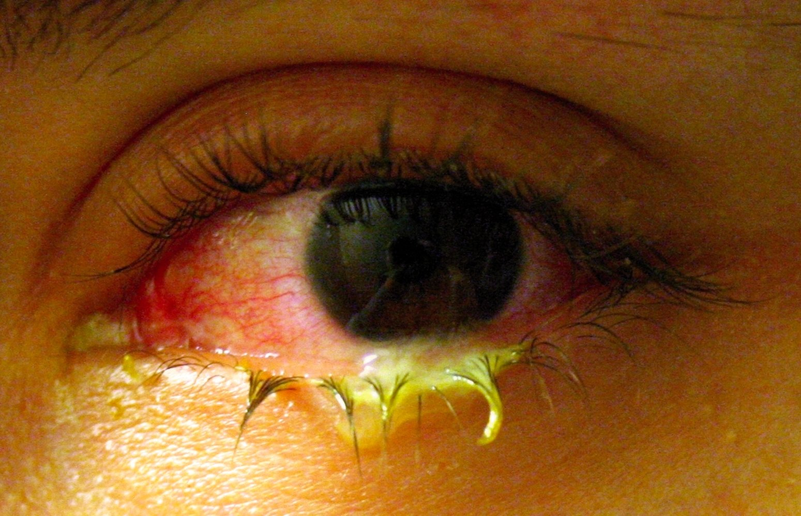
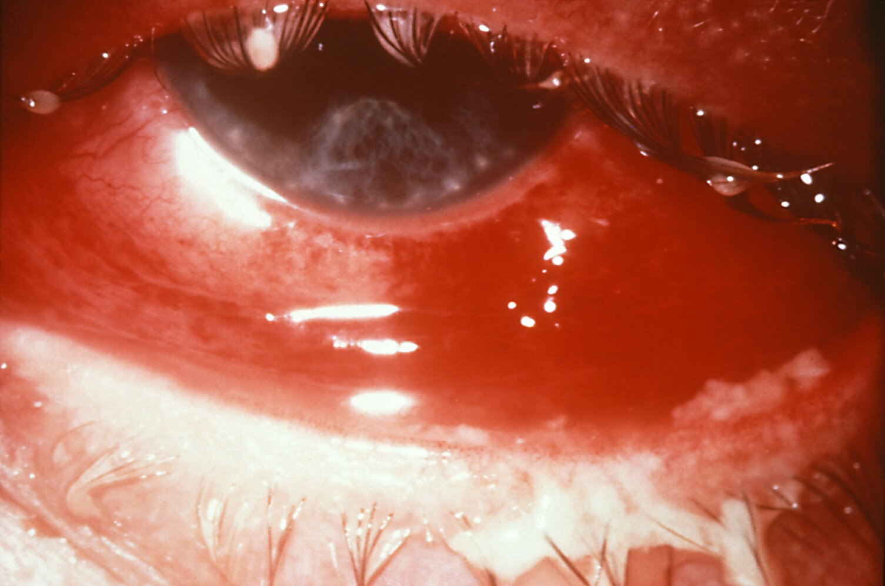
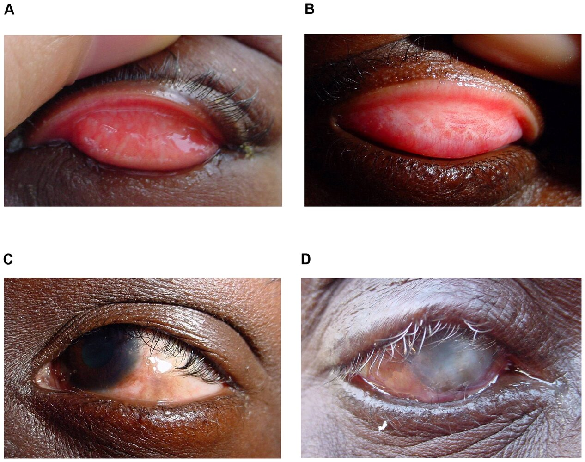

# Bacterial conjunctivitis

*Categories: Clinical knowledge > Emergency medicine > Ophthalmologic disorders > Bacterial conjunctivitis*

[Original Article Link](https://coursology-qbank.com/amboss/article/7t04U3)

---

## Summary

Bacterial <u>conjunctivitis</u> includes <u>neisserial conjunctivitis</u> (<u>hyperacute bacterial conjunctivitis</u>), <u>acute bacterial conjunctivitis</u>, and <u>chlamydial conjunctivitis</u> (including <u>trachoma</u> and <u>inclusion conjunctivitis</u>), and it can be an ocular emergency. Factors that can help differentiate between the subtypes include severity and onset of symptoms, <u>patient history</u>, and associated systemic features (e.g., genitourinary symptoms). All patients with <u>neisserial conjunctivitis</u>, <u>inclusion conjunctivitis</u>, and <u>acute bacterial conjunctivitis</u> with severe symptoms or <u>risk factors</u> for severe infection (e.g., contact <u>lens</u> use, <u>immunodeficiency</u>) should undergo diagnostic studies, including a <u>conjunctival</u> culture. For patients with mild <u>acute bacterial conjunctivitis</u> or <u>trachoma</u>, the diagnosis may be made clinically. <u>Antibiotic therapy</u> is recommended for all types of bacterial <u>conjunctivitis</u>. Patients with neisserial or <u>chlamydial conjunctivitis</u>, and any patients with <u>red flags for conjunctivitis</u>, should be referred to ophthalmology. Undertreated or long-term infections can compromise the <u>layers of the eye</u> (e.g., <u>cornea</u>) and lead to the formation of scars and <u>ulcers</u>, ultimately causing blindness.

---

## Acute bacterial conjunctivitis

<u>Acute bacterial conjunctivitis</u> is a common presentation in primary care; common pathogens include <u>Streptococcus pneumoniae</u> and <u>Haemophilus influenzae</u> in children and <u>Staphylococcus aureus</u> in adults. <u>Neisserial conjunctivitis</u> and <u>chlamydial conjunctivitis</u> manifest differently and require specialized management; these infections are covered separately in their respective sections.

### Etiology [[7]](https://coursology-qbank.com/amboss/article/TV16Ff0)

* Most common in adults: <u>S. aureus</u>

* Most common in children: <u>S. pneumoniae</u> and <u>H. influenzae</u>

* Others, e.g., <u>Pseudomonas</u> spp., <u>Moraxella catarrhalis</u>   [[8]](https://coursology-qbank.com/amboss/article/MD1MUQ0)

> [!TIP]
> Contact <u>lens</u> wearers are at increased risk of serious infections with <u>gram-negative bacteria</u> such as <u>Pseudomonas aeruginosa</u>. [[8]](https://coursology-qbank.com/amboss/article/MD1MUQ0)

### Clinical features [[5]](https://coursology-qbank.com/amboss/article/2V1TFf0)

* Unilateral or bilateral <u>symptoms of conjunctivitis</u>, including:

* <u>Conjunctival injection</u>

* Mucopurulent discharge

* Symptoms typically last 7–10 days but may last up to 4 weeks. [[7]](https://coursology-qbank.com/amboss/article/TV16Ff0)

* Significant <u>pain</u> or <u>vision</u> changes are not usually present and are <u>red flags in conjunctivitis</u>.

Bacterial conjunctivitis

### Diagnostics [[5]](https://coursology-qbank.com/amboss/article/2V1TFf0)[[7]](https://coursology-qbank.com/amboss/article/TV16Ff0)

* Primarily a <u>clinical diagnosis</u>

* Obtain <u>conjunctival</u> culture with <u>Gram stain</u> and <u>Giemsa stain</u> in patients with any of the following: [[5]](https://coursology-qbank.com/amboss/article/2V1TFf0)[[7]](https://coursology-qbank.com/amboss/article/TV16Ff0)

* Severe <u>conjunctivitis</u>

* Contact <u>lens</u> use

* Recurrent or refractory symptoms

* <u>Immunodeficiency</u>

* Possible gonorrheal or <u>chlamydial conjunctivitis</u>

* Further studies such as <u>PCR</u> may be considered as needed.

### Treatment [[5]](https://coursology-qbank.com/amboss/article/2V1TFf0)

* Advise patients to immediately remove their contact lenses.

* Avoid wearing for ≥ 2 weeks. [[9]](https://coursology-qbank.com/amboss/article/AN1Rdh0)

* Discard disposable contact lenses and contact <u>lens</u> storage cases.  [[8]](https://coursology-qbank.com/amboss/article/MD1MUQ0)

* Provide <u>supportive therapy for conjunctivitis</u>.

* Consider a 5–7 day course of topical broad-spectrum <u>antibiotics</u>. [[5]](https://coursology-qbank.com/amboss/article/2V1TFf0)

* Refer patients with the following to ophthalmology:

* <u>Suspected MRSA infection</u>

* <u>Red flags in conjunctivitis</u> (including contact <u>lens</u> use)

* Symptoms that persist after > 1 week of treatment

* Educate patients on <u>prevention of infectious conjunctivitis</u>.

#### Topical <u>antibiotic therapy</u>

* Indicated for patients who: [[2]](https://coursology-qbank.com/amboss/article/SV1yFf0)

* Wear contact lenses

* Have mucopurulent discharge and <u>eye pain</u>

* Have known <u>ocular surface disease</u>

* Use in all other patients may help speed up recovery.  [[10]](https://coursology-qbank.com/amboss/article/SU1ycT0)

* Commonly used classes of <u>antibiotics</u> in children and adults include : [[2]](https://coursology-qbank.com/amboss/article/SV1yFf0)[[5]](https://coursology-qbank.com/amboss/article/2V1TFf0)[[10]](https://coursology-qbank.com/amboss/article/SU1ycT0)

* <u>Macrolides</u>, e.g., <u>erythromycin</u> DOSAGE or <u>azithromycin</u> DOSAGE  [[2]](https://coursology-qbank.com/amboss/article/SV1yFf0)

* Combination drops, e.g., <u>polymyxin</u> B/<u>trimethoprim</u> DOSAGE [[2]](https://coursology-qbank.com/amboss/article/SV1yFf0)

* <u>Fluoroquinolones</u>, e.g., <u>ciprofloxacin</u> DOSAGE (use if gram-negative pathogens are suspected, e.g., in contact <u>lens</u> wearers)   [[9]](https://coursology-qbank.com/amboss/article/AN1Rdh0)

* <u>Sulfonamides</u>, e.g., <u>sulfacetamide</u> DOSAGE [[2]](https://coursology-qbank.com/amboss/article/SV1yFf0)

* <u>Aminoglycosides</u>, e.g., <u>tobramycin</u> DOSAGE [[2]](https://coursology-qbank.com/amboss/article/SV1yFf0)

* For <u>antibiotic</u> treatment in <u>newborns</u>, see “<u>Antimicrobial therapy for neonatal conjunctivitis</u>.”

> [!TIP]
> Most cases of bacterial <u>conjunctivitis</u> are <u>self-limited</u>; however, the use of topical <u>antibiotics</u> speeds up recovery and may reduce the risk of transmission. [[5]](https://coursology-qbank.com/amboss/article/2V1TFf0)

### Complications

* <u>Conjunctivitis-otitis syndrome</u>  [[11]](https://coursology-qbank.com/amboss/article/5D1iUQ0)

* <u>Keratitis</u> [[8]](https://coursology-qbank.com/amboss/article/MD1MUQ0)

* <u>Anterior uveitis</u> [[8]](https://coursology-qbank.com/amboss/article/MD1MUQ0)

* <u>Preseptal cellulitis</u> [[5]](https://coursology-qbank.com/amboss/article/2V1TFf0)

* Chronic bacterial conjunctivitis (symptoms lasting > 4 weeks)  [[2]](https://coursology-qbank.com/amboss/article/SV1yFf0)

---

## Neisserial conjunctivitis

<u>Neisserial conjunctivitis</u>, or <u>hyperacute bacterial conjunctivitis</u>, is a severe type of infectious <u>conjunctivitis</u> most commonly caused by <u>Neisseria gonorrhoeae</u> and characterized by an abrupt onset of quickly worsening symptoms (i.e., profuse <u>purulent</u> discharge, <u>pain</u>, and <u>vision</u> changes). [[2]](https://coursology-qbank.com/amboss/article/SV1yFf0)[[5]](https://coursology-qbank.com/amboss/article/2V1TFf0)

### Etiology [[5]](https://coursology-qbank.com/amboss/article/2V1TFf0)

* Most commonly: infection with <u>N. gonorrhoeae</u> (gonococcal conjunctivitis)

* Sexually active adults: direct contact with contaminated secretions (e.g., from the genitalia to the hand to the <u>eye</u>)

* <u>Neonates</u>: <u>perinatal transmission</u> (see “<u>Neonatal gonococcal conjunctivitis</u>”)

* Rarely: infection with <u>Neisseria meningitidis</u> (primary meningococcal conjunctivitis)

> [!WARNING]
> Consider <u>sexual abuse</u> in children presenting with gonorrheal <u>conjunctivitis</u>. [[5]](https://coursology-qbank.com/amboss/article/2V1TFf0)

> [!TIP]
> <u>Neonatal gonococcal conjunctivitis</u> is rare in the US because of prophylaxis at <u>birth</u> with <u>erythromycin</u> ophthalmic ointment. [[12]](https://coursology-qbank.com/amboss/article/KE1U9i0)

### Clinical features [[5]](https://coursology-qbank.com/amboss/article/2V1TFf0)[[7]](https://coursology-qbank.com/amboss/article/TV16Ff0)

* <u>Hyperacute conjunctivitis</u>  

* Marked <u>eye</u> swelling

* Profuse <u>purulent</u> discharge

* Severe <u>eye pain</u> [[7]](https://coursology-qbank.com/amboss/article/TV16Ff0)

* See also “<u>Clinical features of conjunctivitis</u>.”

* Preauricular <u>lymphadenopathy</u>

* Corneal lesions and/or <u>ulceration</u>

* Possibly symptoms of genitourinary <u>gonorrhea</u> or <u>disseminated gonococcal infection</u>

Gonococcal conjunctivitis

Infant with gonococcal ophthalmic disease

### Diagnostics [[5]](https://coursology-qbank.com/amboss/article/2V1TFf0)

* Initiate management without waiting for diagnostic confirmation.

* All patients require confirmatory studies, e.g.: [[5]](https://coursology-qbank.com/amboss/article/2V1TFf0)[[13]](https://coursology-qbank.com/amboss/article/XD191Q0)

* <u>Gram stain</u>: intracellular gram-negative <u>diplococci</u>

* Culture

* <u>PCR</u>

> [!WARNING]
> Rule out <u>N. meningitidis</u> in patients with suspected <u>N. gonorrhoeae</u> infection. [[5]](https://coursology-qbank.com/amboss/article/2V1TFf0)

### Treatment of Neisserial conjunctivitis [[5]](https://coursology-qbank.com/amboss/article/2V1TFf0)[[14]](https://coursology-qbank.com/amboss/article/2NcT010)

* Start immediate systemic <u>antibiotic</u> treatment.

* Consider adding topical <u>antibiotic therapy</u> (e.g., if <u>keratitis</u> is suspected).

* Consult ophthalmology and infectious diseases early.

* For symptom relief:

* Irrigate the affected <u>eye</u>(s) with saline.

* Provide <u>supportive therapy for conjunctivitis</u> as needed (e.g., for <u>pain management</u>).

* Educate patients on <u>preventive measures against infectious conjunctivitis</u>.

> [!WARNING]
> <u>N. gonorrhoeae</u> infection is an ocular emergency that can lead to <u>keratitis</u>, perforation, and blindness without prompt treatment guided by a specialist (e.g., ophthalmology, infectious diseases). [[2]](https://coursology-qbank.com/amboss/article/SV1yFf0)[[14]](https://coursology-qbank.com/amboss/article/2NcT010)

#### Systemic <u>antibiotic therapy</u>

* <u>Gonococcal conjunctivitis</u> ;  [[5]](https://coursology-qbank.com/amboss/article/2V1TFf0)[[14]](https://coursology-qbank.com/amboss/article/2NcT010)

* IM/IV <u>ceftriaxone</u> (<u>off-label</u>) DOSAGE [[5]](https://coursology-qbank.com/amboss/article/2V1TFf0)[[14]](https://coursology-qbank.com/amboss/article/2NcT010)

* Consider addition of <u>azithromycin</u>;  (<u>off-label</u>) DOSAGE or <u>doxycycline</u> (<u>off-label</u>). DOSAGE [[5]](https://coursology-qbank.com/amboss/article/2V1TFf0)

* For prevention and treatment in <u>infants</u>, see “<u>Neonatal gonococcal conjunctivitis</u>.”

* Trace partners and provide <u>treatment for gonorrhea</u>.

* <u>Primary meningococcal conjunctivitis</u>

* Urgently consult infectious diseases to determine <u>antibiotic therapy</u>.

* Patients are usually managed with <u>third-generation cephalosporins</u> (for dosages, see “<u>Pathogen-specific therapy in meningitis</u>”). [[15]](https://coursology-qbank.com/amboss/article/tE1Xxi0)

* Consider prophylactic treatment for contacts (see “<u>Postexposure chemoprophylaxis for bacterial meningitis</u>”).  [[15]](https://coursology-qbank.com/amboss/article/tE1Xxi0)[[16]](https://coursology-qbank.com/amboss/article/cD1aWQ0)

> [!WARNING]
> Do not delay <u>antibiotics</u> for diagnostic studies if <u>neisserial conjunctivitis</u> is clinically suspected. [[5]](https://coursology-qbank.com/amboss/article/2V1TFf0)

---

## Inclusion conjunctivitis (paratrachoma)

<u>Inclusion conjunctivitis</u> is a form of bacterial <u>conjunctivitis</u> caused by infection with <u>C. trachomatis</u> <u>serotypes</u> D–K, which normally cause <u>genitourinary chlamydia</u>.

### Etiology [[5]](https://coursology-qbank.com/amboss/article/2V1TFf0)

* Infection with <u>C. trachomatis</u> <u>serotypes</u> D–K.

* Transmission can be: [[18]](https://coursology-qbank.com/amboss/article/ZD1Z1Q0)

* Sexual: spread to the eyes from a preexisting genital infection (from the genitalia to the hand to the <u>eye</u>)

* <u>Perinatal</u> (see “<u>Neonatal chlamydial conjunctivitis</u>”)

* Via contaminated, unchlorinated swimming pools (rare)

> [!WARNING]
> Consider <u>sexual abuse</u> in children presenting with <u>inclusion conjunctivitis</u>. [[5]](https://coursology-qbank.com/amboss/article/2V1TFf0)

### Clinical features [[2]](https://coursology-qbank.com/amboss/article/SV1yFf0)[[5]](https://coursology-qbank.com/amboss/article/2V1TFf0)

* May affect one or both eyes for several weeks and can include:

* Mucopurulent discharge

* <u>Conjunctival follicles</u>

* <u>Papillary</u> <u>hypertrophy</u>

* Preauricular <u>lymphadenopathy</u>

* See also “<u>Clinical features of conjunctivitis</u>.”

* Patients may also have symptoms of <u>genitourinary chlamydia infection</u>.

Inclusion conjunctivitis

### Diagnostics [[5]](https://coursology-qbank.com/amboss/article/2V1TFf0)[[7]](https://coursology-qbank.com/amboss/article/TV16Ff0)

* Can be <u>diagnosed clinically</u> in patients with a characteristic history and confirmed <u>genitourinary chlamydia infection</u>

* To confirm <u>inclusion conjunctivitis</u>, use one of the following tests:

* Culture of the <u>conjunctiva</u> and <u>exudate</u>   [[5]](https://coursology-qbank.com/amboss/article/2V1TFf0)[[6]](https://coursology-qbank.com/amboss/article/Ef18LT0)

* <u>Direct fluorescent antibody test</u>  [[6]](https://coursology-qbank.com/amboss/article/Ef18LT0)

* <u>Enzyme immunoassay</u>

* <u>PCR</u> from scrapings of the <u>conjunctiva</u>  [[5]](https://coursology-qbank.com/amboss/article/2V1TFf0)[[6]](https://coursology-qbank.com/amboss/article/Ef18LT0)

> [!WARNING]
> Patients with suspected or confirmed <u>chlamydia</u> <u>conjunctivitis</u> should also undergo <u>diagnostic studies for gonorrhea</u>. [[2]](https://coursology-qbank.com/amboss/article/SV1yFf0)

Chlamydia trachomatis in McCoy cell culture

Chlamydia trachomatis in McCoy cell culture (magnified view)

### Treatment [[2]](https://coursology-qbank.com/amboss/article/SV1yFf0)[[5]](https://coursology-qbank.com/amboss/article/2V1TFf0)

* Start systemic <u>antibiotics</u>.  [[2]](https://coursology-qbank.com/amboss/article/SV1yFf0)[[5]](https://coursology-qbank.com/amboss/article/2V1TFf0)

* Adults: <u>azithromycin</u> (<u>off-label</u>) DOSAGE OR <u>doxycycline</u> (<u>off-label</u>) DOSAGE [[2]](https://coursology-qbank.com/amboss/article/SV1yFf0)[[5]](https://coursology-qbank.com/amboss/article/2V1TFf0)

* <u>Neonates</u>: See “<u>Treatment of neonatal conjunctivitis</u>.”

* Provide <u>supportive therapy for conjunctivitis</u>.

* Assess for and treat concurrent infections in patients and their partners. [[2]](https://coursology-qbank.com/amboss/article/SV1yFf0)

* <u>Genitourinary chlamydia infection</u>

* <u>Gonorrhea</u>

* Educate patients on <u>preventive measures against infectious conjunctivitis</u>.

> [!WARNING]
> <u>Antibiotics</u> should not be delayed for diagnostics if <u>inclusion conjunctivitis</u> is clinically suspected. [[5]](https://coursology-qbank.com/amboss/article/2V1TFf0)

---

## Trachoma

<u>Trachoma</u> is a form of bacterial <u>conjunctivitis</u> seen in resource-limited settings. Repeated infection with <u>C. trachomatis</u> <u>serotypes</u> A–C leads to <u>conjunctival</u> scarring and blindness.

### Etiology [[5]](https://coursology-qbank.com/amboss/article/2V1TFf0)[[17]](https://coursology-qbank.com/amboss/article/vHaAHN)[[19]](https://coursology-qbank.com/amboss/article/tm1Xhh0)

* Infection with <u>C. trachomatis</u> <u>serotypes</u> A–C; transmission is either:

* Direct (human-to-human contact via eyes or nose)

* Indirect (e.g., shared towels, <u>eye</u>-seeking flies) [[17]](https://coursology-qbank.com/amboss/article/vHaAHN)

* <u>Incubation period</u>: 5–12 days

### <u>Epidemiology</u> [[5]](https://coursology-qbank.com/amboss/article/2V1TFf0)[[17]](https://coursology-qbank.com/amboss/article/vHaAHN)

* The most common infectious cause of blindness worldwide [[2]](https://coursology-qbank.com/amboss/article/SV1yFf0)[[19]](https://coursology-qbank.com/amboss/article/tm1Xhh0)[[20]](https://coursology-qbank.com/amboss/article/HjbKbF)

* Africa is the most affected continent. [[17]](https://coursology-qbank.com/amboss/article/vHaAHN)

* Predominantly affects young children and women  [[17]](https://coursology-qbank.com/amboss/article/vHaAHN)

* Transmission is more common in households with: [[17]](https://coursology-qbank.com/amboss/article/vHaAHN)

* Inadequate access to water and sanitation

* Crowding

> [!NOTE]
> <u>C. trachomatis</u> <u>serotypes</u> A, B, and C are most common in Africa and can cause Blindness and Chronic inflammation.

### Clinical features [[17]](https://coursology-qbank.com/amboss/article/vHaAHN)[[19]](https://coursology-qbank.com/amboss/article/tm1Xhh0)

Infection can be recurrent or chronic; ; active and cicatricial phases may occur simultaneously.

* Active phase: active <u>trachoma</u> inflammation

* Mucopurulent discharge

* <u>Papillary</u> reaction

* <u>Conjunctival follicles</u> (with <u>involution</u> leading to Herbert pits if untreated)

* Inflamed upper tarsal <u>conjunctiva</u>

* See also “<u>Clinical features of conjunctivitis</u>.”

* Cicatricial phase: develops if the active phase is severe and prolonged

* Chronic/recurrent inflammation in both eyes → <u>conjunctival</u> scarring and progressive <u>conjunctival</u> shrinkage

* Can lead to <u>corneal ulcers</u> and opacities, <u>superficial</u> <u>neovascularization</u> with cellular infiltration (corneal pannus), <u>entropion</u>, and/or <u>trichiasis</u>

> [!TIP]
> Chronic untreated infection can lead to blindness. [[2]](https://coursology-qbank.com/amboss/article/SV1yFf0)

Trachoma

### Diagnostics [[5]](https://coursology-qbank.com/amboss/article/2V1TFf0)

* Diagnosis is primarily clinical, but early <u>trachoma</u> manifests with limited signs and symptoms and may therefore be missed.

* <u>Confirmatory testing</u> is rarely performed, but options include : [[21]](https://coursology-qbank.com/amboss/article/sv1tYQ0)

* <u>NAAT</u>

* Microscopy and culture

* <u>Direct fluorescent antibody test</u>

* <u>Enzyme immunoassay</u>

### Treatment [[2]](https://coursology-qbank.com/amboss/article/SV1yFf0)

* Active phase

* <u>Antibiotic therapy</u>

* Preferred: single dose of oral <u>azithromycin</u> (<u>off-label</u>) DOSAGE  [[22]](https://coursology-qbank.com/amboss/article/tv1XbQ0)[[23]](https://coursology-qbank.com/amboss/article/Gv1BYQ0)

* Alternatives (<u>off-label</u>), e.g.: <u>tetracycline</u> or <u>erythromycin</u> (topical or systemic)  [[2]](https://coursology-qbank.com/amboss/article/SV1yFf0)[[22]](https://coursology-qbank.com/amboss/article/tv1XbQ0)[[23]](https://coursology-qbank.com/amboss/article/Gv1BYQ0)

* <u>Supportive treatment for conjunctivitis</u>

* Patient education on <u>prevention of trachoma</u>

* Cicatricial phase: Refer to ophthalmology for consideration of <u>surgery</u>.  [[23]](https://coursology-qbank.com/amboss/article/Gv1BYQ0)[[24]](https://coursology-qbank.com/amboss/article/Fv1gbQ0)

* Recommended <u>surgery</u> for <u>trichiasis</u>: tarsal rotation [[17]](https://coursology-qbank.com/amboss/article/vHaAHN)[[19]](https://coursology-qbank.com/amboss/article/tm1Xhh0)

* While awaiting <u>surgery</u>, recommend taping eyelashes to the <u>eyelid</u>.  [[23]](https://coursology-qbank.com/amboss/article/Gv1BYQ0)

### Prevention of trachoma [[17]](https://coursology-qbank.com/amboss/article/vHaAHN)

* Educate patients on preventive measures (see also “<u>Prevention of infectious conjunctivitis</u>”). [[25]](https://coursology-qbank.com/amboss/article/8v1ObQ0)

* Advise patients to wash their face regularly.

* Promptly seek treatment for infections.

* Avoid sharing towels.

* <u>Public health</u> measures to prevent new infections include: [[17]](https://coursology-qbank.com/amboss/article/vHaAHN)[[26]](https://coursology-qbank.com/amboss/article/uv1pbQ0)

* Mass drug administration in high-<u>prevalence</u> areas

* Improved access to safe water

* Improved sanitation (e.g., building latrines, insecticide against flies)

> [!TIP]
> <u>Trachoma</u> is a <u>public health</u> issue in many resource-limited countries. The WHO has introduced the SAFE strategy for <u>trachoma</u> treatment and elimination: Surgery, Antibiotics, Facial cleanliness, Environmental improvement. [[17]](https://coursology-qbank.com/amboss/article/vHaAHN)

> [!TIP]
> Because of the difficulties in accurately diagnosing <u>trachoma</u>, mass drug administration is recommended in areas with a high <u>prevalence</u> (> 10% in children). [[19]](https://coursology-qbank.com/amboss/article/tm1Xhh0)

> [!WARNING]
> <u>Laboratory studies</u> are of limited use in <u>trachoma</u> because they can only confirm current infection with <u>C. trachomatis</u>. [[21]](https://coursology-qbank.com/amboss/article/sv1tYQ0)

---