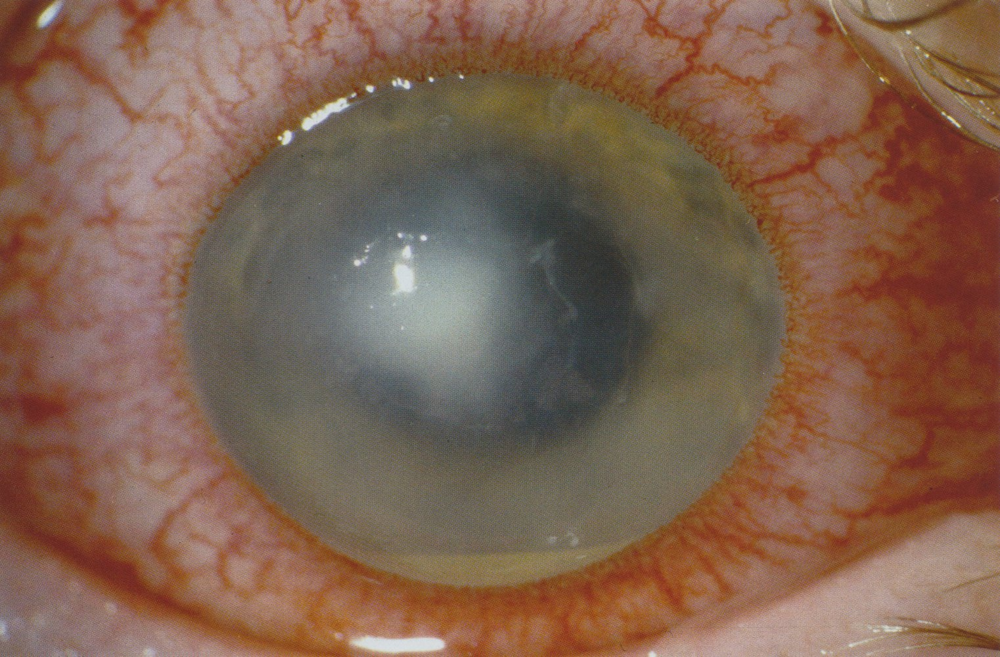
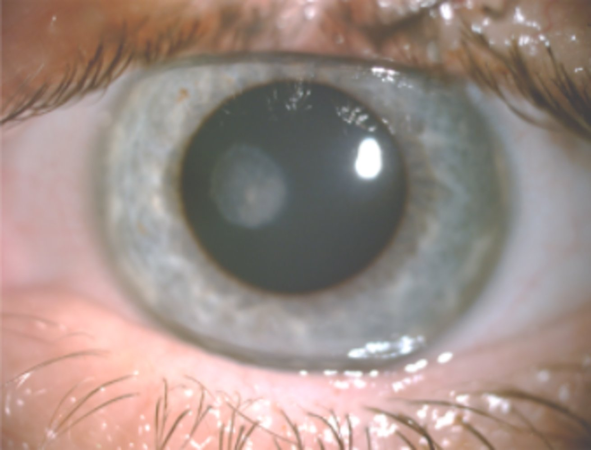
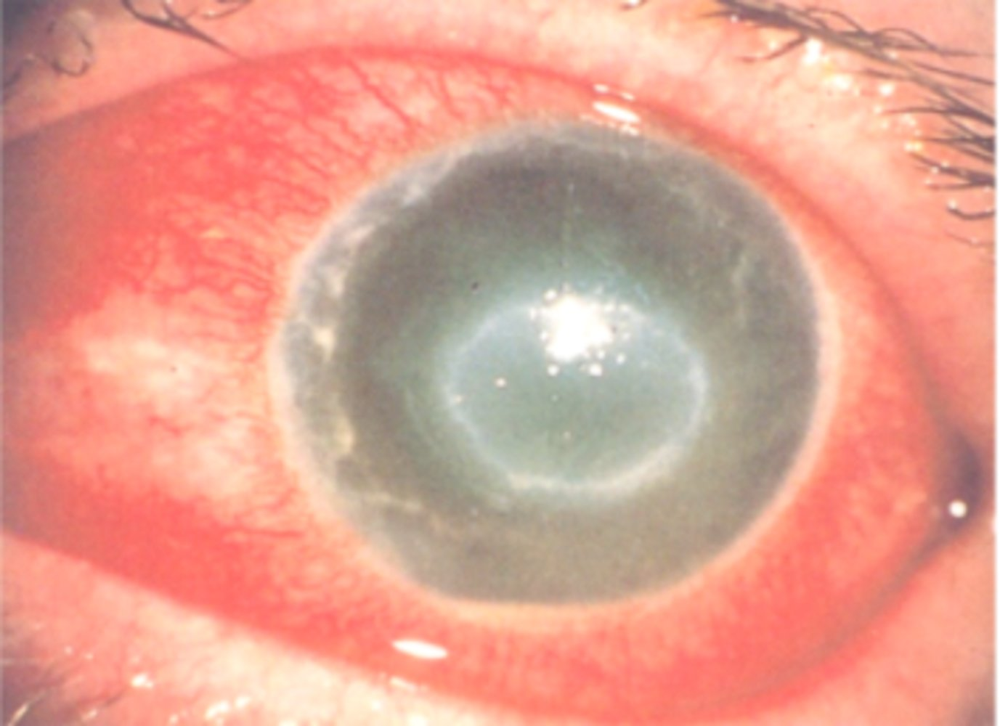
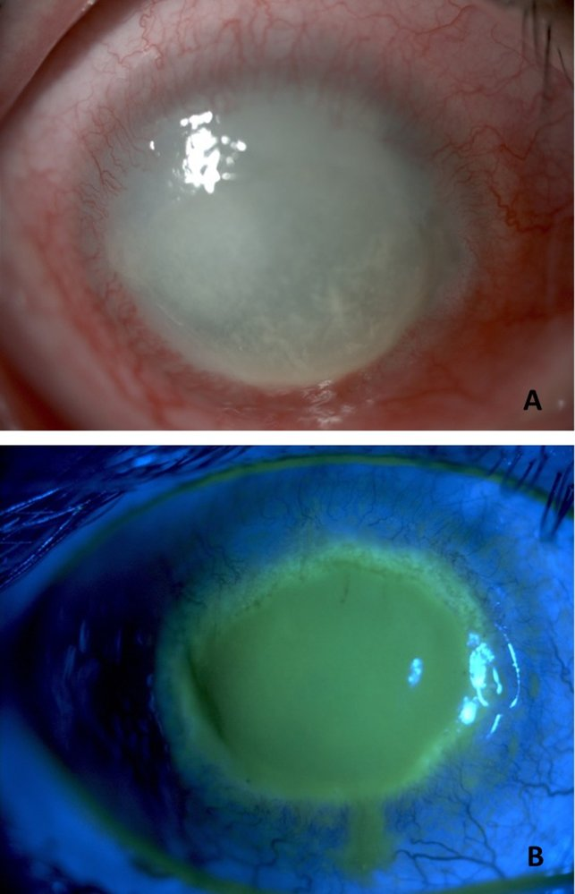

# Keratitis

*Categories: Clinical knowledge > Emergency medicine > Ophthalmologic disorders > Keratitis*

[Original Article Link](https://coursology-qbank.com/amboss/article/oO00tT)

---

## Summary

Keratitis is inflammation of the <u>cornea</u>, a clear and transparent covering over the <u>iris</u> and <u>pupil</u>. Important forms of keratitis include bacterial, <u>herpes zoster</u>, <u>herpes simplex</u>, and <u>Acanthamoeba</u> keratitis. Most corneal injuries and infections are associated with severe <u>pain</u>, although sometimes <u>pain</u> is absent. Other findings include irritation, <u>eye</u> redness, watery or <u>purulent</u> secretion, and impaired <u>vision</u>. Diagnosis is usually based on clinical findings and slit-lamp examination. Keratitis is an emergent disorder that can lead to irreversible <u>vision loss</u> left untreated.

---

## Overview

| Keratitis overview |  |  |
| --- | --- | --- |
|  | Characteristic features | Therapy |
| <u>Bacterial keratitis</u> |   * Most common form of keratitis  * ↑ Risk with wearing contact lenses  * <u>Purulent</u> discharge and/or <u>hypopyon</u>  * Round corneal infiltrate or ulcer    |  * Topical broad-spectrum <u>antibiotics</u> (e.g., <u>ciprofloxacin</u>)   |
| <u>Herpes zoster keratitis</u> |   * ↓ Corneal sensation  * Punctate lesions on the corneal surface (early disease)  * <u>Vesicular</u> eruption on forehead, bridge, and tip of the nose    |   * Oral <u>acyclovir</u>, <u>valacyclovir</u>, or <u>famciclovir</u>  * <u>Topical steroids</u>    |
| <u>Herpes simplex keratitis</u> |  * Dendritic or geographic <u>corneal ulcer</u>   |  * Topical trifluridine or <u>ganciclovir</u>   |
| <u>Acanthamoeba keratitis</u> |   * ↑ Risk with wearing contact lenses  * Corneal ring infiltrate    |  * Topical <u>antiseptic</u> (e.g., <u>chlorhexidine</u>) with propamidine   |

---

## Bacterial keratitis

* <u>Epidemiology</u>: most common form of keratitis (∼ 90%) [[1]](https://coursology-qbank.com/amboss/article/99aNp5)[[2]](https://coursology-qbank.com/amboss/article/B9azp5)

* Etiology

* Mainly: <u>staphylococci</u>;  (<u>Staphylococcus aureus</u>), <u>streptococci</u> (<u>Streptococcus pneumoniae</u>), <u>Pseudomonas aeruginosa</u>

* <u>Syphilis</u>

* <u>Enterobacteriaceae</u> (including <u>Klebsiella</u>)

* <u>Risk factors</u>

* Contact <u>lens</u> use

* Recent <u>eye</u> <u>surgery</u> or injury

* <u>Immunodeficiency</u>

* Lacrimal duct stenosis

* Clinical features

* Progressive <u>pain</u>

* <u>Eye</u> redness

* Foreign body sensation

* <u>Purulent</u> discharge

* <u>Photophobia</u>

* Excessive tearing

* Blurry <u>vision</u>

* <u>Conjunctival injection</u>

* Subtypes and variants: Pseudomonas keratitis

* Caused by <u>Pseudomonas aeruginosa</u>

* Most common cause of <u>bacterial keratitis</u> in contact <u>lens</u> users  [[3]](https://coursology-qbank.com/amboss/article/q9aCo5)

* Fulminant course with severe <u>ulceration</u>

* Corneal destruction/perforation within 2–5 days [[4]](https://coursology-qbank.com/amboss/article/bxXHEZ0)

* Diagnostics

* <u>Slit lamp examination</u>

* Hypopyon: collection of <u>leukocytes</u> at the bottom of the <u>anterior</u> chamber; occurs in severe cases of keratitis

* <u>Fluorescein staining</u>: round corneal infiltrate or <u>ulcer</u>

* Creeping <u>ulcer</u> or <u>serpiginous</u> <u>corneal ulcer</u> in <u>pneumococcus</u> infection

* (Ring‑) <u>ulcer</u>: (ring-shaped) spread of the <u>pathogen</u> in the <u>cornea</u>

* Thygeson <u>superficial</u> punctate keratitis: point-shaped lesions in the corneal <u>epithelium</u>

* Cultures are indicated when the corneal infiltrate is large, central, and extends to the deep stroma, for refractory cases, or those with atypical features.  [[2]](https://coursology-qbank.com/amboss/article/B9azp5)

* Treatment

* Topical broad-spectrum <u>antibiotics</u>   [[2]](https://coursology-qbank.com/amboss/article/B9azp5)

* <u>Cefazolin</u> with <u>tobramycin</u>/<u>gentamicin</u> or

* <u>Ofloxacin</u> or

* <u>Ciprofloxacin</u>

* Consider <u>corticosteroids</u> following identification of <u>pathogen</u> and ∼2 days of <u>antibiotic therapy</u>

* Therapeutic <u>mydriasis</u> may be considered

* <u>Corneal transplantation</u> in threatened or existing large perforations, small corneal perforations with consistent bacterial growth, or suppuration despite <u>antibiotics</u> [[4]](https://coursology-qbank.com/amboss/article/bxXHEZ0)

* Prevention: Education on <u>contact lens hygiene</u>

* Complications

* Irreversible <u>vision loss</u>

* Corneal destruction (potentially leading up to perforation)

* Leukoma: a dense, white opacity of the <u>cornea</u> caused by scarring 

* Caused by inflammation, injuries, or congenital corneal conditions.

* Adherent <u>leukoma</u>: part of the <u>iris</u> is attached to the <u>cornea</u>

* Vascularization into the <u>cornea</u>

* ↑ <u>Intraocular pressure</u>; if necessary, reduce <u>intraocular pressure</u> during the acute phase

* <u>Endophthalmitis</u>

> [!TIP]
> <u>Bacterial keratitis</u> should be treated as an ophthalmic emergency because of the risk of irreversible <u>vision loss</u>.

Infective keratitis

---

## Viral keratitis

### Herpes simplex keratitis

* Etiology: infection due to reactivated  <u>herpes simplex virus</u> (<u>HSV</u>) type 1 from the <u>trigeminal</u> <u>ganglion</u>

* Clinical features

* Similar to <u>viral conjunctivitis</u>, but usually unilateral

* <u>Eye</u> redness

* ± <u>Eye pain</u>

* Foreign body sensation

* Corneal <u>hypoesthesia</u>

* <u>Photophobia</u>

* Blurry <u>vision</u>; can lead to <u>vision loss</u> if untreated

* Diagnostics [[5]](https://coursology-qbank.com/amboss/article/ZCaZq5)

* <u>Fluorescein staining</u>: <u>superficial</u> <u>corneal erosions</u> (dendritic <u>ulcers</u>) that resemble the branches of a tree (geographic <u>ulcers</u> may be seen when dendritic <u>ulcers</u> widen in shape)

* Direct fluorescein <u>antibody</u> test (<u>HSV</u> <u>antigen</u> detection) or <u>polymerase chain reaction</u> (<u>PCR</u>) test

* Treatment for <u>epithelial</u> <u>HSV keratitis</u>  [[6]](https://coursology-qbank.com/amboss/article/muXV7-)

* Topical trifluridine solution or <u>ganciclovir</u> 0.15% gel

* Oral antiviral (e.g., <u>acyclovir</u>) when topical treatment cannot be administered by the patient, prophylactic treatment after <u>surgery</u>, or refractory cases despite topical treatment

* <u>Corneal transplantation</u> for patients with severe corneal scarring

> [!WARNING]
> <u>Glucocorticoids</u> should not be used in initial treatment of dendritic <u>epithelial</u> keratitis!

Herpes simplex keratitis

Herpes simplex keratitis

Herpes simplex keratitis

### Herpes zoster keratitis [[7]](https://coursology-qbank.com/amboss/article/YCanq5)[[8]](https://coursology-qbank.com/amboss/article/bCaHq5)

* Etiology: reactivated <u>herpes zoster</u> <u>virus</u> (involvement of the <u>ophthalmic nerve</u> ); see also <u>herpes zoster ophthalmicus</u>.

* Clinical features

* <u>Prodrome</u>: <u>headache</u>, <u>malaise</u>, <u>fever</u>

* Impaired <u>vision</u>

* <u>Eye</u> irritation (foreign body sensation)

* <u>Photophobia</u>

* <u>Eye pain</u>

* In the innervation area of the <u>ophthalmic nerve</u> (forehead, bridge, and tip of the nose):

* <u>Vesicular</u> eruption

* Anesthesia dolorosa

* Diagnostics
* Slit-lamp examination and <u>fluorescein staining</u>  

* 1–2 days: punctate lesions on the corneal surface

* 4–6 days: <u>pseudodendritic</u> lesions on the corneal surface

* Treatment: oral <u>acyclovir</u>, <u>valacyclovir</u>, or <u>famciclovir</u>

See also “<u>Herpes zoster ophthalmicus</u>.”

Herpes zoster keratitis

### <u>Adenovirus</u>

See “<u>Epidemic keratoconjunctivitis</u>.”

---

## Acanthamoeba keratitis

* Etiology: <u>Acanthamoeba</u> infection [[9]](https://coursology-qbank.com/amboss/article/cCaaI5)

* Characteristics

* Rare condition

* Primarily occurs in immunocompetent contact <u>lens</u> wearers

* Progressive course for several weeks despite an attempt of <u>antibiotic</u> treatment

* Clinical features

* Severe <u>pain</u>

* <u>Eye</u> redness

* <u>Photophobia</u>

* <u>Epiphora</u>

* Decrease in <u>vision</u>

* Corneal ring infiltrate (late-stage)  [[10]](https://coursology-qbank.com/amboss/article/XCa9q5)

* Diagnostics

* Slit-lamp examination and/or <u>fluorescein staining</u>: features of epithelitis and stromal disease

* Culture and microscopy of <u>eye</u> scraping

* <u>Pathogen</u> detection is often difficult.

* Treatment

* Topical <u>antiseptic</u> (e.g., <u>chlorhexidine</u>) with propamidine

* <u>Corneal transplantation</u> for refractory cases

Localized corneal clouding

Acanthamoeba keratitis

Acanthamoeba keratitis

---

## Non-infectious keratitis

### Photokeratitis

* Definition: corneal <u>epithelial</u> damage caused by severe <u>UV light</u> radiation with pronounced <u>pain</u> symptomatology

* Etiology

* Welding without proper protective eyewear

* Associated with cosmetic tanning (tanning bed)

* High levels of UV radiation in high-altitude mountain regions without UV-protective eyewear

* Pathophysiology

* <u>Necrosis</u> of the corneal <u>epithelial</u> cells  → inflammatory reactions, <u>edema</u>, and <u>epithelial</u> cell shedding

* Symptoms appear after a <u>latent period</u> of approx. 6–8 h

* Clinical features

* <u>Epithelial</u> damage is initially often asymptomatic

* Severe <u>pain</u>

* <u>Photophobia</u>

* Foreign body sensation

* <u>Blepharospasm</u>

* <u>Epiphora</u>

* Decreased <u>visual acuity</u>

* Diagnostics

* Bilateral multiple, fine-spotted, <u>superficial</u>, fluorescein-positive corneal <u>epithelial</u> lesions (Thygeson <u>superficial</u> punctate keratopathy)

* <u>Conjunctival vessel injection</u>

* Treatment

* Patient briefing

* <u>Antibiotic</u> <u>eye</u> ointment

* <u>Immobilization</u>

* <u>Oral analgesics</u>

* Complications: risk of infection

* Prognosis: usually complete recovery after 24–48 h

> [!WARNING]
> <u>Anesthetic</u> <u>eye</u> drops should only be applied for diagnostic purposes. Do not initiate <u>pain</u> therapy as improper use can lead to <u>epithelial</u> damage. Elimination of the protective <u>corneal reflex</u> can result in further corneal damage.

### Exposure keratopathy

* Definition: keratitis caused by the inability to completely close the eyelids resulting in corneal drying

* Etiology: mainly caused by damage to the <u>facial nerve</u> (e.g., from a <u>stroke</u>)

### Neurotrophic keratopathy

* Definition: keratitis as a result of corneal sensory loss due to <u>paralysis</u> of the 1st <u>trigeminal</u> branch

* Etiology

* Nerve damage

* <u>Tumor</u> in the nerve path region

* Chronic <u>herpes infection</u>

* Clinical features

* Decreased <u>vision</u>; dry <u>eye</u>

* Early stage: absent <u>corneal reflex</u>; decreased <u>tear break-up time</u>; dry spots on corneal surface

* Late stage: central circular/oval nonhealing <u>corneal ulcer</u>

* Complication: corneal perforation

* Treatment

* Early stage: artificial tears

* Late stage: prophylactic <u>antibiotic</u> drops; <u>tarsorrhaphy</u> ; <u>amniotic membrane</u> <u>transplantation</u> and <u>conjunctival</u> <u>flap</u>

---