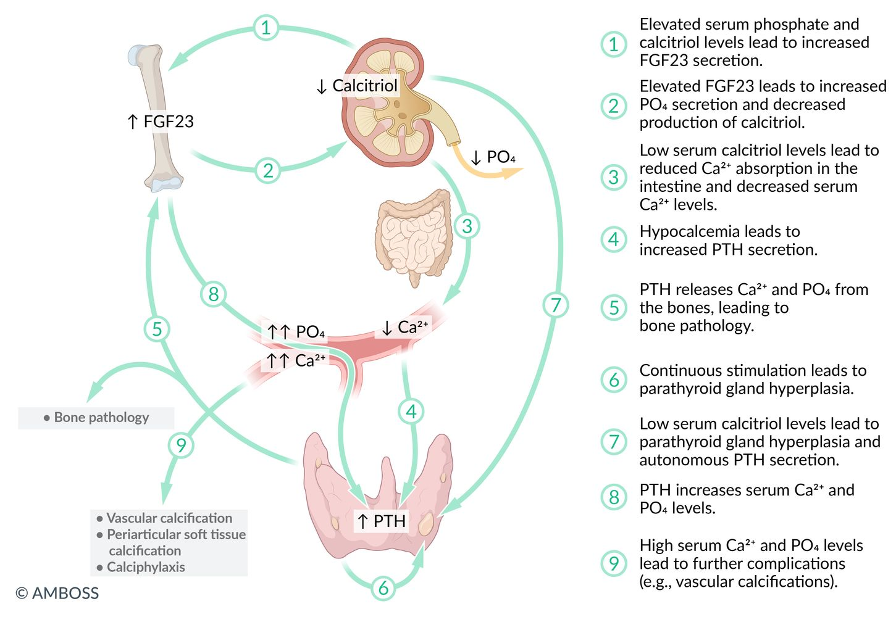
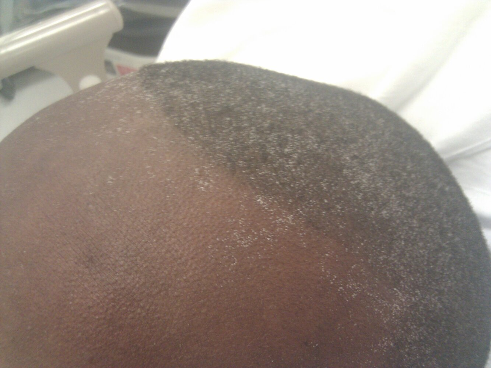
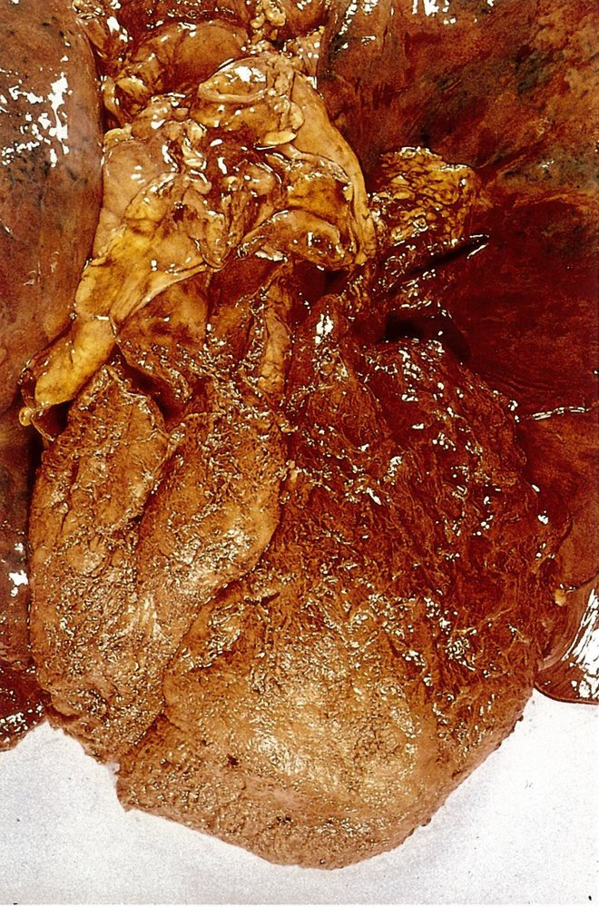
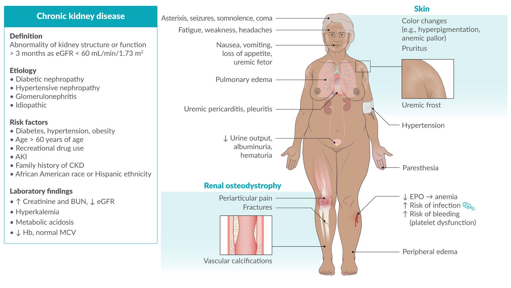
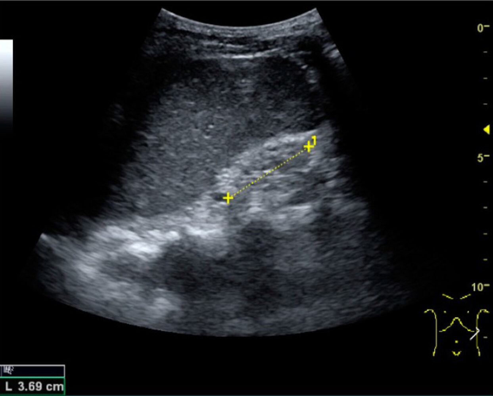
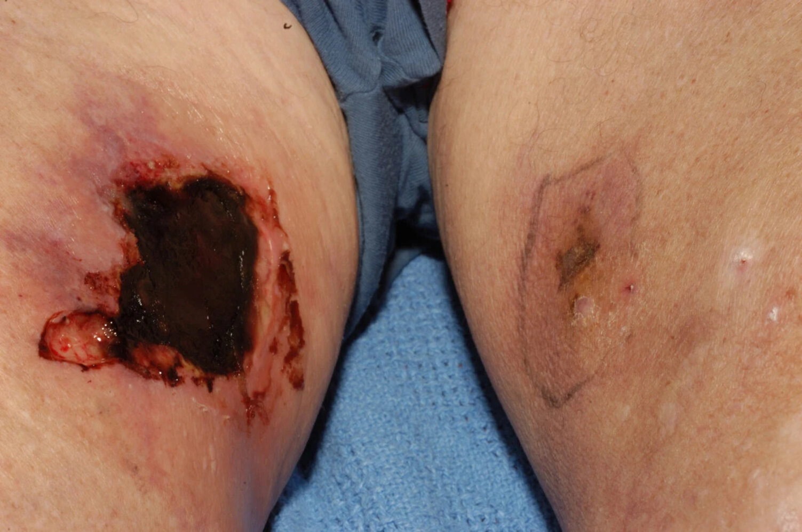
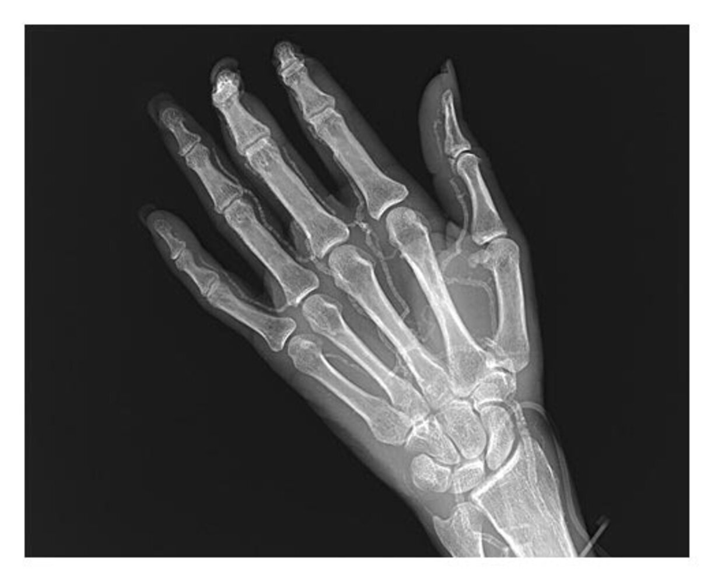

# Chronic kidney disease

*Categories: Clinical knowledge > Emergency medicine > Renal and genitourinary disorders > Chronic kidney disease*

[Original Article Link](https://coursology-qbank.com/amboss/article/lg0vv2)

---

## Summary

Chronic <u>kidney</u> disease (CKD) is defined as an abnormality of <u>kidney</u> structure or function that persists for > 3 months and affects health. The most common <u>causes of CKD</u> in the United States are <u>diabetes mellitus</u>, <u>hypertension</u>, and <u>glomerulonephritis</u>. Most patients remain asymptomatic until their <u>kidney function</u> is severely impaired due to the organ's efficient compensatory mechanisms and significant renal reserve. Patients are most commonly diagnosed via routine screening (e.g., screening of high-risk populations, routine blood tests that include serum <u>creatinine</u> to estimate <u>glomerular filtration rate</u>). At advanced disease stages, patients may present with symptoms of <u>fluid overload</u> (e.g., <u>peripheral edema</u>) and/or <u>uremia</u> (e.g., fatigue, <u>pruritus</u>). Patients with CKD have a significantly increased risk of developing <u>atherosclerotic cardiovascular disease</u> (<u>ASCVD</u>). <u>Laboratory studies</u> may show metabolic complications, such as <u>hyperkalemia</u>, <u>hyperphosphatemia</u>, <u>hypocalcemia</u>, and <u>metabolic acidosis</u>. Management is aimed at slowing <u>CKD progression</u> and preventing and/or managing complications. This includes treating the underlying disease, avoiding <u>nephrotoxic substances</u>, maintaining adequate hydration and nutrition, pharmacotherapy (e.g., <u>RAAS inhibitors</u>, <u>SGLT2 inhibitors</u>, and <u>statins</u>), and addressing complications such as <u>anemia of CKD</u> and <u>CKD-mineral and bone disorder</u> (<u>CKD-MBD</u>). <u>Renal replacement therapy</u> (i.e., dialysis or <u>renal transplantation</u>) is required if CKD progresses to <u>end-stage renal disease</u> (<u>ESRD</u>).

See also “<u>Acute kidney injury</u>” (<u>AKI</u>) and “<u>Diabetic kidney disease</u>” (<u>DKD</u>).

---

## Epidemiology

* <u>Prevalence</u> [[1]](https://coursology-qbank.com/amboss/article/7tb4Uv)

* An estimated 37 million individuals (15%) in the US have CKD.

* 726,000 individuals have <u>ESRD</u>.

* <u>Incidence</u>: > 350 cases of <u>ESRD</u> per million individuals annually  [[1]](https://coursology-qbank.com/amboss/article/7tb4Uv)

Epidemiological data refers to the US, unless otherwise specified.

---

## Etiology

* <u>Diabetes mellitus</u> (38%)

* <u>Hypertension</u> (26%)

* <u>Glomerulonephritis</u> (16%)

* Other causes (15%): e.g., <u>polycystic kidney disease</u>, <u>analgesic</u> misuse, <u>amyloidosis</u>

* <u>Idiopathic</u> (5%)

---

## Pathophysiology

Pathophysiology depends on the underlying condition, any of which will eventually lead to progressive <u>nephron</u> loss, structural damage, and impaired <u>kidney function</u>.

### Underlying conditions

#### <u>Diabetic nephropathy</u> [[2]](https://coursology-qbank.com/amboss/article/YFbngv)

* <u>Hyperglycemia</u> → <u>nonenzymatic glycation</u> of <u>proteins</u> → varying degrees of damage to all types of <u>kidney</u> cell.

* Pathological changes include:

* <u>Hypertrophy</u> and <u>proliferation</u> of mesangial cells, <u>GBM</u> thickening, and <u>ECM</u> protein accumulation → eosinophilic <u>nodular glomerulosclerosis</u>

* Thickening and diffuse <u>hyalinization</u> of afferent and <u>efferent arterioles</u>/<u>interlobular arteries</u>

* <u>Interstitial</u> <u>fibrosis</u>, <u>TBM</u> thickening, and tubular <u>hypertrophy</u>

#### <u>Hypertensive nephropathy</u>

* Caused by protective autoregulatory <u>vasoconstriction</u> of preglomerular vessels, increases in systemic blood pressure do not normally affect renal <u>microvessels</u>. [[3]](https://coursology-qbank.com/amboss/article/bFbHgv)

* Increased systemic blood pressure (e.g., due to chronic <u>hypertension</u>) below the protective autoregulatory threshold → benign nephrosclerosis (<u>sclerosis</u> of <u>afferent arterioles</u> and small <u>arteries</u>) → ↓ <u>perfusion</u> → <u>ischemic</u> damage

* In case BP exceeds threshold → acute injury → malignant nephrosclerosis (<u>petechial</u> subcapsular hemorrhages, visible <u>infarction</u> with <u>necrosis</u> of mesangial and <u>endothelial</u> cells, <u>thrombosis</u> of <u>glomeruli</u> <u>capillaries</u>, luminal <u>thrombosis</u> of <u>arterioles</u>, and <u>red blood cell</u> extravasation and fragmentation) → failure of autoregulatory mechanisms → ↑ damage

#### <u>Glomerulonephritis</u> (GN)

* Noninflammatory GN (e.g., <u>minimal change GN</u>, <u>membranous nephropathy</u>, <u>focal segmental glomerulosclerosis</u>)

* Inflammatory GN (e.g., <u>lupus nephritis</u>, <u>poststreptococcal GN</u>, <u>rapid progressive GN</u>, <u>hemolytic uremic syndrome</u>)

### Consequences

Pathophysiology of chronic kidney disease-mineral and bone disorder (CKD-MBD)

#### Reduced <u>GFR</u>

* ↓ Production of urine → ↑ <u>extracellular fluid</u> volume → total-body <u>volume overload</u>

* ↓ Excretion of waste products (e.g., <u>urea</u>, drugs)

* ↓ Excretion of <u>phosphate</u> → <u>hyperphosphatemia</u>
* During the early <u>stages of CKD</u>, plasma <u>phosphate</u> levels will typically be normal due to the increased secretion of fibroblast growth factor 23 (<u>FGF23</u>). [[4]](https://coursology-qbank.com/amboss/article/T9X65Z0)

* <u>FGF23</u> is produced by <u>osteoblasts</u> in response to initial <u>hyperphosphatemia</u> and increased <u>calcitriol</u>.

* Increased secretion of <u>FGF23</u> leads to increased <u>phosphate</u> secretion and suppressed conversion of <u>25-hydroxyvitamin D</u> to <u>1,25-dihydroxyvitamin D</u>.

* In advanced CKD, the effects of FGF 23 subside (most likely due to development of resistance in target tissues). [[4]](https://coursology-qbank.com/amboss/article/T9X65Z0)

* ↓ Maintenance of <u>acid-base balance</u>;   → <u>metabolic acidosis</u>

* ↓ Maintenance of <u>electrolyte</u> concentrations → <u>electrolyte</u> imbalances (e.g., Na+ retention)

#### Reduced endocrine activity

* ↓ <u>Hydroxylation</u> of <u>calcifediol</u> → ↓ production of <u>calcitriol</u> → (in combination with ↓ excretion of <u>phosphate</u>) → ↓ serum <u>Ca2+</u> → ↑ <u>PTH</u>

* ↓ <u>Erythropoietin</u> → ↓ stimulation of <u>erythropoiesis</u>

#### Reduced <u>gluconeogenesis</u>

* ↑ Risk of <u>hypoglycemia</u>

---

## Clinical features

Patients are often asymptomatic until later stages due to the exceptional compensatory mechanisms of the <u>kidneys</u>.

### Manifestations of Na+/H2O retention

* <u>Hypertension</u> and <u>heart failure</u>

* Pulmonary;   and <u>peripheral edema</u>

### Manifestations of uremia

* Definition: <u>Uremia</u> is defined as the accumulation of toxic substances due to decreased <u>renal excretion</u>. These toxic substances are mostly metabolites of <u>proteins</u> such as <u>urea</u>, <u>creatinine</u>, <u>β2 microglobulin</u>, and <u>parathyroid hormone</u>.

* <u>Constitutional symptoms</u>

* Fatigue

* <u>Weakness</u>

* <u>Headaches</u>

* Gastrointestinal symptoms

* <u>Nausea and vomiting</u>

* Loss of appetite

* Uremic fetor: characteristic <u>ammonia</u>- or urine-like breath odor

* Dermatological manifestations

* <u>CKD-associated pruritus</u>

* <u>Skin</u> color changes (e.g., <u>hyperpigmentation</u>, <u>pallor</u> due to <u>anemia</u>)

* Uremic frost: <u>uremia</u> leads to high levels of <u>urea</u> secreted in the sweat, the evaporation of which may result in tiny crystallized yellow-white <u>urea</u> deposits on the <u>skin</u>.

* <u>Serositis</u>

* Uremic pericarditis: a complication of chronic <u>kidney</u> disease that causes <u>fibrinous pericarditis</u>   

* Clinical features: <u>chest pain</u> worsened by inhalation

* <u>Physical examination</u> findings

* Friction rub on <u>auscultation</u>

* <u>ECG</u> changes normally seen in nonuremic <u>pericarditis</u> (e.g., diffuse <u>ST-segment</u> elevation) are not usually seen.

* <u>Pleuritis</u>

* Neurological symptoms

* <u>Asterixis</u>

* Signs of uremic encephalopathy

* <u>Seizures</u>

* <u>Somnolence</u>

* <u>Coma</u>

* <u>Peripheral neuropathy</u> → <u>paresthesias</u>

* Hematologic symptoms

* <u>Anemia</u>

* <u>Leukocyte</u> dysfunction → ↑ risk of infection

* ↑ Bleeding tendency caused by abnormal <u>platelet adhesion</u> and aggregation  [[5]](https://coursology-qbank.com/amboss/article/-LXDZ_)

> [!NOTE]
> Kidney OUTAGES: hyperKalemia, renal Osteodystrophy, Uremia, Triglyceridemia, Acidosis (metabolic), Growth delay, Erythropoietin deficiency (<u>anemia</u>), Sodium/water retention (consequences of chronic <u>kidney</u> disease)

Uremic frost

Fibrinous pericarditis in uremia

Chronic kidney disease fact sheet

---

## Classification

### General principles [[6]](https://coursology-qbank.com/amboss/article/qTdC760)[[7]](https://coursology-qbank.com/amboss/article/0Fbegv)

CKD is classified according to cause, <u>eGFR category</u>, and <u>albuminuria category</u> (<u>CGA classification</u>).

* Clinical uses

* Standardized documentation of <u>CKD stages</u> (e.g., <u>diabetic kidney disease</u> G3A2)

* Identifying <u>CKD progression</u>

* Determining the frequency of patient monitoring

* Interpretation: Higher stages are associated with a poorer prognosis. [[8]](https://coursology-qbank.com/amboss/article/nTc7rb0)

* Increased risk for <u>CKD progression</u> and mortality (e.g., <u>all-cause mortality</u>, cardiovascular mortality)

* Increased risk for complications (e.g., <u>AKI</u>, <u>CKD-MBD</u>)

#### Cause [[6]](https://coursology-qbank.com/amboss/article/qTdC760)

1. * Systemic vs. primary cause: Determine if the cause of CKD is systemic (e.g., <u>diabetes</u>) or primary (e.g., <u>polycystic kidney disease</u>).
2. * Type: Determine the type (presumed or confirmed) of the damage within the <u>kidney</u>.

* <u>Glomerular</u>

* Tubulointerstitial

* Vascular

* Cystic and congenital

#### <u>eGFR</u> and <u>albuminuria</u> [[6]](https://coursology-qbank.com/amboss/article/qTdC760)

|  Risk of progression and complications of CKD based on <u>eGFR</u> and <u>albuminuria category</u> [[6]](https://coursology-qbank.com/amboss/article/qTdC760)  |  |  |  |  |
| --- | --- | --- | --- | --- |
| eGFR category(mL/min/1.73 m2) |  | Persistent albuminuria category(<u>UACR</u>) |  |  |
|  A1: < 30 mg/g or < 3 mg/mmol (normal to mildly increased <u>albuminuria</u>) |  A2: 30–300 mg/g or 3–30 mg/mmol (<u>moderately increased albuminuria</u>) |  A3: > 300 mg/g or > 30 mg/mmol (<u>severely increased albuminuria</u>) |  |  |
|  Stage G1 CKD: ≥ 90 (normal or high) |  | Low risk* | Moderate risk | High risk |
|  Stage G2 CKD: 60–89 (mildly low) |  |  |  |  |
| Stage G3 CKD |  G3a: 45–59 (mildly to moderately low) | Moderate risk | High risk | Very high risk |
|  G3b: 30–44 (moderately to severely low) | High risk | Very high risk |  |  |
|  Stage G4 CKD: 15–29 (severely low) |  | Very high risk |  |  |
| Stage G5 CKD: < 15 (<u>kidney failure</u>) |  |  |  |  |
| *Stages G1A1 and G2A1 only indicate CKD if there are other <u>markers of kidney damage</u>. |  |  |  |  |

### End-stage renal disease (<u>ESRD</u>) [[9]](https://coursology-qbank.com/amboss/article/oTc07b0)

* Irreversible <u>kidney</u> dysfunction with a <u>GFR</u> < 15 mL/min/1.73 m2

* AND manifestations of <u>uremia</u> requiring <u>chronic renal replacement therapy</u> with either dialysis (<u>hemofiltration</u> or <u>hemodiafiltration</u>) or <u>renal transplantation</u>

* Prognosis: Approx. 50% of individuals with <u>ESRD</u> die of cardiovascular disease.

---

## Screening

### Indications for screening [[6]](https://coursology-qbank.com/amboss/article/qTdC760)

Consider screening patients with risk factors for CKD, e.g.: [[1]](https://coursology-qbank.com/amboss/article/7tb4Uv)[[6]](https://coursology-qbank.com/amboss/article/qTdC760)

* Comorbidities

* <u>ASCVD risk factors</u> (e.g., <u>hypertension</u>, <u>diabetes mellitus</u>)

* Established cardiovascular diseases (e.g., <u>coronary artery disease</u>, <u>heart failure</u>)

* History of <u>AKI</u>

* Advanced age (> 60 years of age) [[10]](https://coursology-qbank.com/amboss/article/0cXeaC)

* Genitourinary conditions (e.g., <u>polycystic kidney disease</u>, recurrent <u>kidney stones</u>)

* Autoimmune diseases (e.g., <u>systemic lupus erythematosus</u>, <u>vasculitis</u>)

* Gestational conditions (e.g., <u>pre-eclampsia</u>, <u>eclampsia</u>) and complications (e.g., <u>preterm birth</u>, small gestational size)

* Infectious diseases (e.g., <u>HIV</u>, <u>schistosomiasis</u>)

* <u>Obesity</u>

* Exposures

* Substance use (e.g., smoking, <u>alcohol</u>, <u>recreational drugs</u>)

* <u>Occupational exposure</u> to toxic substances (e.g., <u>cadmium</u>, lead, <u>mercury</u>, pesticides, polycyclic hydrocarbons)

* <u>Nephrotoxic medications</u> (may cause <u>chronic tubulointerstitial nephritis</u>)

* <u>Radiation therapy</u> (may cause radiation nephritis)

* <u>Family history</u>: CKD or associated conditions

* Other: residence in areas with elevated CKD <u>prevalence</u> (e.g., areas with environmental toxins or high <u>prevalence</u> of APOL1 genetic variants)

### Screening methods [[6]](https://coursology-qbank.com/amboss/article/qTdC760)

* Assess <u>GFR</u> (using eGFRcr-<u>cys</u>, if available, or eGFRcr) and <u>urine albumin-to-creatinine ratio</u> (<u>UACR</u>).

* If results are normal (i.e., <u>eGFR</u> ≥ 60 mL/min/1.73 m2, <u>UACR</u> < 30 mg/g, and no other <u>markers of kidney damage</u>):

* Retest frequency is based on individual risk.

* See also “<u>Screening for diabetic kidney disease</u>.”  [[11]](https://coursology-qbank.com/amboss/article/oud0H70)[[12]](https://coursology-qbank.com/amboss/article/-G1Dbi0)

---

## Diagnosis

### Approach [[6]](https://coursology-qbank.com/amboss/article/qTdC760)

* Assess <u>GFR</u> to determine if the patient meets the <u>criteria for CKD</u>.

* Stage CKD according to the <u>CGA classification</u> using eGFRcr-<u>cys</u> (if available) and <u>UACR</u>.

* Determine the underlying cause with a thorough clinical evaluation and noninvasive testing.

* <u>Kidney biopsy</u> is typically reserved for rapid and unexplained decline in <u>GFR</u> and/or to confirm the underlying cause.

* Estimate risk of <u>CKD progression</u> to <u>kidney failure</u> for timely referral for <u>renal transplantation</u> and/or dialysis access planning.

* Refer to nephrology for <u>urgent renal replacement therapy</u> if any <u>indications for acute dialysis</u> are identified.

> [!WARNING]
> A single abnormal <u>GFR</u> or <u>UACR</u> level is not diagnostic for CKD.

> [!TIP]
> Confirm CKD with repeat testing if <u>albuminuria</u>, <u>hematuria</u>, or low <u>GFR</u> are detected incidentally.

### Assessment of <u>GFR</u> [[6]](https://coursology-qbank.com/amboss/article/qTdC760)

Use a validated equation tested within the relevant geographical region. Avoid incorporating race into assessment of <u>GFR</u>.

#### <u>Estimated GFR</u> (<u>eGFR</u>)

* Serum <u>creatinine</u>-based <u>eGFR</u> formulas (eGFRcr): preferred initial test for most patients

* <u>Creatinine</u> and cystatin C-based <u>eGFR</u> (eGFRcr-<u>cys</u>) is preferred when:

* There is diagnostic uncertainty

* eGFRcr may be inaccurate

* <u>CKD staging</u> is required

* Cystatin C-based <u>eGFR</u> (eGFRcys): less accurate than eGFRcr-<u>cys</u>

* Measured urine <u>creatinine clearance</u>: Consider when eGFRcr-<u>cys</u> may be inaccurate and mGFR is unavailable.

> [!TIP]
> When eGFRcr and eGFRcys align, all three estimates (i.e., eGFRcr, eGFRcys, and eGFRcr-<u>cys</u>) have a similar degree of <u>accuracy</u>. When eGFRcr and eGFRcys differ, eGFRcr-<u>cys</u> is more accurate than eGFRcr or eGFRcys. [[6]](https://coursology-qbank.com/amboss/article/qTdC760)

eGFR using CKD-EPI

MDRD eGFR Equation

#### Measured <u>GFR</u> (mGFR)

* <u>Gold-standard test</u> but not routinely indicated

* May be considered in selected cases  when a more accurate assessment would alter management.

### Diagnostic criteria [[6]](https://coursology-qbank.com/amboss/article/qTdC760)

#### Criteria for CKD

* Persistence of <u>eGFR</u> < 60 mL/min/1.73 m2 (≥ G3a)

* AND/OR persistence of any of the following markers of kidney damage:

* History of <u>renal transplantation</u>

* Imaging showing structural abnormalities (e.g., in <u>polycystic kidney disease</u>)

* Histological abnormalities on <u>biopsy</u>

* Abnormalities due to tubulointerstitial dysfunction, e.g.:

* <u>Electrolyte</u> and <u>acid-base imbalances</u>

* Retention of <u>nitrogenous wastes</u>

* Reduced production of <u>erythropoietin</u>, <u>1,25-dihydroxyvitamin D</u>, and/or <u>renin</u>

* <u>Urine sediment</u> abnormalities (e.g., <u>hematuria</u>, casts)

* <u>Albuminuria</u>: e.g., <u>urine albumin-to-creatinine ratio</u> (<u>UACR</u>) > 30 mg/g (≥ A2)

* PLUS proof of chronicity (i.e., duration of > 3 months) established by any of the following:

* Comparison of current and previous <u>GFR</u>, <u>albuminuria</u>, <u>proteinuria</u>, and/or urine microscopies (if available)

* Suggestive imaging findings (e.g., small <u>hyperechoic</u> <u>kidneys</u> on <u>ultrasound</u>)

* Suggestive histopathological findings (e.g., <u>atrophy</u> and/or <u>fibrosis</u>)

* Suggestive <u>medical history</u> (e.g., history of conditions known to contribute to or cause CKD)

* Repeat measurements after > 3 months

> [!WARNING]
> Suspect <u>AKI</u> (with or without underlying CKD) in patients with a rapid rise in <u>creatinine</u> level (i.e., over days rather than weeks to months).

> [!TIP]
> A diagnosis of CKD requires a persistent <u>eGFR</u> < 60 mL/min/1.73 m2 and/or <u>markers of kidney damage</u> lasting more than 3 months.

#### CKD progression

* <u>CKD progression</u> is defined as either of the following:

* A decline in renal function leading to a change in <u>eGFR category</u>

* A sustained decline in <u>eGFR</u> of > 5 mL/min/1.73 m2 per year (known as “rapid progression”)

* Risk of progression to <u>ESRD</u> [[6]](https://coursology-qbank.com/amboss/article/qTdC760)

* Calculate for patients <u>stage G3 CKD</u> to <u>stage G5 CKD</u>.

* Use a validated calculator, e.g., kidney failure risk equation (<u>KFRE</u>).

* Interpretation

* Five-year <u>kidney failure</u> risk 3–5%: Consider nephrology referral.

* Two-year <u>kidney failure</u> risk > 10%: Consider <u>multidisciplinary care</u>.

* Two-year <u>kidney failure</u> risk > 40%: Consider planning and preparation for <u>renal replacement therapy</u> and referral for <u>transplantation</u>.

> [!TIP]
> Validated risk-<u>stratification</u> tools can be used to identify patients at increased risk for <u>kidney failure</u> to help guide appropriate referrals to specialist nephrology care.

Kidney Failure Risk Equation (8 Variable)

---

## Initial studies

### <u>Laboratory studies</u> [[6]](https://coursology-qbank.com/amboss/article/qTdC760)

#### Blood tests

* Serum markers to assess <u>eGFR</u>

* <u>Creatinine</u> (preferred initial test): ↑ levels

* <u>Cystatin C</u>: ↑ levels

* Consider as the initial test if <u>creatinine</u> may be inaccurate; see “Assessment of <u>GFR</u>.”

* Obtain (if available) for all patients with confirmed CKD for <u>CKD staging</u>.

* ↑ <u>BUN</u>

* <u>Hemostasis</u>: ↑ bleeding time, normal <u>PT</u>, <u>PTT</u> and <u>platelet count</u> (see “<u>Diagnostic workup of bleeding disorders</u>”)

#### Urine studies

* Spot <u>UACR</u>

* Used to determine the <u>albuminuria category</u> for <u>CKD staging</u>   [[6]](https://coursology-qbank.com/amboss/article/qTdC760)

* Elevated levels indicate <u>albuminuria</u>.

* ↑ Spot <u>urine protein-to-creatinine ratio</u> (<u>UPCR</u>): may show <u>nephrotic-range proteinuria</u>

* <u>Urine dipstick</u>

* <u>Proteinuria</u> on <u>urine dipstick</u> requires confirmation with quantitative <u>UACR</u> or <u>UPCR</u>.

* May show <u>hematuria</u>

* Urine microscopy: may show abnormal <u>urine sediment</u> (e.g.,  <u>waxy casts</u>)

> [!TIP]
> Suspect <u>plasma cell dyscrasia</u> if the <u>UPCR</u> is significantly higher than the <u>UACR</u>. Send a urine sample for protein <u>electrophoresis</u> to identify urine <u>proteins</u> other than <u>albumin</u> (e.g., <u>Bence Jones protein</u>).

### <u>Ultrasound of the kidneys</u> and <u>urinary tract</u> [[6]](https://coursology-qbank.com/amboss/article/qTdC760)

* First-line imaging technique for the assessment of <u>kidney</u> structure

* Consider obtaining for all patients to further support the diagnosis and help determine the etiology.

* Findings that suggest chronic <u>kidney</u> damage include:    [[13]](https://coursology-qbank.com/amboss/article/-TcDtb0)

* ↓ <u>Kidney</u> length (< 10 cm)

* ↓ <u>Parenchymal</u> and/or cortical thickness

* ↑ Cortical <u>echogenicity</u>

* Cysts

* Calcifications

* Findings that suggest specific etiologies

* Ureteral or renal <u>pelvic</u> dilation suggests <u>obstructive nephropathy</u>.

* Bilaterally enlarged <u>kidneys</u> with multiple cysts suggest <u>polycystic kidney disease</u>.

* Cortical <u>nephrocalcinosis</u> suggests chronic <u>glomerulonephritis</u> or <u>chronic pyelonephritis</u>. [[14]](https://coursology-qbank.com/amboss/article/ZgcZFb0)

Ultrasound in chronic renal disease

> [!TIP]
> Consider obtaining an <u>ultrasound of the kidneys</u> and <u>urinary tract</u> as part of the routine evaluation of all patients with CKD.

---

## Additional studies

Additional studies should be considered based on clinical suspicion or if an underlying cause of CKD is not apparent following an initial assessment. [[6]](https://coursology-qbank.com/amboss/article/qTdC760)

> [!TIP]
> Integration of information from the patient's clinical presentation, laboratory tests, imaging, and in some cases, <u>renal biopsy</u> is needed to determine the underlying cause.

### Noninvasive testing [[6]](https://coursology-qbank.com/amboss/article/qTdC760)

| Investigations for specific underlying <u>causes of CKD</u> |  |  |
| --- | --- | --- |
| Examples | Suggestive features | Common additional studies |
| <u>Diabetes</u> |   * <u>Symptoms of diabetes mellitus</u>  * <u>Indications for diabetes screening</u>  * <u>Nephrotic syndrome</u> or <u>nephrotic-range proteinuria</u>    |   * <u>Fasting plasma glucose</u>  * <u>HbA1c</u>  * See also “<u>Diabetic kidney disease</u>.”    |
| <u>Glomerulonephritis</u> |   * Evidence of extrarenal disease (e.g., <u>clinical features of SLE</u>, <u>anti-GBM disease</u>, <u>pauci-immune glomerulonephritis</u>)  * History of IV drug use  * <u>Nephritic syndrome</u> or <u>nephrotic syndrome</u>  * <u>Urinalysis</u> abnormalities (any of the following):  * <u>Nephritic sediment</u>  * <u>Nephrotic sediment</u>  * <u>Nephrotic-range proteinuria</u>    |   * <u>Serology</u>, e.g.:  * <u>ANA</u>  * <u>ANCA</u>  * anti-<u>GBM</u> <u>antibody</u>  * Viral <u>serology</u> (e.g., <u>HIV</u>, <u>HBV</u>, <u>HCV</u>)  * <u>Complement</u> levels    |
| <u>Multiple myeloma</u> |  * <u>CRAB criteria</u>   |   * <u>Serum protein electrophoresis</u>  * Urine <u>Bence Jones protein</u>  * Serum and urine <u>free light chains</u>    |
| <u>Renal artery stenosis</u> |   * <u>Treatment-resistant hypertension</u>  * Abdominal <u>bruit</u> heard over the flank or epigastrium  * Evidence of other atherosclerotic diseases (e.g., <u>CAD</u>, <u>PAD</u>)    |  * <u>Duplex ultrasonography</u> of the <u>renal arteries</u>   |
| <u>Amyloidosis</u> |   * History of a chronic inflammatory condition (e.g., <u>IBD</u>, <u>RA</u>) or chronic infectious disease (e.g., <u>tuberculosis</u>, <u>osteomyelitis</u>)  * History of <u>plasma cell dyscrasia</u>  * Evidence of other organ involvement (e.g., <u>macroglossia</u>, <u>restrictive cardiomyopathy</u>, <u>hepatosplenomegaly</u>, <u>malabsorption</u>)    |   * <u>Serum protein electrophoresis</u>  * Urine <u>Bence Jones protein</u>  * Serum and urine <u>free light chains</u>    |

### <u>Renal biopsy</u> [[6]](https://coursology-qbank.com/amboss/article/qTdC760)

* Often not required to establish the cause

* Consider in either of the following situations:

* Rapid and unexplained decline in <u>eGFR</u>

* Need for diagnostic confirmation of the underlying cause (e.g., <u>glomerulonephritis</u>) prior to starting disease-specific therapy

> [!TIP]
> Discuss the risks and benefits of <u>biopsy</u> with the patient and use <u>shared decision-making</u>.

---

## Management

The following guidance applies to patients with <u>CKD stage</u> G1–G5 who are not on dialysis and have not had <u>renal transplantation</u>.

### Approach [[6]](https://coursology-qbank.com/amboss/article/qTdC760)

The goals of management are to delay the progression of CKD and prevent and/or manage complications.

* Treat the underlying <u>causes of CKD</u> (if identified).

* Start comprehensive management.

* Provide recommendations on nutrition and <u>vaccinations</u>, and adjust current medications as required.

* Consider indications for <u>pharmacotherapy for CKD</u> (e.g., <u>RAAS inhibitors</u>, <u>SGLT2 inhibitors</u>, <u>statins</u>).

* <u>Primary prevention of ASCVD</u>

* Assess for evidence of metabolic complications  and start management under specialist guidance.

* Monitor for <u>CKD progression</u>.

* Continuously evaluate the need for advanced care.

> [!TIP]
> If <u>CKD progression</u> or complications are detected during follow-up, review the current management and assess for reversible causes of progression (e.g., <u>nephrotoxin</u> exposure, medications affecting <u>glomerular</u> <u>perfusion</u>, <u>urinary tract obstruction</u>).

> [!TIP]
> <u>Prevention of AKI</u> in patients with CKD is vital to prevent disease progression.

> [!WARNING]
> If there are <u>indications for acute dialysis</u>, urgently start <u>renal replacement therapy</u>.

### <u>ASCVD risk assessment</u> [[6]](https://coursology-qbank.com/amboss/article/qTdC760)

* Untreated CKD is an <u>ASCVD risk-enhancing factor</u>.

* Perform the following in all patients:

* <u>Diabetes mellitus screening</u>

* <u>Screening for hypertension</u>

* <u>Screening for lipid disorders</u>

* <u>ASCVD risk calculation</u> using an equation that has been validated in CKD patients or that includes <u>eGFR</u> and <u>albuminuria</u> (e.g., <u>PREVENT equations</u>)

> [!TIP]
> <u>Management of ASCVD</u> reduces cardiovascular <u>morbidity</u> and mortality and helps prevent <u>CKD progression</u>.

> [!WARNING]
> Cardiovascular disease (e.g., <u>coronary artery disease</u>, <u>stroke</u>) is the leading <u>cause of death</u> in patients with CKD. The risk of cardiovascular events is higher in patients with more advanced <u>stages of CKD</u>. [[15]](https://coursology-qbank.com/amboss/article/LTcwrb0)

### Lifestyle changes

* Encourage a healthy lifestyle, including:

* <u>Smoking cessation</u> and cessation of any <u>tobacco products</u>

* Weight loss in patients with <u>overweight or obesity</u>

* Moderate-intensity physical activity for 150 minutes per week

* For any recommendations, consider the patient's age, ethnicity, comorbidities, and access to resources.

* Reassess lifestyle factors every 3–6 months.

### Nutrition [[6]](https://coursology-qbank.com/amboss/article/qTdC760)

* Fluid intake: Ensure appropriate fluid intake and avoid <u>dehydration</u>.

* Protein and energy consumption in CKD

* <u>Mediterranean diet</u> or <u>DASH diet</u>

* Protein intake of 0.8 g/kg/day in adult patients with <u>CKD stage</u> G3–G5

* Avoid a high protein intake of > 1.3 g/kg/day in patients at risk for <u>CKD progression</u>.

* Recommend avoiding highly-processed foods.

* <u>Electrolytes</u>

* <u>Sodium</u> restriction (< 2 g/day): for individuals with <u>CKD stage</u> G3–G5

* <u>Potassium</u> intake adjustment: avoidance of high-<u>potassium</u> foods in patients with <u>CKD stage</u> G4–G5 to reduce the risk for <u>hyperkalemia</u>

* <u>Phosphorus</u> intake adjustment: as needed to maintain serum <u>phosphate</u> levels in the normal range

* <u>Micronutrients</u>: Consider multivitamin supplementation;  for patients with inadequate dietary <u>vitamin</u> (e.g., <u>vitamin D</u>) intake.  [[16]](https://coursology-qbank.com/amboss/article/gEbFEv)

> [!WARNING]
> Dietary protein restriction must only be prescribed under close clinical supervision and in consultation with a nutritionist.

> [!TIP]
> Obtain a nutritionist consult for all patients with CKD.

### Medication management [[6]](https://coursology-qbank.com/amboss/article/qTdC760)[[17]](https://coursology-qbank.com/amboss/article/yhcdgX0)

* <u>Renally cleared medications</u>: Adjust dosing based on the patient's <u>eGFR</u>.

* Potentially <u>nephrotoxic substances</u>

* Avoid use (unless the benefits outweigh the risks).

* Frequently monitor renal function and <u>electrolytes</u> and, if indicated, measure drug levels.  [[15]](https://coursology-qbank.com/amboss/article/LTcwrb0)

* Contrast imaging

* The risk of <u>contrast-induced nephropathy</u> is highest in patients with an <u>eGFR</u> < 30 mL/min/1.73 m2.

* For information on prevention, see “<u>Contrast-induced nephropathy</u>.”

> [!TIP]
> Weigh the risks and benefits of potentially <u>nephrotoxic substances</u> on an individual basis.

> [!WARNING]
> In acutely ill patients with CKD, consider temporarily holding <u>renally cleared medications</u> and medications that can detrimentally affect <u>glomerular</u> <u>perfusion</u> (e.g., <u>NSAIDs</u>, <u>ACE inhibitors</u>, <u>ARBs</u>) to reduce the risk for <u>AKI</u>.

### <u>Vaccinations</u>

Patients with CKD are at an increased risk for infection.

* <u>Live attenuated vaccines</u>: Consider offering the <u>MMR vaccine</u> and <u>varicella vaccine</u> to patients who have not been vaccinated since <u>infancy</u> or do not have <u>immunity</u>.

* <u>Inactivated vaccines</u>

* Ensure <u>influenza</u>, <u>pneumococcal</u>, and <u>hepatitis B</u> <u>vaccinations</u> are up-to-date. [[18]](https://coursology-qbank.com/amboss/article/NEb-Dv)

* See “<u>Immunization schedule</u>” for recommendations on indications, timing, and frequency.

> [!TIP]
> Patients with CKD may be <u>immunocompromised</u>. Consider the patient's current immune status and consult a specialist before administering <u>live vaccines</u>. [[15]](https://coursology-qbank.com/amboss/article/LTcwrb0)

### Nephrology consultation [[6]](https://coursology-qbank.com/amboss/article/qTdC760)

Indications for nephrology consultation include any of the following:

* <u>CKD progression</u>

* High risk for <u>CKD progression</u>

* <u>KFRE</u> with 5-year risk of progression to <u>ESRD</u> of 3–5%

* <u>eGFR category</u> G4–G5 and/or <u>albuminuria category</u> A3 (i.e., <u>UACR</u> > 300 mg/g)

* <u>Treatment-resistant hypertension</u> or persistent <u>hyperkalemia</u>

* <u>Hematuria</u>, <u>nephrolithiasis</u>, or hereditary <u>kidney</u> disease

* <u>AKI</u> episode

### <u>Renal replacement therapy</u> [[6]](https://coursology-qbank.com/amboss/article/qTdC760)

Plan for pre-emptive <u>renal transplantation</u> and/or dialysis access in adults if the <u>eGFR</u> falls to < 15–20 ml/min per 1.73 m2 or if the <u>KFRE</u> 2-year risk is > 40%. [[6]](https://coursology-qbank.com/amboss/article/qTdC760)

* Nonoperative (<u>hemodialysis</u> or <u>peritoneal dialysis</u>)
* Indications include:

* Hemodynamic or metabolic complications that are refractory to medical therapy, e.g.:

* <u>Volume overload</u> or <u>hypertension</u>

* <u>Metabolic acidosis</u>

* <u>Hyperkalemia</u>

* <u>Serositis</u> (e.g., <u>uremic pericarditis</u>)

* Other manifestations of <u>uremia</u> (e.g., signs of <u>encephalopathy</u>, intractable <u>pruritus</u>)

* Refractory deterioration in <u>nutritional status</u>

* Operative: <u>renal transplantation</u>

---

## Pharmacotherapy

### <u>Antihypertensives</u> [[6]](https://coursology-qbank.com/amboss/article/qTdC760)[[19]](https://coursology-qbank.com/amboss/article/GVcBDY0)

* Systolic blood pressure (<u>SBP</u>) target

* <u>SBP</u> < 120 mm Hg is recommended (if tolerated).  [[6]](https://coursology-qbank.com/amboss/article/qTdC760)

* Consider higher targets (e.g., < 130–140 mm Hg) for selected patients.

* First-line therapy: <u>RAAS inhibitors</u> (i.e., <u>ACE inhibitors</u> or <u>ARBs</u>)

* Start in patients with <u>CKD stage</u> G1–G4) and moderately to <u>severely increased albuminuria</u> (A2–A3) with or without <u>diabetes</u>.

* Consider for patients with normal to mildly increased <u>albuminuria</u> (A1).

* Consider an additional <u>nonsteroidal mineralocorticoid receptor antagonist</u> (e.g., finerenone) in selected adults with <u>T2DM</u>.

* Benefits: renal protection and reduced <u>proteinuria</u>

* Risks: may cause <u>hyperkalemia</u> and/or an initial decline in <u>eGFR</u>

* Check serum <u>creatinine</u> and <u>potassium</u> levels within 2–4 weeks of starting therapy.

* Consider a <u>potassium</u> binder (e.g., <u>sodium</u> zirconium cyclosilicate, <u>patiromer</u>) if serum <u>potassium</u> is mildly elevated (i.e., 5.5-5.9 mEq/L).

* Hold or reduce the <u>RAAS inhibitor</u> dose if symptomatic <u>hypotension</u> or uncontrollable <u>hyperkalemia</u> develop or if there is a decline in <u>eGFR</u> by > 30% within 4 weeks of starting therapy or increasing a dose.

* Consider additional <u>antihypertensive therapy</u>: 

* For patients with an initial <u>SBP</u> ≥ 20 mm Hg above target

* For patients who do not reach the target while on monotherapy at the optimal dose

* Second-line agents include:

* <u>Loop diuretics</u> or <u>thiazide diuretics</u>

* <u>Calcium channel blockers</u> (<u>CCBs</u>)

* <u>Beta-blockers</u>: usually reserved for patients with cardiovascular comorbidities

* Steroidal <u>aldosterone receptor antagonists</u>: usually reserved for <u>treatment resistant hypertension</u>

* See “<u>Antihypertensive therapy</u>” for information on medication dosages and contraindications.

> [!WARNING]
> Avoid any combination of <u>ACE inhibitors</u>, <u>ARBs</u>, and/or <u>direct renin inhibitors</u> due to the increased risk for <u>hyperkalemia</u> and <u>AKI</u>.

> [!TIP]
> Blood pressure control is essential to prevent <u>ASCVD</u> complications, reduce mortality, and help delay disease progression in patients with CKD.

### Lipid lowering therapy [[6]](https://coursology-qbank.com/amboss/article/qTdC760)[[20]](https://coursology-qbank.com/amboss/article/MEbMwv)[[21]](https://coursology-qbank.com/amboss/article/-3cDOX0)

* Goal: reduction of <u>ASCVD risk</u>

* <u>Fasting lipid panel</u>

* Order at diagnosis and repeat only if the results may alter management.

* May show <u>dyslipidemia</u> (↑ <u>triglycerides</u> are common)

* <u>Statin</u> therapy: indicated for <u>prevention of ASCVD</u> and <u>management of ASCVD</u> in patients with CKD

* Start for all patients ≥ 50 years of age.

* Consider initial combination therapy with <u>ezetimibe</u> for patients ≥ 50 years of age with an <u>eGFR</u> < 60 mL/min/1.73 m2 (i.e., <u>eGFR category</u> G3a–G5).

* Consider for patients 18–49 years of age with concomitant <u>coronary artery disease</u>, history of <u>ischemic stroke</u>, <u>diabetes mellitus</u> and/or <u>10-year ASCVD risk</u> > 10%.

> [!WARNING]
> For patients with an <u>eGFR</u> < 60 mL/min/1.73 m2 (<u>eGFR category</u> G3–G5), adjust the <u>statin</u> dose to reduce the risk for toxicity.

> [!NOTE]
> Individuals with CKD often have <u>dyslipidemia</u> (e.g., ↑ <u>triglycerides</u>, ↑ <u>LDL</u>, ↓ <u>HDL</u>) due to alterations in <u>lipoprotein</u> metabolism.

### <u>Diabetes medications</u> [[6]](https://coursology-qbank.com/amboss/article/qTdC760)[[22]](https://coursology-qbank.com/amboss/article/XRc9lX0)

* <u>SGLT2 inhibitors</u> [[6]](https://coursology-qbank.com/amboss/article/qTdC760)

* Recommended for patients with or without <u>diabetes</u> who have:

* <u>eGFR</u> ≥ 20 mL/min/1.73 m2 and <u>UACR</u> ≥ 200 mg/g

* Concomitant <u>heart failure</u> regardless of <u>albuminuria</u> level

* Once started, continue even if <u>eGFR</u> declines to < 20 mL/min/1.73 m2.

* Stop therapy if it cannot be tolerated or if starting <u>RRT</u>.

* Withhold therapy during <u>surgery</u>, prolonged <u>fasting</u>, or critical medical illness.

* <u>GLP-1 receptor agonists</u>: indicated in patients with <u>T2DM</u> and CKD who have not met glycemic targets despite <u>metformin</u> and <u>SGLT2 inhibitor</u> use or who cannot use those medications

* General considerations

* <u>HbA1c</u> may not accurately reflect glycemic control in patients with CKD and an <u>eGFR</u> < 30 mL/min/1.73 m2; confirm with results from ambulatory <u>glucose</u> monitoring.

* Medications may need to be reduced or stopped as <u>eGFR</u> declines.

* See “<u>Diabetic kidney disease</u>” for further information on managing <u>diabetes</u> in patients with CKD.

> [!TIP]
> <u>SGLT-2 inhibitors</u> and <u>GLP-1 receptor agonists</u> can slow <u>CKD progression</u> and reduce urinary <u>albumin</u> excretion and <u>ASCVD</u> events. [[22]](https://coursology-qbank.com/amboss/article/XRc9lX0)[[23]](https://coursology-qbank.com/amboss/article/djcozX0)

> [!WARNING]
> Discontinue <u>metformin</u> in patients who develop <u>CKD stage</u> G4–G5; continue <u>SGLT-2 inhibitors</u> if tolerated.

### <u>Uric acid</u>-lowering therapy [[6]](https://coursology-qbank.com/amboss/article/qTdC760)

* Recommended for symptomatic <u>hyperuricemia</u> after a first episode of <u>gout</u> (particularly if <u>uric acid</u> level is > 9 mg/dL)

* Not recommended to delay <u>CKD progression</u> in patients with asymptomatic <u>hyperuricemia</u>

* <u>Xanthine oxidase inhibitors</u> are preferred over <u>uricosuric agents</u>.

> [!TIP]
> Low-dose <u>colchicine</u> or <u>glucocorticoids</u> (intra-articular or oral) are preferred over <u>NSAIDs</u> to treat <u>acute gout</u> in patients with CKD.

### <u>Antiplatelet therapy</u> [[6]](https://coursology-qbank.com/amboss/article/qTdC760)

* Indicated for the <u>management of ASCVD</u>

* May be considered for <u>primary prevention of ASCVD</u> in high-risk individuals (e.g., patients with CKD and <u>diabetes</u>)  [[15]](https://coursology-qbank.com/amboss/article/LTcwrb0)[[23]](https://coursology-qbank.com/amboss/article/djcozX0)

---

## Monitoring for complications

* <u>Screening tests</u> for complications are indicated in all patients with CKD at diagnosis to establish a baseline.

* Patients with CKD categories G3–G5 require repeat testing at regular intervals.

> [!TIP]
> In CKD, close surveillance of serum <u>potassium</u>, <u>calcium</u>, and <u>phosphate</u> levels is essential.

|  Overview of <u>screening for CKD complications</u> [[6]](https://coursology-qbank.com/amboss/article/qTdC760) |  |  |  |  |
| --- | --- | --- | --- | --- |
| <u>Screening test</u> |  |  Screening frequency (<u>CKD category</u> G3–G5)   | Potential findings | Management |
| <u>CBC</u> |  |  * Every 6–12 months   |  * Normochromic, <u>normocytic anemia</u>   |  * See “<u>Anemia in chronic kidney disease</u>.”   |
|  <u>Potassium</u> [[17]](https://coursology-qbank.com/amboss/article/yhcdgX0) |  |  * Repeat as needed.   |  * <u>Hyperkalemia</u>: usually seen in advanced CKD   |  * See “Chronic <u>hyperkalemia</u>” in “<u>Therapeutic approach to hyperkalemia</u>.”   |
|  Mineral and bone disorder panel [[24]](https://coursology-qbank.com/amboss/article/ATcRtb0) | <u>PTH</u> |  * Every 3–12 months   |  * ↑ <u>PTH</u>  * Suggests <u>secondary hyperparathyroidism</u>  * May be seen with any <u>stage of CKD</u> and worsens as <u>GFR</u> declines   |  * See “Management” in “<u>CKD-MBD</u>.”   |
| <u>Phosphate</u> and <u>total calcium</u> |  * Every 1–12 months   |  * <u>Hyperphosphatemia</u> and <u>hypocalcemia</u> : typically seen in patients with <u>eGFR</u> < 30 mL/min/1.73 m2  [[24]](https://coursology-qbank.com/amboss/article/ATcRtb0)   |  |  |
| <u>Vitamin D</u> |   * <u>Calcidiol</u>: Repeat as needed.  * <u>Calcitriol</u>: No specific indication or monitoring frequency exists.    |   * ↓ <u>Calcidiol</u>  * ↓ <u>Calcitriol</u>  [[24]](https://coursology-qbank.com/amboss/article/ATcRtb0)    |  |  |
| <u>Coagulation screen</u> |  |  * Measure in case of bleeding or if <u>symptoms of uremia</u> are present.   |   * Normal <u>PT</u>, <u>PTT</u>, and <u>platelet count</u>  * ↑ <u>Bleeding time</u> due to <u>uremic platelet dysfunction</u>    |  * See “<u>Hemostasis and bleeding disorders</u>.”   |
| Blood gases |  |  * Repeat as needed.   |  * May show <u>metabolic acidosis</u>  [[25]](https://coursology-qbank.com/amboss/article/7Eb4Cv)   |  * Consider oral <u>bicarbonate</u> supplementation for patients with serum <u>bicarbonate</u> < 22 mEq/L.   |

> [!TIP]
> Screening and periodic monitoring for complications are indicated in all patients with CKD and <u>eGFR</u> < 60 mL/min/1.73 m2.

---

## Complications

For recommendations on <u>screening tests</u> and frequencies, see “Monitoring for complications.” Specialist consultation (e.g., with a nephrologist) is advised for the management of complications.

### Common acute complications [[26]](https://coursology-qbank.com/amboss/article/35YSPp)

* <u>Pulmonary edema</u>

* <u>Hyperkalemia</u>

* Infection  [[27]](https://coursology-qbank.com/amboss/article/LQ1w9g0)

* <u>Bacteremia</u> secondary to <u>UTI</u> or <u>pneumonia</u>

* <u>IV catheter-related infection</u>

* <u>Hemodialysis catheter</u>-related infection

* <u>Peritoneal dialysis-associated peritonitis</u>

* Drug toxicity  [[28]](https://coursology-qbank.com/amboss/article/KQ1UCg0)

* See also “<u>Complications of hemodialysis</u>” and “<u>Complications of peritoneal dialysis</u>.”

> [!TIP]
> Maintain a low threshold for suspecting infections and initiating <u>empiric antibiotics</u>, as <u>signs of sepsis</u> may be vague or absent in patients with CKD. [[26]](https://coursology-qbank.com/amboss/article/35YSPp)[[29]](https://coursology-qbank.com/amboss/article/oQ10Cg0)

### Uremic bleeding [[30]](https://coursology-qbank.com/amboss/article/nZc7Xa0)[[31]](https://coursology-qbank.com/amboss/article/fM1kLh0)[[32]](https://coursology-qbank.com/amboss/article/bi1HJg0)

* Definition: prolonged or spontaneous bleeding caused by <u>uremic platelet dysfunction</u>

* Clinical features: <u>ecchymoses</u>, <u>purpura</u>, <u>epistaxis</u>, bleeding at <u>venipuncture</u> sites, <u>GI bleeding</u>, <u>intracranial hemorrhage</u>

* Diagnosis: <u>clinical diagnosis</u>; <u>bleeding time</u> is typically prolonged when checked.

* Treatment 

* <u>Red blood cell</u> <u>transfusion</u> and/or <u>erythropoietin-stimulating agents</u> for a goal <u>Hb</u> ≥ 10 g/dL  [[32]](https://coursology-qbank.com/amboss/article/bi1HJg0)

* <u>Desmopressin</u> (<u>off-label</u>) DOSAGE for rapid-onset short-term control  [[32]](https://coursology-qbank.com/amboss/article/bi1HJg0)

* <u>Renal replacement therapy</u>  [[30]](https://coursology-qbank.com/amboss/article/nZc7Xa0)[[32]](https://coursology-qbank.com/amboss/article/bi1HJg0)

* <u>Cryoprecipitate</u> <u>transfusion</u>: Consider for life-threatening hemorrhage or before emergency <u>surgery</u>.  [[30]](https://coursology-qbank.com/amboss/article/nZc7Xa0)[[32]](https://coursology-qbank.com/amboss/article/bi1HJg0)

* Conjugated <u>estrogen</u>: Consider in consultation with nephrology for slow-onset long-term control. [[30]](https://coursology-qbank.com/amboss/article/nZc7Xa0)[[32]](https://coursology-qbank.com/amboss/article/bi1HJg0)

### Calciphylaxis [[33]](https://coursology-qbank.com/amboss/article/gM1FLh0)[[34]](https://coursology-qbank.com/amboss/article/OM1IKh0)

* Definition: a rare but potentially life-threatening condition characterized by <u>dermal</u> and subcutaneous arteriolar calcifications that cause painful <u>skin</u> <u>necrosis</u>

* <u>Risk factors</u>

* Most commonly seen in patients with <u>ESRD</u> who are receiving dialysis

* Comorbidities: <u>diabetes mellitus</u>, <u>obesity</u>, <u>CKD-mineral and bone disorder</u>, <u>warfarin</u> therapy

* Clinical features

* Intensely painful <u>skin</u> lesions (e.g., <u>livedo reticularis</u>, <u>purpura</u>, <u>plaques</u>, <u>nodules</u>)

* <u>Necrotic</u> <u>skin</u> <u>ulcerations</u>, typically covered with black <u>eschar</u>

* Areas of firm, painful, <u>subcutaneous tissue</u>

* Secondary <u>bacteremia</u> and <u>sepsis</u>

* Diagnosis

* A <u>skin biopsy</u> is required for definitive diagnosis but may provoke new lesions.

* <u>Clinical diagnosis</u> may be made in patients with <u>ESRD</u> with a typical presentation. [[34]](https://coursology-qbank.com/amboss/article/OM1IKh0)

* Differential diagnosis

* <u>Warfarin skin necrosis</u>

* <u>Nephrogenic systemic fibrosis</u>

* <u>Vasculitis</u>

* <u>Purpura fulminans</u>

* <u>Cholesterol emboli</u>

* Treatment  [[33]](https://coursology-qbank.com/amboss/article/gM1FLh0)[[34]](https://coursology-qbank.com/amboss/article/OM1IKh0)

* <u>Multidisciplinary care</u>

* Supportive measures

* Provide <u>wound care</u> and aggressive <u>pain management</u>.

* Consider holding potentially offending medications: <u>warfarin</u>, <u>calcium</u> and <u>iron supplements</u>, <u>vitamin D</u> preparations.

* Treat <u>CKD-mineral and bone disorder</u>.

* Optimize <u>renal replacement therapy</u>.

* Monitor for infection and initiate appropriate <u>sepsis management</u> if indicated.

* Pharmacotherapy: Consider a trial of <u>sodium thiosulfate</u> in consultation with a specialist.  [[33]](https://coursology-qbank.com/amboss/article/gM1FLh0)[[34]](https://coursology-qbank.com/amboss/article/OM1IKh0)

Calciphylaxis

Calciphylaxis

> [!TIP]
> <u>Calciphylaxis</u> is a rare condition with very high mortality. Early recognition and aggressive management are essential, although response to therapy is often poor.

### Anemia in chronic kidney disease [[35]](https://coursology-qbank.com/amboss/article/gQVFv80)

#### Definitions

* <u>Anemia</u> in CKD: <u>anemia</u> in a patient with CKD, regardless of the cause

* Anemia of CKD: <u>normocytic</u>, normochromic <u>anemia</u> caused by CKD, primarily due to reduced <u>erythropoietin</u> production; exacerbated by <u>uremia</u>, inflammation, and shortened <u>red blood cell</u> survival

* <u>Anemia</u> in patients aged ≥ 15 years with CKD is defined by the following <u>Hb</u> thresholds:

* Male individuals: <u>Hb</u> < 13.0 g/dL

* Female individuals: <u>Hb</u> < 12.0 g/dL

* <u>Hb</u> thresholds for <u>anemia</u> in pediatric patients with CKD are age-specific.

* Age 6 months–4 years: <u>Hb</u> < 11.0 g/dL

* Age 5–11 years: <u>Hb</u> < 11.5 g/dL

* Age 12–14 years: <u>Hb</u> < 12.0 g/dL

#### Etiology

* <u>Anemia of CKD</u>: ↓ synthesis of <u>erythropoietin</u> → ↓ stimulation of <u>RBC</u> production → <u>normocytic</u>, normochromic <u>anemia</u>

* <u>Anemia</u> in CKD

* <u>Iron deficiency</u>

* <u>Gastrointestinal bleeding</u>

* <u>Malignancy</u>

* <u>Bone marrow</u> dysfunction (e.g., myelodysplastic disorders)

* <u>Malnutrition</u>

* <u>Vitamin B12 deficiency</u>

* <u>Folate deficiency</u>

* <u>Hemolysis</u>

* <u>Hyperparathyroidism</u>

* <u>Hypothyroidism</u>

* Systemic infection and/or inflammation

#### Diagnosis

* Initial <u>laboratory studies</u>

* <u>CBC</u>

* ↓ <u>Hb</u>

* <u>MCV</u> is usually normal but may be low in patients with concurrent <u>iron deficiency</u>.

* <u>Iron studies</u>, e.g.:

* <u>Reticulocyte production index</u>

* Serum <u>ferritin</u>

* <u>Transferrin saturation</u> (<u>TSAT</u>)

* Interpretation of <u>iron studies</u>

* Systemic <u>iron deficiency</u> 

* ↓ <u>TSAT</u> (i.e., < 20%)

* AND ↓ <u>ferritin</u> (< 100 ng/mL in patients not receiving dialysis or < 200 ng/mL in patients receiving dialysis)

* <u>Iron</u>-restricted <u>erythropoiesis</u> 

* ↓ <u>TSAT</u> (< 20%)

* AND normal or ↑ <u>ferritin</u> (more than 100–200 ng/mL)

* Testing frequency

* <u>Stage G3 CKD</u>: annually

* <u>Stage G4 CKD</u>: twice per year

* <u>Stage G5 CKD</u>: every 3 months

* Further studies: Perform an evaluation of <u>anemia</u> (e.g., <u>vitamin B12</u> and <u>folate</u> levels) if <u>iron deficiency</u> is ruled out and/or suspicion of additional etiology remains high.

> [!TIP]
> Evaluate patients with <u>MCV</u> < 80 μm3 and/or <u>ferritin</u> < 45 ng/mL for blood loss <u>anemia</u>.

#### Management

Rule out differential diagnoses and address correctable <u>causes of anemia</u> (e.g., <u>iron deficiency</u>).

* <u>Iron</u> therapy (oral or IV)

* Patients receiving <u>hemodialysis</u>

* Initiate if <u>ferritin</u> is ≤ 500 ng/mL and <u>TSAT</u> is ≤ 30%.

* IV <u>iron</u> is preferred (e.g., low molecular weight <u>iron</u> <u>dextran</u>, <u>iron</u> <u>sucrose</u>, ferric gluconate).

* Patients not receiving <u>hemodialysis</u>: Initiate if <u>ferritin</u> is < 100 ng/mL and <u>TSAT</u> is < 40% OR <u>ferritin</u> is 100–300 ng/mL and <u>TSAT</u> is < 25%.

* Hold <u>iron</u> therapy if <u>ferritin</u> is > 700 ng/mL or <u>TSAT</u> is ≥ 40% to prevent <u>iron overload</u>.

* <u>Erythropoiesis-stimulating agents</u> (<u>ESAs</u>): preferred over <u>hypoxia-inducible factor</u> <u>prolyl hydroxylase</u> inhibitors

* Agents include <u>epoetin alfa</u> and beta, <u>darbepoetin</u>, and methyl <u>polyethylene glycol</u>-epoetin beta.

* Patients receiving <u>hemodialysis</u>: Consider when <u>Hb</u> is ≤ 9.0–10.0 g/dL.

* Patients not receiving <u>hemodialysis</u>: Consider on a case-by-case basis for <u>symptomatic anemia</u> in consultation with a nephrologist.

* Check <u>Hb</u> levels 2–4 weeks after initiating or adjusting therapy.

* Target <u>Hb</u>: < 11.5 g/dL in adults

* Monitor <u>Hb</u> levels every 3 months in patients on stable <u>maintenance therapy</u>.

* Adverse effects include an increased risk of <u>thrombosis</u>, increased blood pressure, and <u>headache</u>.

* <u>Hypoxia-inducible factor</u> <u>prolyl hydroxylase</u> inhibitors (e.g., <u>daprodustat</u>): for patients with <u>ESA</u> hyporesponsiveness or contraindications to <u>ESAs</u>

* <u>RBC</u> <u>transfusions</u>: Avoid if possible to reduce the risk of <u>allosensitization</u>.

* Harms and benefits should be carefully weighed.

* The decision to transfuse is based on the presence and severity of <u>clinical features of anemia</u> rather than <u>Hb</u> level.

> [!WARNING]
> <u>ESAs</u> have been associated with increased mortality, <u>stroke</u>, and <u>venous thromboembolism</u> and are not recommended for patients with <u>Hb</u> levels ≥ 10 g/dL.

> [!TIP]
> <u>Anemia</u> in CKD is associated with an increased risk of mortality, <u>major adverse cardiovascular events</u>, <u>heart failure</u>, and <u>CKD progression</u>.

### Chronic kidney disease-mineral and bone disorder (<u>CKD-MBD</u>) [[36]](https://coursology-qbank.com/amboss/article/Lybwfw)[[37]](https://coursology-qbank.com/amboss/article/MRcMnX0)

* Definitions

* <u>CKD-MBD</u> refers to abnormalities in mineral and/or bone metabolism in CKD.

* Renal osteodystrophy refers specifically to issues with bone metabolism due to CKD.

* Pathophysiology

* CKD results in <u>hypocalcemia</u> via different mechanisms. 

* ↓ Renal excretion of <u>phosphate</u> → <u>hyperphosphatemia</u> → <u>calcium</u> <u>phosphate</u> precipitation in tissues → ↓ <u>Ca2+</u>

* ↓ Renal <u>hydroxylation</u> of <u>vitamin D</u> → ↓ <u>1,25-dihydroxyvitamin D</u> → ↓ intestinal <u>Ca2+</u> absorption → ↓ <u>Ca2+</u>

* Chronically decreased <u>calcium</u> levels can cause <u>secondary hyperparathyroidism</u>, which can progress to <u>tertiary hyperparathyroidism</u>.

* Histological classification

* <u>Secondary hyperparathyroidism</u>: high turnover bone disease or <u>osteitis fibrosa cystica</u> (<u>metabolic bone disease</u>)

* <u>Osteomalacia</u>: defective bone mineralization

* Mixed uremic bone disease: <u>secondary hyperparathyroidism</u> with <u>osteomalacia</u>

* <u>Adynamic bone disease</u>: decreased bone formation without <u>osteomalacia</u>

* Clinical features (may be asymptomatic initially)

* Musculoskeletal

* <u>Fractures</u>

* Bone and periarticular <u>pain</u>

* <u>Muscular weakness</u> and <u>pain</u>

* Extraskeletal

* Focal vascular calcification (<u>atherosclerotic plaques</u>)

* Diffuse vascular calcification (<u>medial calcific sclerosis</u> and <u>calcific uremic arteriolopathy</u>)

* Diagnostics [[37]](https://coursology-qbank.com/amboss/article/MRcMnX0)

* <u>Laboratory studies</u>: frequent monitoring with a <u>mineral and bone disorder panel</u>

* Imaging (not routinely indicated)

* <u>X-ray</u> may show <u>sclerotic</u> changes (<u>rugger jersey spine</u>), <u>brown tumors</u>, and/or subperiosteal bone thinning.

* Consider <u>bone mineral density</u> testing for patients with <u>CKD category</u> G3–G5.

* Treatment (under specialist guidance): The goal is to normalize <u>phosphate</u>, <u>calcium</u>, and <u>PTH</u> levels. [[36]](https://coursology-qbank.com/amboss/article/Lybwfw)[[37]](https://coursology-qbank.com/amboss/article/MRcMnX0)

* Treatment of <u>hyperphosphatemia</u>, e.g.:

* Dietary <u>phosphate</u> restriction

* <u>Phosphate binders</u> (e.g., <u>sevelamer</u>)

* Treatment of <u>hyperparathyroidism</u>, e.g.:

* <u>Cholecalciferol</u> or <u>ergocalciferol</u> supplementation for <u>vitamin D deficiency</u> or insufficiency

* <u>Calcitriol</u> (not routinely recommended)

* <u>Calcimimetics</u> (e.g., <u>cinacalcet</u>)

* <u>Parathyroidectomy</u> (last-line therapy)

> [!TIP]
> <u>Hyperphosphatemia</u>, <u>hypocalcemia</u>, and insufficient production of <u>vitamin D</u> in patients with CKD may lead to <u>secondary hyperparathyroidism</u> and consequent <u>renal osteodystrophy</u>.

Pathophysiology of chronic kidney disease-mineral and bone disorder (CKD-MBD)

### Growth delay and <u>developmental delay</u> in children

* Contributing factors include:

* <u>Malnutrition</u> (protein and calorie deficit)

* <u>Metabolic acidosis</u>

* <u>Growth hormone</u> resistance

* <u>Anemia</u>

* <u>Renal osteodystrophy</u>

### Chronic kidney disease-associated pruritus [[38]](https://coursology-qbank.com/amboss/article/AydR3s0)

* Definition: chronic, generalized <u>pruritus</u> that is frequently associated with advanced <u>kidney</u> disease

* <u>Prevalence</u>

* Patients undergoing <u>hemodialysis</u>: ∼ 70%

* Patients not undergoing <u>hemodialysis</u>: ∼ 25%

* Clinical features

* Generalized and symmetrical <u>pruritus</u>

* Exacerbated by dry conditions, temperature extremes, <u>stress</u>, and bathing

* Absence of <u>primary skin lesions</u>; <u>secondary skin lesions</u> from repetitive scratching

* <u>Xerosis</u>

* Diagnosis

* Diagnosis of exclusion

* Primary dermatological conditions, drug-induced <u>pruritus</u> (e.g., from <u>ACE inhibitors</u>, <u>beta blockers</u>), and other systemic causes must be ruled out.

* See "<u>Diagnosis of pruritus</u>."

* Management

* <u>Emollients</u>

* Optimizing dialysis <u>efficacy</u>

* <u>Gabapentinoids</u>

* Narrowband <u>UVB phototherapy</u>

* Difelikefalin

* <u>Kidney transplantation</u>

> [!TIP]
> <u>CKD-associated pruritus</u> is associated with severe <u>sleep</u> disturbances and reduced quality of life.

We list the most important complications. The selection is not exhaustive.

---

## Special patient groups

### Chronic kidney disease in pregnancy [[39]](https://coursology-qbank.com/amboss/article/PFcWRV0)

* Overview

* <u>Prevalence</u> of CKD in women of childbearing age is estimated to be 0.1–4%.

* Research suggests that <u>pregnancy</u> negatively affects <u>kidney function</u> in women with CKD (as evidenced by, e.g., doubling of <u>creatinine</u>, progression to next stage).

* CKD negatively influences <u>pregnancy</u> outcomes by increasing the risk of maternal and fetal complications (see below).

* Physiological anatomic (e.g., dilation of the renal collecting system, changes in <u>kidney</u> length and volume) and hemodynamic changes (e.g., decreased <u>mean arterial pressure</u>) can pose a challenge to monitoring <u>kidney function</u> and diagnosing complications.

* Maternal complications

* <u>Preeclampsia</u>

* Concomitant <u>hypertension</u> and <u>proteinuria</u>

* <u>Preterm delivery</u>

* <u>Cesarean delivery</u>

* Fetal complications

* <u>Intrauterine growth restriction</u>

* <u>Low birth weight</u>

* Fetal/neonatal <u>death</u>

* Management

* Patients should be cared for by a multidisciplinary team, including nephrologists, neonatologists, and <u>health care personnel</u> specialized in high-risk obstetrics.

* Optimization of blood pressure (i.e., < 140/90 mm Hg) to reduce the risk of <u>preeclampsia</u> and other complications (see “<u>Overview of antihypertensives to avoid during pregnancy</u>” for details)

* Minimization of <u>proteinuria</u>: Treatment depends on the underlying etiology (e.g., <u>pregnancy</u>-safe <u>immunosuppression</u> with <u>prednisone</u> or <u>calcineurin inhibitors</u> in <u>lupus nephritis</u>).

* Consideration of anticoagulation in individuals with severe <u>proteinuria</u>

* Prevention of <u>preeclampsia</u> with <u>aspirin</u> before 16 weeks of <u>gestation</u> and <u>calcium</u> and <u>vitamin D</u> supplementation throughout the <u>pregnancy</u>

---