# Nephrolithiasis

*Categories: Clinical knowledge > Emergency medicine > Renal and genitourinary disorders > Nephrolithiasis*

[Original Article Link](https://coursology-qbank.com/amboss/article/qg0Cw2)

---

## Summary

Nephrolithiasis encompasses the formation of all types of urinary calculi in the <u>kidney</u>, which may be deposited along the entire urogenital tract, from the <u>renal pelvis</u> to the <u>urethra</u>. <u>Risk factors</u> include low fluid intake and high-<u>sodium</u>, high-<u>purine</u>, low-<u>potassium</u> diets, which can raise the <u>calcium</u>, <u>uric acid</u>, and oxalate levels in the urine and thereby promote stone formation. Urinary stones are most commonly composed of <u>calcium</u> oxalate. Less common stones are composed of <u>uric acid</u>, struvite (due to infection with <u>urease-producing bacteria</u>), <u>calcium</u> <u>phosphate</u>, or <u>cystine</u>. Nephrolithiasis manifests as sudden-onset colicky flank <u>pain</u> that may radiate to the groin, <u>testes</u>, or labia, commonly called renal or <u>ureteric colic</u>, and it is usually associated with <u>hematuria</u>. Diagnostics include spiral <u>CT without contrast</u> in nonpregnant adults and/or <u>ultrasound</u> of the abdomen and <u>pelvis</u> to detect the stone, as well as <u>urinalysis</u> to assess for concomitant <u>urinary tract infection</u> (<u>UTI</u>) and serum <u>BUN</u> and <u>creatinine</u> to evaluate <u>kidney function</u>. Small stones that do not require urgent urological intervention can be managed with symptomatic treatment and a trial of <u>medical expulsive therapy</u> to promote spontaneous passage. If spontaneous passage appears unlikely or fails because of the size or location of the stone, first-line urological interventions include <u>shock wave lithotripsy</u>, <u>ureterorenoscopy</u>, and, in patients with large <u>kidney</u> stones, <u>percutaneous nephrolithotomy</u>. The most important preventive measure is adequate hydration. In addition, the analysis of passed stones may provide information to guide dietary changes and/or medical therapy (e.g., <u>thiazide diuretics</u>, <u>urine alkalinization</u>) that can prevent future stone formation.

---

## Epidemiology

* Sex: <u>♂</u> > <u>♀</u> [[1]](https://coursology-qbank.com/amboss/article/U-0b9i)

* Peak <u>incidence</u>: 45–70 years [[1]](https://coursology-qbank.com/amboss/article/U-0b9i)

* Risk factors for nephrolithiasis

* Low fluid intake, <u>dehydration</u>

* Prolonged <u>immobilization</u>

* Dietary factors, e.g.,

* Diets high in <u>sodium</u> and/or low in <u>calcium</u>

* Excessive animal protein intake (increases the risk of <u>calcium oxalate stones</u>)

* Ketogenic diet (increases the risk of <u>uric acid stones</u>)

* Supplements (e.g., <u>calcium</u>, <u>vitamin D</u>, and <u>vitamin C</u> supplementation)

* Medications (e.g., <u>antiepileptic drugs</u>, <u>corticosteroids</u>, <u>loop diuretics</u>, <u>carbonic anhydrase inhibitors</u>)

* Postcolectomy and/or postileostomy

* Personal or <u>family history</u>

* See also:

* “<u>Overview of kidney stones</u>” for type-specific <u>risk factors</u>

* “<u>Risk factors for pediatric nephrolithiasis</u>” for additional factors in children

Epidemiological data refers to the US, unless otherwise specified.

---

## Classification

### Overview of kidney stones

| Types |  | <u>Incidence</u> | Etiology/associated findings | Urine <u>pH</u> | Crystal appearance | <u>Radiopacity</u> |
| --- | --- | --- | --- | --- | --- | --- |
| <u>Calcium oxalate stones</u> |  |  * ∼ 75%   |   * <u>Hypercalciuria</u>  * <u>Hyperoxaluria</u>  * <u>Hypocitraturia</u>  * Can result from increased intake of  * <u>Ethylene glycol</u> (antifreeze)  * <u>Vitamin C</u>  * Associated with <u>inflammatory bowel disease</u>, i.e., <u>ulcerative colitis</u> and <u>Crohn disease</u> due to <u>malabsorption</u>    |  * Varies  [[2]](https://coursology-qbank.com/amboss/article/hwWcin0)   |  * Biconcave dumbbells or bipyramidal envelopes   |  * <u>Radiopaque</u>   |
| <u>Uric acid stones</u> |  |  * ∼ 10%   |   * <u>Gout</u>, <u>hyperuricemia</u>, and <u>hyperuricosuria</u> (e.g., due to a ketogenic diet)  * High cell turnover (e.g., <u>leukemia</u>, <u>chemotherapy</u>)    |  * ↓ Urine <u>pH</u> (acidic) and volume (often seen in desert climates)   |  * Rounded <u>rhomboids</u> or rosettes   |  * <u>Radiolucent</u>   |
| <u>Struvite stones</u> |  |  * ∼ 5–10%   |  * <u>UTI</u> with <u>urease-producing bacteria</u> (e.g., <u>Proteus mirabilis</u>, <u>S. saprophyticus</u>, <u>Klebsiella</u>)   |  * ↑ Urine <u>pH</u> (alkaline)   |  * Rectangular prisms (coffin lid-appearance)   |  * Weakly <u>radiopaque</u>   |
| <u>Calcium phosphate stones</u> |  |  * < 5%   |   * <u>Hyperparathyroidism</u>  * <u>Type 1 renal tubular acidosis</u>    |  * ↑ Urine <u>pH</u> (alkaline)   |  * Wedge-shaped prisms   |  * <u>Radiopaque</u>   |
| <u>Cystine stones</u> |  |  * <u>Cystinuria</u> (hereditary)   |  * ↓ Urine <u>pH</u> (acidic)   |  * Hexagon-shaped   |  * Weakly <u>radiopaque</u>   |  |
| <u>Xanthine stones</u> |  |  * Xanthinuria (hereditary)   |  * Generally independent of urine <u>pH</u>   |  * Amorphous   |  * <u>Radiolucent</u>   |  |

> [!NOTE]
> Urine alkalizers (e.g., <u>potassium</u> <u>citrate</u>) prevent stones that form in acidic urine. Urine acidifiers (e.g., cranberry juice, <u>betaine</u>) prevent stones that form in alkaline urine.

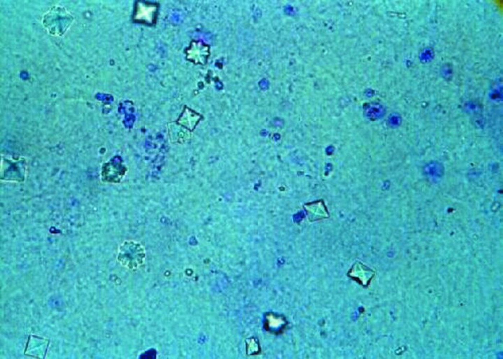

Calcium oxalate crystals in urine

Uric acid crystals

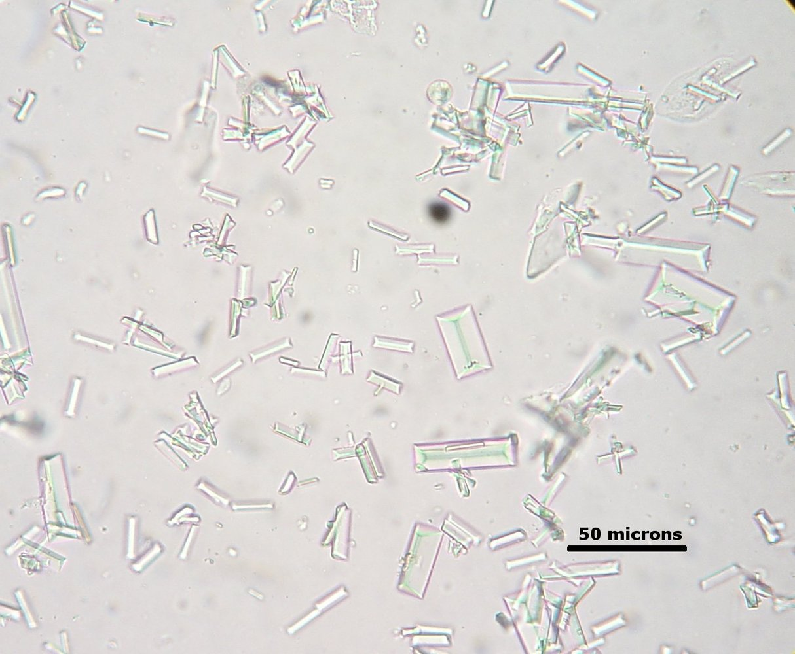

Struvite crystals

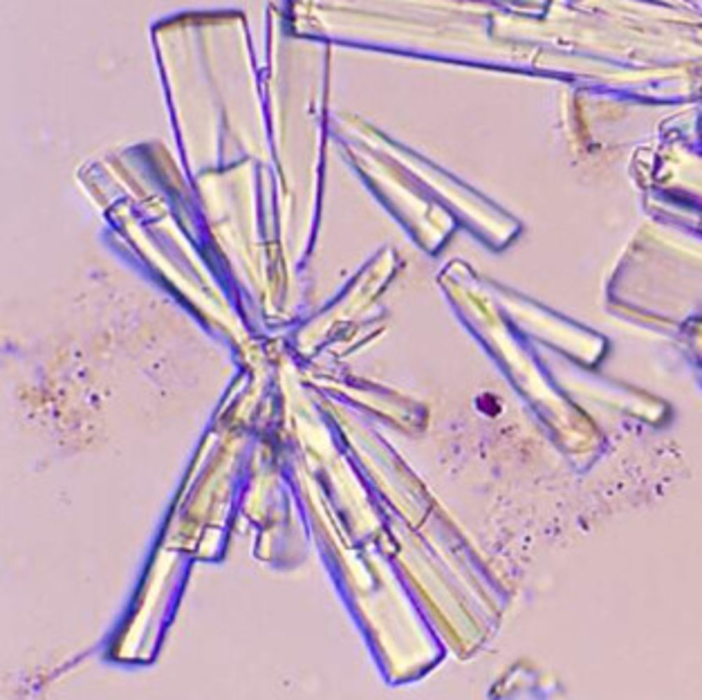

Calcium phosphate crystals

Cystine crystals

### Calcium oxalate stones [[3]](https://coursology-qbank.com/amboss/article/BgYzxo)

* Types

* <u>Calcium</u> oxalate monohydrate (whewellite): brown or black calculi

* <u>Calcium</u> oxalate dihydrate (weddellite): light yellow calculi

* Etiology

* Hypercalciuria: presence of elevated <u>calcium</u> levels in the urine

* Hyperoxaluria: presence of elevated oxalate levels in the urine

* <u>Dehydration</u>

* Increased intake of dietary oxalate

* Increased intestinal absorption of oxalate, e.g., due to <u>fatty acid</u> <u>malabsorption</u> (e.g., <u>Crohn disease</u>, <u>ulcerative colitis</u>, <u>short bowel syndrome</u>)

* <u>Calcium</u> normally binds oxalate to form <u>calcium</u> oxalate, which is excreted via feces.

* In conditions associated with <u>fatty acid</u> <u>malabsorption</u> due to impaired <u>bile acid</u> reabsorption, <u>calcium</u> preferentially binds free <u>fatty acids</u>, leading to excess free oxalate and, therefore, to increased oxalate absorption.

* <u>Vitamin C</u> supplements

* <u>Ethylene glycol poisoning</u> [[4]](https://coursology-qbank.com/amboss/article/3FbS3v)

* <u>Pyridoxine deficiency</u> [[5]](https://coursology-qbank.com/amboss/article/hFbc3v)

* <u>Obesity</u>

* Hypocitraturia: decreased level of <u>citrate</u> in the urine

* Hyperuricosuria: increased urinary excretion of <u>uric acid</u>

* Develop in persistently acidic urine

* Diagnosis

* Urine microscopy: dumbbell-shaped or octahedron-shaped crystals

* <u>X-ray</u> (or CT): <u>radiopaque</u> stones

* Treatment [[6]](https://coursology-qbank.com/amboss/article/Ftbg2v)[[7]](https://coursology-qbank.com/amboss/article/8tbO2v)

* Hydration

* Dietary modification

* Reduced intake of salt (mainly <u>sodium</u>) and animal protein

* Reduced intake of oxalate-rich foods and supplemental <u>vitamin C</u>

* <u>Calcium</u> intake should not be restricted (restriction increases risk of <u>hyperoxaluria</u>, and thereby, the risk for <u>osteoporosis</u>)

* <u>Thiazide diuretics</u> for recurrent <u>calcium</u>-containing stones with <u>idiopathic hypercalciuria</u> (i.e., no <u>hypercalcemia</u>)

* <u>Urine alkalinization</u> (e.g., with <u>potassium</u> <u>citrate</u>)

* Possibly <u>citrate</u> supplementation

> [!NOTE]
> <u>Crohn disease</u> leads to increased oxalate absorption via <u>malabsorption</u> of <u>fatty acids</u>, which can ultimately cause nephrolithiasis.

Calcium oxalate crystals in urine

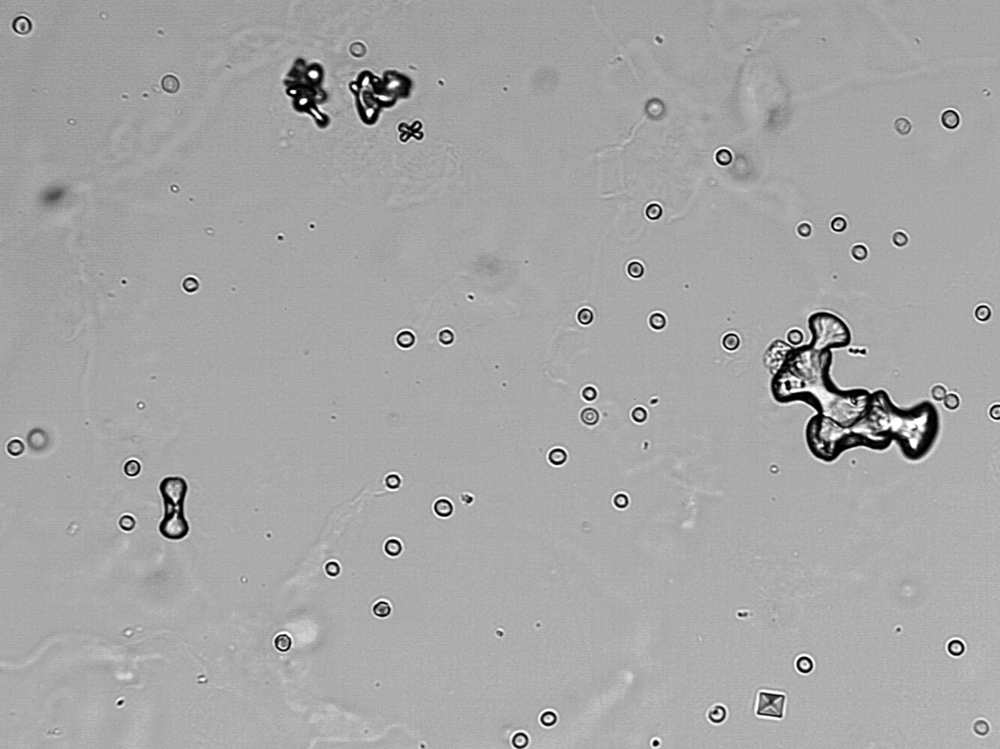

Calcium oxalate crystals

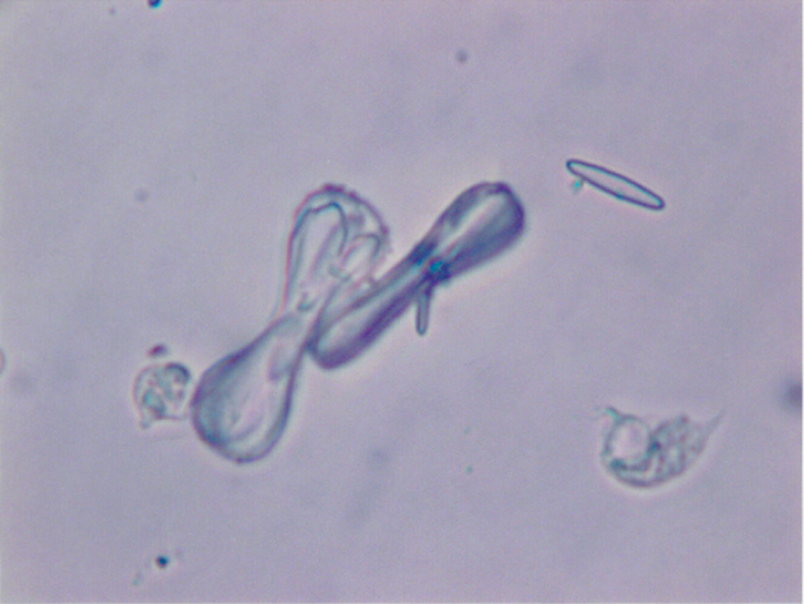

Calcium oxalate crystals in urine

### Uric acid stones

* Etiology

* <u>Hyperuricemia</u> and <u>hyperuricosuria</u>

* <u>Gout</u>

* High cell turnover (e.g., <u>tumor lysis syndrome</u>, <u>myelodysplastic syndrome</u>)

* <u>Diabetes mellitus</u>, <u>metabolic syndrome</u>

* <u>Chronic diarrhea</u>

* ↓ Urine volume; , e.g., due to <u>dehydration</u> (often seen in desert climates)

* Develop in persistently acidic urine [[8]](https://coursology-qbank.com/amboss/article/e-0xwi)

* Diagnosis

* Urine microscopy: rhomboid/needle-shaped crystals

* <u>X-ray</u>: <u>radiolucent</u> stones

* CT: can be visible but are usually only minimally visible (not as visible as <u>calcium</u> stones)

* US and/or <u>intravenous pyelogram</u> may also be helpful in diagnosis

* Treatment

* Hydration

* Oral chemolitholysis (e.g., <u>potassium</u> <u>citrate</u>) via <u>urine alkalinization</u>

* Low-<u>purine</u> diet

* <u>Allopurinol</u>

> [!WARNING]
> <u>Uricosuric agents</u> (e.g., <u>probenecid</u>) increase the excretion of <u>uric acid</u>, which can accelerate the formation of stones.

> [!TIP]
> Uric acid stones are radiolUcent (<u>x-ray</u> negative).

Uric acid crystals

### Struvite stones (<u>magnesium ammonium phosphate stones</u>)

* Etiology

* <u>Upper UTI</u> with <u>urease-producing bacteria</u> such as <u>Proteus mirabilis</u>, <u>Klebsiella</u>, <u>Staphylococcus saprophyticus</u>, and/or <u>Pseudomonas</u>

* These bacteria convert <u>urea</u> to <u>ammonia</u> → elevated <u>ammonia</u> causing alkaline urine → precipitation of the ammonium <u>magnesium</u> <u>phosphate</u> salt → crystal and stone formation

* Can form very large stones that fill the entire <u>renal pelvis</u> and calyces (staghorn calculi)

* Use of indwelling catheter increases risk

* Develop in persistently alkalic urine

* Diagnosis

* Urine microscopy: rectangular prisms (coffin lid-appearance) indicate <u>struvite stones</u>

* <u>X-ray</u> (or CT)

* Weakly <u>radiopaque</u> stones

* Possibly <u>staghorn calculi</u>

* Treatment

* <u>Antibiotic</u> treatment of <u>urinary tract infections</u>

* Hydration

* <u>Urine acidification</u>

* Usually require surgical stone removal

> [!NOTE]
> <u>Urinary tract infections</u> can lead to the formation of <u>struvite stones</u>, but <u>struvite stones</u> also increase the risk of <u>urinary tract infections</u>.

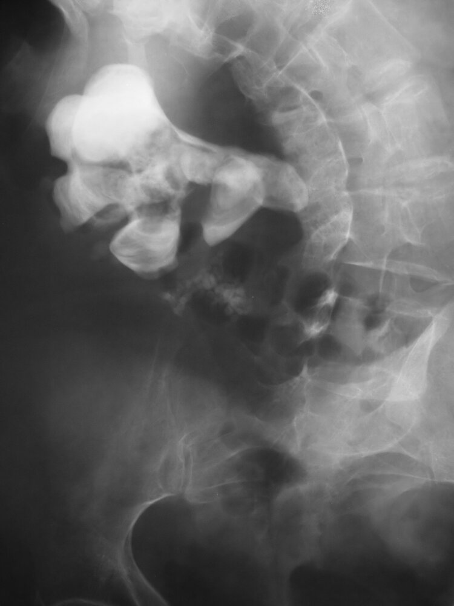

Staghorn calculus

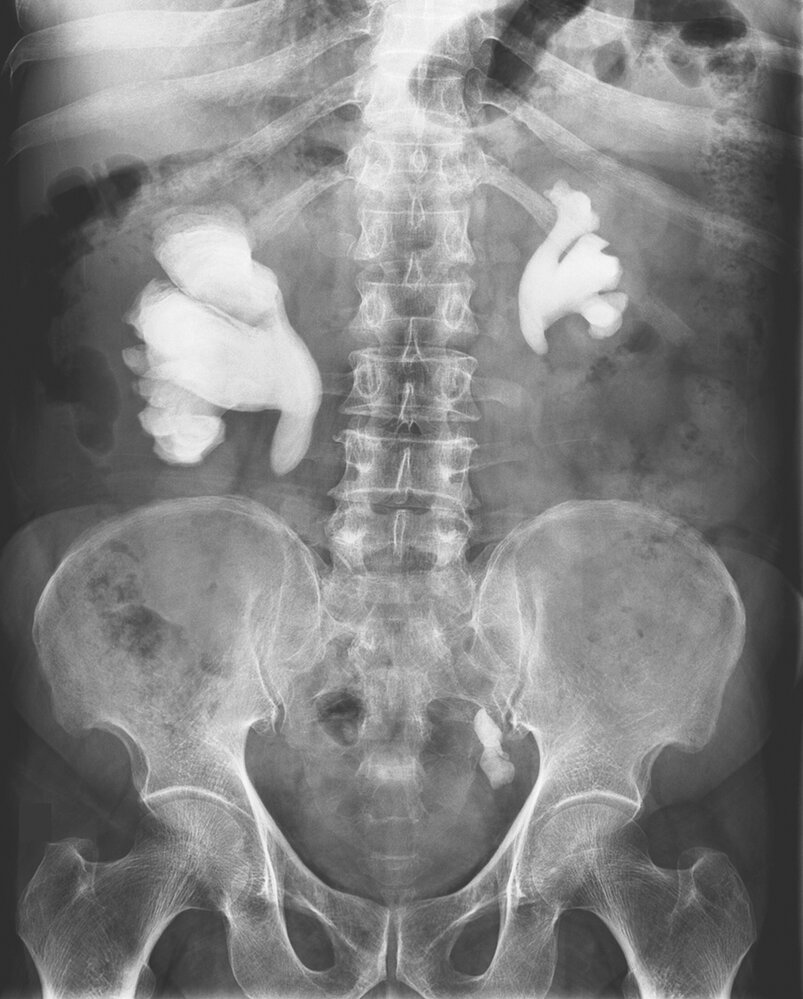

Struvite crystals

### Calcium phosphate stones [[3]](https://coursology-qbank.com/amboss/article/BgYzxo)

* Types

* Carbonate apatite

* Brushite

* Etiology

* <u>Hyperparathyroidism</u> (brushite)

* <u>Type 1 renal tubular acidosis</u> (brushite)

* Upper <u>urinary tract infections</u> (carbonate apatite)

* Develop in persistently alkalic urine

* Diagnosis

* Urine microscopy: wedge-shaped crystals

* <u>X-ray</u> (or CT): <u>radiopaque</u> stones

* Prevention

* Hydration

* <u>Thiazide diuretics</u>

* Diet low in <u>sodium</u>

* <u>Urine acidification</u> (carbon apatite stones)

Calcium phosphate crystals

### Cystine stones [[9]](https://coursology-qbank.com/amboss/article/eAaxiM)

* Etiology

* <u>Autosomal recessive</u> defect in <u>cystine</u>-reabsorbing PCT transporter → impaired <u>proximal</u> renal tubular absorption of dibasic <u>amino acids</u> → <u>cystinuria</u> → <u>cystine stone</u> formation (as <u>cystine</u> is poorly soluble)

* Develop in persistently acidic urine

* Clinical features: recurrent <u>kidney</u> stones (manifesting with e.g., flank <u>pain</u>) starting in childhood

* Diagnosis

* Urine microscopy: hexagonal crystals

* <u>X-ray</u> (or CT)

* Weakly <u>radiopaque</u> stones

* Possibly <u>staghorn calculi</u>

* Positive cyanide nitroprusside test

* Prevention

* Hydration

* Diet low in <u>sodium</u>

* <u>Urine alkalinization</u>

* <u>Chelating agents</u> (e.g., <u>penicillamine</u>) for refractory cases

* <u>Tiopronin</u>

> [!NOTE]
> To remember that <u>cystine</u> crystals are hexagonal, think “The <u>Cystine</u> Chapel has six sides.”

Cystine crystals

### Xanthine stones

* Etiology: xanthinuria

* Hereditary deficiency of <u>xanthine oxidase</u> → failure to convert <u>xanthine</u> to <u>uric acid</u>

* <u>Allopurinol</u>

* Diagnosis

* Urine microscopy: amorphous crystals

* Urine <u>pH</u>: plays little role in diagnosis  [[10]](https://coursology-qbank.com/amboss/article/fubkqv)

* <u>X-ray</u>: <u>radiolucent</u> stones (require further evaluation with CT, US, and/or <u>intravenous pyelogram</u>)

* Treatment: reduced dietary intake of <u>purines</u>

### 2,8-Dihydroxyadenine stones

* Etiology: increased urinary 2,8-dihydroxyadenine concentration due to hereditary deficiency of <u>adenine phosphoribosyltransferase</u>

* Treatment: <u>allopurinol</u> OR <u>febuxostat</u>

### Ammonium urate stones

* Etiology: <u>urinary tract infection</u>, <u>malabsorption</u>, <u>hypokalemia</u>

* Treatment

* <u>Antibiotic</u> treatment of <u>UTI</u> as indicated

* <u>Urine acidification</u>

### Drug-induced stones

Can be caused by:

* Crystallization of drug compounds in the urine, which is most commonly associated with:

* <u>Acyclovir</u>

* <u>Indinavir</u>

* <u>Sulfonamides</u>

* <u>Fluoroquinolones</u>

* <u>Ceftriaxone</u>

* Stone formation due to alterations in urine composition, which are most commonly associated with:

* <u>Acetazolamide</u>

* <u>Furosemide</u>

* <u>Topiramate</u>

* <u>Vitamin D</u>, <u>vitamin A</u>

* Aluminium <u>magnesium hydroxide</u>

* <u>Calcium</u>

---

## Clinical features

Stones usually form in the <u>collecting ducts</u> of the <u>kidneys</u> but may be deposited along the entire urogenital tract from the <u>renal pelvis</u> to the <u>urethra</u>. Their localization and size determine the specific symptoms. Small <u>kidney</u> stones may also be asymptomatic and detected incidentally. [[11]](https://coursology-qbank.com/amboss/article/K70U5h)

* Severe unilateral and colicky flank <u>pain</u> (renal colic) ;  [[12]](https://coursology-qbank.com/amboss/article/jFb_3v)

* Radiates anteriorly to the lower abdomen, groin, labia, <u>testicles</u>, or <u>perineum</u>

* <u>Paroxysmal</u> or progressively worsening  [[13]](https://coursology-qbank.com/amboss/article/QFbu3v)

* The area around the <u>kidneys</u> may be tender on percussion (<u>costovertebral angle tenderness</u>)

* <u>Hematuria</u>

* <u>Nausea</u>, <u>vomiting</u>, and reduced <u>bowel sounds</u>

* <u>Dysuria</u>, frequency, and urgency

* Passage of gravel or a stone

* Patients are usually unable to sit still and move around frequently (opposed to patients with <u>peritonitis</u>, who usually prefer to lie still)

> [!NOTE]
> Depending on the location of the stone, nephrolithiasis may resemble conditions such as <u>appendicitis</u> or <u>testicular torsion</u>.

Percussion of the Kidneys - Clinical Examination

---

## Diagnosis

### Approach [[14]](https://coursology-qbank.com/amboss/article/I70YMh)[[15]](https://coursology-qbank.com/amboss/article/kIYm1q)[[16]](https://coursology-qbank.com/amboss/article/-cXDUC)

* Clinical suspicion: Consider nephrolithiasis in patients with unilateral colicky flank <u>pain</u> associated with <u>nausea</u>, <u>vomiting</u>, and/or <u>hematuria</u>.

* See “<u>Approach to the management of acute abdominal pain</u>” for the general evaluation of patients with flank <u>pain</u>.

* For patients presenting with <u>hematuria</u>, see also “Diagnostics” in “<u>Hematuria</u>.”

* Initial diagnostics

* <u>Laboratory studies</u>: <u>CBC</u>, <u>BMP</u>, <u>urinalysis</u> , <u>β-hCG</u>

* Imaging studies: CT abdomen and <u>pelvis</u> without contrast preferred if imaging is indicated

* Further evaluation

* Determine stone composition.

* Identify metabolic <u>risk factors</u> with a dietary history and <u>laboratory studies</u>.

### <u>Laboratory studies</u> [[14]](https://coursology-qbank.com/amboss/article/I70YMh)[[15]](https://coursology-qbank.com/amboss/article/kIYm1q)

* <u>CBC</u>: ↑ <u>WBC</u> count  [[17]](https://coursology-qbank.com/amboss/article/35YSPp)

* <u>BMP</u>

* Typically within normal limits

* Elevated <u>BUN</u> and <u>creatinine</u> suggest an <u>acute kidney injury</u>.

> [!TIP]
> <u>Laboratory studies</u> are not necessary for the <u>diagnosis of nephrolithiasis</u>, but they may help narrow the differential diagnosis and identify complicating factors (e.g., <u>acute kidney injury</u>, <u>UTI</u>).

### <u>Urinalysis</u> [[15]](https://coursology-qbank.com/amboss/article/kIYm1q)[[17]](https://coursology-qbank.com/amboss/article/35YSPp)

* Nonspecific findings of nephrolithiasis

* Gross or <u>microscopic hematuria</u>

* Crystalluria

* Nonspecific <u>urinalysis findings of UTI</u>, e.g., positive <u>leukocyte esterase</u> or nitrites, <u>leukocyturia</u>, <u>bacteriuria</u>

* Findings suggestive of stone composition

* Alkaline urine (<u>pH</u> > 7.5–8) suggests <u>struvite stones</u> associated with <u>urease-producing organisms</u>. [[18]](https://coursology-qbank.com/amboss/article/4s03Eh)[[19]](https://coursology-qbank.com/amboss/article/qMbCp8)

* Acidic urine (<u>pH</u> < 4.5–5.5) may indicate <u>uric acid stones</u>. [[20]](https://coursology-qbank.com/amboss/article/8a1Om20)

### Imaging studies [[21]](https://coursology-qbank.com/amboss/article/HHcK7d0)[[22]](https://coursology-qbank.com/amboss/article/mVXVEC)[[23]](https://coursology-qbank.com/amboss/article/01Xe2C)

* Recommendations in this section are consistent with the 2015 American College of Radiology (<u>ACR</u>) appropriateness criteria for acute-onset flank <u>pain</u> with suspicion of stone disease. [[21]](https://coursology-qbank.com/amboss/article/HHcK7d0)

* In general, an initial presentation suspicious for nephrolithiasis requires confirmatory CT imaging.

* Imaging is also indicated for acute flank <u>pain</u> of uncertain etiology, e.g., to rule out <u>AAA</u>.

* Routine CT is controversial in adults < 55 years of age with uncomplicated presentations of <u>renal colic</u> , especially those with a history of nephrolithiasis.  [[21]](https://coursology-qbank.com/amboss/article/HHcK7d0)[[24]](https://coursology-qbank.com/amboss/article/yIYd2q)[[25]](https://coursology-qbank.com/amboss/article/cAcaiU0)[[26]](https://coursology-qbank.com/amboss/article/1Ac2iU0)

> [!TIP]
> CT abdomen and <u>pelvis</u> without contrast and <u>ultrasound</u> of the abdomen and <u>pelvis</u> are the preferred diagnostic tests for nephrolithiasis in patients for whom imaging is indicated.

#### CT abdomen and <u>pelvis</u> without IV contrast

CT has the highest <u>accuracy</u> of the imaging modalities to identify <u>kidney</u> stones.

* Type: low-dose, helical (spiral) <u>CT without contrast</u>

* Indication: first-line for nonpregnant patients with suspected nephrolithiasis

* CT findings in nephrolithiasis  [[21]](https://coursology-qbank.com/amboss/article/HHcK7d0)

* Calculus size , location, density , and degree of obstruction

* <u>Hydronephrosis</u> and/or <u>hydroureter</u>

* Perinephric <u>fat stranding</u>

> [!TIP]
> <u>Hydronephrosis</u> and/or <u>hydroureter</u> without calculi may suggest a recently passed <u>kidney</u> stone. [[21]](https://coursology-qbank.com/amboss/article/HHcK7d0)

> [!TIP]
> The addition of IV contrast may help to differentiate ureteral stones from <u>phleboliths</u> and increases the likelihood of detecting alternative causes of abdominal <u>pain</u> (e.g., <u>appendicitis</u>, <u>diverticulitis</u>). However, IV contrast reduces the <u>sensitivity</u> for <u>kidney</u> stones to ∼ 80% compared to > 95% in <u>CT without contrast</u>. [[21]](https://coursology-qbank.com/amboss/article/HHcK7d0)

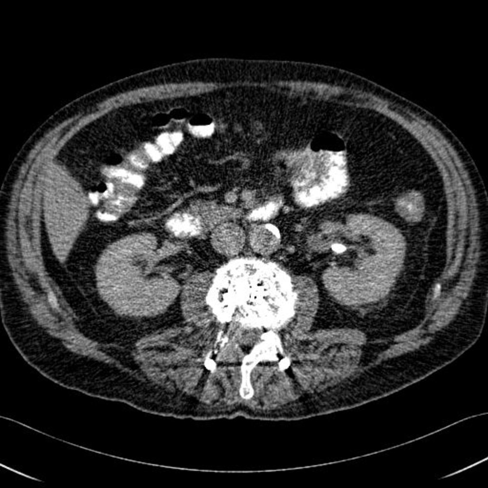

Nonobstructive renal calculus (1/2)

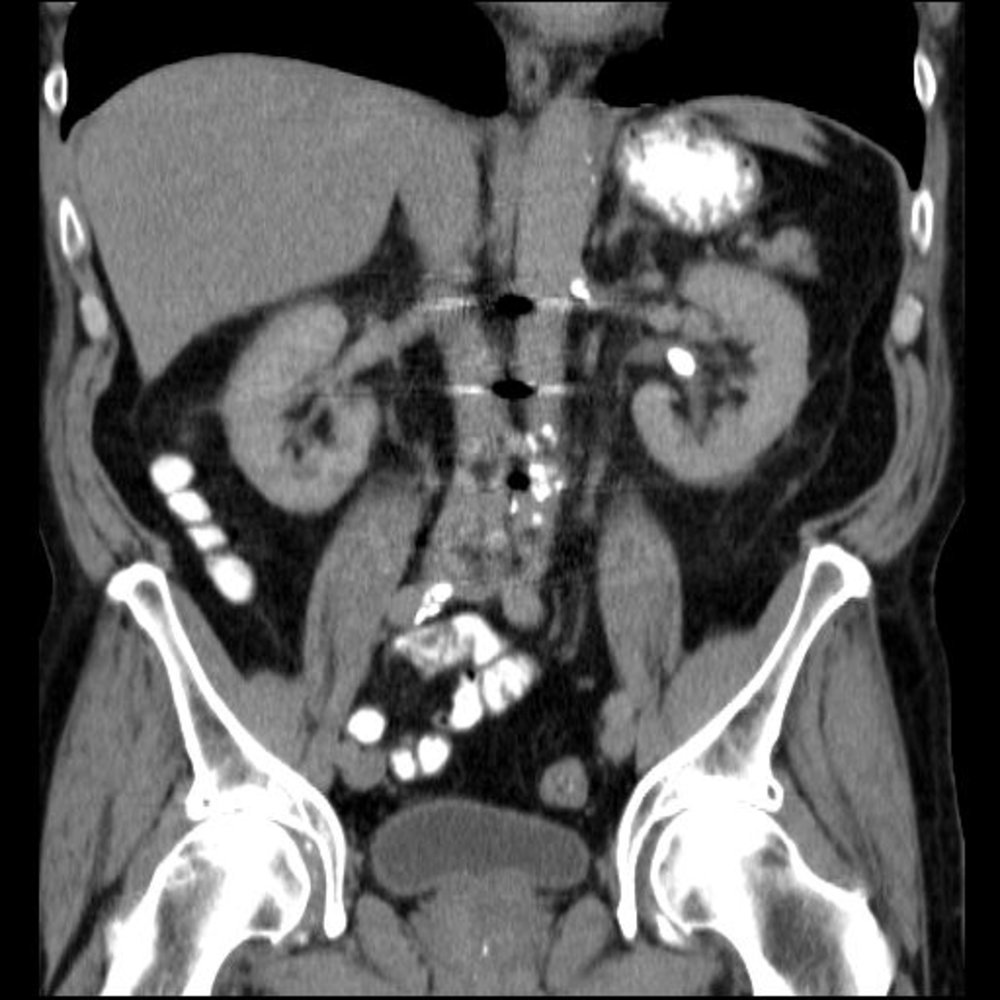

Nonobstructive renal calculus (2/2)

Ureterolithiasis with obstructive uropathy

#### <u>Ultrasound</u> abdomen and <u>pelvis</u>

* Indications: suspected nephrolithiasis in patients for whom radiation exposure should be minimized (e.g., pregnant patients, pediatric patients, those with recurrent stones)

* Findings

* <u>Obstructive uropathy</u> (e.g., <u>hydronephrosis</u>, <u>hydroureter</u>, perinephric fluid)   [[21]](https://coursology-qbank.com/amboss/article/HHcK7d0)

* Stone: <u>hyperechoic</u> signal with <u>acoustic shadowing</u>   [[17]](https://coursology-qbank.com/amboss/article/35YSPp)

* Twinkle artifact: intense multicolored signal behind a stone seen when using color Doppler technique

* Absence of ureteral jet : suggests an obstructing stone

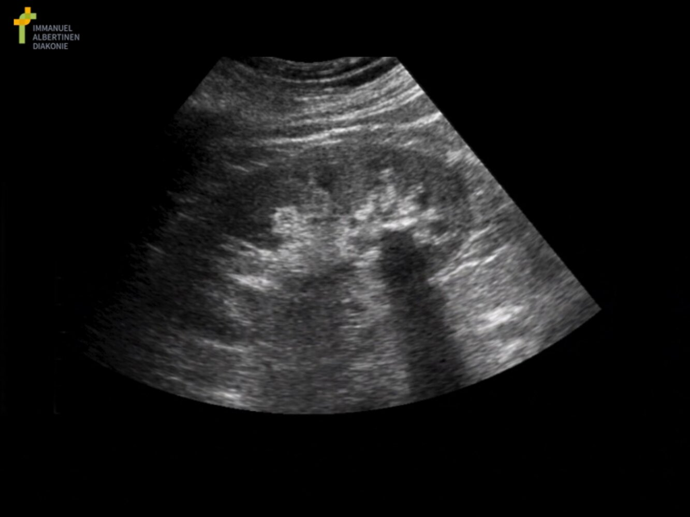

Nephrolithiasis

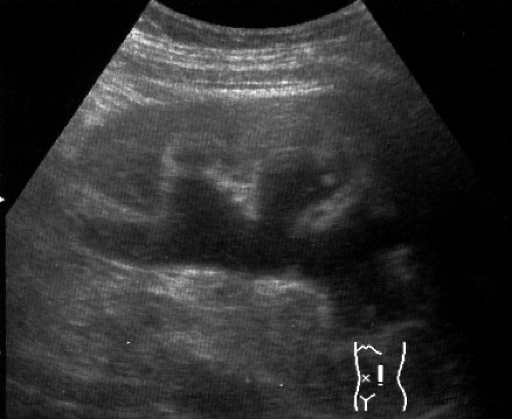

Hydronephrosis

#### <u>X-ray</u> <u>kidney</u>, <u>ureter</u>, and <u>bladder</u> (<u>KUB</u>)

* Indications: follow-up for previously identified <u>radiopaque</u> stones after the initiation of treatment

* Findings: radiographic densities (e.g., stones, <u>phleboliths</u>, vascular calcifications)

> [!NOTE]
> Because <u>KUB</u> <u>sensitivity</u> is proportional to stone size, it is usually only suitable for larger stones.

#### <u>MR urography</u>  [[21]](https://coursology-qbank.com/amboss/article/HHcK7d0)

* Indications

* Suspected nephrolithiasis in patients for whom radiation exposure should be minimized (e.g., pregnant patients)

* High clinical suspicion for nephrolithiasis despite inconclusive or negative CT findings

* Findings: similar to CT

#### <u>Intravenous pyelogram</u> (IVP)

* Indications: rarely indicated given the broad availability of CT

* Findings 

* Provides a complete outline of the <u>urinary tract</u> system

* Size and location of stone, degree of obstruction

Obstructing ureteral calculus

### Metabolic evaluation for nephrolithiasis [[14]](https://coursology-qbank.com/amboss/article/I70YMh)[[16]](https://coursology-qbank.com/amboss/article/-cXDUC)[[27]](https://coursology-qbank.com/amboss/article/jwd_iH0)

For initial episodes of nephrolithiasis, patients should undergo a limited metabolic evaluation to rule out underlying systemic disorders and guide preventative therapy. This workup is typically unnecessary following repeat visits for <u>renal colic</u> where the underlying etiology is already known.

* Dietary history: fluid intake, protein, <u>calcium</u>, <u>sodium</u>, fruits, vegetables, high-oxalate foods, over-the-counter supplements

* <u>Laboratory studies</u>: <u>BMP</u> , serum <u>calcium</u> and phosphorous , serum <u>uric acid</u> , serum <u>magnesium</u>, <u>urinalysis</u>

* Stone composition analysis  [[28]](https://coursology-qbank.com/amboss/article/b1XH2C)

* <u>24-hour urine profile</u> 

* Measures saturation of stone-forming salts and other parameters, such as total volume, <u>pH</u>, and <u>creatinine</u>

* Dietary changes, medical therapies, or additional testing may be recommended based on the results.

> [!TIP]
> Provide patients with a first-time <u>diagnosis of nephrolithiasis</u> with a urine strainer at the time of discharge to collect passed stones for compositional analysis during their follow-up.

---

## Treatment

Recommendations in this section are consistent with the 2016 American Urological Association (<u>AUA</u>) guideline on the surgical management of <u>kidney</u> stones and the 2019 <u>AUA</u> guideline on the medical management of <u>kidney</u> stones. [[14]](https://coursology-qbank.com/amboss/article/I70YMh)[[29]](https://coursology-qbank.com/amboss/article/azcQrU0)

### Approach [[22]](https://coursology-qbank.com/amboss/article/mVXVEC)[[29]](https://coursology-qbank.com/amboss/article/azcQrU0)

* Initiate symptomatic management prior to confirmatory imaging for patients with <u>renal colic</u>.

* Consult urology urgently for interventional treatment in the following cases:

* Uncontrolled symptoms (e.g., intractable <u>pain</u>, inability to tolerate PO)

* Large stones (> 10 mm)

* Infected <u>kidney</u> stones (e.g., <u>signs of sepsis</u> in combination with high-grade obstruction)

* <u>Acute renal failure</u>

* Solitary <u>kidney</u> or <u>kidney transplant</u> with obstruction

* Attempt a trial of <u>conservative management</u> for patients with small (≤ 10 mm), uncomplicated stones.

* Offer <u>medical expulsive therapy</u> in addition to symptomatic treatment.

* Treat concomitant <u>UTI</u>, if present.

* Interventional treatment is indicated if <u>conservative management</u> is unsuccessful after 4–6 weeks.

* Disposition: Most patients with uncomplicated nephrolithiasis can be treated successfully with <u>conservative management</u> during an emergency department visit of a few hours.

* Admit patients requiring urgent urology consult and intervention.

* Ensure outpatient urology follow-up for all patients eligible for discharge (e.g., no indications for urgent urology consult, resolved symptoms, no complications).

* Tailor recurrence prevention measures to the type of stone; see “<u>Prevention of nephrolithiasis</u>.”

> [!NOTE]
> The larger the stone, the less likely it is to pass spontaneously.

> [!WARNING]
> Obstructing nephrolithiasis with suspected infection requires urgent urology consultation and management. [[29]](https://coursology-qbank.com/amboss/article/azcQrU0)

### Symptomatic management [[17]](https://coursology-qbank.com/amboss/article/35YSPp)[[22]](https://coursology-qbank.com/amboss/article/mVXVEC)

* <u>Analgesia</u>

* First-line: <u>NSAIDs</u>, e.g., <u>ketorolac</u> DOSAGE  [[30]](https://coursology-qbank.com/amboss/article/cY1aL20)

* Second-line: <u>opioids</u>, e.g., <u>morphine</u> DOSAGE

* <u>Antiemetics</u>, e.g., <u>ondansetron</u> (<u>off-label</u>) DOSAGE

* <u>Intravenous fluids</u> for <u>dehydration</u>

### <u>Conservative management</u> [[22]](https://coursology-qbank.com/amboss/article/mVXVEC)[[29]](https://coursology-qbank.com/amboss/article/azcQrU0)

* Initiate medical expulsive therapy (<u>MET</u>). 

* First-line: <u>tamsulosin</u> (<u>alpha blocker</u>, <u>off-label</u>) DOSAGE [[29]](https://coursology-qbank.com/amboss/article/azcQrU0)

* Relieves <u>ureter</u> muscle spasms

* Promotes the passage of ureteral stones ≤ 10 mm

* Reduces the need for <u>analgesics</u>

* Alternative: <u>nifedipine</u>;  (<u>calcium-channel blocker</u>, currently not routinely recommended)

* Provide <u>antibiotic</u> treatment if <u>urinalysis</u> indicates a <u>UTI</u>; for specific recommendations, see: 

* “<u>Antibiotic</u> treatment of <u>complicated lower UTI</u>”

* “<u>Empiric antibiotic therapy for complicated pyelonephritis</u>”

### Interventional management [[29]](https://coursology-qbank.com/amboss/article/azcQrU0)

#### Overview

The choice of interventional treatment is based on the size and location of the stone, suspected infection, and <u>shared decision-making</u>.

* Infected stones: <u>ureteral stenting</u> or <u>percutaneous nephrostomy</u> to relieve obstruction; delayed definitive management

* Ureteral stones

* <u>Ureterorenoscopy</u> (<u>URS</u>): first-line for mid- or <u>distal</u> <u>ureter</u> stones

* OR <u>extracorporeal shockwave lithotripsy</u> (<u>ESWL</u>)

* Renal stones > 20 mm OR lower renal pole stones > 10 mm: <u>percutaneous nephrolithotomy</u> (<u>PCNL</u>)

#### Procedures

|  Urological interventions for nephrolithiasis [[29]](https://coursology-qbank.com/amboss/article/azcQrU0)[[31]](https://coursology-qbank.com/amboss/article/0zcerU0)  |  |  |
| --- | --- | --- |
| Intervention | Description | Indications |
| Extracorporeal shock wave lithotripsy (<u>ESWL</u>) |   * Acoustic shockwaves used to fragment stones (noninvasive)  * Stones are localized using <u>fluoroscopy</u> or <u>ultrasound</u>.    |   * Ureteral stones  * Lower renal pole stone ≤ 10 mm  * All other renal stones ≤ 20 mm    |
| Ureterorenoscopy (<u>URS</u>) |   * Transurethral endoscopic visualization of the upper <u>urinary tract</u> with a rigid or <u>flexible endoscope</u> used for stone extraction and intraureteral <u>lithotripsy</u> (minimally invasive)  * Commonly combined with temporary <u>ureteral stenting</u>    |  |
| Percutaneous nephrolithotomy (<u>PCNL</u>) |   * Percutaneous insertion of a nephroscope into the <u>renal pelvis</u> under <u>ultrasonographic</u> and/or <u>fluoroscopic</u> guidance to remove stones (minimally invasive)  * Can be combined with <u>lithotripsy</u>    |   * Lower renal pole stones > 10 mm  * All other renal stones > 20 mm    |
| Ureterolithotomy |   * Open, <u>laparoscopic</u>, or robotic <u>surgery</u> (invasive)  * An <u>incision</u> is made into the <u>ureter</u> and the stone is removed.    |   * Rarely indicated  * Reserved for patients for whom other interventions have been unsuccessful    |

> [!TIP]
> The need for follow-up imaging after conservative or interventional management depends on the symptoms, stone type, and intervention modality.

---

## Complications

* <u>Recurrent urinary tract infections</u> → risk of <u>pyelonephritis</u>, <u>urosepsis</u>, and <u>perinephric abscess</u>

* <u>Urinary obstruction</u> → inflammation of the <u>kidney</u> and <u>hydronephrosis</u>  → permanent <u>glomerular</u> damage if left untreated

* <u>Acute kidney injury</u> [[11]](https://coursology-qbank.com/amboss/article/K70U5h)

We list the most important complications. The selection is not exhaustive.

---

## Prevention

* Hydration: sufficient fluid intake (i.e., to maintain urine output of ≥ 2.5 L/day for adults; > 30 mL/kg/day for children)  [[27]](https://coursology-qbank.com/amboss/article/jwd_iH0)[[32]](https://coursology-qbank.com/amboss/article/7zd48s0)

* Diet [[27]](https://coursology-qbank.com/amboss/article/jwd_iH0)[[32]](https://coursology-qbank.com/amboss/article/7zd48s0)

* For <u>calcium</u> stones [[27]](https://coursology-qbank.com/amboss/article/jwd_iH0)

* Reduce consumption of salt.

* Avoid overconsumption of animal protein.

* Reduce consumption of oxalate-rich foods and supplemental <u>vitamin C</u> (for oxalate stones).  [[33]](https://coursology-qbank.com/amboss/article/_gY5Bo)[[34]](https://coursology-qbank.com/amboss/article/zgYrBo)

* <u>Calcium</u> intake should not be restricted (restriction increases risk of <u>hyperoxaluria</u>, and thereby, the risk for <u>osteoporosis</u>)

* For <u>uric acid stones</u>: low in <u>purine</u>

* For <u>cystine stones</u>: low in <u>sodium</u>

* Pharmacotherapy (<u>chemoprophylaxis</u>) [[35]](https://coursology-qbank.com/amboss/article/xpdE7I0)

* <u>Calcium</u> stones

* <u>Thiazide diuretics</u> for recurrent <u>calcium</u>-containing stones with <u>idiopathic hypercalciuria</u> (i.e., no <u>hypercalcemia</u>)  [[27]](https://coursology-qbank.com/amboss/article/jwd_iH0)[[36]](https://coursology-qbank.com/amboss/article/-gYDBo)

* <u>Allopurinol</u> in the case of high urine <u>uric acid</u>

* <u>Uric acid stones</u>: <u>allopurinol</u>

* <u>Cystine stones</u>: <u>tiopronin</u>, <u>D-penicillamine</u>

* <u>Struvite stones</u>: <u>antibiotic</u> treatment for <u>UTI</u>

* Change urinary <u>pH</u>: depends on stone composition

* Urine alkalinization: a treatment regimen to raise urinary <u>pH</u> to 6.5–7.5

* Achieved via diet rich in fruits and vegetables or supplementation of <u>potassium</u> <u>citrate</u>

* Used to prevent recurrence of <u>calcium</u> oxalate, <u>uric acid</u>, and <u>cystine stones</u>

* Urine acidification: a treatment regimen to lower the urinary <u>pH</u> to ≤ 7

* Achieved via intake of cranberry juice or <u>betaine</u> or a diet rich in dairy products, grains, or meat

* Used to prevent recurrence of <u>calcium</u> <u>phosphate</u> and <u>struvite stones</u>

> [!TIP]
> Low <u>calcium</u> diets increase the risk of <u>calcium</u>-containing stone formation because they increase oxalate reabsorption.

---

## Special patient groups

The approach to nephrolithiasis in pregnant individuals and children is largely similar to that in adults, with a few modifications.

---

## Nephrolithiasis in pregnancy

* <u>Epidemiology</u>: ∼ 1:3000 <u>pregnancies</u> [[37]](https://coursology-qbank.com/amboss/article/4Nc3Y10)[[38]](https://coursology-qbank.com/amboss/article/kNcmY10)

* <u>Risk factors</u>

* ↑ <u>Calcium</u> excretion, ↓ excretion of <u>magnesium</u> and <u>citrate</u>

* ↑ Urine <u>pH</u>

* Urinary stasis due to hormonal changes (e.g., due to increased <u>progesterone</u> levels)

* Late <u>pregnancy</u>: ↓ fluid intake resulting from ↓ <u>bladder</u> capacity due to altered position and increasing size of <u>uterus</u>

* Clinical features: similar to <u>clinical features of nephrolithiasis</u> in nonpregnant adults

* Diagnostics

* Renal <u>ultrasonography</u> is preferred.

* Inconclusive renal <u>ultrasonography</u>: Consider <u>MR urography</u> without IV contrast or <u>low-dose CT</u> without IV contrast.

* Treatment

* Focuses on <u>pain control</u> because the majority of stones pass spontaneously (for details on <u>analgesia</u> during <u>pregnancy</u>, see “<u>Overview of analgesics to avoid during pregnancy</u>”)

* Surgical interventions are similar to those for nonpregnant individuals (see “<u>Conservative management</u>” and “Interventional management” in “Treatment”).

---