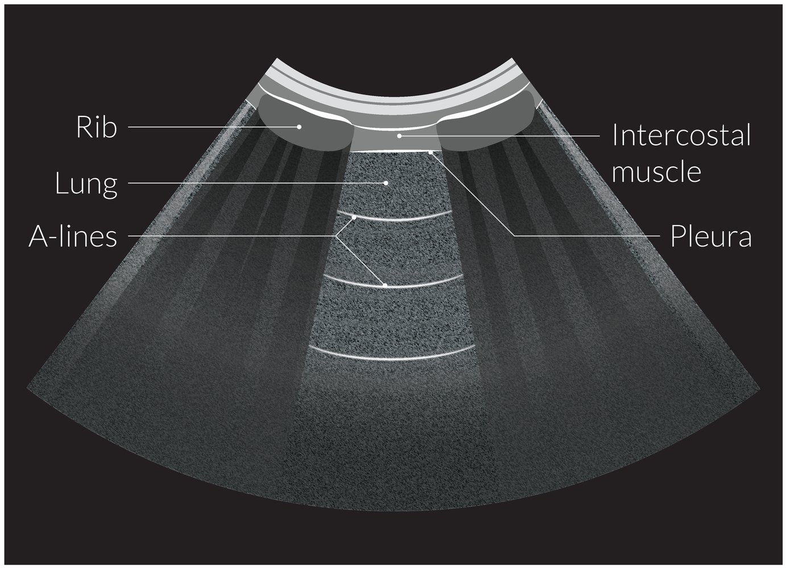
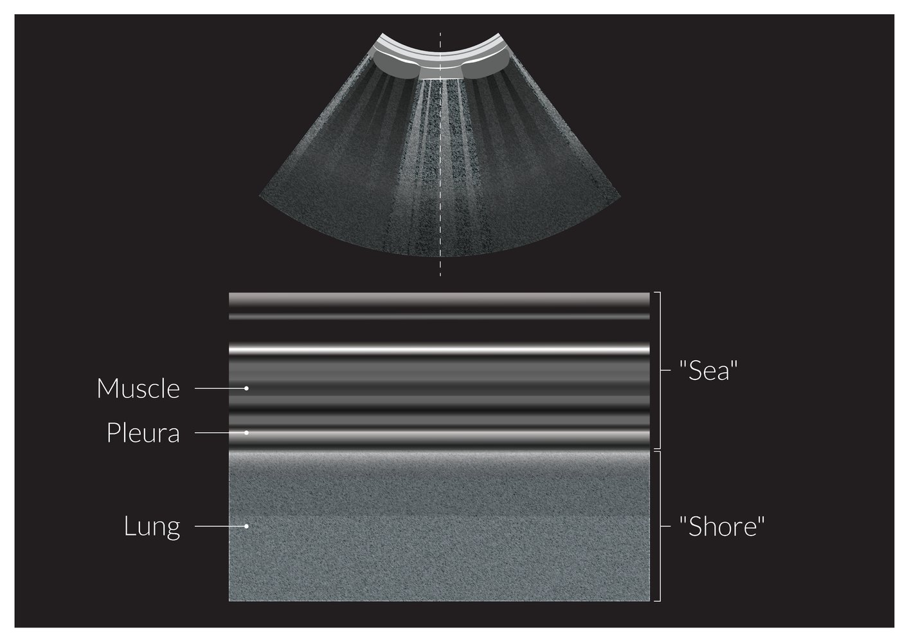

# Dyspnea

*Categories: Clinical knowledge > Emergency medicine > Respiratory disorders > Dyspnea*

[Original Article Link](https://coursology-qbank.com/amboss/article/Xq09CS)

---

## Summary

Dyspnea, or shortness of breath, is a subjective feeling of breathing discomfort. It is a commonly reported symptom in acute care and outpatient settings. <u>Causes of dyspnea</u> include pulmonary (e.g., <u>pneumonia</u>, <u>asthma exacerbation</u>), cardiac (e.g., <u>acute coronary syndrome</u>, <u>congestive heart failure</u>), toxic-metabolic (e.g., <u>metabolic acidosis</u>, medication use), <u>upper airway</u> (e.g., <u>epiglottitis</u>, <u>foreign body aspiration</u>), psychological, and neuromuscular pathologies. On initial presentation, it is important to immediately evaluate the patient for any urgent or <u>life-threatening causes of dyspnea</u> using <u>patient history</u>, <u>physical examination</u>, and diagnostic testing. Once immediately life-threatening causes have been ruled out, a more detailed <u>patient history</u> should be obtained and further testing performed to narrow the differential diagnosis.

See also “<u>Respiratory failure and arrest</u>,” "<u>Respiratory distress and failure in children</u>," "<u>Wheezing</u>," and "<u>Airway obstruction</u>."

---

## Initial management

### Approach [[1]](https://coursology-qbank.com/amboss/article/xjYEc6)[[2]](https://coursology-qbank.com/amboss/article/35YSPp)[[3]](https://coursology-qbank.com/amboss/article/zjcr1c0)

Assume that all dyspnea is life-threatening until proven otherwise and perform the following steps concurrently, not sequentially.

* Perform an <u>ABCDE survey</u> and place the patient in a position of comfort.

* <u>Manage respiratory failure</u> if present, e.g., <u>airway management</u>, <u>oxygen therapy</u> if <u>SpO2</u> < 95%, <u>respiratory support</u> [[2]](https://coursology-qbank.com/amboss/article/35YSPp).

* Begin <u>pulse oximetry</u> and <u>cardiac monitoring</u>; establish <u>IV access</u>.

* Initiate treatment for life-threatening reversible <u>causes of dyspnea</u>.

* Identify and treat the underlying cause.

* Focused history and examination

* Basic diagnostics: initial <u>laboratory studies</u> , <u>CXR</u>, <u>ECG</u>, <u>POCUS</u>

* Advanced diagnostic testing based on initial findings

> [!WARNING]
> Prioritize rapid identification and treatment of <u>critical causes of dyspnea</u> over advanced testing to obtain a definitive diagnosis. [[4]](https://coursology-qbank.com/amboss/article/Nxc-9e0)

> [!WARNING]
> When evaluating a patient with dyspnea, always consider <u>infection control</u> and the need for <u>PPE</u> and patient isolation.

### Red flags in dyspnea

The presence of any of these <u>red flags</u> suggests that dyspnea is the result of a serious pathologic process.

* Symptoms

* Dyspnea at rest

* <u>Chest pain</u>

* <u>Diaphoresis</u>

* Signs

* Pulmonary: low <u>SpO2</u>, <u>cyanosis</u>, <u>stridor</u>, <u>signs of increased work of breathing</u>

* Cardiac: <u>hypotension</u>, distant <u>heart sounds</u>, new <u>murmur</u>, <u>pulsus paradoxus</u>

* Neurological: decreased <u>level of consciousness</u>, <u>agitation</u>, <u>focal neurological deficits</u>

* Laboratory findings

* <u>Hypoxemia</u>

* <u>Respiratory acidosis</u>

> [!WARNING]
> Anticipate rapid clinical deterioration in patients with <u>red flag features</u>.

### Immediately life-threatening causes of dyspnea

See also “<u>Rapidly reversible causes of respiratory failure</u>.”

* <u>Upper airway</u>

* <u>Angioedema</u>

* <u>Anaphylaxis</u>

* <u>Deep neck space infections</u>

* <u>Foreign body aspiration</u>

* Pulmonary

* <u>Pulmonary embolism</u>

* <u>Asthma exacerbation</u> or <u>COPD exacerbation</u>

* <u>Tension pneumothorax</u>

* <u>Diffuse alveolar hemorrhage</u>

* <u>ARDS</u>

* Cardiac

* <u>Acute coronary syndrome</u>

* <u>Acute heart failure</u> or <u>flash pulmonary edema</u>

* <u>Cardiac arrhythmias</u>

* Acute <u>valvular dysfunction</u>

* <u>Cardiac tamponade</u>

* Other

* <u>Stroke</u>

* <u>Diabetic ketoacidosis</u>

> [!WARNING]
> The severity of symptoms reported by the patient may not correlate with disease severity. Remain vigilant for <u>life-threatening causes of dyspnea</u>. [[2]](https://coursology-qbank.com/amboss/article/35YSPp)

---

## Pulmonary causes

|  | Clinical features | Diagnostic findings | Acute management |
| --- | --- | --- | --- |
|  <u>Pneumonia</u> [[10]](https://coursology-qbank.com/amboss/article/lpYvpJ)  |   * <u>Fever</u>, chills  * <u>Cough</u>, dyspnea  * <u>Hypoxemia</u>  * <u>Crackles</u>, <u>egophony</u>    |   * Labs: <u>leukocytosis</u>, ↑ <u>ESR</u>/<u>CRP</u>, ↑ <u>procalcitonin</u>  * Positive <u>sputum</u> culture  * <u>CXR</u>: consolidation, <u>pleural effusion</u>  * CT chest with IV contrast: <u>hyperdense</u> consolidation    |  * See “<u>Acute management checklist for pneumonia</u>.”   |
|  <u>COPD exacerbation</u> (<u>AECOPD</u>) [[11]](https://coursology-qbank.com/amboss/article/PpYWpJ)[[12]](https://coursology-qbank.com/amboss/article/4pY3pJ)  |   * Dyspnea, <u>cough</u>, <u>purulent</u> <u>sputum</u>  * <u>Tachypnea</u>, <u>hypoxemia</u>  * Diffuse <u>wheezing</u>, decreased breath sounds  * <u>Increased work of breathing</u>  * <u>Signs of imminent respiratory arrest</u>: confusion, absent breath sounds, <u>bradycardia</u>    |   * <u>ABG</u>: ↓ <u>pH</u>, ↑ <u>PaCO2</u>, ↓ <u>PaO2</u> (<u>respiratory acidosis</u>)  * <u>CXR</u>: hyperinflated <u>lungs</u>; <u>signs of pneumonia</u>, <u>pneumothorax</u>, and/or <u>pleural effusion</u> may be present  * <u>POCUS</u>: <u>A-lines</u>  [[6]](https://coursology-qbank.com/amboss/article/lxcv9e0)    |  * See “<u>Acute management checklist for AECOPD</u>.”   |
|  <u>Asthma exacerbation</u> [[13]](https://coursology-qbank.com/amboss/article/QpYu6J)  |   * Dyspnea, <u>cough</u>  * <u>Tachycardia</u>  * <u>Tachypnea</u>, <u>hypoxemia</u>  * Diffuse <u>wheezing</u>, decreased or absent breath sounds  * <u>Signs of increased work of breathing</u>    |   * <u>ABG</u>  * Moderate disease: ↑ <u>pH</u>, ↓ <u>PaCO2</u>, ↓ or normal <u>PaO2</u> (<u>respiratory alkalosis</u>)  * Severe disease: ↓ <u>pH</u>, ↑ <u>PaCO2</u>, ↓ <u>PaO2</u> (<u>respiratory acidosis</u>)  [[14]](https://coursology-qbank.com/amboss/article/Qh1udg0)  * <u>Peak expiratory flow</u>: ↓ compared to predicted or personal best  * <u>POCUS</u>: <u>A-lines</u>  [[6]](https://coursology-qbank.com/amboss/article/lxcv9e0)    |  * See “<u>Acute management checklist for asthma exacerbation</u>.”   |
|  <u>Tension pneumothorax</u> [[15]](https://coursology-qbank.com/amboss/article/76Y4mJ)[[16]](https://coursology-qbank.com/amboss/article/MDYMUr)  |   * Severe, sharp <u>chest pain</u>  * Dyspnea, <u>hypoxemia</u>  * History of trauma  * <u>Hyperresonance</u>, decreased breath sounds, <u>tracheal deviation</u>  * <u>Tachycardia</u>, <u>hypotension</u>    |   * <u>Clinical diagnosis</u>  * <u>CXR</u>: absent <u>lung markings</u>, <u>tracheal deviation</u>, <u>pneumomediastinum</u>    |  * See “<u>Acute management checklist for tension pneumothorax</u>.”   |
|  <u>Spontaneous pneumothorax</u> [[15]](https://coursology-qbank.com/amboss/article/76Y4mJ)[[17]](https://coursology-qbank.com/amboss/article/r6YfmJ)[[18]](https://coursology-qbank.com/amboss/article/-FYDkI)  |   * Sudden, sharp unilateral <u>chest pain</u>  * Acute dyspnea  * <u>Hypoxemia</u>  * <u>Hyperresonance</u>, decreased breath sounds on affected side  * <u>Crepitus</u>  * History of <u>lung</u> disease or trauma    |   * <u>CXR</u> (in inspiration): increased lucency, displaced <u>lung markings</u>, <u>subcutaneous emphysema</u>  * <u>POCUS</u>: absent <u>lung sliding</u>, absent <u>seashore sign</u>    |  * See “<u>Acute management checklist for spontaneous pneumothorax</u>.”   |
|  <u>Pulmonary embolism</u>  [[19]](https://coursology-qbank.com/amboss/article/_KY5QJ)  |   * <u>Pleuritic chest pain</u>  * Acute onset dyspnea, <u>hypoxemia</u>  * <u>Cough</u>, <u>hemoptysis</u>  * Unilateral leg swelling or history of <u>DVT</u>  * <u>Hypotension</u>, <u>shock</u> (if <u>massive PE</u>)    |   * <u>Wells criteria for pulmonary embolism</u>  * Elevated <u>D-dimer</u>  * ↑ <u>Troponin</u>, <u>BNP</u>  * <u>ECG</u>: normal <u>sinus rhythm</u> (most common), <u>sinus tachycardia</u>, signs of <u>right ventricular</u> strain  * <u>CTA</u> chest: <u>pulmonary artery</u> filling defect  * <u>V/Q scan</u>: <u>perfusion</u>-ventilation mismatch  * <u>TTE</u>: <u>right ventricle</u> hypokinesis with normal apical movement    |  * See “<u>Acute management checklist for pulmonary embolism</u>.”   |
|  <u>Fat embolism</u> [[20]](https://coursology-qbank.com/amboss/article/VhaG14)  |   * Triad of <u>hypoxia</u>, neurological abnormalities, and <u>petechiae</u>  * Associated with orthopedic trauma, e.g., <u>long bone</u> <u>fractures</u>    |   * <u>Thrombocytopenia</u>  * Fat droplets in urine or <u>sputum</u>  * <u>CXR</u>: often normal; may show patchy bilateral infiltrates  * CT chest: <u>ground-glass opacities</u>, <u>pulmonary consolidation</u> [[21]](https://coursology-qbank.com/amboss/article/ZK1ZU30)    |   * <u>Supportive care in the ICU</u>  * <u>Management of ARDS</u>    |
|  <u>Acute chest syndrome</u> [[22]](https://coursology-qbank.com/amboss/article/DuY1tI)[[23]](https://coursology-qbank.com/amboss/article/wuYhtI)  |   * <u>Chest pain</u>  * <u>Fever</u>  * <u>Cough</u>, shortness of breath, <u>wheezing</u>  * Signs of <u>vaso-occlusive crisis</u>  * <u>Rib</u> or sternal <u>pain</u>    |   * <u>Clinical diagnosis</u> (see <u>diagnostic criteria for acute chest syndrome</u>)  * ↓ <u>Hb</u>, <u>leukocytosis</u>  * <u>CXR</u>: new pulmonary infiltrate    |  * See “<u>Acute management checklist for acute chest syndrome</u>.”   |
|  <u>ARDS</u> [[24]](https://coursology-qbank.com/amboss/article/2O0T7T)[[25]](https://coursology-qbank.com/amboss/article/dEYouI)  |   * Acute <u>hypoxemic respiratory failure</u> (within 1 week of inciting event )  * Diffuse, bilateral <u>crackles</u>    |   * <u>ABG</u>: ↓ <u>PaO2</u>, ↑ <u>A-a gradient</u>, <u>P/F ratio</u> < 300 mm Hg  * <u>CXR</u>: bilateral patchy diffuse or homogeneous <u>lung</u> infiltrates  * <u>TTE</u>: normal systolic function    |  * See “<u>Acute management checklist for ARDS</u>.”   |

Lobar consolidation

A-lines on lung ultrasound

Illustration of seashore sign on lung ultrasound

Acute and chronic pulmonary emboli

---

## Cardiac causes

|  | Clinical features | Diagnostic findings | Acute management |
| --- | --- | --- | --- |
|  <u>Acute coronary syndrome</u> [[26]](https://coursology-qbank.com/amboss/article/OnYItp)[[27]](https://coursology-qbank.com/amboss/article/tbYXvn)  |   * Heavy, dull, pressure/squeezing sensation  * Substernal <u>pain</u> with radiation to left shoulder  * <u>Nausea</u>, <u>vomiting</u>  * <u>Diaphoresis</u>, <u>anxiety</u>  * <u>Dizziness</u>, <u>lightheadedness</u>, <u>syncope</u>  * <u>Pain</u> may improve with <u>nitroglycerin</u>.    |   * <u>ECG</u>: nonspecific changes, <u>ST-segment</u> elevation/<u>depression</u>, <u>T-wave</u> inversions, <u>Q waves</u>  * Increased or normal <u>troponin</u>  * <u>TTE</u>: hypokinesis, regional wall motion abnormalities    |  * See “<u>Acute management checklist for STEMI</u>” and “<u>Acute management checklist for NSTEMI/UA</u>.”   |
|  <u>Cardiac tamponade</u> [[28]](https://coursology-qbank.com/amboss/article/H6YKmJ)  |   * <u>Tachypnea</u>, dyspnea  * <u>Tachycardia</u>  * <u>Pulsus paradoxus</u>  * <u>Cardiogenic shock</u>  * <u>Beck triad</u>    |   * <u>ECG</u>: low <u>voltage</u>, <u>electrical alternans</u>  * <u>CXR</u>: enlarged <u>cardiac silhouette</u>  * <u>TTE</u>: circumferential fluid layer, collapsible chambers , high EF, dilated <u>IVC</u>  * Inspiration: Both ventricular and atrial septa move sharply to the left.  * Expiration: Both ventricular and atrial septa move sharply to the right.    |  * See “<u>Acute management checklist for cardiac tamponade</u>.”   |
|  <u>Heart failure exacerbation</u> [[29]](https://coursology-qbank.com/amboss/article/SpYyKJ)[[30]](https://coursology-qbank.com/amboss/article/3pYS6J)[[31]](https://coursology-qbank.com/amboss/article/RpYl6J)[[32]](https://coursology-qbank.com/amboss/article/ipYJ6J)  |   * Chest pressure  * <u>Cough</u>, dyspnea  * <u>Hypoxemia</u>  * <u>Crackles</u>, <u>JVD</u>, <u>peripheral edema</u>  * Chronic <u>exertional dyspnea</u> and <u>paroxysmal nocturnal dyspnea</u>    |   * <u>Clinical diagnosis</u>  * Labs: ↑ <u>BNP</u>, ↑ <u>troponin</u>, <u>hyponatremia</u>  * <u>CXR</u>: diffuse opacities, <u>Kerley B lines</u>  * <u>TTE</u>: <u>global</u> or focal wall abnormalities, systolic and/or <u>diastolic dysfunction</u>, decreased <u>LVEF</u>  * <u>POCUS</u>: multiple <u>B-lines</u>  [[6]](https://coursology-qbank.com/amboss/article/lxcv9e0)    |  * See “<u>Acute management checklist for heart failure exacerbation</u>.”   |
|  <u>Hypertrophic cardiomyopathy</u> [[33]](https://coursology-qbank.com/amboss/article/puYLHI)[[34]](https://coursology-qbank.com/amboss/article/FuYgGI)  |   * <u>Signs of heart failure</u>  * <u>Angina</u>  * <u>Presyncope</u> or <u>syncope</u>  * <u>Arrhythmias</u>    |   * <u>ECG signs of LVH</u>  * <u>TTE</u>: asymmetrically thickened LV wall, LV outflow obstruction    |  * See “<u>Treatment of hypertrophic cardiomyopathy</u>.”   |
|  <u>Atrial fibrillation with RVR</u> [[35]](https://coursology-qbank.com/amboss/article/_8Y56I)[[36]](https://coursology-qbank.com/amboss/article/luYvrI)  |   * Dyspnea  * <u>Palpitations</u>  * <u>Dizziness</u>  * <u>Hypotension</u>, <u>syncope</u>    |   * <u>ECG</u>: <u>irregularly irregular rhythm</u>, absent <u>P waves</u>  * <u>CXR</u>: <u>pulmonary edema</u>, <u>left atrial enlargement</u>    |  * See “<u>Acute management checklist for atrial fibrillation with RVR</u>.”   |
|  Acute <u>mitral regurgitation</u> [[37]](https://coursology-qbank.com/amboss/article/suYtsI)  |   * <u>Tachycardia</u>, <u>hypotension</u>, <u>cardiogenic shock</u>  * <u>Tachypnea</u>, dyspnea  * <u>Weakness</u>, <u>dizziness</u>, <u>altered mental state</u>  * Faint systolic decrescendo <u>murmur</u>    |   * <u>ECG</u>: <u>tachycardia</u>, nonspecific ST-wave and <u>T-wave</u> changes; in some cases, signs of <u>ischemia</u>  * <u>CXR</u>: <u>pulmonary edema</u>  * <u>TTE</u>: <u>mitral regurgitation</u>, normal <u>left ventricular</u> size , <u>ejection fraction</u> intact, signs of the underlying pathology (e.g., chordal rupture)    |  * See “<u>Acute management checklist for acute mitral regurgitation</u>.”   |

Acute inferior ST-segment elevation myocardial infarction (STEMI)

Acute anterior ST-elevation myocardial infarction (STEMI)

Electrical alternans

Illustration of B-lines on lung ultrasound

---