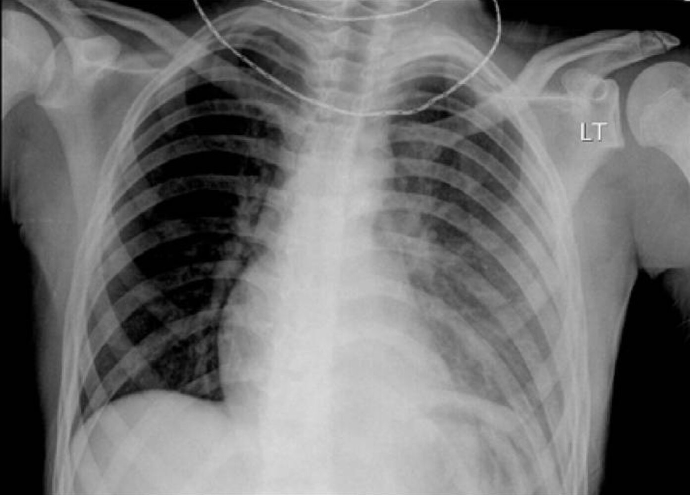
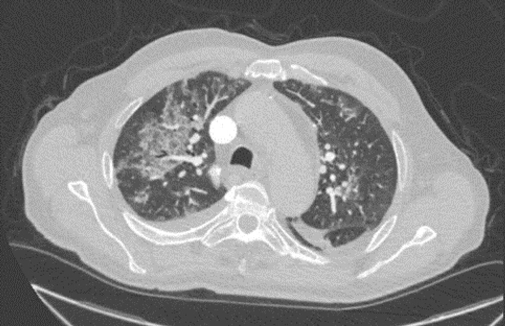
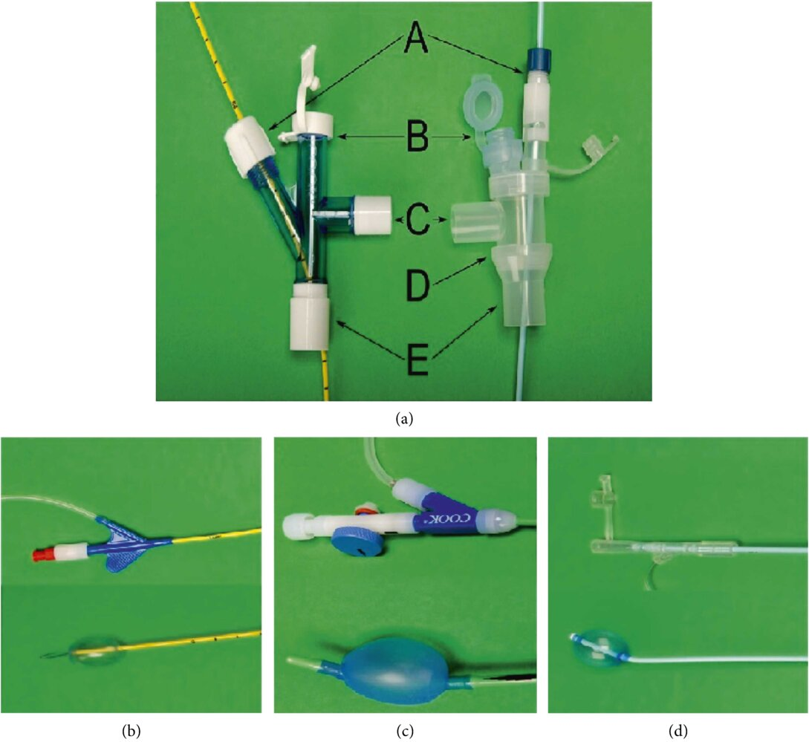

# Hemoptysis

*Categories: Clinical knowledge > Emergency medicine > Respiratory disorders > Hemoptysis*

[Original Article Link](https://coursology-qbank.com/amboss/article/yr0dPh)

---

## Summary

Hemoptysis is the expectoration of blood from the <u>lower respiratory tract</u>. It most commonly occurs as a result of a pulmonary infection; <u>tuberculosis</u> is the leading <u>cause of hemoptysis</u> worldwide. While <u>lung cancer</u> is the second most frequent <u>cause of hemoptysis</u>, bleeding from the respiratory tract only occurs in a minority of these patients. Typically, management of hemoptysis begins with the identification of the bleeding site using imaging or <u>bronchoscopy</u>. Definitive diagnostic evaluation is then guided by the location and appearance of the hemorrhagic site, patient symptoms, and patient <u>risk factors</u> for <u>lung cancer</u>. Treatment is directed at the underlying cause. Oral or inhaled <u>tranexamic acid</u> may be used for symptomatic relief. A minority of patients may present with <u>massive hemoptysis</u>, which can be life-threatening if not controlled emergently. In these patients, management begins with <u>securing the airway</u> and protecting the functioning <u>lung</u>. Bedside <u>bronchoscopy</u> and/or <u>bronchial artery embolization</u> are then used to control the hemorrhage. Definitive diagnosis and treatment follow respiratory and hemodynamic stabilization.

---

## Definition

* Hemoptysis: expectoration of blood from the <u>lower respiratory tract</u>

* Diffuse alveolar hemorrhage (<u>DAH</u>): hemorrhage arising from the pulmonary <u>microcirculation</u> (e.g., alveolar <u>capillaries</u>, <u>arterioles</u>, and/or <u>venules</u>) that manifests clinically with <u>hypoxemia</u>, alveolar infiltrates on imaging, and possible hemoptysis.  [[2]](https://coursology-qbank.com/amboss/article/l9cvne0)[[3]](https://coursology-qbank.com/amboss/article/N9c-ne0)[[4]](https://coursology-qbank.com/amboss/article/m9cVLe0)[[5]](https://coursology-qbank.com/amboss/article/59ciLe0)

---

## Etiology

### Source of bleeding [[3]](https://coursology-qbank.com/amboss/article/N9c-ne0)[[8]](https://coursology-qbank.com/amboss/article/1cc2YY0)[[9]](https://coursology-qbank.com/amboss/article/VccGYY0)[[10]](https://coursology-qbank.com/amboss/article/IccYdY0)

* <u>Bronchial arteries</u> (90% of cases)

* <u>Pulmonary arteries</u> (5% of cases)

* Systemic <u>arteries</u> (5% of cases)

* <u>Diffuse alveolar hemorrhage</u> (0.2% of cases) [[3]](https://coursology-qbank.com/amboss/article/N9c-ne0)

### Overview of common etiologies

|  Etiology of hemoptysis [[6]](https://coursology-qbank.com/amboss/article/bccHaY0)[[11]](https://coursology-qbank.com/amboss/article/Xcc9aY0)[[12]](https://coursology-qbank.com/amboss/article/cccaYY0)  |  |
| --- | --- |
|  | Disease |
| Pulmonary |   * Infection (most common cause)  * Acute viral or bacterial  * <u>Tuberculosis</u>   [[12]](https://coursology-qbank.com/amboss/article/cccaYY0)  * <u>Aspergillosis</u>  * <u>Neoplasm</u>, e.g., <u>bronchogenic carcinoma</u> (second most common cause)  [[8]](https://coursology-qbank.com/amboss/article/1cc2YY0)[[13]](https://coursology-qbank.com/amboss/article/fcckbY0)  * <u>Bronchiectasis</u>  * <u>Cystic fibrosis</u>  * <u>Lupus</u> <u>pneumonitis</u> due to <u>systemic lupus erythematosus</u> [[14]](https://coursology-qbank.com/amboss/article/sdctrY0)    |
| Cardiac |   * <u>Congestive heart failure</u>  * <u>Mitral stenosis</u>  * <u>Pulmonary hypertension</u>    |
| Vascular |   * <u>Pulmonary embolism</u>  * <u>Vasculitis</u>  * <u>Granulomatosis with polyangiitis</u>  * <u>Goodpasture syndrome</u>  * <u>Behcet disease</u>  * Vascular <u>malformation</u> (e.g., <u>pulmonary artery</u> <u>aneurysm</u>, <u>arteriovenous malformations</u>)  * Pulmonary vascular <u>fistula</u>  * Tracheoinnominate <u>artery</u> <u>fistula</u>  * <u>Pulmonary artery</u> rupture  * <u>Hereditary hemorrhagic telangiectasia</u>    |
| Hematologic |   * <u>Coagulopathy</u>  * <u>Anticoagulant</u> use  * <u>Thrombocytopenia</u>    |
| Trauma |   * <u>Lung contusion</u>  * <u>Airway</u> trauma  * Foreign body    |
| <u>Iatrogenic</u> |  * Injury to structures during:  * <u>Lung</u> <u>biopsy</u>  * <u>Right heart catheterization</u>  * <u>Pulmonary artery catheterization</u>  * <u>Airway</u> <u>stenting</u>   |
| Other |   * Thoracic <u>endometriosis</u> (catamenial hemoptysis)  * <u>Idiopathic pulmonary hemosiderosis</u>  * Cryptogenic: no identified cause on CT or <u>bronchoscopy</u> (50% of cases in high-income countries)  [[12]](https://coursology-qbank.com/amboss/article/cccaYY0)    |

> [!TIP]
> <u>Diffuse alveolar hemorrhage</u> is most commonly a result of immune-mediated <u>vasculitis</u> or <u>connective tissue disease</u>. Other causes include <u>congestive heart failure</u>, infection, <u>coagulopathy</u>, and trauma. [[2]](https://coursology-qbank.com/amboss/article/l9cvne0)

---

## Management

### Approach [[8]](https://coursology-qbank.com/amboss/article/1cc2YY0)[[9]](https://coursology-qbank.com/amboss/article/VccGYY0)

See detailed further management of ”<u>Nonmassive hemoptysis</u>” and ”<u>Massive and/or life-threatening hemoptysis</u>” in their dedicated sections.

* All patients: Initially assume that even a small volume of hemoptysis is life-threatening until proven otherwise.

* Perform an <u>ABCDE survey</u>, while clinically <u>distinguishing hemoptysis from pseudohemoptysis</u>.

* Obtain portable <u>CXR</u> and other <u>initial studies for hemoptysis</u>.

* Determine the severity of the hemoptysis (see “Severity assessment”).

* Identify and treat the underlying cause.

* <u>Massive and/or life-threatening hemoptysis</u>

* Begin acute stabilization and urgently consult pulmonology or thoracic <u>surgery</u>.

* Localize bleeding based on stability.

* Persistently unstable patients: Proceed directly to <u>bronchoscopy</u> and <u>bronchoscopic hemostasis</u>.

* Stabilized patients: Obtain CT chest and consider subsequent <u>bronchoscopy</u>.

* Evaluate for definitive therapy: e.g., <u>bronchial artery embolization</u> (<u>BAE</u>) or <u>surgery</u>.

* <u>Nonmassive hemoptysis</u>

* <u>Manage conservatively</u>.

* Obtain further diagnostics as directed by clinical suspicion, initial <u>CXR</u>, and patient <u>risk factors</u>.

> [!WARNING]
> In cases of <u>massive hemoptysis</u>, stabilize the patient before obtaining further diagnostic studies.

> [!TIP]
> Management priorities are resuscitation, protecting the nondiseased <u>lung</u>, and establishing respiratory and hemodynamic stability. Fatal <u>hypoxia</u> due to impaired <u>gas exchange</u> typically occurs before a hemodynamic change resulting from blood loss. [[8]](https://coursology-qbank.com/amboss/article/1cc2YY0)[[15]](https://coursology-qbank.com/amboss/article/Tcc6bY0)

### Severity assessment [[8]](https://coursology-qbank.com/amboss/article/1cc2YY0)

* Estimate volume and speed of blood loss: See “<u>Massive hemoptysis</u>” and “<u>Nonmassive hemoptysis</u>.”

* Evaluate the effect of hemoptysis on <u>airway</u> patency, <u>gas exchange</u>, and <u>hemodynamics</u>: See “<u>Life-threatening hemoptysis</u>” and “<u>Nonmassive hemoptysis</u>.”

* Identify any <u>red flags for hemoptysis</u>.

> [!WARNING]
> <u>Nonmassive hemoptysis</u> requires respiratory and hemodynamic stability, a low volume and speed of blood loss, and no <u>red flags for hemoptysis</u>. Assume all other types of hemoptysis to be potentially life-threatening or have a high risk of progression to <u>massive hemoptysis</u>.

#### Red flags for hemoptysis [[16]](https://coursology-qbank.com/amboss/article/rccfdY0)

The presence of any <u>red flag</u> feature is associated with an increased risk of mortality and the potential for rapid patient deterioration. [[16]](https://coursology-qbank.com/amboss/article/rccfdY0)

* Need for <u>mechanical ventilation</u> on admission

* History of:

* Cancer

* Pulmonary <u>aspergillosis</u>

* Chronic <u>alcohol use disorder</u>

* <u>Pulmonary artery</u> involvement

* <u>CXR</u> findings show involvement of more than one quadrant.

> [!WARNING]
> Hemoptysis due to <u>diffuse alveolar hemorrhage</u> is frequently severe and life-threatening. [[2]](https://coursology-qbank.com/amboss/article/l9cvne0)

### Disposition

* Admit all patients with <u>massive hemoptysis and life-threatening hemoptysis</u> to hospital.

* Select patients with <u>nonmassive hemoptysis</u> may be managed as outpatients after initial workup and observation.

* Consider <u>ICU</u> admission for patients with any of the following: [[6]](https://coursology-qbank.com/amboss/article/bccHaY0)

* High-risk lesions (e.g., <u>aspergilloma</u>, <u>pulmonary artery</u> involvement)

* Evidence of respiratory compromise

* Evidence of hemodynamic compromise

* Chronic cardiac or pulmonary disease

* Need for continuing anticoagulation

---

## Diagnosis

### Approach

* Perform initial studies, including <u>CXR</u> and basic <u>laboratory studies</u>.

* Locate the site of bleeding.

* <u>Massive hemoptysis</u>

* Unstable patients: Proceed directly to <u>bronchoscopy</u> (accurately determines the site of bleeding and allows for hemostatic treatment).

* Stable patients: Obtain CT chest with or without subsequent <u>bronchoscopy</u>.

* <u>Nonmassive hemoptysis</u>: Initial <u>CXR</u> findings direct further studies

* Continue with further investigations for the underlying cause once the patient is clinically stable.

### Initial studies for hemoptysis

* Imaging

* <u>CXR</u> (PA and <u>lateral</u>): preferred initial study [[15]](https://coursology-qbank.com/amboss/article/Tcc6bY0)[[17]](https://coursology-qbank.com/amboss/article/PdcWJY0)

* Potential findings include:  [[15]](https://coursology-qbank.com/amboss/article/Tcc6bY0) 

* Air space opacity secondary to bleeding

* Evidence of underlying masses, <u>pneumonia</u>, cavitary lesions, or chronic <u>lung</u> disease

* <u>Laboratory studies</u> [[6]](https://coursology-qbank.com/amboss/article/bccHaY0)

* <u>Type and screen</u> for potential <u>blood transfusion</u>

* <u>Arterial blood gas</u> to assess for respiratory compromise

* Studies to assess for complications and determine the underlying etiology [[6]](https://coursology-qbank.com/amboss/article/bccHaY0)

* <u>CBC</u>

* <u>BMP</u>

* <u>Liver chemistries</u>

* <u>Coagulation panel</u>

* <u>Inflammatory markers</u> (e.g., <u>CRP</u> and <u>procalcitonin</u>)

* <u>Sputum</u> cultures

Pneumonia with pulmonary hemorrhage

> [!TIP]
> <u>Chest x-ray</u> is mandatory in all patients with hemoptysis as it may quickly indicate the location and underlying cause of the bleeding.

### Studies to locate the source of bleeding

* CT chest with IV contrast [[6]](https://coursology-qbank.com/amboss/article/bccHaY0)

* Indications (see also “<u>Nonmassive hemoptysis</u>”)

* Planned <u>bronchial artery embolization</u>

* Abnormal <u>CXR</u>

* Recurrence of hemoptysis after <u>conservative management</u>

* Patients with an elevated risk of cancer  [[10]](https://coursology-qbank.com/amboss/article/IccYdY0)[[17]](https://coursology-qbank.com/amboss/article/PdcWJY0)

* Potential findings  [[18]](https://coursology-qbank.com/amboss/article/Dgc1xb0) 

* Localized ground glass or alveolar opacities

* Extravasation of contrast, vessel enlargement or <u>tortuosity</u>, hypervascularity, and <u>arteriovenous malformations</u>  [[13]](https://coursology-qbank.com/amboss/article/fcckbY0)

* Evidence of <u>tumor</u>, infection, or other underlying cause

* <u>Bronchoscopy</u>

* Indications

* All unstable patients: to facilitate simultaneous diagnosis and management of bleeding

* Evaluation of suspicious lesions on imaging, including <u>biopsy</u>

* To obtain samples for further studies via <u>bronchoalveolar lavage</u>

* Potential findings

* Fresh blood and clots in <u>airways</u>

* Underlying <u>tumor</u>, angiomas, <u>mucosal</u> irritation

* Findings suggestive of <u>DAH</u> [[2]](https://coursology-qbank.com/amboss/article/l9cvne0)

* Sustained or increased concentration of blood on serial aliquots of bronchial lavage

* ≥ 20% <u>hemosiderin-laden macrophages</u> in bronchial lavage fluid

* Next steps: See “<u>Bronchoscopic hemostasis</u>.”

* <u>Angiography</u>: <u>CTA</u> chest or selective <u>catheter angiography</u>  may be indicated to help guide <u>BAE</u>, depending on the bleeding source identified on CT chest.

Air space disease from pulmonary hemorrhage

> [!TIP]
> <u>Bronchoscopy</u> can accurately determine the site of bleeding but is much less sensitive than chest CT at determining the underlying cause of the hemoptysis. A combination of both studies is often required for optimal management. [[19]](https://coursology-qbank.com/amboss/article/_gc5Bb0)

### Workup for underlying causes

Consider further investigations as directed by clinical suspicion of underlying conditions. See “<u>Etiology of hemoptysis</u>”. [[6]](https://coursology-qbank.com/amboss/article/bccHaY0)[[20]](https://coursology-qbank.com/amboss/article/pccLWY0)

* CT imaging: e.g., <u>CTPA</u> for <u>PE</u> or other pulmonary arterial abnormalities, CT chest/abdomen/<u>pelvis</u> for <u>malignancy</u> screening

* <u>Laboratory studies</u>

* Microbiological: e.g., blood or <u>sputum</u> cultures for <u>pneumonia</u>, <u>AFB smear microscopy</u> for <u>TB</u>,

* Immunological: e.g., <u>anti-GBM antibodies</u> for <u>Goodpasture syndrome</u>, <u>c-ANCA</u> for <u>granulomatosis with polyangiitis</u>, <u>ANAs</u> for <u>SLE</u>.

* Tests of cardiac and <u>pulmonary function</u>: e.g., <u>echocardiography</u> and <u>CHF</u> and <u>valvular heart disease</u>, <u>spirometry</u> for <u>COPD</u>

---

## Massive hemoptysis and life-threatening hemoptysis

Priorities for management are acute stabilization followed by definitive bleeding control. The underlying cause can be investigated and treated once patients have been stabilized.

### Description

* Massive hemoptysis

* A frequently used term with no universal definition

* Commonly described using blood loss parameters, e.g., 100–1000 mL/24 hours or > 100 mL/hour  [[13]](https://coursology-qbank.com/amboss/article/fcckbY0)

* Occurs in 5–15% of patients presenting with hemoptysis. [[6]](https://coursology-qbank.com/amboss/article/bccHaY0)[[21]](https://coursology-qbank.com/amboss/article/8ccOVY0)

* Life-threatening hemoptysis consists of any volume of expectorated blood that causes any of the following: [[22]](https://coursology-qbank.com/amboss/article/GgcB9b0)

* <u>Airway</u> compromise

* Impaired <u>gas exchange</u>

* <u>Hemodynamic instability</u>

> [!TIP]
> The effects of hemoptysis on a patient's <u>airway</u> patency, oxygenation, ventilation, and hemodynamic status are more important predictors of outcome and need for intervention than the absolute value or rate of blood loss. [[8]](https://coursology-qbank.com/amboss/article/1cc2YY0)

### Acute stabilization

Follow <u>ABCDE approach</u> with simultaneous assessment and management.

#### <u>Airway management</u> and <u>respiratory support</u>

* <u>Secure the airway</u> if <u>signs of airway compromise</u> are present, ideally via <u>intubation</u> with a large <u>ETT</u> (internal diameter ≥ 8.5 mm).  [[8]](https://coursology-qbank.com/amboss/article/1cc2YY0)[[13]](https://coursology-qbank.com/amboss/article/fcckbY0)

* Begin <u>supplemental oxygen</u> or <u>mechanical ventilation</u> as needed.

* Consider <u>lung isolation</u>: the physical separation of the bleeding <u>lung</u> from <u>lung</u> still participating in <u>gas exchange</u>.

* Initial step: Place the patient in the <u>lateral decubitus position</u> with the bleeding side down.

* Definitive isolation (under <u>bronchoscopy</u> guidance): Options include deliberate mainstem <u>bronchus</u> <u>intubation</u> of the nonbleeding <u>lung</u> or a bronchial blocker (Fogarty catheter).  [[8]](https://coursology-qbank.com/amboss/article/1cc2YY0)

Bronchial blockers

> [!WARNING]
> Avoid using a <u>double-lumen endotracheal tube</u> in the management of <u>massive hemoptysis</u>: The small lumen diameter impedes passage of a flexible bronchoscope and effective removal of large blood clots! [[8]](https://coursology-qbank.com/amboss/article/1cc2YY0)

#### <u>Immediate hemodynamic support</u>

* Establish large-bore <u>IV access</u> and obtain <u>type and screen</u> and <u>crossmatch</u> for <u>blood products</u>

* Start <u>fluid resuscitation</u> and begin <u>emergency blood transfusion</u> as indicated.

#### Basic <u>hemostatic measures</u>

* <u>Reverse anticoagulants</u>.

* Consider the use of a hemostatic agent. 

* First line: <u>tranexamic acid</u> (<u>TXA</u>)

* Has been shown to reduce mortality, interventional procedures, and length of hospital stay. [[21]](https://coursology-qbank.com/amboss/article/8ccOVY0)[[23]](https://coursology-qbank.com/amboss/article/ndc7qY0)[[24]](https://coursology-qbank.com/amboss/article/rdcfrY0)[[25]](https://coursology-qbank.com/amboss/article/OgcIvb0)

* Can be administered systemically, orally, or by nebulization. DOSAGE  [[23]](https://coursology-qbank.com/amboss/article/ndc7qY0)[[26]](https://coursology-qbank.com/amboss/article/vgcACb0)

* Consider <u>desmopressin</u> in patients with severe renal impairment.  [[27]](https://coursology-qbank.com/amboss/article/qdcCIY0)[[28]](https://coursology-qbank.com/amboss/article/IdcYrY0)

### Bronchoscopic hemostasis [[8]](https://coursology-qbank.com/amboss/article/1cc2YY0)

Basic <u>hemostatic measures</u> alone rarely control the bleeding in <u>massive hemoptysis</u>; patients typically require local therapy via <u>bronchoscopy</u>.

* First-line modality: flexible <u>fiberoptic bronchoscopy</u>

* Alternative modality: <u>rigid bronchoscopy</u>

* Advanced <u>hemostatic methods</u> 

* Topical therapy with any or a combination of the following:

* Cold saline lavage  [[8]](https://coursology-qbank.com/amboss/article/1cc2YY0)[[13]](https://coursology-qbank.com/amboss/article/fcckbY0)[[29]](https://coursology-qbank.com/amboss/article/6dcjIY0)

* Vasoconstrictive agents (e.g., <u>epinephrine</u>) or <u>antidiuretic hormone</u> derivatives  [[8]](https://coursology-qbank.com/amboss/article/1cc2YY0)[[21]](https://coursology-qbank.com/amboss/article/8ccOVY0)

* <u>TXA</u>  [[21]](https://coursology-qbank.com/amboss/article/8ccOVY0)

* Oxidized regenerated <u>cellulose</u>  [[13]](https://coursology-qbank.com/amboss/article/fcckbY0)

* <u>Thermal ablation</u>  [[8]](https://coursology-qbank.com/amboss/article/1cc2YY0)

* Physical tamponade of the bleeding site  [[11]](https://coursology-qbank.com/amboss/article/Xcc9aY0)

> [!TIP]
> Flexible <u>fiberoptic bronchoscopy</u> is the initial procedure of choice for the diagnosis and treatment of <u>massive hemoptysis</u> in an unstable patient. [[8]](https://coursology-qbank.com/amboss/article/1cc2YY0)

### Definitive therapy

To prevent a recurrence, the majority of patients who have experienced <u>massive hemoptysis</u> undergo either <u>bronchial artery embolization</u> or <u>surgery</u>.

#### Bronchial artery embolization (<u>BAE</u>) [[30]](https://coursology-qbank.com/amboss/article/kdcmJY0)

* <u>BAE</u> is the preferred treatment method for most patients with <u>massive hemoptysis</u>.

* Bleeding sites or high-risk vascular abnormalities are detected on <u>CTA</u> or thoracic <u>angiography</u>.

* Embolic material or coils are introduced to the suspected area under <u>fluoroscopic</u> guidance.  [[9]](https://coursology-qbank.com/amboss/article/VccGYY0)[[15]](https://coursology-qbank.com/amboss/article/Tcc6bY0)

> [!TIP]
> <u>BAE</u> should be performed as soon as the patient has been stabilized. [[9]](https://coursology-qbank.com/amboss/article/VccGYY0)[[31]](https://coursology-qbank.com/amboss/article/O0cITa0)

> [!WARNING]
> Because the aortic origins of the spinal <u>arteries</u> and the <u>bronchial arteries</u> are in close proximity, spinal <u>arteries</u> may be inadvertently occluded during <u>BAE</u>. Therefore, be alert for new neurological symptoms in patients who have recently undergone <u>BAE</u>. [[9]](https://coursology-qbank.com/amboss/article/VccGYY0)

#### <u>Surgery</u> [[9]](https://coursology-qbank.com/amboss/article/VccGYY0)[[13]](https://coursology-qbank.com/amboss/article/fcckbY0)

* Ideally, <u>surgery</u> is only performed once <u>hemostasis</u> has been achieved via other methods because of the high <u>mortality rate</u> in actively bleeding patients.  [[13]](https://coursology-qbank.com/amboss/article/fcckbY0)

* Emergency surgical intervention typically involves <u>lobectomy</u> or <u>pneumonectomy</u>.

* Indications for <u>surgery</u>

* <u>Iatrogenic</u> <u>pulmonary artery</u> rupture or <u>pulmonary artery</u> <u>aneurysm</u> (e.g., <u>Rasmussen aneurysm</u>)

* Hemoptysis secondary to chest trauma

* Ongoing <u>massive hemoptysis</u> after attempted <u>BAE</u>

* Patients with hemoptysis secondary to <u>aspergilloma</u>, <u>TB</u>, or resectable <u>lung tumor</u> that is considered to have a high rebleeding risk

### Management of <u>diffuse alveolar hemorrhage</u> [[2]](https://coursology-qbank.com/amboss/article/l9cvne0)[[32]](https://coursology-qbank.com/amboss/article/O9cIne0)

* Acute stabilization and basic <u>hemostasis</u> measures as for other types of hemoptysis.

* Consider <u>mechanical ventilation</u> with high <u>PEEP</u>.

* If the etiology is immune-mediated, consult a specialist and consider immune suppression (e.g., high-dose <u>corticosteroids</u>, <u>rituximab</u>) and/or <u>plasmapheresis</u>.

### Acute management checklist for massive and/or life-threatening hemoptysis

* Perform <u>ABCDE survey</u>.

* Place the patient in <u>lateral decubitus position</u> with the bleeding side down.

* Establish a <u>secure airway</u> with an 8.5-mm ID <u>endotracheal tube</u> if air exchange is compromised.

* Obtain urgent pulmonary medicine consult.

* Secure <u>IV access</u> and start resuscitation with fluid or <u>blood products</u>.

* Obtain <u>x-ray</u> chest.

* Send <u>initial studies for hemoptysis</u>.

* Reverse known <u>anticoagulants</u>.

* Consider <u>TXA</u>.

---