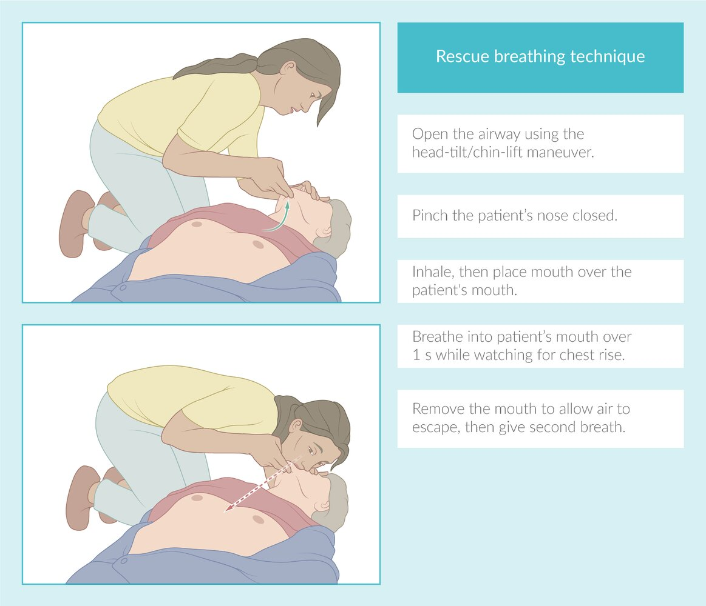
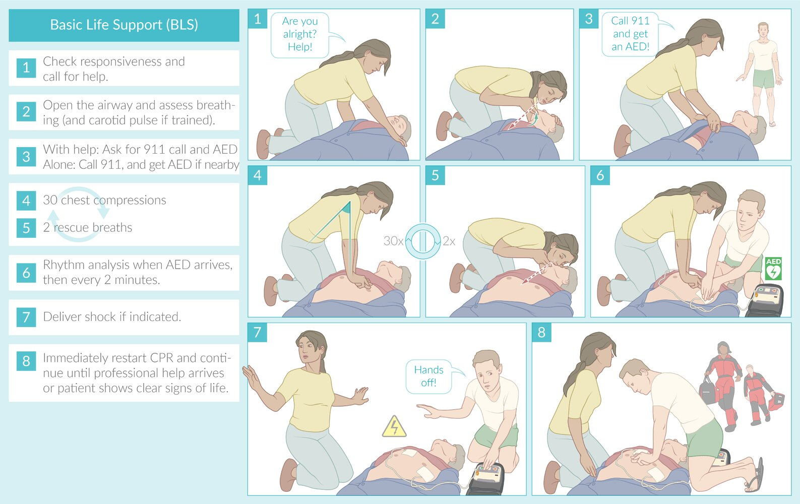
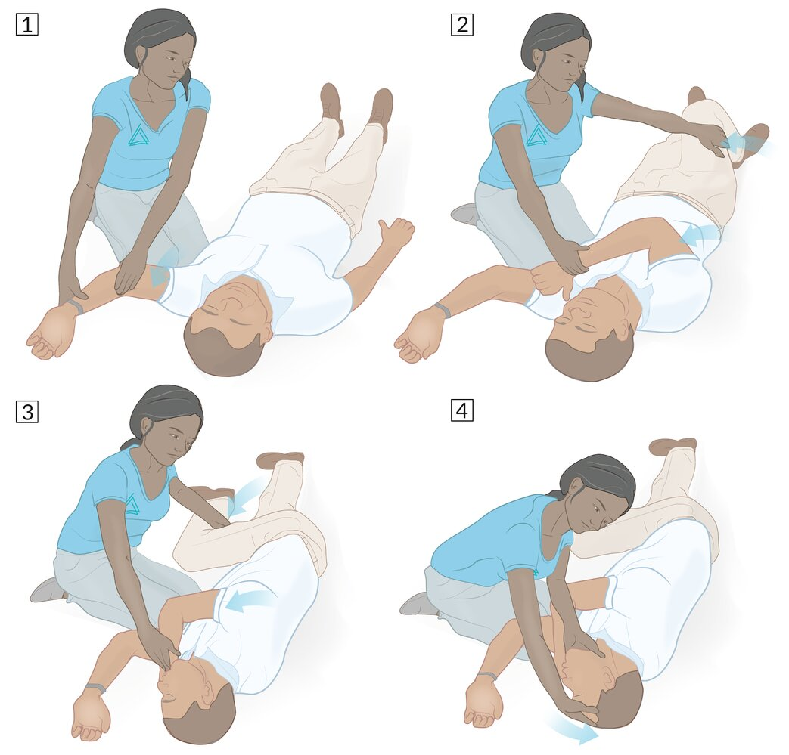
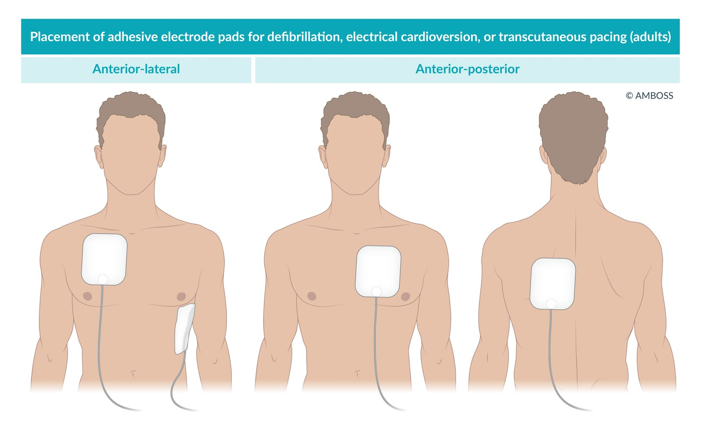
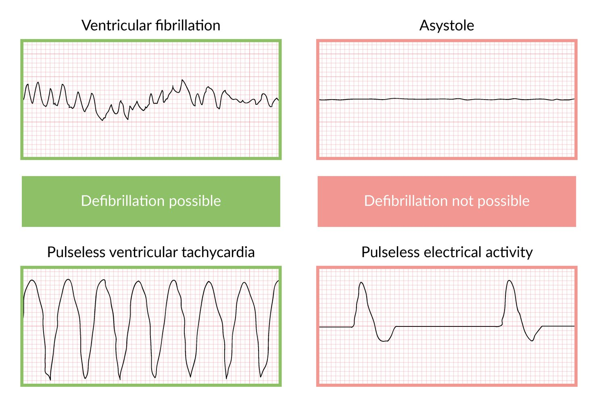
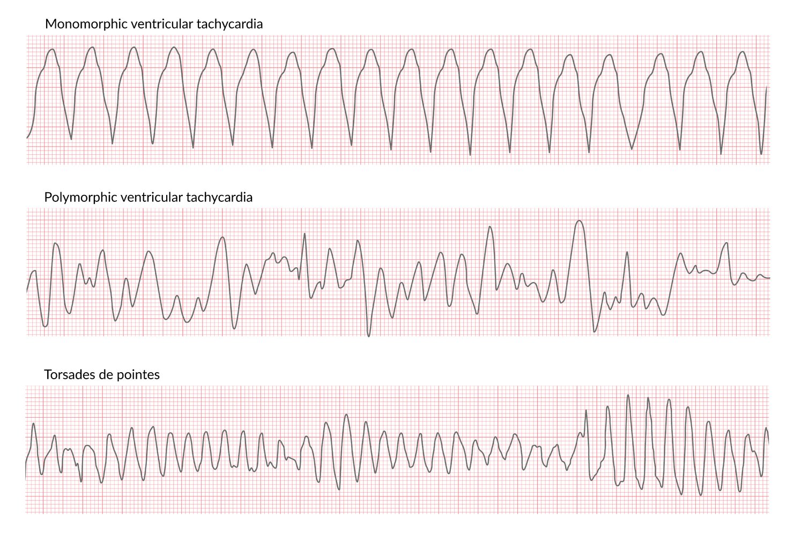
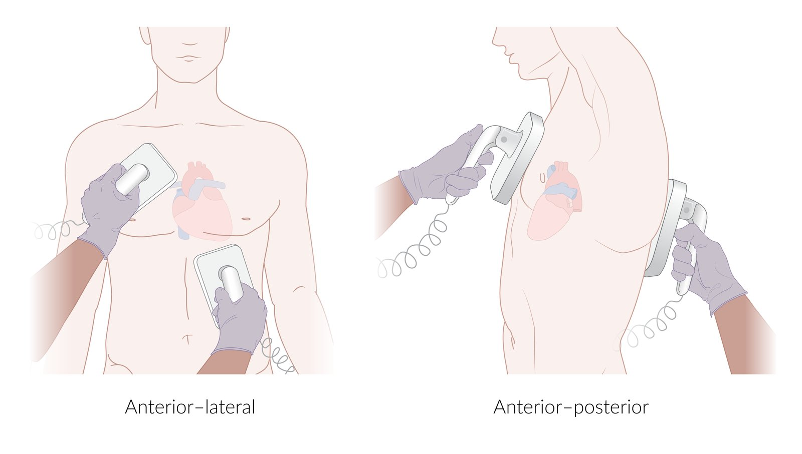
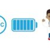

# Cardiac arrest and cardiopulmonary resuscitation

*Categories: Clinical knowledge > Emergency medicine > Resuscitation > Cardiac arrest and cardiopulmonary resuscitation*

[Original Article Link](https://coursology-qbank.com/amboss/article/kN0mYg)

---

## Summary

<u>Cardiac arrest</u> is the sudden cessation of cardiac function and blood circulation, manifesting as <u>apnea</u>, pulselessness, and <u>loss of consciousness</u>. In adults, <u>cardiac arrest</u> is most commonly caused by cardiac conditions (e.g., <u>coronary artery disease</u>), but it can also have noncardiac etiologies (e.g., <u>hypothermia</u>), whereas in children, etiologies are more varied and more frequently related to profound <u>hypoxia</u> (e.g., due to <u>airway obstruction</u>). <u>Cardiopulmonary resuscitation</u> (<u>CPR</u>) is a lifesaving procedure that artificially maintains circulation and ventilation until cardiac function is hopefully restored. Immediate initiation of <u>high-quality chest compressions</u> is the most important factor for survival after <u>cardiac arrest</u>.

There are two clinical algorithms to provide <u>CPR</u>: <u>basic life support</u> (<u>BLS</u>) for lay rescuers and medical professionals alike and <u>advanced cardiac life support</u> (<u>ACLS</u>) solely for medical professionals. <u>BLS</u> involves checking responsiveness, calling for help, performing <u>chest compressions</u> and <u>rescue breaths</u>, and, if available, using an <u>automated external defibrillator</u> (<u>AED</u>). <u>ACLS</u> includes additional measures (e.g., <u>resuscitation medications</u>, <u>airway management</u>) and identifying and treating <u>reversible causes of cardiac arrest</u> (e.g., <u>Hs and Ts</u>). Modifications to <u>BLS</u> and <u>ACLS</u> are required for children and <u>neonates</u>.

After the <u>return of spontaneous circulation</u> (<u>ROSC</u>), comprehensive <u>postresuscitation care</u> is essential for good neurological and functional outcomes. This involves <u>neuroprotective measures</u>, <u>hemodynamic support</u>, critical care admission, monitoring for organ dysfunction, and treatment of underlying causes and complications.

---

## Overview

Recommendations in this article are consistent with the 2020 and 2023 American <u>Heart</u> Association (<u>AHA</u>) and International Liaison Committee on Resuscitation (ILCOR) guidelines and consensus statements. Practice may vary according to regional authorities and resources. Consult local protocols whenever possible. [[1]](https://coursology-qbank.com/amboss/article/hSXczx)[[2]](https://coursology-qbank.com/amboss/article/c9Wamn0)

### <u>Chain of survival</u> [[3]](https://coursology-qbank.com/amboss/article/P4bWjF)[[4]](https://coursology-qbank.com/amboss/article/44b3jF)[[5]](https://coursology-qbank.com/amboss/article/TLX6CA)

The initial approach to <u>cardiac arrest</u> is influenced by the rescuers (e.g., number of rescuers, training received), patient factors (e.g., age, <u>pregnancy</u>), and location (i.e., in-hospital vs. out-of-hospital).

* Identify <u>cardiac arrest</u> and initiate an emergency response.

* Begin <u>BLS</u> (i.e., immediate <u>CPR</u>, especially <u>chest compressions</u>).

* <u>Defibrillate</u> <u>shockable rhythms</u>.

* Transition care to <u>ACLS</u> providers.

* Initiate <u>postresuscitation care</u>.

* Provide comprehensive support throughout recovery.

### Algorithms

| Overview of life support algorithms |  |  |
| --- | --- | --- |
|  | Key components |  |
| <u>BLS algorithm</u> |  |   * Activation of emergency response  * High-quality <u>CPR</u>  * <u>Automated external defibrillation</u>    |
| <u>ACLS algorithm</u> |  |   * <u>High-quality CPR</u>  * <u>Defibrillation</u>  * <u>Rhythm recognition in cardiac arrest</u>  * <u>Resuscitation medications</u>  * Treatment of <u>reversible causes of cardiac arrest</u>    |
| Special patient groups |   * <u>Newborns</u>: See “<u>Neonatal resuscitation</u>.”  * Prepubertal children: See “<u>Pediatric BLS</u>.”  * Postpubertal children: Follow the adult <u>BLS algorithm</u> and/or <u>ACLS algorithm</u>.  * Pregnant individuals: See “<u>Cardiac arrest in pregnancy</u>.”  * <u>Trauma patients</u>: See “<u>Traumatic cardiac arrest</u>.”    |  |
| <u>Postresuscitation care</u> |   * <u>Airway management</u>  * Maintenance of hemodynamic and respiratory parameters within target ranges  * <u>PCI</u> for suspected cardiac causes, e.g., <u>STEMI</u>  * <u>Temperature control</u>  * <u>Management of acute seizures</u>  * Other <u>neuroprotective measures</u>    |  |

---

## Cardiopulmonary resuscitation (CPR)

### Approach

* For sudden <u>cardiac arrest</u>, use the CAB approach to begin <u>chest compression</u> as soon as possible.
1. * Chest compressions
2. * Airway
3. * Breathing

* Prioritize <u>airway</u> and breathing (i.e., <u>ABC approach</u>) for <u>cardiac arrest</u> secondary to <u>respiratory arrest</u>.

* Minimize interruptions to <u>CPR</u>.  [[4]](https://coursology-qbank.com/amboss/article/44b3jF)

* If the diagnosis of <u>cardiac arrest</u> is uncertain, initiating <u>CPR</u> is preferable to <u>withholding CPR</u>.  [[3]](https://coursology-qbank.com/amboss/article/P4bWjF)

### Chest compressions  [[3]](https://coursology-qbank.com/amboss/article/P4bWjF)

<u>Chest compression</u> technique differs in children, <u>infants</u>, and <u>neonates</u>; see “<u>Basic life support in infants and children</u>” and “<u>Neonatal resuscitation</u>.”

* Key targets for <u>high-quality chest compressions</u>

* Compression rate: 100–120 per minute

* Compression depth for adults: 5–6 cm (2–2.5 inches)

* Allow full chest recoil between compressions.

* Provider positioning and technique (adults and children; excluding <u>infants</u>)

* Kneel or stand next to the patient depending on whether they are on the ground or in a bed, respectively.

* Center the hands (one on top of the other, fingers interlaced) over the <u>sternum</u>.

* Keep the arms straight (do not bend the <u>elbows</u>); the shoulders should be directly above the hands.

* Use full body weight to deliver rapid, firm compressions.

* Patient positioning: <u>supine</u> on a firm surface

* Minimizing interruptions

* Restart <u>CPR</u> between rhythm analysis and <u>shock</u> delivery (while the <u>defibrillator</u> is charging).

* Resume <u>CPR</u> immediately after <u>shock</u> delivery.

> [!TIP]
> <u>High-quality chest compressions</u> are associated with better survival rates.

🖼

#### Mechanical CPR devices [[6]](https://coursology-qbank.com/amboss/article/O4bIjF)

* Provide automated <u>chest compressions</u> through various means

* Consider if high-quality manual <u>chest compressions</u> cannot be consistently provided, e.g.:  [[7]](https://coursology-qbank.com/amboss/article/HL1K_h0)[[8]](https://coursology-qbank.com/amboss/article/sL1t_h0)

* Prolonged <u>CPR</u> needs: e.g., <u>hypothermic cardiac arrest</u>

* Manual compressions carry a high risk to providers (e.g., <u>pandemic</u> settings)

* Limited emergency response systems

### Rescue breathing [[3]](https://coursology-qbank.com/amboss/article/P4bWjF)

* Mouth-to-mouth   
1. * Open the <u>airway</u> using the <u>head-tilt/chin-lift maneuver</u>.
2. * Pinch the patient's nose closed.
3. * Form a tight seal over the patient's mouth.
4. * Breathe slowly into the patient's mouth for ∼ 1 second; check for chest rise to confirm sufficient ventilation.
5. * Move away from the patient's mouth between breaths to allow air to <u>escape</u>, ensuring the patient's <u>airway</u> remains open.

* If equipment is available: Ventilate with 100% O2; select a modality based on patient factors and provider expertise. ;  [[9]](https://coursology-qbank.com/amboss/article/N4b-jF)

* <u>BMV</u> (with or without <u>basic airway adjuncts</u>): Administer 2 breaths after every 30 chest compressions.

* <u>Advanced airway</u>

* Maintain an uninterrupted rate of 10 breaths/minute.

* Do not interrupt <u>CPR</u> for > 10 seconds to facilitate placement of an <u>advanced airway</u>.

* Return to <u>BMV</u> if an <u>advanced airway</u> has not been secured within 10 seconds.

> [!TIP]
> Continuous compression-only <u>CPR</u> is a reasonable alternative to <u>mouth-to-mouth</u> <u>rescue breathing</u> if the provider is uncomfortable administering <u>rescue breaths</u> or there is concern for infectious disease transmission.

Rescue breathing technique

### Withholding CPR

Only consider allowing natural <u>death</u> in limited situations, e.g.: [[10]](https://coursology-qbank.com/amboss/article/xPbESF)

* Presence of an <u>advance directive</u> or valid <u>DNR</u> prohibiting <u>CPR</u>

* Situations that may pose a significant risk to the rescuer

* <u>Signs of irreversible death</u>

> [!WARNING]
> Initiate <u>CPR</u> if there is any uncertainty regarding the <u>validity</u> of a <u>DNR</u> or the irreversibility of <u>death</u>.

---

## Basic life support (BLS)

The <u>BLS algorithm</u> allows appropriately trained individuals to recognize <u>cardiac arrest</u>, provide <u>high-quality chest compressions</u>, deliver ventilations, and utilize an <u>AED</u>.

### BLS algorithm [[1]](https://coursology-qbank.com/amboss/article/hSXczx)[[11]](https://coursology-qbank.com/amboss/article/HnXKuA)

The optimal sequence of some <u>BLS</u> steps varies between <u>single-rescuer BLS</u> and <u>two-rescuer BLS</u>.

* Assess scene safety: e.g., check for fire and other hazards, <u>don PPE</u> for infectious or toxic exposures

* Assess patient responsiveness : Proceed with <u>BLS</u> if no response or only abnormal breathing (e.g., <u>gasping</u>).

* Call for help: Shout for assistance and/or activate the emergency response.

* Retrieve an <u>AED</u> or <u>defibrillator</u>: e.g., from the nearest <u>crash cart</u>

* Assess for signs of life: Check <u>pulse</u> and respiration simultaneously.

* Perform <u>airway opening maneuvers</u> as needed.

* Look, listen, and feel for air movement.

* Check for a <u>central pulse</u> for no longer than 10 seconds.

* If no palpable <u>pulse</u>, <u>apnea</u>, and/or <u>agonal respirations</u>: Begin <u>CPR</u> immediately.

* If respirations are normal: Place the patient in the <u>recovery position</u> before continuing with medical assessment.

* Perform <u>high-quality CPR</u>.

* Position patient <u>supine</u> on a hard surface (activate <u>CPR</u> mode on the bed if present).  [[1]](https://coursology-qbank.com/amboss/article/hSXczx)

* Maintain appropriate <u>CPR</u> <u>ratio</u>: 30:2 for adults, i.e., 30 <u>chest compressions</u> followed by 2 <u>rescue breaths</u> per cycle

* Regularly switch roles if performing <u>two-rescuer CPR</u>.

* Minimize interruptions to <u>CPR</u>.

* <u>Defibrillate</u> as needed.

* Use an <u>AED</u> or <u>defibrillator</u> as soon as it is available.

* Perform 5 cycles (2 minutes) of <u>CPR</u> between each rhythm analysis and/or shock.

* Endpoints [[3]](https://coursology-qbank.com/amboss/article/P4bWjF)

* The patient shows clear signs of life: e.g., <u>coughing</u>, breathing, movement of the extremities

* Rescuers are too fatigued to continue

* <u>ACLS</u>-trained providers arrive

> [!TIP]
> Minimizing the interruption and delays to the initiation of <u>high-quality CPR</u> and early <u>defibrillation</u> of <u>shockable rhythms</u> are the most important factors for survival and reducing long-term complications after <u>cardiac arrest</u>.

> [!WARNING]
> For a collapsed patient, remember the DRs ABCD: Check the environment for Danger, assess for a Response, shout for help, open the Airway, check for Breathing, start CPR, and attach the Defibrillator.

Adult basic life support (BLS)

Basic life support

Recovery position

#### Single rescuer vs. two rescuers

|  Differences between single- and <u>two-rescuer BLS</u> [[1]](https://coursology-qbank.com/amboss/article/hSXczx)[[11]](https://coursology-qbank.com/amboss/article/HnXKuA)  |  |  |
| --- | --- | --- |
|  | Single-rescuer BLS | Two-rescuer BLS |
| Calling for help |   * Most cases: activate emergency response (e.g., shout for help, call 911) and retrieve <u>AED</u>/<u>defibrillator</u> before starting <u>CPR</u>.  * <u>Drowning</u> or <u>foreign body aspiration</u>: call for help after beginning <u>CPR</u> [[12]](https://coursology-qbank.com/amboss/article/HCYKtr)[[13]](https://coursology-qbank.com/amboss/article/Z4bZ3F)    |   * Begin <u>single rescuer CPR</u> immediately and direct the second rescuer to activate emergency response and/or retrieve <u>AED</u>/<u>defibrillator</u>  * Perform <u>single-rescuer CPR</u> until second rescuer returns.    |
| Once <u>AED</u> is available |   * Turn <u>AED</u> on, attach pads , and press “Analyze” before starting <u>CPR</u>.  * If shock advised: Deliver shock then begin <u>single-rescuer CPR</u>.  * If no shock advised: Begin <u>single rescuer CPR</u> immediately.    |   * Direct second rescuer to turn <u>AED</u> on and attach pads  while continuing <u>single-rescuer CPR</u>.  * Pause <u>single-rescuer CPR</u> to analyze rhythm.  * If shock advised: Deliver <u>shock</u> and begin <u>two-rescuer CPR</u>.  * If no shock advised: Begin <u>two-rescuer CPR</u> immediately.    |
| <u>CPR</u> technique |   * Single-rescuer CPR: a single rescuer provides both <u>chest compressions</u> and <u>rescue breaths</u>  * Continuous compression-only <u>CPR</u> is reasonable if <u>BMV</u> is unavailable and <u>mouth-to-mouth</u> breathing is deemed risky    |   * Two-rescuer CPR: one rescuer performs <u>chest compressions</u> and the other provides <u>rescue breaths</u>  * Change roles every 2 minutes (or earlier if fatigued).    |

### Automated external defibrillator (<u>AED</u>)

* Description: a portable electronic <u>defibrillator</u> that independently identifies <u>shockable rhythms</u> and delivers a shock; designed to be used by lay rescuers in out-of-hospital settings

* Applying pads  

* Dry the <u>skin</u> where the pads will be applied, if necessary.

* <u>Anterior</u>-<u>lateral</u> placement: Place one pad on the right chest (above the <u>nipple</u>) and the other on the left side of the thorax (below the <u>nipple</u>).

* <u>Anterior</u>-<u>posterior</u> placement: Place one pad anteriorly on the chest and the other posteriorly on the back.

* Rhythm analysis

* Pause <u>CPR</u> during rhythm analysis.

* Repeat analysis every 2 minutes (5 cycles of <u>CPR</u>).

* Delivering shocks 

* The <u>AED</u> will indicate if a shock is advised and may begin to charge.

* Resume <u>CPR</u> while the <u>AED</u> is charging.

* When advised by the <u>AED</u>, clear the surroundings , then deliver the shock.

* Resume <u>CPR</u> immediately after shock delivery: Perform for 2 minutes (5 cycles) prior to the next rhythm analysis.

Placement of adhesive electrode pads for defibrillation, electrical cardioversion, or transcutaneous pacing

### Special situations [[1]](https://coursology-qbank.com/amboss/article/hSXczx)[[11]](https://coursology-qbank.com/amboss/article/HnXKuA)[[12]](https://coursology-qbank.com/amboss/article/HCYKtr)

* <u>Drowning</u>: Prioritize <u>ABC approach</u> and <u>rescue breaths</u>; perform <u>CPR</u> prior to calling for help.

* <u>Foreign body aspiration</u> (<u>FBA</u>): See “<u>Unresponsive patient with suspected FBA</u>” for details.

* Check <u>airway</u> for dislodged foreign body (FB) during 2-minute <u>pulse</u> check and remove if present.

* Avoid blind finger sweep if FB is not visible.

* If <u>CPR</u> unsuccessful, consider <u>emergency airway procedures for FBA</u>.

* <u>Hypothermia</u>

* Requires specialized <u>vital signs</u> assessment

* <u>CPR</u> generally continued until fully rewarmed, e.g., using <u>ECLS</u>

* Consider <u>mechanical CPR devices</u>.

* See “<u>Hypothermic cardiac arrest</u>” for details.

* Temporizing measure for <u>shockable rhythms</u>: not routinely recommended [[11]](https://coursology-qbank.com/amboss/article/HnXKuA)

* Precordial thump maneuver: a sharp, high-<u>velocity</u> blow delivered to the mid <u>sternum</u> using the ulnar aspect of the fist with the goal to interrupt life-threatening <u>V-fib</u> or <u>V-tach</u>.

* Consider only if all the following criteria are met:

* Witnessed onset of an unstable <u>ventricular tachyarrhythmia</u> in a monitored patient

* Functioning <u>defibrillator</u> not immediately available

* Maneuver can be performed without delaying <u>CPR</u> or <u>defibrillation</u>

---

## Advanced cardiac life support (ACLS)

The <u>ACLS algorithm</u> adds the following to the <u>BLS algorithm</u>: <u>rhythm recognition in cardiac arrest</u>, <u>resuscitation medications</u>, treatment of <u>reversible causes of cardiac arrest</u>, and <u>advanced airway management</u>. Maximizing <u>high-quality CPR</u> and early <u>defibrillation</u> remain the most important factors for survival and good neurological outcome. [[13]](https://coursology-qbank.com/amboss/article/Z4bZ3F)

### ACLS algorithm [[11]](https://coursology-qbank.com/amboss/article/HnXKuA)[[13]](https://coursology-qbank.com/amboss/article/Z4bZ3F)

* Priority 1: <u>CPR</u>

* Perform <u>high-quality CPR</u> for at least 2 minutes before the first rhythm check.

* Avoid interrupting <u>CPR</u> unless it is for rhythm and <u>pulse</u> checks and/or shock delivery.

* Consider an <u>advanced airway</u> only if necessary and feasible without major interruption of <u>CPR</u>.

* Priority 2: rhythm and <u>pulse</u> check

* Attach monitors and/or <u>defibrillator</u> pads.

* Pause <u>CPR</u> for no longer than 10 seconds for <u>rhythm recognition in cardiac arrest</u>.

* <u>Shockable rhythms</u> (<u>Vfib</u> or <u>pulseless VT</u>): Proceed to <u>defibrillation</u>; draw up <u>epinephrine</u> PLUS either <u>amiodarone</u> OR <u>lidocaine</u>.

* <u>Nonshockable rhythms</u> (<u>PEA</u> or <u>asystole</u>): Do not <u>defibrillate</u>; draw up <u>epinephrine</u>.

* Repeat rhythm and <u>pulse</u> check every 2 minutes, resuming <u>CPR</u> in between each check.

* Priority 3: <u>defibrillation</u> of <u>shockable rhythms</u>

* Deliver a shock;  (e.g., 200 J biphasic) as soon as <u>Vfib</u> or <u>pulseless VT</u> is recognized.

* Resume <u>CPR</u> immediately after shock and continue for 2 minutes until next rhythm and <u>pulse</u> check.

* If a second attempt at <u>defibrillation</u> is unsuccessful, administer <u>resuscitation medications</u>.

* Priority 4: <u>resuscitation medications</u> [[2]](https://coursology-qbank.com/amboss/article/c9Wamn0)

* Obtain <u>peripheral IV</u>/<u>IO access</u> and administer medications without interrupting <u>CPR</u>.

* <u>Nonshockable rhythms</u>: Administer <u>epinephrine</u>;  1 mg IV/IO as soon as possible; repeat every 3–5 minutes as needed.

* <u>Shockable rhythms</u>

* After 2nd unsuccessful cycle of <u>defibrillation</u>, administer <u>epinephrine</u> 1 mg IV/IO; repeat every 3–5 minutes as needed.

* After 3rd unsuccessful cycle of <u>defibrillation</u>, administer:

* <u>Amiodarone</u> 300 mg IV/IO once, then 150 mg IV/IO once after 3–5 minutes

* OR <u>lidocaine</u> 1–1.5 mg/kg IV/IO once, then 0.5–0.75 mg/kg IV/IO once after 3–5 minutes

* After the first dose of <u>epinephrine</u>, addition of <u>vasopressin</u> 20 IU IV ± <u>methylprednisolone</u> 40 mg IV may also be considered. [[2]](https://coursology-qbank.com/amboss/article/c9Wamn0)

* Reevaluate indications and dosage at each subsequent rhythm and <u>pulse</u> check.

* Priority 5: <u>Hs and Ts</u>

* Address these in parallel with <u>CPR</u>, <u>defibrillation</u>, and <u>resuscitation medications</u>.

* See “<u>Reversible causes of cardiac arrest</u>” for <u>targeted therapies</u>.

* Endpoints

* <u>ROSC</u> identified during rhythm and <u>pulse</u> check: Begin <u>postresuscitation care</u>.

* <u>Termination of resuscitation</u> decision is made: Follow procedure for <u>declaration of death</u>.

> [!WARNING]
> Evaluate and treat <u>reversible causes of cardiac arrest</u> (e.g., <u>Hs and Ts</u>) without stopping <u>CPR</u>, <u>defibrillation</u>, or administration of <u>resuscitation medications</u>.

> [!TIP]
> Continue <u>CPR</u> and <u>defibrillation</u> attempts as long as the patient has a <u>shockable rhythm</u>.

Advanced cardiac life support (ACLS)

### Rhythm recognition in cardiac arrest

|  <u>Rhythms in cardiac arrest</u>  |  |  |  |  |
| --- | --- | --- | --- | --- |
| Rhythm |  | Appearance | Pathophysiology |  Classic etiologies   |
| Shockable rhythms | <u>Ventricular fibrillation</u> (VF) |  * Coarse or fine irregular waves of varying size, morphology, and rhythm   |   * Arrhythmic and unsynchronized high-frequency contraction of the ventricles  * Result: no <u>cardiac output</u>    |   * <u>Structural heart disease</u>  * <u>Myocardial</u> <u>ischemia</u>  * <u>Cardiac arrhythmias</u>  * Cardiotoxic substance <u>poisoning</u>    |
| Pulseless ventricular tachycardia (<u>pulseless VT</u>) |   * Typically rapid, regular broad complexes  * <u>Monomorphic VT</u>, <u>polymorphic VT</u>, or <u>torsades de pointes</u> may be present.    |   * Rapid, regular ventricular rate (along with pulselessness)  * Result: insufficient <u>cardiac output</u> due to high <u>heart rate</u>    |  |  |
| Nonshockable rhythms | Pulseless electrical activity (<u>PEA</u>) |   * Variable  * May resemble any regular electrical activity on the monitor    |   * Rhythmic electrical activity (commonly low rate, wide, distorted <u>QRS complexes</u>) without a detectable <u>central pulse</u>  * True <u>PEA</u> (i.e., electromechanical dissociation): no <u>myocardial</u> contraction  * Pseudo-PEA: contractions occur but <u>cardiac output</u> insufficient to produce a detectable <u>pulse</u>    |   * <u>Cardiac tamponade</u>  * <u>Pulmonary embolism</u>  * <u>Tension pneumothorax</u>  * <u>Hypovolemic shock</u>    |
| Asystole |  * Gently undulating line   |   * No electrical activity  * Result: No ventricular mechanical activity, <u>cardiac output</u>, or <u>pulse</u>    |   * <u>Hypoxia</u>  * <u>Hyperkalemia</u>    |  |

> [!TIP]
> In prolonged <u>cardiac arrest</u>, rhythms frequently degenerate into <u>asystole</u>; check with emergency providers if another rhythm was detected prior to admission.

> [!WARNING]
> Avoid pausing <u>CPR</u> for longer than 10 seconds for rhythm and <u>pulse</u> checks.

Rhythms in cardiopulmonary resuscitation

Ventricular fibrillation

Monomorphic ventricular tachycardia

Comparison of monomorphic and polymorphic ventricular tachycardia (VT), including torsades de pointes

### Defibrillation

<u>Defibrillate</u> as soon as possible once a <u>shockable rhythm</u> is recognized to maximize survival.

#### Procedure

1. * Set the <u>defibrillator</u> to unsynchronized mode.
2. * Place the paddles or pads firmly on the patient's thorax.
3. * Set energy dosage and press the charge button.

* Biphasic <u>defibrillator</u> (preferred)  [[11]](https://coursology-qbank.com/amboss/article/HnXKuA)[[14]](https://coursology-qbank.com/amboss/article/4uY3rI)

* First shock: 120–200 J

* Additional shocks: 200–360 J

* Monophasic <u>defibrillator</u> : 360 J for all shocks
4. * Resume <u>CPR</u> while the <u>defibrillator</u> is charging.
5. * When fully charged, “clear” the patient, i.e., ensure no other personnel and equipment are in contact with the patient or pads.
6. * Administer the shock.

* Paddles: Simultaneously hold down both shock buttons located under each thumb.

* Pads: Press the shock button on the <u>defibrillator</u>.
7. * Resume <u>CPR</u> immediately after <u>defibrillation</u> for a full 2-minute cycle.  [[13]](https://coursology-qbank.com/amboss/article/Z4bZ3F)

> [!WARNING]
> Ensure the <u>defibrillator</u> is set to unsynchronized mode when treating <u>cardiac arrest</u> with a <u>shockable rhythm</u>.

Placement of adhesive electrode pads for defibrillation, electrical cardioversion, or transcutaneous pacing

Placement of paddles for defibrillation or electrical cardioversion

Cardioversion vs defibrillation: performing the procedures

#### Pitfalls and troubleshooting

* Provide interval <u>CPR</u> if there is a delay between rhythm recognition and shock delivery.

* Conducting gel may be required for paddles.

* Direct, firm contact between the pads or paddles and the <u>skin</u> is essential.

* Consider shaving the patient's chest if there is a lot of <u>hair</u>.

* Turn oxygen off or divert the flow away from the patient.

### Resuscitation medications  [[2]](https://coursology-qbank.com/amboss/article/c9Wamn0)[[11]](https://coursology-qbank.com/amboss/article/HnXKuA)

Obtain <u>peripheral IV access</u> or <u>IO access</u> for medication administration without interrupting <u>CPR</u>. All <u>resuscitation medications</u> should be administered while <u>CPR</u> is ongoing to ensure their circulation to the <u>heart</u> and <u>brain</u>.

* <u>Shockable rhythms</u>

* <u>Epinephrine</u> 1 mg IV/IO 

* First dose: after second unsuccessful <u>defibrillation</u> attempt

* Repeat every 3–5 minutes.

* <u>Amiodarone</u>;  300 mg IV/IO (OR <u>lidocaine</u>1–1.5 mg/kg IV/IO)

* First dose: after third unsuccessful <u>defibrillation</u> attempt

* An additional dose of 150 mg of <u>amiodarone</u> or 0.5–0.75 mg/kg of <u>lidocaine</u> can be given after 3–5 minutes.

* <u>Nonshockable rhythms</u>: : Administer <u>epinephrine</u> 1 mg IV/IO.

* First dose: as soon as possible

* Repeat every 3–5 minutes.

* Any rhythm: After the first dose of <u>epinephrine</u>, addition of <u>vasopressin</u> 20 IU IV ± <u>methylprednisolone</u> 40 mg IV may be considered. [[2]](https://coursology-qbank.com/amboss/article/c9Wamn0)

### <u>Crisis resource management</u> [[13]](https://coursology-qbank.com/amboss/article/Z4bZ3F)

Effective <u>teamwork</u> is essential to the success of resuscitative efforts. The following roles, responsibilities, and communication strategies are recommended during <u>ACLS</u>:

* Assign a designated team leader prior to starting resuscitation. 

* All communication about patient status and treatments delivered should go through the team leader.

* Final decisions about which treatments to pursue and when to stop resuscitation should be made by the team leader after discussion with other team members.

* Other suggested roles include:

* At least two <u>CPR</u> performers: one for <u>chest compressions</u> and one for <u>airway</u> and ventilation

* Providers of <u>chest compressions</u> should be swapped every 2 minutes to prevent fatigue.

* Coordinate changeovers to minimize interruptions to <u>CPR</u>.

* Provider(s) in charge of IV/<u>IO access</u> and medications

* Provider(s) in charge of rhythm and <u>pulse</u> checks and <u>defibrillation</u>

* Provider in charge of specific procedures (e.g., <u>intubation</u>, <u>pericardiocentesis</u>, <u>point-of-care ultrasound</u>)

* Timekeeper and/or note taker

* Prior to each pause, ensure team members are aware of their roles to minimize interruptions to <u>CPR</u>.

---

## Postresuscitation care

The post-<u>ROSC</u> phase of <u>cardiac arrest</u> focuses on optimizing <u>hemodynamic support</u>, identifying and treating the underlying cause of arrest, and minimizing <u>secondary brain injury</u> through <u>neuroprotective measures</u>.

### Initial postresuscitation stabilization [[11]](https://coursology-qbank.com/amboss/article/HnXKuA)

* <u>Airway</u>: <u>Secure the airway</u> in <u>comatose</u> patients with early placement of an <u>endotracheal tube</u>.

* Target respiratory parameters: Titrate <u>FiO2</u> and initiate waveform <u>capnography</u>.

* <u>Respiratory rate</u>: Start at 10 breaths/minute.

* Titrate <u>oxygen therapy</u> to reach <u>SpO2</u> of 92–98% and <u>PaCO2</u> of 35–45 mm Hg.

* Target <u>hemodynamic parameters</u>: Administer <u>IV fluids</u> as needed and consider <u>vasopressors</u> and/or <u>inotropes</u>.

* Systolic blood pressure > 90 mm Hg

* <u>Mean arterial pressure</u> > 65 mm Hg

* Obtain 12-lead <u>ECG</u>: to evaluate for acute <u>ST-segment elevation</u>

### Additional management and urgent interventions [[2]](https://coursology-qbank.com/amboss/article/c9Wamn0)[[11]](https://coursology-qbank.com/amboss/article/HnXKuA)

* Address the cause of arrest: See “<u>Reversible causes of cardiac arrest</u>.”

* Identify patients requiring urgent <u>coronary angiography</u>.

* All patients with <u>ST-segment elevation</u> on <u>ECG</u>

* Patients with <u>shock</u>, ongoing <u>myocardial</u> damage or <u>ischemia</u>, or electrical instability [[2]](https://coursology-qbank.com/amboss/article/c9Wamn0)

* All patients with any other indication for <u>coronary angiography</u>

* Diagnose and manage <u>seizures</u>.

* Perform an <u>EEG</u> on all <u>comatose</u> patients.

* Consider nonsedating <u>antiepileptic drugs</u> to <u>manage acute seizures</u>. [[2]](https://coursology-qbank.com/amboss/article/c9Wamn0)

* <u>Seizure</u> prophylaxis is not recommended.

* <u>Temperature control</u> in unresponsive patients [[2]](https://coursology-qbank.com/amboss/article/c9Wamn0)

* Maintain a body temperature of 32–37.5°C (89.6–99.5°F) for at least 24 hours.

* Avoid <u>fever</u>.

* Initiate other <u>neuroprotective measures</u>: See “<u>Secondary brain injury and neuroprotective measures</u>.”

* Admit to <u>ICU</u>: for further management and <u>neuroprognostication</u>

> [!TIP]
> Don't forget the <u>ABCs</u> of <u>postresuscitation care</u>: Obtain an ABG, BP, and Chest <u>x-ray</u>, Draw blood for <u>laboratory studies</u>, and ensure an ECG is performed. Talk to the Family, Give thanks to the team, consider initiation of Hypothermia, and admit to ICU.

### <u>Neuroprognostication</u> [[11]](https://coursology-qbank.com/amboss/article/HnXKuA)

* <u>Neuroprognostication</u> after <u>cardiac arrest</u> is complex and should be conducted by specialists.

* The extent of <u>irreversible loss of brain function</u> can be estimated clinically (e.g., <u>neurological examination</u>, <u>apnea testing</u>) and using <u>ancillary brain death tests</u> (e.g., <u>EEG</u>).

* <u>Brain death</u> assessment is typically carried out 72 hours after <u>cardiac arrest</u> or cessation of <u>TTM</u>.

* See also “<u>Ethical issues concerning brain death</u>.”

### <u>Organ donation</u> [[2]](https://coursology-qbank.com/amboss/article/c9Wamn0)[[5]](https://coursology-qbank.com/amboss/article/TLX6CA)[[10]](https://coursology-qbank.com/amboss/article/xPbESF)

* Consider <u>organ donation</u> for all patients with <u>ROSC</u> in whom <u>brain death</u> is declared.

* If <u>ROSC</u> does not occur, <u>kidney</u> and <u>liver</u> donation may still be possible, depending on the center.

* See “<u>Organ and tissue donation</u>” for related clinical, systemic, legal, and ethical issues.

---