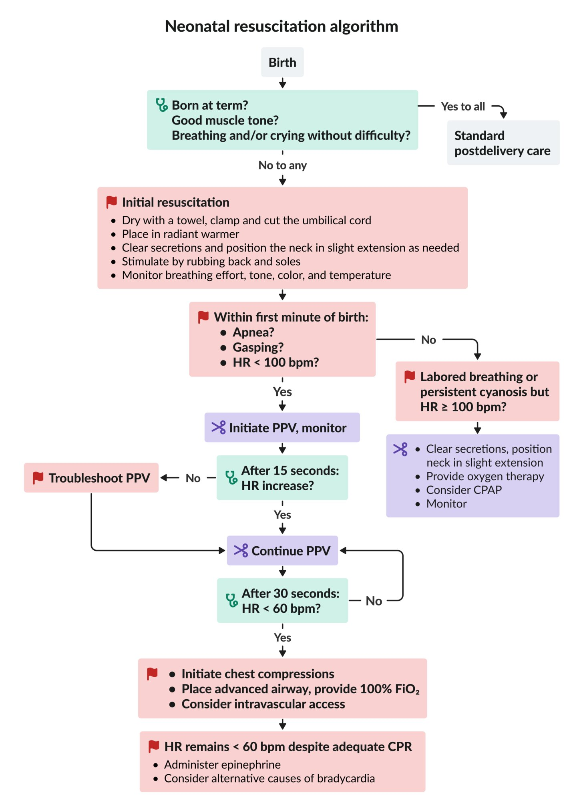
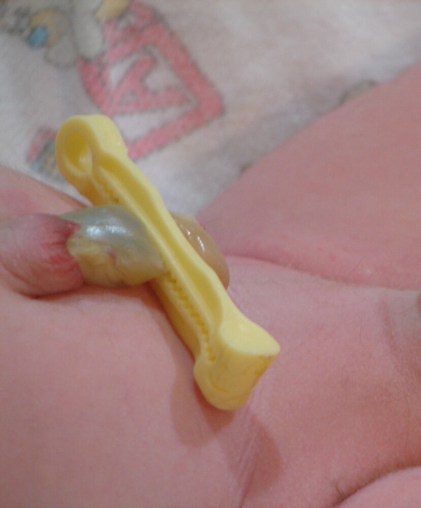
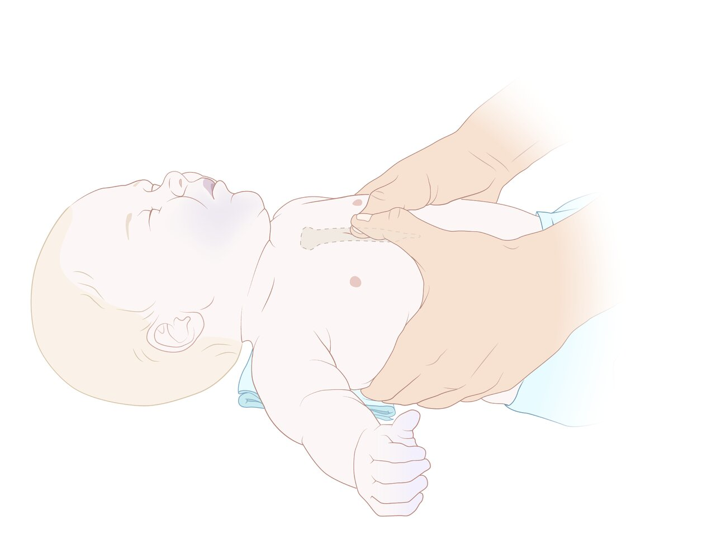
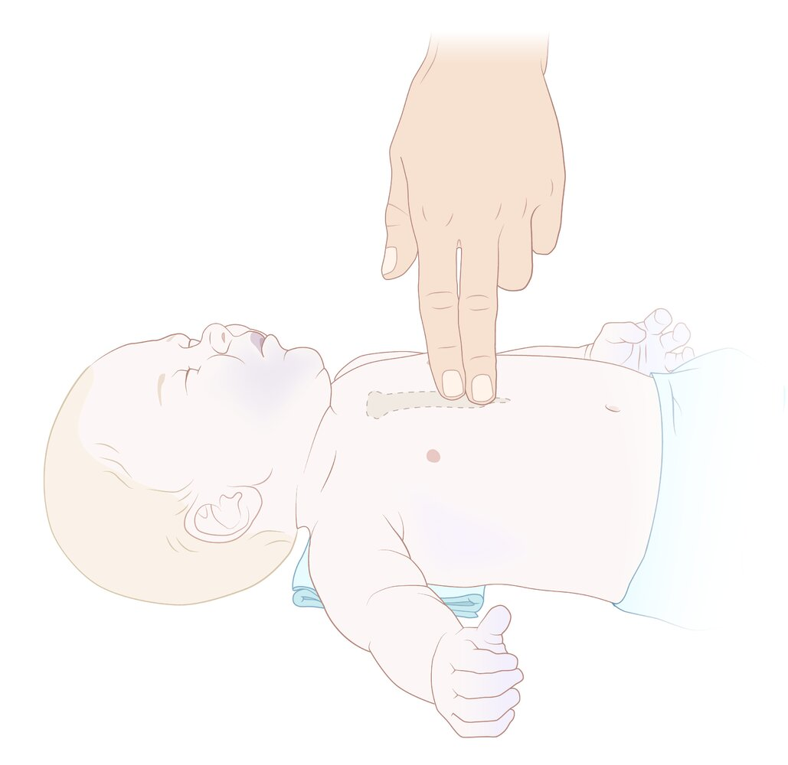
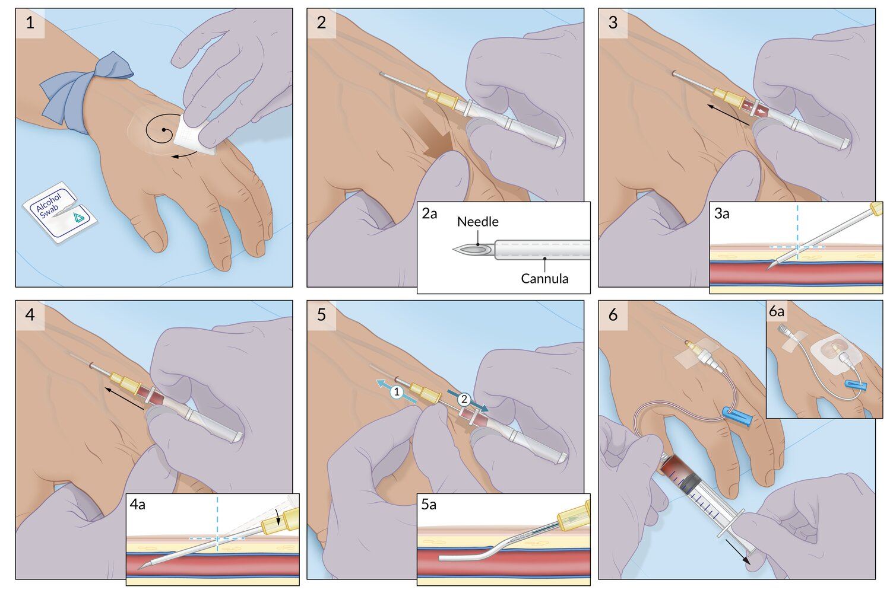
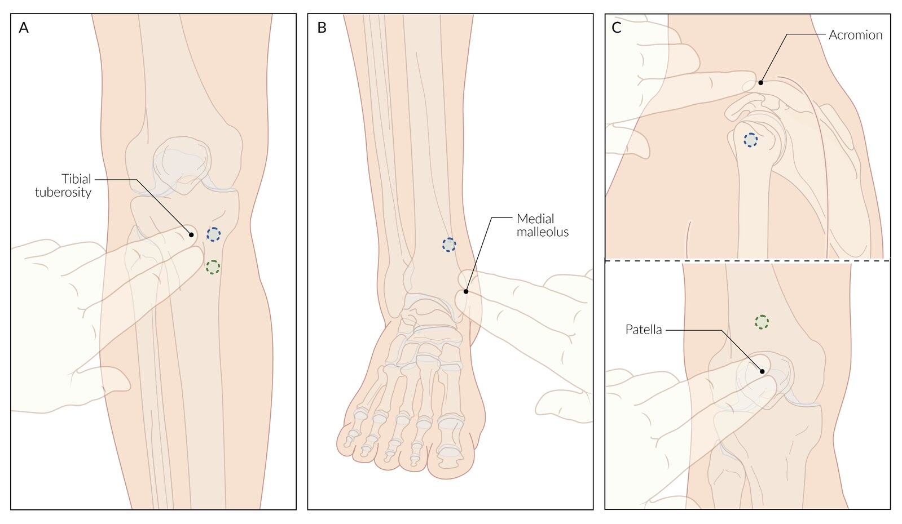
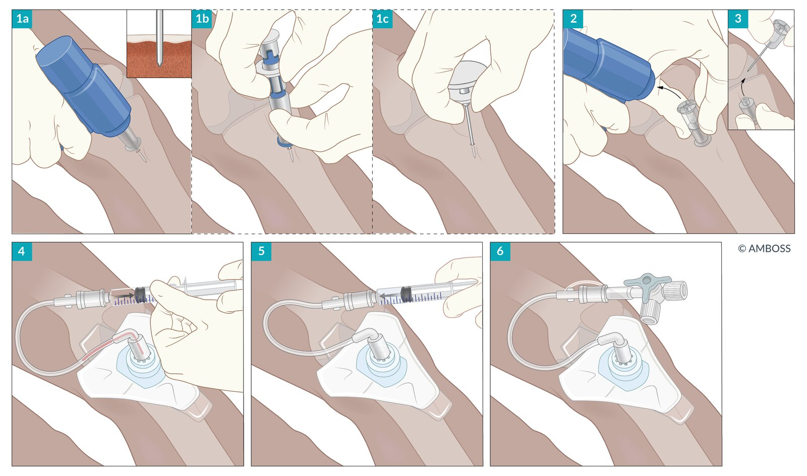

# Neonatal resuscitation

*Categories: Clinical knowledge > Emergency medicine > Resuscitation > Neonatal resuscitation*

[Original Article Link](https://coursology-qbank.com/amboss/article/Uu0bq3)

---

## Summary

The <u>neonatal resuscitation</u> algorithm provides a structured approach to care of <u>neonates</u> immediately after <u>birth</u>. Initial interventions include drying, warming, and stimulating the <u>neonate</u> while assessing the <u>heart rate</u> and respiratory effort. Additional <u>respiratory support</u> may include <u>oxygen therapy</u>, <u>continuous positive airway pressure</u> (<u>CPAP</u>), <u>positive-pressure ventilation</u> (PPV), and/or <u>endotracheal intubation</u>. Additional cardiac support may include <u>chest compressions</u>, <u>fluid resuscitation</u>, and/or <u>epinephrine</u> administration. <u>Postresuscitation care</u> includes monitoring for <u>hypoxic-ischemic encephalopathy</u>, <u>hypothermia</u>, and <u>hypoglycemia</u>.

---

## Risk factors for neonatal distress

* Maternal factors [[2]](https://coursology-qbank.com/amboss/article/WyWPVL0)

* < 19 years or ≥ 40 years of age

* <u>Diabetes</u>

* <u>Hypertension</u>

* Substance use

* Previous <u>miscarriage</u> or <u>stillbirth</u> [[3]](https://coursology-qbank.com/amboss/article/drboTE)

* Fetal factors [[2]](https://coursology-qbank.com/amboss/article/WyWPVL0)

* <u>Prematurity</u> or postmaturity

* Congenital abnormalities

* <u>Multiple gestation</u>

* <u>Complications of pregnancy</u> [[2]](https://coursology-qbank.com/amboss/article/WyWPVL0)

* <u>Placental</u> anomalies

* <u>Oligohydramnios</u> or <u>polyhydramnios</u>

* <u>Chorioamnionitis</u>

* <u>Meconium</u>-stained <u>amniotic fluid</u>

* Abnormal <u>fetal heart rate</u>

* Complicated delivery [[2]](https://coursology-qbank.com/amboss/article/WyWPVL0)

* Transverse or breech position

* Suction-assisted or <u>forceps delivery</u>

* <u>Cesarean birth</u>

---

## Neonatal resuscitation algorithm

The <u>neonatal resuscitation</u> algorithm provides guidance on how to resuscitate and stabilize <u>neonates</u> immediately after <u>birth</u>. Follow the <u>pediatric advanced life support</u> algorithm for all other pediatric patients.

Neonatal resuscitation algorithm

### Initial neonatal assessment [[4]](https://coursology-qbank.com/amboss/article/XAW9RL0)

* Assess the following:

* Is the <u>newborn</u> at term <u>gestation</u> (by history and appearance)?

* Is muscle tone good?

* Is the <u>newborn</u> crying and/or breathing without difficulty?

* All items yes: Continue <u>postdelivery care of the newborn</u>.

* Any item no: Begin <u>initial neonatal resuscitation</u>.

### Initial neonatal resuscitation

* Dry the <u>skin</u> with a towel.

* Clamp and cut the <u>umbilical cord</u>. 

* Consider delaying <u>umbilical cord clamping</u> for ≥ 30 seconds (even if the <u>newborn</u> is nonvigorous) if the <u>newborn</u> does not require immediate resuscitation. [[5]](https://coursology-qbank.com/amboss/article/XyW9dL0)

* Consider <u>milking the umbilical cord</u> if <u>gestation</u> is > 28 weeks and the <u>newborn</u> does not require immediate resuscitation.  [[5]](https://coursology-qbank.com/amboss/article/XyW9dL0)[[6]](https://coursology-qbank.com/amboss/article/2AWTQL0)[[7]](https://coursology-qbank.com/amboss/article/UAWbQL0)

* Place the <u>newborn</u> in a <u>radiant warmer</u>.

* Perform <u>initial neonatal airway interventions</u> as needed.

* Stimulate the <u>newborn</u> by rubbing the <u>newborn</u>'s back and soles if the respiratory effort remains suboptimal. [[4]](https://coursology-qbank.com/amboss/article/XAW9RL0)

* Assess the <u>effectiveness</u> of initial resuscitation.

* Monitor the <u>newborn</u>'s breathing effort, tone, color, and temperature continuously.

* Check <u>heart rate</u> (<u>auscultation</u> over precordium recommended) within the first minute of <u>birth</u>.  [[8]](https://coursology-qbank.com/amboss/article/jAW_jL0)[[9]](https://coursology-qbank.com/amboss/article/AN1Rdh0)

* Begin <u>advanced neonatal resuscitation</u> if the HR is < 100 bpm or respiratory effort is abnormal.

Clamped umbilical cord

### Advanced neonatal resuscitation [[4]](https://coursology-qbank.com/amboss/article/XAW9RL0)[[5]](https://coursology-qbank.com/amboss/article/XyW9dL0)[[10]](https://coursology-qbank.com/amboss/article/ynXdDA)

#### Monitoring

* Place a <u>pulse</u> oximeter on the right hand or wrist to measure <u>preductal oxygen saturation</u>.

* Establish <u>continuous ECG monitoring</u>.

* Monitor the <u>newborn</u>'s respiratory effort, tone, color, and <u>heart rate</u> throughout the resuscitation.

* Reassess within 30–60 seconds of any therapeutic intervention. [[4]](https://coursology-qbank.com/amboss/article/XAW9RL0)

#### Labored breathing or persistent <u>cyanosis</u> but HR ≥ 100 bpm

* Perform <u>initial neonatal airway interventions</u>.

* Start <u>neonatal oxygen therapy</u> and titrate to <u>normal preductal oxygen saturation in newborns</u>.

* Consider <u>neonatal CPAP</u>. [[4]](https://coursology-qbank.com/amboss/article/XAW9RL0)

* Initiate if breathing is labored or need for oxygen persists beyond the first few minutes. [[4]](https://coursology-qbank.com/amboss/article/XAW9RL0)

* Use only in <u>newborns</u> with spontaneous breathing and HR ≥ 100 bpm.

#### <u>Apnea</u>, <u>gasping</u>, or HR < 100 bpm

* Initiate <u>neonatal PPV</u>.

* Reassess HR 15 seconds after beginning <u>neonatal PPV</u>.

* If HR does not increase: <u>Troubleshoot inadequate neonatal PPV</u>.

* If HR increases: Continue current <u>neonatal PPV</u>.

* Reassess HR 30 seconds after verifying adequate chest expansion.

* If HR < 60 bpm: Initiate <u>neonatal chest compressions</u>.

* If HR 60–100 bpm: Continue current <u>neonatal PPV</u>.

#### HR < 60 bpm after 30 seconds of adequate PPV

* Begin <u>neonatal chest compressions</u>.

* Place an <u>advanced airway</u> (e.g., <u>ETT</u>, <u>LMA</u>) and provide 100% <u>FiO2</u>.

* Consider establishing <u>intravascular</u> access (e.g., with an <u>umbilical vein catheter</u> or intraosseous needle).

#### HR < 60/minute despite adequate <u>CPR</u>

* Administer <u>neonatal epinephrine</u>.

* Consider alternative <u>causes of bradycardia</u>, e.g.:

* <u>Hypovolemia</u>: Provide <u>neonatal fluid resuscitation</u>.

* <u>Pneumothorax</u>: Perform <u>thoracentesis</u>.

---

## Neonatal respiratory support

Adequate ventilation is the most important feature of <u>neonatal resuscitation</u>. [[10]](https://coursology-qbank.com/amboss/article/ynXdDA) See “<u>Airway management</u>” for a general overview of <u>respiratory support</u>.

### Initial neonatal airway interventions

* Clear <u>airway</u> secretions by wiping the <u>newborn</u>'s mouth and nose.

* Position the <u>newborn</u> <u>supine</u> with the neck slightly extended.

> [!WARNING]
> Suction the <u>airway</u> only when there is obvious obstruction, as suctioning may cause <u>bradycardia</u>. [[10]](https://coursology-qbank.com/amboss/article/ynXdDA)

> [!WARNING]
> If <u>airway</u> suctioning is required, always use a pressure < 100 mm Hg to reduce the risk of <u>vagal</u> stimulation and <u>apnea</u>. [[9]](https://coursology-qbank.com/amboss/article/AN1Rdh0)

### Neonatal oxygen therapy [[4]](https://coursology-qbank.com/amboss/article/XAW9RL0)[[10]](https://coursology-qbank.com/amboss/article/ynXdDA)

* Indications: <u>neonates</u> with labored breathing or persistent <u>cyanosis</u> but HR ≥ 100 bpm

* Technique

* Choose the initial oxygen concentration based on <u>gestational age</u>.

* <u>Gestational age</u> ≥ 35 weeks: <u>FiO2</u> 21%

* <u>Gestational age</u> < 35 weeks: <u>FiO2</u> 21–30%

* Titrate the oxygen concentration to attain the <u>normal preductal oxygen saturation in newborns</u>.

> [!WARNING]
> Exposure to high oxygen levels can cause short- and long-term harm. Use the lowest oxygen concentration needed to maintain normal <u>preductal oxygen saturation</u>. [[2]](https://coursology-qbank.com/amboss/article/WyWPVL0)[[10]](https://coursology-qbank.com/amboss/article/ynXdDA)

#### <u>Normal preductal oxygen saturation in newborns</u> [[11]](https://coursology-qbank.com/amboss/article/bAWHRL0)

|  Normal preductal oxygen saturation in newborns [[11]](https://coursology-qbank.com/amboss/article/bAWHRL0)  |  |
| --- | --- |
| Time since <u>birth</u> (minutes) | <u>Oxygen saturation</u> |
| 1 | 60–65% |
| 2 | 65–70% |
| 3 | 70–75% |
| 4 | 75–80% |
| 5 | 80–85% |
| 10 | 85–95% |

> [!TIP]
> <u>Oxygen saturation</u> measured <u>distal</u> to the <u>ductus arteriosus</u> is 10–15% lower than saturation measured <u>proximal</u> to the ductus for up to 15 minutes after <u>birth</u>. Always use the <u>oxygen saturation</u> in the right hand or wrist to guide resuscitation. [[2]](https://coursology-qbank.com/amboss/article/WyWPVL0)[[12]](https://coursology-qbank.com/amboss/article/NAW-PL0)

### Neonatal CPAP [[4]](https://coursology-qbank.com/amboss/article/XAW9RL0)[[10]](https://coursology-qbank.com/amboss/article/ynXdDA)

* Indications: labored breathing or persistent <u>cyanosis</u> in spontaneously breathing <u>newborns</u> with HR ≥ 100 bpm

* Technique

* Set initial <u>CPAP</u> to 5 cm H2O.

* <u>T-piece resuscitator</u>: Set the desired <u>CPAP</u> on the <u>PEEP valve</u>.

* <u>Flow-inflating bag</u>: Adjust flow control valve until the desired <u>CPAP</u> is attained.

* Increase <u>CPAP</u> and/or oxygen concentration to maintain <u>normal preductal oxygen saturation in newborns</u>.

> [!WARNING]
> <u>CPAP</u> > 7 cm H2O may be needed but may also reduce <u>cardiac output</u> and/or result in <u>pneumothorax</u>. [[13]](https://coursology-qbank.com/amboss/article/OndItq0)

> [!TIP]
> <u>Neonatal CPAP</u> improves <u>functional residual capacity</u>, reduces <u>work of breathing</u>, and may prevent need for <u>intubation</u>. [[14]](https://coursology-qbank.com/amboss/article/lndvtq0)

### Neonatal positive-pressure ventilation [[4]](https://coursology-qbank.com/amboss/article/XAW9RL0)[[10]](https://coursology-qbank.com/amboss/article/ynXdDA)

See also “<u>Noninvasive positive-pressure ventilation</u>.”

#### Indications

* Inadequate respiratory effort (e.g., <u>gasping</u>, <u>apnea</u>)

* <u>Heart rate</u> ≤ 100 bpm

* <u>Neonatal oxygen therapy</u> and/or <u>neonatal CPAP</u> is insufficient to maintain <u>normal preductal oxygen saturation in newborns</u>.

#### Technique [[4]](https://coursology-qbank.com/amboss/article/XAW9RL0)

1. * Suction secretions from the <u>airway</u>.
2. * Position head and neck (neutral or slight extension).
3. * Choose a mask that covers the mouth and nose but not the eyes.
4. * Connect <u>T-piece resuscitator</u>, <u>self-inflating bag</u>, or <u>flow-inflating bag</u>.  [[5]](https://coursology-qbank.com/amboss/article/XyW9dL0)[[15]](https://coursology-qbank.com/amboss/article/qAWCkL0)
5. * Start ventilating with <u>peak inspiratory pressure</u> 20–25 cm H2O.  [[4]](https://coursology-qbank.com/amboss/article/XAW9RL0)
6. * Provide 40–60 breaths per minute.
7. * Verify adequate chest rise, monitor HR, and <u>troubleshoot inadequate neonatal PPV</u> as needed.

#### Troubleshooting inadequate neonatal PPV

* Readjust mask and/or head position.

* Suction secretions.

* Increase <u>PIP</u> by 5–10 cm H2O.

* Consider placing an <u>advanced airway</u>, e.g., <u>LMA</u>, <u>ETT</u>.

#### Complications

* <u>Pneumothorax</u>

* Gastric distention

> [!WARNING]
> Insert an <u>orogastric tube</u> to decompress the <u>stomach</u> after 2 minutes of <u>bag-mask ventilation</u>. [[9]](https://coursology-qbank.com/amboss/article/AN1Rdh0)

### Neonatal <u>airway</u> adjuncts [[16]](https://coursology-qbank.com/amboss/article/F5dgNq0)

See also “<u>Basic airway adjuncts</u>.”

* Indications: <u>respiratory distress</u> caused by nasal obstruction, e.g., <u>choanal atresia</u>, mucus plugging

* Options

* <u>Oropharyngeal airways</u> (30–40 mm)

* <u>Nasopharyngeal</u> <u>airways</u> (size 3)  [[16]](https://coursology-qbank.com/amboss/article/F5dgNq0)

### Neonatal <u>supraglottic airway devices</u> [[17]](https://coursology-qbank.com/amboss/article/rAWfOL0)[[18]](https://coursology-qbank.com/amboss/article/nnd7Fq0)

See also “<u>Supraglottic airway devices</u>.”

* Indications

* Difficult <u>mask ventilation</u>

* Prolonged PPV is required.

* Rescue device in <u>cannot intubate, cannot ventilate</u> scenarios

* Contraindications

* < 34 weeks' <u>gestation</u>

* < 1,500 g <u>birth</u> weight

* Options

* Size 1 <u>LMA</u>

* Size 1 I-Gel®

> [!WARNING]
> The use of <u>supraglottic airways</u> during <u>chest compression</u> is not well studied. <u>Endotracheal intubation</u> is preferred. [[10]](https://coursology-qbank.com/amboss/article/ynXdDA)

### Neonatal endotracheal intubation [[10]](https://coursology-qbank.com/amboss/article/ynXdDA)

See also “<u>Endotracheal intubation</u>.”

* Indications

* Prolonged PPV

* Inadequate PPV with a mask or <u>LMA</u>

* <u>Chest compressions</u>

* Equipment: See “<u>Weight-based neonatal ETT equipment and placement guidance</u>.”

> [!TIP]
> <u>End-tidal CO2</u> detection and an increasing <u>heart rate</u> are the primary methods to confirm <u>ETT</u> placement. Always obtain a <u>chest x-ray</u> for final confirmation. [[4]](https://coursology-qbank.com/amboss/article/XAW9RL0)

#### <u>Weight-based neonatal ETT equipment and placement guidance</u>

|  Weight-based neonatal ETT equipment and placement guidance [[4]](https://coursology-qbank.com/amboss/article/XAW9RL0)[[9]](https://coursology-qbank.com/amboss/article/AN1Rdh0)[[19]](https://coursology-qbank.com/amboss/article/sAWtOL0)  |  |  |  |  |
| --- | --- | --- | --- | --- |
| Weight | <u>Laryngoscope</u> blade size | Uncuffed <u>ETT</u> size (mm in diameter) | <u>ETT</u> depth (cm) | Suction catheter |
| < 1 kg |  * 00 or 0   |  * 2.5   |  * 7   |  * 5 Fr or 6 Fr   |
|  1 kg–2 kg  |  * 0   |  * 3.0   |  * 8   |  * 6 Fr or 8 Fr   |
|  2 kg–3 kg  |  * 0–1   |  * 3.5   |  * 9   |  * 8 Fr   |
| > 3 kg |  * 0–1   |  * 3.5–4.0   |  * 10   |  * 8 Fr or 10 Fr   |

---

## Neonatal hemodynamic support

### Neonatal chest compressions [[10]](https://coursology-qbank.com/amboss/article/ynXdDA)[[20]](https://coursology-qbank.com/amboss/article/FAWglL0)

* Indication: <u>heart rate</u> < 60 bpm despite adequate ventilation for 30 seconds

* Key targets

* Rate: 90 compressions and 30 ventilations per minute

* <u>Ratio</u>: 3:1 compressions to ventilations

* Depth: one-third of the depth of the chest

* Techniques

* <u>Two thumb-encircling hands technique</u> (preferred) [[10]](https://coursology-qbank.com/amboss/article/ynXdDA)

* <u>Two-finger technique</u>

* Reassess

* Check <u>heart rate</u> every 30 seconds.

* Continue <u>chest compressions</u> until <u>heart rate</u> reaches > 60 bpm.

> [!WARNING]
> Always increase <u>FiO2</u> to 100% when <u>chest compressions</u> are started. [[4]](https://coursology-qbank.com/amboss/article/XAW9RL0)

#### Neonatal <u>chest compression</u> techniques

* Two thumb-encircling hands technique 

* Encircle the chest with both hands and place both thumbs over the lower third of the <u>sternum</u>.

* Compress the lower <u>sternum</u> with both thumbs.

* Two-finger technique 

* Place the index and middle fingers on the lower half of <u>sternum</u> (just below the intermammary line).

* Compress the lower <u>sternum</u> with both fingers.

> [!TIP]
> The <u>two thumb-encircling hands technique</u> is associated with better blood pressure and decreased provider fatigue compared to the <u>two-finger technique</u>. [[10]](https://coursology-qbank.com/amboss/article/ynXdDA)

Two-thumb-encircling hands technique for chest compressions in neonates and infants

Two-finger technique for chest compressions in neonates and infants

### <u>Intravascular</u> access

<u>Umbilical vein catheterization</u> is the preferred method for obtaining <u>intravascular</u> access; alternative methods include <u>peripheral venous access</u> or <u>intraosseous access</u>.

#### Umbilical vein catheter [[9]](https://coursology-qbank.com/amboss/article/AN1Rdh0)[[21]](https://coursology-qbank.com/amboss/article/3wYSir)

##### Preparation

1. * Place the <u>neonate</u> in a <u>radiant warmer</u>.
2. * Apply <u>antiseptic</u> to the umbilical stump.
3. * Drape the umbilical area, leaving the head exposed for observation.
4. * Pre-flush an <u>umbilical vein catheter</u> with sterile heparinized saline.

* <u>Preterm infants</u>: 3.5 Fr catheter

* <u>Fullterm infants</u>: 5.0 Fr catheter

##### Procedure

1. * Place a loosely tied loop of suture or umbilical tape at the junction of the abdomen and <u>umbilical cord</u>.
2. * Cut the cord 1 cm above the junction of the cord and abdomen.
3. * Identify the thin-walled <u>umbilical vein</u> and dilate it with forceps.
4. * Advance the pre-flushed catheter into the <u>umbilical vein</u> until blood returns freely.
5. * Advance the catheter an additional 1–2 cm.
6. * Secure the catheter with the suture or umbilical tape.
7. * <u>Aspirate</u> and flush the catheter.
8. * A catheter may be used immediately for resuscitation, but verify placement with an <u>x-ray</u> as soon as feasible.

#### Alternatives [[9]](https://coursology-qbank.com/amboss/article/AN1Rdh0)

* <u>Peripheral venous access</u>

* <u>Intraosseous access</u>, e.g.: 

* <u>Distal</u> <u>femur</u>

* <u>Proximal</u> <u>tibia</u>

Peripheral venous access

Intraosseous access insertion site

Intraosseous access

### Neonatal epinephrine [[10]](https://coursology-qbank.com/amboss/article/ynXdDA)

* Indication: <u>heart rate</u> < 60 bpm despite adequate ventilation and <u>chest compressions</u> for at least 30–60 seconds

* Dosage

* IV or IO <u>epinephrine</u> DOSAGE [[10]](https://coursology-qbank.com/amboss/article/ynXdDA)

* Endotracheal <u>epinephrine</u> DOSAGE [[10]](https://coursology-qbank.com/amboss/article/ynXdDA)

### Neonatal fluid resuscitation [[10]](https://coursology-qbank.com/amboss/article/ynXdDA)

* Indication

* Suspected <u>hypovolemia</u> (e.g., pale appearance, weak pulses)

* Persistent <u>bradycardia</u> despite quality ventilation, <u>chest compression</u>, and <u>epinephrine</u> administration

* Dosage: 10 mL/kg fluid or blood bolus over 5–10 minutes; repeat as needed

* Options

* <u>Normal saline</u>

* <u>Lactated Ringer's solution</u>

* Uncrossmatched <u>Rh-negative</u> <u>type O blood</u> (preferred for substantial blood loss)

> [!TIP]
> <u>Hypovolemia</u> is uncommon and typically caused by maternal or fetal hemorrhage. [[10]](https://coursology-qbank.com/amboss/article/ynXdDA)

---