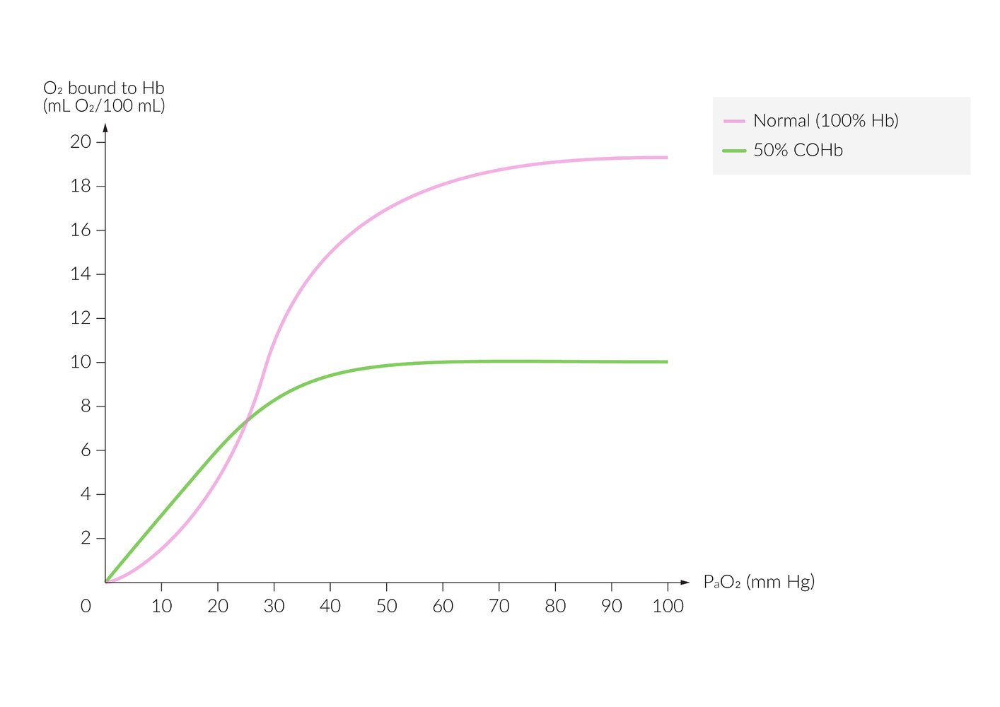
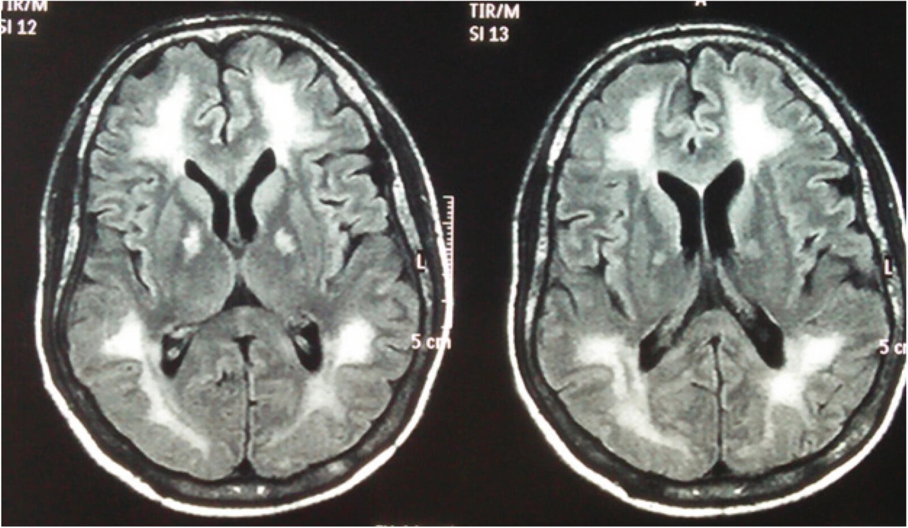

# Carbon monoxide toxicity

*Categories: Clinical knowledge > Emergency medicine > Toxicologic disorders > Carbon monoxide toxicity*

[Original Article Link](https://coursology-qbank.com/amboss/article/Zq0ZCS)

---

## Summary

<u>Carbon monoxide</u> (CO) toxicity causes tissue <u>hypoxia</u> via multiple mechanisms and is most commonly due to exposure to house fires, wood-burning stoves, or motor vehicle exhaust fumes. Symptoms are variable and nonspecific and include <u>nausea</u>, <u>headache</u>, and fatigue. Importantly, <u>pulse oximetry</u> will often show a normal waveform because standard <u>pulse</u> oximeters are unable to differentiate between <u>oxyhemoglobin</u> and <u>carboxyhemoglobin</u> (<u>COHb</u>). CO toxicity should be suspected in any individual with a history of exposure and symptoms consistent with CO toxicity, and the diagnosis can be confirmed by an elevated <u>COHb</u> level on <u>CO oximetry</u>. Management consists of 100% <u>supplemental oxygen</u> and possibly <u>hyperbaric oxygen</u>. In addition, <u>supportive care</u> should be provided with a focus on <u>airway management</u> and oxygenation. <u>Chronic CO poisoning</u> may also occur when individuals are chronically exposed to low levels of CO; symptoms are nonspecific and treatment consists of eliminating the source of CO exposure.

---

## Etiology

* House fires, wood-burning stoves/gas heaters, motor vehicle exhaust, furnaces in enclosed and poorly ventilated spaces, extensive water pipe smoking  [[2]](https://coursology-qbank.com/amboss/article/YtanXm)

* Often involves multiple individuals (e.g., family) during the winter

* Intentional <u>poisoning</u> (may be a method of self-harm or <u>suicide attempt</u>)

> [!TIP]
> Multiple patients presenting with similar clinical features from a common location (e.g., a residence or workplace) should raise suspicion for CO exposure.

---

## Pathophysiology

* Properties: colorless, odorless, and tasteless gas

* Pathophysiology

* The affinity of <u>hemoglobin</u> for CO is ∼ 240 times stronger than for O2 → formation of <u>COHb</u> (<u>carboxyhemoglobin</u>)

* ↑ <u>COHb</u> causes tissue <u>hypoxia</u> via the following mechanisms:

* Decreased oxygen-carrying capacity of <u>hemoglobin</u>

* Shift in the <u>O2 dissociation curve</u> to the left → ↑ affinity for O2→ ↓ release of O2 in tissue

* Binding of CO to <u>myoglobin</u> → cardiac <u>ischemia</u> → decreased <u>cardiac output</u>

* CO inhibits <u>mitochondrial</u> <u>cytochrome c oxidase</u> → defective <u>oxidative phosphorylation</u> → ↑ anaerobic metabolism with ↓ <u>ATP</u> production and <u>hypoxia</u>

* CO inhibits cytochrome p450 in the <u>brain</u> → lipid peroxidation and <u>leukocyte</u>-mediated inflammatory damage → <u>cerebral edema</u>

Oxygen dissociation curve for carbon monoxide poisoning

Oxygen-hemoglobin dissociation curve

---

## Clinical features

The <u>correlation</u> between feature severity and <u>COHb</u> level is poor. [[3]](https://coursology-qbank.com/amboss/article/-gbDBG)[[4]](https://coursology-qbank.com/amboss/article/fGYkAq)[[5]](https://coursology-qbank.com/amboss/article/gGYFAq)[[6]](https://coursology-qbank.com/amboss/article/2ZbTaH)[[7]](https://coursology-qbank.com/amboss/article/bZbHZH)

* Nonspecific symptoms

* <u>Headache</u>

* <u>Dizziness</u>

* Fatigue

* <u>Nausea</u>/<u>vomiting</u>

* <u>Neurotoxicity</u>

* <u>Altered mental status</u> (e.g., <u>agitation</u>, confusion, <u>somnolence</u>, <u>memory</u> loss)

* <u>Seizures</u>

* <u>Loss of consciousness</u>/<u>coma</u>

* Cardiorespiratory toxicity

* <u>Inhalation injury</u>: associated with fire-related exposures

* <u>Chest pain</u>

* <u>Shortness of breath</u>

* <u>Shock</u>

* <u>Respiratory failure</u>

* Other classical signs

* Cherry-red skin with <u>bullous</u> <u>skin</u> lesions: after exposure to high levels (rare and usually seen postmortem)

* Fundoscopic findings: bright red retinal <u>veins</u>, <u>retinal hemorrhages</u>, <u>papilledema</u> (indicative of <u>cerebral edema</u>)

* Symptoms of concurrent <u>cyanide poisoning</u>: See <u>cyanide</u>.

* Standard <u>pulse oximetry</u>: normal-appearing or ↑ <u>SpO2</u> (as <u>pulse</u> oximeters cannot distinguish between <u>COHb</u> and <u>oxyhemoglobin</u>)
* Portable <u>pulse</u> <u>CO oximetry</u> may show abnormal <u>COHb</u>  [[3]](https://coursology-qbank.com/amboss/article/-gbDBG)

> [!TIP]
> Clinical features do not correlate well with the <u>COHb</u> level. [[4]](https://coursology-qbank.com/amboss/article/fGYkAq)[[5]](https://coursology-qbank.com/amboss/article/gGYFAq)[[6]](https://coursology-qbank.com/amboss/article/2ZbTaH)

> [!WARNING]
> <u>SpO2</u> is not useful when screening for CO <u>poisoning</u>! Oximeters cannot distinguish between <u>COHb</u> and <u>oxyhemoglobin</u>.

> [!WARNING]
> Manifestations of CO <u>poisoning</u> may be atypical in children (e.g., isolated <u>seizure</u> episode, isolated <u>vomiting</u>). [[8]](https://coursology-qbank.com/amboss/article/Y11n2f0)

---

## Diagnosis

### Diagnostic triad

Ideally, all three criteria should be present to confirm acute <u>poisoning</u>, but symptoms vary widely and the history of exposure is not always evident.  [[3]](https://coursology-qbank.com/amboss/article/-gbDBG)

* Any symptoms of CO <u>poisoning</u> (see “Clinical features”)

* Exposure to CO source (see “Etiology”)

* Abnormal <u>COHb</u> level on venous/arterial <u>CO oximetry</u> [[3]](https://coursology-qbank.com/amboss/article/-gbDBG)[[9]](https://coursology-qbank.com/amboss/article/H8dKL70)

* ≥ 2% in nonsmokers

* ≥ 10% in smokers

> [!WARNING]
> Start 100% oxygen immediately if clinical suspicion for CO <u>poisoning</u> is high! Diagnostic workup should not delay oxygen administration (see treatment).

### <u>Laboratory studies</u>

* <u>Blood gas</u> (venous or arterial)

* <u>CO oximetry</u> with spectrophotometry [[10]](https://coursology-qbank.com/amboss/article/5hbiet)

* <u>Gold standard</u> for diagnosis

* The <u>COHb</u> level is used to guide therapeutic decisions.

* Also measures <u>methemoglobin</u> levels

* <u>PaO2</u>: usually appears normal

* <u>pH</u>: Tissue <u>hypoxia</u> may lead to <u>high anion-gap metabolic acidosis</u>.  [[4]](https://coursology-qbank.com/amboss/article/fGYkAq)

* Other routine <u>laboratory studies</u>: serum <u>lactate</u>, <u>BMP</u>, <u>pregnancy test</u>

### Additional studies

Screen for affected organs and toxic coingestions.

* <u>Inhalation injury</u>: <u>airway</u> examination (e.g., <u>direct laryngoscopy</u>)  [[11]](https://coursology-qbank.com/amboss/article/fZbkaH)

* Cardiac toxicity [[6]](https://coursology-qbank.com/amboss/article/2ZbTaH)[[7]](https://coursology-qbank.com/amboss/article/bZbHZH)

* All patients:

* <u>ECG</u>;  and <u>cardiac monitor</u> for 4–6 hours : Findings may include signs of <u>myocardial</u> <u>ischemia</u>;  and/or <u>arrhythmias</u>.

* <u>Chest x-ray</u>: may show <u>cardiogenic pulmonary edema</u> [[8]](https://coursology-qbank.com/amboss/article/Y11n2f0)[[9]](https://coursology-qbank.com/amboss/article/H8dKL70)

* Select patients ; : <u>cardiac enzymes</u> and <u>echocardiography</u>
* Findings may include increased <u>troponin</u> and/or cardiac hypomotility.

* Neurological toxicity: CT/<u>MRI</u> <u>brain</u> ;  [[6]](https://coursology-qbank.com/amboss/article/2ZbTaH)

* Indications 

* Symptomatic patients (e.g., <u>altered mental status</u>)

* Unconscious patients

* Signs of <u>extrapyramidal syndrome</u> (e.g., rigidity)

* <u>Retinal hemorrhage</u> (good indicator of <u>CNS</u> toxicity)

* Findings

* The <u>globus pallidus</u> is commonly affected (unspecific findings, usually bilateral ).

* <u>White matter</u> changes

* <u>Cerebral edema</u>

* Toxic coingestions: If intentional <u>poisoning</u> is suspected, screen for other substances: e.g., <u>acetaminophen</u>, <u>salicylates</u>, <u>alcohol</u> (see <u>acetaminophen toxicity</u> and <u>salicylate toxicity</u>).  [[4]](https://coursology-qbank.com/amboss/article/fGYkAq)

Hyperintensity of the globus pallidus bilaterally

---

## Differential diagnoses

| Carbon monoxide poisoning vs. cyanide poisoning |  |  |
| --- | --- | --- |
|  | <u>Carbon monoxide</u> <u>poisoning</u> | <u>Cyanide poisoning</u> |
| Etiology |   * House fires, wood-burning stoves/gas heaters, furnaces in enclosed and poorly ventilated spaces  * Motor vehicle exhaust fumes  * Can affect multiple individuals from the same location, especially during the winter (e.g., family members sharing a heating device)    |   * Fires: combustion of certain substances (e.g., plastics, upholstery, rubber)  * Food containing <u>cyanide</u> or amygdalin (e.g., cassava, apricot seeds, bitter almonds)  * Long-term or high-dose treatment with <u>sodium nitroprusside</u>    |
| Change in <u>oxygen-myoglobin dissociation curve</u> |  * <u>Shift to the left</u>   |  * Usually normal   |
| Clinical features |   * <u>Headache</u>, <u>dizziness</u>. fatigue, <u>nausea</u>/<u>vomiting</u>  * <u>Altered mental status</u>, <u>seizures</u>, <u>loss of consciousness</u>/<u>coma</u>  * <u>Inhalation injury</u>: associated with exposure to fire  * Postmortem: <u>cherry-red skin</u> with <u>bullous</u> <u>skin</u> lesions    |   * Breath smells of bitter almonds  * Confusion, <u>agitation</u>, <u>vertigo</u>, <u>headache</u>, <u>seizures</u>, <u>coma</u>  * <u>Nausea</u>, <u>vomiting</u>  * <u>Cardiac arrhythmia</u>  * <u>Dyspnea</u>, <u>respiratory failure</u>  * Flushing of the <u>skin</u>  * Postmortem: bright red <u>livor mortis</u> (<u>cherry red skin</u>)    |
| Laboratory measurements |   * Abnormal <u>COHb</u> level on venous/arterial <u>CO oximetry</u>  * <u>PaO2</u>: usually normal  * <u>High anion-gap metabolic acidosis</u>    |   * <u>PaO2</u>: normal  * <u>High anion gap metabolic acidosis</u> (↑ <u>lactate</u>)    |
| CT/<u>MRI</u> <u>brain</u> |  * The <u>globus pallidus</u> is commonly affected.   |  * The <u>globus pallidus</u> is rarely affected.   |
| Management |   * Administration of 100% oxygen  * <u>Hyperbaric oxygen</u> in severe cases    |   * Patient decontamination  * Administration of 100% oxygen  * <u>Antidotes</u>: <u>hydroxycobalamin</u>, <u>sodium nitrite</u>/<u>amyl nitrite</u>, or <u>sodium thiosulfate</u>    |

Oxygen dissociation curve for carbon monoxide poisoning

The differential diagnoses listed here are not exhaustive.

---

## Management

Patients often arrive in critical condition or <u>comatose</u>, which requires an <u>ABCDE approach</u>. <u>Oxygen therapy</u> is considered first-line treatment. Local authorities (e.g., <u>public health</u>, poison control) should be notified early due to the environmental risk of CO. [[4]](https://coursology-qbank.com/amboss/article/fGYkAq)[[6]](https://coursology-qbank.com/amboss/article/2ZbTaH)[[7]](https://coursology-qbank.com/amboss/article/bZbHZH)[[11]](https://coursology-qbank.com/amboss/article/fZbkaH)

### <u>Oxygen therapy</u>

* Administer 100% oxygen immediately via <u>nonrebreather facemask</u>.

* Treatment endpoints

* Patient asymptomatic for at least 6 hours

* <u>COHb</u> level normalizes (< 3–5%)

### <u>Hyperbaric oxygen</u> (<u>HBOT</u>) [[3]](https://coursology-qbank.com/amboss/article/-gbDBG)[[4]](https://coursology-qbank.com/amboss/article/fGYkAq)[[12]](https://coursology-qbank.com/amboss/article/p8dLn70)

* The benefits of <u>hyperbaric oxygen</u> have not been conclusively demonstrated.  [[8]](https://coursology-qbank.com/amboss/article/Y11n2f0)

* The following are considered relative indications:

* <u>COHb</u> > 25%

* Pregnant women with a <u>COHb</u> > 15%

* Neurological manifestations (e.g., confusion, <u>loss of consciousness</u>, <u>seizures</u>, <u>focal neurological deficits</u>)

* Acute <u>myocardial</u> <u>ischemia</u>

* Severe <u>acidosis</u> (<u>pH</u> < 7.15)

* Age > 35 years

* Exposure ≥ 24 hours

* Post-<u>cardiac arrest</u>  [[13]](https://coursology-qbank.com/amboss/article/HCYKtr)

* <u>HBOT</u> is likely safe to use in children and may help prevent neurological sequelae of CO <u>poisoning</u>.   [[8]](https://coursology-qbank.com/amboss/article/Y11n2f0)[[14]](https://coursology-qbank.com/amboss/article/98dNK70)

### Management of systemic involvement and <u>supportive care</u> [[4]](https://coursology-qbank.com/amboss/article/fGYkAq)

* <u>Secure airway</u>: Consider early <u>intubation</u> in patients with <u>inhalation injury</u> or severely impaired mental status  (see <u>airway management</u>).

* Evidence of cardiac toxicity (e.g., <u>arrhythmias</u>, <u>ischemia</u>): urgent cardiology consult, <u>continuous cardiac rhythm monitoring</u>

* <u>Metabolic acidosis</u>: [[6]](https://coursology-qbank.com/amboss/article/2ZbTaH)

* Improve <u>perfusion</u> (e.g., fluids, oxygen).

* Avoid <u>sodium bicarbonate</u>.

* <u>Treat acute seizures</u> (see “<u>Management of acute seizures and status epilepticus</u>”).

* Pulmonology and toxicology consultations.

* Suspicion of concomitant <u>cyanide poisoning</u> [[4]](https://coursology-qbank.com/amboss/article/fGYkAq)[[15]](https://coursology-qbank.com/amboss/article/WFYPSI)

* Administer <u>antidotes for cyanide poisoning</u>.

* Indications

* House fire as the source of CO toxicity

* <u>pH</u> < 7.2

* <u>Lactate</u> ≥ 10 mmol/L

* Suspicion of intentional <u>poisoning</u>

* Evaluate for <u>suicidal ideation</u>

* Obtain a psychiatric consultation and consider involuntary psychiatric hold.

> [!TIP]
> <u>pH</u> < 7.2, exposure to fire, <u>loss of consciousness</u>, higher <u>COHb</u> level, and need for <u>endotracheal intubation</u> are all associated with higher short-term mortality. [[3]](https://coursology-qbank.com/amboss/article/-gbDBG)

> [!WARNING]
> Pediatric patients require judicious <u>fluid replacement</u> therapy due to risk of development or worsening of <u>cerebral edema</u> from <u>volume overload</u>. [[3]](https://coursology-qbank.com/amboss/article/-gbDBG)[[8]](https://coursology-qbank.com/amboss/article/Y11n2f0)[[16]](https://coursology-qbank.com/amboss/article/ilYJ96)

### Monitoring and <u>level of care</u> [[3]](https://coursology-qbank.com/amboss/article/-gbDBG)[[11]](https://coursology-qbank.com/amboss/article/fZbkaH)

* Continuous <u>telemetry</u>

* Serial <u>neurologic examination</u> (i.e., <u>GCS</u> and <u>pupillary reflexes</u>)

* Serial <u>COHb</u> monitoring (e.g., every 6 hours)

* Indications for <u>ICU</u> admission

* <u>Inhalation injury</u> requiring close monitoring or <u>intubation</u>

* Cardiac <u>ischemia</u>

* <u>Cerebral edema</u>: See <u>ICP management</u>.

* Consider transfer to <u>HBOT</u> center.

---

## Chronic carbon monoxide poisoning

### Pathophysiology [[3]](https://coursology-qbank.com/amboss/article/-gbDBG)

* Exposure to prolonged low levels of CO

* Chronic mild <u>hypoxia</u> → ↑ <u>erythropoietin</u> → <u>erythrocytosis</u>, <u>polycythemia</u>, ↑ <u>hemoglobin</u>

* Chronic <u>CNS</u> effects: unclear mechanism (probably <u>anoxia</u> and <u>ischemia</u>)

### Clinical features [[7]](https://coursology-qbank.com/amboss/article/bZbHZH)[[17]](https://coursology-qbank.com/amboss/article/uSbpYt)

Symptoms are often non-specific.

* Chronic fatigue

* Neurologic symptoms 

* Cognitive impairment

* <u>Paresthesias</u>

* <u>Vertigo</u>

* <u>Headache</u>

* Abdominal <u>pain</u>/<u>diarrhea</u>

* Recurrent infections

* Exacerbation of chronic illness (e.g., <u>coronary artery disease</u>)

### Diagnostics [[7]](https://coursology-qbank.com/amboss/article/bZbHZH)[[17]](https://coursology-qbank.com/amboss/article/uSbpYt)

* Very challenging and often missed

* Patients typically present with long-term nonspecific complications.

* <u>COHb</u> levels are often below the toxic threshold.

* Environmental CO measurement is usually required to confirm chronic low-level exposure.

* Suspect in the following scenarios:

* Multiple patients from the same location with similar nonspecific symptoms

* Unexplained neurologic symptoms

* Clinical features of CO <u>poisoning</u> with <u>polycythemia</u>

* Imaging (CT or <u>MRI</u>)

* Usually part of the diagnostic workup of patients presenting with unclear neurologic symptoms

* Findings are typically inconclusive (e.g., <u>atrophy</u>, unspecific hyperintensities) and do not confirm the diagnosis.

* Useful to rule out differential diagnoses (e.g., <u>dementia</u>)

### Management [[7]](https://coursology-qbank.com/amboss/article/bZbHZH)[[17]](https://coursology-qbank.com/amboss/article/uSbpYt)

* Consists of removing the source of CO

* No specific treatment available

* If <u>COHb</u> levels are measurably high (which is uncommon), patients may benefit from acute management (e.g., 100% oxygen).

---