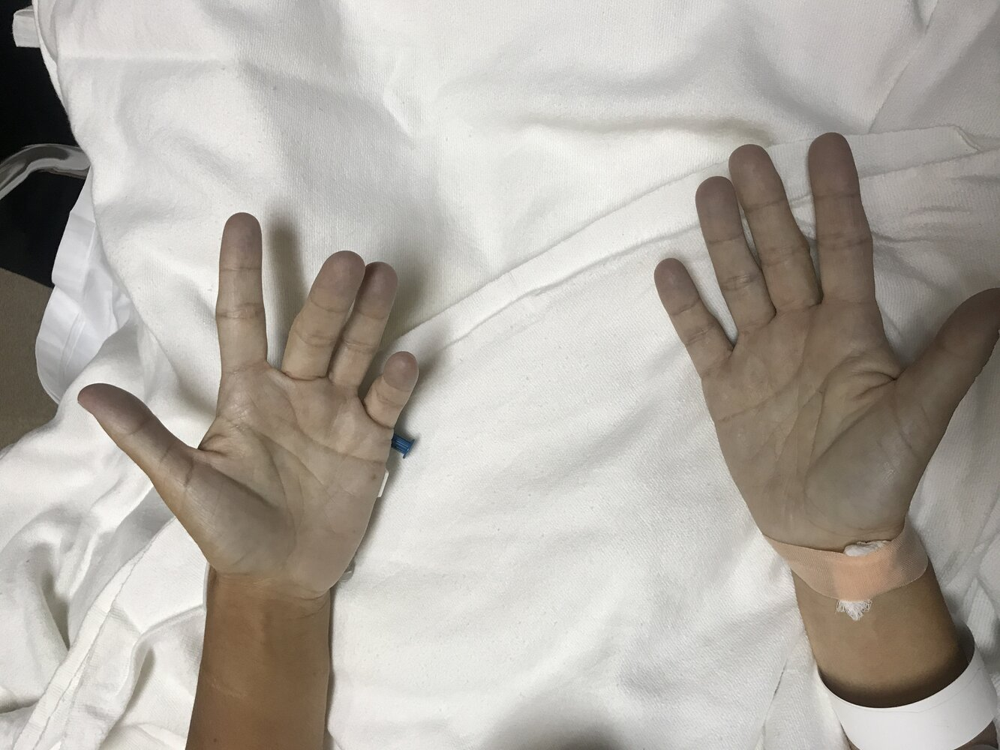

# Methemoglobinemia

*Categories: Clinical knowledge > Emergency medicine > Toxicologic disorders > Methemoglobinemia*

[Original Article Link](https://coursology-qbank.com/amboss/article/j80_m3)

---

## Summary

Methemoglobinemia is a condition in which more than 1% of <u>hemoglobin</u> contains <u>iron</u> in its oxidized form and cannot participate in <u>oxygen delivery</u>. Methemoglobinemia can be inherited but is more commonly an acquired condition that follows exposure to <u>local anesthetics</u>, <u>dapsone</u>, <u>nitrates</u>, or other chemicals. Symptoms typically do not begin until <u>methemoglobin</u> makes up over 10% of the total <u>hemoglobin</u> and include <u>cyanosis</u>, fatigue, and <u>tachycardia</u>. Diagnostic findings include decreased conventional <u>pulse</u> oximeter saturation readings that remain fixed around 85%, direct <u>methemoglobin</u> elevation on <u>CO-oximetry</u>, and blood that appears dark brown. All patients receive supportive treatment, e.g., oxygen and IV hydration. Patients who are symptomatic and/or have <u>methemoglobin</u> levels > 30% are typically treated with <u>methylene blue</u>.

---

## Definitions

* Methemoglobin

* A form of <u>hemoglobin</u> in which an <u>iron</u> molecule has been oxidized from a ferrous (Fe2+) to a ferric (Fe3+) state

* Cannot bind oxygen

* Normally < 1% of total <u>hemoglobin</u>

* Methemoglobinemia: a blood concentration of <u>methemoglobin</u> greater than 1%

---

## Etiology

### Acquired methemoglobinemia [[3]](https://coursology-qbank.com/amboss/article/pgWLwk0)[[4]](https://coursology-qbank.com/amboss/article/uG1pai0)[[5]](https://coursology-qbank.com/amboss/article/AN1Rdh0)

<u>Acquired methemoglobinemia</u> is the most common form of methemoglobinemia and occurs as a result of exposure to substances that increase <u>methemoglobin</u> levels.

#### Medications

* <u>Local anesthetics</u>: <u>benzocaine</u>, <u>lidocaine</u>

* <u>Vasodilators</u>: <u>inhaled nitric oxide</u>, <u>nitroglycerin</u>, isosorbide <u>mono</u>- and dinitrate (See also “<u>Cardiovascular drug toxicity</u>.”)

* Antiinfectious agents: <u>dapsone</u>, <u>sulfonamides</u>, <u>primaquine</u>  [[6]](https://coursology-qbank.com/amboss/article/5Ydipo0)

* Other: <u>phenazopyridine</u>, <u>metoclopramide</u>, <u>aniline</u> derivatives

> [!WARNING]
> Have a high index of suspicion for methemoglobinemia in patients with <u>symptoms of hypoxia</u> who have recently received topical <u>benzocaine</u>, e.g., during <u>TEE</u> or endoscopy. [[7]](https://coursology-qbank.com/amboss/article/ppWLqm0)

> [!TIP]
> Patients who are taking <u>dapsone</u> on a sustained basis, e.g., as <u>PCP prophylaxis</u> or as <u>treatment of leprosy</u>, should be monitored for methemoglobinemia. [[8]](https://coursology-qbank.com/amboss/article/YtWnXM0)[[9]](https://coursology-qbank.com/amboss/article/ctWacM0)

#### Food and water [[10]](https://coursology-qbank.com/amboss/article/7pW4Im0)

In the <u>gastrointestinal tract</u>, <u>nitrates</u> are partially converted to nitrites, which catalyze the conversion of <u>oxyhemoglobin</u> to <u>methemoglobin</u>.

* <u>Sodium</u> nitrites: used to cure meat and some cheeses

* <u>Nitrates</u>: found in high concentration in some vegetables, e.g., spinach, beets, carrots

* Drinking water contamination: increased <u>nitrate</u> concentration, usually related to nearby agricultural activity

> [!TIP]
> <u>Infants</u> and children have an increased risk of methemoglobinemia after <u>nitrate</u> ingestion because they have lower <u>methemoglobin reductase</u> levels. [[11]](https://coursology-qbank.com/amboss/article/WtWPcM0)[[12]](https://coursology-qbank.com/amboss/article/-GWDbM0)

### Hereditary methemoglobinemia [[3]](https://coursology-qbank.com/amboss/article/pgWLwk0)[[4]](https://coursology-qbank.com/amboss/article/uG1pai0)

* <u>NADH</u>-<u>cytochrome b5 reductase</u> deficiency (<u>autosomal recessive</u>)

* <u>Glucose-6-phosphate dehydrogenase (G6PD) deficiency</u>  [[13]](https://coursology-qbank.com/amboss/article/AGWRbM0)

* Congenital methemoglobinemia (M hemoglobins)

---

## Pathophysiology

* <u>Methemoglobin</u> is created when reduced ferrous <u>iron</u> (Fe2+) bound to <u>oxyhemoglobin</u> is oxidized to ferric <u>iron</u> (Fe3+).

* Ferric <u>iron</u> in <u>methemoglobin</u> cannot bind oxygen→ ↓ total blood oxygen content and ↓ blood oxygen saturation → tissue <u>hypoxia</u>

* <u>Oxygen-hemoglobin dissociation curve</u> also shifts to the left in methemoglobinemia → further decrease in <u>oxygen delivery</u>

> [!NOTE]
> The ferric <u>iron</u> in <u>methemoglobin</u> has a high affinity for <u>cyanide</u>, thus, <u>amyl nitrite</u>-induced <u>methemoglobin</u> is used as a <u>competitive inhibitor</u> in the treatment of <u>cyanide poisoning</u>. [[5]](https://coursology-qbank.com/amboss/article/AN1Rdh0)

---

## Clinical features

The clinical presentation depends on the concentration of <u>methemoglobin</u>, how fast the concentration has increased, and patient comorbidities, e.g., <u>anemia</u>. [[3]](https://coursology-qbank.com/amboss/article/pgWLwk0)

|  Clinical features of methemoglobinemia [[3]](https://coursology-qbank.com/amboss/article/pgWLwk0)[[4]](https://coursology-qbank.com/amboss/article/uG1pai0)  |  |
| --- | --- |
| <u>Methemoglobin</u> level | Signs and symptoms |
| < 10% |  * None   |
| 10–30% |   * <u>Cyanosis</u> (brownish-blue or gray <u>skin</u> and membranes)  * Asymptomatic or mild confusion, <u>headaches</u>, and <u>dyspnea</u>    |
| 30–50% |   * Symptoms of <u>oxygen deprivation</u>  * Confusion  * <u>Lightheadedness</u> and/or <u>syncope</u>  * <u>Headache</u>  * <u>Dyspnea</u>  * <u>Tachycardia</u>    |
| 50–70% |   * <u>CNS depression</u>  * <u>Seizures</u>  * <u>Chest pain</u>  * <u>Arrhythmias</u>    |
| > 70% |  * <u>Death</u>   |

> [!WARNING]
> Always suspect methemoglobinemia in a patient with unexplained <u>cyanosis</u> and <u>hypoxemia</u>. [[3]](https://coursology-qbank.com/amboss/article/pgWLwk0)

> [!TIP]
> The symptoms of methemoglobinemia are similar to those of <u>anemia</u> because the concentration of functioning <u>oxyhemoglobin</u> is decreased in both conditions. [[3]](https://coursology-qbank.com/amboss/article/pgWLwk0)

> [!TIP]
> <u>Cyanosis</u> typically occurs when <u>methemoglobin</u> levels are ≥ 1.5 g/dL (∼10% of total <u>hemoglobin</u>). [[2]](https://coursology-qbank.com/amboss/article/Y11n2f0)

Cyanosis secondary to methemoglobinemia

---

## Diagnosis

The clinical history of a patient with <u>cyanosis</u> and/or <u>hypoxia</u> may lead to a preliminary diagnosis of methemoglobinemia, which can be rapidly confirmed with <u>CO-oximetry</u>.

### Basic diagnostics [[4]](https://coursology-qbank.com/amboss/article/uG1pai0)[[5]](https://coursology-qbank.com/amboss/article/AN1Rdh0)

* <u>Pulse oximetry</u>

* Conventional <u>pulse</u> oximeter: The displayed <u>oxygen saturation</u> is decreased and often fixed ∼ 85%.  [[4]](https://coursology-qbank.com/amboss/article/uG1pai0)

* <u>CO-oximeter</u>: direct measurement of <u>methemoglobin</u>; displayed as the percentage of total <u>hemoglobin</u>

* <u>ABG</u>

* Normal <u>PaO2</u> but decreased total oxygen content, i.e., a <u>saturation gap</u> [[14]](https://coursology-qbank.com/amboss/article/htWcWM0)[[15]](https://coursology-qbank.com/amboss/article/3tWSWM0)

* <u>Metabolic acidosis</u>

* <u>Bedside testing</u>: Blood appears dark brown (“chocolate-colored”) and does not turn red with exposure to oxygen.

### Additional diagnostics [[5]](https://coursology-qbank.com/amboss/article/AN1Rdh0)

* <u>CBC</u>: to evaluate for <u>anemia</u>

* <u>CXR</u>: to evaluate for respiratory causes of <u>cyanosis</u>

* <u>ECG</u>, <u>echocardiogram</u>: to evaluate for cardiac causes of <u>hypoxia</u>

---

## Treatment

### Approach [[2]](https://coursology-qbank.com/amboss/article/Y11n2f0)[[3]](https://coursology-qbank.com/amboss/article/pgWLwk0)

* Initial management

* Stop exposure to any known precipitant (see “Etiology”).

* Wear <u>PPE</u> and initiate <u>body surface decontamination</u> for patients exposed to <u>anilines</u> or pesticides.

* Provide <u>supportive care</u>: <u>oxygen therapy</u>, cardiac support, <u>fluid resuscitation</u>, <u>treatment of hypoglycemia</u>

* Call poison control for <u>acquired methemoglobinemia</u>; the US National Poison Help line is 1-800-222-1222.

* Definitive treatment

* Begin definitive treatment with <u>methylene blue</u> and/or <u>reducing agents</u> if <u>methemoglobin</u> level is > 30% or the patient is symptomatic.

* Monitor asymptomatic patients with <u>methemoglobin</u> levels < 30% for resolution.  [[2]](https://coursology-qbank.com/amboss/article/Y11n2f0)

> [!WARNING]
> In patients with <u>acquired methemoglobinemia</u>, assess for potential triggers and stop exposure immediately.

### Methylene blue [[2]](https://coursology-qbank.com/amboss/article/Y11n2f0)[[3]](https://coursology-qbank.com/amboss/article/pgWLwk0)[[4]](https://coursology-qbank.com/amboss/article/uG1pai0)

<u>Methylene blue</u> is the first-line treatment for <u>acquired methemoglobinemia</u>.  [[3]](https://coursology-qbank.com/amboss/article/pgWLwk0)

* Indications: <u>acquired methemoglobinemia</u> with

* <u>Methemoglobin</u> level > 30%

* Or symptoms of <u>oxygen deprivation</u>

* Initial dosing: <u>methylene blue</u> DOSAGE

* Subsequent dosing

* Repeat initial dose once after 60 minutes if symptoms persist or the <u>methemoglobin</u> level remains > 30%.

* Additional dosing may be required if there is continued GI absorption or slow metabolism of the precipitating agent, e.g., <u>dapsone</u>.

* If there is no improvement after 2 doses, consider the possibility of severe <u>G6PD deficiency</u> or an alternate diagnosis.

* <u>Relative contraindications</u>

* <u>G6PD deficiency</u>: may precipitate acute <u>hemolysis</u>  [[3]](https://coursology-qbank.com/amboss/article/pgWLwk0)

* <u>MAO inhibitor</u> or selective <u>serotonin</u> uptake inhibitor use: may precipitate <u>serotonin syndrome</u> [[4]](https://coursology-qbank.com/amboss/article/uG1pai0)[[16]](https://coursology-qbank.com/amboss/article/qtWCeM0)

* <u>Pregnancy</u>: <u>Methylene blue</u> is a known <u>teratogen</u>.

> [!WARNING]
> Avoid over-administration of <u>methylene blue</u>; doses ≥ 7 mg/kg can directly oxidize <u>hemoglobin</u> to <u>methemoglobin</u> and worsen methemoglobinemia. [[2]](https://coursology-qbank.com/amboss/article/Y11n2f0)

> [!TIP]
> <u>Methylene blue</u> will cause a transient decrease in the <u>pulse</u> oximeter saturation readings because it absorbs light with a frequency of 660 nm. [[2]](https://coursology-qbank.com/amboss/article/Y11n2f0)

### Alternative treatments [[3]](https://coursology-qbank.com/amboss/article/pgWLwk0)[[4]](https://coursology-qbank.com/amboss/article/uG1pai0)

Alternative treatments may be considered if <u>methylene blue</u> is unavailable, ineffective, or contraindicated.

* Reducing agents: <u>ascorbic acid</u> (<u>vitamin C</u>) or <u>riboflavin</u>

* Reduce <u>methemoglobin</u> to <u>hemoglobin</u>, but less efficiently than <u>methylene blue</u>

* Used primarily for inherited methemoglobinemia or as an adjunct to <u>methylene blue</u>

* <u>Hyperbaric oxygen therapy</u>

* Whole blood <u>exchange transfusion</u>

### Disposition [[5]](https://coursology-qbank.com/amboss/article/AN1Rdh0)

Admit the patient if any of the following conditions apply:

* Symptoms are present

* <u>Methemoglobin</u> level is > 15%

* <u>Methylene blue</u> was administered

---