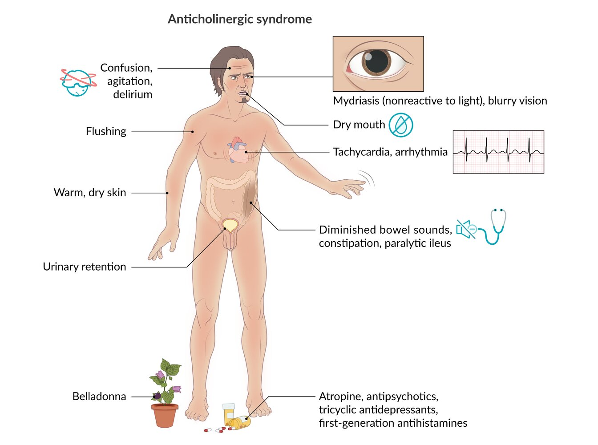

# Muscarinic antagonists

*Categories: Clinical knowledge > Emergency medicine > Toxicologic disorders > Muscarinic antagonists*

[Original Article Link](https://coursology-qbank.com/amboss/article/sN0tcg)

---

## Summary

Muscarinic <u>antagonists</u> (antimuscarinic agents) are a group of <u>anticholinergic drugs</u> that <u>competitively inhibit</u> <u>postganglionic</u> <u>muscarinic receptors</u>. As such, they have a variety of applications that involve the <u>parasympathetic nervous system</u>. Which organ systems are most affected by an antimuscarinic agent depends on the specific characteristics of the agent, particularly its <u>lipophilicity</u>. <u>Lipophilic</u> agents (i.e., <u>atropine</u> or <u>benztropine</u>) are able to cross the <u>blood-brain</u> barrier and therefore affect the <u>central nervous system</u> (<u>CNS</u>) in addition to other organ systems. Less <u>lipophilic</u> agents (i.e., <u>ipratropium</u> or <u>butylscopolamine</u>) are administered if the <u>CNS</u> does not need to be targeted, specifically for respiratory (e.g., <u>asthma</u>), gastrointestinal (e.g., <u>irritable bowel syndrome</u>), or genitourinary applications (e.g., <u>urinary incontinence</u>). Numerous adverse effects have been reported, the most common of which is dry mouth. An overdose can result in <u>anticholinergic syndrome</u>, which manifests in <u>disorientation</u>, <u>hyperthermia</u>, <u>tachycardia</u>, and/or <u>coma</u>. To avoid toxicity, it is especially important to consider the <u>anticholinergic effects</u> of other drug classes before administering muscarinic <u>antagonists</u>.

---

## Overview

### Mechanism of action

* Anticholinergic agents block the <u>neurotransmitter</u> <u>acetylcholine</u> in the central and <u>peripheral nervous system</u>. 

* Muscarinic <u>antagonists</u>: inhibit the effect of <u>acetylcholine</u> on <u>muscarinic receptors</u> (the majority of <u>anticholinergic drugs</u>)

* Antinicotinic agents: inhibit the effects of <u>acetylcholine</u> on <u>nicotinic receptors</u> (mostly <u>skeletal muscle relaxants</u>).

* Antinicotinic agents are discussed in the “<u>Skeletal muscle relaxants</u>” article; the effects of <u>muscarinic receptors</u> are discussed in the “<u>Autonomic nervous system</u>” article.

#### Effects of muscarinic <u>antagonists</u>

| Overview of the effects of <u>muscarinic receptors</u> blockage |  |  |
| --- | --- | --- |
|  <u>Muscarinic receptors</u>  | Organ/Tissue | Effects |
| M1, M4, M5 | <u>Central nervous system</u> |  * Influences neurologic function (e.g., cognitive impairment)   |
| M2 |  <u>Heart</u>   |   * ↑ <u>Heart</u> rate  * Increases AV-node conduction (may lead to <u>tachyarrhythmia</u>)    |
| <u>M3</u> | <u>Smooth muscle</u> |   * <u>Gastrointestinal tract</u>  * ↓ Intestinal <u>peristalsis</u>  * ↓ Salivary and <u>gastric secretions</u>  * <u>Urinary tract</u>: ↓ <u>Bladder</u> contraction (↓ <u>detrusor</u> muscle tone, ↑ internal <u>urethral sphincter</u> tone)  * <u>Airway</u>  * Bronchodilation  * ↓ Bronchial secretions  * <u>Eye</u>  * <u>Mydriasis</u> → narrowing of the <u>iridocorneal angle</u>  * Impaired <u>accommodation</u>  * <u>Blood vessels</u>: minimal effect on vascular tone and blood pressure    |
| <u>Exocrine glands</u> |  * ↓ Secretions (sweat)   |  |

### Important muscarinic <u>antagonists</u>

| List of antimuscarinic agents |  |  |  |  |
| --- | --- | --- | --- | --- |
| Chemical characteristics | Drug | Effect | Indication |  |
|  Tertiary amines <u>Lipophilic</u> (good oral <u>bioavailability</u> and <u>CNS</u> penetration)  |  * Atropine   |   * ↑ <u>Heart rate</u>  * ↓ Secretions of <u>exocrine glands</u>  * ↓ Tone and motility of <u>smooth muscles</u> (i.e., ↓ urgency in <u>cystitis</u>)  * ↓ Cholinergic overactivity in <u>CNS</u>  * <u>Mydriasis</u> and <u>cycloplegia</u>    |   * First drug of choice in unstable (symptomatic) <u>sinus bradycardia</u> (IV)  * Premedication: prior to <u>intubation</u> to decrease salivary, respiratory, and <u>gastric secretions</u>  * Ophthalmology: <u>uveitis</u>  * <u>Urinary urgency</u>, <u>urge incontinence</u>, <u>urinary frequency</u> and/or <u>nocturia</u> (symptoms resulting from, e.g., <u>overactive bladder</u> syndrome)  * <u>Antidote</u> for <u>anticholinesterase poisoning</u>:  <u>atropine</u> reverses the muscarinic effects of <u>cholinergic poisoning</u> (e.g., bronchoconstriction) but does not reverse the nicotinic effects (e.g., <u>muscle weakness</u>, <u>paralysis</u>).  * <u>Scorpion stings</u>    |  |
|  * <u>Scopolamine</u> (<u>hyoscine</u>)   |  * ↓ Vestibular disturbances (antiemetic)   |  * <u>Motion sickness</u>   |  |  |
|   * Homatropine  * Tropicamide    |   * <u>Mydriasis</u>  * Impaired <u>accommodation</u>    |  * Ophthalmology  * Therapeutic use: in patients with <u>uveitis</u>  * Diagnostic use: <u>pupillary</u> dilation to allow ocular fundus examination and <u>cycloplegia</u> to allow refractory testing   |  |  |
|   * <u>Benztropine</u>  * <u>Biperiden</u>  * <u>Trihexyphenidyl</u>    |  * ↓ Cholinergic overactivity in <u>CNS</u>   |   * Antiparkisonian effect  * ↓ Extrapyramidal symptoms (<u>EPS</u>) caused by <u>antipsychotics</u>    |  |  |
|   * Oxybutynin  * Tolterodine  * Solifenacin    |  * ↓ Tone and motility of <u>smooth muscle cells</u>   |  * ↓ <u>Bladder</u> spasms and urgency in <u>overactive bladder incontinence</u>   |  |  |
|   * Dicyclomine  * Hyoscyamine    |  * <u>Antispasmodics</u> (<u>irritable bowel syndrome</u>)   |  |  |  |
|  * Darifenacin   |  * ↑ Sphincter tone   |  * <u>Urinary urgency</u>, <u>urge incontinence</u>, <u>urinary frequency</u>, and/or <u>nocturia</u> (symptoms resulting from, e.g., <u>overactive bladder</u>)   |  |  |
|  Quarternary amines <u>Hydrophilic</u> (poor oral <u>bioavailability</u> and <u>CNS</u> penetration) |  * Butylscopolamine (<u>hyoscine</u> butylbromide)   |  * ↓ Tone and motility of the gut (<u>antispasmodic</u> effect)   |  * <u>Antispasmodics</u> for colicky <u>pain</u> (intestinal, biliary or <u>ureteric colic</u>)   |  |
|  * Glycopyrrolate   |  * ↓ GI and respiratory secretions   |   * <u>Peptic ulcer disease</u>  * Drooling  * Preoperative IV use to decrease respiratory secretions    |  |  |
|  * Ipratropium bromide   |  * Bronchodilation (Competitive inhibition of <u>muscarinic receptors</u> prevents bronchoconstriction.)   |  * <u>COPD</u> and <u>bronchial asthma</u>   |   * Short duration of action (SAMA)  * Treatment of <u>COPD</u> grade I and higher  * Acute management of refractory <u>asthma</u>    |  |
|  * Tiotropium bromide   |   * Longer duration of action (LAMA)  * Long-term treatment of <u>COPD</u> (grade II and above)    |  |  |  |

References:[[1]](https://coursology-qbank.com/amboss/article/XC09qR)[[2]](https://coursology-qbank.com/amboss/article/aqaQCl)[[3]](https://coursology-qbank.com/amboss/article/kaYmkn)[[4]](https://coursology-qbank.com/amboss/article/qaYCln)[[5]](https://coursology-qbank.com/amboss/article/HaYKNn)[[6]](https://coursology-qbank.com/amboss/article/GaYBNn)[[7]](https://coursology-qbank.com/amboss/article/taYXmn)

---

## Adverse effects

### Side effects of antimuscarinic agents

| Antimuscarinic side effects |  |  |
| --- | --- | --- |
| System | Side effect |  Contraindications  |
| Impaired secretion by <u>exocrine glands</u> |   * Dry mouth and <u>sore throat</u>  * ↓ Respiratory tract secretions  * <u>Hyperthermia</u> and warm, dry <u>skin</u>    |  * <u>Respiratory distress</u>   |
| <u>Cardiovascular system</u> |  * <u>Tachycardia</u>   |   * <u>Tachyarrhythmias</u>  * <u>Heart failure</u>  * <u>Myocardial infarction</u>  * <u>Hyperthyroidism</u>    |
| Decreased <u>smooth muscle</u> tone |   * <u>Gastroesophageal reflux</u>  * <u>Obstipation</u> or <u>ileus</u>  * Impaired <u>micturition</u>/<u>urinary retention</u>  * Vasodilatation and flush    |   * <u>Hiatal hernia</u> associated with <u>reflux esophagitis</u>  * <u>Ulcerative colitis</u>  * <u>Paralytic ileus</u>  * Obstructive disease of the <u>gastrointestinal tract</u> (e.g., <u>achalasia</u>, <u>pyloric stenosis</u> or <u>duodenal stenosis</u>)  * <u>Obstructive uropathy</u> (e.g., <u>benign prostatic hyperplasia</u>, <u>urinary retention</u>)    |
| <u>Eye</u> |   * <u>Mydriasis</u> and <u>photophobia</u>  * Blurred <u>vision</u>    |  * <u>Narrow angle glaucoma</u>   |
| <u>CNS</u> |   * Excitement, <u>agitation</u>, and <u>hallucinations</u> with the use of <u>lipophilic</u> <u>parasympatholytics</u>  (e.g., <u>atropine</u>), especially in elderly patients  * Confusion, <u>disorientation</u>  * <u>Coma</u>, <u>seizure</u>, and rarely <u>death</u>    |  * <u>Myasthenia gravis</u>   |

> [!NOTE]
> Blind as a bat (<u>mydriasis</u>), mad as a hatter (<u>delirium</u>), red as a beet (flushing), hot as a hare (<u>hyperthermia</u>), dry as a bone (decreased secretions and dry <u>skin</u>), the bowel and <u>bladder</u> lose their tone (<u>urinary retention</u> and <u>paralytic ileus</u>), and the <u>heart</u> runs alone (<u>tachycardia</u>).

### Anticholinergic syndrome (overdose)

* Etiology

* <u>Belladonna</u> <u>poisoning</u>

* Jimson <u>weed</u>/Angel's trumpet (Datura stramonium) <u>poisoning</u>: The plant contains alkaloids, such as <u>atropine</u> and <u>scopolamine</u>, which lead to <u>anticholinergic</u> intoxication and <u>mydriasis</u> (“<u>gardener's pupil</u>”).

* Medications

* <u>Anticholinergic agents</u> (e.g., <u>atropine</u>, <u>benztropine</u>, <u>trihexyphenidyl</u>)

* Drugs with <u>anticholinergic</u> properties

* Tricyclic antidepressives (predominantly <u>doxepin</u>, <u>amitriptyline</u>, <u>imipramine</u>, and <u>trimipramine</u>)

* <u>Antipsychotics</u>;  (e.g., <u>clozapine</u>, <u>quetiapine</u>)

* <u>First-generation antihistamines</u> (e.g., <u>promethazine</u>, <u>dimenhydrinate</u>)

* Clinical features

* Dry mouth, warm, flushed <u>skin</u>, thirst, <u>tachycardia</u>, <u>arrhythmias</u>, <u>mydriasis</u>, confusion, and <u>agitation</u>

* Possibly anticholinergic delirium: Excessive use of <u>tricyclic antidepressants</u> (or other medications with significant <u>anticholinergic effects</u>) can cause life-threatening <u>delirium</u>, <u>hallucinations</u>, and psychomotor symptoms.

* Diagnostics

* Clinical findings and history of exposure

* <u>Electrocardiogram</u>: to rule out QRS, <u>QTc interval prolongation</u>, and other <u>arrhythmias</u>

* Treatment: <u>antidote</u> for purely <u>anticholinergic poisoning</u> (e.g. <u>atropine</u>): <u>physostigmine</u>

* Differential diagnosis: See “<u>Differential diagnosis of drug intoxication</u>” and “<u>Differential diagnosis of drug-induced hyperthermia</u>.”

Anticholinergic syndrome

References:[[1]](https://coursology-qbank.com/amboss/article/XC09qR)[[8]](https://coursology-qbank.com/amboss/article/bqaHCl)[[9]](https://coursology-qbank.com/amboss/article/Xqa9Cl)[[10]](https://coursology-qbank.com/amboss/article/FaYgmn)

We list the most important adverse effects. The selection is not exhaustive.

---