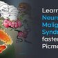

# Neuroleptic malignant syndrome

*Categories: Clinical knowledge > Emergency medicine > Toxicologic disorders > Neuroleptic malignant syndrome*

[Original Article Link](https://coursology-qbank.com/amboss/article/KH0Urh)

---

## Summary

<u>Neuroleptic</u> malignant syndrome (NMS) is a rare, life-threatening <u>adverse drug event</u> associated with <u>dopamine blocking agents</u> (e.g., <u>antipsychotic medications</u>). The clinical presentation often comprises a constellation of <u>fever</u>, <u>autonomic instability</u>, <u>leukocytosis</u>, <u>tremor</u>, elevated enzymes, and rigidity. While NMS is a diagnosis of exclusion, <u>laboratory studies</u> to support the diagnosis may show elevated <u>creatine kinase</u> (<u>CPK</u>), <u>myoglobinuria</u>, <u>leukocytosis</u>, and <u>metabolic acidosis</u>. Numerous diagnostic criteria have been proposed, but their clinical utility is debated. Management includes discontinuation of the culprit medication, supportive measures, and, in some cases, pharmacotherapy (e.g, <u>dantrolene</u>, <u>bromocriptine</u>, <u>lorazepam</u>).

Learn Neuroleptic Malignant Syndrome Faster with Picmonic (NCLEX® and USMLE, Step 1, Step 2 CK)

---

## Definitions

NMS is an <u>adverse drug event</u> associated with <u>dopamine blocking agents</u>.

---

## Etiology

* Causative agents [[2]](https://coursology-qbank.com/amboss/article/b91HNQ0)

* <u>High-potency first-generation antipsychotics</u> (most common association)

* <u>Second-generation antipsychotics</u>

* Other <u>dopamine antagonists</u>, e.g., <u>metoclopramide</u>, <u>promethazine</u> [[3]](https://coursology-qbank.com/amboss/article/X919NQ0)

* <u>Risk factors</u> [[2]](https://coursology-qbank.com/amboss/article/b91HNQ0)

* A genetic predisposition is suspected.

* Possible pharmacological factors include high dosages and/or parenteral administration of causative agents.  [[2]](https://coursology-qbank.com/amboss/article/b91HNQ0)[[3]](https://coursology-qbank.com/amboss/article/X919NQ0)

> [!TIP]
> Standard therapeutic doses of <u>antipsychotics</u> or other <u>dopamine receptor antagonists</u> can cause NMS. [[4]](https://coursology-qbank.com/amboss/article/Nta-dm)

---

## Pathophysiology

* The underlying mechanism is not well understood. A disruption of numerous <u>neurotransmitter</u> pathways is suspected.

* Central <u>D2 receptor</u> blockade in the <u>nigrostriatal pathway</u> and <u>hypothalamus</u>, resulting in movement disorders and impaired <u>thermoregulation</u>

* Increased <u>sympathetic</u> tone disrupts autonomic regulation and increases muscle tone and metabolism.

* Increased release of <u>calcium</u> from the SR of <u>striated muscle</u> cells, resulting in increased contractility and muscle breakdown

---

## Clinical features

### Symptom progression [[3]](https://coursology-qbank.com/amboss/article/X919NQ0)

* Onset: insidious, within 2–4 weeks of initiation of medication

* Sequence: cognitive changes precede systemic manifestations

* Resolution: gradually, within 7–10 days of stopping the culprit medication

> [!TIP]
> The clinical presentation of NMS is heterogenous and varies widely; e.g., fulminant symptoms that develop over hours, and <u>catatonia</u> lasting > 1 month have both been described in <u>case reports</u>. [[3]](https://coursology-qbank.com/amboss/article/X919NQ0)

### Typical presentation [[2]](https://coursology-qbank.com/amboss/article/b91HNQ0)[[3]](https://coursology-qbank.com/amboss/article/X919NQ0)

* Mental status changes (<u>encephalopathy</u>)

* <u>Delirium</u> (e.g., reduced vigilance)

* Confusion

* <u>Stupor</u>

* <u>Catatonia</u>

* <u>Parkinsonism</u>

* Muscle rigidity (<u>lead-pipe rigidity</u>)

* <u>Akinesia</u>

* <u>Tremor</u>

* <u>Hyperthermia</u>: High-grade <u>fever</u> is common. [[4]](https://coursology-qbank.com/amboss/article/Nta-dm)

* <u>Autonomic instability</u>

* <u>Tachycardia</u>, <u>dysrhythmias</u>, labile blood pressure

* <u>Tachypnea</u>

* <u>Diaphoresis</u>, often with a greasy appearance [[2]](https://coursology-qbank.com/amboss/article/b91HNQ0)

* <u>Sialorrhea</u>

* <u>Urinary incontinence</u>

> [!TIP]
> In contrast to <u>serotonin syndrome</u>, patients with NMS do not present with <u>clonus</u> or <u>hyperreflexia</u>. [[2]](https://coursology-qbank.com/amboss/article/b91HNQ0)

> [!NOTE]
> FALTER: Fever, Autonomic instability, Leukocytosis, Tremor, Elevated enzymes (<u>creatine kinase</u>, <u>transaminases</u>), and Rigidity are common findings in <u>neuroleptic</u> malignant syndrome.

---

## Diagnosis

### General principles

* NMS is a diagnosis of exclusion.

* Obtain a focused clinical evaluation including a comprehensive medication history.

* Obtain diagnostic studies to support the diagnosis or identify an alternative cause.

* Consider the use of diagnostic criteria.  [[2]](https://coursology-qbank.com/amboss/article/b91HNQ0)

> [!TIP]
> The diagnosis of <u>neuroleptic</u> malignant syndrome is primarily clinical and based on typical signs and <u>symptoms of NMS</u> (e.g., <u>hyperthermia</u>, rigidity, <u>autonomic dysfunction</u>), supportive laboratory findings (e.g., elevated <u>creatine kinase</u>), and the exclusion of differential diagnoses.

### <u>Laboratory studies</u> [[2]](https://coursology-qbank.com/amboss/article/b91HNQ0)[[3]](https://coursology-qbank.com/amboss/article/X919NQ0)

* Blood tests

* ↑↑ <u>Creatine kinase</u> (typically > 4 × <u>ULN</u>)

* <u>Liver</u> enzymes: ↑ <u>transaminases</u>, ↑ <u>ALP</u>, ↑ <u>LDH</u>

* <u>CBC</u>: <u>leukocytosis</u>, often with <u>left shift</u>

* <u>CMP</u>

* <u>Metabolic acidosis</u>

* ↑ <u>BUN</u> and <u>creatinine</u> in <u>AKI</u>

* <u>Electrolytes</u>: ↓ <u>calcium</u>, ↑ <u>potassium</u>, ↓ or ↑ <u>sodium</u>

* ↑ <u>ESR</u> and <u>CRP</u>

* ↓ <u>Serum iron</u> and <u>zinc</u> concentrations

* Urine studies: <u>myoglobinuria</u>

### Additional studies [[3]](https://coursology-qbank.com/amboss/article/X919NQ0)

Obtain as needed to rule out <u>differential diagnoses of NMS</u>.

* <u>Neuroimaging</u>: typically normal

* <u>CSF analysis</u>: typically normal

* <u>EEG</u>: generalized slowing

---

## Differential diagnoses

* Toxic and pharmacological

* Other types of <u>drug-induced hyperthermia</u>

* <u>Serotonin syndrome</u>

* <u>Anticholinergic syndrome</u>

* <u>Malignant hyperthermia</u>

* Drug toxicity

* <u>Lithium toxicity</u>

* <u>Salicylate poisoning</u>

* Withdrawal syndromes (e.g., <u>alcohol withdrawal</u>)

* Infectious

* <u>CNS</u> infections (e.g., <u>brain abscess</u>, <u>encephalitis</u>, <u>meningitis</u>)

* <u>Sepsis</u>

* <u>Tetanus</u>

* <u>Rabies</u>

* Neuropsychiatric

* <u>Lethal catatonia</u>

* <u>Hyperactive delirium</u>

* <u>Nonconvulsive status epilepticus</u>

* <u>Midbrain</u> structural lesions

* Endocrine

* <u>Thyrotoxicosis</u>

* <u>Pheochromocytoma</u>

* Other: <u>heat stroke</u>

The differential diagnoses listed here are not exhaustive.

---

## Treatment

### Approach

* Discontinue suspected causative agent (e.g., <u>antipsychotics</u>).

* Initiate supportive measures for all patients.

* Consider admission to <u>ICU</u> for patients with:

* <u>Autonomic instability</u>

* High <u>fever</u>

* <u>Dehydration</u> and/or <u>electrolyte</u> disturbances

* Consult <u>psychiatry</u> or <u>neurology</u> for guidance on pharmacotherapy.

* Consider <u>electroconvulsive therapy</u> for patients refractory to <u>supportive care</u> and pharmacotherapy.

### Supportive measures [[5]](https://coursology-qbank.com/amboss/article/Y91nNQ0)

* Facilitate heat dissipation. 

* Prevent and treat <u>dehydration</u>, e.g., with <u>IV fluid therapy</u>.

* Reduce ambient temperature; apply cooling blankets.

* Remove <u>physical restraints</u>.

* Keep the head of bed > 45 degrees to reduce the risk of <u>aspiration</u>. [[2]](https://coursology-qbank.com/amboss/article/b91HNQ0)

* Provide <u>DVT prophylaxis</u>.

### Pharmacotherapy [[3]](https://coursology-qbank.com/amboss/article/X919NQ0)[[5]](https://coursology-qbank.com/amboss/article/Y91nNQ0)

Evidence of the benefits of pharmacotherapy is primarily based on small, retrospective studies.

* <u>Dantrolene</u> (<u>off-label</u>) DOSAGE: for severe NMS  [[3]](https://coursology-qbank.com/amboss/article/X919NQ0)

* <u>Dopamine agonists</u>, e.g., <u>bromocriptine</u> (<u>off-label</u>) DOSAGE , <u>amantadine</u> (<u>off-label</u>) DOSAGE , or <u>apomorphine</u>: for moderate or severe NMS [[3]](https://coursology-qbank.com/amboss/article/X919NQ0)

* <u>Benzodiazepines</u>, e.g., <u>lorazepam</u> (<u>off-label</u>) DOSAGE: can be used to treat mild <u>symptoms of NMS</u> and/or <u>psychomotor agitation</u> [[3]](https://coursology-qbank.com/amboss/article/X919NQ0)

* <u>Calcium-channel blockers</u>: for <u>hypertension</u>  [[5]](https://coursology-qbank.com/amboss/article/Y91nNQ0)

> [!TIP]
> <u>Antipsychotic medications</u> should only be resumed under specialist care and after <u>informed consent</u> has been given about the risk of recurrent NMS with continued use of <u>antipsychotics</u>. [[5]](https://coursology-qbank.com/amboss/article/Y91nNQ0)

> [!WARNING]
> Coadministration of <u>dantrolene</u> and <u>calcium channel blockers</u> can cause cardiovascular collapse. [[3]](https://coursology-qbank.com/amboss/article/X919NQ0)

---