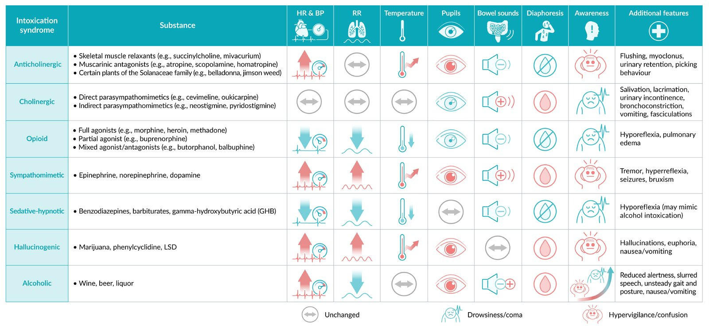
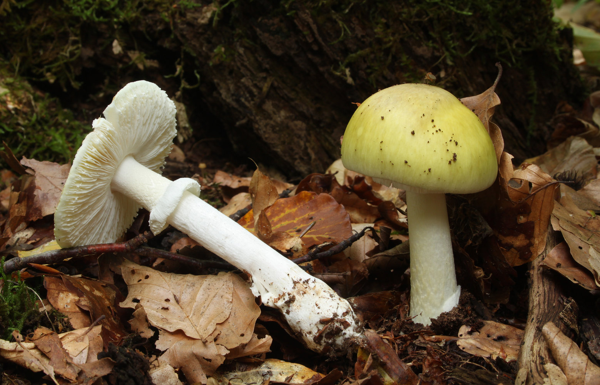
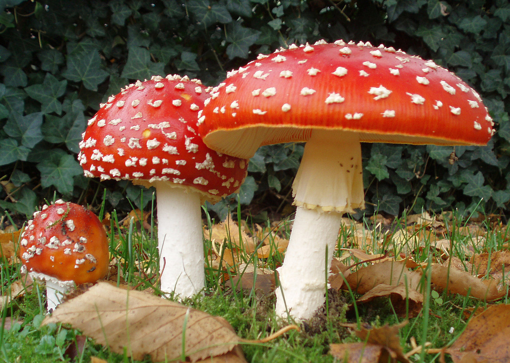
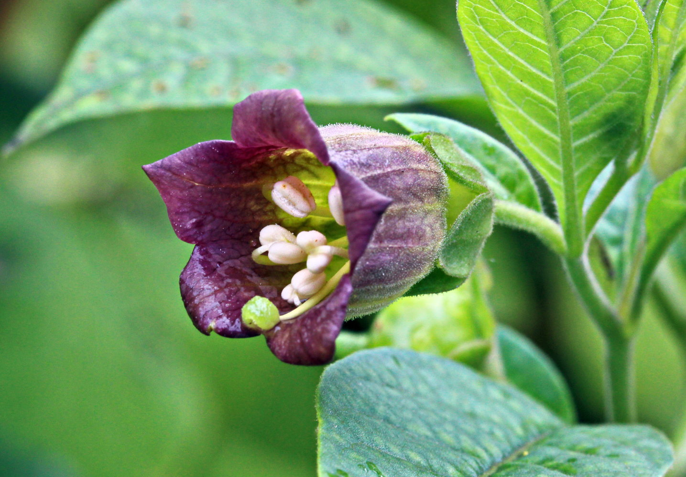
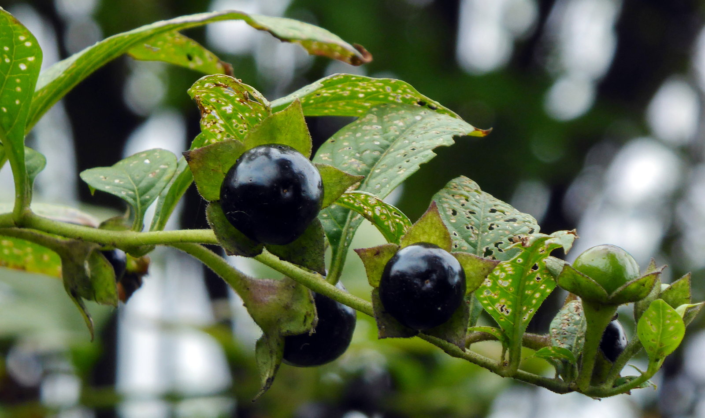

# Poisoning

*Categories: Clinical knowledge > Emergency medicine > Toxicologic disorders > Poisoning*

[Original Article Link](https://coursology-qbank.com/amboss/article/Af0RK2)

---

## Summary

Poisoning describes the harmful effects of exposure (i.e., inhalation, ingestion, injection, absorption) to a potentially toxic substance. The degree of harm depends on substance factors (e.g., type, amount, route of exposure) and patient factors, (e.g., age, body habitus, organ function). Poisoning is typically managed in consultation with a medical toxicologist and/or a local poison control center and can involve acute stabilization, <u>supportive care</u>, decontamination, <u>enhanced elimination</u>, and <u>antidotes</u>. The type and urgency of management depend on each individual's <u>toxicological risk assessment</u>, which is primarily based on the <u>toxicological history and physical examination</u>, and supported diagnostics tests. In the US, the Poison Help line (1-800-222-1222) allows for immediate 24/7 specialist consultation nationwide.

This article is an <u>overview of poisoning</u> with details on <u>cyanide</u>, cleaning products (e.g., <u>caustic agents</u>), mushrooms, plants, and <u>rodenticides</u>. Details on other poisonings are covered in their respective articles.

For a clinical approach and details on management common to all poisoning, see “<u>Approach to the poisoned patient</u>.”

---

## Overview

### Overview of poisonings and their management

| <u>Overview of poisoning</u> and management |  |  |
| --- | --- | --- |
| Substance | Pathophysiology | Management |
|  <u>Anticholinergics</u> [[1]](https://coursology-qbank.com/amboss/article/fgdku60)  |  * Anticholinergic excess → <u>anticholinergic syndrome</u>   |   * <u>Supportive care</u>  * <u>Physostigmine</u> (crosses the <u>blood-brain barrier</u>): rarely used  * See “<u>Anticholinergic syndrome</u>” for details.    |
|  Cholinergics  [[2]](https://coursology-qbank.com/amboss/article/Y11n2f0)  |  * Cholinergic excess → <u>cholinergic syndrome</u> with muscarinic effects (<u>DUMBBBELLSS</u>), nicotinic effects (<u>flaccid paralysis</u>, <u>respiratory arrest</u>), and <u>CNS</u> effects (<u>seizure</u>, <u>coma</u>)   |   * <u>Atropine</u>: reverses muscarinic effects  * <u>Pralidoxime</u> (<u>2-PAM</u>): treats neuromuscular dysfunction  * See “<u>Cholinergic poisoning</u>” for details.    |
|  <u>CNS stimulants</u> [[2]](https://coursology-qbank.com/amboss/article/Y11n2f0)  |  * ↑ Activation of the <u>sympathetic nervous system</u> → <u>sympathomimetic toxidrome</u>   |   * <u>Benzodiazepines for stimulant intoxication</u> for <u>agitation</u>, <u>hyperthermia</u>, <u>hypertension</u>, <u>tachycardia</u>, and/or <u>seizures</u>  * See “<u>Management of stimulant intoxication</u>” for details.    |
|  <u>Barbiturates</u> [[2]](https://coursology-qbank.com/amboss/article/Y11n2f0)  |  * Enhanced action of <u>GABA</u> → <u>CNS depression</u>   |   * <u>Enhanced elimination</u> with <u>multidose activated charcoal</u>  * <u>Urine alkalinization</u> with <u>sodium bicarbonate</u>  * See “<u>Barbiturate overdose</u>” for details.    |
|  <u>Benzodiazepines</u> [[2]](https://coursology-qbank.com/amboss/article/Y11n2f0)  |  * Enhanced action of <u>GABA</u> → <u>CNS depression</u>   |   * <u>Supportive care</u>  * <u>Flumazenil</u>  * See “<u>Benzodiazepine overdose</u>” for details.    |
|  <u>Opioids</u> [[3]](https://coursology-qbank.com/amboss/article/igdJE60)[[4]](https://coursology-qbank.com/amboss/article/AN1Rdh0)  |  * μ-, κ-, and δ-<u>receptor</u> <u>agonism</u> → <u>miosis</u>, <u>altered mental status</u>, respiratory <u>depression</u>   |   * <u>Naloxone</u>  * <u>Respiratory support</u>  * See “<u>Management of opioid overdose</u>” for details.    |
|  <u>Beta blockers</u> [[2]](https://coursology-qbank.com/amboss/article/Y11n2f0)[[4]](https://coursology-qbank.com/amboss/article/AN1Rdh0)  |  * ↓ Activation of the <u>sympathetic nervous system</u> → <u>bradycardia</u>, <u>hypotension</u>, <u>hypoglycemia</u>   |   * <u>Immediate hemodynamic support</u>: <u>fluid resuscitation</u>, <u>vasopressors and inotropes</u>  * <u>Atropine</u> for <u>symptomatic bradycardia</u>  * <u>High-dose euglycemic insulin therapy</u>  * High-dose <u>glucagon</u> therapy  * See “<u>Beta blocker poisoning</u>” for details.    |
|  <u>Digitalis</u> [[4]](https://coursology-qbank.com/amboss/article/AN1Rdh0)  |  * Inhibition of <u>Na+-K+-ATPase</u> → cardiac <u>arrhythmias</u>, <u>xanthopsia</u>   |   * <u>Digoxin-specific antibody fragments</u> (<u>DigiFab</u>)  * See “<u>Digoxin poisoning</u>” for details.    |
|  <u>Warfarin</u> [[5]](https://coursology-qbank.com/amboss/article/DEY1BI)  |  * <u>Vitamin K</u> <u>antagonism</u> (γ-<u>carboxylation</u> of <u>clotting factors</u>) → excessive bleeding   |   * <u>Prothrombin complex concentrate</u> or <u>fresh frozen plasma</u> (immediate <u>antidotes</u>)  * <u>Vitamin K</u> (delayed <u>antidote</u>)  * See “<u>Warfarin reversal</u>” for details.    |
|  <u>Dabigatran</u> [[5]](https://coursology-qbank.com/amboss/article/DEY1BI)[[6]](https://coursology-qbank.com/amboss/article/PgdWv60)  |  * Impaired <u>renal elimination</u> → supratherapeutic levels → excessive bleeding, <u>acute renal failure</u>   |   * <u>Idarucizumab</u>  * See “<u>Dabigatran reversal</u>” for details.    |
|  <u>Heparin</u> [[4]](https://coursology-qbank.com/amboss/article/AN1Rdh0)[[7]](https://coursology-qbank.com/amboss/article/4gd3v60)  |  * Increases activity of <u>antithrombin</u> → excessive bleeding   |   * <u>Protamine sulfate</u>  * See “<u>Heparin reversal</u>” for details.    |
|  <u>Fibrinolytics</u> [[8]](https://coursology-qbank.com/amboss/article/LFYwiI)  |  * Increases conversion of <u>plasminogen</u> to <u>plasmin</u> → excessive bleeding   |  * <u>Antifibrinolytics</u>, e.g., <u>tranexamic acid</u>, <u>aminocaproic acid</u>   |
|  <u>Salicylates</u> [[4]](https://coursology-qbank.com/amboss/article/AN1Rdh0)  |  * <u>Salicylate</u> metabolites cause disruption of <u>oxidative phosphorylation</u> → <u>metabolic acidosis</u>   |   * <u>Sodium bicarbonate</u> (to alkalinize urine)  * <u>Single-dose activated charcoal</u> (AC)  * <u>Hemodialysis</u>  * See “<u>Salicylate poisoning</u>” for details.    |
|  <u>Acetaminophen</u> [[4]](https://coursology-qbank.com/amboss/article/AN1Rdh0)  |  * Formation of a toxic metabolite (<u>NAPQI</u>) in the <u>liver</u> (<u>hepatotoxicity</u>) → <u>liver</u> failure   |   * <u>N-acetylcysteine</u>  * <u>Single-dose AC</u>  * See “<u>Acetaminophen overdose</u>” for details.    |
|  <u>Tricyclic antidepressants</u> [[2]](https://coursology-qbank.com/amboss/article/Y11n2f0)[[9]](https://coursology-qbank.com/amboss/article/1KW22m0)  |   * <u>Sodium channel blocker</u> effect → cardiotoxicity and <u>neurotoxicity</u> → <u>arrhythmias</u> and <u>seizures</u>  * <u>Muscarinic ACh receptor</u> inhibition → <u>anticholinergic effects</u>  * <u>Alpha receptor</u> inhibition → <u>hypotension</u>    |   * <u>Sodium bicarbonate</u> (to stabilize cardiac <u>cell membranes</u>)  * <u>Benzodiazepines</u> for <u>toxic seizures</u>  * <u>Single-dose AC</u>  * See “<u>TCA overdose</u>” for details.    |
|  <u>Methanol</u> or <u>ethylene glycol</u> [[4]](https://coursology-qbank.com/amboss/article/AN1Rdh0)[[10]](https://coursology-qbank.com/amboss/article/PhWWVO0)  |  * Formation of toxic metabolites in the <u>liver</u> → <u>anion gap metabolic acidosis</u>, <u>seizures</u>, <u>dyspnea</u>   |   * <u>Fomepizole</u>  * Ethanol (less effective than <u>fomepizole</u>)  * Dialysis  * See “<u>Toxic alcohol poisoning</u>” for details.    |
|  Metals [[11]](https://coursology-qbank.com/amboss/article/EaY8mn)[[12]](https://coursology-qbank.com/amboss/article/vaYAmn)[[13]](https://coursology-qbank.com/amboss/article/DaY15n)[[14]](https://coursology-qbank.com/amboss/article/3QYSDK)  |  * Varies by metal   |   * <u>Chelating agents</u>  * See “<u>Metal toxicity</u>” for details.    |
|  <u>Carbon monoxide</u> [[4]](https://coursology-qbank.com/amboss/article/AN1Rdh0)[[15]](https://coursology-qbank.com/amboss/article/-gbDBG)  |  * Formation of <u>carboxyhemoglobin</u> → tissue <u>hypoxia</u> → <u>cherry-red skin</u> with <u>bullous</u> <u>skin</u> lesions, <u>somnolence</u>, <u>agitation</u>, <u>headache</u>, <u>vomiting</u>, <u>coma</u>   |   * 100% oxygen via a <u>nonrebreather facemask</u>  * Consider <u>HBOT</u>.  * See “<u>Management of carbon monoxide poisoning</u>” for details.    |
|  <u>Cyanide</u> [[16]](https://coursology-qbank.com/amboss/article/ZedZxK0)  |  * Blocks the <u>electron transport chain</u> → <u>anion gap</u> metabolic <u>lactic acidosis</u>, bitter almond breath, <u>altered mental status</u>   |   * <u>Hydroxocobalamin</u>  * <u>Methemoglobin</u>-forming agents, e.g., <u>amyl nitrite</u>, <u>sodium nitrite</u>  * <u>Sodium thiosulfate</u>  * See “<u>Cyanide poisoning</u>” for details.    |
|  Substances that cause <u>acquired methemoglobinemia</u> [[4]](https://coursology-qbank.com/amboss/article/AN1Rdh0)[[17]](https://coursology-qbank.com/amboss/article/uG1pai0)  |  * <u>Methemoglobin</u> cannot bind oxygen → <u>cyanosis</u>, brown blood, <u>coma</u>   |   * <u>Methylene blue</u>  * <u>Reducing agents</u>, e.g., <u>vitamin C</u>  * See “<u>Methemoglobinemia</u>” for details.    |

> [!TIP]
> <u>Activated charcoal</u> effectively binds <u>acetaminophen</u>, <u>aspirin</u>, and <u>tricyclic antidepressants</u>.

> [!WARNING]
> <u>Activated charcoal</u> is ineffective in <u>GI decontamination</u> of <u>heavy metal poisoning</u>, <u>cyanide poisoning</u>, <u>lithium poisoning</u>, <u>caustic ingestions</u>, and <u>toxic alcohol poisoning</u>.

### <u>Toxidromes</u>

* <u>Anticholinergic toxidrome</u>

* <u>Cholinergic toxidrome</u>

* <u>Sedative-hypnotic toxidrome</u>

* <u>Sympathomimetic toxidrome</u>

* <u>Serotonin toxidrome</u>

* <u>Opioid toxidrome</u>

Toxidromes

### Drug-related

* <u>Acetaminophen overdose</u>

* <u>Salicylate poisoning</u>

* <u>Local anesthetic systemic toxicity</u>

* <u>Cardiovascular drug poisoning</u>

* <u>Psychiatric drug poisoning</u>

* <u>Serotonin toxicity</u>

* <u>Neuroleptic malignant syndrome</u>

* <u>Opioid overdose</u>

* <u>Cholinergic poisoning</u>

* <u>Sedative-hypnotic drug poisoning</u>

* <u>Stimulant intoxication</u>

* <u>Cannabis-induced disorders</u>

* <u>Alcohol intoxication</u>

* <u>Hallucinogen intoxication</u>

* <u>Vitamin toxicity</u>

### Environmental substance-related

* <u>Carbon monoxide poisoning</u>

* <u>Toxic alcohol poisoning</u>

* <u>Metal poisoning</u>

* <u>Irritants and asphyxiants</u>

* <u>Envenomation</u>

* <u>Foodborne illnesses</u>

* <u>Hydrocarbon toxicity</u>

---

## Cyanides

### Description

* Definition: a chemical compound containing a cyano group

* Examples: <u>cyanide</u> (CN‑), hydrogen <u>cyanide</u> (HCN), <u>potassium</u> <u>cyanide</u> (KCN)

> [!WARNING]
> <u>Cyanide</u> is highly toxic and rapidly lethal; exposure to small amounts can be fatal. [[18]](https://coursology-qbank.com/amboss/article/VOdGrJ0)

### Sources of exposure [[16]](https://coursology-qbank.com/amboss/article/ZedZxK0)

* Fires: <u>Cyanide</u> is released by various substances during combustion (e.g., plastics, upholstery, rubber).

* Industrial: metal industry, electroplating, manufacture of nitrogen-containing materials and products (e.g., plastics, jewelry)

* Medical: long-term or high-dose treatment with <u>sodium nitroprusside</u>, especially in patients with <u>CKD</u>

* Biological: : naturally occurring substances containing cyanogenic compounds (e.g., amygdalin), including cassava, apricot seeds, and bitter almonds

### Pathophysiology [[4]](https://coursology-qbank.com/amboss/article/AN1Rdh0)[[16]](https://coursology-qbank.com/amboss/article/ZedZxK0)

* Absorbed through the <u>skin</u>, respiratory system, and <u>GI tract</u>

* <u>Cyanide</u> blocks the <u>electron transport chain</u> by binding to <u>cytochrome complex IV</u> → ↓ <u>oxidative phosphorylation</u> → <u>anaerobic metabolism</u>, ↑ <u>lactic acid</u>, <u>histotoxic hypoxia</u>

* The <u>oxygen dissociation curve</u> is usually normal, unlike in <u>carbon monoxide poisoning</u>.

### Clinical features [[16]](https://coursology-qbank.com/amboss/article/ZedZxK0)[[19]](https://coursology-qbank.com/amboss/article/zUdrf60)

* Onset of symptoms: within seconds (inhalation) to minutes (oral ingestion)

* Neurological: : confusion, <u>agitation</u>, <u>vertigo</u>, <u>headache</u>, <u>seizures</u>, <u>coma</u>

* Respiratory

* Bitter almond breath  [[16]](https://coursology-qbank.com/amboss/article/ZedZxK0)

* <u>Clinical features of respiratory failure</u> (e.g., <u>dyspnea</u>)

* Cardiovascular: <u>chest pain</u>, <u>cardiac arrhythmia</u>, <u>signs of shock</u>

* Gastrointestinal: : <u>nausea</u>, <u>vomiting</u>, abdominal <u>pain</u>

* <u>Skin</u>: : flushing (<u>cherry-red skin</u>)

* Ophthalmological: bright red retinal <u>veins</u> on <u>fundoscopic examination</u>

> [!NOTE]
> Consider <u>cyanide poisoning</u> in patients who develop symptoms after treatment with <u>sodium nitroprusside</u> (e.g., for <u>hypertensive emergency</u>).

### Diagnostics [[4]](https://coursology-qbank.com/amboss/article/AN1Rdh0)[[20]](https://coursology-qbank.com/amboss/article/-UdDf60)

<u>Cyanide poisoning</u> is primarily a <u>clinical diagnosis</u>.  [[20]](https://coursology-qbank.com/amboss/article/-UdDf60)

* <u>Pulse oximetry</u>: typically normal

* <u>Blood gas analysis</u>: <u>metabolic acidosis</u> (e.g., ↓ <u>pH</u>, ↓ <u>HCO3-</u>)

* <u>BMP</u>: : <u>anion gap metabolic acidosis</u>

* <u>Lactate</u>: elevated; a level > 8 mmol/L in a patient with suspected poisoning is highly predictive of <u>cyanide poisoning</u>. [[4]](https://coursology-qbank.com/amboss/article/AN1Rdh0)

* <u>CO-oximetry</u>: may reveal concurrent <u>carbon monoxide poisoning</u>

> [!NOTE]
> <u>MRI</u> <u>brain</u> is typically normal in <u>cyanide poisoning</u>, whereas <u>carbon monoxide poisoning</u> is generally associated with <u>globus pallidus</u> <u>hypodensities</u>.

### Management [[4]](https://coursology-qbank.com/amboss/article/AN1Rdh0)[[16]](https://coursology-qbank.com/amboss/article/ZedZxK0)

* Begin resuscitation following <u>ABCDE approach for poisoning</u>.

* Perform <u>body surface decontamination</u>.

* Administer 100% <u>oxygen therapy</u>.

* Administer <u>antidote for cyanide poisoning</u> as soon as it is indicated.

* Perform a <u>toxicological risk assessment</u> and obtain diagnostic studies.

* Call the local Poison Control Center: In the US, the Poison Help line is 1-800-222-1222.

* Provide <u>supportive care in the poisoned patient</u>.

* Admit the patient to the <u>ICU</u>.

> [!WARNING]
> Do not delay empiric antidotal treatment if <u>cyanide poisoning</u> is suspected. [[4]](https://coursology-qbank.com/amboss/article/AN1Rdh0)

### Antidotes for cyanide poisoning [[4]](https://coursology-qbank.com/amboss/article/AN1Rdh0)[[16]](https://coursology-qbank.com/amboss/article/ZedZxK0)

#### Indications

* Suspected acute <u>cyanide poisoning</u>

* Exposure to fire or smoke with any of the following, regardless of <u>carboxyhemoglobin</u> concentration:

* <u>Altered mental status</u>

* <u>Hemodynamic instability</u>

* Serum <u>lactate</u> > 8 mmol/L

#### Hydroxocobalamin

* First-line <u>antidote for cyanide poisoning</u>

* A precursor of <u>vitamin B12</u>

* Binds <u>cyanide</u> directly and forms <u>vitamin B12</u>, which is excreted in urine

* Dosage: <u>hydroxocobalamin</u> DOSAGE [[4]](https://coursology-qbank.com/amboss/article/AN1Rdh0)

> [!TIP]
> <u>Hydroxocobalamin</u> may cause red discoloration of the patient's <u>skin</u>, urine, and plasma, which can affect the <u>accuracy</u> of <u>laboratory studies</u> that rely on spectrophotometry (e.g., <u>CO-oximetry</u>, <u>lactate</u> levels). [[4]](https://coursology-qbank.com/amboss/article/AN1Rdh0)

#### Nitrites

* Second-line <u>antidotes for cyanide poisoning</u>; often combined with <u>sodium thiosulfate</u>

* Nitrites induce <u>methemoglobinemia</u> by oxidizing <u>hemoglobin</u> to create <u>methemoglobin</u>.

* <u>Cyanide</u> preferentially binds to <u>methemoglobin</u>, forming the compound cyanomethemoglobin.

* This frees <u>cytochrome complex IV</u> to resume <u>oxidative phosphorylation</u>.

* Examples

* Sodium nitrite DOSAGE

* Amyl nitrite: can be inhaled; consider if <u>IV access</u> is unavailable. DOSAGE  [[4]](https://coursology-qbank.com/amboss/article/AN1Rdh0)

> [!WARNING]
> Exercise caution in patients with suspected <u>carbon monoxide poisoning</u> as inducing <u>methemoglobinemia</u> can worsen tissue <u>hypoxia</u>. [[21]](https://coursology-qbank.com/amboss/article/i2dJh60)

#### Sodium thiosulfate

* A second-line <u>antidote for cyanide poisoning</u>; often combined with nitrites

* Supplies sulfur donors to the <u>mitochondrial</u> enzyme rhodanese

* <u>Rhodanese</u> converts <u>cyanide</u> (or <u>cyanomethemoglobin</u>) into thiocyanate, a nontoxic compound excreted in urine.

* Dosage: <u>sodium thiosulfate</u> DOSAGE

---

## Cleaning products

### Toxic substances [[2]](https://coursology-qbank.com/amboss/article/Y11n2f0)[[22]](https://coursology-qbank.com/amboss/article/NOd-sJ0)[[23]](https://coursology-qbank.com/amboss/article/mOdVGJ0)[[24]](https://coursology-qbank.com/amboss/article/5OdiGJ0)[[25]](https://coursology-qbank.com/amboss/article/nOd7GJ0)

* Household and industrial cleaning products may contain multiple substances of varying toxicity.

* Tissue corrosion is the most common and clinically important effect.

#### Caustic agents

* Contain strong acids or alkalis, e.g., <u>potassium</u> hydroxide, <u>sodium</u> hydroxide

* Associated with significant tissue damage (e.g., chemical <u>burns</u>) and systemic effects

* Examples

* Heavy-duty <u>detergents</u>, e.g.:

* Oven cleaners

* Drain cleaners

* Toilet bowl cleaners

* Industrial degreasers

* Industrial <u>disinfectants</u>

* Certain dishwashing and laundry <u>detergents</u> (including single-use pods)  [[23]](https://coursology-qbank.com/amboss/article/mOdVGJ0)[[24]](https://coursology-qbank.com/amboss/article/5OdiGJ0)

* Etching agents, e.g., <u>hydrofluoric acid</u>

* Soldering flux, e.g., <u>zinc</u> <u>chloride</u>

* Bleach, e.g., <u>sodium</u> <u>hypochlorite</u>

#### Noncaustic <u>detergents</u> and <u>disinfectants</u> [[24]](https://coursology-qbank.com/amboss/article/5OdiGJ0)

* Active ingredients have milder corrosive, irritant, or otherwise toxic effects than <u>caustic agents</u>, e.g.:

* Foaming agents (surfactants)

* Mild or moderate acids or alkalis, e.g., <u>sodium</u> carbonate

* Mild bleaching substances, e.g., <u>hydrogen peroxide</u> or its precursors

* <u>Toxic alcohols</u>

* Effects are usually mild but may occasionally cause significant toxicity.  [[24]](https://coursology-qbank.com/amboss/article/5OdiGJ0)

* Examples: laundry <u>detergents</u>, dishwasher tablets, dish soaps, hand soaps, single-use pods, household <u>disinfectants</u>

> [!WARNING]
> <u>Caustic agents</u> and other toxic substances may be present in some, but not all, household dishwashing and laundry <u>detergents</u>.

### Ingestion

#### Clinical features [[25]](https://coursology-qbank.com/amboss/article/nOd7GJ0)

* <u>Caustic agents</u>

* Oral <u>pain</u>, <u>odynophagia</u>, <u>hypersalivation</u>

* <u>Dysphagia</u>

* Abdominal <u>pain</u>, <u>nausea</u>, <u>vomiting</u>

* <u>Chest pain</u>, <u>dyspnea</u>

* Oral <u>ulceration</u>, <u>pallor</u>, <u>edema</u>

* In cases of <u>aspiration</u>

* <u>Signs of airway compromise</u>

* <u>Dysphonia</u>

* Clinical features of <u>aspiration pneumonitis</u>

* Severe cases

* Clinical features of <u>mediastinitis</u>

* <u>Upper GI bleeding</u>

* Noncaustic <u>detergents</u> [[24]](https://coursology-qbank.com/amboss/article/5OdiGJ0)

* Usually milder than <u>caustic agents</u> but depends on the active ingredients

* Manifestations include:  [[24]](https://coursology-qbank.com/amboss/article/5OdiGJ0)

* <u>Nausea and vomiting</u>

* Foaming at the mouth

* Oral irritation

* <u>Dyspepsia</u>

* <u>Stridor</u> (rare)

#### Management [[4]](https://coursology-qbank.com/amboss/article/AN1Rdh0)[[25]](https://coursology-qbank.com/amboss/article/nOd7GJ0)[[26]](https://coursology-qbank.com/amboss/article/72d4Q60)

* Follow the <u>ABCDE approach for poisoning</u>.

* Consider early <u>intubation</u> if there are <u>signs of airway compromise</u>;  or <u>airway</u> injury (e.g., <u>edema</u>, <u>erosions</u>, <u>necrosis</u>).

* Prepare for a <u>difficult airway</u> (e.g., <u>video laryngoscopy</u>, <u>fiberoptic intubation</u>, <u>emergency surgical airway</u>).

* Avoid <u>GI decontamination</u> or inducing emesis.

* Check <u>material safety data sheets</u> and consult poison control to determine the toxicity of household and industrial cleaning products.

* Evaluate for GI <u>mucosal</u> injury, <u>esophageal perforation</u>, and <u>gastric perforation</u>.

* Consult gastroenterology and/or general <u>surgery</u>.

* Obtain CT chest and abdomen with IV contrast to assess for indications for urgent <u>surgery</u>.

* Arrange for endoscopy (<u>EGD</u>) within 12–24 hours.  [[2]](https://coursology-qbank.com/amboss/article/Y11n2f0)[[25]](https://coursology-qbank.com/amboss/article/nOd7GJ0)

* Oral contrast imaging (e.g., <u>barium swallow</u>) is not recommended.

* Identify and treat systemic complications (e.g., <u>mediastinitis</u>, <u>peritonitis</u>).

* Perform <u>emergency preoperative evaluation</u> of patients requiring urgent <u>damage control surgery</u>.

* Definitive treatment of tissue damage (e.g., surgical repair, reconstruction, endoscopic interventions) is determined by specialists based on the extent of injury.

* See “<u>Toxic alcohol poisoning</u>” for ingestions of cleaning products containing <u>methanol</u>, <u>ethylene glycol</u>, or <u>isopropyl alcohol</u>.

> [!WARNING]
> Do not induce <u>vomiting</u>, as this can cause further damage to the <u>esophagus</u>. Do not attempt to neutralize an alkali with a weak acid, as this can lead to <u>vomiting</u> or local <u>heat production</u>. [[4]](https://coursology-qbank.com/amboss/article/AN1Rdh0)[[25]](https://coursology-qbank.com/amboss/article/nOd7GJ0)

#### Disposition [[4]](https://coursology-qbank.com/amboss/article/AN1Rdh0)[[25]](https://coursology-qbank.com/amboss/article/nOd7GJ0)[[26]](https://coursology-qbank.com/amboss/article/72d4Q60)

* Most patients with <u>caustic ingestion</u> require admission.

* Potential <u>airway</u> compromise, significant injury, or suspected <u>GI perforation</u>: Urgent <u>surgery</u> and/or <u>ICU</u> admission are typically required.

* Asymptomatic or minimally symptomatic patients

* Consider an observation unit or inpatient admission for continued monitoring.

* If <u>EGD</u> is performed in the ED, determine disposition based on specialist recommendations.

#### Complications

* <u>Substance-induced esophagitis</u>

* <u>Gastric outlet obstruction</u>

* <u>Esophageal perforation</u>

* <u>Esophageal strictures</u>

* <u>Esophageal cancer</u>

* <u>Mediastinitis</u>

### Ocular exposure [[4]](https://coursology-qbank.com/amboss/article/AN1Rdh0)

* Clinical features

* <u>Pain</u>, foreign body sensation

* Redness, impaired <u>vision</u>, <u>conjunctival</u> injury, tearing

* Management

* Perform immediate large-volume <u>irrigation of the eye</u> and fornices.

* Consult ophthalmology for urgent referral or close follow-up.

* Treat any <u>ocular injuries</u> (e.g., <u>corneal abrasion</u>).

* See “Management” in “<u>Ocular chemical burns</u>” for further details.

> [!TIP]
> Injuries caused by ocular exposure vary and can range from <u>corneal abrasion</u> and irritation to <u>ocular chemical burns</u>. [[27]](https://coursology-qbank.com/amboss/article/DOd1uJ0)

### <u>Skin</u> exposure [[4]](https://coursology-qbank.com/amboss/article/AN1Rdh0)[[26]](https://coursology-qbank.com/amboss/article/72d4Q60)

#### Clinical features

* <u>Caustic agents</u>

* <u>Pain</u>, <u>erythema</u>, <u>blistering</u>

* Possibly permanent scarring

* Noncaustic <u>detergents</u>: See “Clinical features” in “<u>Irritant contact dermatitis</u>.”

#### Management

* <u>Caustic agents</u>

* Perform <u>body surface decontamination</u> with large-volume <u>irrigation</u> of affected areas.

* See “Special mechanisms” in “<u>Initial management of burns</u>” for details on chemical <u>burns</u>.

* Noncaustic <u>detergents</u>: See “Management” in “<u>Irritant contact dermatitis</u>.”

---

## Mushrooms

### Amanita phalloides (<u>death cap mushroom</u>)

#### Background [[28]](https://coursology-qbank.com/amboss/article/H2dKQ60)

* Toxins: α-amanitin and phalloidin

* Pathophysiology

* <u>α-amanitin</u>: blocks <u>RNA polymerase</u> → inhibition of <u>mRNA</u> <u>transcription</u> and <u>protein synthesis</u> → <u>apoptosis</u>

* <u>Phalloidin</u>: binds and stabilizes <u>actin filaments</u> → prevention of <u>actin</u> fiber depolymerization

* Ingestion of a single cap can be fatal.

Amanita phalloides (death cap mushroom)

#### Clinical features [[28]](https://coursology-qbank.com/amboss/article/H2dKQ60)

Clinical features and symptom onset vary depending on the amount ingested; features are primarily due to <u>hepatotoxicity</u>.

* Gastrointestinal phase: begins 6–24 hours after ingestion

* Gastrointestinal symptoms (<u>diarrhea</u>, <u>vomiting</u>, abdominal <u>pain</u>) dominate.

* Lasts 12–36 hours

* Latent phase: transient improvement between phases

* Hepatorenal phase: begins 2–6 days after ingestion

* <u>Signs of liver failure</u>

* <u>Signs of acute kidney injury</u>

* <u>Signs of hepatic encephalopathy</u>

* <u>Coagulopathy</u>

#### Diagnostics [[4]](https://coursology-qbank.com/amboss/article/AN1Rdh0)[[28]](https://coursology-qbank.com/amboss/article/H2dKQ60)

<u>A. phalloides</u> poisoning is a <u>clinical diagnosis</u>.

* <u>BMP</u>: to evaluate for <u>acute kidney injury</u>

* <u>LFTs</u>: to assess for development of <u>hepatotoxicity</u>

* <u>INR</u>: to assess for development of <u>hepatotoxicity</u>

* <u>Ammonia</u>: to evaluate for <u>hyperammonemia</u>

#### Management [[4]](https://coursology-qbank.com/amboss/article/AN1Rdh0)[[28]](https://coursology-qbank.com/amboss/article/H2dKQ60)

Follow the <u>ABCDE approach for poisoning</u>.

* Perform <u>GI decontamination</u> (e.g., with <u>single-dose AC</u>).

* Call the local Poison Control Center; in the US, the Poison Help line is 1-800-222-1222.

* Administer <u>antidotes</u> in consultation with a medical toxicologist as soon as possible. [[29]](https://coursology-qbank.com/amboss/article/xmWE3N0)

* First-line: IV <u>silibinin</u> (<u>off-label</u>) DOSAGE [[29]](https://coursology-qbank.com/amboss/article/xmWE3N0)

* Second-line: high-dose IV <u>penicillin G</u> (<u>off-label</u>) DOSAGE [[29]](https://coursology-qbank.com/amboss/article/xmWE3N0)

* Consider <u>N-acetylcysteine</u> (see “<u>Treatment of acute liver failure</u>” for detailed indications and dosage). [[29]](https://coursology-qbank.com/amboss/article/xmWE3N0)

* Provide <u>supportive care for poisoned patients</u> (e.g., <u>antiemetics</u>, <u>IV fluid therapy</u>).

* <u>Liver transplantation</u> may be required in severe cases.

> [!TIP]
> Although <u>antidotes</u> for <u>A. phalloides</u> poisoning are not <u>FDA</u>-approved, evidence supports administering <u>silibinin</u>, <u>N-acetylcysteine</u>, or <u>penicillin G</u> in consultation with poison control.

#### Disposition

* Admit patients with severe <u>hepatotoxicity</u> and/or risk for <u>acute liver failure</u> to the <u>ICU</u>.

* Arrange interfacility transfer to a transplant center as needed.

### Amanita muscaria (<u>fly agaric</u> mushroom)

#### Background [[4]](https://coursology-qbank.com/amboss/article/AN1Rdh0)[[30]](https://coursology-qbank.com/amboss/article/B2dzP60)

* Toxins: ibotenic acid and muscimol

* Pathophysiology

* Ibotenic acid: activation of central <u>glutamic acid</u> <u>receptors</u> → <u>CNS</u> stimulation

* Muscimol: activation of <u>GABA</u> <u>receptors</u> → sedation

Amanita muscaria (fly agaric mushroom)

#### Clinical features [[4]](https://coursology-qbank.com/amboss/article/AN1Rdh0)[[30]](https://coursology-qbank.com/amboss/article/B2dzP60)[[31]](https://coursology-qbank.com/amboss/article/ZfdZk60)

* Neuropsychiatric: a mixture of excitatory and inhibitory effects

* Excitatory

* <u>Agitation</u>

* <u>Seizures</u>

* Euphoria

* <u>Hallucinations</u>, <u>perceptual disturbances</u>

* Muscle <u>tremors</u>

* Inhibitory

* <u>Somnolence</u>, <u>lethargy</u>

* <u>Altered mental status</u>

* Gastrointestinal: <u>nausea</u>, <u>vomiting</u>, <u>diarrhea</u>

> [!TIP]
> Despite its name, A. muscaria is not generally associated with a <u>cholinergic toxidrome</u> or <u>anticholinergic toxidrome</u>. [[4]](https://coursology-qbank.com/amboss/article/AN1Rdh0)[[32]](https://coursology-qbank.com/amboss/article/2OdT7J0)[[33]](https://coursology-qbank.com/amboss/article/fOdk7J0)

#### Diagnostics [[4]](https://coursology-qbank.com/amboss/article/AN1Rdh0)

* A. muscaria poisoning is a <u>clinical diagnosis</u>.

* There is little evidence that diagnostic tests help confirm the diagnosis.

* Metabolic disturbances associated with clinical features of intoxication may be seen (e.g., <u>electrolyte</u> imbalances, <u>AKI</u>, <u>postictal lactic acidosis</u>).

#### Management [[4]](https://coursology-qbank.com/amboss/article/AN1Rdh0)[[30]](https://coursology-qbank.com/amboss/article/B2dzP60)

* Follow the <u>ABCDE approach for poisoning</u>.

* Call the local Poison Control Center: In the US, the Poison Help line is 1-800-222-1222.

* Provide <u>supportive care in the poisoned patient</u>.

* Consider <u>benzodiazepines for agitation</u>.

* Make a disposition decision in consultation with poison control.

> [!WARNING]
> Treatment with <u>atropine</u> and <u>physostigmine</u> is discouraged as the effects of A. muscaria on the <u>parasympathetic nervous system</u> can be mixed. [[32]](https://coursology-qbank.com/amboss/article/2OdT7J0)[[33]](https://coursology-qbank.com/amboss/article/fOdk7J0)

### Gyromitra spp. (false morels)

#### General principles [[4]](https://coursology-qbank.com/amboss/article/AN1Rdh0)[[34]](https://coursology-qbank.com/amboss/article/efdxO60)

* Toxin: <u>gyromitrin</u>

* Pathophysiology

* Inhibits <u>pyridoxal phosphate</u> synthesis → decreased <u>GABA</u> formation → <u>CNS</u> excitation and lowered <u>seizure</u> threshold

* Increases oxidative <u>stress</u> → <u>hepatotoxicity</u> and/or <u>methemoglobinemia</u> [[35]](https://coursology-qbank.com/amboss/article/HhdK2p0)

#### Clinical features [[4]](https://coursology-qbank.com/amboss/article/AN1Rdh0)[[34]](https://coursology-qbank.com/amboss/article/efdxO60)

* Gastrointestinal

* <u>Nausea</u>, <u>vomiting</u>, <u>diarrhea</u>

* <u>Signs of liver failure</u>

* Neurological

* <u>Seizures</u>

* <u>Altered mental status</u>

#### Diagnostics [[4]](https://coursology-qbank.com/amboss/article/AN1Rdh0)

<u>Gyromitra</u> poisoning is a <u>clinical diagnosis</u>.

* <u>BMP</u>: to monitor for <u>electrolyte</u> abnormalities due to <u>vomiting</u> and/or <u>diarrhea</u>

* <u>LFTs</u>: to assess for development of <u>hepatotoxicity</u>

* <u>CO-oximetry</u>: to screen for <u>methemoglobinemia</u>

#### Management [[2]](https://coursology-qbank.com/amboss/article/Y11n2f0)[[4]](https://coursology-qbank.com/amboss/article/AN1Rdh0)

* Follow the <u>ABCDE approach for poisoning</u>.

* Perform <u>GI decontamination</u> (e.g., with <u>single-dose AC</u>).

* Provide <u>supportive care in the poisoned patient</u>.

* Call the local Poison Control Center: In the US, the Poison Help line is 1-800-222-1222.

* If <u>seizures</u> manifest:

* Begin <u>phase-based acute seizure management</u>.

* Administer IV <u>pyridoxine</u> (<u>off-label</u>). DOSAGE [[2]](https://coursology-qbank.com/amboss/article/Y11n2f0)

* <u>Treat methemoglobinemia</u> if present.

* Initiate <u>treatment of acute liver failure</u>.

> [!WARNING]
> IV <u>pyridoxine</u> is often crucial to treat <u>seizures</u>, as <u>gyromitrin poisoning</u> can cause refractory <u>status epilepticus</u> due to <u>pyridoxine deficiency</u>. [[4]](https://coursology-qbank.com/amboss/article/AN1Rdh0)

#### Disposition

* <u>Altered mental status</u> and/or <u>seizures</u>: Admit to the <u>ICU</u>.

* Asymptomatic or mild symptoms

* Consider discharge for patients who are asymptomatic after 6–8 hours.

* If symptoms develop or worsen, admit for continued monitoring and treatment.

---

## Plants

### Atropa belladonna (<u>belladonna</u> or <u>deadly nightshade</u>)

#### General principles [[4]](https://coursology-qbank.com/amboss/article/AN1Rdh0)

* Description: plant with toxic berries and leaves containing <u>atropine</u> (a tropane alkaloid)

* Pathophysiology: <u>competitive inhibitor</u> of <u>muscarinic acetylcholine receptors</u> (<u>parasympathetic nervous system</u>)

Atropa belladonna (deadly nightshade)

Atropa belladonna (deadly nightshade)

#### Clinical features [[4]](https://coursology-qbank.com/amboss/article/AN1Rdh0)

<u>A. belladonna</u> poisoning primarily manifests as <u>anticholinergic syndrome</u>.

* Dry, red <u>skin</u>

* <u>Fever</u>, <u>mydriasis</u>

* <u>Tachycardia</u>

* <u>Hallucinations</u>, <u>coma</u>, <u>seizures</u>, <u>delirium</u>

* <u>Urinary retention</u>, absent <u>bowel sounds</u>

> [!NOTE]
> Features of <u>anticholinergic syndrome</u> can be remembered with: “Blind as a bat (<u>cycloplegia</u> and <u>mydriasis</u>), mad as a hatter (<u>delirium</u> and <u>hallucinations</u>), red as a beet (cutaneous <u>vasodilation</u>), hot as hell (<u>hyperthermia</u>), dry as a bone (<u>anhidrosis</u> and <u>xerophthalmia</u>), the bowel and <u>bladder</u> lose their tone (<u>urinary retention</u> and absent <u>bowel sounds</u>), and the <u>heart</u> runs alone (<u>tachycardia</u>).”

#### Diagnostics [[4]](https://coursology-qbank.com/amboss/article/AN1Rdh0)

<u>A. belladonna</u> poisoning is a <u>clinical diagnosis</u>.

* <u>ECG</u>: to screen for <u>QTc</u> or QRS prolongation

* <u>Glucose</u>: to rule out <u>hypoglycemia</u> as a cause of <u>seizures</u> or <u>altered mental status</u>

* <u>Creatine kinase</u>: to evaluate for <u>rhabdomyolysis</u> associated with <u>hyperthermia</u>

* <u>BMP</u>: to evaluate for <u>electrolyte</u> abnormalities and measure renal function

#### Management [[4]](https://coursology-qbank.com/amboss/article/AN1Rdh0)

* Follow the <u>ABCDE approach for poisoning</u>.

* Call the local Poison Control Center: In the US, the Poison Help line is 1-800-222-1222.

* Initiate <u>supportive care in the poisoned patient</u>, including <u>treatment of hyperthermia</u>.

* Begin <u>phase-based acute seizure management</u> if indicated.

* Administer <u>benzodiazepines for agitation</u> if indicated.

* If available, consider administering <u>physostigmine</u> for severe symptoms in consultation with a toxicologist.

* Disposition

* Severe poisoning (e.g., refractory symptoms): Admit to a monitored bed.

* Consider discharge for patients who are mildly symptomatic after 6–8 hours.

### Other plants

* Oleander, <u>foxglove</u>, lily of the valley: See “<u>Digoxin poisoning</u>” and “<u>Cardiac glycosides</u>.”

* <u>Poison ivy</u>, <u>poison oak</u>, <u>poison sumac</u>: See “<u>Allergic contact dermatitis</u>.”

* Tobacco: See “<u>Green tobacco sickness</u>” and “<u>Nicotine poisoning</u>.”

---