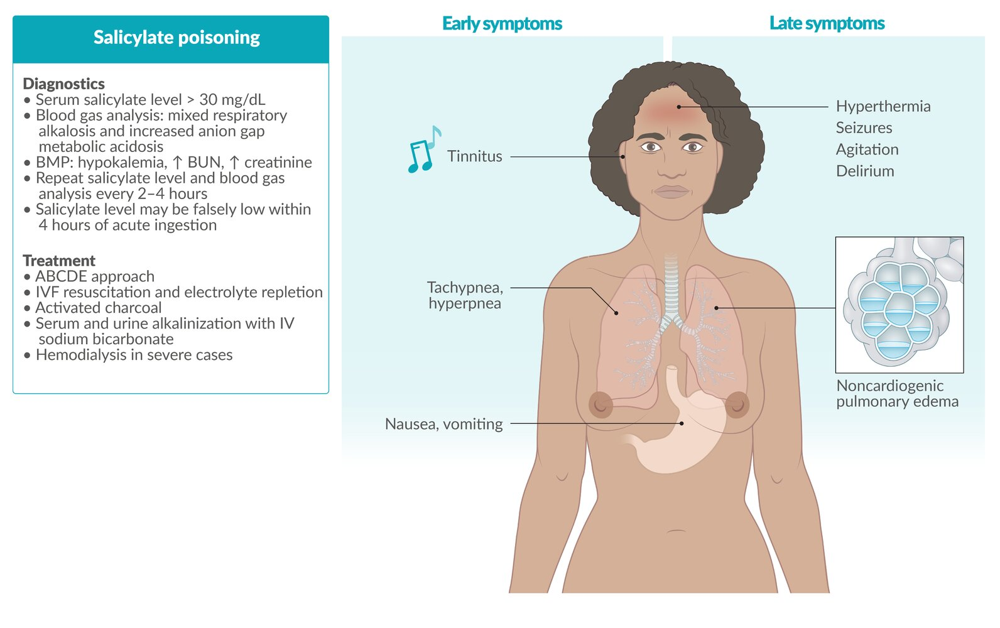

# Salicylate poisoning

*Categories: Clinical knowledge > Emergency medicine > Toxicologic disorders > Salicylate poisoning*

[Original Article Link](https://coursology-qbank.com/amboss/article/wq0h0h)

---

## Summary

<u>Salicylate</u> <u>poisoning</u> is a serious complication of <u>aspirin</u> overdose and is characterized by mixed <u>respiratory alkalosis</u> and <u>increased anion gap metabolic acidosis</u>. Early symptoms include <u>tinnitus</u>, <u>nausea</u>, <u>vomiting</u>, and <u>tachypnea</u>. Late symptoms include <u>altered mental status</u> (<u>AMS</u>), <u>seizures</u>, and <u>hyperthermia</u>. <u>Fluid resuscitation</u>, oral <u>activated charcoal</u>, and alkalinization of the serum and urine are the most important aspects of treatment. In severe cases, <u>hemodialysis</u> may be indicated. <u>Intubation</u> should be avoided, as it can precipitate clinical decompensation if ventilation needs are not met. For other side effects related to <u>aspirin</u> use, see <u>antiplatelet agents</u>.

Salicylate poisoning

---

## Pathophysiology

### Overview

* Early mixed <u>respiratory alkalosis</u> → ↑ <u>anion gap</u> <u>metabolic acidosis</u>
1. * <u>Salicylates</u> directly stimulate the <u>respiratory center</u> of the <u>brain</u> → <u>hyperventilation</u> → CO2washout → primary <u>respiratory alkalosis</u>
2. * Disruption of <u>mitochondrial</u> <u>oxidative phosphorylation</u> → inhibition of <u>TCA cycle</u> and <u>ATP</u> production → accumulation of <u>lactic acid</u> and <u>ketones</u> → ↑ <u>anion gap</u> <u>metabolic acidosis</u>  [[6]](https://coursology-qbank.com/amboss/article/UGYbAq)
3. * Fatigue impairs the ability to compensate for <u>acidosis</u> (via <u>hyperventilation</u>) → <u>hemodynamic instability</u> and <u>end-organ damage</u>

* ↓ <u>pH</u> → ↑ permeability of <u>salicylates</u> across <u>cell membranes</u> → ↑ toxic effects [[3]](https://coursology-qbank.com/amboss/article/Y11n2f0)

* ↑ <u>Blood-brain barrier</u> permeability → <u>cerebral edema</u>, <u>seizures</u>, and/or <u>coma</u> [[7]](https://coursology-qbank.com/amboss/article/DEd1B70)

* ↑ Pulmonary <u>capillary</u> permeability → <u>ARDS</u> with <u>pulmonary edema</u>

* For more information on adverse effects (e.g., <u>tinnitus</u>), see “Irreversible <u>cyclooxygenase</u> inhibitors” in “<u>Antiplatelet agents</u>.”

### <u>Pharmacokinetics</u> of <u>poisoning</u>

* <u>Salicylates</u> cause <u>pyloric sphincter</u> spasm → ↑ time spent in <u>stomach</u> → ↑ absorption

* At high concentrations, metabolic pathways become saturated → <u>zero order elimination</u>

---

## Clinical features

* Early stage: <u>tinnitus</u>, <u>nausea</u>, <u>vomiting</u>, <u>tachypnea</u>, <u>hyperpnea</u> [[2]](https://coursology-qbank.com/amboss/article/AN1Rdh0)

* Late stage: <u>hyperthermia</u>, <u>agitation</u>, <u>delirium</u>, <u>seizures</u>, <u>noncardiogenic pulmonary edema</u> [[2]](https://coursology-qbank.com/amboss/article/AN1Rdh0)

> [!TIP]
> Typical clinical features may be subtle or absent in patients with chronic supratherapeutic ingestions. [[4]](https://coursology-qbank.com/amboss/article/gn1Fsh0)

> [!WARNING]
> <u>Tachypnea</u> at clinical presentation is a <u>red flag</u> feature. [[5]](https://coursology-qbank.com/amboss/article/REdlv70)

---

## Classification

|  Severity of salicylate poisoning [[4]](https://coursology-qbank.com/amboss/article/gn1Fsh0)[[8]](https://coursology-qbank.com/amboss/article/eGYxyq)  |  |  |
| --- | --- | --- |
|  |  <u>Serum salicylate level</u> (6 hours after ingestion)  [[8]](https://coursology-qbank.com/amboss/article/eGYxyq)  |  Features  |
| Mild <u>poisoning</u> |   * Adults: 30–60 mg/dL  * Children and older adults: 20–45 mg/dL    |   * <u>Tinnitus</u>  * <u>Nausea</u>/<u>vomiting</u>  * <u>Lethargy</u>    |
| Moderate <u>poisoning</u> |   * Adults: 60–80 mg/dL  * Children and older adults: 45–70 mg/dL    |   * <u>Tachypnea</u>  * <u>Diaphoresis</u>    |
| Severe <u>poisoning</u> |   * Adults: > 80 mg/dL  * Children and older adults: > 70 mg/dL    |   * <u>Coma</u>  * <u>Seizures</u>  * <u>Pulmonary edema</u>  * <u>Renal failure</u>  * <u>Hypercarbia</u>    |

> [!WARNING]
> The degree of <u>tachypnea</u> and signs of organ failure (e.g., <u>kidney failure</u>, neurological dysfunction, <u>respiratory failure</u>) correlate with poor outcomes in patients with <u>salicylate</u> <u>poisoning</u>. [[9]](https://coursology-qbank.com/amboss/article/iEdJv70)

---

## Diagnosis

### Approach

* Establish diagnosis based on a combination of clinical evaluation, <u>serum salicylate levels</u>, and additional <u>laboratory studies</u> (e.g., <u>blood gas</u>).

* Perform a <u>toxicological risk assessment</u> based on the <u>severity of salicylate poisoning</u>.

* See “<u>Diagnostics for the poisoned patient</u>” for additional studies in patients with suspected <u>poisoning</u>.

### <u>Clinical evaluation of poisoning</u> [[4]](https://coursology-qbank.com/amboss/article/gn1Fsh0)

* Identify <u>clinical features of salicylate poisoning</u>.

* Determine type of exposure (e.g., acute ingestion vs. chronic supratherapeutic ingestion).

* Identify the source and <u>potency</u> of <u>salicylate-containing products</u>.

* Identify <u>risk factors for severe salicylate toxicity</u>.

#### Toxic dose [[10]](https://coursology-qbank.com/amboss/article/3EdSv70)

* <u>Aspirin</u> (or equivalent): > 150 mg/kg or > 6.5 g (whichever amount is lower)

* <u>Wintergreen oil</u>

* Children < 6 years: any oral exposure (even minimal)

* Children ≥ 6 years: > 4 mL

### Serum salicylate level [[2]](https://coursology-qbank.com/amboss/article/AN1Rdh0)[[3]](https://coursology-qbank.com/amboss/article/Y11n2f0)[[4]](https://coursology-qbank.com/amboss/article/gn1Fsh0)

* Interpretation [[4]](https://coursology-qbank.com/amboss/article/gn1Fsh0)[[6]](https://coursology-qbank.com/amboss/article/UGYbAq)

* <u>Salicylate levels</u> only correlate loosely with clinical features, time of ingestion, and <u>severity of salicylate poisoning</u>.

* Maintain a high index of suspicion for patients with <u>symptoms of salicylate poisoning</u>, regardless of levels, and use overall clinical condition to guide management.

* Therapeutic levels: 15–30 mg/dL [[4]](https://coursology-qbank.com/amboss/article/gn1Fsh0)

* Toxic levels: typically defined as > 30 mg/dL [[3]](https://coursology-qbank.com/amboss/article/Y11n2f0)

* Timing [[6]](https://coursology-qbank.com/amboss/article/UGYbAq)

* Obtain as soon as possible.

* Consider repeat levels in patients with:

* Acute ingestion within the last 4 hours [[8]](https://coursology-qbank.com/amboss/article/eGYxyq)

* Suspected chronic supratherapeutic ingestion [[4]](https://coursology-qbank.com/amboss/article/gn1Fsh0)

* <u>Enteric-coated</u> or extended-release formulations [[4]](https://coursology-qbank.com/amboss/article/gn1Fsh0)

* Continue serial measurements until the level is reliably declining and symptoms have resolved. [[6]](https://coursology-qbank.com/amboss/article/UGYbAq)

> [!WARNING]
> <u>Salicylate levels</u> can be falsely low within 4 hours of acute ingestion or with large ingestions that form <u>bezoars</u> and/or delay gastric emptying. [[2]](https://coursology-qbank.com/amboss/article/AN1Rdh0)[[8]](https://coursology-qbank.com/amboss/article/eGYxyq)

> [!WARNING]
> Pediatric patients and those with chronic supratherapeutic ingestions may experience toxicity at the upper end of therapeutic levels. [[4]](https://coursology-qbank.com/amboss/article/gn1Fsh0)[[8]](https://coursology-qbank.com/amboss/article/eGYxyq)

### Additional <u>laboratory studies</u> [[2]](https://coursology-qbank.com/amboss/article/AN1Rdh0)[[3]](https://coursology-qbank.com/amboss/article/Y11n2f0)

* <u>ABG</u> or <u>VBG</u>: mixed <u>respiratory alkalosis</u> and <u>increased anion gap metabolic acidosis</u> [[6]](https://coursology-qbank.com/amboss/article/UGYbAq)

* <u>BMP</u>: <u>hypokalemia</u>, ↑ <u>BUN</u>, ↑ <u>creatinine</u>

* ↑ <u>Lactate</u>

* <u>Liver function</u> tests

* <u>Coagulation studies</u>

* Screening for coingestion (e.g., <u>acetaminophen level</u>, <u>urine drug screen</u>)

---

## Management

### Initial management [[2]](https://coursology-qbank.com/amboss/article/AN1Rdh0)[[3]](https://coursology-qbank.com/amboss/article/Y11n2f0)[[4]](https://coursology-qbank.com/amboss/article/gn1Fsh0)

* Stabilization

* Follow the <u>ABCDE approach for poisoning</u>.

* Provide <u>IV fluid resuscitation</u> and <u>electrolyte repletion</u> as needed.

* Administer supplemental <u>glucose</u> for <u>AMS</u>.  [[3]](https://coursology-qbank.com/amboss/article/Y11n2f0)

* Perform <u>airway management</u> for <u>salicylate</u> <u>poisoning</u> with caution.

* <u>GI decontamination</u>: : Consider single-dose <u>activated charcoal</u> (AC) or <u>multidose activated charcoal</u> (<u>MDAC</u>); see “<u>GI decontamination in salicylate poisoning</u>.” [[3]](https://coursology-qbank.com/amboss/article/Y11n2f0)

* <u>Enhanced elimination</u>

* Initiate serum and <u>urine alkalinization</u> with <u>IV sodium bicarbonate</u>.

* Evaluate need for <u>hemodialysis</u>; see “<u>Indications for hemodialysis in salicylate poisoning</u>.”

* Urgent consults

* Call the local poison control center: In the US, the Poison Help line is 1-800-222-1222.

* Consult <u>psychiatry</u> for all intentional overdoses.

* Consult nephrology for dialysis, if indicated.

### Airway management in salicylate poisoning [[2]](https://coursology-qbank.com/amboss/article/AN1Rdh0)[[3]](https://coursology-qbank.com/amboss/article/Y11n2f0)

* Avoid early <u>intubation</u> and <u>mechanical ventilation</u> if possible.

* Consider <u>intubation</u> with caution in patients with: [[6]](https://coursology-qbank.com/amboss/article/UGYbAq)

* Worsening <u>AMS</u> causing <u>airway</u> compromise

* <u>Salicylate</u>-induced <u>acute lung injury</u>

* Refractory severe <u>agitation</u>

* If <u>intubation</u> is unavoidable:

* Administer pre-<u>intubation</u> <u>sodium bicarbonate</u>. DOSAGE  [[3]](https://coursology-qbank.com/amboss/article/Y11n2f0)

* Consider <u>awake intubation</u> with <u>ketamine</u> DOSAGE to minimize respiratory <u>depression</u>.

* Follow <u>ventilation strategies for severe acidosis</u> and <u>hyperventilate</u> to maintain preintubation <u>pCO2</u> levels.

> [!WARNING]
> Avoid <u>intubation</u> and <u>mechanical ventilation</u> unless absolutely necessary, as patients may decompensate rapidly if <u>respiratory acidosis</u> develops.

### GI decontamination in salicylate poisoning [[3]](https://coursology-qbank.com/amboss/article/Y11n2f0)[[4]](https://coursology-qbank.com/amboss/article/gn1Fsh0)[[6]](https://coursology-qbank.com/amboss/article/UGYbAq)

* Consider <u>single-dose AC</u> even > 2–4 hours after acute ingestion.

* Consider <u>MDAC</u> in consultation with a toxicologist.  [[3]](https://coursology-qbank.com/amboss/article/Y11n2f0)[[4]](https://coursology-qbank.com/amboss/article/gn1Fsh0)

* Discuss risks and benefits of other <u>GI decontamination</u> methods (e.g., <u>WBI</u>) with a specialist.  [[11]](https://coursology-qbank.com/amboss/article/nFX7i-)

> [!WARNING]
> Avoid <u>activated charcoal</u> in patients without a <u>secure airway</u>. [[12]](https://coursology-qbank.com/amboss/article/vGXAa-)

### Serum and <u>urine alkalinization</u> [[2]](https://coursology-qbank.com/amboss/article/AN1Rdh0)[[3]](https://coursology-qbank.com/amboss/article/Y11n2f0)[[6]](https://coursology-qbank.com/amboss/article/UGYbAq)

* Indications [[3]](https://coursology-qbank.com/amboss/article/Y11n2f0)

* All symptomatic patients with <u>serum salicylate levels</u> > 30 mg/dL

* Suspected <u>salicylate</u> <u>poisoning</u> before obtaining <u>serum salicylate level</u>

* Dosing: See “<u>Urine alkalinization</u>.”

* Goals [[3]](https://coursology-qbank.com/amboss/article/Y11n2f0)

* Serum <u>pH</u> 7.45–7.55

* Urine <u>pH</u> 7.5–8.0

> [!WARNING]
> <u>Replete potassium</u> because <u>hypokalemia</u> prevents <u>urinary alkalinization</u>. [[3]](https://coursology-qbank.com/amboss/article/Y11n2f0)

### Indications for hemodialysis in salicylate poisoning [[13]](https://coursology-qbank.com/amboss/article/ZFYZgI)

* <u>Hemodialysis</u> is recommended for any of the following:

* <u>Serum salicylate level</u> > 100 mg/dL (> 90 mg/dL if renal function is impaired)

* <u>AMS</u>

* New <u>hypoxemia</u> requiring <u>supplemental oxygen</u>

* <u>Hemodialysis</u> is suggested if standard therapy fails and any of the following are present:

* <u>Serum salicylate level</u> > 90 mg/dL (> 80 mg/dL if renal function is impaired)

* Serum <u>pH</u> ≤ 7.2

### Monitoring [[3]](https://coursology-qbank.com/amboss/article/Y11n2f0)

* Repeat <u>laboratory studies</u> every 2–4 hours. [[2]](https://coursology-qbank.com/amboss/article/AN1Rdh0)[[3]](https://coursology-qbank.com/amboss/article/Y11n2f0)

* <u>ABG</u> or <u>VBG</u>, <u>BMP</u>  [[3]](https://coursology-qbank.com/amboss/article/Y11n2f0)

* <u>Serum salicylate level</u>

* See “Urinary alkalization” for monitoring specific to this therapy.

* Endpoints for monitoring

* Clinical improvement

* Sustained decrease in <u>salicylate level</u>  [[2]](https://coursology-qbank.com/amboss/article/AN1Rdh0)

* Normalized or increased serum <u>pH</u>

### Disposition [[2]](https://coursology-qbank.com/amboss/article/AN1Rdh0)

* Most patients require <u>ICU</u> admission, e.g., for: [[2]](https://coursology-qbank.com/amboss/article/AN1Rdh0)

* <u>Pulmonary edema</u>

* <u>AMS</u>

* <u>Seizures</u>

* Serum <u>pH</u> < 7.3

* <u>Electrolyte</u> abnormalities

* <u>Dehydration</u>

* <u>Renal insufficiency</u>

* Increasing <u>salicylate levels</u>

* Consult toxicology to determine if discharge is appropriate for asymptomatic patients with low-risk features.

* Consult <u>psychiatry</u> and admit patients with high <u>suicidal risk</u> to hospital even if medically stable; <u>involuntary commitment</u> may be necessary.

---