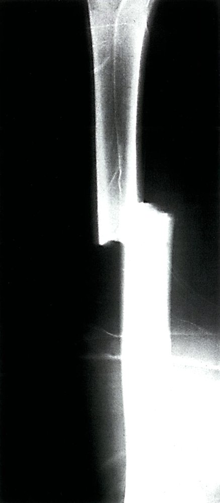
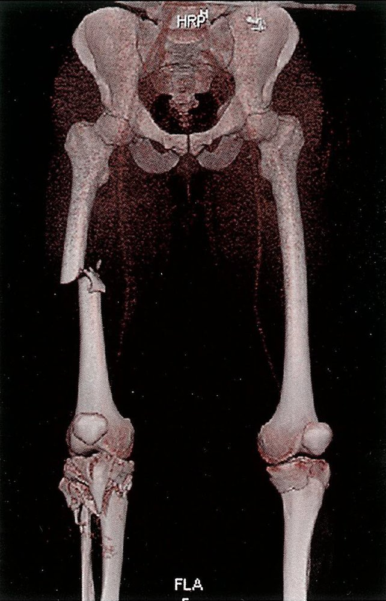
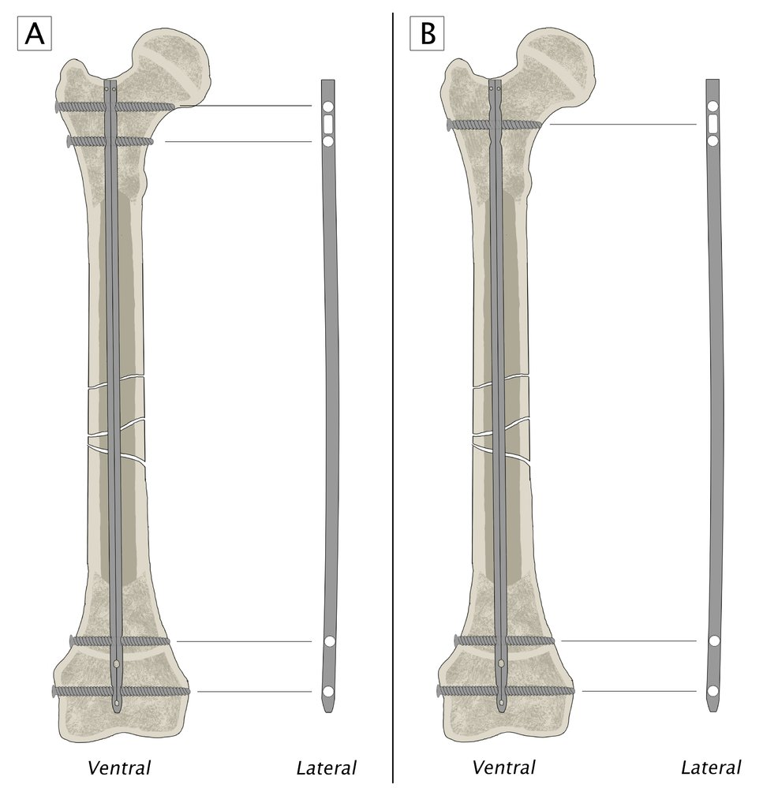

# Femoral shaft fracture

*Categories: Clinical knowledge > Emergency medicine > Trauma > Femoral shaft fracture*

[Original Article Link](https://coursology-qbank.com/amboss/article/o300jf)

---

## Summary

A femoral shaft <u>fracture</u> is a <u>fracture</u> anywhere along the <u>diaphysis</u> of the <u>femur</u>. These injuries typically result from high-impact trauma (e.g., <u>motor vehicle collisions</u>) and are more common in younger individuals. Low-impact shaft <u>fractures</u> most commonly occur in older adults with pre-existing <u>osteopenia</u>. Affected patients often present with <u>pain</u> and swelling along the thigh and additional findings consistent with <u>fracture</u> (e.g., limb shortening). <u>Signs of fracture</u> on <u>x-ray</u> confirm the diagnosis; advanced imaging studies may be required for surgical planning or if results are inconclusive. In adults, a <u>traction</u> <u>splint</u> may be considered as a temporizing measure; definitive treatment involves <u>internal fixation</u> with an <u>intramedullary nail</u>. In children, treatment varies with age. Complications include vascular compromise and <u>fat embolism</u>.

For <u>fractures of the femoral head</u>, neck, and trochanter, see “<u>Hip fractures</u>.”

---

## Etiology

A <u>fracture</u> in the <u>diaphysis</u> (shaft) of the <u>femur</u>  caused by:

* High-impact trauma: <u>motor vehicle collision</u>, pedestrian-versus-vehicle accidents, falls, <u>gunshot wounds</u>

* Low-impact injuries associated with <u>pathological fractures</u> : fall from standing (height > 1 m)

* <u>Stress fractures</u> (rare): seen in long-distance runners

---

## Clinical features

* Painful, swollen, tense thigh

* Restricted <u>range of motion</u>

* Limb shortening

* <u>Signs of fracture</u> (e.g., deformity, <u>crepitus</u>)

* <u>Features of open fractures</u> (e.g., <u>lacerations</u>)

* Signs of <u>neurovascular injury</u> (rare in closed injuries) [[1]](https://coursology-qbank.com/amboss/article/AN1Rdh0)

* Commonly associated injuries include knee and <u>hip fractures</u> and <u>knee ligament injuries</u>. [[1]](https://coursology-qbank.com/amboss/article/AN1Rdh0)

---

## Diagnosis

### Clinical evaluation [[1]](https://coursology-qbank.com/amboss/article/AN1Rdh0)

Urgent orthopedic consultation is indicated for patients with any features of <u>neurovascular injury</u> or <u>open fracture</u>.

* <u>Neurovascular examination</u>

* Assess <u>capillary refill time</u> and <u>distal</u> pulses.

* Evaluate for <u>sciatic nerve injuries</u>.

* <u>Skin examination</u>: Evaluate for <u>lacerations</u>, tearing, and tenting.

### <u>X-ray</u>

#### Views [[2]](https://coursology-qbank.com/amboss/article/GFdBj70)

* <u>Femur</u>: anteroposterior (AP) and <u>lateral</u> views

* Hip: AP and <u>lateral</u> views

* Knee: AP and <u>lateral</u> views

* <u>Pelvis</u>: AP view

#### Findings [[1]](https://coursology-qbank.com/amboss/article/AN1Rdh0)

* <u>Radiographic signs of a fracture</u>

* <u>Fracture</u> fragments, displacement, angulation, and/or <u>dislocation</u>

Displaced femoral fracture

### Advanced imaging

* CT 

* Indicated if <u>x-ray</u> findings are inconclusive and for preoperative planning in complicated <u>fractures</u> and assessment of associated injuries

* See “<u>CT imaging in trauma</u>.”

* <u>CT angiography</u>: indicated for <u>signs of vascular injury</u>

* <u>MRI</u>: : may be indicated to assess for associated <u>tendon</u> and <u>ligament injuries</u> and <u>pathological fractures</u> [[3]](https://coursology-qbank.com/amboss/article/yuddF70)

Right femoral shaft fracture and bilateral tibial plateau fracture (3D CT reconstruction)

---

## Management

Often managed surgically in adults. See “<u>Femoral shaft fractures in children</u>” for the management of pediatric patients.

### Initial management [[1]](https://coursology-qbank.com/amboss/article/AN1Rdh0)[[4]](https://coursology-qbank.com/amboss/article/ZyYZd7)

For unstable patients and those with <u>polytrauma</u>, follow the <u>ATLS algorithm</u>.

* Initiate <u>general fracture care</u>, including <u>analgesia</u>.

* Consider a <u>traction</u> <u>splint</u> for temporary <u>immobilization</u>. [[4]](https://coursology-qbank.com/amboss/article/ZyYZd7)

* Urgently consult orthopedic <u>surgery</u>.

* Admit to the hospital for <u>surgery</u>.

> [!WARNING]
> Femoral shaft <u>fractures</u> can cause significant blood loss into the thigh compartment, potentially leading to <u>hemorrhagic shock</u>.

### Surgical management [[1]](https://coursology-qbank.com/amboss/article/AN1Rdh0)[[5]](https://coursology-qbank.com/amboss/article/wFdh470)

* First-line: <u>internal fixation</u> with an <u>intramedullary nail</u>

* Alternatives

* Temporary <u>external fixation</u> (e.g., in patients with <u>polytrauma</u> or <u>open fractures</u>)  [[6]](https://coursology-qbank.com/amboss/article/DFd1470)

* <u>Plate fixation</u> [[7]](https://coursology-qbank.com/amboss/article/vFdAP70)

Intramedullary nail fixation of femoral shaft fracture

---

## Complications

* See “<u>Complications of fractures</u>” (especially vascular injury and <u>fat embolism</u>).

* Posttraumatic deformity

* Rotational error

* <u>Osteoarthritis of the knee</u>

* <u>Myositis ossificans</u>

> [!WARNING]
> Look out for symptoms of <u>fat embolism</u>: <u>altered mental status</u>, <u>respiratory distress</u>, <u>petechiae</u>, and <u>fever</u>. [[8]](https://coursology-qbank.com/amboss/article/xB1E1j0)

We list the most important complications. The selection is not exhaustive.

---