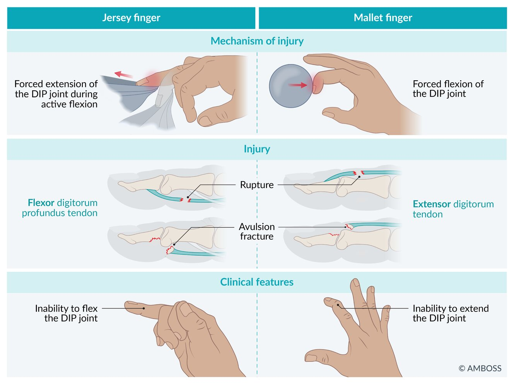
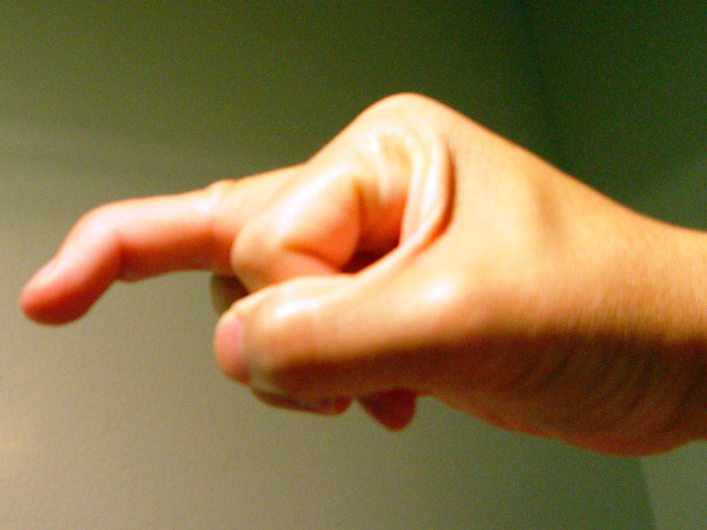
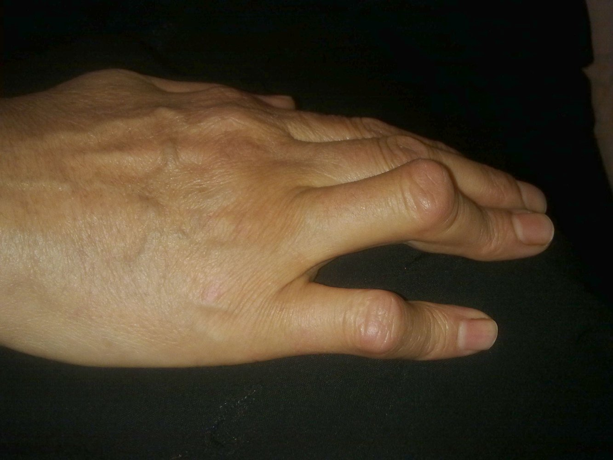

# Finger injuries

*Categories: Clinical knowledge > Emergency medicine > Trauma > Finger injuries*

[Original Article Link](https://coursology-qbank.com/amboss/article/N30-if)

---

## Summary

Finger injuries are often caused by blunt or <u>penetrating trauma</u> and include <u>tendon</u> injuries, <u>phalangeal fractures</u>, <u>nail bed injuries</u>, <u>dislocations</u>, and <u>amputations</u>. A thorough assessment of the injured finger and hand is necessary to determine appropriate management. Examination of the injured finger includes visual inspection for cuts and deformities, assessment of <u>capillary refill</u>, evaluation of <u>sensory function</u>, and testing active <u>range of motion</u> (<u>ROM</u>) and strength against resistance. <u>X-rays</u> are used to assess for <u>fractures</u> and/or foreign bodies. Rarely, <u>MRI</u> or <u>ultrasound</u> may be used to assess <u>ligament</u> or <u>tendon</u> injuries.

<u>Tendon</u> injuries can be closed or open. Open injuries are most commonly caused by a <u>laceration</u> and typically require surgical repair; closed injuries are usually caused by forced extension or <u>flexion</u> of the phalangeal <u>joints</u> and often occur while exercising or playing sports. All closed flexor <u>tendon</u> injuries require surgical repair, but most closed extensor <u>tendon</u> injuries can be <u>managed conservatively</u> with splinting. Long-term complications of closed flexor <u>tendon</u> injuries include <u>joint contractures</u> and chronic deformities. <u>Dislocations</u> at the <u>metacarpophalangeal joint</u> can be simple or complex. Simple <u>dislocations</u> can be managed in the outpatient setting with <u>closed reduction</u> and splinting; complex <u>dislocations</u> require specialist intervention. Management of <u>phalangeal fractures</u> is determined by <u>fracture</u> location and characteristics. If initiated promptly, most <u>fractures</u> can be successfully managed with <u>immobilization</u> and early outpatient follow-up. <u>Traumatic amputation</u> of all or part of the finger requires urgent consultation with hand <u>surgery</u> to preserve viable tissue. <u>Crush injuries</u> from <u>blunt trauma</u> are often associated with <u>open fractures</u> and usually require surgical consultation. Management of <u>nail</u> injuries may include repair of <u>nail</u> bed <u>lacerations</u> and drainage of any associated <u>subungual hematomas</u>. Finger swelling, whether traumatic or atraumatic, can lead to <u>ring entrapment</u> and secondary <u>ischemia</u>. Conservative methods of <u>ring removal</u> (e.g., lubrication of the finger) can be attempted if there is no evidence of vascular compromise, but immediate removal with ring cutters is required if there are signs of <u>ischemia</u>.

See also “<u>High-pressure injection injuries</u>” and “<u>Bite wounds</u>.”

---

## Tendon and ligament injuries

### Overview

|  Overview of closed tendon and ligament injuries of the digits [[1]](https://coursology-qbank.com/amboss/article/AN1Rdh0)[[2]](https://coursology-qbank.com/amboss/article/zr1rPR0)  |  |  |  |  |
| --- | --- | --- | --- | --- |
|  | Description | Etiology | Clinical features | Definitive management |
|  <u>Jersey finger</u>   |  * <u>Avulsion injury</u> or rupture of the <u>flexor digitorum profundus</u> <u>tendon</u> from the <u>distal</u> <u>phalanx</u>   |  * Hyperextension of a flexed <u>DIP</u> <u>joint</u> (forced extension)   |   * <u>Pain</u> and swelling of the <u>palmar</u> aspect of the <u>DIP</u> <u>joint</u>  * Loss of <u>DIP</u> <u>flexion</u>    |  * All patients: operative treatment   |
|  <u>Mallet finger</u>   |   * <u>Avulsion injury</u> or rupture of the <u>extensor digitorum</u> <u>tendon</u> from the <u>distal</u> <u>phalanx</u>  * May be associated with an <u>avulsion fracture</u> of the <u>distal</u> <u>phalanx</u>    |  * Hyperflexion of the <u>DIP</u> <u>joint</u> (forced <u>flexion</u>)   |  * Loss of <u>DIP</u> extension   |   * Most patients: <u>conservative treatment</u> (<u>finger splint</u> in extension)  * Displaced <u>fracture</u> and/or ≥ 45° extension deficit: operative treatment    |
|  <u>Boutonniere deformity</u>   |  * Slippage or disruption of the central band of the <u>extensor digitorum</u> <u>tendon</u>   |   * Direct trauma  * <u>Rheumatoid arthritis</u>    |  * Hyperextension of the <u>DIP</u> <u>joint</u> with <u>flexion</u> of the <u>PIP</u> <u>joint</u>   |   * Most patients: <u>conservative treatment</u> (<u>finger splint</u> in extension)  * Chronic <u>Boutonniere deformity</u>: operative treatment    |
|  <u>Gamekeeper's thumb</u> (<u>Skier's thumb</u>) |  * Tear of the ulnar collateral <u>ligament</u> (UCL)   |  * Hyperextension and forced <u>abduction</u> of the <u>MCP joint</u>   |   * <u>Pain</u>, swelling, and laxity of the <u>MCP joint</u>  * Symptoms worsen with extension or <u>abduction</u>.  * Weak <u>pinch grip</u>    |   * Most patients: <u>conservative treatment</u> (<u>thumb spica splint</u>)  * Persistent deformity: operative treatment    |

---

## Closed tendon injuries

### Jersey finger [[1]](https://coursology-qbank.com/amboss/article/AN1Rdh0)[[2]](https://coursology-qbank.com/amboss/article/zr1rPR0)

* Affected <u>tendon</u>: <u>flexor digitorum profundus</u> (<u>FDP</u>); most commonly in the ring finger

* Mechanism of injury

* Sudden hyperextension of a flexed <u>DIP</u> <u>joint</u> (forced extension) → avulsion <u>fracture</u> and/or rupture of the <u>FDP</u> <u>tendon</u> at the insertion

* Often seen when athletes grab an opponent's jersey

* Clinical features

* <u>Pain</u>, swelling of the <u>DIP</u> <u>joint</u> (<u>palmar</u> aspect)

* Extension of the <u>DIP</u> <u>joint</u> at rest

* Inability to flex the <u>DIP</u> <u>joint</u>

* Treatment: Operative repair is always required. 

* Immobilize the finger with a <u>dorsal splint</u>.

* Refer to hand <u>surgery</u> within 7 days.

> [!WARNING]
> <u>Jersey finger</u> is often misdiagnosed as a <u>sprain</u> and therefore undertreated.

Jersey and mallet finger

### Mallet finger [[1]](https://coursology-qbank.com/amboss/article/AN1Rdh0)[[2]](https://coursology-qbank.com/amboss/article/zr1rPR0)

* Affected <u>tendon</u>: <u>extensor digitorum</u>

* Mechanism of injury

* Sudden hyperflexion of the <u>DIP</u> <u>joint</u> (forced <u>flexion</u>) → rupture of the <u>distal</u> portion of the <u>extensor digitorum</u> <u>tendon</u> and/or avulsion of the <u>extensor digitorum</u> from the <u>distal</u> <u>phalanx</u>

* Often caused by a ball hitting the tip of the finger

* May be associated with an <u>avulsion fracture</u> of the <u>distal</u> <u>phalanx</u>

* Clinical features

* Inability to extend the <u>DIP</u> <u>joint</u>

* The <u>DIP</u> <u>joint</u> remains in a flexed position at rest.

* Treatment

* Refer to hand <u>surgery</u> within 7 days.

* No <u>fracture</u> or nondisplaced <u>fractures</u>: <u>Splint</u> the <u>DIP</u> <u>joint</u> in full extension for 6–8 weeks followed by nighttime splinting.

* Displaced <u>fractures</u> or significant articular involvement: surgical repair

Jersey and mallet finger

Mallet finger

### Boutonniere deformity [[1]](https://coursology-qbank.com/amboss/article/AN1Rdh0)[[2]](https://coursology-qbank.com/amboss/article/zr1rPR0)

* Affected <u>tendon</u>: central slip of the <u>extensor digitorum</u>

* Mechanism of injury: slippage or disruption of the central band of the <u>extensor digitorum</u>

* Trauma: <u>laceration</u> or blunt injury

* <u>Rheumatoid arthritis</u>

* Clinical features: hyperextension of the <u>DIP</u> <u>joint</u> with <u>flexion</u> of the <u>PIP</u> <u>joint</u>

* Treatment

* <u>Splint</u> the <u>PIP</u> <u>joint</u> in full extension for 4–6 weeks followed by nighttime splinting.

* Refer to hand <u>surgery</u> within 7 days.

* Surgical repair (e.g., repair of the central slip, <u>tenotomy</u>, <u>arthrodesis</u>) is often required for chronic <u>Boutonniere deformity</u>.

> [!TIP]
> <u>Boutonniere deformity</u> commonly manifests 7–14 days after the original injury. [[2]](https://coursology-qbank.com/amboss/article/zr1rPR0)

Boutonniere deformity

### Complications [[1]](https://coursology-qbank.com/amboss/article/AN1Rdh0)[[2]](https://coursology-qbank.com/amboss/article/zr1rPR0)

* <u>Tendon</u> adhesions (most common) and <u>joint</u> stiffness

* <u>Flexion</u> <u>contracture</u> of <u>joints</u>

* <u>Tendon</u> rupture

* <u>Stenosing tenosynovitis</u>

* <u>Swan neck deformity</u>

* Chronic <u>mallet finger</u> deformity

---

## Amputations

### Initial approach

* Follow the <u>approach to finger injuries</u>.

* <u>Examine the injured finger</u> to identify the site of <u>amputation</u> and any exposed bone.

* Perform <u>digital tendon integrity testing</u> and assess the attachment of the extensor and flexor <u>tendons</u> to the <u>distal</u> <u>phalanx</u>.

> [!TIP]
> Remember to provide <u>tetanus prophylaxis</u> if indicated.

### <u>Distal</u> <u>amputation</u> [[1]](https://coursology-qbank.com/amboss/article/AN1Rdh0)[[2]](https://coursology-qbank.com/amboss/article/zr1rPR0)

* Description: <u>amputation of the fingertip</u> without disruption of insertion of the <u>FDP</u> or <u>extensor digitorum</u> <u>tendons</u>; bony <u>distal</u> <u>phalanx</u> may or may not be exposed

* Management [[1]](https://coursology-qbank.com/amboss/article/AN1Rdh0)

* Consult hand <u>surgery</u> for most patients.

* Small tuft avulsions (<u>nail</u> intact, minimal to no bone exposure, <u>soft tissue</u> loss < 1 cm2) may be treated in the ED or outpatient setting.

* Perform <u>irrigation</u> and <u>debridement</u> of nonviable tissue.

* If necessary, trim a small amount of exposed bone with a rongeur.

* Approximate tissue with loose closure if feasible; otherwise, allow the wound to <u>heal by secondary intention</u>.

* Administer prophylactic <u>antibiotics</u> if the wound is contaminated or the patient is <u>immunocompromised</u> (see “<u>Open phalangeal fracture</u>”). [[1]](https://coursology-qbank.com/amboss/article/AN1Rdh0)

* Inform patients that discomfort may last for 7–10 days and that healing will take 4–6 weeks.

### <u>Proximal</u> <u>amputation</u> [[2]](https://coursology-qbank.com/amboss/article/zr1rPR0)[[10]](https://coursology-qbank.com/amboss/article/o2W0ik0)

* Description: <u>amputation</u> <u>proximal</u> to the insertion of <u>FDP</u> and <u>extensor digitorum</u> <u>tendons</u>

* Management

* Apply direct pressure to the wound for <u>hemorrhage control</u>; avoid <u>tourniquets</u>, as they increase the risk of local <u>thromboembolic events</u>.

* Protect the amputated digit.

* Cover the digit with gauze moistened with saline.

* Place in a watertight bag.

* Place the bag in an ice bath in a sealed container.

* Obtain <u>x-rays</u> of the remaining finger and the amputated digit.

* Irrigate the wound gently to avoid further tissue damage.

* Begin IV <u>antibiotics</u>, e.g., <u>cefazolin</u> DOSAGE or, if the patient is allergic to <u>penicillin</u>, <u>vancomycin</u> DOSAGE. [[1]](https://coursology-qbank.com/amboss/article/AN1Rdh0)

* Consult hand <u>surgery</u> immediately.

* Reimplantation

* The decision of whether to attempt reimplantation depends on multiple factors: the type of injury, patient motivation, need for fine motor skills, and comorbidities.

* Features that support proceeding with reimplantation include:

* Short <u>ischemia</u> time  [[10]](https://coursology-qbank.com/amboss/article/o2W0ik0)

* Thumb <u>amputation</u>

* Multiple <u>finger amputation</u>

* Any <u>amputation</u> in a child

* <u>Amputation</u> <u>distal</u> to FDS insertion

* Complications

* Wound infection: <u>stump pain</u>, <u>erythema</u>, <u>fever</u>, and wound drainage

* <u>Edema</u>

* <u>Contractures</u>, leading to deformities and diminished function in the <u>joint</u> adjacent to the stump

* <u>Skin</u> <u>necrosis</u> over the <u>distal</u> edge of the remaining finger

> [!WARNING]
> Do not allow the amputated part of the finger to come into direct contact with ice, as this can cause further damage.

---