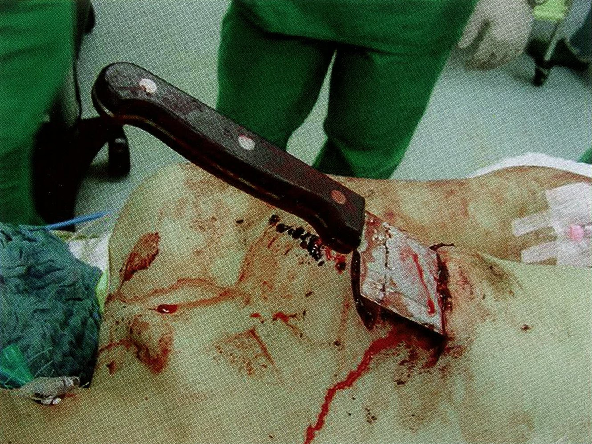
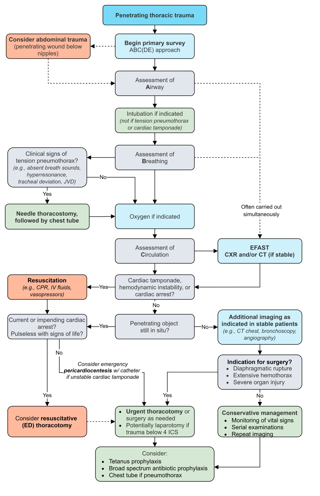
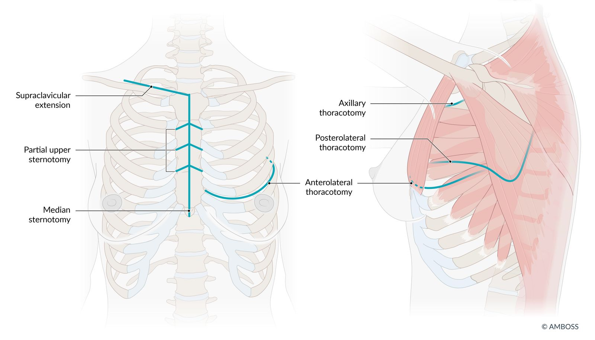
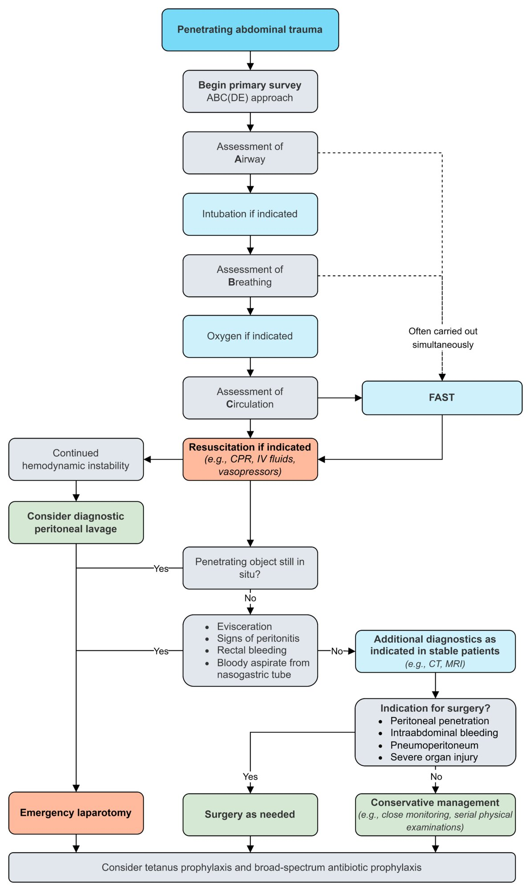

# Penetrating trauma

*Categories: Clinical knowledge > Emergency medicine > Trauma > Penetrating trauma*

[Original Article Link](https://coursology-qbank.com/amboss/article/_P05hT)

---

## Summary

Penetrating trauma is an injury caused by a foreign object piercing the <u>skin</u>, resulting in damage to underlying structures and an <u>open wound</u>. The most common types of penetrating injuries are <u>gunshot wounds</u> and <u>stab wounds</u>. Clinical features and diagnostic studies vary based on the type of penetrating trauma and the injured region of the body. The assessment of patients with penetrating trauma follows the systematic evaluation outlined in Advanced Trauma Life Support (<u>ATLS</u>): <u>primary survey</u>, transfer to a <u>trauma center</u> (if indicated), <u>secondary survey</u>, and <u>tertiary survey</u>. Management involves treating immediately life-threatening injuries and surgical repair of traumatic injuries.

See also “<u>Management of trauma patients</u>” and “<u>Blunt trauma</u>.”

---

## Overview

Management of penetrating trauma is based on the type and location of the injury. Recommendations in this article are consistent with the 2018 <u>ATLS algorithm</u>. [[1]](https://coursology-qbank.com/amboss/article/ZyYZd7)

### Stab wounds [[1]](https://coursology-qbank.com/amboss/article/ZyYZd7)[[2]](https://coursology-qbank.com/amboss/article/AN1Rdh0)

* <u>Epidemiology</u>: ∼ 1500 people die from <u>stab wounds</u> annually in the US [[3]](https://coursology-qbank.com/amboss/article/XWW9P40)

* Mechanism of injury

* Caused by the thrusting action of a pointed object (e.g., knife, broken bottle)

* The depth of the injury is usually greater than the width.

* Tissue is <u>lacerated</u> and torn along the path of the object.

> [!WARNING]
> Only remove impaled foreign bodies (e.g., knives) in settings where definitive <u>hemostatic control</u> is possible (e.g., operating room) as they might be tamponading injured <u>blood vessels</u>. [[4]](https://coursology-qbank.com/amboss/article/RYWlKP0)

Stab wound to the chest

### Gunshot wounds (<u>GSWs</u>) [[1]](https://coursology-qbank.com/amboss/article/ZyYZd7)[[2]](https://coursology-qbank.com/amboss/article/AN1Rdh0)

* <u>Epidemiology</u>

* <u>Mortality rate</u> for <u>gunshot injuries</u> in the US is 10.2 per 100,000 adults. [[5]](https://coursology-qbank.com/amboss/article/ACXRuZ0)

* Most deaths are due to firearm-related <u>suicide</u> rather than homicide (2:1). [[6]](https://coursology-qbank.com/amboss/article/_CX5uZ0)

* Mechanism of injury

* Tissue is <u>lacerated</u> and crushed along the path of the bullet.

* Tissue is displaced forward and radially, resulting in cavitation and pressure injury of nearby structures.

* The level of injury is related to the <u>kinetic energy</u> of the bullet; energy varies based on factors such as bullet weight and <u>velocity</u>.

* Dense organs (e.g., <u>liver</u>, bone) absorb more <u>kinetic energy</u> than less dense organs, resulting in greater injury.

### <u>Sites of penetrating trauma</u> [[1]](https://coursology-qbank.com/amboss/article/ZyYZd7)

|  Penetrating trauma by body region [[1]](https://coursology-qbank.com/amboss/article/ZyYZd7)  |  |  |
| --- | --- | --- |
|   Location  | Injuries | Management |
| Head |  * <u>Penetrating head injury</u>   |  * See “<u>Traumatic brain injury management</u>” and “<u>Open head injury</u>.”   |
| Neck |   * <u>Tracheobronchial injury</u>  * <u>Esophageal injury</u>  * Vascular injury (e.g., carotid <u>artery</u>, <u>vertebral artery</u>, jugular <u>vein</u>)  * <u>Cranial nerve</u> injury (e.g., <u>vagus nerve</u>, <u>recurrent laryngeal nerve</u>)  * <u>Pneumothorax</u>    |  * See “<u>Approach to penetrating neck trauma</u>.”   |
| Chest |   * <u>Cardiac tamponade</u>  * <u>Hemothorax</u>  * <u>Pneumothorax</u>  * <u>Tracheobronchial injury</u>  * <u>Diaphragmatic injury</u>  * <u>Spinal cord injury</u>  * <u>Fractures</u> (e.g., <u>rib fractures</u>, <u>vertebral fractures</u>)  * Vascular injury (e.g., aorta, vena cava)    |  * See “<u>Approach to penetrating chest trauma</u>.”   |
| Abdomen and <u>pelvis</u> |   * <u>Diaphragmatic injury</u>  * <u>Hollow viscus perforation</u>  * Solid organ injury (e.g., <u>liver</u>, <u>spleen</u>)  * <u>Genitourinary trauma</u>    |  * See “<u>Approach to penetrating abdominal trauma</u>.”   |
| Extremity |   * <u>Neurovascular injury</u>  * <u>Fracture</u>  * <u>Compartment syndrome</u>    |  * See “<u>Approach to penetrating extremity trauma</u>.”   |

---

## Penetrating chest trauma

### Approach to penetrating chest trauma [[1]](https://coursology-qbank.com/amboss/article/ZyYZd7)

Ensure the following components are included as part of the standard <u>management of trauma patients</u> using the <u>ATLS algorithm</u>:

* <u>Primary survey</u>

* Identify and treat <u>respiratory failure</u> and <u>shock</u>, <u>tension pneumothorax</u>, <u>open pneumothorax</u>, <u>massive hemothorax</u>, and <u>cardiac tamponade</u> (see “Treatment” for details).

* If at a non-<u>trauma center</u>, initiate transfer to <u>trauma center</u>; penetrating injury to the torso is an <u>indication for trauma team activation</u>.

* Perform <u>resuscitative thoracotomy</u> if indicated.

* See “<u>Traumatic circulatory arrest</u>” for the management of <u>cardiac arrest</u> due to trauma.

* <u>Secondary survey</u>

* Examine <u>axillae</u>, back, and flank for wounds that could enter the <u>thoracic cavity</u>.

* Evaluate for <u>penetrating thoracoabdominal and flank injuries</u>.

* Obtain <u>urgent diagnostics for trauma patients</u>, including CT chest, once stable (see “Diagnostics”).

* Assess for indications for <u>urgent thoracotomy</u>.

Management of penetrating thoracic trauma

### Clinical features

* <u>Hemorrhagic shock</u> and/or <u>obstructive shock</u> (e.g., <u>hypotension</u>, <u>tachycardia</u>)

* <u>Respiratory distress</u> (e.g., <u>tachypnea</u>, <u>hypoxia</u>)

* Absent or decreased breath sounds

* <u>Penetrating chest wound</u>, e.g., <u>sucking chest wound</u>

* Impaled foreign body (e.g., knife)

* <u>Beck triad</u>

* <u>Subcutaneous emphysema</u>

* <u>Tracheal deviation</u>

> [!WARNING]
> Consider cardiac injury in patients with <u>stab wounds</u> to the cardiac box, i.e., a surface anatomy square bordered superiorly by the sternal notch, inferiorly by the <u>xiphoid process</u>, and laterally by the <u>nipples</u>. [[7]](https://coursology-qbank.com/amboss/article/3fWSNk0)

### Diagnostics

See “<u>Urgent diagnostics for trauma patients</u>” for a comprehensive approach.

* Bedside assessment: <u>CXR</u> , <u>eFAST</u>

* <u>CT imaging in trauma</u>

* CT chest with IV contrast

* <u>CTA</u> chest if vascular injury is suspected.

* Additional testing: <u>bronchoscopy</u>, <u>esophagoscopy</u>, <u>echocardiography</u>

> [!WARNING]
> Do not delay treatment of clinically diagnosed <u>tension pneumothorax</u> to obtain radiologic confirmation. [[1]](https://coursology-qbank.com/amboss/article/ZyYZd7)

Stab wound to the chest

### Treatment

#### Bedside interventions

Perform the following during the <u>primary survey</u>:

* <u>Respiratory failure</u>: <u>RSI</u> and <u>mechanical ventilation</u> (See “<u>Ventilation strategy for chest trauma</u>.”)

* <u>Tension pneumothorax</u>: Perform <u>emergency chest decompression</u>.

* <u>Open pneumothorax</u>: Place 3-sided <u>occlusive dressing</u>.

* <u>Traumatic hemothorax</u>: <u>Place chest tube</u>.

* <u>Cardiac tamponade</u>: Perform <u>pericardiocentesis</u> followed by <u>pericardial window</u>, or <u>resuscitative thoracotomy</u>.

* Loss of <u>vital signs</u> due to <u>penetrating chest trauma</u>: Perform <u>resuscitative thoracotomy</u>.

#### Urgent thoracotomy

* Definition: a surgical procedure performed in the operating room to obtain access to the <u>thoracic cavity</u> to treat acute injuries to thoracic organs (e.g., <u>heart</u>, <u>lungs</u>, <u>esophagus</u>)

* Indications

* <u>Hemorrhagic shock</u> (e.g., <u>hypotension</u>, <u>tachycardia</u>)

* <u>Massive hemothorax</u>; any of the following:

* <u>Hemorrhagic shock</u>, e.g., need for multiple <u>blood transfusions</u>

* <u>Chest tube</u> output ≥ 1500 mL immediately upon placement

* <u>Chest tube</u> output ≥ 200 mL/hour for 2–4 hours

* Impaled penetrating object

* <u>Cardiac tamponade</u>

* <u>Open pneumothorax</u>

* Tracheobronchial tree injury (e.g., persistent air leak)

* <u>Esophageal injury</u>

Surgical approaches to the thoracic cavity

---

## Penetrating abdominopelvic trauma

### Approach to penetrating abdominal trauma [[1]](https://coursology-qbank.com/amboss/article/ZyYZd7)

Ensure the following components are included as part of the standard <u>management of trauma patients</u> using the <u>ATLS algorithm</u>:

* <u>Primary survey</u>

* Perform <u>FAST exam</u> and portable <u>CXR</u>.

* Treat <u>hemorrhagic shock</u> with <u>emergency transfusion</u> and <u>immediate hemodynamic support</u>.

* If at a non-<u>trauma center</u>, initiate transfer to a <u>trauma center</u>; penetrating torso injury is an <u>indication for trauma team activation</u>.

* Identify obvious indications for <u>exploratory laparotomy</u>, e.g., <u>hypotension</u>, <u>evisceration</u>, <u>peritoneal signs</u>, subdiaphragmatic air on <u>CXR</u>.

* <u>Secondary survey</u>

* Examine flank, back, and groin for wounds that could penetrate the <u>abdominal cavity</u>.

* Locally explore wounds for evidence of violation of the abdominal <u>fascia</u>.

* Evaluate for <u>penetrating thoracoabdominal and flank injuries</u>.

* Obtain <u>urgent diagnostics for trauma patients</u>, including contrast CT abdomen and <u>pelvis</u>, once stable (see “Diagnostics”).

* Identify other radiological indications for <u>exploratory laparotomy</u>.

> [!WARNING]
> In persistently unstable patients with indications for <u>exploratory laparotomy</u> during the <u>primary survey</u>, do not delay operative management (e.g., <u>damage control surgery</u>) for <u>CT scanning</u>. [[1]](https://coursology-qbank.com/amboss/article/ZyYZd7)

Management of penetrating abdominal trauma

### Clinical features [[1]](https://coursology-qbank.com/amboss/article/ZyYZd7)

* <u>Hemorrhagic shock</u> (e.g., <u>hypotension</u>, <u>tachycardia</u>)

* Penetrating abdominal wound

* Impaled foreign body (e.g., knife)

* <u>Signs of peritonitis</u>

* Evisceration Protusion of intraabdominal organs through a wound to the outside of the body.

> [!TIP]
> Significant <u>intraperitoneal</u> injury occurs in ∼ 98% of abdominal <u>gunshot wounds</u> and ∼ 30% of abdominal <u>stab wounds</u>. [[1]](https://coursology-qbank.com/amboss/article/ZyYZd7)

### Diagnostics [[1]](https://coursology-qbank.com/amboss/article/ZyYZd7)

See “<u>Urgent diagnostics for trauma patients</u>” for a comprehensive approach.

* General imaging in trauma: <u>CXR</u>, <u>pelvic</u> <u>x-ray</u>

* Bedside intraabdominal hemorrhage assessment: <u>FAST</u> or eFAST, or <u>diagnostic peritoneal lavage</u> (<u>DPL</u>)

* <u>CT imaging in trauma</u>

* Minimum evaluation: CT abdomen and <u>pelvis</u> with IV contrast

* If <u>penetrating thoracoabdominal injury</u> is suspected, add CT chest and consider double-contrast CT or triple-contrast CT.

* Minimally invasive surgical assessment

* Local wound exploration

* <u>Diagnostic laparoscopy</u>

> [!WARNING]
> <u>Retroperitoneal</u> injuries may be missed on <u>DPL</u> and <u>FAST</u>. [[1]](https://coursology-qbank.com/amboss/article/ZyYZd7)

> [!WARNING]
> If indicated, do not delay <u>exploratory laparotomy</u> to obtain <u>CT scans</u>. [[1]](https://coursology-qbank.com/amboss/article/ZyYZd7)

### Exploratory laparotomy [[1]](https://coursology-qbank.com/amboss/article/ZyYZd7)

* Definition: an urgent surgical procedure in which the <u>abdominal cavity</u> is opened via a midline <u>incision</u> and the four quadrants are evaluated for pathologies (e.g., bleeding, perforation)

* Indications

* Clinical

* <u>Hypotension</u>

* <u>Peritoneal signs</u>

* <u>Evisceration</u>

* Penetrating injury (e.g., <u>GSW</u>) with a trajectory that enters or traverses the <u>peritoneal cavity</u>

* Evidence of GI, GU, or <u>rectal bleeding</u>

* Diagnostic

* <u>Pneumoperitoneum</u> and/or <u>retroperitoneal</u> air

* <u>Diaphragmatic rupture</u>

* GI, <u>bladder</u>, renal, or severe solid organ injury on CT

* Positive <u>DPL</u>

### <u>Conservative management</u> [[8]](https://coursology-qbank.com/amboss/article/iTcJqb0)

Consider the following in consultation with the <u>trauma team</u> for select stable patients without indications for <u>exploratory laparotomy</u>:

* 24-hour observation

* <u>Vital signs</u> monitoring

* <u>Serial abdominal examinations</u>

* <u>Serial hemoglobin and hematocrit measurements</u>

* Repeat imaging if clinical status changes

* <u>Diagnostic laparoscopy</u> in select patients, e.g., to identify <u>diaphragmatic injury</u>

* Other <u>supportive care</u> for trauma (See “<u>Secondary survey</u>” for details.)

---

## Penetrating neck trauma

### Approach to penetrating neck trauma [[1]](https://coursology-qbank.com/amboss/article/ZyYZd7)

Ensure the following components are included as part of the standard <u>management of trauma patients</u> using the <u>ATLS algorithm</u>:

* <u>Primary survey</u>

* Prepare for <u>difficult airway management</u> and <u>secure the airway</u> early (see “Treatment”).

* Consider <u>C-spine immobilization</u> if a <u>C-spine fracture</u> is suspected, e.g., <u>focal neurological deficit</u>, low <u>GCS</u> or intoxication, <u>GSW</u>.  [[10]](https://coursology-qbank.com/amboss/article/7XW4zP0)

* Apply direct pressure to active hemorrhage.

* Assess for <u>hard signs of penetrating neck injury</u> requiring emergency <u>surgery</u>.

* If at a non-<u>trauma center</u>, initiate transfer to a <u>trauma center</u>; <u>penetrating neck injury</u> is an <u>indication for trauma team activation</u>.

* <u>Secondary survey</u>

* Examine <u>neck wound</u> without probing for violation of the <u>platysma</u>.

* Perform <u>neurological examination</u>.

* Obtain <u>urgent diagnostics for trauma patients</u>, including <u>CTA</u> neck, once stable (see “Diagnostics”).

* Consult specialists depending on the injured anatomical structures (see “Disposition”).

> [!WARNING]
> Do not probe penetrating <u>neck wounds</u> as this can cause life-threatening bleeding.

### Clinical features [[2]](https://coursology-qbank.com/amboss/article/AN1Rdh0)[[11]](https://coursology-qbank.com/amboss/article/GXWBzP0)

* Penetrating <u>neck wound</u>

* Impaled foreign body (e.g., knife)

#### Hard signs of penetrating neck injury [[2]](https://coursology-qbank.com/amboss/article/AN1Rdh0)

The presence of any of the following increases the likelihood of life-threatening injury requiring surgical intervention often bypassing CT imaging:

* <u>Airway</u> or <u>esophageal injury</u>

* <u>Airway</u> compromise

* Wound bubbling

* Extensive <u>subcutaneous emphysema</u>

* <u>Hoarseness</u> and/or <u>stridor</u>

* Vascular injury

* <u>Hemorrhagic shock</u> (e.g., <u>hypotension</u>, <u>tachycardia</u>)

* Pulsatile bleeding

* Expanding <u>hematoma</u>

* <u>Carotid bruit</u>

* Unilateral <u>pulse deficit</u>

* <u>Signs of stroke</u>

#### Soft signs of <u>penetrating neck injury</u>

The presence of any of the following increases the likelihood of serious injury and often requires a <u>CTA</u> neck for further evaluation:

* <u>Airway</u> or <u>esophageal injury</u>

* <u>Hemoptysis</u> and/or <u>hematemesis</u>

* <u>Dysphonia</u>

* <u>Dysphagia</u>

* Mild <u>subcutaneous emphysema</u>

* Vascular injury

* Minor bleeding

* Nonexpanding <u>hematoma</u>

* Proximity wound

> [!TIP]
> Any <u>penetrating neck trauma</u> that violates the <u>platysma</u> requires surgical consultation. [[10]](https://coursology-qbank.com/amboss/article/7XW4zP0)

> [!WARNING]
> <u>Cervical collars</u> can obscure injuries. Remove the <u>cervical collar</u> and maintain <u>manual inline cervical stabilization</u> while examining the patient.

### Classification

The following zones of the neck were classically used to predict which underlying structures might be injured and to guide management, however, this is being supplanted by the 'no zone' approach, which focuses on identifying <u>hard signs of penetrating neck injury</u> plus <u>CTA</u> for stable patients to guide management.  [[10]](https://coursology-qbank.com/amboss/article/7XW4zP0)[[11]](https://coursology-qbank.com/amboss/article/GXWBzP0)

* Zone 1: from the sternal notch to the cricoid <u>cartilage</u>

* Zone 2: from the cricoid <u>cartilage</u> to the angle of the <u>mandible</u>

* Zone 3: from the angle of the <u>mandible</u> to the <u>skull base</u>

### Diagnostics [[2]](https://coursology-qbank.com/amboss/article/AN1Rdh0)

See “<u>Urgent diagnostics for trauma patients</u>” for a comprehensive approach.

* Bedside assessment: <u>CXR</u>, <u>eFAST</u> to rule out <u>pneumothorax</u> or apical <u>lung injury</u> from supraclavicular neck injuries

* <u>CT imaging in trauma</u>: <u>CTA</u> neck

* Additional testing: varies based on the suspected injury

* Vascular injury: <u>duplex ultrasound</u>, <u>angiography</u>

* <u>Esophageal injury</u>: <u>esophagoscopy</u>, <u>esophagogram</u>

* Laryngeal injury: <u>direct laryngoscopy</u>, <u>flexible nasopharyngoscopy</u>

### Treatment [[1]](https://coursology-qbank.com/amboss/article/ZyYZd7)[[2]](https://coursology-qbank.com/amboss/article/AN1Rdh0)[[12]](https://coursology-qbank.com/amboss/article/8XWO-P0)

* Urgent surgical repair is typically indicated for vascular, laryngotracheal, and <u>esophageal injuries</u>.

* <u>Esophageal perforation</u> typically requires <u>broad-spectrum antibiotics</u> and <u>NPO</u> status.

* <u>C-spine fractures</u> can be treated operatively or nonoperatively (see “<u>Vertebral fractures</u>” for details).

#### <u>Airway management</u> [[10]](https://coursology-qbank.com/amboss/article/7XW4zP0)

* If there are <u>signs of airway compromise</u>, call for help immediately (e.g., emergent anesthesia or ENT consult).

* Perform <u>BMV</u> cautiously.

* Prepare for <u>difficult airway management</u> by an experienced provider. 

* <u>Intubation via direct laryngoscopy</u> or <u>videolaryngoscopy</u> using a smaller-sized <u>ET tube</u> can be attempted initially if anatomy is preserved.

* <u>Awake fiberoptic intubation</u> is preferred for distorted anatomy.

* Prepare for <u>emergency surgical airway</u> as a backup.

* If a <u>cervical collar</u> is applied, remove it and perform <u>manual in-line cervical stabilization</u> during <u>airway management</u>.

> [!WARNING]
> <u>Cricothyroidotomy</u> may be impossible if anatomic landmarks are invisible or deformed, e.g., due to a <u>laryngeal fracture</u>. Emergency <u>tracheostomy</u> may be required for a <u>failed intubation</u>. [[1]](https://coursology-qbank.com/amboss/article/ZyYZd7)

### Disposition [[2]](https://coursology-qbank.com/amboss/article/AN1Rdh0)

* Consult surgical subspecialties based on clinical and diagnostic findings.

* Vascular injuries: vascular <u>surgery</u>

* Laryngotracheal injuries: otolaryngology

* <u>Spinal fractures</u>: orthopedic <u>surgery</u>

* <u>Esophageal injuries</u>: thoracic <u>surgery</u>

* Admit asymptomatic patients with no concerning findings on <u>CTA</u> for serial examinations for 24–36 hours.

---

## Penetrating extremity trauma

### Approach to penetrating extremity trauma [[1]](https://coursology-qbank.com/amboss/article/ZyYZd7)

Ensure the following components are included as part of the standard <u>management of trauma patients</u> using the <u>ATLS algorithm</u>:

* <u>Primary survey</u>

* Apply direct pressure and/or a <u>tourniquet</u> if there is active extremity hemorrhage.

* Immobilize fractured limbs early.

* If at a non-<u>trauma center</u>, initiate transfer to a <u>trauma center</u> for <u>hard signs of extremity vascular injury</u>; <u>proximal</u> limb penetrating injury is an <u>indication for trauma team activation</u>.

* <u>Secondary survey</u>

* Perform detailed <u>neurovascular examination</u> of the affected extremity.

* Provide <u>supportive care</u>, e.g., <u>analgesia</u>, <u>tetanus prophylaxis</u>.

* Obtain <u>urgent diagnostics for trauma patients</u>, including <u>x-ray</u> and/or <u>CTA</u> extremity, once stable (see “Diagnostics”).

* Determine if there is a need for surgical consultation based on injury characteristics (e.g., vascular <u>surgery</u>, orthopedic <u>surgery</u>)

### Clinical features

* <u>Hemorrhagic shock</u> (e.g., <u>hypotension</u>, <u>tachycardia</u>)

* Penetrating extremity wound

* Impaled foreign body (e.g., knife)

* Neurological deficit (e.g., loss of strength and/or sensation)

* <u>Acute compartment syndrome</u>

#### Hard signs of extremity vascular injury [[13]](https://coursology-qbank.com/amboss/article/tdWX740)

* Active hemorrhage

* Absent <u>distal</u> pulses

* Pulsatile <u>hematoma</u>

* New <u>bruit</u>

* <u>Distal</u> <u>ischemia</u>

### Diagnostics

See “<u>Urgent diagnostics for trauma patients</u>” for a comprehensive approach.

* Vascular injury

* Arterial-brachial index (<u>ABI</u>)

* <u>CTA</u> of the injured limb  [[14]](https://coursology-qbank.com/amboss/article/8dWO740)

* <u>Duplex ultrasound</u>

* Bony injury: <u>x-ray</u> of the injured limb

### Treatment

* Vascular injury

* <u>Hemostatic control</u>

* Consult vascular <u>surgery</u> for patients with <u>hard signs of extremity vascular injury</u> or abnormal imaging.

* <u>Fracture</u>

* Immobilize with a <u>splint</u> (see “<u>Upper extremity splints</u>” and “<u>Lower extremity splints</u>” for details).

* Consult orthopedic <u>surgery</u> and provide <u>antibiotic prophylaxis for open fractures</u>.

> [!TIP]
> Consider any penetrating wound with a concomitant <u>fracture</u> an <u>open fracture</u> until proven otherwise. [[1]](https://coursology-qbank.com/amboss/article/ZyYZd7)

### Disposition [[14]](https://coursology-qbank.com/amboss/article/8dWO740)

* Patients with suspected vascular injury or <u>open fracture</u> typically require admission and specialist consult.

* Patients without clinical features of vascular injury and an <u>ABI</u> > 0.9 may be discharged with <u>return precautions</u> for <u>signs of compartment syndrome</u>.

---