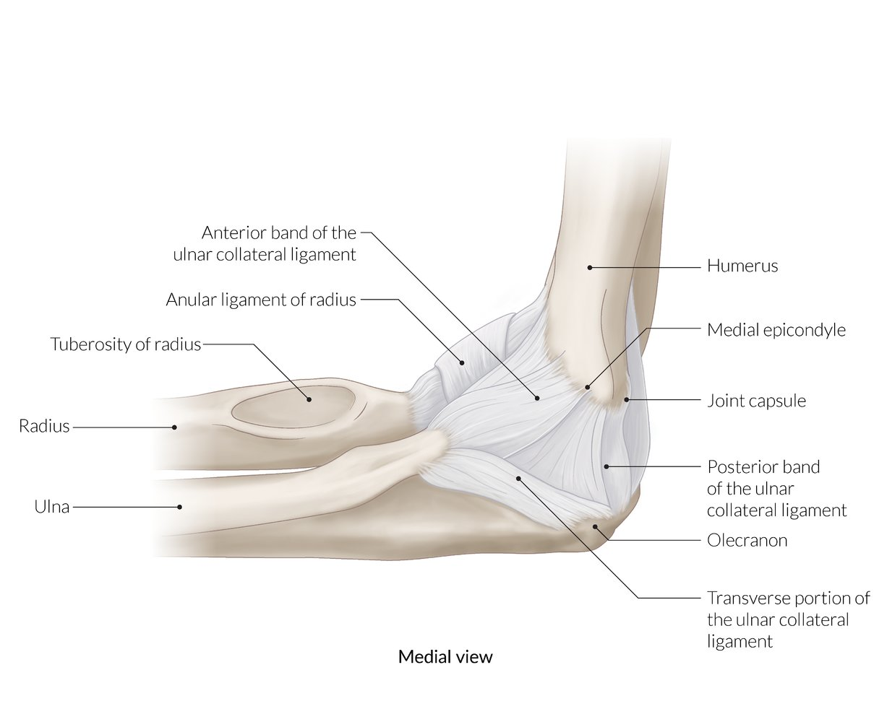
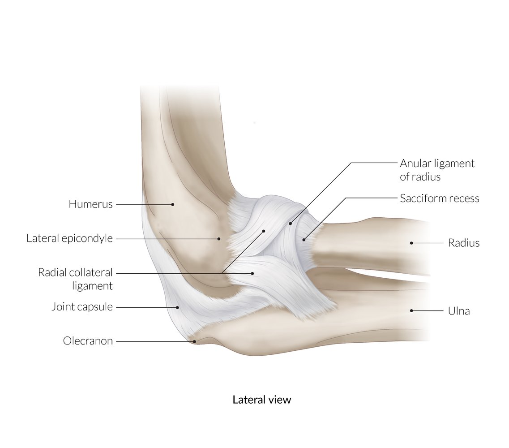
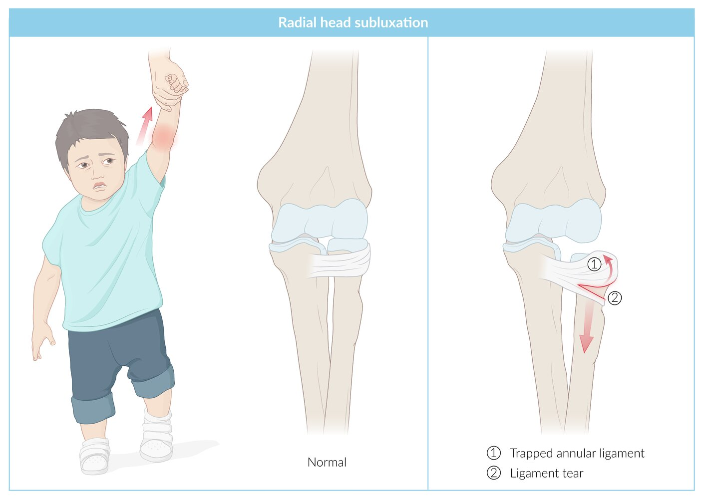
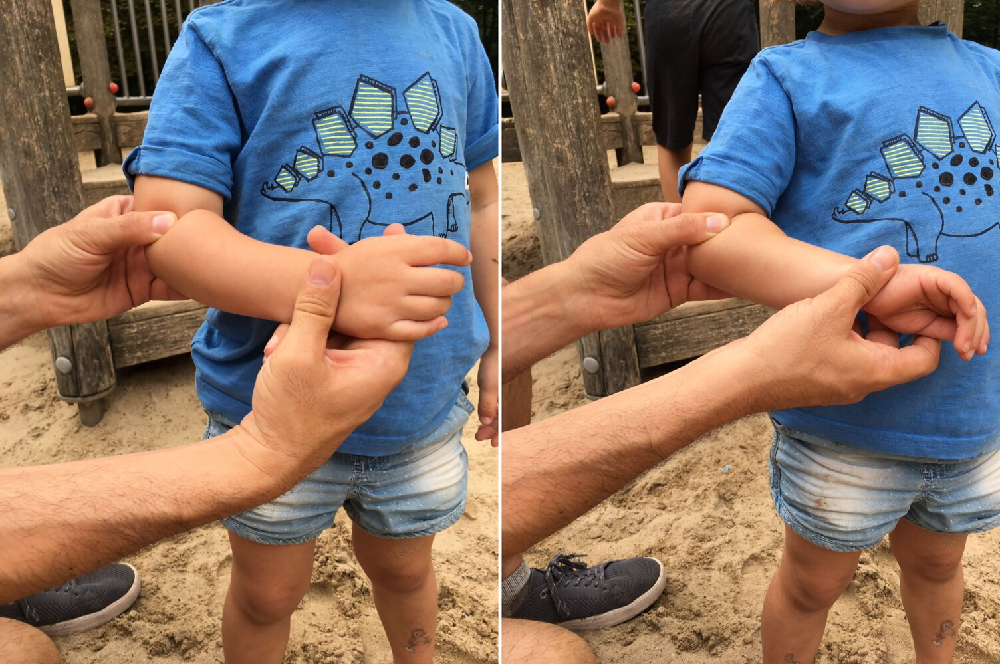

# Radial head subluxation

*Categories: Clinical knowledge > Emergency medicine > Trauma > Radial head subluxation*

[Original Article Link](https://coursology-qbank.com/amboss/article/4303if)

---

## Summary

<u>Radial head</u> subluxation (commonly referred to as pulled <u>elbow</u> or nursemaid <u>elbow</u>) refers to the partial <u>dislocation</u> of the <u>head of the radius</u> at the level of the <u>radio-humeral joint</u>. The injury most commonly occurs in young children after sudden tugging of the outstretched and <u>pronated</u> arm (e.g., if an adult suddenly pulls a child's arm to prevent them from falling). Clinical signs include painful and limited movement of the upper extremity and guarding, with the arm held in a flexed and <u>pronated</u> position. Diagnosis is usually clinical, based on classic history and examination findings. Imaging is reserved for cases of diagnostic uncertainty or if treatment is unsuccessful. Management is usually conservative and involves <u>closed manual reduction</u> of the <u>radial head</u>. The reduction can be carried out in an outpatient setting and does not require any <u>immobilization</u> of the <u>elbow</u> or further surgical treatment. <u>Radial head fractures</u> can cause <u>hemarthrosis</u>, which may be the only visible sign on the <u>elbow</u> <u>x-ray</u>. Most <u>radial head fractures</u> are <u>treated conservatively</u>, with only <u>complex fractures</u> managed surgically.

---

## Definitions

* Subluxation of the <u>radial head</u>, facilitated by the <u>weakness</u> of the immature annular <u>ligament</u>, causing the radius to slip out of the annular <u>ligament</u> and the annular <u>ligament</u> to become entrapped within the <u>humeroradial joint</u> [[1]](https://coursology-qbank.com/amboss/article/Wi0Pqf)[[2]](https://coursology-qbank.com/amboss/article/bi0HJf)

Elbow joint (medial view)

Elbow joint (lateral view)

---

## Epidemiology

* Age

* 1–5 years (peak <u>incidence</u> between two and three years) [[3]](https://coursology-qbank.com/amboss/article/7j14bS0)[[4]](https://coursology-qbank.com/amboss/article/2i0TIf)

* <u>Radial head</u> subluxation is the most common <u>elbow</u> injury in children under 5 years of age and occurs exclusively in this age group.  [[5]](https://coursology-qbank.com/amboss/article/35YSPp)

* Sex: <u>♀</u> > <u>♂</u> [[4]](https://coursology-qbank.com/amboss/article/2i0TIf)[[5]](https://coursology-qbank.com/amboss/article/35YSPp)

* <u>Risk factors</u>

* Previous history of <u>radial head</u> subluxation  [[6]](https://coursology-qbank.com/amboss/article/uR0pKf)[[7]](https://coursology-qbank.com/amboss/article/Ui0bIf)

* <u>Obesity</u>  [[4]](https://coursology-qbank.com/amboss/article/2i0TIf)

Epidemiological data refers to the US, unless otherwise specified.

---

## Etiology

* Traumatic (most common)

* Sudden axial <u>traction</u> of the <u>pronated</u> and extended forearm [[5]](https://coursology-qbank.com/amboss/article/35YSPp)

* Typical activities: adult quickly pulls up a falling child by the hand; , swings a child by the hands, or drags a child by the arm (hence the term “nursemaid's <u>elbow</u>”) [[3]](https://coursology-qbank.com/amboss/article/7j14bS0)[[8]](https://coursology-qbank.com/amboss/article/tR0XKf)

* Congenital structural abnormalities: e.g., <u>collagen</u> abnormalities, abnormal <u>endochondral ossification</u> of the <u>growth plate</u> and <u>ossification</u> sites external to the <u>joint</u> [[9]](https://coursology-qbank.com/amboss/article/1i02qf)

Radial head subluxation

---

## Clinical features

* Child holds the arm, with the <u>elbow</u> extended or slightly flexed and <u>pronated</u>. [[5]](https://coursology-qbank.com/amboss/article/35YSPp)

* <u>Pain</u>, aggravated by movement [[5]](https://coursology-qbank.com/amboss/article/35YSPp)

* Reduced <u>range of movement</u> (<u>ROM</u>) with limited extension and <u>flexion</u>

* No swelling

* History and findings may be atypical, especially with children < 3 years of age, who may be unable to properly articulate their symptoms or the circumstances of the injury. [[1]](https://coursology-qbank.com/amboss/article/Wi0Pqf)

---

## Management

### Approach [[3]](https://coursology-qbank.com/amboss/article/7j14bS0)[[5]](https://coursology-qbank.com/amboss/article/35YSPp)

* Assess the child's entire arm and <u>clavicle</u>.

* Classic <u>clinical features of radial head subluxation</u>: Proceed directly to treatment.

* Perform a <u>closed manual reduction</u>.

* Successful reduction leads to rapid (10–30 minutes) restoration of <u>pain</u>-free normal <u>ROM</u>.

* Can be repeated once if the initial attempt is unsuccessful

* Diagnostic uncertainty or unsuccessful reduction

* Obtain imaging to rule out <u>differential diagnoses of radial head subluxation</u>.

* Unsuccessful reduction but imaging supports the diagnosis:

* Immobilize the arm.

* Refer to orthopedic <u>surgery</u> for evaluation within 2 days.

> [!TIP]
> <u>Radial head</u> subluxation is typically a <u>clinical diagnosis</u>; a classic history and examination and successful <u>closed manual reduction</u> confirm the diagnosis. Imaging is not usually required. [[3]](https://coursology-qbank.com/amboss/article/7j14bS0)

### <u>Closed manual reduction</u> [[3]](https://coursology-qbank.com/amboss/article/7j14bS0)[[10]](https://coursology-qbank.com/amboss/article/Od1IJf0)

* Neither anesthesia nor sedation is required.

* Apply pressure to the <u>radial head</u> and perform one of the following maneuvers: [[11]](https://coursology-qbank.com/amboss/article/y41dNS0)

* Hyperpronation maneuver: Hyperpronate the forearm (with the <u>elbow</u> extended or flexed at 90 degrees).   [[12]](https://coursology-qbank.com/amboss/article/Hj1KbS0)

* <u>Supination</u>-<u>flexion</u> maneuver: <u>Supinate</u> the forearm, then immediately flex the <u>elbow</u>.

* A pop or click may be felt or heard.

* Leave the room, ensuring there are toys for the child to play with, and reassess after 10–30 minutes.  [[5]](https://coursology-qbank.com/amboss/article/35YSPp)

* Following successful reduction, the child should have full, <u>pain</u>-free <u>ROM</u>.

Hyperpronation maneuver for reduction of a radial head subluxation

#### Postreduction care

* Neither follow-up nor modifications to normal activity are required.

* Educate caregivers on how to prevent a recurrence.  [[3]](https://coursology-qbank.com/amboss/article/7j14bS0)[[5]](https://coursology-qbank.com/amboss/article/35YSPp)

* Patients with recurrent subluxations: Consider arm <u>immobilization</u>.  [[3]](https://coursology-qbank.com/amboss/article/7j14bS0)

### Imaging [[3]](https://coursology-qbank.com/amboss/article/7j14bS0)[[5]](https://coursology-qbank.com/amboss/article/35YSPp)

Imaging is not routinely performed before or after reduction in patients with classic <u>clinical features of radial head subluxation</u>. Imaging (typically <u>x-ray</u>) is usually only performed in cases of diagnostic uncertainty or unsuccessful reduction.

#### <u>X-ray</u> <u>elbow</u> (AP and <u>lateral</u>) [[3]](https://coursology-qbank.com/amboss/article/7j14bS0)[[5]](https://coursology-qbank.com/amboss/article/35YSPp)

* Indications

* Mechanism of injury is atypical, significant (e.g., a fall), or unknown. [[13]](https://coursology-qbank.com/amboss/article/8j1OXS0)

* Examination is atypical or reveals significant tenderness to palpation, effusion, or <u>ecchymosis</u>.

* Reduction is unsuccessful.

* Consider for nonambulatory <u>infants</u> to exclude <u>differential diagnoses of radial head subluxation</u>.  [[13]](https://coursology-qbank.com/amboss/article/8j1OXS0)

* Findings

* Often normal

* May show displacement of the <u>radiocapitellar line</u> (not sensitive or specific) [[14]](https://coursology-qbank.com/amboss/article/tj1XXS0)

#### Other modalities

* <u>Ultrasound</u>: Findings may include the following.

* Widened space between the <u>radial head</u> and <u>capitellum</u>

* Displacement of the annular <u>ligament</u>

* Hook sign  [[3]](https://coursology-qbank.com/amboss/article/7j14bS0)[[15]](https://coursology-qbank.com/amboss/article/ci0aqf)

* <u>MRI</u>: may be used in atypical cases [[1]](https://coursology-qbank.com/amboss/article/Wi0Pqf)

> [!WARNING]
> <u>Radial head</u> subluxation is not typically associated with swelling, deformity, or vascular or neurological compromise; if present, obtain imaging to exclude <u>differential diagnoses of radial head subluxation</u>. [[3]](https://coursology-qbank.com/amboss/article/7j14bS0)

---