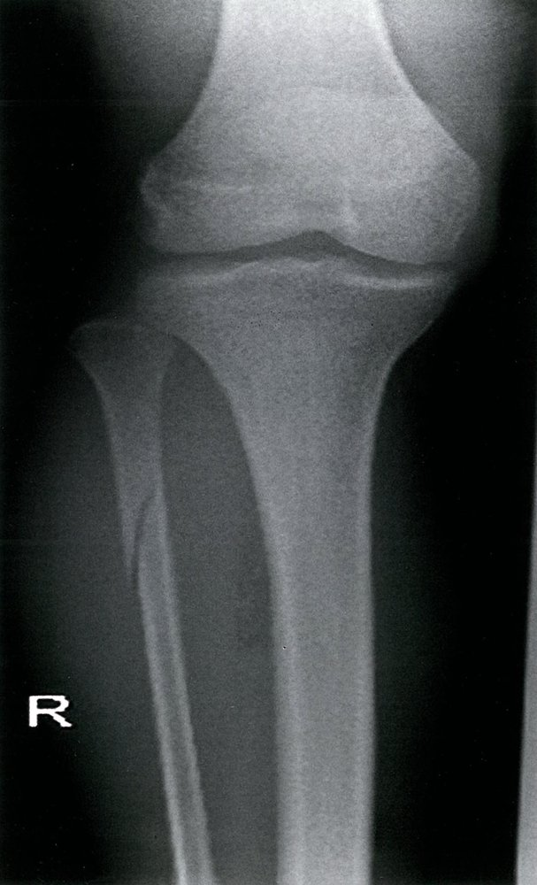
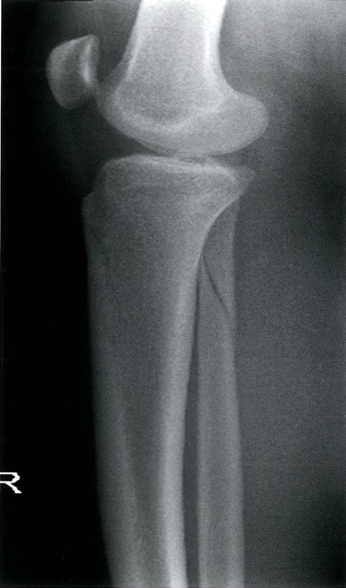
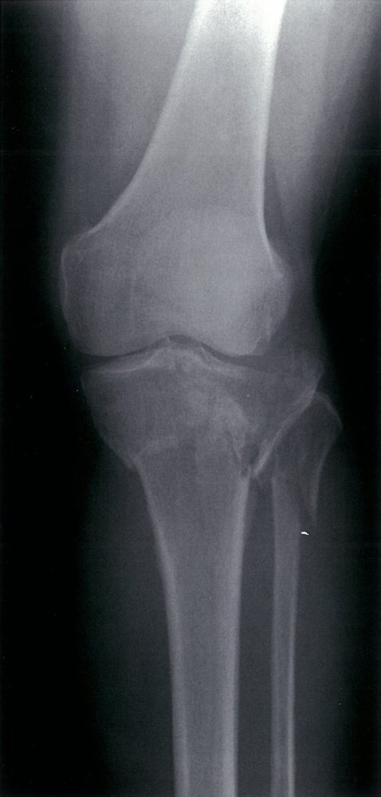
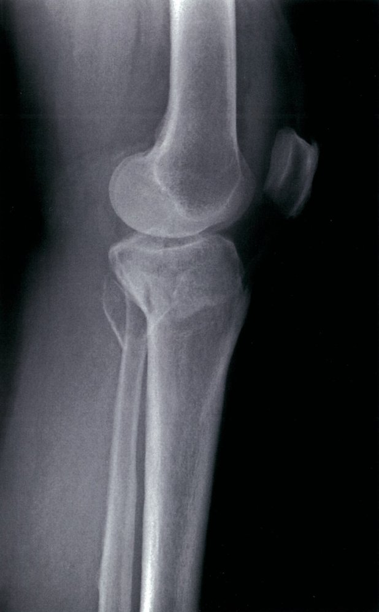
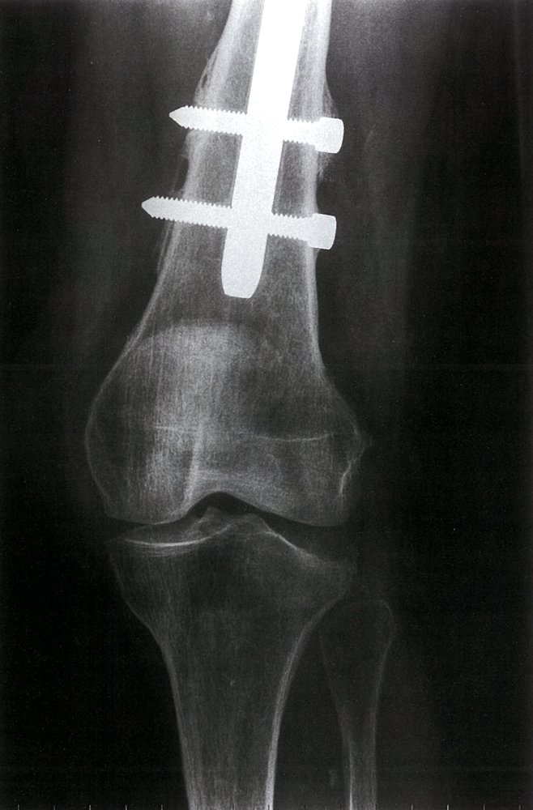
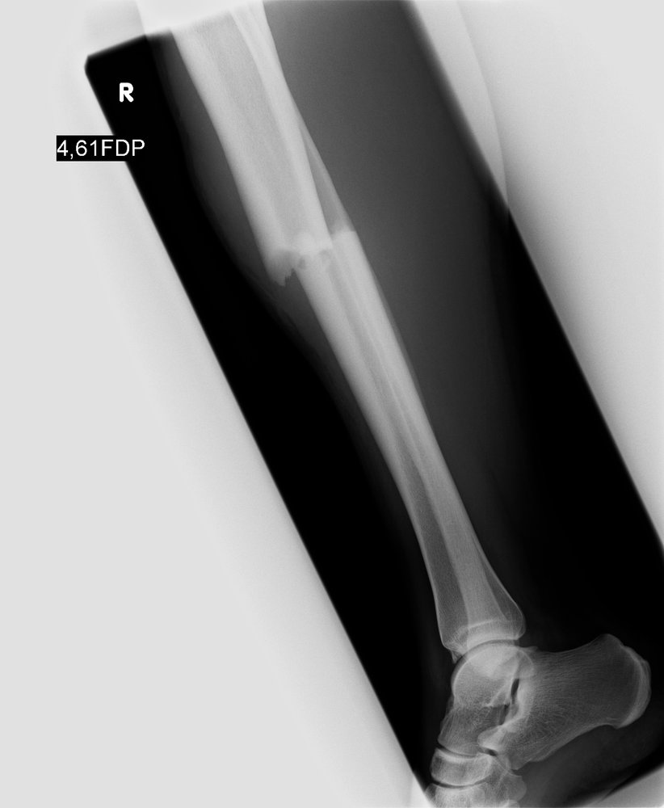
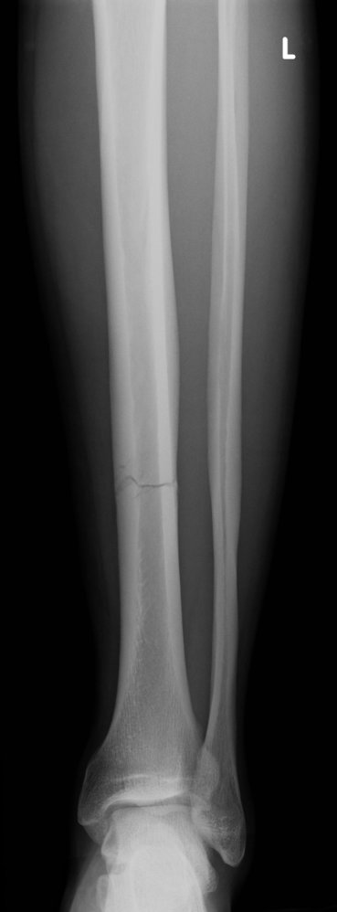
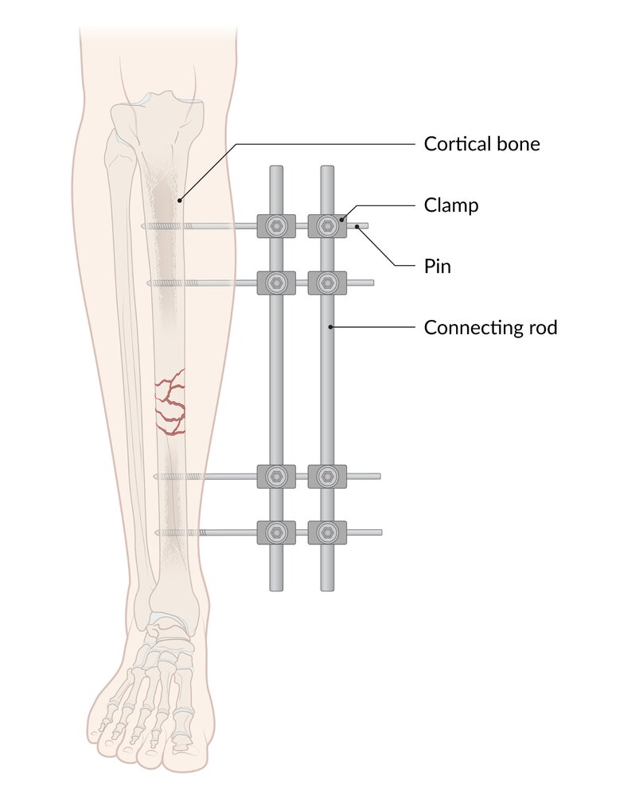
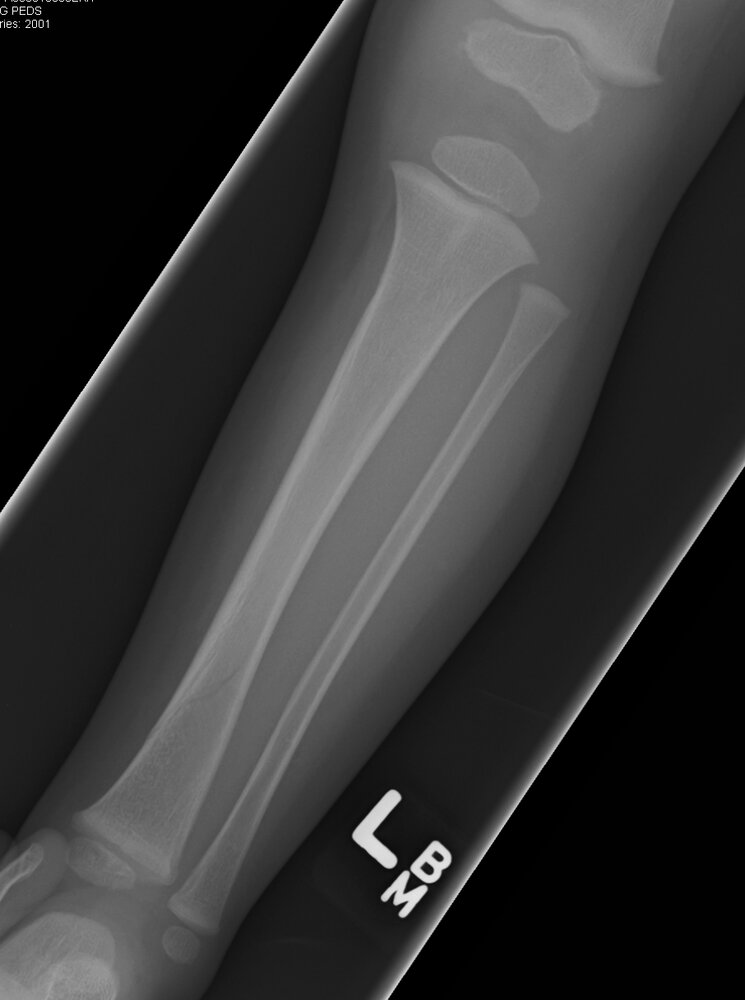

# Tibial and fibular fractures

*Categories: Clinical knowledge > Emergency medicine > Trauma > Tibial and fibular fractures*

[Original Article Link](https://coursology-qbank.com/amboss/article/K30Ujf)

---

## Summary

Tibial and <u>fibular fractures</u> are common types of <u>long bone</u> injuries and are usually caused by direct trauma. <u>Fractures</u> may occur proximally, at the shaft, or distally. Since only a small amount of <u>soft tissue</u> covers the <u>tibia</u> and <u>fibula</u>, there is a high risk of <u>open fractures</u>. <u>X-rays</u> are the initial diagnostic test of choice. Initial management varies by <u>fracture</u> location and commonly involves consulting orthopedic <u>surgery</u>, splinting, and <u>weight-bearing restrictions</u>. Complications include <u>common peroneal nerve injury</u> and <u>compartment syndrome</u>.

For <u>distal</u> tibial or <u>fibular fractures</u>, see “<u>Ankle fractures</u>.” See also “<u>Tibial stress fractures</u>.”

---

## Clinical features

* Local <u>pain</u>, tenderness, and/or deformity

* Swelling, <u>bruising</u>, and/or <u>hematoma</u>

* <u>Skin</u> abnormalities, e.g., <u>lacerations</u>, tenting

* Signs of <u>neurovascular injury</u>, e.g.:

* <u>Common peroneal nerve injury</u>, e.g., <u>foot drop</u>, impaired <u>foot eversion</u>, sensory deficits

* <u>Posterior</u> <u>tibial nerve injury</u>, e.g., impaired <u>plantar flexion</u>, sensory deficit over the sole of foot

* Arterial injury, e.g., <u>hard signs of extremity vascular injury</u>, diminished <u>distal</u> pulses

* <u>Signs of compartment syndrome</u>

* See “<u>Fracture signs</u>.”

> [!TIP]
> Tibial and <u>fibular fractures</u> are at high risk of <u>open fractures</u> due to minimal surrounding <u>soft tissue</u>. [[1]](https://coursology-qbank.com/amboss/article/AN1Rdh0)

---

## Diagnosis

### Clinical evaluation [[1]](https://coursology-qbank.com/amboss/article/AN1Rdh0)

Urgent orthopedic consultation is indicated for any findings that suggest <u>neurovascular injury</u> or an <u>open fracture</u>.

* <u>Neurovascular examination</u>

* Assess <u>dorsalis pedis</u> and <u>posterior</u> tibial pulses and <u>capillary refill time</u>.

* Evaluate for <u>peroneal nerve injury</u> and <u>posterior</u> <u>tibial nerve injury</u>.

* <u>Skin examination</u>: Evaluate for <u>laceration</u>, tearing, and tenting.

Innervation areas of the peripheral nerves (leg, ventral view)

Innervation areas of the peripheral nerves (leg, dorsal view)

### <u>X-ray</u> [[1]](https://coursology-qbank.com/amboss/article/AN1Rdh0)[[2]](https://coursology-qbank.com/amboss/article/xRdE6p0)

Imaging for tibial and/or <u>fibular fractures</u> generally includes <u>x-rays</u> of the knee, <u>tibia</u> and <u>fibula</u>, and ankle.

* Views

* Knee 

* <u>Anterioposterior</u> (AP) and <u>lateral</u> views

* Intercondylar view for suspected <u>tibial plateau fractures</u>

* <u>Tibia</u> and <u>fibula</u>: AP and <u>lateral</u> views

* Ankle: AP, <u>lateral</u>, and <u>mortise views</u>

* Findings

* <u>Radiographic fracture signs</u>, <u>fracture</u> fragments, displacement, angulation, and/or <u>dislocation</u>

* In <u>tibial plateau fractures</u>, <u>lipohemarthrosis</u> may be visible as a <u>fat-fluid level</u>.  [[1]](https://coursology-qbank.com/amboss/article/AN1Rdh0)

* See also “<u>Ankle fracture diagnostics</u>.”

> [!WARNING]
> Evaluate for a <u>Maisonneuve fracture</u> in patients with a <u>proximal</u> <u>fibular fracture</u>, as <u>Maisonneuve fractures</u> are often unstable and require urgent orthopedic evaluation. [[1]](https://coursology-qbank.com/amboss/article/AN1Rdh0)

Proximal fibular fracture (1/2)

Proximal fibular fracture (2/2)

Tibial plateau and fibular fractures (1/2)

Tibial plateau and fibular fractures (2/2)

Lateral tibial plateau depression fracture

Tibial fracture

Tibial fracture

### Advanced imaging [[1]](https://coursology-qbank.com/amboss/article/AN1Rdh0)[[2]](https://coursology-qbank.com/amboss/article/xRdE6p0)

* CT: may be indicated for preoperative planning, <u>fractures</u> with intraarticular extension, or inconclusive <u>x-rays</u> with high clinical suspicion

* <u>MRI</u>: may be indicated for diagnosis of associated <u>tendon</u> and/or <u>ligament injuries</u>, e.g., <u>meniscal injury</u> associated with <u>tibial plateau fracture</u> [[3]](https://coursology-qbank.com/amboss/article/mRdVnp0)

> [!TIP]
> In patients with acute traumatic <u>knee pain</u>, tibial tenderness, inability to bear weight, and nondiagnostic <u>x-rays</u>, obtain a CT to rule out a <u>tibial plateau fracture</u>. [[1]](https://coursology-qbank.com/amboss/article/AN1Rdh0)

---

## Management

### Initial management by <u>fracture</u> type [[1]](https://coursology-qbank.com/amboss/article/AN1Rdh0)

* All patients

* Initiate <u>general fracture care</u>, including <u>analgesia</u>.

* Place patients on <u>non-weight-bearing status</u>.

* Identify <u>fractures requiring urgent orthopedic consultation</u>.

* Consider <u>VTE prophylaxis</u> in consultation with orthopedics.  [[1]](https://coursology-qbank.com/amboss/article/AN1Rdh0)

* <u>Tibial plateau fractures</u>

* Apply a knee immobilizer.

* Arrange orthopedic follow-up within 1 week.

* Tibial shaft <u>fractures</u> (with or without fibular shaft <u>fracture</u>)

* Perform <u>closed reduction</u> for displaced, deformed, or angulated <u>fractures</u> with neurovascular compromise.

* Immobilize in a <u>posterior long-leg splint</u>; consider adding a <u>stirrup splint</u> for <u>open fractures</u>.

* Consult orthopedics urgently.

* Isolated <u>proximal</u> or midshaft <u>fibular fractures</u>

* Immobilize in a <u>stirrup splint</u>.

* Arrange orthopedic follow-up within 1–2 weeks.

* <u>Distal</u> tibial or <u>fibular fractures</u>: See “<u>Ankle fractures</u>.”

> [!WARNING]
> For <u>proximal</u> <u>fibular fractures</u>, rule out associated <u>Maisonneuve fracture</u> and <u>common peroneal nerve injury</u>. [[1]](https://coursology-qbank.com/amboss/article/AN1Rdh0)

> [!WARNING]
> Identify and <u>treat acute compartment syndrome</u> in high-energy tibial and <u>fibular fractures</u> if present. [[4]](https://coursology-qbank.com/amboss/article/MkdMoJ0)

### Nonoperative management [[1]](https://coursology-qbank.com/amboss/article/AN1Rdh0)

* Indicated for most nondisplaced <u>closed fractures</u>, e.g.:

* <u>Tibial plateau fractures</u>

* Isolated <u>proximal</u> or midshaft <u>fibular fractures</u>

* Options include knee immobilizers and <u>posterior long-leg splints</u>.

* See “<u>Conservative treatment of fractures</u>.”

### Surgical management [[1]](https://coursology-qbank.com/amboss/article/AN1Rdh0)

* <u>Fractures</u> commonly requiring <u>surgery</u> include:

* <u>Open fractures</u>

* Displaced <u>fractures</u>

* <u>Fractures</u> with <u>neurovascular injury</u>

* Severe <u>tibial plateau fractures</u> (e.g., with comminution, significant articular <u>step-off deformity</u>, condylar widening, multiple condylar involvement) [[4]](https://coursology-qbank.com/amboss/article/MkdMoJ0)

* Operative techniques include:

* <u>Open reduction and internal fixation</u>

* <u>Closed reduction and internal fixation</u>

* <u>Intramedullary nailing</u>

* <u>External fixation</u>

External fixation of a comminuted fracture of the tibia

---

## Subtypes and variants

### Toddler fracture [[5]](https://coursology-qbank.com/amboss/article/0b1eH20)[[6]](https://coursology-qbank.com/amboss/article/ab1QH20)

* Definition: a nondisplaced <u>fracture</u> of the <u>distal</u> tibial shaft, usually following acute trauma (e.g., falling, tripping), causing rotation of the body around a fixed foot

* <u>Epidemiology</u>: : commonly seen in children between 9 months and 3 years of age [[6]](https://coursology-qbank.com/amboss/article/ab1QH20)

* Etiology: trauma (e.g., low-energy fall from a chair or table, tripping while running)

* Clinical features

* Irritability

* Abnormal gait (limping or inability to bear weight)

* Localized tenderness over the <u>distal</u> tibial shaft

* Diagnostics

* Often goes undetected due to subtle clinical and radiographic findings

* Imaging

* AP, <u>lateral</u>, and oblique <u>x-ray</u>

* <u>MRI</u> and/or CT: indicated in cases of prolonged symptoms and suspicion of infection (e.g., <u>osteomyelitis</u>)

* Treatment: <u>immobilization</u> with a long cast, controlled ankle movement walker boot, short cast, or <u>splint</u> [[7]](https://coursology-qbank.com/amboss/article/Yb1nH20)

Toddler fracture

---

## Complications

* Patients with <u>tibial fractures</u> should be monitored for:

* High risk of <u>compartment syndrome</u> in any of the compartments, given that the <u>tibia</u> is surrounded by the <u>anterior</u>, <u>lateral</u>, and deep <u>posterior</u> compartments of the lower leg

* <u>Fat embolism</u>

* <u>Peroneal nerve injury</u> (<u>foot drop</u>)

* <u>Deep vein thrombosis</u>

* <u>Nonunion</u>

* Posttraumatic <u>arthritis</u> [[8]](https://coursology-qbank.com/amboss/article/yHXdGz)

* See “<u>Fracture complications</u>.”

We list the most important complications. The selection is not exhaustive.

---