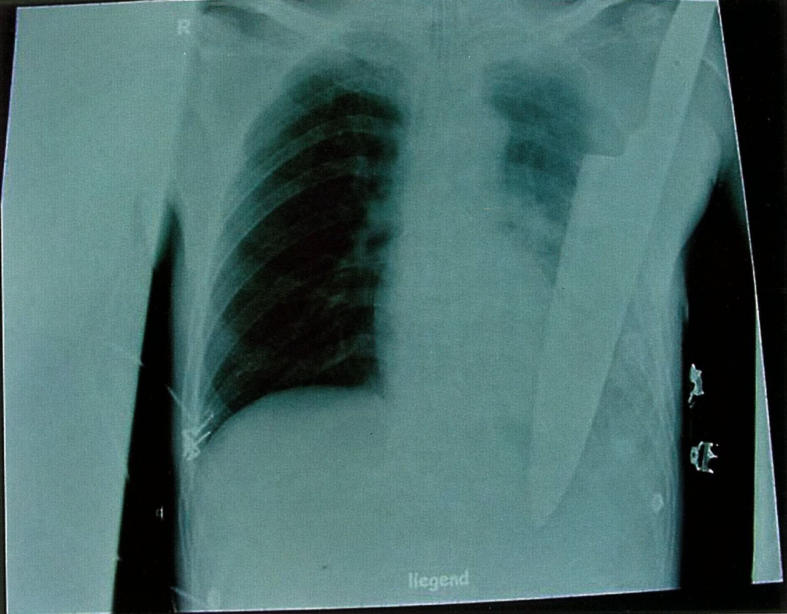
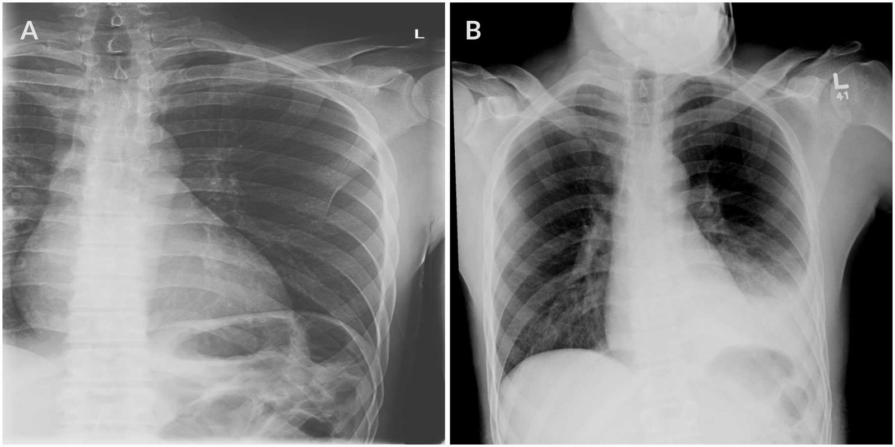
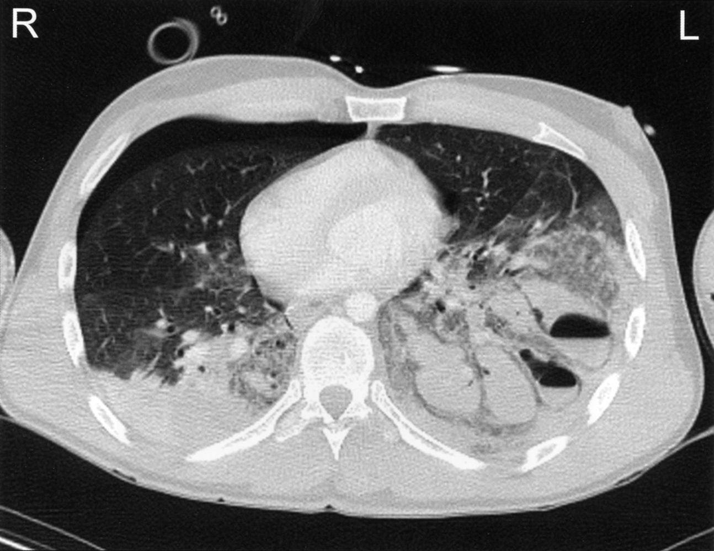

# Traumatic hemothorax

*Categories: Clinical knowledge > Emergency medicine > Trauma > Traumatic hemothorax*

[Original Article Link](https://coursology-qbank.com/amboss/article/t80Xo3)

---

## Summary

<u>Hemothorax</u> is the accumulation of blood in the <u>pleural cavity</u>, most commonly from intrathoracic vessel injury due to blunt or <u>penetrating trauma</u> or thoracic <u>surgery</u>; <u>spontaneous hemothorax</u> is rare. Clinical features include <u>respiratory distress</u>, diminished breath sounds, and dullness to percussion over the affected <u>lung</u>. Diagnosis is confirmed with <u>chest x-ray</u>, <u>ultrasound</u> (<u>eFAST</u>), or CT chest. Management depends on the size of the <u>hemothorax</u>: Observation may be suitable for small <u>hemothoraces</u> in stable patients, moderate to large <u>hemothoraces</u> require <u>chest tube</u> drainage, and <u>massive hemothorax</u> necessitates <u>urgent thoracotomy</u> for <u>hemorrhage control</u>. Complete drainage is critical to prevent complications such as <u>empyema</u> and <u>retained hemothorax</u>.

See “<u>Nontraumatic hemothorax</u>” for the approach to <u>spontaneous hemothorax</u>.

---

## Etiology

* <u>Penetrating chest trauma</u>

* <u>Blunt chest trauma</u>

* <u>Iatrogenic</u> (e.g., thoracic <u>surgery</u>)

---

## Clinical features

* <u>Hemorrhagic shock</u> (e.g., <u>hypotension</u>, <u>tachycardia</u>)

* <u>Respiratory distress</u>

* <u>Chest pain</u>

* Diminished or absent breath sounds

* Decreased <u>tactile fremitus</u>

* Dullness on percussion

* Flat neck <u>veins</u>

* Associated conditions

* <u>Flail chest</u>: <u>paradoxical chest movement</u>, <u>chest wall</u> deformity

* <u>Pneumothorax</u>: <u>subcutaneous emphysema</u>

---

## Diagnosis

* Upright <u>chest x-ray</u> 

* Small <u>hemothorax</u>: unilateral blunting of the <u>costophrenic angle</u>

* Large <u>hemothorax</u> findings include: ;  [[1]](https://coursology-qbank.com/amboss/article/MVWME40)

* Complete <u>lung</u> opacification

* <u>Mediastinal</u> shift

* <u>Tracheal deviation</u> away from the effusion

* <u>eFAST</u>: <u>hypoechoic</u> or <u>anechoic</u> collection in the <u>costodiaphragmatic recess</u>  [[1]](https://coursology-qbank.com/amboss/article/MVWME40)

* CT chest with IV contrast: can show <u>hemothoraces</u> not visible on <u>chest x-ray</u> and additional injuries

Stab wound to the chest

Hemothorax following rib fracture

Pulmonary trauma

---

## Treatment

### Approach [[1]](https://coursology-qbank.com/amboss/article/MVWME40)[[2]](https://coursology-qbank.com/amboss/article/i7WJl50)[[3]](https://coursology-qbank.com/amboss/article/q5VCOE0)[[4]](https://coursology-qbank.com/amboss/article/J5VsOE0)

* Follow the xABCDE approach for trauma. [[5]](https://coursology-qbank.com/amboss/article/M1VMht0)

* Manage based on <u>hemothorax</u> size.

* Small (< 300 mL) or occult: Manage with observation and repeat imaging in 24 hours. [[3]](https://coursology-qbank.com/amboss/article/q5VCOE0)[[4]](https://coursology-qbank.com/amboss/article/J5VsOE0)

* Moderate (300 mL – 500 mL): Typically treated with <u>chest tube placement</u>.  [[5]](https://coursology-qbank.com/amboss/article/M1VMht0)

* Large (≥ 500 mL): <u>Place chest tube</u>.  [[3]](https://coursology-qbank.com/amboss/article/q5VCOE0)[[5]](https://coursology-qbank.com/amboss/article/M1VMht0)

* Manage other <u>blunt chest injuries</u> and/or <u>penetrating chest injuries</u>.

* Consult trauma or thoracic <u>surgery</u> for evaluation and hospital admission.

> [!TIP]
> Guideline recommendations on <u>chest tube</u> size for traumatic <u>hemothorax</u> vary. Small-bore tubes (14–16 Fr) are considered adequate in stable patients, but large-bore tubes (≥ 24 Fr) are preferred in patients with <u>massive hemothorax</u>, ongoing intrathoracic bleeding, or high clot burden. [[2]](https://coursology-qbank.com/amboss/article/i7WJl50)[[3]](https://coursology-qbank.com/amboss/article/q5VCOE0)[[5]](https://coursology-qbank.com/amboss/article/M1VMht0)

### Massive hemothorax [[5]](https://coursology-qbank.com/amboss/article/M1VMht0)

* Etiology: injury to large intrathoracic vessels  [[1]](https://coursology-qbank.com/amboss/article/MVWME40)[[6]](https://coursology-qbank.com/amboss/article/4IW3150)

* Diagnosis: mostly clinical, based on presentation and results of intervention [[3]](https://coursology-qbank.com/amboss/article/q5VCOE0)

* <u>Hemorrhagic shock</u>

* > 1500 mL of blood in the chest cavity on imaging

* <u>Chest tube</u> output > 1500 mL immediately upon <u>chest tube insertion</u>

* <u>Chest tube</u> output ≥ 200 mL/hour for at least 3–4 hours [[7]](https://coursology-qbank.com/amboss/article/75V4lE0)

* May produce tension physiology (i.e., <u>obstructive shock</u>)  [[5]](https://coursology-qbank.com/amboss/article/M1VMht0)

* Management

* Perform immediate <u>tube thoracostomy</u>.

* Initiate <u>massive transfusion protocol</u>.

* Consider <u>urgent thoracotomy</u>.  [[3]](https://coursology-qbank.com/amboss/article/q5VCOE0)

### Retained hemothorax [[2]](https://coursology-qbank.com/amboss/article/i7WJl50)[[3]](https://coursology-qbank.com/amboss/article/q5VCOE0)

* Residual blood that persists after <u>chest tube</u> drainage

* Increases the risk for developing complications such as <u>empyema</u> and <u>fibrothorax</u>

* Treatment options include <u>video-assisted thoracoscopic surgery</u> (<u>VATS</u>) and intrapleural <u>thrombolysis</u>.  [[2]](https://coursology-qbank.com/amboss/article/i7WJl50)

* <u>Antibiotic prophylaxis</u> is indicated when draining <u>retained hemothorax</u>.

---

## Complications

* <u>Pleural empyema</u>

* <u>Fibrothorax</u>

* <u>Trapped lung</u>

We list the most important complications. The selection is not exhaustive.

---