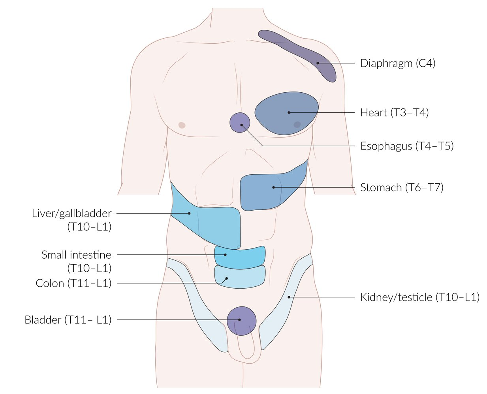

# Principles of pain management

*Categories: Clinical knowledge > Emergency medicine > Treatment approaches and procedures > Principles of pain management*

[Original Article Link](https://coursology-qbank.com/amboss/article/xN0EWg)

---

## Summary

<u>Pain</u> is a distressing sensory and emotional experience linked to, or resembling that linked to, current or potential tissue injury. <u>Pain</u> is classified by duration (i.e., acute, subacute, or chronic) or type (i.e., <u>nociceptive</u>, neuropathic, or nociplastic). Clinical <u>evaluation of pain</u> involves a thorough history and <u>physical examination</u> and assessment of <u>pain</u> severity using a standardized <u>pain intensity scale</u>. <u>Pain</u> management is multimodal and includes <u>analgesics</u>, <u>nonpharmacological analgesia</u>, and/or <u>interventional pain management</u> strategies. The <u>WHO analgesic ladder</u> can help clinicians select an appropriate <u>pain</u> management strategy based on <u>pain</u> severity and response to existing management. Complications of <u>pain</u> management vary based on the agent and should be balanced against symptom relief. Adverse effects of <u>NSAIDs</u> include cardiovascular complications, <u>gastritis</u>, and <u>kidney</u> impairment. Adverse effects of <u>opioid therapy</u> include respiratory <u>depression</u>, <u>nausea</u>, and <u>altered mental status</u>.

This article focuses on the principles of <u>pain</u> management. <u>Acute pain management</u>, <u>chronic noncancer pain management</u>, and <u>pain management in palliative care</u> are detailed separately.

---

## Classification of pain

### By duration

* Acute pain

* A warning signal indicating actual or potential tissue damage that triggers a protective reaction

* Typically associated with trauma, <u>surgery</u>, and/or acute illness

* Lasts < 1 month [[1]](https://coursology-qbank.com/amboss/article/FC1gFQ0)

* Subacute pain: lasts 1–3 months [[1]](https://coursology-qbank.com/amboss/article/FC1gFQ0)

* Chronic pain

* <u>Pain</u> that lasts beyond the normal tissue healing time (> 3 months) [[1]](https://coursology-qbank.com/amboss/article/FC1gFQ0)[[2]](https://coursology-qbank.com/amboss/article/XjW9_O0)

* Unlike <u>acute pain</u>, <u>chronic pain</u> has no protective role in preventing further tissue damage and can be considered a disease entity in its own right.

### By type [[3]](https://coursology-qbank.com/amboss/article/ww0hOR)

* Nociceptive pain: <u>pain</u> that is triggered by chemical, mechanical, or thermal stimuli (noxious stimuli) 

* Somatic pain (musculoskeletal <u>pain</u>): localized, sharp <u>pain</u> that varies in duration and quality (<u>Aδ fibers</u>)

* Visceral pain: dull, diffuse, deep <u>pain</u> (<u>C fibers</u>)

* Neuropathic pain: <u>pain</u> that is caused by damage to, or dysfunction of, structures within the somatosensory nervous system or <u>autonomic nervous system</u> 

* Central pain: caused by <u>CNS</u> dysfunction (e.g., poststroke <u>pain</u> syndrome, <u>phantom limb pain syndrome</u>)

* Peripheral pain: caused by damage to <u>peripheral nerves</u> (e.g., <u>diabetic neuropathy</u>, <u>postherpetic neuralgia</u>)

* Sympathetically mediated <u>pain</u>: caused by damage to autonomic nerves (e.g., as a component of <u>complex regional pain syndrome</u>)  [[4]](https://coursology-qbank.com/amboss/article/LQVw980)

* <u>Nociplastic pain</u>: <u>pain</u> that arises from altered <u>nociception</u> without clear evidence of underlying tissue damage [[5]](https://coursology-qbank.com/amboss/article/1iV2q80)

* For an overview of <u>pain</u> symptoms in patients with serious or life-threatening illnesses, see "Pain" in "<u>Overview of palliative medicine</u>."

> [!TIP]
> <u>Pain</u> is a distressing sensory and emotional experience linked to, or resembling that linked to, current or potential tissue injury.

---

## Pathophysiology

### <u>Pain pathway</u>

* <u>Nociceptors</u> detect a chemical, mechanical, or thermal noxious stimulus → conversion of stimulus to an electric signal (<u>action potential</u>) → <u>C fibers</u> and <u>Aδ fibers</u> carry afferent input to the <u>dorsal horn</u> of the spinal cord → secondary <u>nociceptive</u> <u>neurons</u> in the <u>spinothalamic tract</u> carry afferent input to the <u>thalamus</u> in the <u>CNS</u> → <u>pain</u> perception and a response sent along <u>efferent pathways</u> → <u>pain</u> modulation and/or a reaction

* For further information, see "<u>Nociception and pain modulation</u>."

### Dimensions of pain

<u>Pain</u> is a complex phenomenon characterized by multiple subjective dimensions as well as the objective physiological and behavioral responses it elicits.

* Sensory-discriminative dimension: the physical attributes of <u>pain</u> (e.g., quality, localization, intensity, duration)

* Affective-motivational dimension: the emotional aspect of <u>pain</u>, representing the associated unpleasantness, <u>distress</u>, and drive to <u>escape</u> or avoid the stimulus

* Cognitive-evaluative dimension: the mental interpretation and modulation of <u>pain</u> based on attention, <u>memory</u>, beliefs, expectations, and/or context

* Behavioral dimension: the observable and physiological expressions of <u>pain</u>

* Motor component: voluntary and involuntary somatic responses, including facial expressions, withdrawal reflexes, guarding behaviors, and compensatory movements (e.g., limping)

* Autonomic component: involuntary activity of the <u>autonomic nervous system</u> that produces measurable physiological changes such as <u>tachycardia</u>, <u>elevated blood pressure</u>, <u>diaphoresis</u>, and <u>pupillary</u> dilation

> [!TIP]
> The biopsychosocial model of pain proposes that <u>pain</u> arises from a dynamic interaction between biological factors (e.g., tissue injury, genetics), psychological factors (e.g., <u>pain</u>-related beliefs, <u>coping mechanisms</u>, catastrophizing), and social factors (e.g., social support system, work). Together, these factors shape the perceived intensity and impact of <u>pain</u>. In <u>chronic pain</u>, the psychological and social components often amplify and sustain the experience, frequently contributing to <u>distress</u> and disability significantly more than the original physical injury itself.

---

## Subtypes and variants

### Radiating pain

* Definition: <u>pain</u> that spreads from its source along the path of a specific nerve and is often caused by <u>nerve root</u> irritation or injury

* Example: <u>sciatica</u>

* Most commonly caused by compression of the <u>sciatic nerve</u> root due to <u>degenerative disc disease</u>

* <u>Pain</u> radiates from the buttocks down the leg, along the <u>sciatic nerve</u> pathway.

### Referred pain

* Definition: <u>pain</u> that is perceived at a location other than that of the causative stimulus; projection of <u>pain</u> usually onto a specific <u>dermatome</u> or <u>myotome</u> of the corresponding segment of the spinal cord

* Common examples of <u>referred pain</u>

* Right shoulder <u>pain</u> in patients with <u>cholecystitis</u>

* Left shoulder <u>pain</u> in patients with irritation of the <u>diaphragm</u>, e.g., <u>hemoperitoneum</u> due to <u>splenic rupture</u> (Kehr sign) or <u>perforated peptic ulcer</u> (<u>PUD</u>) disease

* Left-sided chest and arm <u>pain</u>: <u>myocardial infarction</u>

* Periumbilical <u>pain</u> in the early stages of <u>appendicitis</u>

* Treatment: Selected treatments may reverse this pathway.

| Overview of <u>referred pain</u> |  |  |
| --- | --- | --- |
| Organ | <u>Dermatome</u> | Projection |
| <u>Diaphragm</u> | C4 | Shoulders |
| <u>Heart</u> | T3–4 | Left chest |
| <u>Esophagus</u> | T4–5 | Retrosternal |
| <u>Stomach</u> | T6–9 | Epigastrium |
|  <u>Liver</u>, <u>gallbladder</u>  | T10–L1 | <u>Right upper quadrant</u> |
| <u>Small bowel</u> | T10–L1 | Periumbilical |
| <u>Colon</u> | T11–L1 | Lower abdomen |
| <u>Bladder</u> | T11–L1 | Suprapubic |
|  <u>Kidneys</u>, <u>testicles</u>  | T10–L1 | Groin |

Referred pain of important internal organs

References:[[6]](https://coursology-qbank.com/amboss/article/U30b3f)[[7]](https://coursology-qbank.com/amboss/article/_1Y5jL)

### Phantom limb syndrome

* Definition

* Phantom sensation: the sensation that the amputated limb is still partially or totally existent

* <u>Phantom pain</u>: sensation of <u>pain</u> in an amputated limb 

* Intermittent <u>pain</u> of varying character (e.g., burning, tingling, shooting, itching, squeezing, aching, <u>electric shock</u>-like sensation)

* Onset usually within days to weeks after <u>amputation</u>; <u>pain</u> often resolves or lessens over time

* <u>Incidence</u>: common complication after upper or lower extremity <u>amputation</u>

* Pathophysiology: <u>primary somatosensory cortex</u> <u>neurons</u> that formerly respond to signals from the amputated limb respond to signals from adjacent <u>neurons</u> that carry sensation from other parts of the body → functional reorganization of the <u>somatosensory cortex</u> [[8]](https://coursology-qbank.com/amboss/article/QP1ueS0)

* Diagnosis: diagnosed only after exclusion of other causes of <u>stump pain</u> (e.g., infection, <u>ischemia</u>, post-surgical <u>neuroma</u>)

* Treatment: multimodal approach

* Mirror therapy: Using a mirror, the existing limb is reflected in a way that makes it appear in the place of the amputated limb. The patient learns to <u>reposition</u> the missing limb using visualization techniques.

* Transcutaneous electrical nerve stimulation: an <u>analgesic</u> therapy used to modify <u>pain</u> perception by administering continuous electrical impulses via electrodes on the <u>skin</u>

* <u>NMDA receptor antagonists</u>

* <u>Adjuvant therapy</u> (e.g., <u>tricyclic antidepressants</u>, <u>anticonvulsants</u>)

* Prophylaxis: perioperative <u>regional anesthesia</u>

References:[[9]](https://coursology-qbank.com/amboss/article/z1YrjL)

---

## Evaluation of pain

To optimize <u>pain</u> management, a thorough history and assessment of <u>pain</u> is required prior to initiating treatment.

* <u>Pain</u> characteristics (location, quality, temporal aspects, triggers)

* Associated symptoms (changes in mobility and strength)

* Previous <u>pain</u> assessments and/or treatment

* Pain intensity scale: subjective grading of <u>pain</u> severity by the patient 

* Numeric rating scale (<u>NRS</u>): most common <u>pain scale</u>, evaluates <u>pain</u> on a scale from 0–10

* <u>Visual analog scale</u> (<u>VAS</u>): visual equivalents suitable for children

* Verbal descriptor scale

* Impact of <u>pain</u>

* E.g., on daily life, <u>sleep</u>, activities

* This may also be evaluated through the use of validated scales, e.g., the <u>PEG pain scale</u> for <u>chronic pain</u>

* Pain diary: regular documentation of the <u>pain</u> intensity to identify peaks and triggers; enables treatment optimization

Pain scales

> [!TIP]
> <u>Pain</u> can be difficult to assess in nonverbal patients; obtain supporting information from caretakers and use a specialized <u>pain</u> score, e.g., the <u>nonverbal pain scale</u>.

> [!WARNING]
> Be aware of <u>implicit bias</u> in the assessment of <u>pain</u>: Hispanic and Black patients are less likely to receive any and/or appropriate <u>analgesia</u> compared to White patients, even when reported <u>pain</u> scores are identical. [[10]](https://coursology-qbank.com/amboss/article/3vcS-V0)[[11]](https://coursology-qbank.com/amboss/article/tvcXbe0)

> [!TIP]
> <u>Pain</u> is subjective! <u>Pain</u> scales are used to assess a patient's <u>pain</u> and response to <u>pain</u> management over time. They cannot be used to compare <u>pain</u> intensity between patients.

References:[[12]](https://coursology-qbank.com/amboss/article/xw0EOR)

---

## Analgesics

### WHO analgesic ladder

The <u>WHO analgesic ladder</u> is a 3-step algorithm for the management of acute and <u>chronic pain</u>.

* Regular <u>analgesic</u> (modified-release drugs, administered at fixed times and doses)

* By the mouth: preferably, <u>analgesics</u> should be given orally.

* By the clock: regular administration at fixed times, rather than on demand

* By the ladder (symptom-oriented): if the patient is still in <u>pain</u>, it is necessary to go up a step

* Appropriate <u>PRN</u> medication 

* Short-acting <u>analgesics</u> for peaks in <u>pain</u>

* If <u>PRN</u> medication is required ≥ 3×/day → inadequate <u>analgesia</u> likely; review the regular medication

* Additionally, concurrent treatment with adjuvant drugs

|  Management of pain using WHO analgesic ladder [[13]](https://coursology-qbank.com/amboss/article/8vcObe0)  |  |  |  |  |  |
| --- | --- | --- | --- | --- | --- |
|  | <u>Pain</u> severity |  <u>Non-opioid analgesics</u>   |  Mild <u>opioids</u>   |  Strong <u>opioids</u>   | Adjuvant drugs |
| Step I | Mild | Include | Avoid | Avoid | If required |
| Step II | Moderate | Include | Consider | Avoid | If required |
| Step III | Severe | Include | Consider | Consider | If required |

> [!TIP]
> <u>Non-opioid analgesics</u> are first-line agents for <u>pain</u>; prescribe them alone for mild to moderate <u>pain</u> and in combination with <u>opioids</u> for severe <u>pain</u>. [[14]](https://coursology-qbank.com/amboss/article/XtY9XI)

> [!TIP]
> For both <u>opioid</u> and <u>non-opioid analgesics</u>, use the minimal effective dose for the shortest duration of time to minimize adverse effects. <u>Pain</u> intensity scales should be used in regular intervals to assess the success of <u>pain</u> management.

### Oral analgesics

The following information pertains to adults. See "<u>Pain management in children</u>" for pediatric recommendations.

| <u>Oral analgesics</u> |  |  |  |
| --- | --- | --- | --- |
| Drug class |  | Drug | Important considerations |
| <u>Non-opioids</u> | <u>Acetaminophen</u> |  * <u>Acetaminophen</u> DOSAGE [[15]](https://coursology-qbank.com/amboss/article/itYJWI)   |  * See "Non-<u>opioid analgesics</u>" for further information.   |
| <u>NSAIDs</u> |   * <u>Aspirin</u> DOSAGE  * <u>Ibuprofen</u> DOSAGE  * <u>Diclofenac</u> DOSAGE  * <u>Naproxen</u> DOSAGE  * <u>Indomethacin</u> DOSAGE  * <u>Meloxicam</u> DOSAGE    |   * <u>Ibuprofen</u> and <u>naproxen</u> are the preferred first-line <u>analgesics</u> for mild to moderate <u>pain</u>.  [[15]](https://coursology-qbank.com/amboss/article/itYJWI)  * See "<u>NSAIDs</u>" for further information.    |  |
| <u>Selective COX-2 inhibitor</u> |  * <u>Celecoxib</u> DOSAGE   |   * Preferred second-line <u>analgesic</u> for mild to moderate <u>pain</u>  [[15]](https://coursology-qbank.com/amboss/article/itYJWI)  * Preferred over <u>NSAIDs</u> in patients with <u>PUD</u>  * See "<u>Selective COX-2 inhibitors</u>" for further information.    |  |
| <u>Sodium channel blocker</u> |  * Suzetrigine DOSAGE   |   * For moderate to severe <u>acute pain</u>  * First dose on an empty <u>stomach</u>; subsequent doses can be taken with food  * Avoid use in patients with severe hepatic impairment (<u>Child class C</u>).    |  |
| <u>Opioids</u> |  |   * <u>Oxycodone</u> DOSAGE  * <u>Hydromorphone</u> DOSAGE  * <u>Tramadol</u> DOSAGE  * <u>Tapentadol</u> DOSAGE [[16]](https://coursology-qbank.com/amboss/article/jPW_el0)    |   * Combine with <u>non-opioid analgesics</u> (multimodal <u>pain</u> control) to minimize the dose needed for <u>analgesia</u>.  * <u>Oxycodone</u> is not recommended for perioperative or postoperative <u>analgesia</u> in <u>opioid</u>-naive patients.  * <u>Tramadol</u> is not recommended in patients with <u>epilepsy</u> as it lowers the <u>seizure</u> threshold.  * Contraindications  * <u>Asthma</u>, respiratory <u>depression</u>  * <u>Bowel obstruction</u>  * <u>Biliary colic</u>  * <u>Head injury</u>  * See "<u>Opioids</u>," "<u>Opioids for acute pain</u>," and "<u>Opioid</u> management" in "<u>Chronic noncancer pain management</u>" for further information.    |
| <u>Combination analgesics</u> |  |   * <u>Codeine</u>/<u>acetaminophen</u> DOSAGE  * <u>Hydrocodone</u>/<u>acetaminophen</u> DOSAGE  * <u>Hydrocodone</u>/<u>ibuprofen</u> DOSAGE  * <u>Oxycodone</u>/<u>acetaminophen</u> DOSAGE    |   * Consider <u>combination analgesics</u> for the management of moderate to severe <u>pain</u>.  * Follow the same precautions and <u>contraindications for opioids</u>, <u>acetaminophen</u>, and <u>NSAIDs</u> when prescribing these <u>combination analgesics</u>.    |

> [!TIP]
> All patients being discharged with <u>opioid</u> medications should receive <u>counseling on the use of prescription opioids</u>.

### Parenteral analgesics

| <u>Parenteral analgesics</u> |  |  |
| --- | --- | --- |
| Drug class | Drug | Important considerations |
| <u>NSAIDs</u> |   * <u>Ketorolac</u> DOSAGE  * <u>Diclofenac</u> DOSAGE  * <u>Ibuprofen</u> DOSAGE    |   * Preferred <u>analgesics</u> in suspected <u>biliary colic</u> or <u>biliary pancreatitis</u> (or <u>RUQ</u> <u>pain</u>)  [[17]](https://coursology-qbank.com/amboss/article/YJYnsJ)  * See "Non-<u>opioid analgesics</u>" for further information.    |
| <u>Opioids</u> |   * <u>Tramadol</u> DOSAGE  * <u>Morphine</u> DOSAGE  * <u>Hydromorphone</u> DOSAGE  * <u>Fentanyl</u> DOSAGE   [[18]](https://coursology-qbank.com/amboss/article/lrYvhq)  * <u>Buprenorphine</u> DOSAGE  [[19]](https://coursology-qbank.com/amboss/article/HgbK9G)[[20]](https://coursology-qbank.com/amboss/article/9lYN_6)    |  * See "<u>Opioids</u>" for further information.   |

### Analgesic suppositories

* <u>Acetaminophen</u> DOSAGE

* <u>Indomethacin</u> DOSAGE

* <u>Aspirin</u> DOSAGE

### Topical analgesics

| <u>Topical analgesics</u> |  |  |
| --- | --- | --- |
| Drug | Dose | Indications |
| <u>Lidocaine</u> |   * <u>Lidocaine</u> patch DOSAGE  * <u>Lidocaine</u> jelly DOSAGE  * <u>Lidocaine</u> ointment DOSAGE    |   * Patch: <u>postherpetic neuralgia</u>  * Jelly: painful <u>urethritis</u>  * Ointment: minor <u>burns</u>, including <u>sunburn</u>, <u>abrasions</u> of the <u>skin</u>, and <u>insect bites</u>    |
| <u>Diclofenac</u> |   * <u>Diclofenac</u> patch DOSAGE [[21]](https://coursology-qbank.com/amboss/article/1tY2cI)  * <u>Diclofenac</u> topical solution or gel DOSAGE [[22]](https://coursology-qbank.com/amboss/article/ctYacI)    |   * Patch: for <u>acute pain</u> due to minor strains, <u>sprains</u>, and <u>contusions</u>  * Solution or gel: <u>chronic pain</u> in <u>osteoarthritis</u>    |

### Adjuvant analgesics

#### <u>Anticonvulsants</u>

<u>Anticonvulsants</u> are useful adjuncts in the management of <u>neuropathic pain</u>. They typically will not be helpful for <u>acute pain</u>, rather are more commonly used for chronic <u>neuropathic pain</u>.

* <u>Gabapentin</u> DOSAGE

* <u>Pregabalin</u> DOSAGE

* <u>Carbamazepine</u> DOSAGE

#### <u>Muscle relaxants</u>

Consider <u>muscle relaxants</u> in patients with <u>pain</u> associated with muscle <u>spasticity</u>.

* <u>Cyclobenzaprine</u> DOSAGE

* <u>Methocarbamol</u> DOSAGE

* <u>Baclofen</u> DOSAGE

#### <u>Antidepressants</u>

<u>Tricyclic antidepressants</u> and <u>SNRIs</u> can be helpful for <u>chronic pain</u> syndromes and <u>neuropathic pain</u>. <u>Antidepressants</u> for chronic or <u>neuropathic pain</u> are recommended by the American Society of Anesthesiologists in their 2010 guideline, but only <u>duloxetine</u> is <u>FDA</u>-approved for this indication. All others are <u>off-label</u> use.  [[23]](https://coursology-qbank.com/amboss/article/IhbY2t)[[24]](https://coursology-qbank.com/amboss/article/7hb42t)

* <u>Tricyclic antidepressants</u>

* <u>Amitriptyline</u> DOSAGE [[25]](https://coursology-qbank.com/amboss/article/qhbCUt)

* <u>Doxepin</u> DOSAGE

* <u>Clomipramine</u> DOSAGE

* <u>SNRIs</u>

* <u>Duloxetine</u> DOSAGE

* <u>Venlafaxine</u> DOSAGE

---

## Special patient groups

### Pain management in children [[40]](https://coursology-qbank.com/amboss/article/d6doPI0)[[41]](https://coursology-qbank.com/amboss/article/OC1IHQ0)

#### Outpatient <u>pain</u> management

* Treatment is multimodal and based on severity and patient response.

* Nonopioid oral analgesia in children: preferred for mild to moderate <u>pain</u>

* <u>Acetaminophen</u> DOSAGE [[41]](https://coursology-qbank.com/amboss/article/OC1IHQ0)[[42]](https://coursology-qbank.com/amboss/article/26dT4I0)[[43]](https://coursology-qbank.com/amboss/article/eJdxGI0)

* <u>NSAIDs</u> (e.g., <u>ibuprofen</u> DOSAGE, <u>naproxen</u>) [[41]](https://coursology-qbank.com/amboss/article/OC1IHQ0)[[42]](https://coursology-qbank.com/amboss/article/26dT4I0)[[43]](https://coursology-qbank.com/amboss/article/eJdxGI0)

* <u>Opioids</u>: reserved for moderate to severe <u>pain</u> refractory to other modalities

* Avoid <u>opioid</u> monotherapy.

* Short-term courses (< 5 days) of immediate-release <u>opioids</u> are preferred.  [[40]](https://coursology-qbank.com/amboss/article/d6doPI0)[[44]](https://coursology-qbank.com/amboss/article/J6dsNI0)

* Avoid <u>codeine</u> and <u>tramadol</u> in children who are:

* < 12 years of age

* 12–18 years of age with <u>risk factors</u> for <u>hypoventilation</u>

* Address safety: Provide <u>naloxone</u> DOSAGE and counseling (e.g., on <u>opioid overdose</u>, storage, and disposal). [[40]](https://coursology-qbank.com/amboss/article/d6doPI0)

* Additional treatment modalities include:

* <u>Nonpharmacological analgesia</u>

* <u>Topical analgesics</u> (e.g., <u>lidocaine</u> DOSAGE)

* Children with chronic or acute-on-<u>chronic pain</u> (e.g., due to <u>sickle cell disease</u> or cancer): Coordinate with their treating specialist and consider consulting a <u>pain</u> specialist.

> [!WARNING]
> <u>Aspirin</u> is not recommended in most pediatric patients due to the risk of <u>Reye syndrome</u>. [[42]](https://coursology-qbank.com/amboss/article/26dT4I0)

#### Procedural <u>pain</u> in <u>neonates</u> and <u>infants</u>

* Definition: <u>pain</u> and <u>stress</u> that occur as a result of medical procedures, e.g., IV cannulation, <u>venipuncture</u>, finger prick, heel lance, <u>lumbar puncture</u>, <u>bone marrow aspiration</u>

* Pathophysiology: <u>Newborn</u> and <u>preterm infants</u> are sensitive to <u>pain</u> and <u>stress</u>.  [[45]](https://coursology-qbank.com/amboss/article/KgXUwx)

* <u>Pain</u> pathways are developed by the 20th week of <u>gestation</u>.

* <u>Nociceptive</u> stimuli induce behavioral, autonomic, and hormonal responses in <u>infants</u> similar to those seen in older individuals.

* Chronic or recurrent exposure to <u>nociceptive</u> stimuli can result in sensitization of the maturing neuronal pathways → hypersensitivity to <u>pain</u>

* Painful procedures: common in <u>pediatric ICU</u> patients, preterm <u>neonates</u>, and children with <u>malignancy</u>

* IV cannulation

* Blood draws: <u>venipuncture</u>, finger prick, heel lance

* <u>Lumbar puncture</u>

* <u>Circumcision</u> [[46]](https://coursology-qbank.com/amboss/article/cpdaoI0)[[47]](https://coursology-qbank.com/amboss/article/1pd2oI0)

* <u>Bone marrow aspiration</u>

* Clinical indicators of <u>pain</u>

* Facial grimacing

* Crying

* Changes in crying pattern

* Inconsolableness

* Irritability

* Changes in <u>sleep</u> pattern

* <u>Neonatal pain assessment</u>

* Scoring systems for acute and postoperative <u>pain</u> in <u>infants</u> evaluate physiological parameters , behavioral changes , and/or contextual factors.

* Examples: <u>premature infant</u> <u>pain</u> profile (PIPP), neonatal <u>infant</u> <u>pain scale</u> (<u>NIPS</u>), neonatal <u>pain</u> <u>agitation</u> sedation scale (N-PASS), crying, requires <u>oxygen saturation</u>, increased <u>vital signs</u>, expression, sleeplessness (CRIES) score

* Management [[45]](https://coursology-qbank.com/amboss/article/KgXUwx)[[48]](https://coursology-qbank.com/amboss/article/pgXLwx)

* General principles

* Appropriate <u>analgesia</u> according to the stages of the <u>WHO analgesic ladder</u>

* Preemptive <u>analgesia</u> for painful procedures administered before, during, and after the procedure

* Regular assessment of the severity of <u>pain</u> and response to <u>analgesia</u>

* The choice of the step depends on the anticipated intensity of <u>pain</u>

* Steps can be combined if single measures are insufficient.

* <u>Analgesic</u> steps (neonatal <u>pain</u> ladder)

* <u>Step 1</u>: nonpharmacological measures, e.g., <u>breastfeeding</u>, use of a pacifier, <u>skin</u>-to-<u>skin</u> contact, oral <u>sucrose</u>

* <u>Step 2</u>: <u>topical analgesia</u> (e.g., topical <u>lidocaine</u>, <u>tetracaine</u> gel)

* Step 3: oral, rectal, or IV administration of <u>acetaminophen</u> or <u>NSAIDs</u>

* Step 4: IV infusion of <u>opioids</u>

* Step 5: subcutaneous infiltration of <u>lidocaine</u> or specific <u>nerve blocks</u>

* Step 6: sedation or <u>general anesthesia</u>

---