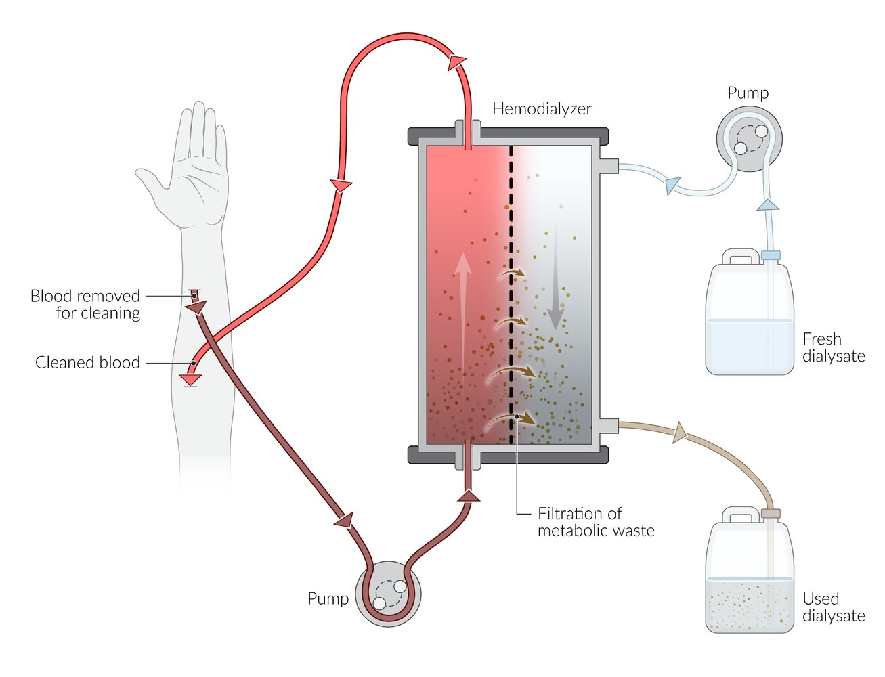
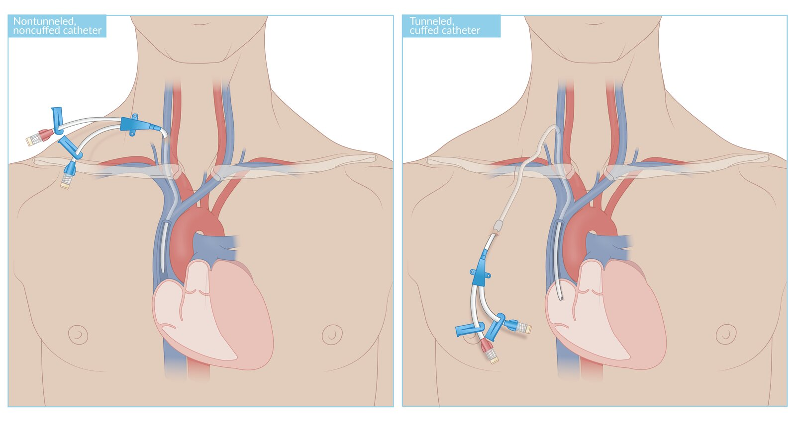
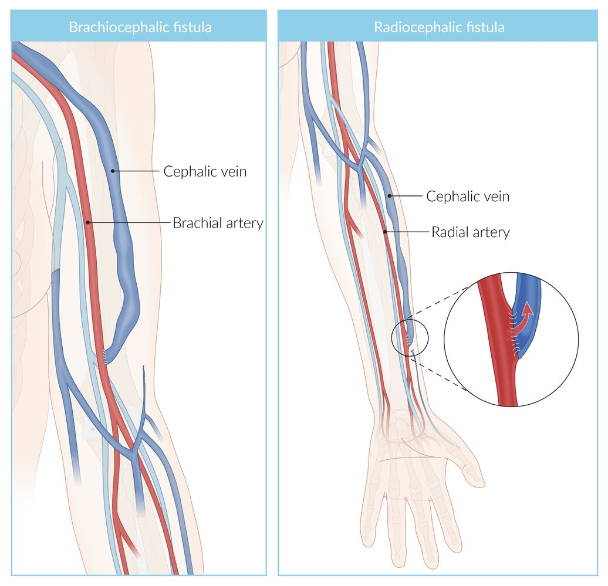
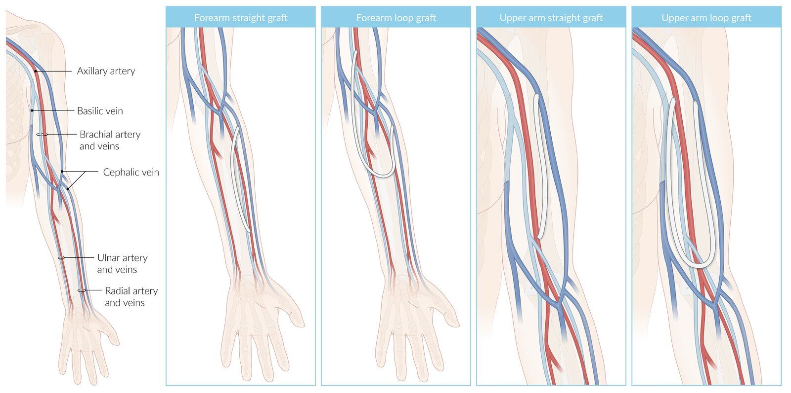
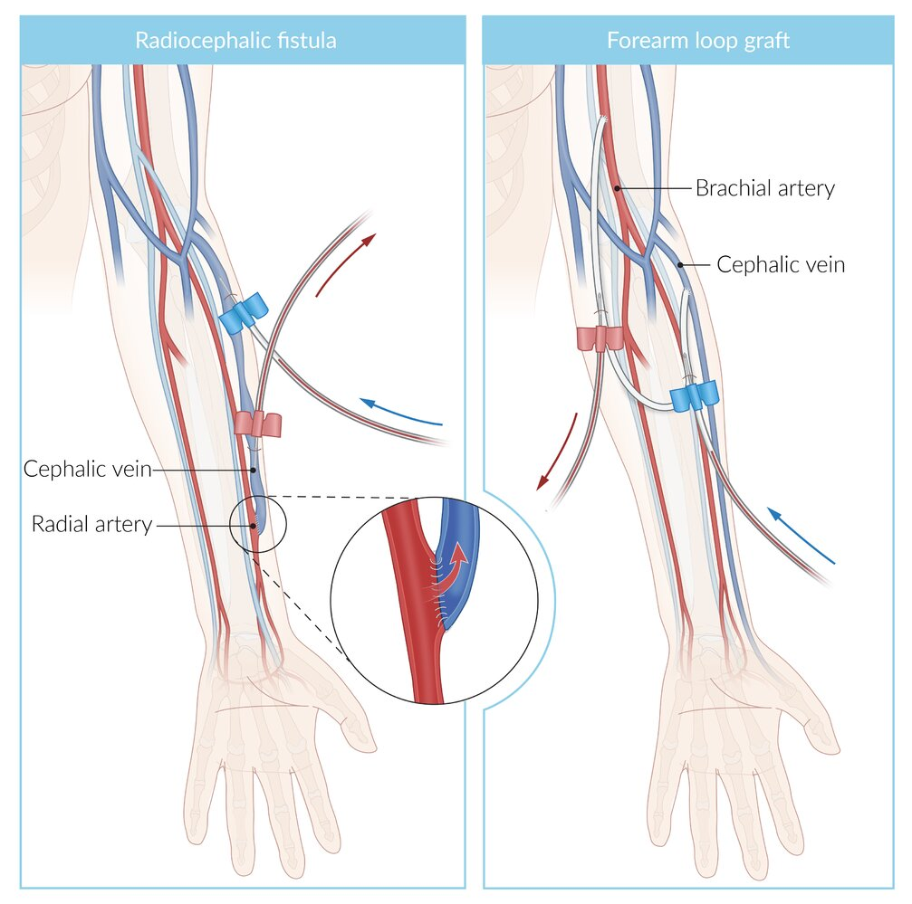
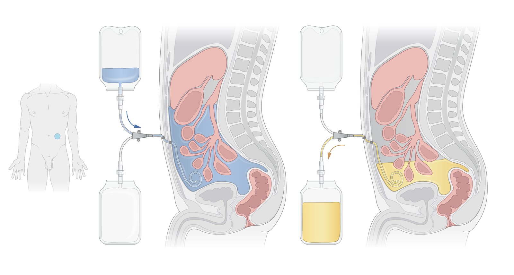

# Renal replacement therapy

*Categories: Clinical knowledge > Emergency medicine > Treatment approaches and procedures > Renal replacement therapy*

[Original Article Link](https://coursology-qbank.com/amboss/article/S50yjg)

---

## Summary

Renal replacement therapy (<u>RRT</u>) is used to support or replace <u>kidney function</u> (i.e., remove toxins, metabolites, and/or water from the body). <u>RRT</u> is indicated in various acute (e.g., <u>acute renal injury</u>, <u>poisoning</u>, refractory <u>fluid overload</u>) and chronic conditions (e.g., <u>chronic kidney disease</u>). There are three main <u>RRT</u> modalities: dialysis (either <u>hemodialysis</u> or <u>peritoneal dialysis</u>), <u>hemofiltration</u>, and <u>kidney transplantation</u>. The choice of <u>RRT</u> depends on the anticipated duration of treatment (<u>acute RRT</u> vs. <u>chronic RRT</u>), indications for treatment, patient characteristics, and patient preference. Dialysis uses <u>diffusion</u> to remove solutes from the blood across a semipermeable membrane, while <u>hemofiltration</u> uses convection; both modalities employ varying degrees of <u>ultrafiltration</u> to remove water. <u>Kidney transplantation</u> is the most comprehensive method of <u>RRT</u> in patients with <u>end-stage renal disease</u> (<u>ESRD</u>) and is covered separately in “<u>Transplantation</u>.”

---

## Overview

### Approach [[1]](https://coursology-qbank.com/amboss/article/LAbw4w)

The following is applicable for all patients in whom acute or <u>chronic RRT</u> is being considered.

* Consult nephrology early; optimizing medical management may prevent the need for <u>RRT</u>.

* Stabilize the patient.

* Manage any life-threatening and/or urgent conditions, e.g.:

* Initiate <u>management of hyperkalemia</u>.

* Address <u>acid-base disorders</u>.

* Provide <u>immediate hemodynamic support</u> for <u>undifferentiated shock</u>.

* Treat any <u>poisoning</u> or overdose (e.g., <u>salicylate toxicity</u>).

* Consider diuresis and use fluids judiciously in patients with <u>clinical signs of volume overload</u>.

* Perform a thorough clinical evaluation, paying particular attention to the following:

* <u>Symptoms of uremia</u>

* Relevant diagnoses (e.g., <u>sepsis</u>, <u>hypotension</u>, prior and/or existing <u>kidney</u> disease)

* <u>Laboratory studies</u> 

* <u>CBC</u>: for <u>anemia of chronic kidney disease</u> (<u>CKD</u>)

* <u>CMP</u>: for renal function and <u>electrolyte</u> abnormalities

* <u>Blood gas</u>: for acid-base status

* Urine studies: to assess for <u>proteinuria</u>, <u>hematuria</u>, and infection

* Discontinue and avoid <u>nephrotoxic medications</u>.

* Determine <u>indication(s) for dialysis</u>.

* In consultation with nephrology and/or <u>ICU</u>, determine the preferred <u>RRT</u> modality and obtain appropriate access.

> [!WARNING]
> <u>RRT</u> should be initiated before potentially life-threatening complications of <u>renal failure</u> develop. [[2]](https://coursology-qbank.com/amboss/article/kIYm1q)

### Indications for RRT [[3]](https://coursology-qbank.com/amboss/article/b9bHND)[[4]](https://coursology-qbank.com/amboss/article/LTcwrb0)[[5]](https://coursology-qbank.com/amboss/article/c7cakd0)

* Severe <u>metabolic acidosis</u>, e.g., <u>pH</u> < 7.1 and/or serum <u>bicarbonate</u> < 12 mmol/L   [[6]](https://coursology-qbank.com/amboss/article/X7c94d0)[[7]](https://coursology-qbank.com/amboss/article/17c2kd0)

* Refractory severe <u>electrolyte</u> abnormalities, e.g., <u>hyperkalemic emergency</u>, <u>hypercalcemic crisis</u> [[6]](https://coursology-qbank.com/amboss/article/X7c94d0)[[7]](https://coursology-qbank.com/amboss/article/17c2kd0)

* <u>Symptoms of uremia</u>, particularly <u>uremic pericarditis</u>, <u>uremic encephalopathy</u>, and/or bleeding

* <u>Fluid overload</u> refractory to medical management, e.g., in <u>CKD</u>, <u>CHF</u>

* <u>Poisoning</u> or overdose with a dialyzable substance, e.g., <u>lithium</u>, <u>toxic alcohols</u>

* Additionally, in <u>ESRD</u>:  [[4]](https://coursology-qbank.com/amboss/article/LTcwrb0)[[5]](https://coursology-qbank.com/amboss/article/c7cakd0)

* Refractory <u>hypertension</u>

* <u>Anorexia</u> or weight loss despite nutritional interventions

> [!NOTE]
> Indications for <u>urgent RRT</u>: “<u>A.E.I.</u>O.U.” -Acidosis, Electrolyte abnormalities (<u>hyperkalemia</u>), Ingestion (of poisons), Overload (fluid), Uremic symptoms

> [!NOTE]
> Dialyzable medications and poisons: “I STUMBLED” - Isoniazid, <u>isopropyl alcohol</u>; Salicylates; Theophylline, Tenormin® (<u>atenolol</u>); Urea; Methanol; Barbiturates; Lithium; Ethylene glycol; Dabigatran, Depakote®(<u>valproic acid</u>)

### <u>RRT</u> mechanisms and modalities [[2]](https://coursology-qbank.com/amboss/article/kIYm1q)[[7]](https://coursology-qbank.com/amboss/article/17c2kd0)[[8]](https://coursology-qbank.com/amboss/article/8IcOed0)

Select the <u>RRT</u> modality based on therapeutic goals, availability, and local expertise. <u>Kidney transplantation</u> is covered separately in “<u>Transplantation</u>.”

#### Mechanisms

* <u>Diffusion</u>

* Solutes move across a semipermeable membrane down their concentration gradient.

* Smaller molecules have faster rates of <u>diffusion</u> and are cleared more easily.

* Convection

* <u>Hydrostatic pressure</u> gradients drive water (i.e., <u>ultrafiltration</u>) and solutes across a semipermeable membrane.

* Solutes of all sizes can be effectively cleared; the solutes cleared depends on the pore size in the filter membrane.

#### Modalities

* <u>Peritoneal dialysis</u>

* <u>Hemodialysis</u> or <u>hemofiltration</u>

|  Comparison of renal replacement therapies [[3]](https://coursology-qbank.com/amboss/article/b9bHND)[[7]](https://coursology-qbank.com/amboss/article/17c2kd0)[[9]](https://coursology-qbank.com/amboss/article/sIctVd0)  |  |  |  |
| --- | --- | --- | --- |
|  | <u>Peritoneal dialysis</u> | <u>Hemodialysis</u> | <u>Hemofiltration</u> |
|  Substances removed [[8]](https://coursology-qbank.com/amboss/article/8IcOed0)  |   * Small solutes  * Some water    |  |   * Solutes of all sizes (most effectively removes medium and large solutes)  * Water    |
|  Mechanism [[8]](https://coursology-qbank.com/amboss/article/8IcOed0)  |   * <u>Diffusion</u> (primary mechanism)  * <u>Ultrafiltration</u>    |  |   * Convection  * <u>Ultrafiltration</u>    |
| Access |  * <u>Peritoneal</u> catheter   |   * <u>Central venous catheter for RRT</u> (<u>acute RRT</u>)  * <u>AV fistula</u> or <u>AV graft</u> (<u>chronic RRT</u>)    |  |
| Indications |   * <u>Chronic RRT</u>  * No venous access  * Preferred modality in candidates for home dialysis    |   * Acute or <u>chronic RRT</u>  * Conditions requiring rapid clearance of solutes, e.g., <u>lithium poisoning</u>    |   * Acute or <u>chronic RRT</u>  * Preferred in patients who require:  * Clearance of large molecules  * Precise fluid control  [[2]](https://coursology-qbank.com/amboss/article/kIYm1q)    |
| Disadvantages andcomplications |   * Bacterial <u>peritonitis</u>  * Metabolic disturbances    |   * Frequent appointments  * <u>Dialysis disequilibrium syndrome</u>  * Cardiovascular complications    |  |

---

## Hemodialysis and hemofiltration

### Basic principles [[2]](https://coursology-qbank.com/amboss/article/kIYm1q)[[9]](https://coursology-qbank.com/amboss/article/sIctVd0)[[10]](https://coursology-qbank.com/amboss/article/3j1SZS0)

* Hemodialysis: utilizes <u>diffusion</u> and a small degree of <u>ultrafiltration</u> to remove solutes and water from the blood

* More effective at removing small molecules (e.g., <u>urea</u>, <u>creatinine</u>, <u>ammonia</u>) than larger molecules

* Blood is pumped through the dialysis unit on one side of a semipermeable membrane and <u>dialysate</u> in the opposite direction on the other side of the membrane.

* Molecules diffuse across the semipermeable membrane down their concentration gradient.

* Hemofiltration: utilizes convection and a high degree of <u>ultrafiltration</u> to remove solutes and water from the blood

* More effective at removing medium to large molecules (e.g., <u>cytokines</u>, <u>myoglobin</u>) than <u>hemodialysis</u> [[10]](https://coursology-qbank.com/amboss/article/3j1SZS0)

* Blood is pumped through a machine and the difference in hydrostatic pressures drives water and solutes across a semipermeable membrane.

* Lost plasma volume is replaced with a physiologic <u>crystalloid solution</u>. [[2]](https://coursology-qbank.com/amboss/article/kIYm1q)

* Hemodiafiltration

* Combination of <u>hemodialysis</u> and <u>hemofiltration</u>

* Removes molecules of all sizes (most effective method for medium-sized molecule clearance)

* Administration options

* Intermittent renal replacement therapy

* Typically occurs over 3–5 hours; may last 6–18 hours (prolonged intermittent renal replacement therapy) [[2]](https://coursology-qbank.com/amboss/article/kIYm1q)[[7]](https://coursology-qbank.com/amboss/article/17c2kd0)

* Most common option for outpatient administration in patients with <u>CKD</u>; also used for <u>acute RRT</u>  [[7]](https://coursology-qbank.com/amboss/article/17c2kd0)

* Continuous renal replacement therapy [[7]](https://coursology-qbank.com/amboss/article/17c2kd0)

* Gradual fluid and solute clearance over 24 hours

* Used almost exclusively for <u>acute RRT</u>

* Preferred if fluid shifts are contraindicated  [[3]](https://coursology-qbank.com/amboss/article/b9bHND)

> [!TIP]
> <u>Intermittent RRT</u> can be performed in a clinic or at home by the patient after adequate training.

Dialysis circuit

### Access [[1]](https://coursology-qbank.com/amboss/article/LAbw4w)[[3]](https://coursology-qbank.com/amboss/article/b9bHND)[[11]](https://coursology-qbank.com/amboss/article/V7cGkd0)

Consider the anticipated duration of <u>RRT</u> and patient factors (e.g., preference, <u>life expectancy</u>, mobility) to determine the most appropriate type of access for <u>RRT</u>.

#### Venous catheter for renal replacement therapy

* Indications [[1]](https://coursology-qbank.com/amboss/article/LAbw4w)[[11]](https://coursology-qbank.com/amboss/article/V7cGkd0)

* Urgent and/or short-term <u>RRT</u>

* If an <u>AV fistula</u> or <u>AV graft</u> cannot be used

* Limited <u>life expectancy</u>

* Types of catheter  [[1]](https://coursology-qbank.com/amboss/article/LAbw4w)[[3]](https://coursology-qbank.com/amboss/article/b9bHND)

* <u>Nontunneled hemodialysis catheter</u>

* Typically used as initial access in urgent <u>acute RRT</u>

* High infection risk; use limited to a maximum of 2 weeks [[11]](https://coursology-qbank.com/amboss/article/V7cGkd0)

* <u>Tunneled hemodialysis catheter</u>

* Lower infection risk and more stable than <u>nontunneled catheters</u>

* Suitable for long-term use

* Placement: <u>central venous access</u>, preferably in the right <u>internal jugular vein</u>  [[1]](https://coursology-qbank.com/amboss/article/LAbw4w)[[3]](https://coursology-qbank.com/amboss/article/b9bHND)[[11]](https://coursology-qbank.com/amboss/article/V7cGkd0)

* Structure [[9]](https://coursology-qbank.com/amboss/article/sIctVd0)

* Large bore, double-lumen

* Blood is removed from the <u>vein</u> through one lumen and returned through the other lumen.

Central venous catheters for renal replacement therapy

#### Arteriovenous access [[11]](https://coursology-qbank.com/amboss/article/V7cGkd0)

* Indication: for <u>maintenance dialysis</u> in <u>ESRD</u>

* Procedure

* An <u>anastomosis</u> is created between an <u>artery</u> and a <u>vein</u> to provide long-term large-bore <u>vascular access</u>

* Usually created in the nondominant arm (less impairment) between the <u>radial artery</u> and the <u>cephalic vein</u> (i.e., radiocephalic fistula)

* Types of AV access

* <u>Arteriovenous fistula</u>: an <u>artery</u> is directly connected to a <u>vein</u>

* Arteriovenous graft: a synthetic or biological conduit is used to connect an <u>artery</u> to a <u>vein</u>

> [!TIP]
> <u>AV fistulas</u> need approximately 4–6 weeks to mature (i.e., enlargement and thickening of the <u>vein</u> in response to arterial pressure); maturation is unsuccessful in up to 60% of patients. Arrange AV access before dialysis is likely to be required. [[11]](https://coursology-qbank.com/amboss/article/V7cGkd0)

Arteriovenous fistulas for hemodialysis

Arteriovenous grafts for hemodialysis

Hemodialysis cannulation

### Complications of hemodialysis [[2]](https://coursology-qbank.com/amboss/article/kIYm1q)[[7]](https://coursology-qbank.com/amboss/article/17c2kd0)[[11]](https://coursology-qbank.com/amboss/article/V7cGkd0)

#### <u>Vascular access</u> complications [[11]](https://coursology-qbank.com/amboss/article/V7cGkd0)

* Loss of access due to <u>thrombosis</u> or stenosis

* Infections e.g., <u>skin and soft tissue infection</u>, <u>central line-associated bloodstream infection</u>

* Local <u>aneurysm</u>

* AV access steal syndrome: painful <u>ischemia</u> of the hand secondary to the <u>AV fistula</u> or graft shunting blood away from the <u>distal</u> limb

* Dialysis vascular access hemorrhage [[12]](https://coursology-qbank.com/amboss/article/35YSPp)[[13]](https://coursology-qbank.com/amboss/article/fj1k-g0)[[14]](https://coursology-qbank.com/amboss/article/Tj16-g0)

* Apply firm pressure for 15–20 minutes; avoid occluding the vessel.

* If the patient is <u>hemodynamically unstable</u>:

* <u>Manage as hemorrhagic shock</u>

* Place <u>tourniquets</u> above and below the site and attempt a figure of 8 or purse-string suture.

* Determine time of last dialysis and consider <u>anticoagulant reversal</u>.

* Urgently consult vascular <u>surgery</u> if bleeding is heavy, persists, or recurs.

#### Cardiovascular complications [[2]](https://coursology-qbank.com/amboss/article/kIYm1q)

* <u>Hypotension</u>   [[9]](https://coursology-qbank.com/amboss/article/sIctVd0)

* <u>Heart failure</u>  [[15]](https://coursology-qbank.com/amboss/article/ij1JZS0)

#### Increased bleeding risk [[16]](https://coursology-qbank.com/amboss/article/bi1HJg0)

* Caused by <u>platelet dysfunction</u> due to <u>CKD</u> and/or <u>platelet</u> contact with the dialysis membrane [[16]](https://coursology-qbank.com/amboss/article/bi1HJg0)

* Avoid systemic anticoagulation solely to maintain or improve <u>hemodialysis catheter</u> patency.  [[11]](https://coursology-qbank.com/amboss/article/V7cGkd0)

#### Dialysis disequilibrium syndrome [[3]](https://coursology-qbank.com/amboss/article/b9bHND)[[17]](https://coursology-qbank.com/amboss/article/ai1QJg0)

* Definition: the development of acute <u>cerebral edema</u> secondary to the rapid extraction of osmotically active substances (e.g., <u>urea</u>, NaCl) from the blood

* Clinical features: <u>manifestations of increased ICP</u> (e.g., <u>headache</u>, <u>vomiting</u>, <u>papilledema</u>, <u>altered mental status</u>)

* <u>Risk factors</u> [[18]](https://coursology-qbank.com/amboss/article/Yi1nJg0)

* First dialysis sessions

* Extremely elevated <u>BUN</u>

* <u>Metabolic acidosis</u>

* Preexisting neurological abnormalities

* <u>Hyperglycemia</u> or <u>hypernatremia</u>

* Diagnosis

* <u>Clinical diagnosis</u>

* Consider <u>diagnostics for elevated intracranial pressure</u> in severe cases.

* Prevention [[17]](https://coursology-qbank.com/amboss/article/ai1QJg0)

* Use <u>hemofiltration</u> over <u>hemodialysis</u> in patients with <u>risk factors</u>.

* If <u>hemodialysis</u> is performed, provide regular, slow dialysis.

* Consider adjusting the <u>dialysate</u> to mitigate osmotic shifts.  [[17]](https://coursology-qbank.com/amboss/article/ai1QJg0)[[18]](https://coursology-qbank.com/amboss/article/Yi1nJg0)

* Management: Monitor patients for <u>symptoms of cerebral edema</u> and initiate <u>management of raised ICP</u> if present. [[17]](https://coursology-qbank.com/amboss/article/ai1QJg0)

#### Other complications [[2]](https://coursology-qbank.com/amboss/article/kIYm1q)[[7]](https://coursology-qbank.com/amboss/article/17c2kd0)

* <u>Acquired cystic kidney disease</u>  [[19]](https://coursology-qbank.com/amboss/article/jj1_ZS0)

* Cramps

* <u>Electrolyte</u> abnormalities, e.g., <u>hypophosphatemia</u>

* <u>Dialysis-related amyloidosis</u>, which can cause <u>carpal tunnel syndrome</u>  [[20]](https://coursology-qbank.com/amboss/article/Z7cZ4d0)[[21]](https://coursology-qbank.com/amboss/article/07ce4d0)

* <u>Allergic reaction</u> to the equipment or <u>dialysate</u> [[3]](https://coursology-qbank.com/amboss/article/b9bHND)

> [!TIP]
> Cardiovascular disease is the leading <u>cause of death</u> in patients on dialysis and <u>kidney transplant</u> recipients. [[5]](https://coursology-qbank.com/amboss/article/c7cakd0)

---

## Peritoneal dialysis

### Basic principles [[2]](https://coursology-qbank.com/amboss/article/kIYm1q)[[22]](https://coursology-qbank.com/amboss/article/yW1dLf0)

* Mechanism: utilizes <u>diffusion</u> across the <u>peritoneum</u> (acts as a semipermeable membrane) and <u>ultrafiltration</u> to remove water and solutes from the blood

* Procedure 

* <u>Dialysate</u> is instilled into the abdomen and left for a set period of time (i.e., dwell time) to allow <u>diffusion</u>.

* Hypertonic <u>dialysate</u>  draws water across the <u>peritoneal</u> membrane via <u>osmosis</u>.

* The effluent is removed at the end of the dwell time.

* Administration options: self-administered by highly adherent patients (or their carers) at home [[23]](https://coursology-qbank.com/amboss/article/g7cFOd0)

* Continuous ambulatory peritoneal dialysis

* Performed manually 3–5 times/day

* No requirement to be connected to a machine

* Automated peritoneal dialysis

* Automated exchange cycles, typically scheduled overnight

* Patients are connected to a machine.

* <u>Peritoneal</u> catheter

* Location: placed into the <u>peritoneal cavity</u> and tunneled to an exit site  [[22]](https://coursology-qbank.com/amboss/article/yW1dLf0)

* Placement: <u>laparoscopic</u>, percutaneous (with or without image guidance), or open surgical approach

> [!WARNING]
> Because of the high risk of complications, individuals must be trained and able to demonstrate strict adherence to correct techniques before being allowed to perform home <u>peritoneal dialysis</u>. [[2]](https://coursology-qbank.com/amboss/article/kIYm1q)

Peritoneal dialysis

### Complications of peritoneal dialysis [[2]](https://coursology-qbank.com/amboss/article/kIYm1q)[[22]](https://coursology-qbank.com/amboss/article/yW1dLf0)[[24]](https://coursology-qbank.com/amboss/article/JW1smf0)

* Metabolic disturbances: weight gain, <u>hyperglycemia</u>

* Infections

* Exit site and catheter tunnel infections

* <u>Peritoneal dialysis-associated peritonitis</u>

* Protein loss: <u>hypoalbuminemia</u>  [[25]](https://coursology-qbank.com/amboss/article/sHct7d0)

* <u>Abdominal hernias</u>: umbilical and <u>inguinal hernias</u> are most common [[26]](https://coursology-qbank.com/amboss/article/tHcXHd0)

* Leakage of <u>dialysate</u>

* <u>Pleural effusion</u> (rare)  [[27]](https://coursology-qbank.com/amboss/article/GHcB7d0)[[28]](https://coursology-qbank.com/amboss/article/_d15sf0)

> [!TIP]
> Frequently examine the <u>peritoneal dialysis</u> catheter and exit site for signs of infection (e.g., swelling, <u>purulent</u> drainage); consider <u>ultrasound</u> for a more detailed assessment if infection is suspected. [[24]](https://coursology-qbank.com/amboss/article/JW1smf0)

---