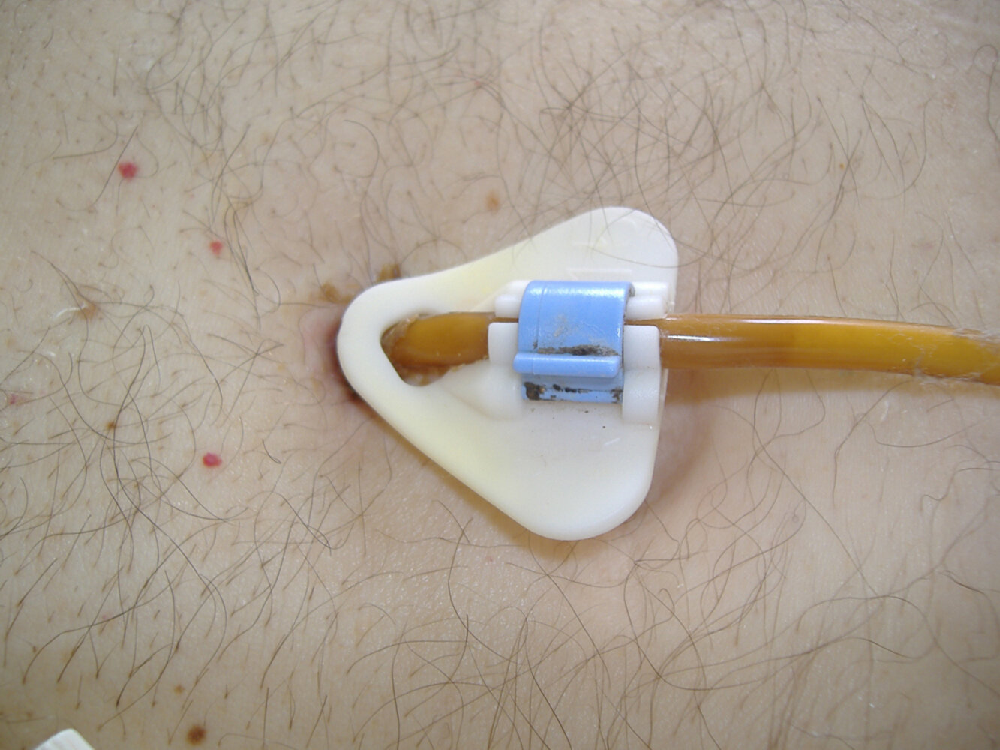
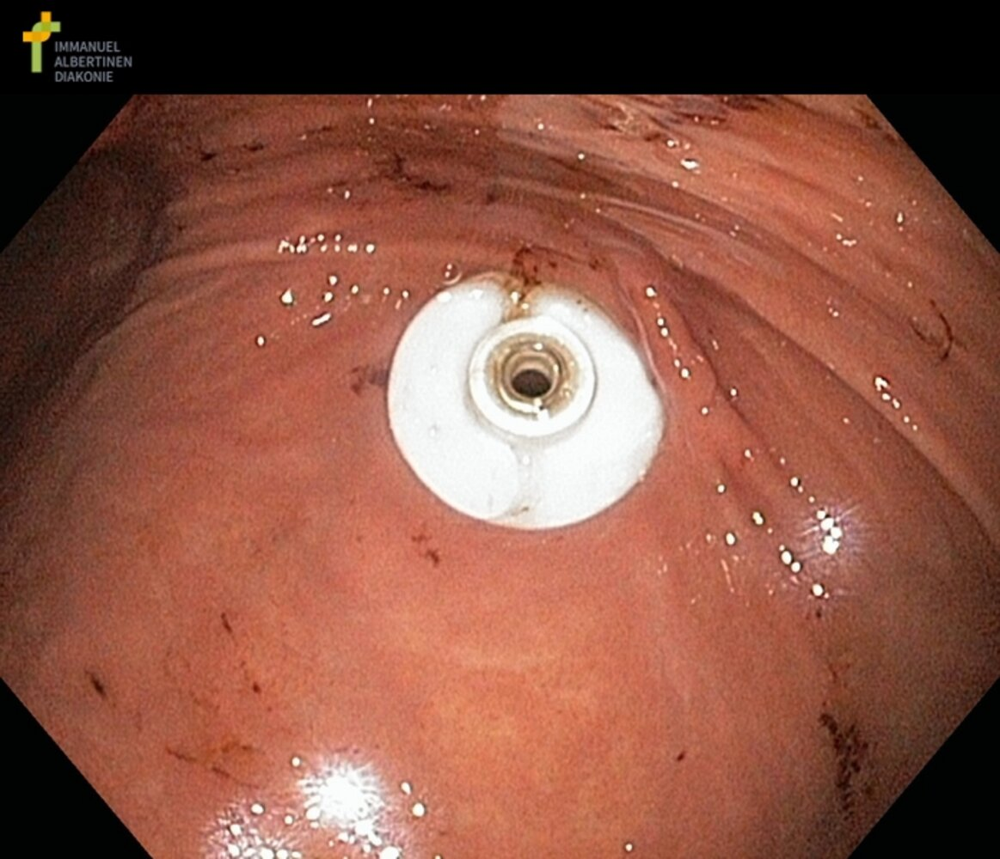
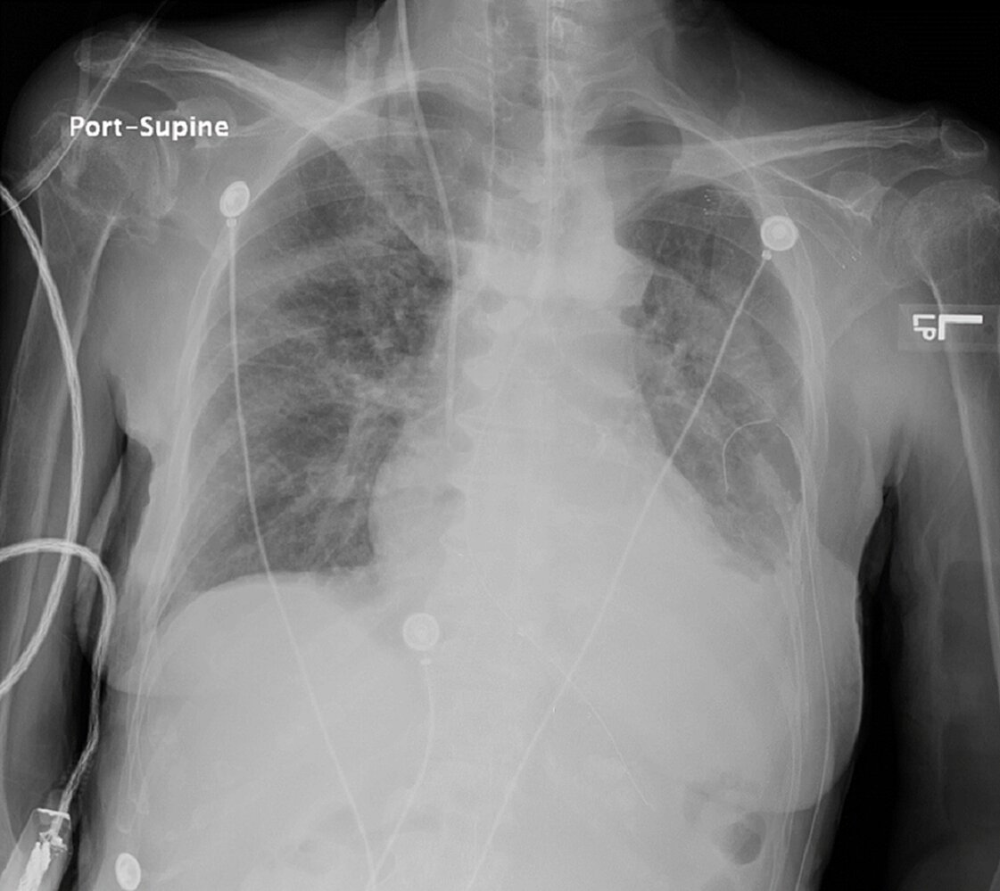
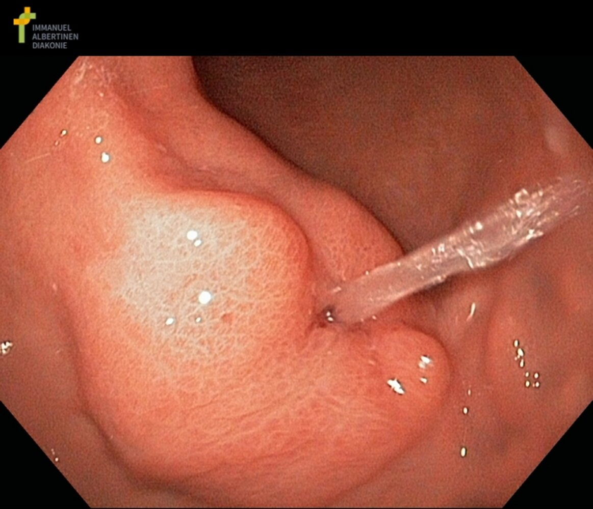

# Specialized nutrition support

*Categories: Clinical knowledge > Emergency medicine > Treatment approaches and procedures > Specialized nutrition support*

[Original Article Link](https://coursology-qbank.com/amboss/article/7L04_g)

---

## Summary

Specialized nutrition support comprises the administration of <u>enteral nutrition</u> (bypassing the <u>oropharynx</u>) and/or <u>parenteral nutrition</u> (bypassing the <u>GI tract</u>). Specialized nutrition support is primarily indicated in patients with <u>malnutrition</u> and those at high nutritional risk. <u>Enteral nutrition</u> is preferred over <u>parenteral nutrition</u> unless contraindications to <u>enteral nutrition</u> are present (e.g., <u>mechanical bowel obstruction</u>). Nutrition support is associated with various complications such as injury during <u>feeding tube</u> placement, <u>IV catheter-related infection</u>, and metabolic complications. There is a higher risk of metabolic complications with <u>parenteral nutrition</u> than with <u>enteral nutrition</u>.

---

## Approach

### General principles [[1]](https://coursology-qbank.com/amboss/article/HK1K330)[[2]](https://coursology-qbank.com/amboss/article/1p12o30)

* Consult a nutritionist if available. [[3]](https://coursology-qbank.com/amboss/article/jKc_TW0)

* Consider specialized nutrition support in:  

* Hospitalized patients who are both: [[2]](https://coursology-qbank.com/amboss/article/1p12o30)

* At high nutritional risk or diagnosed with <u>malnutrition</u>

* Unable to maintain <u>nutritional status</u> with oral intake

* Critically ill patients unable to maintain oral intake [[4]](https://coursology-qbank.com/amboss/article/eF1xSi0)

* Specialized nutrition support is usually not indicated in well-nourished adults who are both: [[3]](https://coursology-qbank.com/amboss/article/jKc_TW0)

* At low nutritional risk

* Expected to resume oral intake within 5–7 days

* Use clinical judgment and follow local protocols.

### Nutritional risk assessment [[2]](https://coursology-qbank.com/amboss/article/1p12o30)

* Nutritional risk is based on both:

* <u>Nutritional status</u>

* Disease severity

* Consider the use of validated screening tools, e.g.:

* <u>Nutrition Risk Screening 2002 score</u> (<u>NRS-2002 score</u>)

* <u>Nutrition Risk in the Critically Ill score</u> (<u>NUTRIC score</u>)

### Considerations for enteral vs. <u>parenteral nutrition</u> [[3]](https://coursology-qbank.com/amboss/article/jKc_TW0)[[5]](https://coursology-qbank.com/amboss/article/iKcJTW0)[[6]](https://coursology-qbank.com/amboss/article/xt1Efi0)

* <u>Enteral nutrition</u>: first choice for most patients

* Lower risk of metabolic complications and <u>bloodstream infection</u> than with <u>parenteral nutrition</u>

* Intestinal motility is stimulated, preventing <u>mucosal</u> <u>atrophy</u>.

* <u>Parenteral nutrition</u>: second line if <u>enteral nutrition</u> is contraindicated, not tolerated, or insufficient to meet metabolic needs

* Use <u>shared decision-making</u> and consider:

* <u>Goals of care</u> (e.g., patient preference for minimal interventions)

* Impact on quality of life, especially in patients with a limited <u>life expectancy</u>

> [!WARNING]
> <u>Enteral feeding</u> has not been shown to increase survival or improve quality of life in patients with <u>dementia</u>. [[3]](https://coursology-qbank.com/amboss/article/jKc_TW0)

> [!NOTE]
> The following principle applies to most situations: oral before enteral, enteral before parenteral!

---

## Enteral nutrition

<u>Enteral feeding</u> is first choice for most patients with indications for specialized nutrition support.

### Definition

<u>Enteral nutrition</u> is the administration of <u>nutrients</u> via a <u>feeding tube</u> placed directly into the <u>stomach</u>, <u>duodenum</u>, or <u>jejunum</u>.

### Routes [[2]](https://coursology-qbank.com/amboss/article/1p12o30)

#### Nasal or oral access

* Gastric feeding: preferred initial route

* <u>Nasogastric tube</u>

* <u>Orogastric tube</u>

* Postpyloric feeding, e.g., <u>nasojejunal tube</u>, nasoduodenal tube

#### Percutaneous access

Percutaneous access is indicated if nutritional support is anticipated for approx. > 4 weeks and inserted surgically, fluoroscopically, or endoscopically.

* Gastrostomy tube (<u>G tube</u>) [[7]](https://coursology-qbank.com/amboss/article/qy1CTj0)[[8]](https://coursology-qbank.com/amboss/article/Iy1Ygj0)

* Inserted into the <u>stomach</u> through an <u>incision</u> in the abdominal wall

* Example: endoscopically inserted percutaneous endoscopic gastrostomy (<u>PEG</u>) tube

* Jejunostomy tube (<u>J tube</u>)

* Inserted into the <u>jejunum</u> through an <u>incision</u> in the abdominal wall

* Used if gastric <u>enteral feeding</u> is contraindicated

* Gastrojejunostomy tube (<u>GJ tube</u>)

* Inserted into the <u>stomach</u> through an <u>incision</u> in the abdominal wall, with an additional tube threaded into the <u>jejunum</u>

* Used to provide postpyloric feeding and to vent the <u>stomach</u>

Percutaneous endoscopic gastrostomy tube

Percutaneous endoscopic gastrostomy

### Contraindications [[5]](https://coursology-qbank.com/amboss/article/iKcJTW0)[[9]](https://coursology-qbank.com/amboss/article/kIYm1q)

* <u>Acute abdomen</u> (e.g., <u>peritonitis</u>)

* <u>GI tract</u> dysfunction, e.g.:

* <u>Mechanical bowel obstruction</u> or paralytic <u>ileus</u>

* Internal or external intestinal <u>fistulae</u>

* <u>Upper GI bleeding</u>

* Intractable <u>vomiting</u> or <u>diarrhea</u>

* Pediatric conditions

* <u>Congenital visceral anomalies</u> (e.g., <u>gastroschisis</u>)

* <u>Necrotizing enterocolitis</u>

* <u>Radiation enteritis</u>

> [!WARNING]
> <u>Absolute contraindications</u> for <u>enteral nutrition</u> include <u>mechanical bowel obstruction</u> and severe <u>bowel ischemia</u>. [[1]](https://coursology-qbank.com/amboss/article/HK1K330)[[2]](https://coursology-qbank.com/amboss/article/1p12o30)

### <u>Aspiration</u> prevention [[3]](https://coursology-qbank.com/amboss/article/jKc_TW0)[[9]](https://coursology-qbank.com/amboss/article/kIYm1q)[[10]](https://coursology-qbank.com/amboss/article/hq1cy30)

* Ensure adequate tube type and placement.

* Use <u>chest x-ray</u> or <u>ultrasound</u> to verify correct gastric or postpyloric tube position.

* Air insufflation followed by epigastric <u>auscultation</u> can be used if access to <u>radiography</u> is limited.

* Consider postpyloric feeding if patients experience adverse effects (e.g., recurrent emesis, <u>gastroparesis</u>).

* Ensure correct patient positioning: Elevate the head of the bed to > 30°.

* Consider <u>prokinetic agents</u> to promote gastric emptying.

Correctly placed nasogastric tube

### <u>Tube feeding</u> regimens [[9]](https://coursology-qbank.com/amboss/article/kIYm1q)

* Continuous feeding

* The typical initial infusion rate is 50 mL/hour.

* Increase the rate of infusion by 25 mL/hour every 4–8 hours until the target rate is reached.

* Bolus feeding (gastric feeding only)

* 200–400 mL of formula  multiple times per day

* Hold if there is residual tube feed formula in the <u>gastric body</u> 4 hours after the previous bolus.

### Composition of <u>enteral feeding</u> solutions [[3]](https://coursology-qbank.com/amboss/article/jKc_TW0)[[9]](https://coursology-qbank.com/amboss/article/kIYm1q)[[11]](https://coursology-qbank.com/amboss/article/AE1Ryi0)

Solution compositions vary based on individual patient needs and should be selected in consultation with a nutritionist.

* Feeding solutions typically include:

* <u>Proteins</u>: e.g., <u>amino acids</u>, <u>peptides</u>, high-molecular-weight <u>proteins</u>

* <u>Carbohydrates</u>: e.g., <u>mono</u>-, oligo-, <u>polysaccharides</u>

* Fats: e.g., medium- or <u>long-chain fatty acids</u>

* Other: <u>Electrolytes</u>, <u>trace elements</u>, and <u>vitamins</u> are added according to the recommended daily intake.

* <u>Osmolality</u> of enteral feeds: ∼ 300 mOsmol/L

### <u>Enteral nutrition</u>-specific complications [[3]](https://coursology-qbank.com/amboss/article/jKc_TW0)[[5]](https://coursology-qbank.com/amboss/article/iKcJTW0)[[9]](https://coursology-qbank.com/amboss/article/kIYm1q)

#### Nutrition related

* Gastrointestinal complications

* <u>Osmotic diarrhea</u> (most common complication)

* <u>Nausea</u>, <u>vomiting</u>, <u>bloating</u>

* <u>Gastroesophageal reflux</u>

* Respiratory complications

* <u>Aspiration pneumonia</u>

* <u>Aspiration pneumonitis</u>

* Respiratory failure due to enteral feeding: <u>Aspiration</u> and the increased carbon dioxide production associated with <u>enteral nutrition</u> can lead to <u>hypercapnia</u> and <u>respiratory failure</u>.  [[12]](https://coursology-qbank.com/amboss/article/PKcWgW0)[[13]](https://coursology-qbank.com/amboss/article/4Kc3gW0)

* Other: <u>metabolic complications of specialized nutrition support</u>

#### Access related

* Tube blockage or dislodgement

* <u>NG tube</u>-specific [[14]](https://coursology-qbank.com/amboss/article/yq1daR0)

* Incorrect placement, e.g., in the <u>trachea</u>

* Injury to or <u>perforation of the stomach</u> wall

* <u>Erosion</u> of the nares

* <u>G tube</u>-specific [[15]](https://coursology-qbank.com/amboss/article/D-11zj0)

* Peristomal infection and/or leakage

* <u>Buried bumper syndrome</u>

* <u>Bowel perforation</u>

* Bleeding

##### Management of G tube complications [[7]](https://coursology-qbank.com/amboss/article/qy1CTj0)[[8]](https://coursology-qbank.com/amboss/article/Iy1Ygj0)

* All patients with complications

* Stop tube feed.

* Consult specialty service, e.g., <u>surgery</u>, interventional radiology.

* Tube blockage [[16]](https://coursology-qbank.com/amboss/article/VXWGCP0)

* Instill warm water with a 30–60 mL syringe and apply gentle back-and-forth pressure on the plunger.  [[16]](https://coursology-qbank.com/amboss/article/VXWGCP0)

* If unsuccessful: Instill activated <u>pancreatic enzyme</u> solution, clamp the <u>G tube</u>, and reattempt flushing after 30 minutes.

* If the obstruction remains, consider using a declogging brush and/or tube replacement.

* Infection: Consider <u>antibiotics</u>.

* <u>Signs of peritonitis</u>: <u>empiric antibiotics for intraabdominal infections</u> [[8]](https://coursology-qbank.com/amboss/article/Iy1Ygj0)

* Local peristomal infection: <u>empiric antibiotics for SSTIs</u> [[8]](https://coursology-qbank.com/amboss/article/Iy1Ygj0)

* Early dislodgement (< 4 weeks after placement)

* Endoscopic replacement is usually required.

* Do not attempt blind reinsertion.

* Admit for specialist consult and monitor for <u>signs of peritonitis</u>.

* Late dislodgement (> 4 weeks after placement)

* Bedside <u>G tube</u> replacement can be safely attempted for late dislodgement. [[8]](https://coursology-qbank.com/amboss/article/Iy1Ygj0)

* Place a new <u>G tube</u> or, if a new <u>G tube</u> is not immediately available, a <u>foley catheter</u>.  [[8]](https://coursology-qbank.com/amboss/article/Iy1Ygj0)[[17]](https://coursology-qbank.com/amboss/article/3wYSir)

* Inflate the <u>gastrostomy tube</u> balloon and confirm correct placement before resuming tube feed.  [[17]](https://coursology-qbank.com/amboss/article/3wYSir)

> [!WARNING]
> Do not attempt to unclog a <u>G tube</u> with forceful <u>irrigation</u> or carbonated beverages, as this can worsen occlusion and/or lead to tube rupture. [[17]](https://coursology-qbank.com/amboss/article/3wYSir)

> [!TIP]
> For tube dislodgement > 4 weeks after placement, immediately <u>stent</u> the tract with a new <u>G tube</u> or a <u>foley catheter</u> to prevent tract closure. [[8]](https://coursology-qbank.com/amboss/article/Iy1Ygj0)

Buried bumper syndrome

---

## Parenteral nutrition

### Definition [[9]](https://coursology-qbank.com/amboss/article/kIYm1q)

* <u>Parenteral nutrition</u>: the intravenous delivery of nutrition, bypassing the <u>GI tract</u>

* Total parenteral nutrition (<u>TPN</u>): the intravenous provision of all nutritional requirements

* Supplemental <u>parenteral nutrition</u>: the intravenous provision of <u>nutrients</u> to augment oral intake and meet nutritional goals

### Indications [[6]](https://coursology-qbank.com/amboss/article/xt1Efi0)

<u>Enteral nutrition</u> is either:

* Not tolerated

* Contraindicated, e.g., due to <u>mechanical bowel obstruction</u>, <u>intestinal fistula</u>

* Insufficient to meet metabolic needs, e.g., due to <u>short bowel syndrome</u>, severe <u>chronic inflammatory bowel disease</u>

### Routes [[3]](https://coursology-qbank.com/amboss/article/jKc_TW0)[[6]](https://coursology-qbank.com/amboss/article/xt1Efi0)

* <u>Central venous access</u>

* Preferred for most patients

* Options include:

* <u>Peripherally inserted central catheter</u> (<u>PICC line</u>)

* <u>Tunneled central venous catheter</u> (e.g., <u>Hickman line</u>)

* <u>Implanted port</u>

* <u>Peripheral venous access</u>: may be considered if <u>parenteral nutrition</u> is expected to be required for ≤ 2 weeks and the patient can tolerate large volumes of low <u>osmolarity</u> formula (e.g., 600–900 mOsm/L)  [[2]](https://coursology-qbank.com/amboss/article/1p12o30)[[6]](https://coursology-qbank.com/amboss/article/xt1Efi0)

> [!WARNING]
> Standard concentrations of <u>total parenteral nutrition</u> formulas (typically > 1800 mOsm/L) are caustic to <u>veins</u> and therefore better tolerated with central venous administration. [[3]](https://coursology-qbank.com/amboss/article/jKc_TW0)

### Contraindications [[3]](https://coursology-qbank.com/amboss/article/jKc_TW0)

* <u>Enteral nutrition</u> is feasible and can meet metabolic demands

* Severe <u>electrolyte</u> abnormalities

* <u>Volume overload</u>

* <u>Hyperglycemia</u>: serum <u>glucose</u> > 300 mg/dL (> 16.65 mmol/L) [[3]](https://coursology-qbank.com/amboss/article/jKc_TW0)

### Infusion regimens [[18]](https://coursology-qbank.com/amboss/article/_I152R0)

* Continuous <u>parenteral nutrition</u>

* Set rate over 24 hours

* Commonly used in acute care settings

* Higher risk of <u>hepatic steatosis</u> than cyclic

* Cyclic <u>parenteral nutrition</u>

* Infused over 10–14 hours (as tolerated)

* Allows for bolus administration at night (e.g., at the patient's home)

* Higher risk of <u>fluid overload</u>, <u>hyperglycemia</u>, and <u>electrolyte</u> imbalances than continuous

### Composition of <u>parenteral feeding</u> solutions [[9]](https://coursology-qbank.com/amboss/article/kIYm1q)

* <u>Proteins</u>: <u>amino acids</u>

* <u>Carbohydrates</u>: mostly <u>glucose</u>

* Fats: <u>medium-chain fatty acids</u> in a fat emulsion

* Other: <u>Electrolytes</u>, <u>trace elements</u>, and <u>vitamins</u> are added according to the recommended daily intake.

### <u>Parenteral nutrition</u>-specific complications [[9]](https://coursology-qbank.com/amboss/article/kIYm1q)

* Nutrition-related

* <u>Metabolic complications of specialized nutrition support</u>

* <u>Intestinal failure-associated liver disease</u>

* <u>Fluid overload</u>

* Access-related

* <u>Venous thrombus</u>, <u>venous embolism</u>

* <u>Catheter-related bloodstream infection</u>

* Catheter displacement

* <u>Iatrogenic</u> injury, e.g., <u>pneumothorax</u>

---

## Metabolic complications

* <u>Hyperglycemia</u> during enteral or <u>parenteral nutrition</u>

* <u>Refeeding syndrome</u> with associated <u>electrolyte</u> imbalances, e.g.:

* <u>Hypophosphatemia</u>

* <u>Hypomagnesemia</u>

* <u>Hypokalemia</u>

* Reduced <u>bone mineral density</u>

* Hepatic and biliary dysfunction

* <u>Nonalcoholic fatty liver disease</u>

* <u>Gallstone disease</u>, <u>acalculous cholecystitis</u>, <u>cholestasis</u>

* <u>Hyperlipidemia</u>

> [!NOTE]
> Metabolic complications are more common with <u>parenteral nutrition</u> than with <u>enteral nutrition</u>!

---

## Intestinal failure-associated liver disease

* Definition

* <u>Liver</u> dysfunction caused by the medical and surgical treatments for <u>intestinal failure</u>

* Parenteral nutrition-associated cholestasis (<u>PNAC</u>): intrahepatic <u>cholestasis</u> due to prolonged <u>parenteral nutrition</u> (> 2 weeks)

* <u>Epidemiology</u>: common in <u>neonates</u>, especially <u>preterm infants</u>

* <u>Risk factors</u>

* <u>Parenteral nutrition</u>: inappropriate use of lipid emulsions, lack of antioxidants, aluminum toxicity, prolonged infusion periods (> 2 weeks)

* <u>Prematurity</u>

* <u>Small for gestational age</u>

* <u>Low birth weight</u>

* Intestinal <u>malformations</u> (e.g., of the <u>small bowel</u>)

* <u>Necrotizing enterocolitis</u>

* Early or recurrent <u>sepsis</u>

* Intestinal <u>surgery</u> (e.g., prolonged maintenance of stomas)

* Clinical features: <u>jaundice</u>

* Diagnostics

* <u>Medical history</u>: prolonged parental nutrition, <u>intestinal failure</u>, unexplained <u>cholestasis</u>

* Elevated serum <u>direct bilirubin</u>

* ≥ 1 mg/dL: early sign of <u>liver</u> injury

* ≥ 2.0 mg/dL: indicates <u>cholestatic</u> <u>liver</u> disease

* Elevated <u>AST</u>, <u>ALT</u>, <u>GGT</u>

* Treatment [[19]](https://coursology-qbank.com/amboss/article/qkcCKc0)

* Medical treatment

* <u>Ursodeoxycholic acid</u>

* Maximizing enteral feedings: early initiation and progressive increase of feedings

* <u>Parenteral nutrition</u> management: cyclical infusions, tapering soybean lipid emulsion, light protection for <u>parenteral nutrition</u> bag

* <u>Antibiotics</u>

* Surgical treatment

* Bowel lengthening procedures (if applicable)

* <u>Transplantation</u>: <u>liver transplantation</u> or <u>liver</u> and intestinal <u>transplantation</u>

---