# Transfusion

*Categories: Clinical knowledge > Emergency medicine > Treatment approaches and procedures > Transfusion*

[Original Article Link](https://coursology-qbank.com/amboss/article/2M0TLg)

---

## Summary

Transfusion of whole blood or fractionated blood components is a widely used method for managing numerous conditions. <u>Packed red blood cells</u> (<u>pRBCs</u>), the most commonly transfused products, are primarily used for the treatment of acute and <u>chronic blood loss</u>. <u>RBC</u> transfusion elevates <u>hemoglobin</u> (<u>Hb</u>) levels and helps maintain organ <u>perfusion</u> and tissue oxygenation. The decision to transfuse <u>RBCs</u> is based on the patient's <u>Hb</u> level, hemodynamic status, and comorbidities (e.g., cardiovascular disease). <u>Fresh frozen plasma</u> (<u>FFP</u>), <u>cryoprecipitate</u>, <u>platelet</u>, and <u>clotting factor</u> transfusions are also available. <u>Pretransfusion testing</u> must be performed, unless in an emergency situation, to minimize the risk of transfusing incompatible <u>RBCs</u> and subsequent <u>transfusion reactions</u>. Testing involves <u>blood typing</u> (ABO and Rhesus) of the recipient's blood, <u>RBC antibody screening</u> of the recipient's serum or plasma, and <u>compatibility testing</u> (<u>crossmatching</u> recipient serum or plasma and donor <u>RBCs</u>).

See also “<u>Transfusion reactions</u>.”

---

## Blood type systems

There are more than 250 <u>antigens</u> on the <u>RBC</u> surface, which are classified into several <u>antigen</u>-<u>antibody</u> systems or <u>blood groups</u>. Blood type is most commonly communicated as a combination of <u>ABO blood type</u> and <u>Rhesus blood type</u> (e.g., O- for <u>blood type O</u> <u>Rh-negative</u> <u>blood products</u> and AB+ for <u>blood type AB</u> <u>Rh-positive</u> <u>blood products</u>). [[1]](https://coursology-qbank.com/amboss/article/SwbyRD)

### ABO blood type system [[1]](https://coursology-qbank.com/amboss/article/SwbyRD)

* Consists of the presence or absence of 2 <u>antigens</u>

* A (A <u>antigen</u>)

* B (B <u>antigen</u>)

* O (without <u>antigen</u>)

* <u>Newborns</u> have a lower occurrence of A and B <u>antigens</u> on <u>RBCs</u> than adults.

* <u>Inheritance pattern</u> 

* A and B are <u>codominant</u>

* O is recessive

* 6 <u>genotypes</u> give rise to 4 <u>phenotypes</u>

* Anti-A and/or anti–B <u>antibodies</u>

* Typically form spontaneously in <u>antigen</u>-negative individuals, i.e., without prior exposure to <u>antigen</u>-positive <u>RBCs</u>

* Can trigger <u>acute hemolytic transfusion reactions</u> upon an individual's first contact with ABO-incompatible <u>RBCs</u>

|  ABO blood types [[2]](https://coursology-qbank.com/amboss/article/xXYEZL) |  |  |  |  |
| --- | --- | --- | --- | --- |
| Type |  Blood type O   |  Blood type A   |  Blood type B   |  Blood type AB   |
| <u>Prevalence</u> | ∼ 45% | ∼ 40% | ∼ 10% | ∼ 5% |
| <u>Antigens</u> on <u>RBCs</u> | No <u>antigens</u> | A <u>antigen</u> | B <u>antigen</u> | A and B <u>antigens</u> |
| <u>Antibodies</u> in plasma | Anti-A and anti-B <u>antibodies</u> | Anti-B <u>antibodies</u> | Anti-A <u>antibodies</u> | No <u>antibodies</u> |
| Can receive <u>RBCs</u> from | O | A, O | B, O | AB, A, B, O (universal <u>RBC</u> recipients) |
| Can donate <u>RBCs</u> to | O, A, B, AB (universal <u>RBC</u> donors) | A, AB | B, AB | AB |
| Can receive <u>FFP</u> from | O, A, B, AB (universal <u>FFP</u> recipients)  | A, AB | B, AB | AB |
| Can donate <u>FFP</u> to | O | A, O | B, O | AB, A, B, O (universal <u>FFP</u> donors)  |

> [!WARNING]
> Individuals with <u>blood type O</u> can only receive <u>RBCs</u> from other <u>blood type O</u> donors. <u>RBCs</u> from donors of any other type (e.g., A, B, or AB) can cause <u>acute hemolytic transfusion reactions</u>.

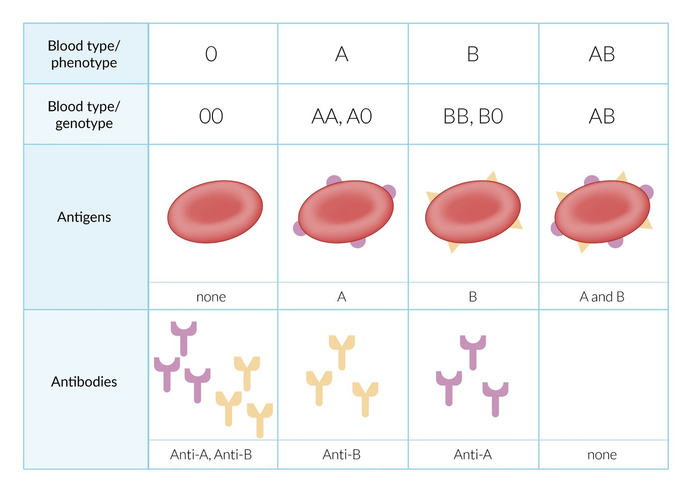

ABO blood group system

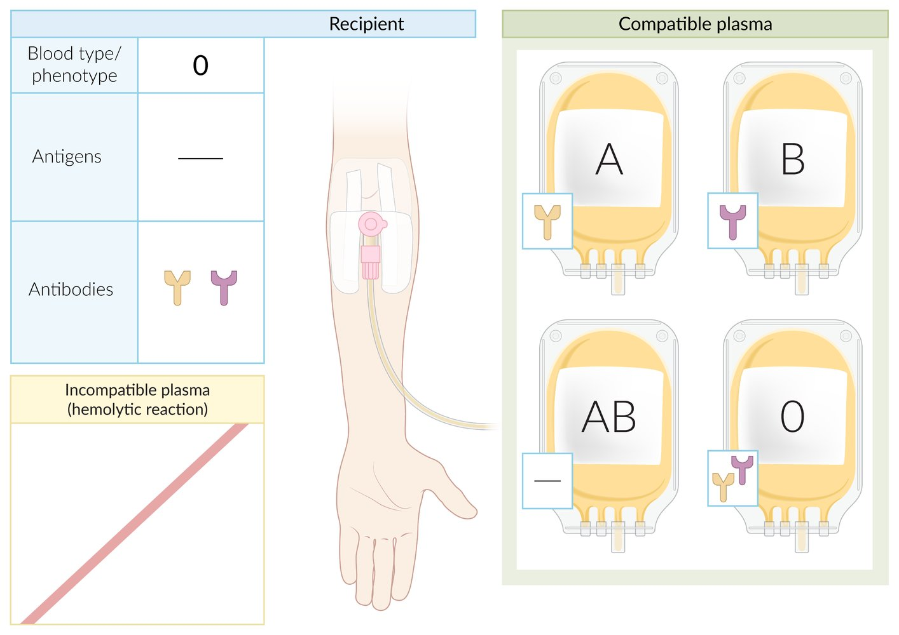

Blood type O plasma transfusion compatibility

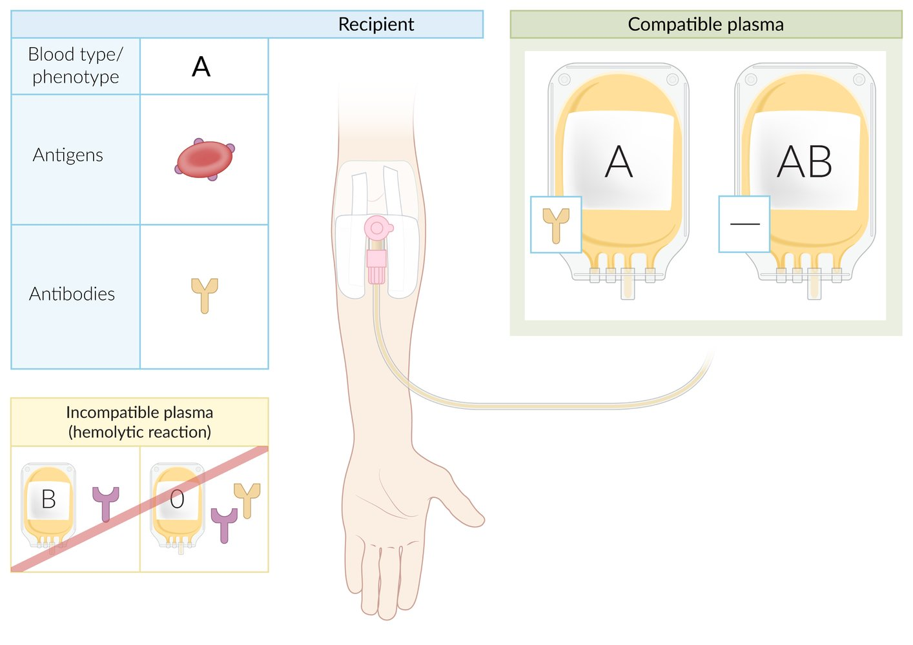

Blood type A plasma transfusion compatibility

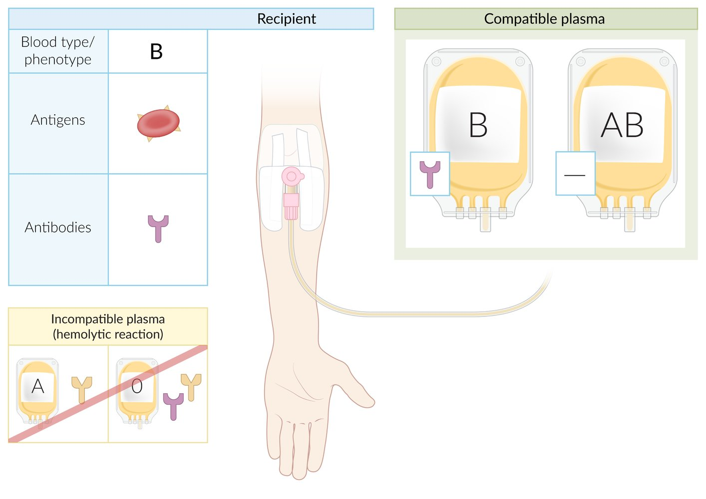

Blood type B plasma transfusion compatibility

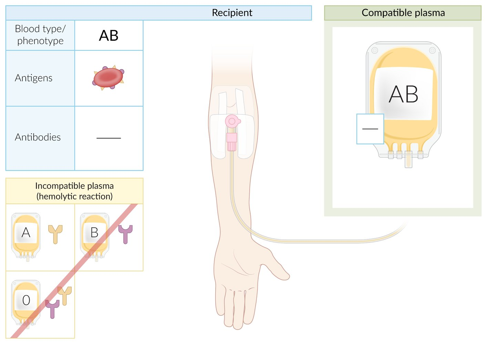

Blood type AB plasma transfusion compatibility

### Rhesus blood type system [[1]](https://coursology-qbank.com/amboss/article/SwbyRD)

* Consists of > 45 Rhesus (Rh) <u>antigens</u> of which Rh(D) antigen is the most immunogenic and clinically significant  [[2]](https://coursology-qbank.com/amboss/article/xXYEZL)

* The Rh(D) <u>antigen</u> is dominant over other Rhesus <u>antigens</u>.

* In clinical practice, Rh status typically refers to the presence or absence of <u>Rh(D) antigen</u>, despite the existence of other Rh <u>antigens</u> (see “<u>Extended RBC antigens</u>”).

* Anti-Rh <u>antibodies</u>

* Usually only form in <u>antigen</u>-negative individuals after exposure to <u>antigen</u>-positive <u>RBCs</u>, e.g., transfusion, <u>fetomaternal hemorrhage</u>

* Can lead to <u>hemolytic disease of the fetus and newborn</u> (<u>HDFN</u>) and/or <u>delayed hemolytic transfusion reactions</u> (<u>DHTR</u>) in sensitized individuals

|  <u>Rh blood types</u> [[2]](https://coursology-qbank.com/amboss/article/xXYEZL) |  |  |
| --- | --- | --- |
| Type |  Rh-negative   |  Rh-positive   |
|  <u>Prevalence</u>  |  1–15%  [[2]](https://coursology-qbank.com/amboss/article/xXYEZL) |  85–99%  [[2]](https://coursology-qbank.com/amboss/article/xXYEZL) |
| <u>Rh(D) antigen</u> on <u>RBCs</u> | Absent | Present |
| <u>Antibodies</u> in plasma | Anti-Rh <u>antibodies</u> can form after sensitization | No anti-Rh <u>antibodies</u> |
| Can receive <u>RBCs</u> from |  <u>Rh negative</u> (preferably)   | <u>Rh positive</u>, <u>Rh negative</u> |
| Can donate <u>RBCs</u> to | <u>Rh negative</u>, <u>Rh positive</u> | <u>Rh positive</u> |

> [!WARNING]
> In <u>Rh-negative</u> women of childbearing age, exposure to <u>Rh-positive</u> <u>RBCs</u> (e.g., by transfusion or <u>fetomaternal hemorrhage</u>) can trigger <u>maternal Rh alloimmunization</u>, which can cause <u>HDFN</u> in subsequent <u>pregnancies</u>. <u>Rh-negative</u> donor blood is therefore preferred in these patients, however, <u>Rh-positive</u> blood is acceptable if an <u>emergency transfusion</u> is required.

> [!TIP]
> <u>FFP</u> transfusions do not need to be Rh-compatible as the risk of <u>transfusion reactions</u> and/or subsequent <u>alloimmunization</u> is low. [[3]](https://coursology-qbank.com/amboss/article/O6XIO_)

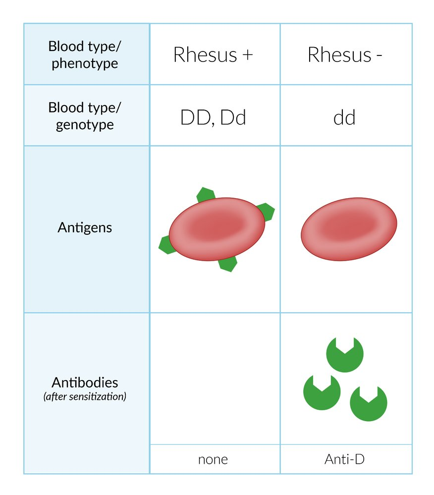

Rh blood group system

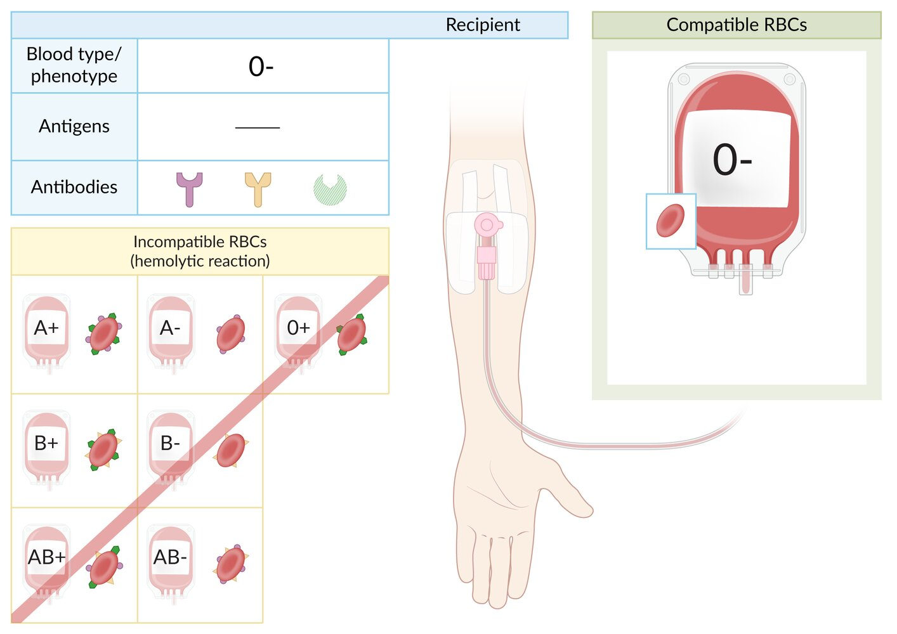

Blood type O- RBC transfusion compatibility

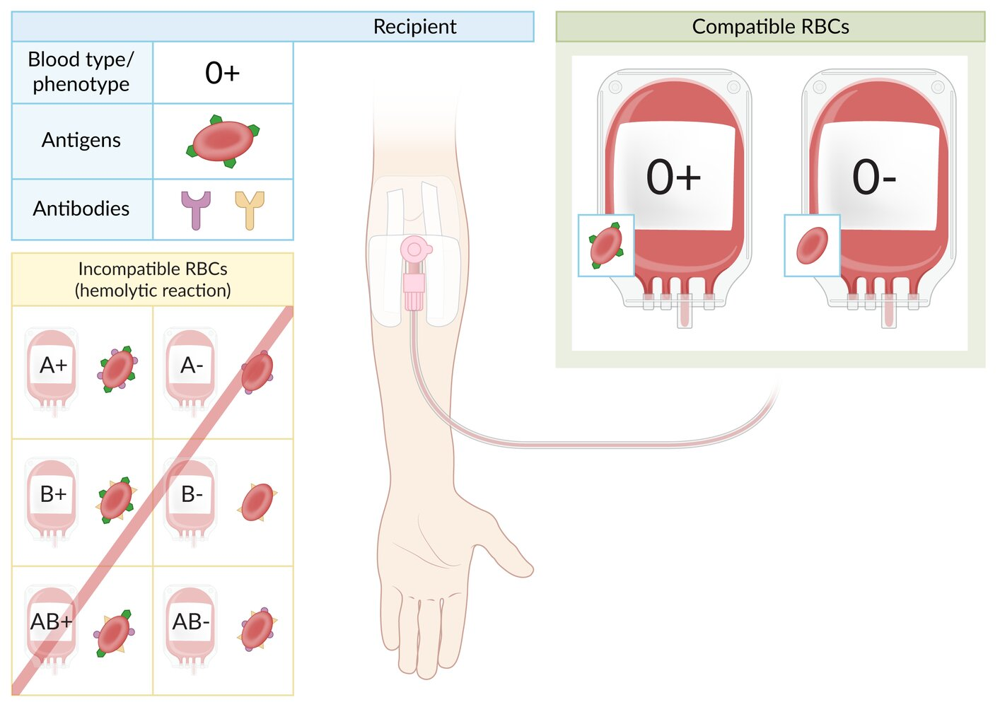

Blood type O+ RBC transfusion compatibility

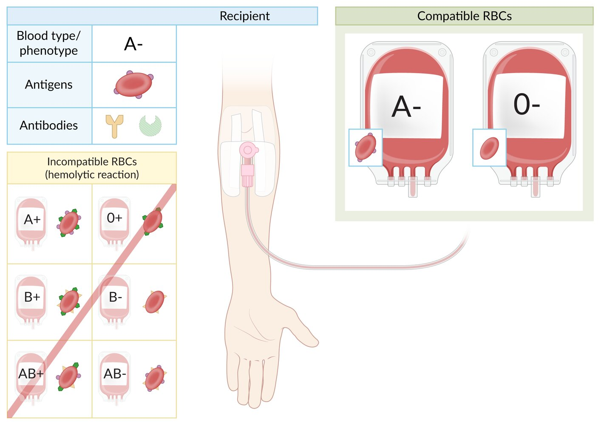

Blood type A- RBC transfusion compatibility

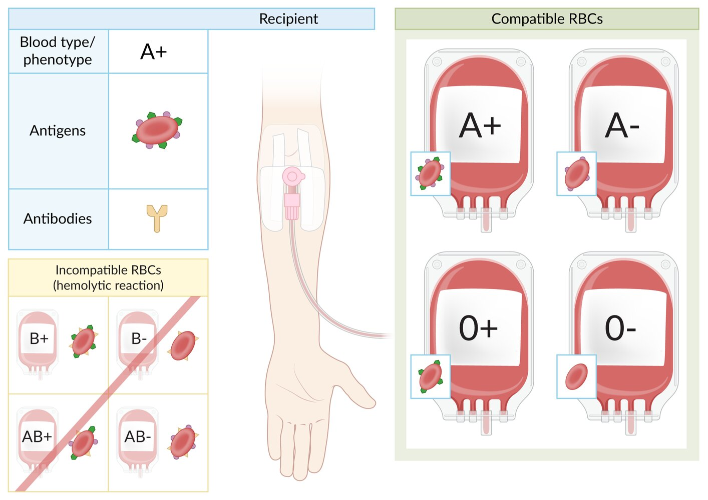

Blood type A+ RBC transfusion compatibility

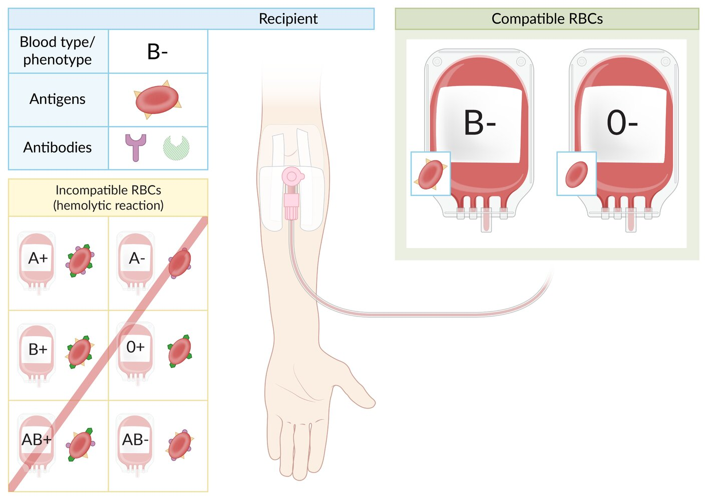

Blood type B- RBC transfusion compatibility

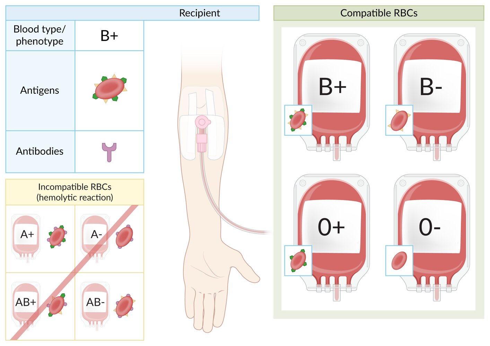

Blood type B+ RBC transfusion compatibility

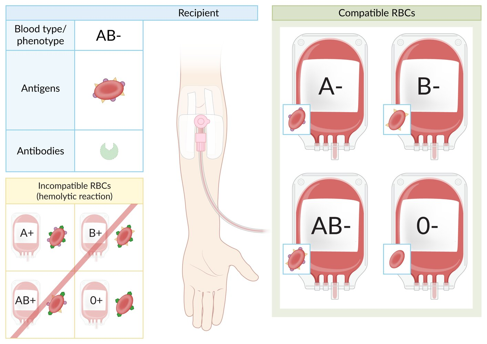

Blood type AB- RBC transfusion compatibility

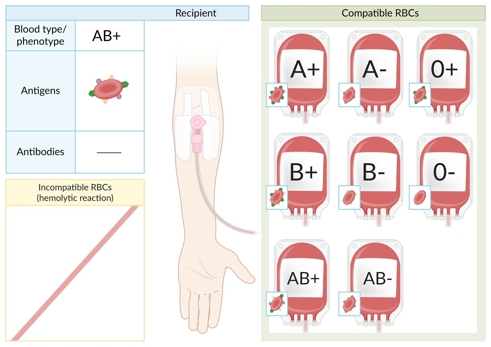

Blood type AB+ RBC transfusion compatibility

### Extended RBC antigen systems [[4]](https://coursology-qbank.com/amboss/article/CrbqjE)

Several other <u>antigen</u> groups can trigger <u>antibody</u> formation in <u>antigen</u>-negative individuals after exposure to <u>antigen</u>-positive <u>RBCs</u>. Only some cause clinically significant <u>hemolytic anemias</u> and/or <u>transfusion reactions</u>.

* <u>Rhesus antigen system</u>: Most non-D Rh <u>antigens</u>, e.g., Rh(C) and Rh(E), are less frequent and typically considered among the spectrum of <u>extended RBC antigens</u>.  [[2]](https://coursology-qbank.com/amboss/article/xXYEZL)

* Kell antigen system

* A group of <u>RBC</u> <u>antigens</u>, which includes K (K1), k (K2), Kpa, Kpb, Jsa, and Jsb <u>antigens</u>

* A <u>homozygote</u> for the Ko <u>allele</u> expresses no Kell <u>antigens</u>

* Responsible for up to 10% of severe cases of <u>HDFN</u> and capable of causing <u>hemolytic transfusion reactions</u>

* Duffy antigen system [[5]](https://coursology-qbank.com/amboss/article/wrbhjE)

* A group of six glycoprotein <u>receptors</u> found on <u>RBCs</u> that are encoded on <u>chromosome</u> 1

* <u>Plasmodium vivax</u> binds to <u>Duffy antigens</u> to invade <u>RBCs</u> and cause <u>malaria</u>.

* <u>Antibodies</u> against <u>Duffy antigen</u> can also cause <u>transfusion reactions</u> and <u>hemolytic disease of the newborn</u>.

* Kidd antigen system [[6]](https://coursology-qbank.com/amboss/article/Drb1jE)

* A rare group of three <u>RBC</u> <u>antigens</u>: Jka (JK1), Jkb (JK2), and JK3

* Also expressed in the <u>epithelium</u> of descending vasa recta, where they play an important role as <u>urea</u> transporters

* MNS antigen system [[7]](https://coursology-qbank.com/amboss/article/9rbNjE)

* A group of more than 40 <u>RBC</u> <u>antigens</u>, including M, N, S, s, and U <u>antigens</u>

* MNS <u>antigens</u> are carried on glycophorin A and B and are fully developed at <u>birth</u>.

* Less likely to be clinically significant than other <u>antigen</u>-<u>antibody</u> systems  [[1]](https://coursology-qbank.com/amboss/article/SwbyRD)

---

## Transfusion safety measures

### Blood bank measures

* <u>Blood products</u> for transfusion can be allogeneic (i.e., from a donor) or <u>autologous</u> (i.e., retransfusion of the patient's own <u>blood products</u>)

* Systemic measures are taken by blood banks and blood donation services prior to release for transfusion to reduce risks associated with individual donor units.

* Allogeneic donor blood is tested to determine blood type, screened for common infectious diseases, and then leukoreduced.

* Some blood donations undergo additional processing to further reduce the risk of complications in high-risk groups.

* Blood for <u>autologous</u> transfusion typically undergoes minimal processing intraoperatively prior to retransfusion (e.g., the addition of <u>anticoagulant</u>, filtering for debris and clots, saline washing) [[8]](https://coursology-qbank.com/amboss/article/kKcmgW0)

* All prospective blood donors in the United States undergo screening via a donor history questionnaire (DHQ), e.g., to identify infectious risk (see “<u>Blood donation infection screening</u>”) and high-risk medications (e.g., <u>antiplatelet agents</u>) and/or noninfectious conditions (e.g., cancer).  [[9]](https://coursology-qbank.com/amboss/article/apcQLW0)[[10]](https://coursology-qbank.com/amboss/article/1pc2oW0)[[11]](https://coursology-qbank.com/amboss/article/bpcHLW0)

#### <u>Infection control</u>

* Leukoreduction: filtration of <u>leukocytes</u> out of cellular <u>blood products</u> ;  [[12]](https://coursology-qbank.com/amboss/article/RjclZc0)

* Reduces the risk of <u>nonhemolytic febrile transfusion reactions</u>; , <u>HLA</u> <u>alloimmunization</u>, and transmission of <u>CMV</u>, <u>HTLV</u>-1/2, and <u>EBV</u> via <u>leukocytes</u>

* Prolongs the lifespan of <u>pRBC</u> in storage

* Blood donation infection screening

* DHQ screening may exclude donors for a variable or indefinite period if they meet specific criteria, e.g., certain behavioral <u>risk factors for bloodborne infections</u>, history or active features of transmissible illnesses, and/or time spent in <u>endemic</u> areas for specific pathogens, e.g., <u>vCJD</u>, <u>malaria</u>.  [[13]](https://coursology-qbank.com/amboss/article/ZpcZLW0)[[14]](https://coursology-qbank.com/amboss/article/0pceLW0)[[15]](https://coursology-qbank.com/amboss/article/YpcnLW0)

* Laboratory screening: performed on all units received for blood donation

* Routine screening in the United States [[16]](https://coursology-qbank.com/amboss/article/ijcJZc0)

* <u>HIV</u>, <u>hepatitis B</u>, <u>hepatitis C</u>, and <u>HTLV</u>

* <u>West Nile virus</u>

* <u>Zika virus</u>

* <u>Syphilis</u> (<u>Treponema pallidum</u>)

* <u>Chagas disease</u> (<u>Trypanosoma cruzi</u>)  [[17]](https://coursology-qbank.com/amboss/article/_sX5xz)

* Additional screening in <u>endemic</u> regions

* <u>Babesiosis</u> (<u>Babesia</u> spp.)

* <u>Hepatitis A</u> and <u>hepatitis E</u>

* <u>Malaria</u>

#### Additional processing

<u>Blood products</u> for patients with certain preexisting conditions may require further processing to reduce the risk of complications.

* <u>Irradiation</u> [[18]](https://coursology-qbank.com/amboss/article/4jc30c0)

* Radiation exposure inactivates <u>lymphocytes</u> to reduce the risk of <u>transfusion-associated graft-versus-host disease</u> (<u>ta-GvHD</u>)

* Indicated in <u>patients at risk of ta-GvHD</u>.

* Washing [[19]](https://coursology-qbank.com/amboss/article/PjcW0c0)

* Replaces plasma in cellular <u>blood products</u> with an alternative solution to reduce the risk of an <u>allergic reaction</u>

* Indicated in patients with a history of <u>IgA</u> deficiency or severe <u>allergic reaction</u> to <u>blood products</u>

* Volume reduction [[20]](https://coursology-qbank.com/amboss/article/kjcm0c0)

* Decreases the amount of plasma and storage solution in cellular <u>blood products</u> to prevent <u>volume overload</u> during transfusion

* Indicated in patients at risk of <u>transfusion-associated circulatory overload</u> (<u>TACO</u>)

### Pretransfusion safety practices  [[17]](https://coursology-qbank.com/amboss/article/_sX5xz)[[21]](https://coursology-qbank.com/amboss/article/zQcrAX0)

* Consider transfusion therapy when benefits outweigh the risks and <u>alternatives to blood transfusion</u> have been excluded.

* Choose condition-specific transfusion thresholds and indications tailored to individual patient needs, for example: 

* Preexisting conditions (e.g., <u>heart</u> disease, hematological <u>malignancy</u>)

* Specific clinical circumstances (e.g., trauma, critical illness)

* Functional status and desired <u>level of care</u>

* Whenever possible:

* Obtain <u>informed consent</u>.

* Complete <u>pretransfusion testing</u>.

* Follow compatibility requirements for each <u>blood product</u> issued.

* Ensure that the right <u>blood product</u> is being transfused to the right patient at the right time.

* Do not delay life-saving transfusions.

* Only defer life-saving blood transfusions if a clear and valid <u>advance directive</u> prohibits their use or an individual with <u>decision-making capacity</u> declines transfusion after an informed discussion.

> [!WARNING]
> <u>Emergency-issued blood products</u> (e.g., <u>uncrossmatched RBCs</u>) can be given under <u>implied consent</u> and without <u>pretransfusion testing</u> in life-threatening situations.

> [!TIP]
> Patients who do not wish to accept blood transfusions (e.g., Jehovah's witnesses) are advised to carry an <u>advance directive</u> card. However, in life-threatening situations, if the patient cannot be consulted and clear <u>advance directives</u> are not available, <u>blood products</u> should be given.

#### Pretransfusion checklist

Ensure the following whenever possible:

* Check patient records to identify any special transfusion requirements.

* Discuss transfusion risks, benefits, and <u>alternatives to blood transfusion</u> in detail with patients or <u>surrogate decision-makers</u>.

* Document <u>informed consent</u>.

* Order <u>pretransfusion testing</u> as indicated by transfusion product: e.g., <u>type and screen</u>, <u>crossmatching</u>.

* Transfuse <u>blood products</u> within normal working hours for all nonurgent transfusions.  [[22]](https://coursology-qbank.com/amboss/article/PMXWKA)

* Use fully <u>crossmatched</u> <u>blood products</u> as soon as they are available.

#### Requests and prescriptions

Ensure the following are appropriately labeled, documented, and communicated:

* Two independent patient identifiers (e.g., full name and unique medical record number)

* Reasons for transfusion

* Type and number of units of the <u>blood product</u> to be transfused

* Rate or duration of transfusion

* Special requirements (e.g., washed or <u>irradiated</u> products)

* Name and contact details of the requesting clinician

#### Safety check prior to administration [[17]](https://coursology-qbank.com/amboss/article/_sX5xz)

* Confirm the patient's identity.

* Check if the correct <u>blood products</u> have been issued.

* Ensure <u>blood product</u> containers are undamaged and contents appear normal.

> [!WARNING]
> Compare patient and <u>blood product</u> identifiers immediately prior to transfusion. Do not transfuse if there is any discrepancy!

### Transfusion administration [[17]](https://coursology-qbank.com/amboss/article/_sX5xz)

See “Fractionated blood components” for component-specific administration instructions.

* Equipment

* Give blood component transfusions through a standard blood infusion set.

* Use blood-warming devices in patients with <u>cold agglutinins</u> or those requiring multiple transfusions.

* Rate of administration

* When possible, transfuse at a slower rate for the first 15 minutes.

* Complete all transfusions within 4 hours of removing the <u>blood product</u> from temperature-controlled storage.  [[23]](https://coursology-qbank.com/amboss/article/1jc2zX0)

* Cautions

* Do not administer any other medication or solution (except <u>normal saline</u>) through the same tubing.

* Do not routinely use <u>antipyretics</u>, <u>antihistamines</u>, or <u>steroids</u> to prevent <u>transfusion reactions</u>.  [[24]](https://coursology-qbank.com/amboss/article/CAbqNw)

> [!TIP]
> <u>Diuretics</u> are often used in clinical practice to help maintain a normal <u>volume status</u> in patients requiring multiple transfusions but have not been shown to reduce the risk of <u>transfusion-associated circulatory overload</u>. [[24]](https://coursology-qbank.com/amboss/article/CAbqNw)

### Monitoring [[17]](https://coursology-qbank.com/amboss/article/_sX5xz)[[22]](https://coursology-qbank.com/amboss/article/PMXWKA)

* Check clinical status and <u>vital signs</u> for every unit transfused:

* Before initiation

* 15 minutes after starting the transfusion

* Within 60 minutes of completion

* If any symptoms or signs of a possible <u>transfusion reaction</u> (e.g., <u>dyspnea</u>, chills, <u>pruritus</u>) develop

* Monitor for <u>signs of fluid overload</u>, especially in patients requiring multiple transfusions.

* Observe inpatients for 24 hours after transfusion.

> [!TIP]
> Follow the <u>initial management of acute transfusion reactions</u> for any patient who has a change in <u>vital signs</u> or becomes acutely unwell during or in the hours following a transfusion.

---

## Packed red blood cells

Recommendations in this section are consistent with the 2023 Association for the Advancement of Blood & Biotherapies (AABB) guideline for red cell transfusion. [[17]](https://coursology-qbank.com/amboss/article/_sX5xz)[[24]](https://coursology-qbank.com/amboss/article/CAbqNw)[[30]](https://coursology-qbank.com/amboss/article/mYdVpo0)[[33]](https://coursology-qbank.com/amboss/article/M_bMKw)

### Content

* <u>RBCs</u>

* A preservative, typically <u>citrate</u>-based [[34]](https://coursology-qbank.com/amboss/article/ejcxzX0)

* Unit volume: ∼200–350 mL [[22]](https://coursology-qbank.com/amboss/article/PMXWKA)

### Compatibility requirements

See “<u>ABO blood type system</u>” and “<u>Rhesus blood type system</u>.”

* Must be ABO compatible

* Give <u>Rh(D)-negative</u> recipients <u>Rh(D)-negative</u> <u>pRBCs</u> if possible.

* See also “<u>Type and screen</u>” and “<u>Crossmatching</u>.”

### Common indications for pRBC transfusion

The decision to transfuse should be made on a case-by-case basis.   [[24]](https://coursology-qbank.com/amboss/article/CAbqNw)[[30]](https://coursology-qbank.com/amboss/article/mYdVpo0)

* <u>Hemorrhagic shock</u> or ongoing rapid blood loss (regardless of initial <u>Hb</u> level)

* <u>Severe anemia</u> (even if asymptomatic)

* <u>Hb</u> < 7 g/dL for most patients [[30]](https://coursology-qbank.com/amboss/article/mYdVpo0)

* <u>Hb</u> ≤ 7.5 g/dL if the patient is due to undergo cardiac <u>surgery</u> [[30]](https://coursology-qbank.com/amboss/article/mYdVpo0)

* <u>Hb</u> ≤ 8 g/dL if the patient is due to undergo orthopedic <u>surgery</u> or has preexisiting cardiovascular disease  [[30]](https://coursology-qbank.com/amboss/article/mYdVpo0)

* <u>Moderate anemia</u>, in any of the following situations:

* <u>Symptoms of anemia</u>  [[26]](https://coursology-qbank.com/amboss/article/u5XpNA)

* Increased risk of complications, e.g., acute onset , significant comorbidities, older age

* <u>Signs of hypoxia</u>

* Planned <u>surgery</u>

* <u>Acute myocardial infarction</u> (<u>AMI</u>): <u>Hb</u> < 10 g/dL  [[35]](https://coursology-qbank.com/amboss/article/kzdmGs0)

* Conditions requiring <u>exchange transfusion</u>, e.g., <u>methemoglobinemia</u>

> [!TIP]
> Indications for <u>RBC</u> transfusion are not determined solely by <u>Hb</u> value, but rather by an assessment of the clinical circumstances and the patient's overall condition.

> [!TIP]
> Restrictive transfusion thresholds (i.e., <u>Hb</u> 7–8 g/dL) in hemodynamically stable patients are associated with similar <u>clinical outcomes</u> and less blood use and adverse effects compared to liberal thresholds (<u>Hb</u> 9–10 g/dL). [[30]](https://coursology-qbank.com/amboss/article/mYdVpo0)

### Administration

* Dose [[24]](https://coursology-qbank.com/amboss/article/CAbqNw)

* Give the minimum number of units required to relieve symptoms and/or restore <u>Hb</u> to above transfusion thresholds.

* In the absence of active bleeding, reassess the patient clinically after each unit and check their <u>CBC</u>.

* Usual rate: 90–120 minutes per unit  [[33]](https://coursology-qbank.com/amboss/article/M_bMKw)

### Effect

* ↑ <u>Hb</u> and oxygen-carrying capacity of the blood

* 1 unit of <u>pRBCs</u> increases <u>Hb</u> value by ∼ 1 g/dL and <u>hematocrit</u> value by ∼ 3%.

* <u>Intravascular</u> volume expansion roughly equivalent to unit volume

### Complications

* Repeated transfusions can lead to <u>iron overload</u>.

* See also “<u>Transfusion reactions</u>.”

---

## Platelets

### Content [[22]](https://coursology-qbank.com/amboss/article/PMXWKA)[[36]](https://coursology-qbank.com/amboss/article/NHX-qz)

* <u>Platelets</u> suspended in plasma or <u>platelet</u> additive solution  [[36]](https://coursology-qbank.com/amboss/article/NHX-qz)

* Typically provided as either of the following:  [[36]](https://coursology-qbank.com/amboss/article/NHX-qz)

* Single donor <u>apheresis</u> <u>platelets</u> (SDAP) unit: derived from 1 unit of whole blood from a single donor and contains ∼ 310,000/mm³ <u>platelets</u> in ∼ 300 mL

* Random donor pooled <u>platelets</u> (RDP) pack: derived from 4–6 units of whole blood from various donors and contains ∼ 280,000/mm³ <u>platelets</u> in ∼ 200 mL

### Compatibility requirements [[17]](https://coursology-qbank.com/amboss/article/_sX5xz)[[36]](https://coursology-qbank.com/amboss/article/NHX-qz)

Compatible donor <u>platelets</u> may not be available due to limited supply. The risks of incompatible <u>platelet transfusion</u> are lower than those of incompatible <u>pRBCs</u>.  [[37]](https://coursology-qbank.com/amboss/article/3LcSx10)

* ABO compatibility: preferred but not required for routine transfusions  [[1]](https://coursology-qbank.com/amboss/article/SwbyRD)[[37]](https://coursology-qbank.com/amboss/article/3LcSx10)

* Rh(D) matching: <u>Rh(D)-negative</u> <u>platelets</u> are preferred in <u>Rh(D)-negative</u> recipients to prevent <u>alloimmunization</u>.  [[22]](https://coursology-qbank.com/amboss/article/PMXWKA)

* Consider donor plasma compatibility when transfusing multiple units.  [[38]](https://coursology-qbank.com/amboss/article/5IXiWz)

### Indications for platelet transfusion [[24]](https://coursology-qbank.com/amboss/article/CAbqNw)[[29]](https://coursology-qbank.com/amboss/article/pCdLGH0)[[36]](https://coursology-qbank.com/amboss/article/NHX-qz)

| Category | Indication | <u>Platelet</u> threshold |
| --- | --- | --- |
| Active bleeding | General | Follow local protocols   |
|  <u>Trauma-induced coagulopathy</u> [[39]](https://coursology-qbank.com/amboss/article/GCdBtH0)  | < 50,000/mm³ |  |
| Nonoperative <u>intracranial hemorrhage</u>  |  ≤ 100,000/mm³   |  |
|  Qualitative <u>platelet disorders</u> (e.g., <u>Bernard-Soulier syndrome</u>) | Regardless of <u>platelet count</u>  |  |
| <u>Massive hemorrhage</u> | No specific threshold (part of balanced resuscitation) |  |
| Prophylactic <u>platelet transfusion</u> |  Severe hypoproliferative <u>thrombocytopenia</u> in patients actively receiving <u>chemotherapy</u> or undergoing <u>allogeneic stem cell transplant</u>  | < 10,000/mm³ |
| Preterm <u>neonates</u>  | < 25,000/mm³ |  |
| Adults with consumptive <u>thrombocytopenia</u> due to critical illness | < 10,000/mm³ |  |
| Before invasive procedures | <u>Central venous catheter placement</u> | < 10,000/mm³ |
| Diagnostic <u>lumbar puncture</u>  | < 20,000/mm³ |  |
| Neurosurgery [[38]](https://coursology-qbank.com/amboss/article/5IXiWz)  | < 100,000/mm³ |  |
| Low-risk interventional radiology procedures | < 20,000/mm³ |  |
| High-risk interventional radiology procedures (e.g., percutaneous <u>liver biopsy</u>) | < 50,000/mm³ |  |
| Major nonneuraxial <u>surgery</u>  | < 50,000/mm³ |  |
| <u>Childbirth</u> | < 50,000/mm³ |  |

### Cautions [[24]](https://coursology-qbank.com/amboss/article/CAbqNw)[[29]](https://coursology-qbank.com/amboss/article/pCdLGH0)[[36]](https://coursology-qbank.com/amboss/article/NHX-qz)

Prophylactic <u>platelet transfusion</u> is generally not recommended in the following situations:

* Hypoproliferative <u>thrombocytopenia</u> in patients undergoing <u>autologous stem cell transplant</u> or with <u>aplastic anemia</u>

* <u>Dengue</u>-related consumptive <u>thrombocytopenia</u> without <u>major bleeding</u>

* Patients undergoing cardiovascular <u>surgery</u> (including <u>cardiopulmonary bypass</u>) in the absence of <u>major hemorrhage</u>

* Spontaneous or traumatic, nonoperative <u>intracranial hemorrhage</u> if <u>platelet count</u> is > 100,000/mm³ (including those receiving <u>antiplatelet agents</u>)

* <u>HIT</u>

* <u>TTP</u>/<u>HUS</u>

* <u>ITP</u>

* <u>Vaccine-induced immune thrombotic thrombocytopenia</u> (<u>VITT</u>)

> [!WARNING]
> <u>Platelet transfusion</u> in patients with <u>HIT</u> or <u>TTP</u> is associated with higher rates of arterial <u>thrombosis</u> and mortality compared to no transfusion. [[40]](https://coursology-qbank.com/amboss/article/Njc-0c0)

### Administration

* Dose

* Transfuse 1 unit of <u>apheresis</u> <u>platelets</u> or 1 pack of pooled <u>platelets</u> to prevent bleeding due to severe <u>thrombocytopenia</u> (<u>platelets</u> < 10,000/mm³).  [[41]](https://coursology-qbank.com/amboss/article/rv0fYR)

* In <u>massive hemorrhage</u>, follow the <u>ratio</u> recommended in the <u>massive transfusion protocol</u>.

* For other indications, use the minimum dose required to restore <u>platelets</u> to the recommended transfusion thresholds. [[29]](https://coursology-qbank.com/amboss/article/pCdLGH0)

* Usual rate: 30–60 minutes per <u>apheresis</u> <u>platelets</u> unit/pooled <u>platelets</u> pack  [[22]](https://coursology-qbank.com/amboss/article/PMXWKA)[[33]](https://coursology-qbank.com/amboss/article/M_bMKw)

### Effect

* 1 unit of <u>apheresis</u> <u>platelets</u> or 1 pack of pooled <u>platelets</u> increases the <u>platelet count</u> by 20,000–60,000 /mm³. [[17]](https://coursology-qbank.com/amboss/article/_sX5xz)

* <u>Intravascular</u> volume expansion roughly equivalent to unit/pack volume

### Complications [[24]](https://coursology-qbank.com/amboss/article/CAbqNw)

* Multiple <u>platelet transfusions</u> may lead to <u>platelet transfusion</u> refractoriness.  [[36]](https://coursology-qbank.com/amboss/article/NHX-qz)

* See also “<u>Transfusion reactions</u>.”

> [!WARNING]
> Do not use <u>platelet transfusions</u> to treat severe <u>thrombocytopenia</u> due to <u>ITP</u>, <u>TTP</u>, <u>HUS</u>, or <u>HIT</u> unless there is <u>major bleeding</u>.

---

## FFP and cryoprecipitate

### Fresh frozen plasma [[17]](https://coursology-qbank.com/amboss/article/_sX5xz)[[24]](https://coursology-qbank.com/amboss/article/CAbqNw)[[31]](https://coursology-qbank.com/amboss/article/hjXcZy)[[33]](https://coursology-qbank.com/amboss/article/M_bMKw)

Recommendations in this section are consistent with the 2010 AABB guideline for plasma transfusion. [[31]](https://coursology-qbank.com/amboss/article/hjXcZy)

* Content

* Plasma, including all <u>coagulation factors</u> and <u>plasma proteins</u>

* All cellular components are removed from the transfusion product.

* Unit volume: ∼200–300 mL [[17]](https://coursology-qbank.com/amboss/article/_sX5xz)[[22]](https://coursology-qbank.com/amboss/article/PMXWKA)

* Compatibility requirements: See “<u>ABO blood type system</u>.”

* ABO compatibility must be considered.  [[1]](https://coursology-qbank.com/amboss/article/SwbyRD)

* Rh(D) matching: not required  [[22]](https://coursology-qbank.com/amboss/article/PMXWKA)

* Indications [[17]](https://coursology-qbank.com/amboss/article/_sX5xz)[[24]](https://coursology-qbank.com/amboss/article/CAbqNw)

* Management of <u>coagulopathy</u> in patients with multiple <u>clotting factor</u> deficiencies (e.g., due to <u>liver cirrhosis</u>, <u>DIC</u>)

* Usually considered for patients with <u>INR</u> ≥ 2.0 who have active bleeding or require invasive procedures.

* Not recommended for correction of mild <u>INR</u> elevations (i.e., <u>INR</u> = 1.1–1.9)  [[42]](https://coursology-qbank.com/amboss/article/iqbJyu)

* Prevention of dilutional <u>coagulopathy</u> in <u>massive transfusion</u>

* Plasma <u>exchange transfusion</u>, e.g., in <u>TTP</u> [[43]](https://coursology-qbank.com/amboss/article/IjcYbc0)

* Management of some <u>coagulation factor</u> deficiencies if no specific concentrate for treatment exists

* Alternative therapy for:

* Management of <u>plasma protein</u> deficiencies if recombinant products are unavailable

* Immediate reversal of <u>warfarin</u> in patients with life-threatening bleeding or <u>intracranial hemorrhage</u> if <u>4-factor PCC</u> is unavailable [[24]](https://coursology-qbank.com/amboss/article/CAbqNw)

* Administration

* Dose: 10–20 mL/kg  [[42]](https://coursology-qbank.com/amboss/article/iqbJyu)

* Usual rate: 10–20 mL/kg/hour  [[33]](https://coursology-qbank.com/amboss/article/M_bMKw)

* Effect

* Correction of both isolated and multiple <u>coagulation factor</u> deficiencies

* <u>Intravascular</u> volume expansion roughly equivalent to unit volume

* Complications: See “<u>Transfusion reactions</u>.”

> [!TIP]
> <u>4-factor PCC</u> is preferred over <u>FFP</u> for the immediate <u>reversal of vitamin K antagonists</u>. [[24]](https://coursology-qbank.com/amboss/article/CAbqNw)

### Cryoprecipitate [[17]](https://coursology-qbank.com/amboss/article/_sX5xz)[[24]](https://coursology-qbank.com/amboss/article/CAbqNw)

* Content: <u>clotting factors</u> (<u>fibrinogen</u>, <u>factor VIII</u>, <u>factor XIII</u>), <u>vWF</u>, and <u>fibronectin</u>

* Compatibility requirements

* ABO compatibility: preferred but not required  [[17]](https://coursology-qbank.com/amboss/article/_sX5xz)

* Rh(D) matching: not required  [[22]](https://coursology-qbank.com/amboss/article/PMXWKA)

* Indications

* Bleeding associated with <u>fibrinogen</u> deficiency (e.g., due to <u>DIC</u>, <u>liver</u> disease): typically performed if serum <u>fibrinogen</u> is 100–150 mg/dL [[24]](https://coursology-qbank.com/amboss/article/CAbqNw)

* Alternative therapy for deficiencies in <u>clotting factors</u>; , including <u>vWF</u>, <u>factor VIII</u>, and <u>factor XIII</u>

* Treatment of <u>uremic bleeding syndrome</u>

* Administration

* Dose: typically 1 unit per 15.4–22 lb of the patient's body weight  [[17]](https://coursology-qbank.com/amboss/article/_sX5xz)

* Usual rate: 10–20 mL/kg/hour  [[33]](https://coursology-qbank.com/amboss/article/M_bMKw)

* Effect: 1 unit of <u>cryoprecipitate</u> per 15.4–22 lb of the patient's body weight increases serum <u>fibrinogen</u> by ∼ 50–75 mg/dL . [[17]](https://coursology-qbank.com/amboss/article/_sX5xz)

* Complications

* Rarely, transfusion of large volumes of ABO-incompatible <u>cryoprecipitate</u> may lead to a mild <u>hemolytic transfusion reaction</u>.

* See also “<u>Transfusion reactions</u>.”

> [!TIP]
> <u>Cryoprecipitate</u> is primarily used to treat bleeding associated with <u>fibrinogen</u> deficiency.

> [!WARNING]
> Only consider <u>cryoprecipitate</u> in the management of <u>vWD</u>, <u>hemophilia A</u>, or <u>factor XIII</u> deficiency if single-factor concentrates and recombinant synthetic factors are unavailable. [[17]](https://coursology-qbank.com/amboss/article/_sX5xz)

---

## Plasma derivatives

### <u>Clotting factors</u>

#### Prothrombin complex concentrate (<u>PCC</u>) [[44]](https://coursology-qbank.com/amboss/article/1GX2yz)

* Composition

* <u>Vitamin</u> K-dependent <u>clotting factors</u>: <u>factors II</u>, VII, IX, and X  [[44]](https://coursology-qbank.com/amboss/article/1GX2yz)

* <u>Anticoagulants</u>: <u>protein C</u>, <u>protein S</u>, <u>antithrombin</u>, and/or <u>heparin</u>

* Indications

* <u>Vitamin K antagonist</u>-associated <u>major bleeding</u>: <u>4-factor PCC</u> is given with IV <u>vitamin K</u> (see “<u>Warfarin reversal</u>” for further information).   [[45]](https://coursology-qbank.com/amboss/article/WGXPyz)

* Treatment and prevention of bleeding in patients with rare <u>clotting factor</u> deficiencies if specific factor preparations are not available [[46]](https://coursology-qbank.com/amboss/article/8HXOHz)[[47]](https://coursology-qbank.com/amboss/article/UGXbAz)

* Consider for the <u>reversal of DOACs</u> in life-threatening bleeding.  [[48]](https://coursology-qbank.com/amboss/article/dGXoyz)[[49]](https://coursology-qbank.com/amboss/article/VGXGyz)

* Adverse effects

* <u>Thrombotic</u> complications (e.g., <u>VTE</u>, <u>myocardial infarction</u>)

* <u>HIT</u>

* <u>Hypersensitivity reactions</u> (e.g., <u>anaphylaxis</u>)

> [!WARNING]
> Do not use <u>PCC</u> or <u>FFP</u> to reverse <u>vitamin K antagonists</u> unless there is an emergency indication (e.g., life-threatening bleeding, emergency <u>surgery</u>). [[24]](https://coursology-qbank.com/amboss/article/CAbqNw)

#### Single-factor concentrates [[22]](https://coursology-qbank.com/amboss/article/PMXWKA)

* Composition: specific <u>clotting factors</u> that have been pooled from multiple donors

* Indications: specific <u>clotting factor</u> deficiencies (e.g., <u>factor VIII</u> and <u>factor IX</u> are used for the <u>treatment of hemophilia</u> A and <u>hemophilia B</u>) if recombinant factors are not available

> [!TIP]
> When possible, use recombinant synthetic factors over blood-derived <u>clotting factors</u>, as they are not associated with any risk of infection transmission. [[22]](https://coursology-qbank.com/amboss/article/PMXWKA)

### Antithrombin III

* Composition: : human <u>antithrombin III</u>; , which is synthesized in the <u>liver</u> and inhibits coagulation factors IXa, Xa, XIa, and XIIa, and <u>thrombin</u>

* Indications

* Patients with hereditary <u>antithrombin III</u> deficiency to optimize <u>thrombosis</u> prophylaxis with <u>heparin</u>

* Patients on <u>cardiopulmonary bypass</u> who are experiencing <u>heparin resistance</u> [[50]](https://coursology-qbank.com/amboss/article/5jciac0)

* <u>DIC</u>, in select cases [[51]](https://coursology-qbank.com/amboss/article/MjcMac0)

* Effect: increases the effects of <u>heparin</u>

### <u>Albumin</u>

* Composition: human <u>albumin</u>, which is produced exclusively in the <u>liver</u>

* Indications: after <u>paracentesis</u> or in the setting of therapeutic <u>plasmapheresis</u>

* Effect

* Maintains <u>colloid osmotic pressure</u>

* Increases <u>intravascular</u> volume

* Functions as transport protein for various substances (e.g., drugs, <u>hormones</u>, enzymes)

---

## Emergency transfusion

### General principles [[1]](https://coursology-qbank.com/amboss/article/SwbyRD)

* <u>Emergency-release blood</u> components can be issued from the blood bank in < 5 minutes but are associated with an increased risk of <u>hemolytic transfusion reactions</u>.  [[1]](https://coursology-qbank.com/amboss/article/SwbyRD)[[52]](https://coursology-qbank.com/amboss/article/r5XflA)

* Unknown recipient blood type: Give universal donor blood products (<u>blood products</u> that could potentially be safely transfused to any recipient regardless of their <u>ABO blood type</u>, including <u>blood type O</u> negative <u>packed RBCs</u>, <u>blood type AB</u> plasma, and <u>blood type AB</u> <u>platelets</u>)

* Known recipient ABO type and Rhesus status: Give type-specific <u>blood products</u>.

> [!TIP]
> <u>Pretransfusion testing</u> takes up to 120 minutes; <u>emergency transfusion</u> can occur prior to <u>pretransfusion testing</u> using uncrossmatched products. [[1]](https://coursology-qbank.com/amboss/article/SwbyRD)

### <u>Blood product</u> selection [[1]](https://coursology-qbank.com/amboss/article/SwbyRD)[[26]](https://coursology-qbank.com/amboss/article/u5XpNA)[[36]](https://coursology-qbank.com/amboss/article/NHX-qz)

* Unknown recipient blood type

* <u>pRBCs</u>: Uncrossmatched <u>blood type O</u>;  (universal <u>RBC</u> donor) <u>pRBCs</u> (Rhesus D negative if possible)

* <u>FFP</u>: <u>Blood type AB</u> (universal plasma donor) <u>FFP</u>

* <u>Platelets</u>: Ideally use <u>blood type AB</u> <u>platelets</u> (preferably <u>Rh(D)-negative</u>) but <u>platelets</u> of any blood type may be used.

* Known recipient blood type 

* <u>pRBCs</u>: Uncrossmatched ABO and RhD-compatible <u>pRBCs</u>

* <u>FFP</u>: ABO-compatible <u>FFP</u>

* <u>Platelets</u>

* ABO-compatible <u>platelets</u> are preferred but <u>platelets</u> of any blood type may be used.

* <u>Rh(D)-negative</u> <u>platelets</u> are preferred for <u>Rh(D)-negative</u> recipients.  [[22]](https://coursology-qbank.com/amboss/article/PMXWKA)[[36]](https://coursology-qbank.com/amboss/article/NHX-qz)

---