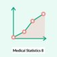
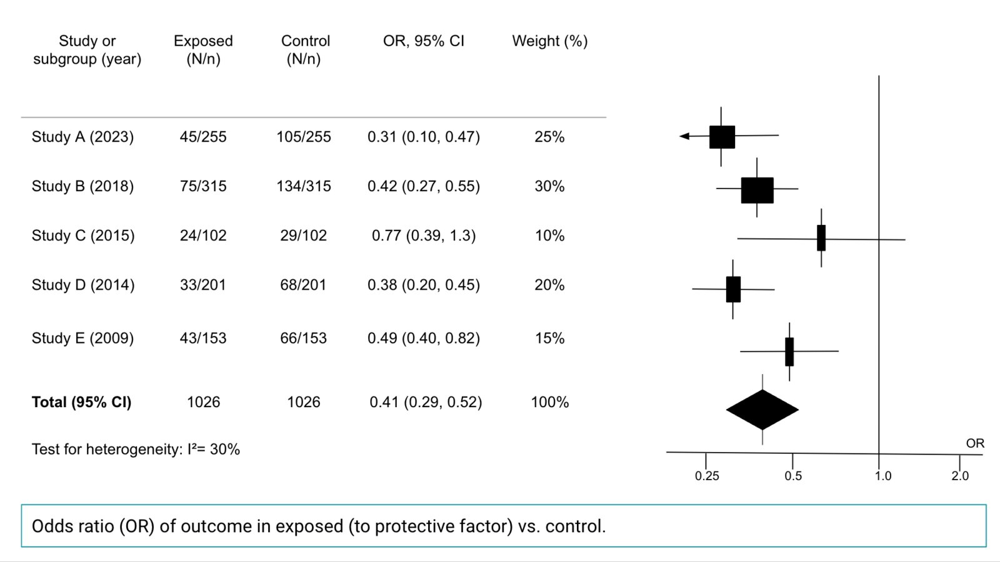
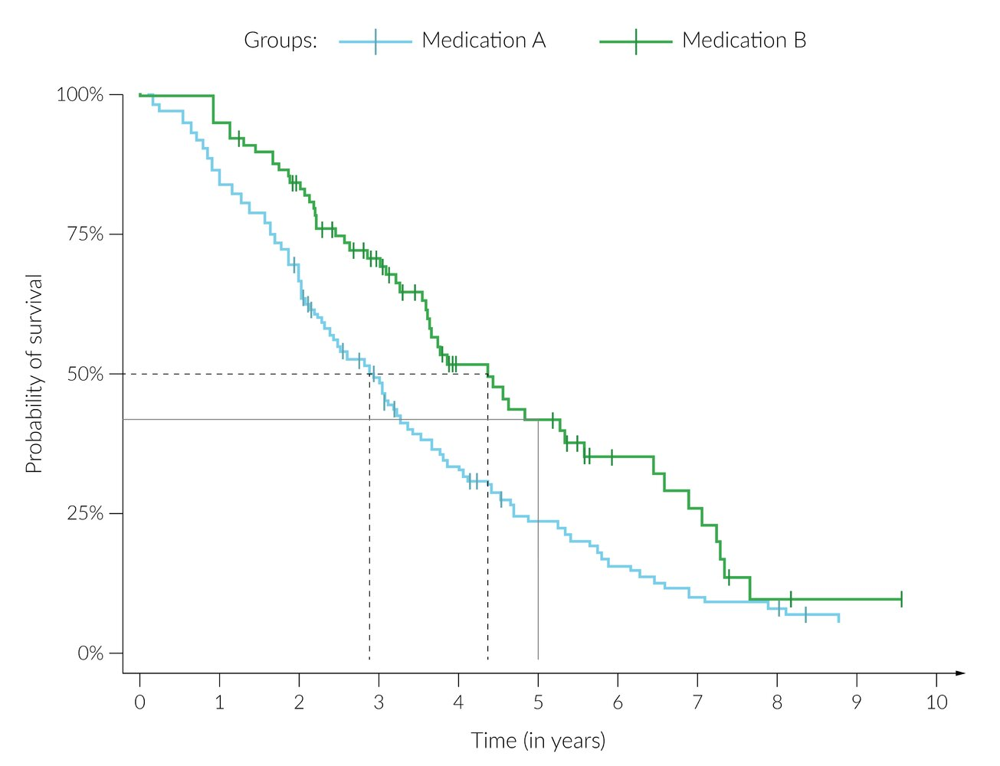

# Epidemiology

*Categories: Clinical knowledge > Epidemiology and biostatistics > Epidemiology*

[Original Article Link](https://coursology-qbank.com/amboss/article/1j02zf)

---

## Summary

Classical <u>epidemiology</u> is the study of the distribution and determinants of disease in populations. <u>Clinical epidemiology</u> applies the principles of classical <u>epidemiology</u> to the prevention, detection, and treatment of disease in a clinical setting. The two main <u>types of epidemiological studies</u> are observational and experimental. Descriptive <u>observational studies</u> (e.g. <u>case series</u>, <u>ecological studies</u>) characterize factors related to individuals with a particular outcome. <u>Analytical studies</u> (e.g., <u>cohort studies</u>, <u>case-control studies</u>) seek to assess the association between exposures and outcomes. In <u>experimental studies</u> (e.g., <u>randomized controlled trials</u>), an intervention is performed to study its impact on a particular outcome. Measures such as <u>proportions</u>, rates, and <u>ratios</u> can be calculated for the data collected. An association between two variables (i.e., exposure and outcome) does not necessarily imply a causal relationship. Other reasons for observed associations in epidemiological studies may include errors (e.g., <u>random error</u>, <u>systematic errors</u>), <u>confounding</u>, and <u>reverse causality</u>.

The following concepts are discussed separately: <u>measures of disease frequency</u> (e.g., <u>incidence</u>, <u>prevalence</u>, <u>mortality rates</u>), <u>measures of association</u> (e.g., <u>relative risk</u>, <u>absolute risk reduction</u>), measures used in the <u>evaluation of diagnostic research studies</u> (e.g., <u>sensitivity</u>, <u>specificity</u>), <u>precision</u> and <u>validity</u>, <u>critical appraisal</u>, the practice of <u>evidence-based medicine</u>, and foundational statistical concepts (e.g., <u>measures of central tendency</u>, <u>measures of dispersion</u>, <u>normal distribution</u>, <u>confidence intervals</u>).

See also “<u>Interpreting medical evidence</u>,” “<u>Statistical analysis of data</u>,” and “<u>Population health</u>.”

---

## Fundamental concepts in epidemiology

### Disciplines

* Classical epidemiology: the study of the determinants and distribution of disease in populations   [[1]](https://coursology-qbank.com/amboss/article/0Nbe-F)[[2]](https://coursology-qbank.com/amboss/article/1pY2oJ)

* Clinical epidemiology: the application of the principles of classical <u>epidemiology</u> to patients in a clinical setting

### Goals of research [[3]](https://coursology-qbank.com/amboss/article/hZ1cY20)

* Descriptive research: to summarize characteristics of a group

* Predictive research: to forecast outcomes (e.g., for prevention, diagnosis, or management)

* Explanatory research or causal inference: to establish causal mechanisms

### Elements of epidemiological studies

See also “<u>Types of epidemiological studies</u>” and “<u>Statistical analysis of data</u>.”

* Population (epidemiology): the total number of people in the group being studied [[4]](https://coursology-qbank.com/amboss/article/ckYa56)

* Sample (epidemiology): a group of people selected from a larger population; meant to be representative of the larger population

* Data (epidemiology): information collected during observation and/or experimentation that is used as a basis for analysis and discussion [[5]](https://coursology-qbank.com/amboss/article/aNbQ-F)

* Exposure: a factor that is potentially associated with a particular outcome

* Intervention: a treatment, drug, or management step that is being studied in an <u>experimental study</u>

* Outcome: an <u>endpoint</u> (e.g., a disease or health-related event) that may occur after exposure to a <u>risk factor</u> or intervention.

* Latency period

* A period of apparent inactivity between stimulation (e.g., infection with a <u>pathogen</u>, exposure to a toxin, onset of a disease process, administration of a drug) and response (e.g., signs and symptoms, pharmacological effects).  [[6]](https://coursology-qbank.com/amboss/article/IaWYNP0)

* In clinical studies, the <u>latency period</u> must be considered to ensure adequately long follow-up duration.  [[7]](https://coursology-qbank.com/amboss/article/qaWClP0)

> [!NOTE]
> Research questions can be formulated using the <u>PICO criteria</u>: Population, Intervention, Comparison (or Control group), and Outcome

### Study participants

* Study group: a group of participants with a common feature that distinguishes them from other participants in the study.

* In a clinical trial, participants are divided into a group that receives a particular intervention and a group that does not receive the intervention.

* In a <u>cohort study</u>, participants are divided into a group that has had a particular exposure and a group that has not had the exposure.

* In a <u>case-control study</u>, participants are divided into a group that has a particular outcome and a group that does not have the outcome.

* Control group (definition varies by study type)

* In a clinical trial, the <u>control group</u> is the people in the sample that do not receive the intervention (e.g., a drug), while the treatment group is the people in the sample that do receive the intervention.

* In a <u>case-control study</u>, the <u>control group</u> is the people who do not have the outcome being studied (e.g., a disease); the <u>control group</u> is compared to the cases, i.e. the people who have the outcome.

### Basic data parameters [[2]](https://coursology-qbank.com/amboss/article/1pY2oJ)

These basic measures are often used to describe or compare findings from epidemiological studies. See also “<u>Measures of disease frequency</u>”, “<u>Measures of association</u>”, and “<u>Evaluation of diagnostic research studies</u>.”

* Proportion

* Comparison of one part of the population to the whole

* <u>Proportions</u> are usually expressed as percentages.

* Rate (epidemiology) 

* A measure of the frequency of an event in a population over a specific period of time

* Rates are usually reported as numbers of cases per 1,000 or 100,000 in a given time unit.

* Types

* Crude rate: applies to the entire population (specific characteristics are not taken into account)

* Specific rate: applied to a population group with specific characteristics (e.g., sex-specific, age-specific)

* Standardized rate (<u>adjusted rate</u>): <u>crude rates</u> that have been adjusted for potential <u>confounding</u> characteristics to allow for comparison between different populations (e.g., age-<u>standardized rates</u> are commonly used for <u>death</u> rates)

* Ratios

* Comparison of two values or the magnitude of two quantities

* <u>Ratios</u> are usually expressed as X:Y or X per Y.

* The numerator and denominator do not necessarily need to be related (e.g., a <u>ratio</u> comparing the number of hospitals in a city and the size of the population living in that city).

### Elements describing <u>population health</u>

See “<u>Population health</u>” for the following:

* Population pyramids

* <u>Demographic transition</u>

* <u>Endemic</u>, <u>epidemic</u>, and <u>pandemic</u> diseases

* <u>Measures of disease frequency</u> (e.g., <u>incidence</u>, <u>prevalence</u>, <u>mortality rates</u>)

---

## Observational studies

### Descriptive studies

* No intervention involved

* Patients are observed and the clinical course of the disease is studied.

* The observations are used to form a hypothesis.

|  Overview of descriptive studies   |  |  |  |  |
| --- | --- | --- | --- | --- |
|  | Case report |  Case series report [[9]](https://coursology-qbank.com/amboss/article/lyXv200)  |  Ecological study (correlation study)[[10]](https://coursology-qbank.com/amboss/article/rNbfc8)  |  Cross-sectional study (<u>prevalence study</u>) [[11]](https://coursology-qbank.com/amboss/article/INbYc8)  |
| Description |  * A report of a disease presentation, treatment, and outcome in a single subject or event   |  * A report of a disease course or response to treatment that is compiled by aggregating several similar patient cases   |   * A study that assesses links between an exposure and an outcome  * Typically used if the outcome being studied is rare    |   * A study that determines the <u>prevalence</u> of exposure and disease at a specific point in time  * Can be either descriptive or analytical    |
| Study method |  * An unusual or unique finding in a single subject is described in detail.   |   * Researchers assess aggregated data of similar patient cases.  * Typically, all of the patients have received the same intervention.  * There is no <u>control group</u>.    |   * Researchers assess aggregated data, where at least one variable (e.g., an outcome) is at a group level and not at an individual level.  * The unit of observation is a large population (e.g., an entire country)    |   * The <u>prevalence</u> of exposure (e.g. <u>risk factors</u>) and outcome (e.g. disease) are measured simultaneously at a particular point in time (a “snapshot” of the population).  * Can reveal an association between <u>risk factors</u> and disease in a population  * Can be used for the <u>evaluation of diagnostic tests</u>    |
| Disadvantages |   * Lack of <u>generalizability</u>  * <u>Selection bias</u>    |  |   * Ecological fallacy: making inferences about an individual in a group based on the characteristics of that group  * Cannot control for <u>confounding</u> variables    |  * Cannot directly measure <u>incidence</u> or risk   |
|  * Cannot assess causality   |  |  |  |  |
| Example |  * Examining a single case of <u>cervical cancer</u> in a 25-year-old female individual   |  * Collecting and examining several cases of <u>pericarditis</u> at a local hospital   |   * Determining the <u>incidence</u> of <u>cholera</u> deaths in different parts of a city to identify the source of exposure  * Assessing the association between gross domestic product and cancer <u>incidence</u> across multiple countries    |  * Investigating the number of patients with both <u>coronary heart disease</u> and <u>hypertension</u> in the year 1998   |

Medical Statistics - Part 8: Study Types in Medical Research

### Analytical studies

#### <u>Cross-sectional study</u>

* Can be analytical, e.g., when used to assess the association between an exposure and an outcome

* See “<u>Cross-sectional study</u>.”

#### Case-control study [[2]](https://coursology-qbank.com/amboss/article/1pY2oJ)

* Aim: : to study if an exposure (i.e., a <u>risk factor</u>) is associated with an outcome (i.e., disease)

* Study method 

* Researchers begin by selecting patients with the disease (cases) and individuals without the disease (controls).

* Controls are selected from the same source population and ideally have similar characteristics (e.g., <u>gender</u>, age) to the cases to reduce potential <u>confounding</u>.

* The <u>odds ratio</u> is then determined between these groups.

* Advantages

* Helps determine whether individuals with a disease are more likely to have been exposed to a <u>risk factor</u> than patients without that disease.

* Cost-efficient (exposure and outcome are measured only once)

* Can be used to study rare diseases

* Can be used to study diseases with long latency periods

* Disadvantages

* Recall and/or <u>survivorship bias</u> occurs in retrospective studies.

* Cannot be used to determine <u>prevalence</u> or <u>incidence</u>

* Example: A group of patients with histologically confirmed <u>cervical cancer</u> (cases) is compared to otherwise similar patients without histologically confirmed <u>cervical cancer</u> (controls) for the presence of <u>human papillomavirus</u> (exposure).

> [!TIP]
> A <u>case-control study</u> generally examines a small population group over a short period of time (less cost-intensive) and evaluates the association between multiple exposures and one outcome. A <u>cohort study</u> generally examines a large population over a long period of time (more cost-intensive) and determines how one exposure is associated with multiple outcomes.

#### Cohort study [[2]](https://coursology-qbank.com/amboss/article/1pY2oJ)

* Aim: to study the <u>incidence rate</u> and whether a given exposure is associated with the outcome of interest

* Study method

* The researchers gather a group of study participants who have common characteristics.

* Participants are then classified into two groups: exposed and unexposed.

* The <u>incidence</u> of the outcome of interest is compared between the two groups.

| Types of cohort studies |  |  |
| --- | --- | --- |
|  | <u>Prospective cohort study</u> | <u>Retrospective cohort study</u> |
| Description | Study begins before the groups develop an outcome of interest | Study begins after the exposure and outcome of interest have already occurred |
| Exposure | Study participants are categorized into an exposed group and an unexposed group. | Study participants are categorized into a group that was previously exposed to a given <u>risk factor</u> (exposed; e.g., smoking) and a group that was not (unexposed). |
| Exposure of interest has to be present prior to outcome of interest. |  |  |
| Outcome | The participants are followed prospectively for a period of time to see whether there is a difference in the rate at which the exposed and unexposed groups develop the outcome of interest. | Data previously collected about the participants is compared to see whether there was a difference in the rate at which the exposed and unexposed groups developed the outcome of interest (e.g., <u>lung cancer</u>) over a period of time. |
| Example | Individuals with a smoking history of ≥ 1 pack of cigarettes a day (exposed group) are compared to individuals who are nonsmokers to see if there is a difference in the <u>proportion</u> of patients in each group that develop <u>lung cancer</u> (e.g., the outcome) within a specific follow-up period. | Individuals with a smoking history of ≥ 1 pack of cigarettes a day (exposed group) 5 years ago are compared to individuals who were nonsmokers 5 years ago to see if there is a difference in the <u>proportion</u> of patients in each group that eventually developed <u>lung cancer</u> (outcome) within a specific follow-up period. |
| Measurements must be taken at a minimum of two points in time. |  |  |

* Advantages

* Helps determine whether a given exposure plays a role in the development of a disease

* Allows for the calculation of <u>relative risk</u> (see “<u>Measures of association</u>” below)

* Helps determine <u>incidence</u>

* Can be used for rare exposures

* Disadvantages

* <u>Prospective cohort studies</u> are high-cost and time-consuming

* Only assesses the exposures determined at the beginning of the study

* In <u>retrospective cohort studies</u>, some data on predictors and <u>confounders</u> may be missing because the data was collected in the past.

* Require a large study population

> [!TIP]
> In <u>cohort studies</u>, the study sample is selected based on exposure to a <u>risk factor</u>. In <u>case-control studies</u>, the study sample is selected according to having a disease or not, and then it is determined which participants were exposed to a <u>risk factor</u>.

#### Community survey [[12]](https://coursology-qbank.com/amboss/article/QGcu_d0)[[13]](https://coursology-qbank.com/amboss/article/jGc__d0)

* Description: a <u>study design</u> in which self-reported data is collected from a large cohort

* Method

* Researchers identify a study question and compose a study form to gather relevant data

* A sample of study participants is selected from the general population (can be random or nonrandom).

* Data are gathered from study participants either via interviewing or filling in a pre-designed form.

* The data are then analyzed with the appropriate statistical methods.

* Advantages

* Requires fewer resources than other study designs

* Requires a relatively small amount of time to complete

* Can cover a large number of study participants (easy to get a representative sample)

* Disadvantages

* Response rate is hard to control.

* All data are subjectively reported by study participants and therefore may be imprecise.

#### Twin concordance study

* Aim: to determine the influence of genetic and environmental <u>risk factors</u> on the development of a disease

* Study method: comparing the frequency of a disease in twins (<u>monozygotic</u> or dizygotic)

* Example: The <u>probability</u> of twins both being diagnosed with <u>Hodgkin disease</u> is compared among <u>monozygotic</u> and <u>dizygotic twin</u> pairs. If the <u>probability</u> is higher among <u>monozygotic twin</u> pairs than <u>dizygotic twin</u> pairs, genetic factors are likely involved.

#### Adoption study

* Aim: to determine the influence of genetic and environmental <u>risk factors</u> on the development of a disease

* Study method

* The frequency of disease is compared between adopted children whose biological parents have the disease and adopted children whose biological parents do not have the disease [[14]](https://coursology-qbank.com/amboss/article/k3cmiX0)

* Among adoptees with a disease, the frequency of the disease is compared among <u>birth</u> and adoptive parents.

* Example: Two groups of adults that were adopted are studied. Individuals in the first group have a biological parent with <u>schizophrenia</u> (exposure), and individuals in the second group have biological parents without <u>schizophrenia</u>. The <u>prevalence</u> of <u>schizophrenia</u> (outcome) is compared between the two groups; if the <u>prevalence</u> is higher in children of parents with <u>schizophrenia</u>, genetic factors are likely involved.

### Registry study

* Aim: a retrospective study to analyze data obtained from patient registries

* Study method

* A registry contains data on patients who have something in common (e.g., a <u>lung cancer</u> registry contains demographic and clinical information about patients diagnosed with <u>lung cancer</u>).

* A good quality registry has complete data on the population, including data on potential <u>confounding</u> factors.

---

## Experimental studies

An <u>experimental study</u> is one in which the researcher manipulates one or more <u>independent variables</u> to see how the changes affect one or more outcomes (<u>dependent variables</u>). <u>Experimental studies</u> can be divided into those that occur in clinical settings (e.g., <u>randomized controlled trials</u>) and those that occur in community settings (e.g., <u>field trials</u> and <u>community trials</u>).

### Randomized controlled trials (<u>RCTs</u>) [[15]](https://coursology-qbank.com/amboss/article/VyXGV00)

* Aim: : to determine the possible effect of a specific intervention on a given population

* Advantages

* Minimizes <u>bias</u>

* Can demonstrate causality

* Disadvantages

* Cannot be used to evaluate rare diseases

* Cannot be used when treatments have well-known adverse side effects

* Expensive and time-consuming

* Results may not be applicable to “real world” settings, and may not be generalizable to other populations.

> [!TIP]
> <u>Randomized controlled trials</u> are considered the <u>gold standard</u> for testing interventions.

#### <u>RCT</u> design elements

* Enrollment: Study participants should be selected according to predefined inclusion and exclusion criteria.

* Intervention group: a group of study participants that receive the studied intervention.

* <u>Control group</u>: a group of study participants that are compared to the intervention group and do not receive the studied intervention. [[16]](https://coursology-qbank.com/amboss/article/H8cKLV0)

* Placebo-controlled trial: <u>Control group</u> participants receive a <u>placebo</u>.

* Study designs in which control subjects receive a treatment used in standard practice: 

* Superiority trials: aim to prove that the studied intervention is better than an existing intervention

* Equivalence trials: aim to prove that the studied intervention is as effective or has nearly the same <u>effectiveness</u> as an existing intervention

* Noninferiority trials: aim to prove that the studied intervention is not inferior to an existing intervention  [[17]](https://coursology-qbank.com/amboss/article/A2bR4G)[[18]](https://coursology-qbank.com/amboss/article/03ceSX0)

* Randomization

* The act of randomly assigning study participants into either the intervention group or the <u>control group</u> to reduce <u>selection bias</u> and <u>confounding bias</u> in clinical trials.

* The absence of a significant difference between the intervention group and the <u>control group</u> in certain <u>baseline characteristics</u> (e.g., age, <u>gender</u>, disease severity) suggests effective <u>randomization</u>.

* Allocation concealment:

* A procedure that ensures that the person who performs <u>randomization</u> remains unaware of which participants are allocated to which groups.

* Examples of <u>allocation concealment</u> methods include the following sequentially numbered sealed envelopes and central <u>randomization</u> (e.g., telephone or internet-based).

* Blinding: the practice of not informing an individual or group about which study participants are part of the <u>control group</u> and which are part of the treatment group (used to reduce <u>bias</u>) 

* Single-blind study: Study participants do not know whether they are part of the control or treatment group.

* Double-blind study: Neither the researchers nor the study participants know which study participants are part of the <u>control group</u> and which are part of the treatment group. Double <u>blinding</u> is the <u>gold standard</u> when studying treatment outcomes. [[19]](https://coursology-qbank.com/amboss/article/7Mb4J8)

* Triple-blind study: Neither the researchers, the study participants, nor the data analysts know which study participants are part of the <u>control group</u> and which are part of the treatment group.

* Unblinding

* In blinded clinical trials, <u>unblinding</u> is the intentional revelation to investigators and/or research subjects of participant allocation into either the intervention or <u>control group</u>.

* May take place after completion of the trial or because of specific circumstances (e.g., <u>pregnancy</u>, <u>adverse events</u> that affect safety)

#### <u>RCT</u> variants based on the <u>study design</u> [[20]](https://coursology-qbank.com/amboss/article/aE1Q8i0)[[21]](https://coursology-qbank.com/amboss/article/Sw1yRQ0)

##### Parallel group design

* Definition: an <u>experimental study</u> design in which participants remain within their assigned groups for the entire duration of the study

* <u>Parallel group design</u> is the most commonly used <u>RCT</u> variant.

* Advantages

* Relatively simple and easy to implement

* Suitable for studying irreversible or long-lasting effects

##### Crossover design

* Definition: an <u>experimental study</u> design in which each participant switches from the intervention group to the <u>control group</u> or vice versa with a <u>washout period</u> in between

* The order in which the participant is assigned to the intervention group or <u>control group</u> is typically <u>randomized</u>.

* Advantages

* Low risk of <u>confounding bias</u> because participants serve as their own controls

* High <u>statistical power</u> because the sample size is doubled with the same number of participants

* High recruitment rates because each participant knows they will receive some treatment during the trial

* Disadvantages

* Increased dropout rates because of the long duration of the study

* Cannot be performed if the intervention has a long-lasting effect because the effects of one phase can persist into the next (<u>carryover effect</u>)

##### Factorial design

* Definition: an <u>experimental study</u> design in which multiple interventions are studied simultaneously by assigning participants to various combinations of interventions and <u>placebo</u>

* Advantages

* Can investigate a high number of interventions simultaneously

* Can identify potential interactions between interventions (e.g., synergistic effects of drug combinations)

* Disadvantages

* <u>Interim data analysis</u> and safety monitoring can be complicated.

* Participant recruitment and protocol adherence are more demanding.

##### Cluster design

* Definition: an <u>experimental study</u> design in which the unit of <u>randomization</u> is a group rather than an individual participant

* Advantages

* Lower implementation cost and easier enrollment

* Decreases risk of contamination of intervention

* Disadvantages

* Results measure groups, which may have a similar response, rather than reflecting individual variations.

* Low <u>statistical power</u> because the units of analysis are groups, not individual participants.

* Increases risk of <u>recruitment bias</u>.

#### <u>RCT</u> variants based on the type of intervention

##### Clinical drug trials [[22]](https://coursology-qbank.com/amboss/article/UmbbU8)

* Aim: to assess the safety and <u>efficacy</u> of new medications in human subjects

* Study methods

* Early phase <u>clinical drug trials</u> focus on unblinded treatment of small numbers of individuals to assess safety.

* Later phase <u>clinical drug trials</u> focus on increasing numbers of participants to assess tolerability of different doses, <u>efficacy</u> of treatment, and side effects.

* See ”<u>Clinical trial phase</u>” in “<u>Fundamentals of pharmacology</u>.”

##### Surgical and medical device trials [[23]](https://coursology-qbank.com/amboss/article/JUWsVk0)[[24]](https://coursology-qbank.com/amboss/article/IUWYek0)

* Aim: to assess the safety and <u>efficacy</u> of surgical intervention (surgical trial) or a device used for treatment or diagnostics in human subjects (medical device trial)

* Study methods

* Surgical trials can compare a surgical with a nonsurgical intervention or compare surgical techniques.

* Medical device trials are required before <u>FDA</u> approval for devices that are considered high-risk (e.g., pacemakers, <u>stents</u>, infusion pumps).

* Challenges

* Implementing a <u>placebo</u> (e.g., sham <u>surgery</u>, sham device) and double-<u>blinding</u> may not be feasible or ethical in many circumstances.

* <u>Standardization</u> of a surgical intervention is difficult to achieve because of individual variations in surgical technique.

* Participant recruitment is more difficult than with <u>clinical drug trials</u>.

#### <u>Interim analysis</u> and safety monitoring [[25]](https://coursology-qbank.com/amboss/article/rUWfek0)[[26]](https://coursology-qbank.com/amboss/article/7UW4ek0)[[27]](https://coursology-qbank.com/amboss/article/lE1vDi0)

* Every <u>experimental study</u> involving human subjects requires a monitoring plan to ensure participant safety and scientific merit.

* Data and safety monitoring board

* An independent panel of experts who periodically review the conduct and data of ongoing trials to ensure participant safety and scientific merit.

* A <u>data and safety monitoring board</u> is required for nearly all <u>phase 3 trials</u> and for phase 1 and phase 2 trials that are multicenter, blinded, or involve a high-risk intervention.

* Interim analysis

* Data analysis that occurs in an <u>experimental study</u> before all data has been collected

* The frequency and methodology of <u>interim analysis</u> should be specified in the study protocol before the start of the study.

* Serious adverse event (clinical trial): an <u>adverse event</u> during a clinical trial that is life-threatening, causes or prolongs hospitalization, or results in congenital anomalies, significant <u>morbidity</u>, or <u>death</u>

* Unexpected adverse event (clinical trial)

* An <u>adverse event</u> during a clinical trial whose nature, severity, or frequency is unknown at the start of the trial (e.g., not described in protocol-related documentation of the intervention or product labeling by the manufacturer) or unexpected given the participant's underlying diseases or <u>risk factors</u>

* Can also occur after market approval (i.e., during phase 4 trials)

* An <u>unexpected adverse event</u>, especially if it is serious, should result in temporary discontinuation of the clinical trial until the reasons for the event are determined.

* If the <u>unexpected adverse event</u> is determined to be related to the trial, it may be necessary to modify the research protocol to minimize the risk to participants (e.g., by altering the exclusion or inclusion criteria, changing the dosing, increasing the monitoring frequency).

* If it is not feasible to minimize risk to an acceptable level, the trial should be terminated.

* Discontinuing <u>experimental studies</u>

* Ongoing trials are discontinued if any of the following become evident on <u>interim analysis</u>:

* Evidence of operational futility (e.g., poor enrollment rate, higher than expected dropout rate, clearly inferior treatment <u>efficacy</u>)

* Safety concerns

* Early evidence of clear benefit

* Stopping rules

* A set of statistical criteria established before a clinical trial that specifies when the intervention should be stopped because of safety concerns from expected <u>adverse events</u>, operational futility, or early evidence of clear benefit.

* Should be specified in the study protocol

#### Analysis upon <u>RCT</u> completion

##### <u>Intention-to-treat</u> and per-protocol analyses

| Methods of analysis for randomized controlled trials |  |  |
| --- | --- | --- |
|  |  Intention-to-treat analysis [[28]](https://coursology-qbank.com/amboss/article/qyXCT00)  |  Per-protocol analysis [[29]](https://coursology-qbank.com/amboss/article/x2bEPG)[[30]](https://coursology-qbank.com/amboss/article/B2bzPG)  |
| Description |   * Study participants are analyzed according to the group to which they were originally <u>randomized</u>, regardless of whether they actually received the intervention or dropped out of the study.  * Evaluates the question of what happens when a particular treatment is prescribed    |   * Only participants who adhered to the study protocol are analyzed.  * Evaluates the question of what happens when a particular treatment is used  * As-treated analysis: Participants are evaluated based on the ultimate treatment they received, regardless of the initial group assignment. [[31]](https://coursology-qbank.com/amboss/article/xN1EWh0)    |
| Advantages |   * More reflective of the “real world,” where nonadherence and other protocol deviations occur  * Reduces the <u>probability</u> of saying the intervention has an effect when it actually does not (i.e., <u>type I error</u>)  * Helps to reduce <u>selection bias</u>  * Preserves sample size and thus preserves <u>statistical power</u>    |  * Improves the estimate of the effect of treatment under optimal conditions   |
| Disadvantages |   * Nonadherence can lead to a conservative estimate of the treatment effect.  * Analyzing nonadherent, dropout, and adherent study participants together may introduce heterogeneity.  * Susceptible to <u>type II error</u>: Including patients who did not adhere to treatment can weaken the <u>effect size</u> and make the novel treatment appear less effective than it is.    |   * Loss of <u>randomization</u> (increased <u>selection bias</u>)  * May overestimate the effects of the tested treatments (i.e., <u>type 1 error</u>)  * A significant reduction in sample size leads to decreased <u>statistical power</u>.    |

> [!NOTE]
> <u>Intention-to-treat</u> analyzes as-<u>randomized</u> (once <u>randomized</u>, always analyzed).

> [!TIP]
> Confidence in the study results increases when <u>intention-to-treat analysis</u> and <u>per-protocol analysis</u> produce the same results. [[28]](https://coursology-qbank.com/amboss/article/qyXCT00)

##### Subgroup analysis [[20]](https://coursology-qbank.com/amboss/article/aE1Q8i0)[[32]](https://coursology-qbank.com/amboss/article/wE1hBi0)

* Aim: to investigate the heterogeneity of results in a study or recognize significant discrepancies or similarities in the treatment outcome among different subgroups of patients

* Study methods

* All participants are <u>stratified</u> into subgroups, according to shared characteristics (e.g., sex), in order to compare them.

* Participants can be <u>stratified</u> before the study (prespecified analysis) or after the study (post-hoc analysis).

* To account for the <u>multiple comparisons problem</u> that arises in <u>subgroup analyses</u>, the <u>significance level</u> should be adjusted for <u>multiplicity</u>/multiple testing (see “<u>Multiple comparisons problem</u>”).

* Advantages: may show stable treatment effects over similar subgroups of patients

* Disadvantages

* <u>Post-hoc analysis</u> is only suitable for generating, not testing hypotheses.

* Increases the risk of <u>false positive</u> and <u>false negative</u> findings

* Lower <u>statistical power</u> due to a smaller number of subjects

### Other types of <u>experimental studies</u>

#### Field trials

* Aim: to determine the effect of disease prevention interventions in individuals who do not already have a disease

* Example: observation of children who did and did not receive the Salk <u>vaccine</u> for prevention of <u>poliomyelitis</u> to see whether they developed <u>paralysis</u> or <u>death</u>

#### Community trials

* Aim: similar to <u>field trials</u>, but follow communities rather than individuals

* Example: studying the <u>incidence</u> of <u>myocardial infarction</u> and <u>stroke</u> in communities who implement lifestyle changes to prevent cardiovascular disease compared to communities who do not implement such changes

---

## Other types of studies

<u>Systematic reviews</u> and <u>meta-analyses</u> are considered <u>secondary research</u> study designs as they analyze data from multiple <u>primary research</u> studies. <u>Survival analyses</u> can be performed on data from <u>prospective cohort studies</u> or <u>RCTs</u>.

### Systematic review [[2]](https://coursology-qbank.com/amboss/article/1pY2oJ)[[33]](https://coursology-qbank.com/amboss/article/imbJ28)

* Aim: to answer a defined research question

* Study method

* Researchers collect and summarize evidence from the existing literature that fits established criteria.

* Quality assessment of the study is achieved by methods such as the Preferred Reporting Items for Systematic Reviews and Meta-Analyses (PRISMA) statement (see “Tips and Links”).

* A <u>systematic review</u> may include a <u>statistical analysis</u> of the data (i.e. <u>metaanalysis</u>).

* Advantages: can improve evidence-based clinical decision-making

* Disadvantages

* Cannot correct issues with the quality of the individual studies included in the review

* Susceptible to <u>publication bias</u>

### Metaanalysis [[34]](https://coursology-qbank.com/amboss/article/Rmbl28)

* Aim: : to increase <u>statistical power</u> and achieve more precise results

* Study method

* Data from multiple studies are systematically assessed, combined, and processed with statistical methods.

* Risk-of-bias assessment (See also “<u>Systematic errors</u>”).

* <u>Bias</u> in <u>metaanalysis</u> can stem from the individual studies included in the analysis or from the methodological flaws of the <u>metaanalysis</u> itself.

* <u>Risk of bias</u> for each study included in the <u>meta-analysis</u> is assessed semiquantitatively with risk-of-<u>bias</u> scales or checklists.

* Funnel plots can be used to visually represent <u>bias</u> and <u>statistical heterogeneity</u>

* The results are often reported graphically using <u>forest plots</u>.

* Advantages: can identify similarities and/or differences between individual studies

* Disadvantages

* Unable to eliminate limiting factors particular to the study types included (variability among studies is referred to as statistical heterogeneity)

* Only as good as the individual studies used

* Susceptible to several forms of <u>bias</u> (e.g., <u>selection bias</u>, <u>publication bias</u>)

#### Forest plot

* Definition: a graph that combines the estimated results from multiple studies investigating the same question and visualizes each study's <u>effect size</u>, <u>confidence interval</u>, and calculated overall effect

* Elements

* X-axis: primary <u>outcome measure</u> (e.g., <u>relative risk</u>)

* Central vertical line on x-axis: <u>null value</u> (e.g., RR=1, ARR=0)

* First column: a list of the individual studies

* Squares: the results (i.e., point estimate) of each study

* Vertical lines: the exact point estimate

* Horizontal lines: the <u>confidence interval</u> of the result

* Area of the squares: proportional to the weight that the individual study is given in the overall <u>metaanalysis</u> (e.g., larger square due to larger sample size and/or <u>statistical power</u>)

* Diamond at the bottom of the plot: summary combining the results of all studies

* Midpoint: the point estimate of the combined result

* Width: the <u>confidence interval</u> of the combined result

Elements of a forest plot

### Survival analysis (prognosis study) [[2]](https://coursology-qbank.com/amboss/article/1pY2oJ)[[35]](https://coursology-qbank.com/amboss/article/vyXAS00)

* Aim

* To determine the average time to a given outcome identified on follow-up

* Often used to measure disease prognosis

* Analysis

* Always prospective in nature (i.e. using data from <u>cohort studies</u> or <u>RCTs</u>)

* Time-to-event analysis: Individual follow‑ups are performed from the onset of a disease to a chosen <u>endpoint</u> (e.g., <u>death</u>, development of a particular complication), or after exposure to a <u>risk factor</u> until the onset of a disease.

* Five-year survival rate: the percentage of patients with a particular disease who have survived for 5 years after the initial diagnosis

* In <u>survival analysis</u>, a <u>hazard ratio</u> is often calculated to compare outcomes among two groups.

* Disadvantages

* Censored cases: Not all participants will have the study <u>endpoint</u> during the period of observation; no prediction can be made for these participants.

* Censoring can be caused by the following:

* The study period ending before participants experience the outcome of interest

* Participant drop out

* Competing events (e.g., <u>death</u> from a different cause)

* Kaplan-Meier analysis [[35]](https://coursology-qbank.com/amboss/article/vyXAS00)[[36]](https://coursology-qbank.com/amboss/article/wyXhh00)

* Used to analyze incomplete time-to-event data and to estimate the survival of subjects over a set period of time following a certain treatment

* Ideal for estimating the survival of a cohort composed of a small number of cases

* Events of interest include <u>death</u>, treatment <u>effectiveness</u>, and recovery.

* Allows for an estimation of survival over time even if participants are studied over different time intervals (e.g., some participants drop out or are lost to follow-up)

* Data on <u>survival analysis</u> can be graphically displayed as a <u>Kaplan-Meier curve</u>.

* Kaplan-Meier curve: graphical representation of <u>Kaplan-Meier analysis</u> in a step-shaped diagram

* Allows for an estimation of the <u>probability</u> that the subject will survive up to a point in time

* The <u>horizontal axis</u> represents time.

* The vertical axis represents the estimated <u>probability</u> of survival.

* Time intervals are defined by specific events: a time interval ends when an outcome of interest occurs.

* <u>Probability</u> of survival for each time interval = number of patients for whom the event has not occurred/number of patients who are at risk

Kaplan-Meier curve

### Qualitative studies [[37]](https://coursology-qbank.com/amboss/article/DWW1n40)[[38]](https://coursology-qbank.com/amboss/article/wWWhn40)[[39]](https://coursology-qbank.com/amboss/article/-81D6i0)

* Aim

* To understand the subjective perspective of individuals on their experience of reality and the implications of these perspectives and experiences through the analysis of <u>qualitative data</u>

* Hypothesis generation

* Analysis

* Structural or thematic coding of the gathered data is used to group data and draw insights.

* No <u>statistical analysis</u> is performed.

* Data collection methods

* Observation

* Interviews

* Focus groups

* Surveys with <u>open-ended questions</u>

* Archive work and review of recorded sources (e.g., text, audio, video)

* <u>Qualitative research</u> methodologies [[40]](https://coursology-qbank.com/amboss/article/hu1cIi0)

* Grounded theory: the induction of hypotheses from systematically collected and analyzed data

* Ethnography: the study of culture and social interactions of a particular group of people

* Narrative inquiry: the study of narratives as the basic unit of describing and recording human experience

* Phenomenological hermeneutics: a study of the lived experiences and perceptions of individuals within specific contexts (e.g., cultural context, historical context)

* Action research: a research method that involves collaboration between researchers and individuals in a particular setting to solve problems

* <u>Case study</u>: the systematic investigation of a complex phenomenon within a specific context to gather insight into the phenomenon of interest

---

## Random errors, bias, and confounding

An observed association in a study does not necessarily imply causation. Other underlying causes such as <u>random error</u>, <u>bias</u>, <u>confounding</u>, and/or <u>effect modification</u> should first be excluded.

> [!WARNING]
> High degrees of <u>random errors</u>, <u>bias</u> (e.g., <u>selection bias</u>), and <u>confounding</u> limit the <u>validity</u> (i.e., <u>accuracy</u>) of a study.

### Random error [[8]](https://coursology-qbank.com/amboss/article/dNboZ8)

* Definition: an error that occurs due to chance and/or limitations of <u>precision</u>

* Solutions: can be reduced by repeated measurements and averaging over a large number of observations

* Increasing sample size during the <u>study design</u> phase (i.e., increasing <u>statistical power</u>)

* Assessing <u>statistical significance</u>, i.e., through <u>p-values</u> and <u>confidence intervals</u>, during the analysis phase

### <u>Systematic error</u> (bias)

* Definition: An error in the <u>study design</u> or the way in which the study is conducted that causes systematic deviation of findings from the true value

* Risk of bias

* The likelihood that flaws in study methodology or reporting will lead to incorrect conclusions in a study

* Evaluated as part of <u>critical appraisal</u> of a study for evidence-based decision-making or as part of a <u>metaanalysis</u> (see “<u>Risk-of-bias assessment</u>”).

#### Selection bias

* Description: The individuals in the sample group are not representative of the population from which the sample is drawn because the sampling or the treatment allocation is not random.

* Types of <u>selection bias</u> include:

* Sampling bias (<u>ascertainment bias</u>) 

* Occurs when certain individuals are more likely to be selected for a study group, resulting in a nonrandom sample

* This can lead to incorrect conclusions being drawn about the relationship between exposures and outcomes.

* Limits <u>generalizability</u>

* Types of <u>sampling bias</u>

* Nonresponse bias: Participants who do not return information during a study (i.e., nonresponders) have systematically different characteristics from those who do (e.g., some study participants do not return a call because they are feeling unwell).

* Healthy worker effect: The working population is healthier on average than the general population.

* Volunteer bias: Individuals who volunteer to participate in a study have different characteristics than the general population.

* Attrition bias

* A type of <u>nonresponse bias</u>

* Selective loss of participants to follow up

* Most commonly seen in prospective studies

* Risk that the remaining participants differ systematically from those lost to follow up

* Berkson bias: Individuals in sample groups drawn from a hospital population are more likely to be ill than individuals in the general population.

* Susceptibility bias: One disease predisposes affected individuals to another disease, and the treatment for the <u>first disease</u> is mistakenly interpreted as a predisposing factor for the <u>second disease</u>.

* Survival bias

* Also known as <u>prevalence-incidence bias</u> and <u>Neyman bias</u>

* When observed subjects have more or less severe manifestations than the standard exposed individual

* If individuals with severe disease die before the moment of observation, those with less severe disease are more likely to be observed.

* If individuals with less severe disease have a resolution of their disease before the moment of observation, those with more severe disease are more likely to be observed.

* Most commonly occurs in <u>case-control</u> and <u>cross-sectional studies</u>.

* Solutions

* In clinical trials, randomize to control for known and unknown <u>confounders</u>.

* In <u>case-control studies</u>, ensure the sample is representative of the population of interest.

* Ensure the correct reference group is chosen for comparison.

* Collect as much data on the characteristics of the participants as possible.

* Nonresponder characteristics should not be assumed. Instead, undisclosed characteristics of nonresponders should be recorded as unknown.

#### Information bias

* Description: incorrect data collection, measurement, or interpretation that leads to misclassification of groups or exposure

* Information is gathered differently between the treatment and control groups.

* Insufficient information about exposure and disease frequency among subjects

* Types of <u>information bias</u>

* Measurement <u>bias</u>: any <u>systematic error</u> that occurs when measuring the exposure or outcome

* Reporting bias: a distortion of the information from research due to the selective disclosure or suppression of information by the individuals involved in the study

* Can involve the study, design, analysis, and/or findings

* Results in underreporting or overreporting of exposure or outcome

* Interviewer bias: The interview approach distorts the responses provided by study participants, which results in researchers finding differences between groups when there are none.

* Surveillance bias: An outcome is diagnosed more frequently in a sample group than in the general population because of increased testing and monitoring.

* Can result in misleadingly high <u>incidence</u> and <u>prevalence</u> rates

* Example: <u>Endometrial cancer</u> is more frequently detected in <u>postmenopausal</u> patients exposed to <u>estrogen</u> therapy than in those not exposed to <u>estrogen</u> therapy. <u>Estrogen</u> therapy increases the risk of bleeding, leading to more frequent screening.

* Can be reduced by comparing the treatment group to an unexposed <u>control group</u> with a similar likelihood of screening

* Performance bias: differences between study groups that are related to group assignment

* Hawthorne effect

* Subjects change their behavior once they are aware that they are being observed.

* Especially relevant in psychiatric research

* This type of <u>bias</u> is difficult to eliminate.

* Procedure bias: This <u>bias</u> occurs when patients or investigators decide on the assignment of treatment and this affects the findings. The investigator may consciously or subconsciously assign particular treatments to specific types of patients (e.g., one group receives a higher quality of treatment).

* May be reduced by <u>blinding</u> , or use of a <u>cluster randomization</u> design

* Recall bias: awareness of a condition by subjects changes their recall of related <u>risk factors</u> (recall a certain exposure)

* Common in retrospective studies

* Example: After claims that the <u>MMR vaccine</u> caused <u>autism</u> became public, parents of children diagnosed with <u>autism</u> were more likely to recall the start of <u>autism</u> being soon after their child was vaccinated, as compared with parents of children who were diagnosed with <u>autism</u> prior to these claims becoming public.

* Can be reduced by decreasing time to follow-up in retrospective studies (e.g., <u>retrospective cohort studies</u> or <u>case-control studies</u>), or using data on <u>risk factors</u> that was collected prior to the occurrence of the outcome (if available)

* Misclassification bias: an error in which research subjects are classified into the wrong exposure or outcome groups, thereby distorting the observed association

* Nondifferential misclassification bias:  a <u>misclassification bias</u> in which the frequency of classification errors is similar in the groups under comparison

* Occurs when misclassification is unrelated to other variables in the study

* If the misclassified variable is dichotomous, the <u>odds ratio</u> is skewed toward the <u>null value</u>.

* If the misclassified variable is not dichotomous (i.e., more than two exposure or outcome categories), the <u>odds ratio</u> can be skewed either towards or away from the <u>null value</u>.
* Example: In a study on <u>risk factors</u> for lifetime cancer diagnosis, participants are asked if they have ever been exposed to radiation but are not asked for further clarification (e.g., what type, how recently, for how long). This leads to an incorrect conclusion about the association between radiation exposure and lifetime cancer diagnosis. Because all participants were asked the same vague question, the frequency of classification errors is similar across exposed and unexposed groups.

* Differential misclassification bias: a <u>misclassification bias</u> in which the frequency of classification errors differs between the groups under comparison

* Occurs when misclassification is related to other variables in the study

* Skews the <u>odds ratio</u> either toward or away from the <u>null value</u>

* Example: Subjects who develop a <u>rash</u> after being exposed to a chemical are more likely to remember the exposure than those who do not develop a <u>rash</u> (<u>recall bias</u>). This results in unequal misclassification of study participants into exposed and unexposed groups.

#### Allocation bias

* Definition: a systematic difference in the way that participants are assigned to treatment and control groups

* Example: assigning patients with better baseline blood pressure to the treatment group for a new <u>antihypertensive treatment</u>

* Solution: <u>randomization</u>

#### Cognitive bias

* Description: : The personal beliefs of the study participants and/or investigators influence the results of the study.

* Types of <u>cognitive bias</u>

* Response bias: Study participants do not respond truthfully or accurately because of the manner in which questions are phrased (e.g., <u>leading questions</u>) and/or because subjects interpret certain answer options to be more socially acceptable than others.

* Observer bias (experimenter-expectancy effect or Pygmalion effect): The measurement of a variable or classification of subjects is influenced by the researcher's knowledge or expectations.

* Confirmation bias: The researcher includes only those results that support their hypothesis and ignores other results.

* Placebo and nocebo effects: A <u>placebo</u> or nocebo affects study participants' preconceptions/beliefs about the outcome.

* Solutions

* Use of a <u>placebo</u>

* <u>Blinding</u>

* Prolong the time of observation to monitor long-term effects.

#### Publication bias

* Definition: type of <u>bias</u> that occurs when the findings of a study influence the decision to publish it

* Solutions

* Registration of clinical trials before any participants are enrolled

* Publishing study protocol before commencing the study

#### <u>Biases</u> specific to <u>screening tests</u>

See “<u>Evaluation of diagnostic research studies</u>” for details.

* <u>Lead-time bias</u>

* <u>Length-time bias</u>

### Confounding

* Definition

* A <u>confounder</u> is any third variable that is associated with the exposure and the outcome but is not on the causal pathway between exposure and outcome.

* A <u>confounder</u> can distort the relationship between the exposure and the outcome, leading to an incorrect estimation of the true association.

* Examples

* Exposure to coal can cause <u>lung cancer</u> in mine workers. Many miners also smoke cigarettes, which can lead to <u>lung cancer</u> as well.

* A study finds that the risk of <u>trisomy 21</u> increases with <u>birth</u> order. When the relationship between maternal age and the risk of <u>trisomy 21</u> was examined, the risk of <u>trisomy 21</u> increased greatly with maternal age. Thus, the relationship between <u>birth</u> order and risk of <u>trisomy 21</u> is confounded by maternal age.

#### Minimizing <u>confounding</u> during <u>study design</u>

Methods to reduce potential <u>confounding</u> during the <u>study design</u> phase include:

* <u>Randomization</u>

* Random allocation of study participants to treatment and control groups (e.g., in a <u>randomized controlled trial</u>)

* Helps to distribute potential known and unknown <u>confounders</u> among study groups

* <u>Crossover study</u> design: Each study participant serves as their own control, thereby reducing the influence of <u>confounding</u>.

* Restriction (epidemiology)

* Definition: a <u>study design</u> in which only individuals who meet certain criteria are included in the study sample (e.g., only male individuals with a particular disease are included in a study to avoid the influence of biological sex on the exposure and outcome)

* Disadvantages

* Limits <u>generalizability</u>

* Makes obtaining a large sample group difficult

* Matching (epidemiology)

* Definition: selection of study participants so that the distribution of variables is similar between study groups

* Can be done in two ways:

* Study participants are matched individually to participants with similar attributes (pairwise or individual matching).

* Study participants are matched in groups such that the groups have a similar frequency of variables (frequency matching).

* Commonly used in <u>case-control studies</u> to minimize <u>confounding</u>

* The matching variable should meet the criteria for a <u>confounder</u>.

* Disadvantages

* Does not completely eliminate <u>confounding</u>

* The matching factor cannot be studied as a predictor of the outcome.

* Can introduce <u>bias</u> if the variables that are matched are not actually <u>confounders</u>

* Example: In a study on the association between <u>hypertension</u> and <u>end-stage renal disease</u>, <u>obesity</u> is a potential <u>confounder</u> because it is associated with both diseases. By matching each participant with <u>hypertension</u> to a participant with a similar <u>BMI</u> who does not have <u>hypertension</u>, the potential for <u>confounding</u> by <u>obesity</u> is reduced.

#### Minimizing <u>confounding</u> during data analysis

Methods to reduce potential <u>confounding</u> during the data analysis phase include:

* Stratified analysis: : can help identify the presence of <u>confounding</u> and/or <u>effect modification</u>.

* Calculate the crude (or unadjusted) measure of association for the population (e.g., crude OR. )

* Stratify participants into subgroups according to a third variable considered to be a potential <u>confounder</u> (e.g., age, <u>gender</u>, race) to control for <u>confounding</u> effects and evaluate for <u>effect modification</u>.

* After <u>stratification</u>, new <u>measures of association</u> may be calculated:

* Stratum-specific <u>measures of association</u> (e.g., stratum-specific ORs)

* Adjusted <u>measures of association</u> (e.g., adjusted OR)

* The results of a <u>stratified analysis</u> can help to distinguish whether a variable is an <u>effect modifier</u> or <u>confounder</u>.

* <u>Standardization</u> of data: See “<u>Z-score</u>” in “<u>Statistical analysis of data</u>.”

* <u>Multiple linear regression</u> analysis

* Can control for various potential known <u>independent variables</u> when assessing the association between an exposure and an outcome

* See “<u>Regression (epidemiology)</u>” in “<u>Statistical analysis of data</u>.”

---

## Causal relationships

### Causal inference

Once other reasons for an association between two variables have been excluded, it can be evaluated whether the association is likely to be causal. The <u>Bradford-Hill criteria</u> are a list of criteria that, if met, help to establish causality in epidemiological studies.

> [!WARNING]
> Association is not the same as causation. Remember to exclude <u>random errors</u>, <u>bias</u>, and <u>confounding</u>, and evaluate for <u>effect modification</u> before evaluating <u>causal criteria</u>.

| Causal criteria (Bradford-Hill criteria) |  |  |
| --- | --- | --- |
| Criteria | Description | Example |
| Temporality |  * The outcome occurs after the exposure within an expected amount of time.   |  * <u>Surgical site infection</u> occurs after <u>incision</u> of the <u>skin</u>.   |
|  Strength of association (<u>effect size</u>) |   * A quantitative measure of the degree of relationship between two variables  * The stronger the association between an exposure and its observed outcome, the more likely there is to be a causal relationship between them.    |  * The risk of <u>lung cancer</u> is severalfold higher in cigarette smokers than nonsmokers.   |
| <u>Dose-response relationship</u> (biological gradient) |  * Greater exposure is associated with a higher occurrence of the outcome.   |  * The greater the exposure to <u>ionizing radiation</u>, the higher the risk of <u>malignancy</u>.   |
| Reproducibility (consistency) |  * Similar findings are observed in different studies (e.g., in different places, with different sample sizes).   |  * <u>Campylobacter jejuni</u> infection has been reported to precede <u>Guillain-Barré syndrome</u> in multiple countries, so infection with <u>C. jejuni</u> is likely to be a <u>risk factor</u> for <u>Guillain-Barré syndrome</u>. [[41]](https://coursology-qbank.com/amboss/article/WDcPWe0)   |
| <u>Specificity</u> |  * An association between a specific exposure and specific disease occurs in a specific population at a specific time, or an exposure leads to only one outcome.   |  * The <u>measles virus</u> only causes <u>measles</u> and not <u>flu</u>.   |
| Biologic plausibility |  * The relationship between an exposure and an outcome is consistent with current biological and medical knowledge.   |  * <u>Carcinogens</u> in cigarettes cause <u>lung cancer</u>, and water molecules do not.   |
| Coherence (epidemiology) |  * New evidence is consistent with previously established evidence.   |  * <u>Observational studies</u> showing an association between <u>cigarette smoking</u> and <u>lung cancer</u> are consistent with pathologic findings that <u>cigarette smoke</u> damages bronchial cells in vitro.   |
| Experimental evidence |  * Data drawn from <u>experimental studies</u> support the presumed causal relationship between exposure and outcome.   |  * An empirical observation of high <u>incidence</u> of <u>lung</u> disease among coal mine workers is supported by experimental data linking chronic coal exposure and the development of <u>anthracosis</u>.   |
| Analogy (epidemiology) |  * When there is strong evidence of a causal relationship between an exposure and an outcome, there is a greater likelihood of a causal relationship between another similar exposure and outcome   |  * When one class of medication is known to produce an effect, it is likely that another agent of that class produces a similar effect.   |

> [!TIP]
> To establish causation, the cause must precede the effect. A temporal relationship may be difficult to establish using <u>case-control studies</u> or <u>cross-sectional studies</u> because the possible effect (i.e., outcome) and cause (i.e., exposure) are measured at the same time.

### Reverse causality

* Definition: an association between exposure and outcome that is different than common presumption

* Example: people assume that low <u>socioeconomic status</u> causes <u>schizophrenia</u>, but in fact, <u>schizophrenia</u> causes a decline in <u>socioeconomic status</u> over time

### Complex multicausal relationships [[42]](https://coursology-qbank.com/amboss/article/M01Mg20)

Occur when a third variable influences the effect of an exposure on an outcome, leading to a different effect on the control and treatment groups. These are not considered types of <u>bias</u>, but rather biological phenomena.

* Effect modification: occurs when the level of the effect of an exposure on an outcome is different across different strata of a third variable (i.e., the exposure has a different impact in different circumstances)

* There is a true association between the exposure and the outcome.

* <u>Stratified analysis</u>: can allow better identification and understanding of <u>effect modification</u>, which reduces <u>bias</u>

* <u>Effect modification</u> can be inferred if <u>stratifying</u> participants into subgroups according to the third variable results in a stronger relationship in one subgroup.

* Examples

* A certain drug works in children but does not have any effect on adults.

* A study on <u>OCP</u> use showed an increased risk of <u>breast cancer</u>. When the population is <u>stratified</u> by smoking status, the association between <u>OCP</u> use and <u>breast cancer</u> is stronger in smokers than nonsmokers.

* Interaction: occurs when two or more interdependent exposures influence the outcome measured in a variety of ways

> [!TIP]
> <u>Effect modification</u> is not a type of error. Causal relationships can exist even if the effect of the exposure on the outcome changes across strata for another variable (e.g., age groups).

---