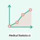
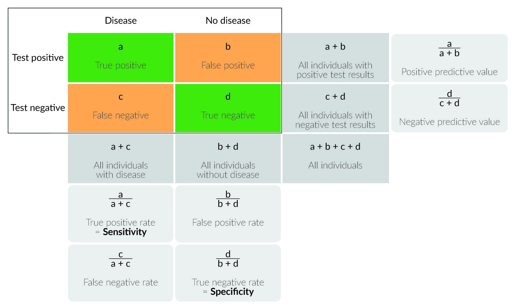
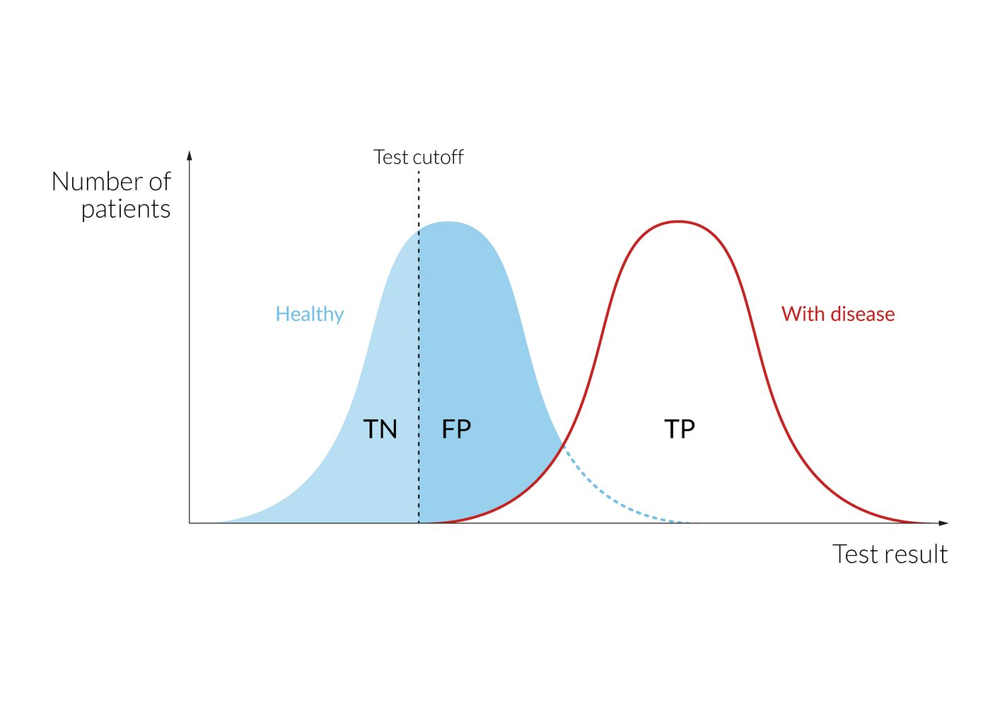
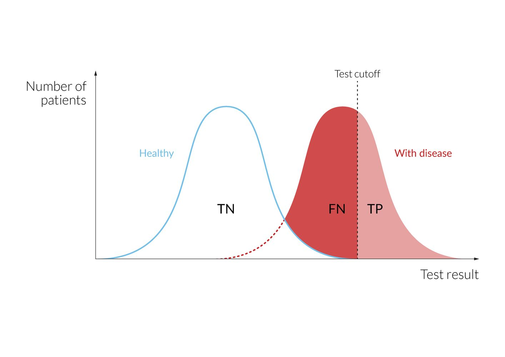
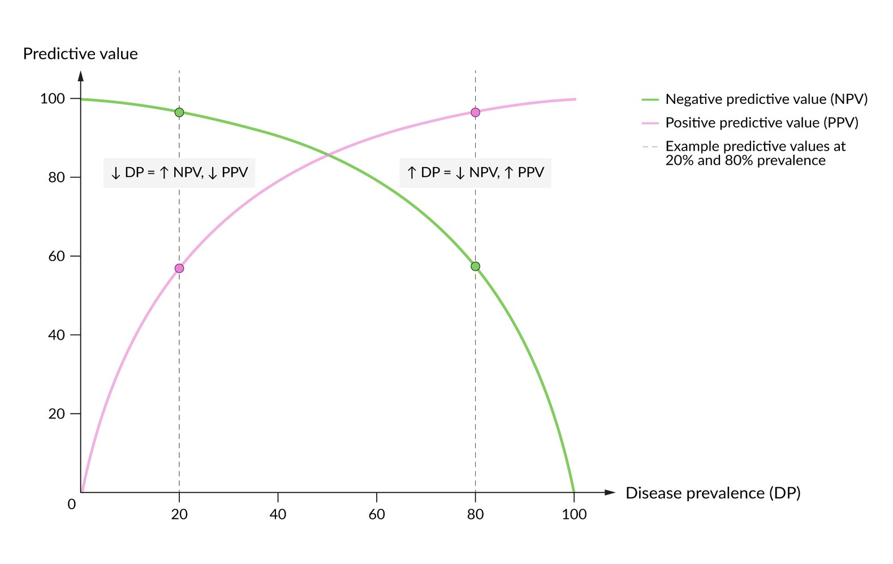
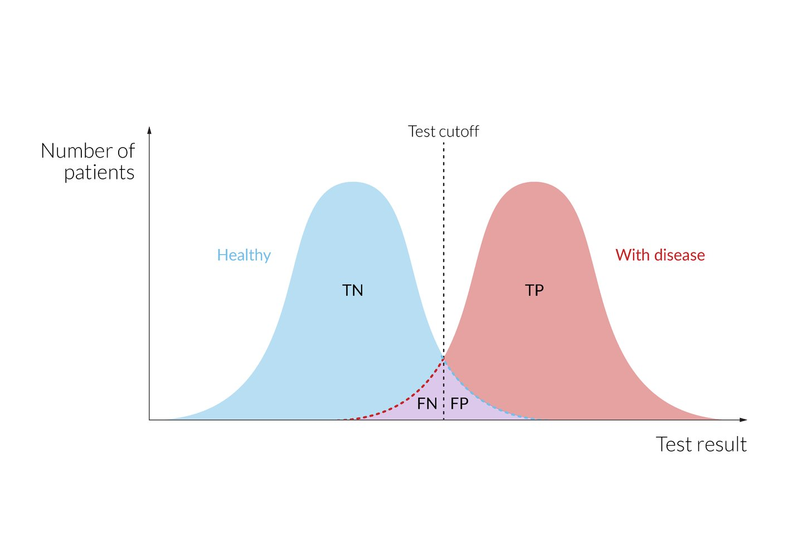
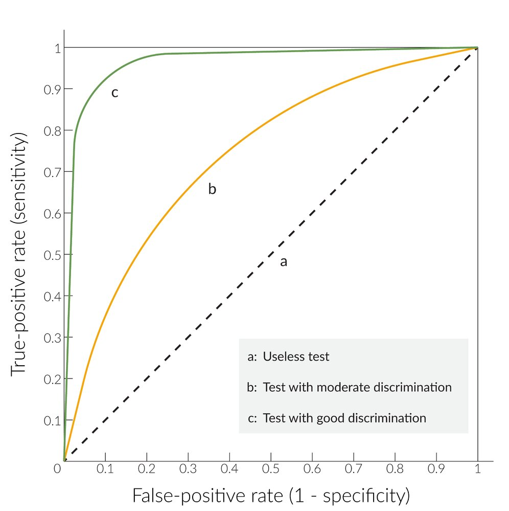
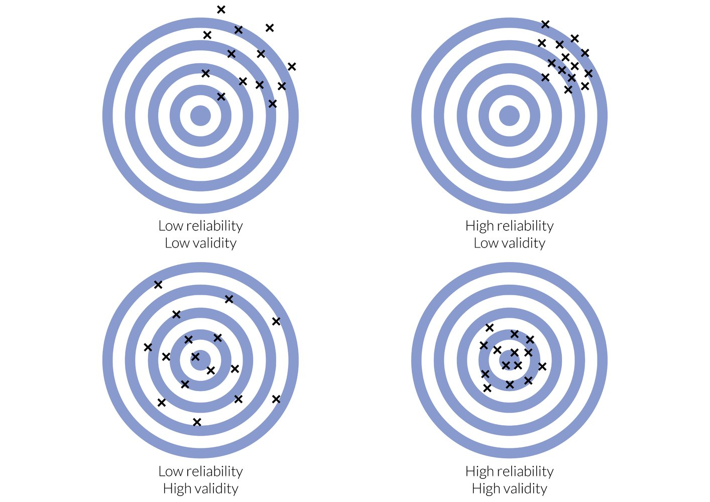

# Interpreting medical evidence

*Categories: Clinical knowledge > Epidemiology and biostatistics > Interpreting medical evidence*

[Original Article Link](https://coursology-qbank.com/amboss/article/ps0LDh)

---

## Summary

<u>Critical appraisal</u> and <u>evidence-based medicine</u> involve the practical application of <u>clinical epidemiology</u> concepts in order to guide clinical decision-making. This requires an evaluation of the quality and applicability of existing research studies to individual clinical scenarios. Appropriate interpretation of the results of a research study in the right context requires a basic understanding of the following foundational concepts (found in the “<u>Epidemiology</u>” article): <u>types of epidemiological studies</u> (e.g., <u>observational studies</u>, <u>experimental studies</u>), common study designs (e.g., <u>case series</u>, <u>cohort studies</u>, <u>case-control studies</u>, <u>randomized controlled trials</u>), <u>causal relationships in research studies</u>, and other reasons for observed associations (e.g., <u>random errors</u>, <u>systematic errors</u>, <u>confounding</u>). This article focuses on an approach to <u>critical appraisal</u>, and epidemiological concepts often encountered in studies of clinical interventions, i.e., <u>measures of association</u> (e.g., <u>relative risk</u>, <u>odds ratios</u>, <u>absolute risk reduction</u>, <u>number needed to treat</u>), measures used to evaluate screening and diagnostic test (e.g., <u>sensitivity</u>, <u>specificity</u>, <u>positive predictive value</u>, <u>negative predictive value</u>), <u>precision</u>, and <u>validity</u>.

The following concepts are discussed separately: <u>measures of disease frequency</u> (e.g., <u>incidence rates</u>, <u>prevalence</u>) commonly used in studies of <u>population health</u>, foundational statistical concepts (e.g., <u>measures of central tendency</u>, <u>measures of dispersion</u>, <u>normal distribution</u>, <u>confidence intervals</u>), and guidance on <u>conducting research projects</u>.

See also “<u>Epidemiology</u>,” “<u>Statistical analysis of data</u>,” and “<u>Population health</u>.”

---

## Measures of association

<u>Measures of association</u> can be used to quantify the strength of a relationship between two variables. See also “<u>Measures of disease frequency</u>.”

### Two-by-two table

The degree of association between exposure and disease is typically evaluated using a two-by-two table, which compares the presence/absence of disease with the history of exposure to a <u>risk factor</u>.

| <u>Two-by-two table</u> |  |  |  |
| --- | --- | --- | --- |
|  |  Disease (outcome) |  No disease (no outcome) | Total |
|  Exposure (<u>risk factor</u>) | a | b | a + b |
|  No exposure (no <u>risk factor</u>) | c | d | c + d |
| Total | a + c | b + d | a + b + c+ d |

Medical Statistics - Part 1: Calculating Percentages

Medical Statistics - Part 4: Calculating Odds

Medical Statistics - Part 6: Interpreting 2x2 Tables

### Risk

* Risk factor: a variable or attribute that increases the <u>probability</u> of developing a disease or injury  [[9]](https://coursology-qbank.com/amboss/article/lobvXu)

* Absolute risk: the likelihood of an event occurring under specific conditions [[3]](https://coursology-qbank.com/amboss/article/1pY2oJ)

* Commonly expressed as a percentage

* Equal to the <u>cumulative incidence</u>, which can be calculated as follows: <u>incidence rate</u> × the time of follow-up

* Aim: to measure the <u>probability</u> of an individual in a study population developing an outcome

* Used in: <u>cohort studies</u>

* Formula: (number of new cases)/(total individuals in a study group) = (a + c)/(a + b + c + d)

* <u>Relative risk</u>: See “Estimates of association strength.”

* <u>Attributable risk</u>: See “Estimates of population impact.”

### Formulas of common <u>measures of association</u>

* Measures that help quantify the <u>strength of association</u>

* <u>Relative risk</u> (RR): (a/(a + b))/(c/(c + d))

* <u>Odds ratio</u> (OR): (a/c)/(b/d) = ad/bc

* Measures that help quantify the impact of an association on a population

* <u>Attributable risk</u> (<u>AR</u>): a/(a + b) - c/(c + d)

* <u>Absolute risk reduction</u> (<u>ARR</u>): c/(c + d) – a/(a + b)

* <u>Relative risk reduction</u> (<u>RRR</u>): 1 - RR

* <u>Number needed to treat</u> (<u>NNT</u>): 1/<u>ARR</u>

* <u>Number needed to harm</u> (<u>NNH</u>): 1/<u>AR</u>

---

## Estimates of association strength

### Relative risk (RR; <u>risk ratio</u>) [[3]](https://coursology-qbank.com/amboss/article/1pY2oJ)[[10]](https://coursology-qbank.com/amboss/article/5mbiT8)

* Description: : the likelihood of an outcome in one group exposed to a potential <u>risk factor</u> compared to the risk in another group that has not been exposed

* Purpose

* To measure how strongly a <u>risk factor</u> is associated with an outcome (e.g., <u>death</u>, injury, disease)

* To help establish disease etiology

* Used in: : <u>cohort studies</u> and <u>randomized controlled trials</u>

* Formula: (<u>incidence</u> of disease in exposed group)/(<u>incidence</u> of disease in unexposed group) = (a/(a + b))/(c/(c + d))

* Interpretation

* RR = 1: Exposure neither increases nor decreases the risk of the defined outcome.

* RR > 1: Exposure increases the risk of the outcome.

* RR < 1: Exposure decreases the risk of the outcome.

Medical Statistics - Part 2: Calculating Relative Risk

### Odds ratio (OR) [[11]](https://coursology-qbank.com/amboss/article/Eob8du)

* Description

* Comparison of the <u>odds</u> of an event occurring in one group against the <u>odds</u> of an event occurring in another group

* Odds: the <u>probability</u> of an event occurring divided by the <u>probability</u> of this event not occurring

* Calculated using the <u>two-by-two table</u>

* Purpose: to measure the strength of an association between a <u>risk factor</u> and an outcome

* Used in: : <u>case-control studies</u>

* Formula  
* <u>Odds ratio</u> of exposure: compares the <u>odds</u> of exposure among individuals with an outcome (e.g., disease) against the <u>odds</u> of exposure among individuals without an outcome

* <u>Odds</u> of exposure in individuals with disease (i.e., case group): (exposure in individuals with disease)/(no exposure in individuals with disease) = a/c

* <u>Odds</u> of exposure in individuals without disease (i.e., <u>control group</u>): (exposure in individuals without disease)/(no exposure in individuals without disease) = b/d

* <u>Odds ratio</u>: (<u>odds</u> of exposure in individuals with disease)/(<u>odds</u> of exposure in individuals without disease) = (a/c)/(b/d) = ad/bc = (a/b)/(c/d)

* Interpretation

* OR = 1: The outcome is equally likely in exposed and unexposed individuals.

* OR > 1: The outcome is more likely to occur in exposed individuals.

* OR < 1: The outcome is less likely to occur in exposed individuals.

* Rare disease assumption

* <u>Case-control studies</u> do not track participants over time, so they cannot be used to calculate <u>relative risk</u>.

* However, the assumption can be made that if an outcome (e.g., disease <u>prevalence</u>) is rare, the <u>incidence</u> of that outcome is low and the OR is approximately the same as the RR.

Medical Statistics - Part 5: Calculating the Odds Ratio

Medical Statistics - Part 7: OR and RR in Observational Studies

### Hazard ratio (HR)

* Description: : a measure of the effect of an intervention on an outcome at any given point in time during the study period [[12]](https://coursology-qbank.com/amboss/article/Y3cnSX0)[[13]](https://coursology-qbank.com/amboss/article/93cNkX0)

* Purpose: to help determine how long it takes for an event to occur in individuals in the case group, compared to individuals in the <u>control group</u>

* Used in: <u>survival analysis</u>

* Formula: (observed number of events in exposed group / expected number of deaths in exposed group) at time (t) / (observed number of events in unexposed group/expected number of deaths in unexposed group) at time (t) [[13]](https://coursology-qbank.com/amboss/article/93cNkX0)

* Interpretation

* HR = 1: no relationship

* HR > 1: The outcome of interest is more likely to occur in exposed individuals.

* HR < 1: The outcome of interest is less likely to occur in exposed individuals.

> [!TIP]
> The RR is the risk of an event occurring by the end of the study period (i.e., cumulative risk), while the HR is the risk of an event occurring at any point in time during the study period (i.e., instantaneous risk). [[13]](https://coursology-qbank.com/amboss/article/93cNkX0)

> [!TIP]
> The RR, OR, and HR are usually displayed with a corresponding <u>p-value</u>. They are considered <u>statistically significant</u> if the <u>p-value</u> is < 0.05.

---

## Estimates of population impact

Medical Statistics - Part 3: Attributable risk and Number needed to harm

### Attributable risk (<u>AR</u>) [[14]](https://coursology-qbank.com/amboss/article/7IX4Vz)

* Description: the absolute difference between the risk of an outcome occurring in exposed individuals and unexposed individuals

* Purpose: to measure the <u>excess risk</u> of an outcome that can be attributed to the exposure

* Used in: <u>cohort studies</u>

* Formulas

* <u>Exposure AR</u>: (<u>incidence risk</u> in exposed group) - (<u>incidence risk</u> in unexposed group) = a/(a + b) - c/(c + d)

* Population AR: (<u>incidence risk</u> in the study population) - (<u>incidence risk</u> in the unexposed group) = (a + c)/(a + b + c + d) - c/(c + d)

### Attributable risk percent (ARP) [[14]](https://coursology-qbank.com/amboss/article/7IX4Vz)

* Description: the <u>proportion</u> of disease <u>incidence</u> among exposed individuals that can be attributed to the <u>risk factor</u>

* Purpose: to determine the <u>proportion</u> of cases in the exposed population that can be attributed to the <u>risk factor</u>

* Used in: <u>cohort studies</u> and <u>case-control studies</u>

* Formulas: (<u>incidence risk</u> among exposed) - (<u>incidence risk</u> among unexposed)/(<u>incidence risk</u> among exposed) x 100

* ARP = [(RR - 1)/RR] x 100

* The RR cannot be calculated for <u>case-control studies</u>, so the OR (an estimate of the RR) can be used to calculate the <u>attributable risk</u>: ARP = (OR–1)/OR x 100.

* Alternatively, ARP = <u>AR</u>/(<u>incidence</u> of disease in the exposed group) x 100 = (a/(a + b) – c/(c + d)) / (a/(a + b)) x 100

### Relative risk reduction (<u>RRR</u>)

* Description: : the <u>proportion</u> of risk in the exposure group after an intervention compared to the risk in the nonexposure group

* Purpose: to determine how much the treatment reduces the risk of negative outcomes

* Used in: <u>cohort studies</u> and <u>cross-sectional studies</u>

* Formulas

* 1 - RR

* Alternatively, <u>RRR</u> = ; ((<u>incidence risk</u>/<u>attributable risk</u> in unexposed/<u>control group</u>) - (<u>incidence risk</u>/<u>attributable risk</u> in exposed/treatment group))/(<u>incidence risk</u>/<u>attributable risk</u> of disease in the unexposed/<u>control group</u>) = (ARC - <u>ART</u>)/ARC = (c/(c + d) – a/(a + b)) / (c/(c + d));

* Example: <u>RRR</u> can be used to demonstrate <u>vaccine</u> <u>effectiveness</u> = (risk among unvaccinated – risk among vaccinated)/(risk among unvaccinated) × 100. [[10]](https://coursology-qbank.com/amboss/article/5mbiT8)

### Absolute risk reduction (<u>ARR</u>; <u>risk difference</u>)

* Description: : the difference between the risk in the exposure group after an intervention and the risk in the nonexposure group (e.g., risk of <u>death</u>)

* Purpose: to show the risk without treatment as well as the risk reduction associated with treatment

* Used in: <u>cohort studies</u>, <u>cross-sectional studies</u>, and clinical trials

* Formula: : (<u>absolute risk</u> in the unexposed group) - (<u>absolute risk</u> in the exposed group) = c/(c + d) – a/(a + b)

### Number needed to treat (<u>NNT</u>)

* Description

* The number of individuals that must be treated, in a particular time period, for one person to benefit from treatment (i.e., to not develop the disease)

* Inversely related to the <u>effectiveness</u> of a treatment

* Purpose: to compare the <u>effectiveness</u> of different treatments

* Used in: clinical trials

* Formula: : 1/<u>ARR</u>

### Number needed to harm (<u>NNH</u>)

* Description

* The number of individuals who need to be exposed to a certain <u>risk factor</u> before one person develops an outcome

* Directly correlates to the safety of the exposure

* Purpose: to determine the potential harms of an intervention

* Used in: clinical trials

* Formula: : 1/<u>AR</u>

### Number needed to screen (<u>NNS</u>)

* Description: the number of individuals who need to be screened in a particular time period in order to prevent one <u>death</u> or <u>adverse event</u> [[15]](https://coursology-qbank.com/amboss/article/O3cIiX0)

* Formula (same as <u>NNT</u>): 1/<u>ARR</u>

---

## Evaluation of screening or diagnostic tests

### Overview

* Before a diagnostic modality (e.g., laboratory study, imaging study, diagnostic criteria) can be used in clinical practice, it needs to be determined how well the modality can distinguish between individuals with the disease and individuals without the disease.

* A test is compared to the <u>gold standard test</u> using a two-by-two table.

* A two-by-two table can be used to calculate a test's <u>sensitivity</u>, <u>specificity</u>, <u>positive predictive value</u> (PPV), and <u>negative predictive value</u> (<u>NPV</u>).

|  Features of a two-by-two table summarizing screening or diagnostic test results   |  |  |  |
| --- | --- | --- | --- |
|  | Disease | No disease | Interpretation |
| Positive test result |  * True positive (<u>TP</u>)   |  * False positive (<u>FP</u>)   |   * All subjects with positive test results (<u>TP</u> + <u>FP</u>)  * PPV = <u>TP</u>/(<u>TP</u> + <u>FP</u>)    |
| Negative test result |  * False negative (<u>FN</u>)   |  * True negative (TN)   |   * All subjects with negative test results (<u>FN</u> + TN)  * <u>NPV</u> = TN/(<u>FN</u> + TN)    |
| Interpretation |   * All subjects with disease (<u>TP</u> + <u>FN</u>)  * <u>Sensitivity</u> (<u>true positive rate</u>) = <u>TP</u>/(<u>TP</u> + <u>FN</u>)  * <u>False negative rate</u> = <u>FN</u>/(<u>TP</u> + <u>FN</u>)    |   * All subjects without disease (<u>FP</u> + TN)  * <u>Specificity</u> (<u>true negative rate</u>) = TN/(<u>FP</u> + TN)  * <u>False positive rate</u> = <u>FP</u>/(<u>FP</u> + TN)    |  * All subjects (<u>TP</u> + <u>FP</u> + <u>FN</u> + TN)   |

Two-by-two contingency table

#### Example 2 x 2 table of a diagnostic test [[16]](https://coursology-qbank.com/amboss/article/fAakQM)

| Diagnostic test for <u>tuberculosis</u> (<u>TB</u>) |  |  |  |
| --- | --- | --- | --- |
|  | Patients with <u>TB</u> | Patients without <u>TB</u> | Total |
| Positive test result | 800 (<u>TP</u>) | 400 (<u>FP</u>) | 1200 (<u>TP</u> + <u>FP</u>) |
| Negative test result | 200 (<u>FN</u>) | 3600 (TN) | 3800 (<u>FN</u> + TN) |
| Total | 1000 (<u>TP</u> + <u>FN</u>)  | 4000 (<u>FP</u> + TN)  | 5000 (<u>TP</u> + <u>FP</u> + <u>FN</u> + TN) |

* Interpretation

* <u>Sensitivity</u> = <u>TP</u>/(<u>TP</u> + <u>FN</u>) = 800/(800 + 200) = 80%

* <u>Specificity</u> = TN/(<u>FP</u> + TN) = 3600/(400 + 3600) = 90%

* <u>False positive rate</u> = <u>FP</u>/(<u>FP</u> + TN) = 400/(400 + 3600) = 10%

* <u>False negative rate</u> = <u>FN</u>/(<u>TP</u> + <u>FN</u>) = 200/(800 + 200) = 20%

* PPV = <u>TP</u>/(<u>TP</u> + <u>FP</u>) = 800/(800 + 400) = 66.6 %

* <u>NPV</u> = TN/(<u>FN</u> + TN) = 3600/(200 + 3600) = 94.7%

### Pretest probability

* Description: the <u>probability</u> that a patient has a specific disease before the result of the test is known

* Features

* The <u>pretest probability</u> of a disease is determined by its <u>prevalence</u> in a particular group.

* A test subject's <u>pretest probability</u> affects <u>posttest probabilities</u> (i.e., <u>NPV</u>, PPV) but does not affect test characteristics.

* A higher <u>pretest probability</u> decreases the <u>NPV</u> and increases the PPV.

* A lower <u>pretest probability</u> increases the <u>NPV</u> and decreases the PPV.

* Relation between <u>pretest probability</u> and <u>odds</u>

* <u>Pretest probability</u> = pretest <u>odds</u> /(pretest <u>odds</u> + 1)

* Pretest <u>odds</u> = <u>pretest probability</u> /(1 - <u>pretest probability</u>)

### Test characteristics

* Description

* The intrinsic properties of a test that do not change based on <u>pretest probability</u>

* Test characteristics include <u>sensitivity</u>, <u>specificity</u>, <u>false positive rate</u>, <u>false negative rate</u>, <u>positive likelihood ratio</u>, and <u>negative likelihood ratio</u>.

#### <u>Sensitivity</u> and <u>specificity</u>

| Overview of sensitivity and specificity of screening and diagnostic tests |  |  |
| --- | --- | --- |
|  | Sensitivity (<u>true positive rate</u>) | Specificity (<u>true negative rate</u>) |
| Description |  * The <u>proportion</u> of individuals with the disease who actually test positive, i.e., P(positive test|disease) when expressed as a <u>conditional probability</u>.   |  * The <u>proportion</u> of individuals without the disease who actually test negative, i.e., P(negative test|no disease) when expressed as a <u>conditional probability</u>.   |
| Features |   * A test with high <u>sensitivity</u> yields a low <u>false negative rate</u>.  * Tests with high <u>sensitivity</u> are often used for screening purposes.    |   * A test with high <u>specificity</u> yields a low <u>false positive rate</u>.  * Tests with high <u>specificity</u> can be used to confirm the diagnosis following a positive <u>screening test</u>.    |

> [!TIP]
> A highly sensitive test can rule out a disease if negative, and a highly specific test can rule in a disease if positive.

Cutoff value of a highly sensitive test

Cutoff value of a highly specific test

#### Test efficiency

* Description: the percentage of times that the test gives the correct answer compared to the total number of tests

* Formula: <u>Test efficiency</u> = (<u>TP</u> + TN)/(<u>TP</u> + <u>FN</u> + <u>FP</u> + TN) x 100
* T = true, F = false, P = positive, N = negative

#### Likelihood ratio [[16]](https://coursology-qbank.com/amboss/article/fAakQM)[[17]](https://coursology-qbank.com/amboss/article/R91lMQ0)

* Description

* A measure used to determine the utility of a diagnostic test in clinical practice

* Represents the <u>probability</u> of a test result in someone with the disease over the <u>probability</u> of the test result in someone without the disease

* Interpretation

* Reflects how much more likely a disease is in a person with a given test result compared to their <u>pretest probability</u>

* A <u>likelihood ratio</u> > 1 is associated with the presence of a disease.

* A <u>likelihood ratio</u> < 1 is associated with absence of a disease.

* If the <u>likelihood ratio</u> is 1, the <u>posttest probability</u> is similar to the <u>pretest probability</u>, and therefore the test has poor clinical utility.

* <u>Likelihood ratio</u> x pretest <u>odds</u> = posttest <u>odds</u> [[16]](https://coursology-qbank.com/amboss/article/fAakQM)[[17]](https://coursology-qbank.com/amboss/article/R91lMQ0)

* A nomogram can also be used to convert <u>pretest probability</u> to <u>posttest probability</u> using <u>likelihood ratios</u>.

* Types

* Positive likelihood ratio (<u>LR+</u>)

* <u>Ratio</u> of the <u>sensitivity</u> rate (<u>true positive rate</u>) to the <u>false positive rate</u>

* <u>LR+</u> =  (<u>TP rate</u>)/(<u>FP rate</u>) =  <u>sensitivity</u>/(1 - <u>specificity</u>)

* A <u>LR+</u> > 10 indicates that the test is excellent at ruling in (confirming) a disease.

* Negative likelihood ratio (<u>LR-</u>)

* <u>Ratio</u> between the <u>false negative rate</u> and the <u>specificity</u> (<u>true negative rate</u>)

* <u>LR-</u> = (<u>FN</u> rate)/(<u>TN rate</u>) = (1 - <u>sensitivity</u>)/<u>specificity</u>

* A <u>LR-</u> < 0.1 indicates that the test is excellent at ruling out (screening for) a disease.

> [!TIP]
> When comparing diagnostic tests with similar <u>sensitivity</u> or tests with similar <u>specificity</u>, <u>likelihood ratios</u> are used to determine the relative clinical utility.

### Posttest probability (predictive value) [[17]](https://coursology-qbank.com/amboss/article/R91lMQ0)[[18]](https://coursology-qbank.com/amboss/article/r5bfl8)

* Description: the <u>probability</u> that a patient has a particular disease after a diagnostic test is carried out, i.e., P(disease status|test result) when expressed as a <u>conditional probability</u>.

* Features

* Combines <u>pretest probability</u> (e.g., based on disease <u>prevalence</u>) and test characteristics (e.g., <u>sensitivity</u>, <u>specificity</u>, <u>likelihood ratios</u>) to quantify the likelihood of a patient having a disease

* Can be determined using formulas or nomograms

* PPV, 1 - PPV, <u>NPV</u>, and 1 - <u>NPV</u> are <u>posttest probabilities</u>.

* Relation between <u>posttest probability</u> and <u>odds</u>

* <u>Posttest probability</u> = posttest <u>odds</u> /(posttest <u>odds</u> + 1)

* Posttest <u>odds</u> = <u>posttest probability</u> /(1 – <u>posttest probability</u>)

#### Positive predictive value (PPV)

* Description: the <u>proportion</u> of individuals who test positive for a disease who actually have the disease, i.e., P(disease|positive test) when expressed as a <u>conditional probability</u>

* Features

* Directly correlates with <u>pretest probability</u>

* The PPV increases with increasing <u>prevalence</u> of a disease in the population. [[19]](https://coursology-qbank.com/amboss/article/75b4l8)

* Formula

* PPV = <u>TP</u>/(<u>TP</u> + <u>FP</u>) (see “<u>Overview of sensitivity and specificity of screening and diagnostic tests</u>”)

* The <u>probability</u> that an individual who tested positive actually does not have the disease, i.e., P(no disease|positive test) = 1 - PPV

* PPV can also be calculated using test characteristics and <u>pretest probability</u> or pretest <u>odds</u> of the disease. [[20]](https://coursology-qbank.com/amboss/article/P91WnQ0)

* PPV = <u>sensitivity</u> / [<u>sensitivity</u> + ((1 - <u>specificity</u>) / pretest <u>odds</u>)]

* Alternatively, PPV = <u>LR+</u> / [<u>LR+</u> + (1/pretest <u>odds</u>)]

#### Negative predictive value (<u>NPV</u>)

* Description: the <u>proportion</u> of individuals who test negative for a disease who actually do not have the disease, i.e., P(no disease|negative test) when expressed as a <u>conditional probability</u>

* Features

* <u>NPV</u> inversely correlates with <u>pretest probability</u>.

* <u>NPV</u> decreases with increasing <u>prevalence</u> of the disease.

* Formula

* <u>NPV</u> = TN/(<u>FN</u> + TN) (see “<u>Overview of sensitivity and specificity of screening and diagnostic tests</u>”)

* The <u>probability</u> that an individual who tested negative actually has the disease, i.e., P(disease|negative test) = 1 - <u>NPV</u>

* <u>NPV</u> can also be calculated using test characteristics and <u>pretest probability</u> or pretest <u>odds</u> of the disease. [[20]](https://coursology-qbank.com/amboss/article/P91WnQ0)

* <u>NPV</u> = <u>specificity</u> / [<u>specificity</u> + ((1 - <u>sensitivity</u>) x pretest <u>odds</u>)]

* Alternatively, <u>NPV</u> = <u>LR-</u> / [1 + (<u>LR-</u> x pretest <u>odds</u>)]

> [!TIP]
> Unlike <u>sensitivity</u> and <u>specificity</u>, which are determined solely by the diagnostic test itself, predictive values are also influenced by disease <u>prevalence</u>.

Effect of prevalence on post-test probabilities

### Cutoff values

* Definition: values used in diagnostic and <u>screening tests</u> to categorize results into positive and negative

* Positive: meets the threshold for diagnosis

* Negative: does not meet the threshold for diagnosis

* Interpretation: The effects of raising or lowering a cutoff value depends on whether the test’s original cutoff is high (e.g., <u>tumor marker</u> for cancer, <u>lipase</u> for <u>pancreatitis</u>) or low (e.g., serum <u>sodium</u> levels for <u>hyponatremia</u>, <u>leukocyte count</u> for <u>agranulocytosis</u>). Characteristics such as <u>sensitivity</u>, <u>specificity</u>, and the number of true and <u>false positives</u> and negatives are all affected.

* In tests with a high cutoff value:

* Lowering the cutoff (i.e., broadening the inclusion criteria): ↓ <u>specificity</u>, ↑ <u>sensitivity</u>, ↓ PPV, ↑ <u>NPV</u>, ↑ <u>FP</u>, ↑ <u>TP</u>, ↓ <u>FN</u>, ↓ TN

* Raising the cutoff (i.e., narrowing the inclusion criteria): ↑ <u>specificity</u>, ↓ <u>sensitivity</u>, ↑ PPV, ↓ <u>NPV</u> ↓ <u>FP</u>, ↓ <u>TP</u>, ↑ <u>FN</u>, ↑ TN

* In tests with a low cutoff value:

* Lowering the cutoff (i.e., narrowing the inclusion criteria): ↑ <u>specificity</u>, ↓ <u>sensitivity</u>, ↑ PPV, ↓ <u>NPV</u>, ↓ <u>FP</u>, ↓ <u>TP</u>, ↑ <u>FN</u>, ↑ TN

* Raising the cutoff (i.e., broadening the inclusion criteria): ↓ <u>specificity</u>, ↑ <u>sensitivity</u>, ↓ PPV, ↑ <u>NPV</u>, ↑ <u>FP</u>, ↑ <u>TP</u>, ↓ <u>FN</u>, ↓ TN

Cutoff value of an optimal screening test

Cutoff value of a highly sensitive test

Cutoff value of a highly specific test

### Receiver operating characteristic curve (<u>ROC curve</u>)   [[16]](https://coursology-qbank.com/amboss/article/fAakQM)[[21]](https://coursology-qbank.com/amboss/article/s5btl8)

* Description: a graph that compares the <u>sensitivity</u> and <u>specificity</u> of a diagnostic test

* Features

* Every diagnostic test generally involves a tradeoff between <u>sensitivity</u> and <u>specificity</u>.

* <u>Sensitivity</u> and <u>specificity</u> are inversely proportional, meaning that as the <u>sensitivity</u> increases, the <u>specificity</u> decreases, and vice versa.

* The ROC shows the tradeoff between clinical <u>sensitivity</u> and <u>specificity</u> for every possible cutoff value, to evaluate the ability of the test to correctly diagnose subjects

* The y-axis represents the <u>sensitivity</u> (i.e., <u>true positive rate</u>) and the x-axis corresponds to 1 - <u>specificity</u> (i.e., the <u>false positive rate</u>).

* A test is considered more accurate the more closely the curve follows the y-axis.

* A test is considered less accurate if the curve is closer to the diagonal.

* The area under the ROC curve (<u>AUROC</u>) can also be used for test comparison; the larger the <u>AUROC</u>, the more clinically useful the test. [[22]](https://coursology-qbank.com/amboss/article/S01y220)

* <u>AUROC</u> close to 1.0 indicates that the test has high combined <u>sensitivity</u> and <u>specificity</u>.

* <u>AUROC</u> close to 0.5 indicates poor discriminative ability.

* <u>Cutoff values</u>

* Normal ROC

* Low cutoff value: low <u>sensitivity</u> (high <u>FP</u>) and high <u>specificity</u> (low <u>FN</u>)

* High cutoff value: high <u>sensitivity</u> (low <u>FP</u>) and low <u>specificity</u> (high <u>FN</u>)

* Inverse ROC

* Low cutoff value: high <u>sensitivity</u> (low <u>FP</u>) and low <u>specificity</u> (high <u>FN</u>)

* High cutoff value: low <u>sensitivity</u> (high <u>FP</u>) and high <u>specificity</u> (low <u>FN</u>)

Receiver operating characteristic (ROC) curve

### Screening tests

* Used to identify disease in asymptomatic individuals (e.g., <u>mammogram</u> for <u>breast cancer</u>, <u>Pap smear</u> for <u>cervical cancer</u>)

* Should have a low <u>LR-</u> and a high <u>sensitivity</u>

|  Potential bias in studies evaluating screening tests  |  |  |
| --- | --- | --- |
|  | Lead-time bias | Length-time bias |
| Description |   * A type of <u>bias</u> in which survival time is overestimated because of early diagnosis through screening and does not reflect an actual delay in mortality  * Lead time: the length of time between the initial detection of disease and the expected outcome (i.e., <u>death</u> or onset of clinical symptoms)  * <u>Lead-time bias</u> occurs when survival times are chosen as an <u>endpoint</u> of screening trials.    |  * A type of <u>bias</u> in which survival time is overestimated because <u>screening tests</u> have a higher <u>probability</u> of detecting slowly progressive cases, which have a longer asymptomatic phase and better prognosis than rapidly progressive cases.   |
| Example |  * A <u>CT scan</u> detects a <u>malignant tumor</u> earlier than a conventional <u>x-ray</u>. However, early treatment does not improve survival. Therefore, any apparent advantage in 5-year survival rates of patients diagnosed via <u>CT scan</u> in comparison to those diagnosed using <u>x-ray</u> is the result of <u>lead-time bias</u>.   |  * Slow-growing tumors are typically less aggressive than fast-growing tumors and remain asymptomatic for a longer period of time. Therefore, the <u>proportion</u> of slow-growing tumors is overrepresented in <u>screening tests</u>. Because patients with slowly progressive disease have longer survival than those with fast-growing tumors, the benefits of screening are overestimated.   |
| Solutions |  * <u>Mortality rates</u> rather than survival times are the <u>gold standard</u> for evaluating <u>screening tests</u>.   |  * Use a <u>randomized controlled trial</u> to allocate subjects into screening and control groups.   |

### Confirmatory tests

* Confirms disease in individuals with signs or symptoms of the disease (e.g., <u>biopsy</u> for <u>breast cancer</u> or <u>cervical cancer</u>)

* Usually performed after a screening test to confirm a diagnosis

* Should have a high <u>LR+</u> and a high <u>specificity</u>

Medical Statistics - Part 6: Interpreting 2x2 Tables

---

## Precision and validity

### Precision (reliability) [[3]](https://coursology-qbank.com/amboss/article/1pY2oJ)[[23]](https://coursology-qbank.com/amboss/article/VyXGV00)

* Definition: the <u>reproducibility</u> of test results on the same sample under similar conditions

* Features

* A test with a high <u>precision</u> will have minimal <u>random error</u>.

* <u>Precision</u> improves with decreased <u>standard deviation</u> and increased power of a statistical test.

* Methods of estimating <u>precision</u>

* Interrater reliability: the extent to which a test yields the same results when performed by different researchers

* Parallel test reliability: the extent to which two tests measuring the same concepts with different items or questions yield the same results when repeated on the same subjects

* Test-retest reliability: the extent to which a test yields the same results when repeated on the same subjects

### Validity (<u>accuracy</u>) [[3]](https://coursology-qbank.com/amboss/article/1pY2oJ)

* Definition: the correspondence between test results and what the test was developed to measure

* Features

* A test with high <u>validity</u> will have minimal <u>systematic error</u> and <u>bias</u>.

* <u>Sensitivity</u> and <u>specificity</u> are measures of <u>validity</u>.

* Types

* Internal validity

* The extent to which a study is free of error (most often in the form of <u>bias</u>) and the results are therefore true for the study sample

* High <u>internal validity</u> can be achieved by:

* Controlling for age, sex, and other characteristics

* Refining measurement instruments to reduce <u>systematic errors</u> (<u>bias</u>) to a minimum

* External validity

* The extent to which study results can be extrapolated from a sample population to the general population (<u>generalizability</u>)

* A study with high <u>external validity</u> has the following characteristics:

* The study results can be reproduced in different sample groups.

* High <u>internal validity</u>

Reliability and validity

---