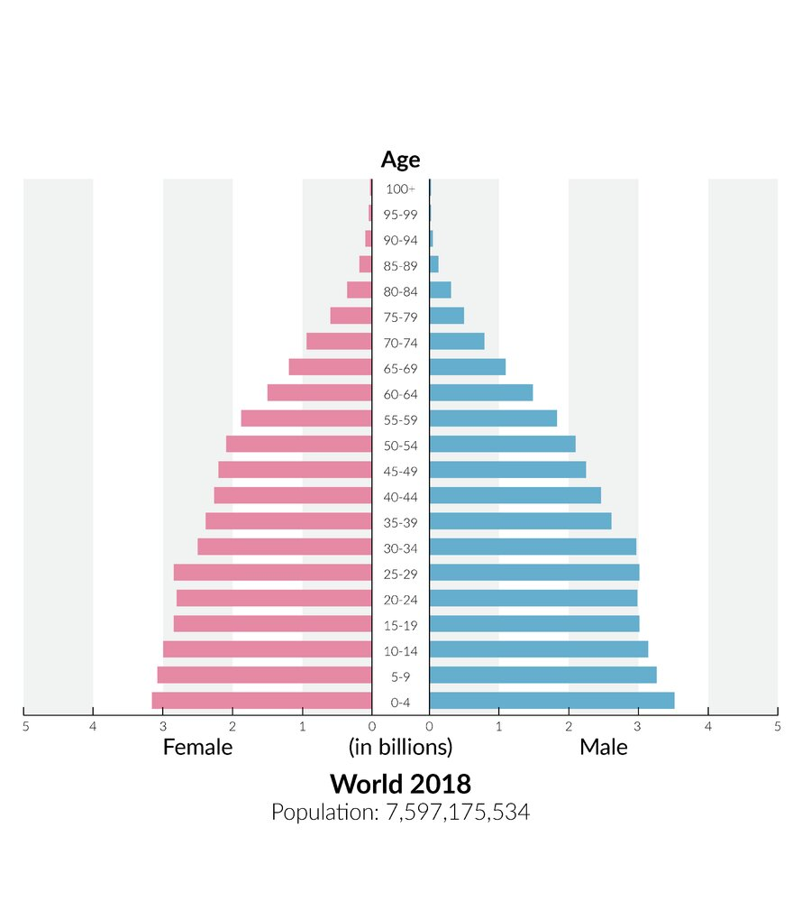
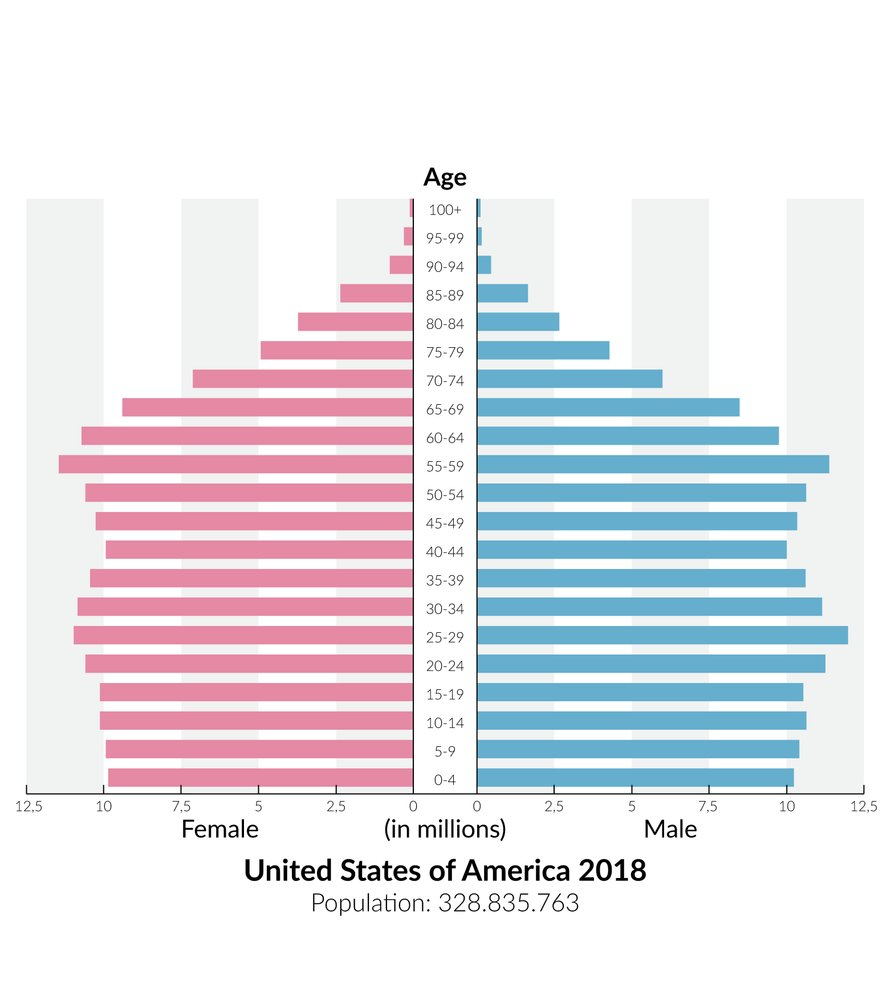
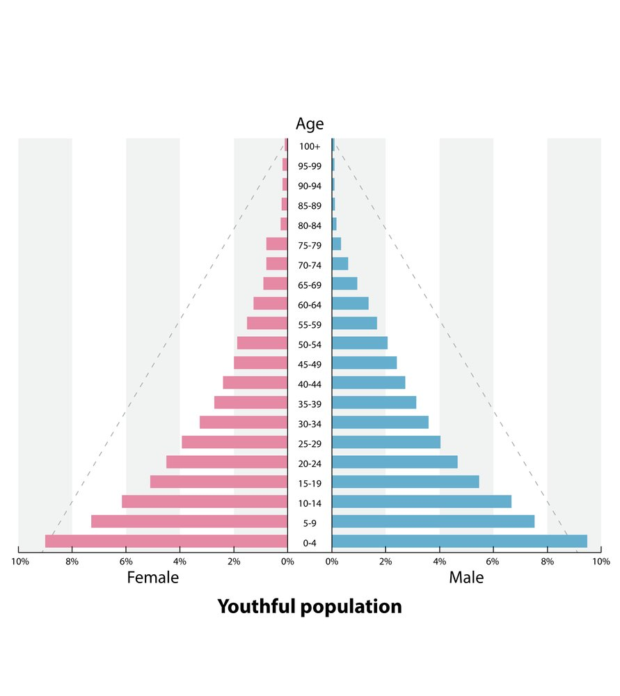
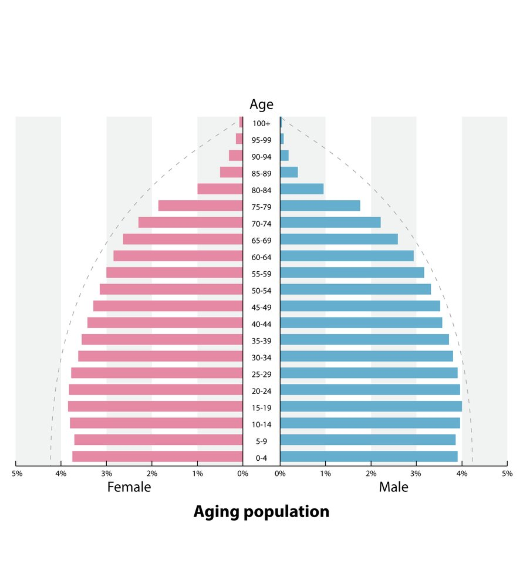
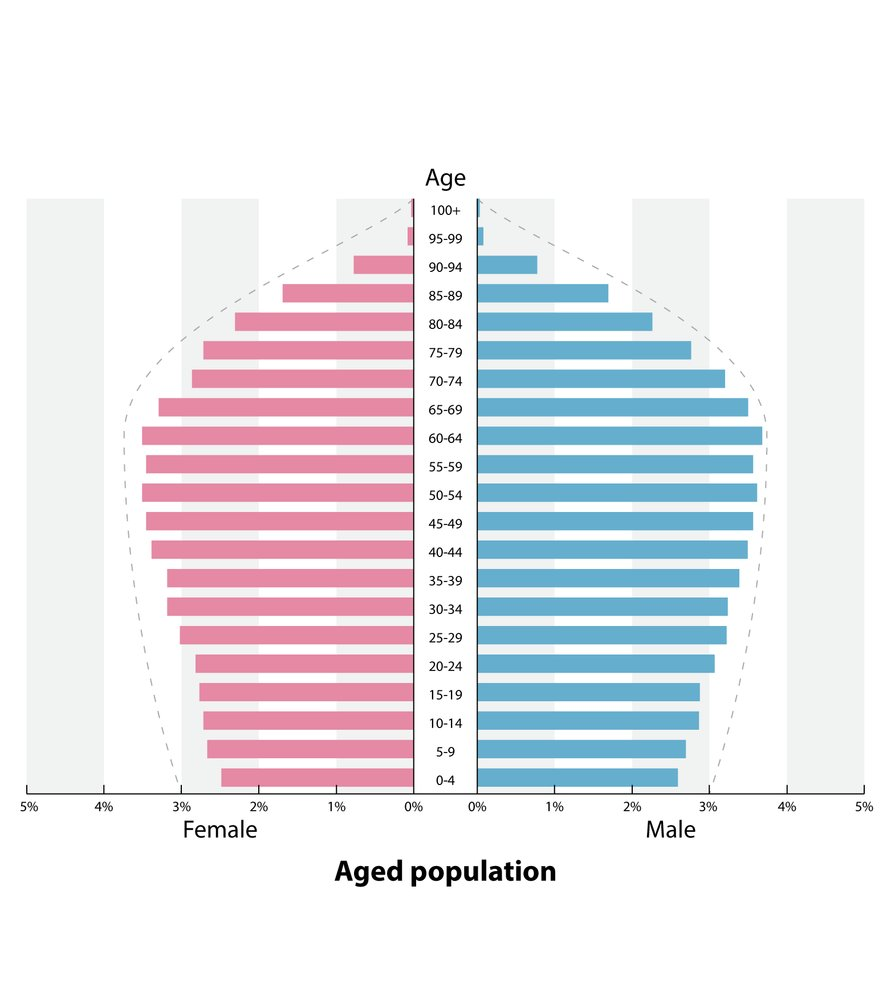

# Population health

*Categories: Clinical knowledge > Epidemiology and biostatistics > Population health*

[Original Article Link](https://coursology-qbank.com/amboss/article/Js0sDh)

---

## Summary

The study of population health is mostly rooted in <u>classical epidemiology</u>, which focuses on the distribution and determinants of disease in populations. Population health studies have a wide range of applications that include guiding <u>public health</u> policy and interventions, evaluating the importance and potential impact of <u>PICO questions</u> for clinical research, and informing clinical practice (e.g., using <u>prevalence</u> measures to estimate the <u>pretest probability</u> of a disease). The most common <u>types of epidemiological studies</u> used in population health are <u>observational studies</u>. These can be <u>descriptive studies</u> (e.g., <u>ecological studies</u>), <u>analytical studies</u> (e.g., <u>cohort studies</u>), and studies that can be both observational and analytical (e.g., <u>cross-sectional studies</u>). They typically seek to identify populations with particular outcomes and assess the association between potential exposures and these outcomes. This article focuses on basic concepts of population health (e.g., population pyramids, and <u>endemic</u>, <u>epidemic</u>, or <u>pandemic</u> diseases) and <u>measures of disease frequency</u>, e.g., <u>incidence</u>, <u>prevalence</u>, <u>birth rates</u>, <u>mortality rates</u>, <u>case-fatality rates</u>, <u>morbidity</u>, and <u>disease burden</u>.

The following concepts are discussed separately: <u>causal relationships in research studies</u>, other reasons for observed associations (e.g., <u>random errors</u>, <u>systematic errors</u>, <u>confounding</u>), <u>measures of association</u> commonly encountered in studies of clinical interventions (e.g., <u>relative risk</u>, <u>absolute risk reduction</u>), measures used in the <u>evaluation of diagnostic research studies</u> (e.g., <u>sensitivity</u>, <u>specificity</u>), <u>precision</u> and <u>validity</u>, and foundational statistical concepts (e.g., <u>measures of central tendency</u>, <u>measures of dispersion</u>, <u>normal distribution</u>, <u>confidence intervals</u>).

See also “<u>Epidemiology</u>,” “<u>Statistical analysis of data</u>,” and “<u>Interpreting medical evidence</u>.”

---

## Elements describing population health

### Population pyramid

Definition: a graphical representation of age and sex distribution in a population  [[2]](https://coursology-qbank.com/amboss/article/p3cLjX0)

| Overview of population pyramids |  |  |  |
| --- | --- | --- | --- |
|  | Expansive pyramid | Stationary pyramid | Constrictive pyramid |
| Population |  * Growing (e.g., rapid growth)   |  * Stable (e.g., slow population growth)   |  * Declining (e.g., zero population growth)   |
| Age distribution |  * Higher percentage of young people   |  * Remains constant over time   |  * Higher percentage of older people   |
| <u>Life expectancy</u> |  * Low   |  * Increasing   |  * High   |
| <u>Birth rate</u> |  * Very high   |  * Low   |  * Very low   |
| <u>Mortality rate</u> |  * High   |  * Low   |  * Low   |

Population pyramid of the world

Population pyramid USA

Expansive population pyramid

Stationary population pyramid

Constrictive population pyramid

### Demographic transition

* Definition: changes that occur in a population that goes from having high <u>birth rates</u> and high <u>death</u> rates to having low <u>birth rates</u> and low <u>death</u> rates [[2]](https://coursology-qbank.com/amboss/article/p3cLjX0)

* Demographic Transition Model: describes, in stages, the evolving relationship between <u>birth</u> and <u>death</u> rates in a population over time  [[2]](https://coursology-qbank.com/amboss/article/p3cLjX0)

* Stage I: high <u>birth rates</u> and high <u>death</u> rates (low or no population growth)

* Stage II: high <u>birth rates</u> and decreasing <u>death</u> rates (high population growth)

* Stage III: decreasing <u>birth rates</u> and low <u>death</u> rates (slowed population growth)

* Stage IV: low <u>birth rates</u> and low <u>death</u> rates (low or no population growth)

> [!TIP]
> The goal of healthy demographic transitions is to lower <u>death</u> rates, lower <u>birth rates</u>, and ensure a healthy <u>aging</u> population.

### <u>Endemic</u>, <u>epidemic</u>, and <u>pandemic</u> diseases

Diseases can be classified according to their pattern of occurrence across time and geographic area.

| Types of diseases |  |  |  |
| --- | --- | --- | --- |
|  | Endemic | Epidemic | Pandemic |
|  Definition [[3]](https://coursology-qbank.com/amboss/article/0Nbe-F) |  * A disease that affects individuals at a relatively constant rate within a specific population in a given region   |  * A disease that affects individuals at a rapid rate within a specific population in a given region   |  * A disease that affects a wide geographic area, e.g., multiple countries or continents   |
| Time |  * Unlimited   |  * Limited   |  * Limited   |
| Area |  * Limited   |  * Limited   |  * Unlimited   |
| Examples |   * <u>Malaria</u> in parts of Africa  * <u>Yellow fever</u> in parts of South America and Africa    |   * <u>Ebola fever</u> in West Africa (2014)  * Seasonal <u>influenza</u>    |   * Spanish <u>flu</u> (1918/19)  * <u>COVID-19</u>    |
| Possible contributing factors |   * Spread of disease <u>vectors</u> and <u>pathogen</u> reservoirs  * Geographical conditions  * Climate  * Living conditions (e.g., sewage systems, housing, work)    |   * Infectivity of a <u>pathogen</u>: increased ability to multiply in a host  * Living conditions (e.g., living in crowded areas)  * Spread/introduction of the <u>pathogen</u> to a new geographical area    |   * <u>Global</u> trade and travel  * Increased <u>infectivity</u> of a <u>pathogen</u> (e.g., <u>antigenic shift</u>)    |

---

## Measures of disease frequency

### Overview

* <u>Measures of disease frequency</u> can be used to: [[4]](https://coursology-qbank.com/amboss/article/KNbUX8)

* Quantify mortality and/or <u>morbidity</u> (i.e., <u>incidence</u> and <u>prevalence</u> of disease)

* Describe population characteristics (e.g., at-risk populations, <u>life expectancy</u>)

* Determine the association between two factors (e.g., exposure and disease)

* Data is systematically collected and analyzed and then used for planning, implementing, and evaluating <u>public health</u> practices (i.e., <u>public health surveillance</u>), in order to:

* Detect changes in health behavior, health issues, and identify potential <u>outbreaks</u> and <u>epidemics</u>

* Estimate the magnitude of a health issue (e.g., disease or <u>risk factor</u>), measure trends, and characterize a disease

* Identify individuals with infectious diseases or exposures to environmental agents and their contacts

* Determine the <u>effectiveness</u> of control measures and <u>public health</u> programs

* Develop future research hypotheses

### <u>Incidence</u> and <u>prevalence</u>

#### Incidence

* Description: number of new cases [[5]](https://coursology-qbank.com/amboss/article/1pY2oJ)

* Population at risk: the group of people that are at risk of developing the condition being studied (individuals at risk cannot have the condition at the time the study period starts)

* Incidence study

* Used to determine the <u>incidence</u> of a particular event in a population during a certain time period (usually a year). If the event in consideration is <u>death</u>, the study is called a mortality study.

* Usually performed as a <u>cohort study</u> to compare the <u>incidence</u> of an event (e.g., disease) between two groups

| Measures of <u>incidence</u> |  |  |
| --- | --- | --- |
|  | Incidence rate | Cumulative incidence |
| Description |   * The number of new cases of a disease per unit of person-time  * <u>Incidence rate</u> is a useful measurement if the population at risk changes over time (e.g., because of study dropouts) or when comparing groups with different follow-up periods.    |   * The <u>proportion</u> of new cases of disease in a previously disease-free population over a defined period of time  * Measures risk of disease (using the same calculation as <u>absolute risk</u>)  * In the setting of disease <u>outbreaks</u>, <u>cumulative incidence</u> is referred to as <u>attack rate</u>: the <u>proportion</u> of people who become ill in relation to the total number of people exposed.    |
| Formula |   * Number of new cases/person-time units  * Person-time units (denominator)  * Describes the total time that the population was at risk  * Person-time = time each person was observed, totaled for all persons = number of people observed × mean duration of observation  * The time units can be in days, months, years, etc.    |  * Number of new cases in a specific time period/number of people in a given population at risk   |
| Example |  * Individuals in a community are followed for 130,000 <u>person-years</u> of observation. 12 people develop <u>lung cancer</u> during that time. The <u>incidence rate</u> of <u>lung cancer</u> in that community would be 12 per 130,000 <u>person-years</u> (or 9 per 100,000 <u>person-years</u>)   |  * Individuals in a community with a population of 150,000 are followed for 10 years. 12 people develop <u>lung cancer</u> during that time. The <u>cumulative incidence</u> of <u>lung cancer</u> in that community would be 12 per 150,000 individuals (or 8 per 100,000 individuals) over 10 years.   |

#### Prevalence

* Description: number of current (i.e., new and preexisting) cases

* The <u>proportion</u> of all people with a disease to the total number of people in a population at a particular point in time or time period

* Corresponds to disease frequency (how common a disease is)

* Reflects the <u>pretest probability</u> of a disease

* Correlates directly with the <u>positive predictive value</u> and inversely with the <u>negative predictive value</u> (see “<u>Evaluation of diagnostic tests</u>” below)

* Formula: total number of cases/total population during a specific time

* The time period can be:

* A specific point in time (<u>point prevalence</u>), e.g., a day

* A specific period of observation (<u>period prevalence</u>), e.g., during <u>puberty</u>

* For example, if a survey conducted in 2020 in a town with a population of 120,000 reveals that 451 people have <u>lung cancer</u>, the <u>prevalence</u> of <u>lung cancer</u> in that town would be 451 per 120,000, which would be expressed as 375.8 per 100,000.

* Prevalence ratio [[6]](https://coursology-qbank.com/amboss/article/GTWBHk0)

* Description: The <u>ratio</u> of the <u>prevalence</u> of a condition in one population (P1) to the <u>prevalence</u> of the same condition in another population (<u>P2</u>)

* Formula: P1/<u>P2</u> (<u>prevalence</u> of population 1/<u>prevalence</u> of population 2)

* Interpretation

* <u>Prevalence ratio</u> > 1.0: The condition is more prevalent in P1 than in <u>P2</u>.

* <u>Prevalence ratio</u> < 1.0: The condition is more prevalent in <u>P2</u> than in P1.

* A <u>prevalence ratio</u> of 1 indicates that the <u>prevalence</u> is the same in both populations.

#### Relationship between <u>prevalence</u> and <u>incidence</u>

* Formulas

* <u>Prevalence</u> = (<u>incidence</u>) × (average duration of disease)

* If the population is in a <u>steady state</u>, the relationship between <u>incidence rate</u> (IR), <u>prevalence</u> (P), and the average duration of the disease (T) can be described mathematically as follows: 

* P/(1 - P) = IR × T
OR

* IR = (P/(1 - P))/T

* If the disease is extremely rare, P ≈ IR × T

* Number of new cases per unit time = IR × (population at risk)

* Distribution

* Chronic disease: <u>prevalence</u> is usually greater than <u>incidence</u>

* Acute disease: <u>prevalence</u> and <u>incidence</u> are usually similar

* Reasons for changes in <u>prevalence</u> and <u>incidence</u>

* Increased <u>prevalence</u> with stable <u>incidence</u>

* Increased survival (e.g., improved quality of health care)

* Prolonged duration of the disease

* Decreased <u>prevalence</u> with stable <u>incidence</u>

* Increased mortality

* Decreased recovery time

* Introduction of new effective treatment

* Increased <u>prevalence</u> and <u>incidence</u>: higher diagnostic <u>sensitivity</u>

* Decreased <u>prevalence</u> and <u>incidence</u>

* Extensive <u>vaccine</u> administration

* Removal of <u>risk factors</u>

* Mitigation of infectious disease spread (e.g., <u>social distancing</u>, <u>contact tracing</u>, masks, <u>quarantine</u>)

### Mortality

* Definition: the number of deaths in a population within a specific time interval

| Overview of other measures of mortality |  |  |
| --- | --- | --- |
| Measure | Description |  Formula [[7]](https://coursology-qbank.com/amboss/article/5mbiT8)  |
|  Mortality rate (<u>crude death rate</u>) |  * Frequency of deaths in a population within a specific time interval   |   * <u>MR</u> = (number of deaths during a specific time period)/(population size) × 100  * Typically measured for one year and expressed as the number of deaths per 1000 individuals/year or 100,000 individuals/year    |
|  Case fatality rate (<u>lethality</u>)  |  * Percentage of cases (patients with a specific condition) that result in <u>death</u> within a specific time interval   |  * <u>CFR</u> = (number of deaths from a specific condition)/(number of cases with the same specific condition) × 100   |
| Proportionate mortality rate |  * Percentage of deaths due to a specific condition within a specific time interval   |  * <u>PMR</u> = (number of deaths from a specific cause in a specific time period)/(total deaths from all causes in that time period) × 100 or 1000   |
| Fetal mortality rate |  * Rate of fetal deaths within a specific time interval   |  * FMR = (number of fetal deaths of ≥ 20 weeks of <u>gestation</u>)/(total number of <u>live births</u> + fetal deaths) × 1,000   |
| Neonatal mortality rate |  * Rate of neonatal deaths within a specific time interval   |  * NMR = (number of <u>infant</u> deaths during the first 28 days of life)/(total number of live births) × 1,000  * Late neonatal <u>mortality rate</u> = (number of <u>infant</u> deaths during postnatal days 7–28)/(total number of <u>live births</u>) × 1,000  * Early neonatal <u>mortality rate</u> = (number of <u>infant</u> deaths during the first week after <u>birth</u>)/(total number of <u>live births</u>) × 1,000   |
| Postneonatal mortality rate |  * Rate of postneonatal deaths within a specific time interval (from 28 to 364 days of age)   |  * PNMR = (number of <u>infant</u> deaths between 28 and 364 days of age)/(total number of live births) × 1,000   |
| Infant mortality rate |  * Rate of total <u>infant</u> deaths within a specific time interval (from <u>birth</u> to 1 year of age) [[7]](https://coursology-qbank.com/amboss/article/5mbiT8)   |  * IMR = (number of <u>infant</u> deaths during the first year after <u>birth</u>)/(total number of live births) × 1,000   |
| Perinatal mortality rate |  * The rate of fetal deaths (<u>stillbirths</u>) and early neonatal deaths within a specific time interval  [[8]](https://coursology-qbank.com/amboss/article/9yXNh00)   |  * <u>PMR</u> = (number of fetal + neonatal deaths)/(total number of <u>live births</u> + fetal deaths) × 1,000   |
| Under-five mortality rate |  * Rate of <u>death</u> of children younger than 5 years within a specific time interval [[9]](https://coursology-qbank.com/amboss/article/FHcgHd0)   |  * U5MR = (number of deaths of children younger than 5 years)/(total number of <u>live births</u>) x 1,000   |
| Maternal mortality rate |  * The rate of maternal deaths attributed to <u>pregnancy</u> within a specific time interval.   |  * <u>MMR</u> = (maternal deaths)/(live childbirths) × 100,000   |
| Standardized mortality ratio |  * The <u>ratio</u> of deaths observed in a specific population to deaths expected in the general population   |  * <u>SMR</u> = (number of deaths observed in population)/(number of deaths expected in population)   |
| Years of potential life lost |  * A measure of premature mortality; estimates the number of years a person in a given population would have lived if they hadn't died prematurely   |   * Individual <u>YPLL</u> = (standard year) - (age at individual's <u>death</u>)  * Population <u>YPLL</u> = sum of individual <u>YPLL</u> across the population    |

### Morbidity [[10]](https://coursology-qbank.com/amboss/article/eZ1x020)

* Definition: the number of individuals in a population with a disease at a specific point in time or specific time interval (i.e., disease frequency)

* Description

* Estimated using <u>incidence</u> and/or <u>prevalence</u> data

* Data sources include: health surveys, registries (e.g., cancer registries), hospital or general practice <u>statistics</u> (e.g., <u>electronic health records</u>)

### Disease burden

The “<u>Global</u> Burden of Disease (GBD) Study” provides estimates of the burden of diseases globally (see “Tips and Links”).

* Definitions: estimated impact of a disease on a given population

* Can be estimated using, e.g.:

* Disability-adjusted life years (<u>DALYs</u>): years of life lost due to disease, disability, and/or premature <u>death</u>

* Quality-adjusted life years (<u>QALYs</u>): number of years a person is expected to live corrected for loss of quality of life caused by diseases and disabilities

* Other indicators: financial cost, mortality, and/or <u>morbidity</u>

### Other measures

* Birth rate: the number of <u>live births</u> divided by the number of people in a population within a specific time interval [[7]](https://coursology-qbank.com/amboss/article/5mbiT8)

* Fertility rate: the number of <u>live births</u> among women of childbearing age (15–44 years) in a population within a specific time interval

* Health-adjusted life expectancy: average number of years a person is expected to live in full health

### <u>Leading causes of death</u> in the US [[11]](https://coursology-qbank.com/amboss/article/HobKWu)[[12]](https://coursology-qbank.com/amboss/article/621jiT0)

| Leading causes of death by age in the US |  |  |  |
| --- | --- | --- | --- |
|  | 1st leading cause | 2nd leading cause | 3rd leading cause |
| < 1 year of age | Congenital anomalies | <u>Preterm birth</u> and/or <u>low birth weight</u> | <u>Sudden infant death syndrome</u> |
| 1–4 years of age | <u>Unintentional injuries</u> | Congenital anomalies | Homicide |
| 5–14 years of age | Cancer | <u>Suicide</u> |  |
| 15–34 years of age | <u>Suicide</u> | Homicide |  |
| 35–44 years of age | Cancer | <u>Heart</u> disease |  |
| 45–64 years of age | Cancer | <u>Heart</u> disease | <u>Unintentional injuries</u> |
| > 65 years of age | <u>Heart</u> disease | Cancer | <u>COVID-19</u> |

| Leading causes of death by sex in the US |  |  |
| --- | --- | --- |
|  | Female individuals | Male individuals |
| 1 |  <u>Heart</u> disease (21.8%) |  <u>Heart</u> disease (24.2%) |
| 2 |  Cancer (20.7%) |  Cancer (21.9%) |
| 3 |  Chronic lower respiratory disease (6.2%) |  <u>Unintentional injury</u> (7.6%) |
| 4 |  <u>Cerebrovascular disease</u> (6.2%) |  Chronic lower respiratory disease (5.2%) |
| 5 |  <u>Alzheimer disease</u> (6.1%) |  <u>Stroke</u> (4.3%) |
| 6 |  <u>Unintentional injury</u> (4.4%) |  <u>Diabetes mellitus</u> (3.2%) |
| 7 |  <u>Diabetes mellitus</u> (2.7%) |  <u>Suicide</u> (2.6%) |
| 8 |  <u>Influenza</u>/<u>pneumonia</u> (2.1%) |  <u>Alzheimer disease</u> (2.6%) |
| 9 |  <u>Kidney</u> disease (1.8%) |  <u>Influenza</u>/<u>pneumonia</u> (1.8%) |
| 10 |  <u>Sepsis</u> (1.6%) |  <u>Chronic liver disease</u> (1.8%) |

---