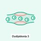
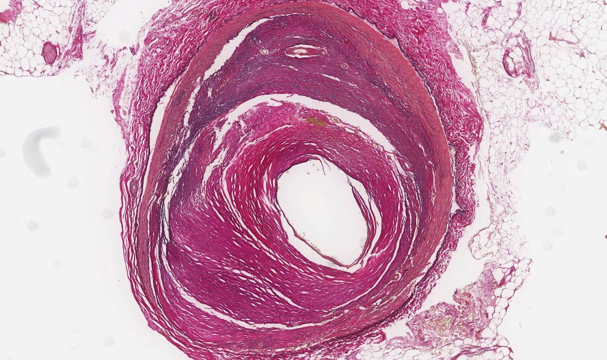
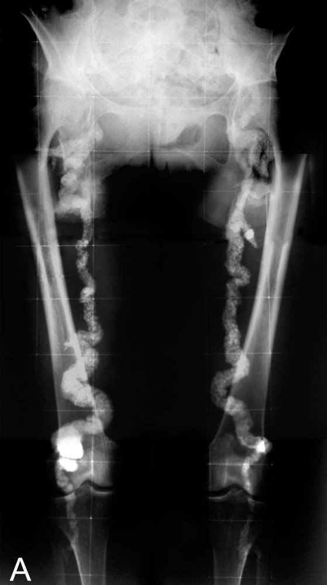
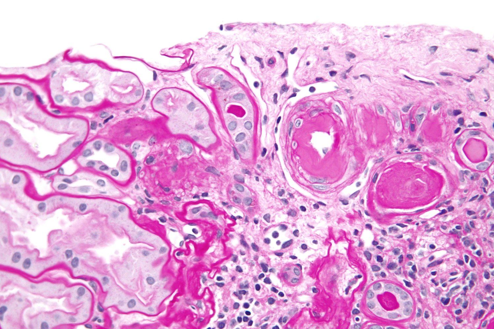
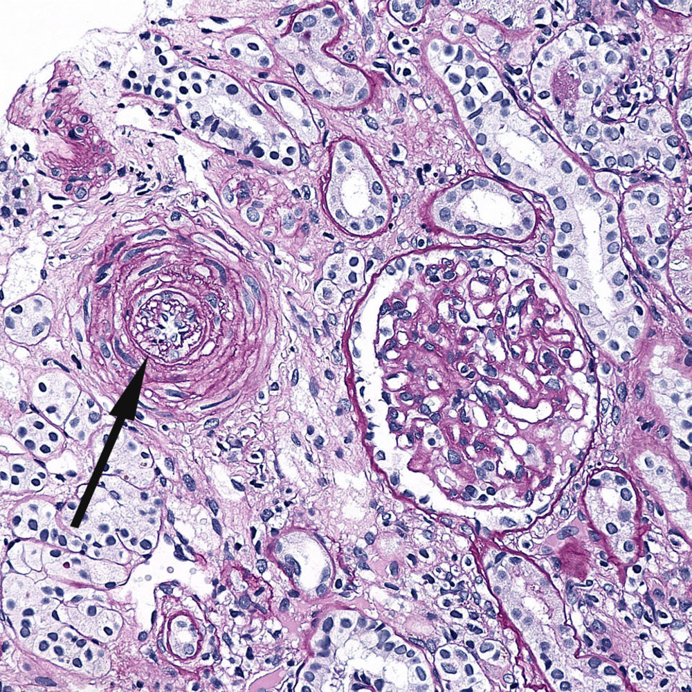
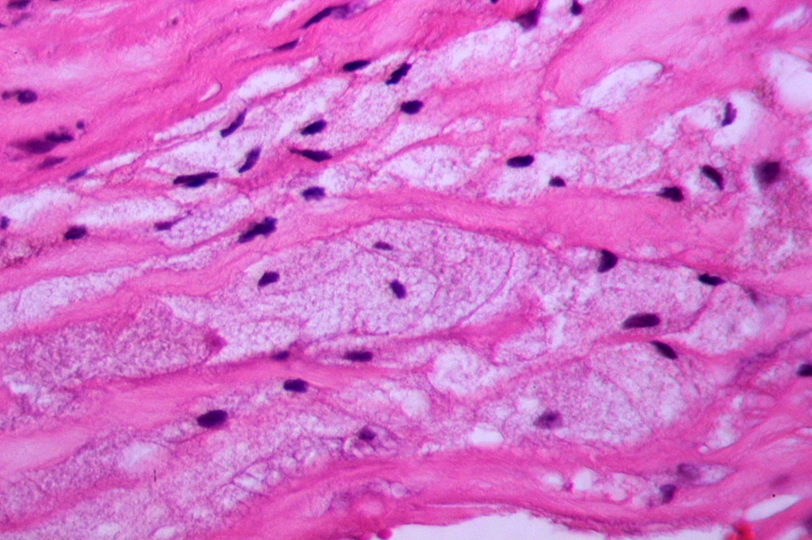
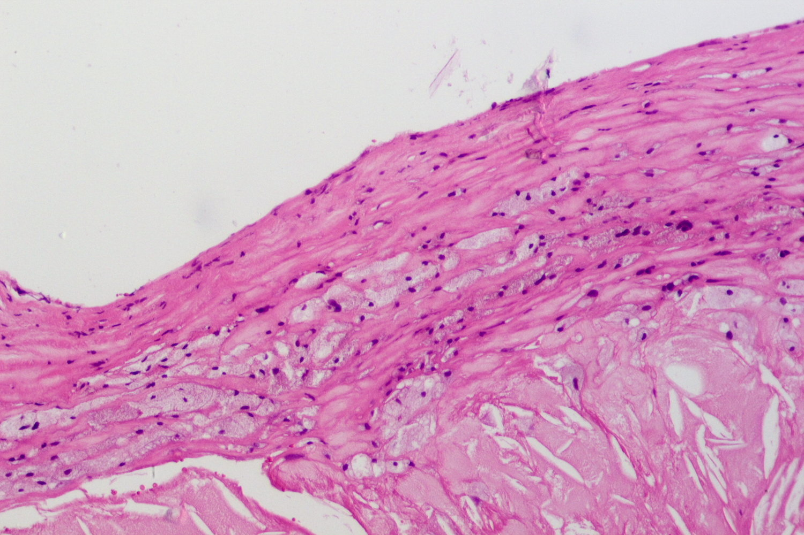
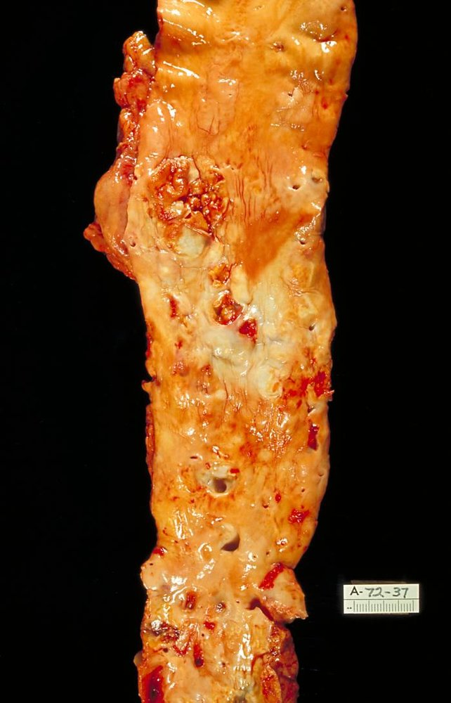
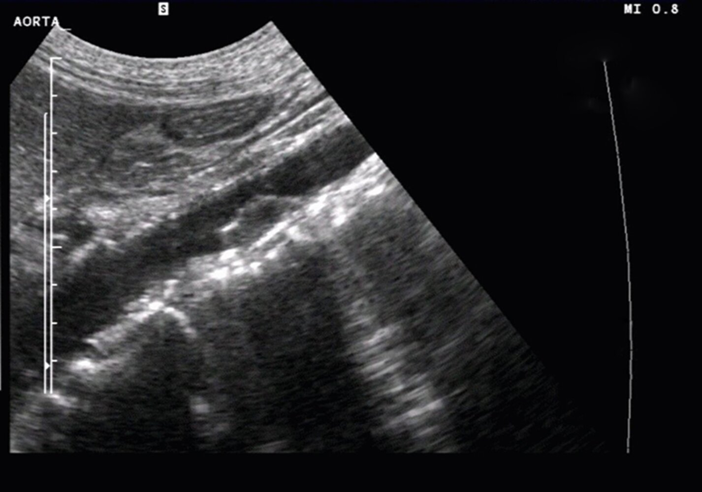
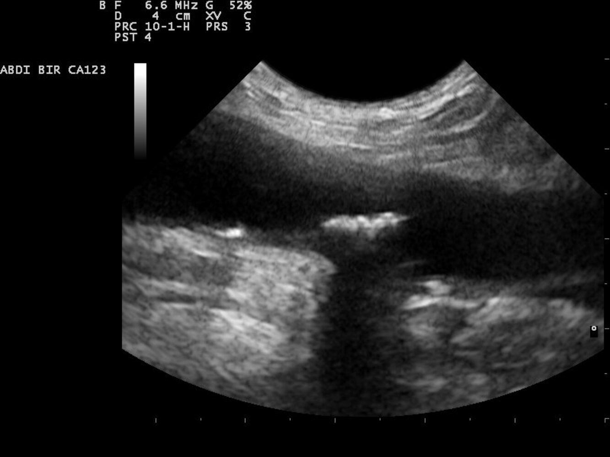

# Atherosclerotic cardiovascular disease

*Categories: Clinical knowledge > Family medicine > Cardiovascular disorders > Atherosclerotic cardiovascular disease*

[Original Article Link](https://coursology-qbank.com/amboss/article/9L0N-g)

---

## Summary

Atherosclerotic cardiovascular disease (ASCVD) is a group of conditions that are caused by <u>atherosclerosis</u> and that can affect different locations throughout the body. Examples of ASCVD include <u>coronary artery disease</u> (<u>CAD</u>), <u>peripheral artery disease</u> (<u>PAD</u>), and <u>ischemic stroke</u>. Major <u>risk factors</u> include advanced age, smoking, <u>diabetes mellitus</u>, <u>hypertension</u>, and <u>dyslipidemia</u>. The <u>pathogenesis of atherosclerosis</u> is precipitated by <u>endothelial</u> damage, which leads to inflammation and the formation of <u>atheromas</u> in vessel walls. The risk of ASCVD should be estimated using an <u>ASCVD risk</u> calculator (e.g., <u>PREVENTTM equations</u>, or <u>pooled cohort equations (PCE)</u>) to guide timely <u>primary prevention</u> strategies, such as lifestyle modifications and prophylactic <u>statin</u> therapy. <u>Management of ASCVD</u> involves intensive lifestyle modifications and <u>high-intensity statin therapy</u>, with or without <u>antiplatelet therapy</u>, to minimize the risk of future cardiovascular events.

---

## Atherosclerosis

### Definitions

* Arteriosclerosis: an umbrella term to describe arterial wall thickening (hardening) and elasticity loss with variable pathogenesis

* <u>Atherosclerosis</u>

* Most common type of <u>arteriosclerosis</u>

* Multifactorial inflammatory disease of the <u>intima</u>, manifesting at points of hemodynamic shear <u>stress</u>

* Characterized by a build-up of <u>cholesterol</u> <u>plaques</u> in the tunica <u>intima</u>

* Affects <u>elastic arteries</u> and large/medium-sized <u>muscular arteries</u>

* Monckeberg arteriosclerosis

* A form of <u>arteriosclerosis</u> characterized by <u>dystrophic calcification</u> of the <u>tunica media</u> and <u>internal elastic lamina</u>

* There is no blood flow obstruction.

* Mainly affects medium-sized <u>arteries</u>

* Causes: <u>diabetes mellitus</u> and/or progressive <u>kidney</u> disease

* <u>X-ray</u>: pipestem appearance

* Arteriolosclerosis: the thickening and loss of elasticity of the small <u>arteries</u> and <u>arterioles</u>

* Hyaline arteriolosclerosis

* Deposition of <u>proteins</u> below the <u>endothelium</u> due to <u>plasma protein</u> leakage

* H&E: pink amorphous deposits (<u>hyaline</u>) within the arteriolar walls

* Causes: chronic <u>essential hypertension</u>, <u>diabetes mellitus</u>, and normal <u>aging</u>

* Hyperplastic arteriolosclerosis

* <u>Proliferation</u> of subendothelial <u>smooth muscle cells</u> in response to very <u>high blood pressure</u>

* H&E: "onion-<u>skin</u>" appearance of the <u>arteriole</u>

* Cause: <u>malignant hypertension</u>

> [!NOTE]
> The terms “<u>arteriosclerosis</u>” and “<u>atherosclerosis</u>” are often used synonymously.

Dyslipidemia 3 - Part 3: Atherosclerosis

Coronary atherosclerosis

Monckeberg arteriosclerosis

Hyaline arteriolosclerosis

Hyperplastic arteriolosclerosis

### Pathophysiology

#### Pathogenesis of atherosclerosis [[2]](https://coursology-qbank.com/amboss/article/p30Ljf)[[3]](https://coursology-qbank.com/amboss/article/fUYkco)

1. * Chronic <u>stress</u> on the <u>endothelium</u> (e.g., due to <u>arterial hypertension</u> and <u>turbulence</u>)
2. * <u>Endothelial</u> cell dysfunction, which leads to:

* Invasion of inflammatory cells (mainly <u>monocytes</u> and <u>lymphocytes</u>) through the disrupted <u>endothelial</u> barrier

* Adhesion of <u>platelets</u> to the damaged vessel wall → <u>platelet</u> release of inflammatory mediators (e.g., <u>cytokines</u>) and <u>platelet-derived growth factor</u> (<u>PDGF</u>)

* <u>PDGF</u> stimulates the migration and <u>proliferation</u> of <u>smooth muscle cells</u> (SMCs) in the <u>tunica intima</u> and mediates the differentiation of <u>fibroblasts</u> into <u>myofibroblasts</u>
3. * Inflammation of the vessel wall
4. * <u>Macrophages</u> and SMCs ingest <u>cholesterol</u> from oxidized <u>LDL</u>;   and transform into foam cells (<u>macrophages</u> filled with lipid droplets).
5. * <u>Foam cells</u> accumulate to form fatty streaks (early atherosclerotic lesions).
6. * Lipid-laden <u>macrophages</u> and SMCs produce <u>extracellular matrix</u> (e.g., <u>collagen</u>) deposition → development of a fibrous plaque (<u>atheroma</u>)
7. * Inflammatory cells in the <u>atheroma</u> (e.g., <u>macrophages</u>) secrete <u>matrix metalloproteinases</u> → weakening of the fibrous cap of the <u>plaque</u> due to the breakdown of <u>extracellular matrix</u> → minor <u>stress</u> ruptures the fibrous cap
8. * Calcification of the <u>intima</u> (the amount and pattern of calcification affect the risk of complications)
9. * <u>Plaque</u> rupture → exposure of thrombogenic material ; (e.g., <u>collagen</u>) → <u>thrombus</u> formation with vascular occlusion or spreading of thrombogenic material

Pathogenesis of atherosclerosis

Foam cells

Atheroma

#### Common sites (in order of frequency)

* <u>Abdominal aorta</u>

* <u>Coronary arteries</u>

* <u>Popliteal arteries</u>

* Carotid <u>arteries</u>

* <u>Circle of Willis</u>

Severe atherosclerosis of the aorta

Arteriosclerotic plaque in the abdominal aorta

Abdominal aortic atherosclerosis

#### Atherosclerotic diseases [[4]](https://coursology-qbank.com/amboss/article/MlWMxl0)

* Weakening of vessel wall: arterial <u>aneurysm</u> or dissection (e.g., <u>aortic aneurysm</u>, <u>aortic dissection</u>)

* Demand-supply mismatch: <u>coronary heart disease</u> (e.g., <u>coronary artery disease</u>, <u>stable angina</u>), <u>peripheral artery disease</u>, subcortical <u>vascular dementia</u>, and <u>intestinal ischemia</u> (e.g., <u>colon ischemia</u>, <u>acute mesenteric ischemia</u>)

* <u>Thrombosis</u> and <u>thromboembolism</u>: <u>acute coronary syndrome</u>, <u>stroke</u>

* <u>Renovascular hypertension</u>

---

## Epidemiology

* Leading cause of vascular disease worldwide

* <u>♂</u> > <u>♀</u>

Epidemiological data refers to the US, unless otherwise specified.

---

## Etiology

### Traditional ASCVD risk factors [[5]](https://coursology-qbank.com/amboss/article/q8XCn-)

These parameters are typically included as variables in <u>ASCVD risk</u> calculators, e.g., <u>PCE</u> and <u>PREVENTTM equations</u>.

* <u>Nonmodifiable risk factors</u>

* Advancing age

* Male sex

* Race and ethnicity

* <u>Modifiable risk factors</u>

* Smoking

* <u>Diabetes mellitus</u>

* <u>Hypertension</u>

* <u>Dyslipidemia</u> (↑ total <u>cholesterol</u>, ↓ <u>HDL cholesterol</u>)

> [!TIP]
> The <u>PREVENTTM equations</u> do not include race or ethnicity but do incorporate a geography-based proxy measure for <u>social determinants of health</u>, which is derived from the individual's US zip code. [[6]](https://coursology-qbank.com/amboss/article/OzWIGL0)

### ASCVD risk-enhancing factors [[1]](https://coursology-qbank.com/amboss/article/0fcekb0)[[7]](https://coursology-qbank.com/amboss/article/ThW6WO0)[[8]](https://coursology-qbank.com/amboss/article/dNWoZN0)

These parameters can be used to upwardly revise the risk assessment for patients with borderline or intermediate <u>ASCVD risk</u>.  [[9]](https://coursology-qbank.com/amboss/article/iXcJBa0)[[10]](https://coursology-qbank.com/amboss/article/MhWMeO0)

* <u>Family history</u>

* Certain racial/ethnic groups have an increased risk of ASCVD, e.g., people with South Asian ancestry.

* Premature ASCVD in a <u>first-degree relative</u> < 55 years of age (<u>♂</u>) or < 65 years of age (<u>♀</u>)

* <u>Patient history</u>

* <u>Premature menopause</u>

* History of <u>hypertensive pregnancy disorders</u>, e.g., <u>preeclampsia</u>

* Untreated <u>chronic kidney disease</u>

* Chronic inflammatory disease, e.g., <u>rheumatoid arthritis</u>, <u>psoriasis</u>, <u>HIV</u>

* <u>Metabolic syndrome</u>, <u>obesity</u>

* Diagnostic findings

* Persistent <u>hypercholesterolemia</u>: ↑ <u>LDL cholesterol</u>, ↑ <u>non-HDL cholesterol</u>

* Persistent <u>hypertriglyceridemia</u>

* ↑ <u>Lipoprotein(a)</u>, and/or ↑ <u>apolipoprotein B</u>

* ↑ High-sensitivity <u>C-reactive protein</u> (hsCRP)

* ↓ <u>Resting ankle-brachial index</u>

---

## Primary prevention

### General principles [[11]](https://coursology-qbank.com/amboss/article/b-bHDw)[[16]](https://coursology-qbank.com/amboss/article/hBXc000)

* Educate all patients about <u>Life's Essential 8</u>.

* Encourage all individuals to adhere to <u>lifestyle modifications for ASCVD prevention</u>.

* Consider pharmacological prevention (e.g., <u>statins</u> and/or <u>aspirin</u>) based on estimated <u>ASCVD risk</u>.

* Utilize <u>shared decision-making</u> to tailor preventive therapies.

* Manage <u>modifiable risk factors for ASCVD</u>, e.g.:

* <u>Management of diabetes mellitus</u>

* <u>Management of hypertension</u>

* <u>Management of obesity</u>

### Life's Essential 8 framework

* Definition: a framework designed by the American <u>Heart</u> Association to promote and quantify cardiovascular health (CVH) by focusing on eight key areas [[17]](https://coursology-qbank.com/amboss/article/LXdwAo0)

* Components and ideal values
1. * Nutrition: <u>DASH diet</u> most of the time
2. * Physical activity: 150 minutes/week of at least moderate-intensity activity
3. * Avoidance of <u>nicotine</u>
4. * <u>Sleep</u>: 7 to < 9 hours
5. * <u>Normal weight</u>
6. * <u>Cholesterol</u>: <u>non-HDL cholesterol</u> < 130 mg/dL
7. * Blood <u>glucose</u>: normal levels, i.e., <u>fasting</u> <u>glucose</u> < 100 mg/dL, <u>HbA1c</u> < 5.7%
8. * Blood pressure: < 120/80 mm Hg

> [!TIP]
> Optimal CVH is further determined by <u>SDOH</u> and psychological health, i.e., the presence of positive factors such as a sense of purpose, happiness, and optimism, and the absence of negative factors, such as <u>depression</u>, <u>anxiety</u>, and <u>stress</u>.

### Lifestyle modifications for ASCVD prevention [[7]](https://coursology-qbank.com/amboss/article/ThW6WO0)[[11]](https://coursology-qbank.com/amboss/article/b-bHDw)

* <u>Smoking cessation</u>: Assess tobacco use at each encounter.

* Dietary modification with a <u>heart</u>-healthy diet, e.g.: [[18]](https://coursology-qbank.com/amboss/article/2mWTUN0)

* <u>Mediterranean diet</u>

* Replacement of saturated fat with monounsaturated and <u>polyunsaturated fats</u>

* Reduced dietary <u>cholesterol</u> intake

* Limit <u>sodium</u> intake for all adults to < 2300 mg/day.  [[11]](https://coursology-qbank.com/amboss/article/b-bHDw)

* Minimal refined sugars and processed meats

* Physical activity: Provide <u>counseling on regular exercise</u>.

* <u>Sleep hygiene</u>: Encourage 6–8 hours of <u>sleep</u> per night.

> [!TIP]
> <u>Smoking cessation</u> is one of the most effective interventions to reduce <u>all-cause mortality</u> and prevent recurrent vascular events in patients with ASCVD! [[19]](https://coursology-qbank.com/amboss/article/SBXyZ00)

### Pharmacological prevention for ASCVD [[11]](https://coursology-qbank.com/amboss/article/b-bHDw)

Recommendations for preventive therapy vary.

#### Preventive <u>statins</u>

| Indications for statins for primary ASCVD prevention |  |  |
| --- | --- | --- |
|  |  2019 American <u>Heart</u> association (<u>AHA</u>) guideline on <u>primary prevention</u> of cardiovascular disease [[1]](https://coursology-qbank.com/amboss/article/0fcekb0)[[11]](https://coursology-qbank.com/amboss/article/b-bHDw)  |  2022 <u>USPSTF</u> recommendation on <u>statin</u> use for <u>primary prevention</u> of cardiovascular disease [[12]](https://coursology-qbank.com/amboss/article/w61hM30)  |
| Age 20–39 years |  * <u>Moderate-intensity statins</u> for patients with any of the following:  * <u>LDL cholesterol</u> level ≥ 160 mg/dL and <u>family history</u> of early ASCVD  * Long-standing <u>diabetes mellitus</u>  [[1]](https://coursology-qbank.com/amboss/article/0fcekb0)  * <u>Complications of diabetes mellitus</u>  [[1]](https://coursology-qbank.com/amboss/article/0fcekb0)   |  * N/A   |
| Age 40–75 years |   * High <u>10-year ASCVD risk</u> (≥ 20%): <u>high-intensity statins</u>  * <u>Diabetes mellitus</u> and:  * No further <u>ASCVD risk factors</u>: <u>moderate-intensity statins</u>  * ≥ 1 further <u>ASCVD risk factor</u>: Consider <u>high-intensity statins</u>.  * Borderline or intermediate <u>10-year ASCVD risk</u> (5–19.9%): Consider <u>moderate-intensity statins</u> based on <u>ASCVD risk-enhancing factors</u> and/or <u>CAC score</u>.    |  * ≥ 1 modifiable <u>traditional ASCVD risk factor</u> (i.e., <u>dyslipidemia</u>, <u>diabetes</u>, <u>hypertension</u>, smoking) and:  * <u>10-year ASCVD risk</u> ≥ 10%: <u>moderate-intensity statins</u>  * <u>10-year ASCVD risk</u> 7.5–9-9%: Consider <u>moderate-intensity statins</u>.   |

#### Preventive <u>aspirin</u> [[11]](https://coursology-qbank.com/amboss/article/b-bHDw)[[20]](https://coursology-qbank.com/amboss/article/9T1NGT0)

Consider only for patients with a low risk of bleeding, and use <u>shared decision-making</u>.

* The <u>USPSTF</u> recommends considering <u>low-dose aspirin</u> for adults aged 40–59 years with <u>10-year ASCVD risk</u> > 10%. [[20]](https://coursology-qbank.com/amboss/article/9T1NGT0)

* According to the <u>AHA</u>, <u>low-dose aspirin</u> may be considered for certain adults aged 40–70 years with an increased <u>ASCVD risk</u>. [[11]](https://coursology-qbank.com/amboss/article/b-bHDw)

> [!WARNING]
> <u>Aspirin</u> for <u>primary prevention of ASCVD</u> is contraindicated in individuals at increased risk of bleeding.

> [!TIP]
> Remember the ABCDS of ASCVD <u>primary prevention</u>: Aspirin (if there are indications), Blood pressure control, Cholesterol management, Diabetes management, Smoking cessation. [[16]](https://coursology-qbank.com/amboss/article/hBXc000)

---

## Management

This section provides an overview of long-term <u>management strategies for ASCVD</u>. See respective articles for specific treatment of an acute ASCVD events, e.g., <u>management of ischemic stroke</u>.

### General principles [[1]](https://coursology-qbank.com/amboss/article/0fcekb0)[[7]](https://coursology-qbank.com/amboss/article/ThW6WO0)

* Encourage <u>lifestyle modifications for ASCVD prevention</u>.

* Assess risk for recurrent ASCVD events.

* Provide pharmacotherapy.

* Start <u>statin</u> therapy (unless contraindicated).

* Consider the addition of nonstatin lipid-lowering therapy for patients with <u>very high-risk ASCVD</u>.

* Consider <u>antiplatelet therapy</u> (e.g., <u>aspirin</u>) based on clinical indications.

* Manage <u>modifiable risk factors for ASCVD</u>, e.g.:

* <u>Management of hypertension</u>

* <u>Management of diabetes mellitus</u>

* <u>Management of obesity</u>

### Risk assessment for recurrent ASCVD events [[1]](https://coursology-qbank.com/amboss/article/0fcekb0)[[11]](https://coursology-qbank.com/amboss/article/b-bHDw)

Patients with ASCVD are considered at very high risk of future ASCVD events in the following scenarios:

* ≥ 2 major ASCVD events, e.g.:

* <u>ACS</u> in the past 12 months

* <u>Myocardial infarction</u>

* <u>Ischemic stroke</u>

* Symptomatic <u>PAD</u>

* 1 major ASCVD event in combination with ≥ 2 high-risk conditions, e.g.:

* Age ≥ 65 years

* Current smoking

* <u>LDL cholesterol</u> ≥ 100 mg/dL on maximally tolerated <u>statin</u> therapy and <u>ezetimibe</u>

* History of <u>coronary revascularization</u> not associated with the major ASCVD event(s)

* <u>Heterozygous</u> <u>familial hypercholesterolemia</u>

* Comorbidities: e.g., <u>diabetes mellitus</u>, <u>hypertension</u>, <u>CKD</u>, history of <u>congestive heart failure</u>

### Lipid-lowering therapy for ASCVD

#### <u>Statin</u> therapy [[1]](https://coursology-qbank.com/amboss/article/0fcekb0)

Treatment to a specific <u>LDL cholesterol</u> goal (e.g., < 70 mg/dL) vs. targeting <u>statin</u> intensity is a topic of ongoing inquiry. [[1]](https://coursology-qbank.com/amboss/article/0fcekb0)[[7]](https://coursology-qbank.com/amboss/article/ThW6WO0)

* <u>High-intensity statin therapy</u> is recommended in adults with established ASCVD.

* <u>Moderate-intensity statin therapy</u> is a reasonable alternative for adults with ASCVD who:

* Are > 75 years of age and do not have <u>very high-risk ASCVD</u>

* Do not tolerate high-intensity <u>statin</u>

|  Overview of <u>statin</u> intensity [[1]](https://coursology-qbank.com/amboss/article/0fcekb0)  |  |
| --- | --- |
| Intensity |  Agents   |
|  High-intensity statin therapy   |   * <u>Atorvastatin</u> DOSAGE  * <u>Rosuvastatin</u> DOSAGE    |
|  Moderate-intensity statin therapy  |   * <u>Atorvastatin</u> DOSAGE  * <u>Rosuvastatin</u> DOSAGE  * <u>Simvastatin</u> DOSAGE  * <u>Pravastatin</u> DOSAGE  * <u>Lovastatin</u> DOSAGE  * <u>Fluvastatin</u> DOSAGE  * <u>Pitavastatin</u> DOSAGE    |
|  Low-intensity statin therapy  |   * <u>Simvastatin</u> DOSAGE  * <u>Pravastatin</u> DOSAGE  * <u>Lovastatin</u> DOSAGE  * <u>Fluvastatin</u> DOSAGE    |

#### Nonstatin lipid-lowering agents [[1]](https://coursology-qbank.com/amboss/article/0fcekb0)

* Consider addition for patients with <u>very high-risk ASCVD</u> events with <u>LDL cholesterol</u> level ≥ 70 mg/dL despite maximally tolerated <u>statin</u> dose.

* Agents

* <u>Ezetimibe</u> (<u>off-label</u>) DOSAGE

* <u>PCSK9 inhibitors</u>, e.g., <u>evolocumab</u> DOSAGE or <u>alirocumab</u> DOSAGE

* <u>Bile acid sequestrants</u>, e.g., <u>colesevelam</u> (<u>off-label</u>) DOSAGE

### <u>Antiplatelet therapy</u>

* Start treatment as indicated depending on ASCVD event.

* Single-agent <u>antiplatelet therapy</u> is usually sufficient.

* First-line: <u>aspirin</u>  [[21]](https://coursology-qbank.com/amboss/article/0Nde-J0)[[22]](https://coursology-qbank.com/amboss/article/HzbK8w)[[23]](https://coursology-qbank.com/amboss/article/b1dH2K0)

* Second-line : <u>clopidogrel</u> DOSAGE [[24]](https://coursology-qbank.com/amboss/article/MxXMCZ0)

* <u>Dual antiplatelet therapy</u> may be indicated in certain patients, e.g., with <u>ACS</u> (see “<u>Antiplatelet therapy and anticoagulation in STEMI</u>” and “<u>Antiplatelet therapy and anticoagulation in NSTE-ACS</u>”).

---