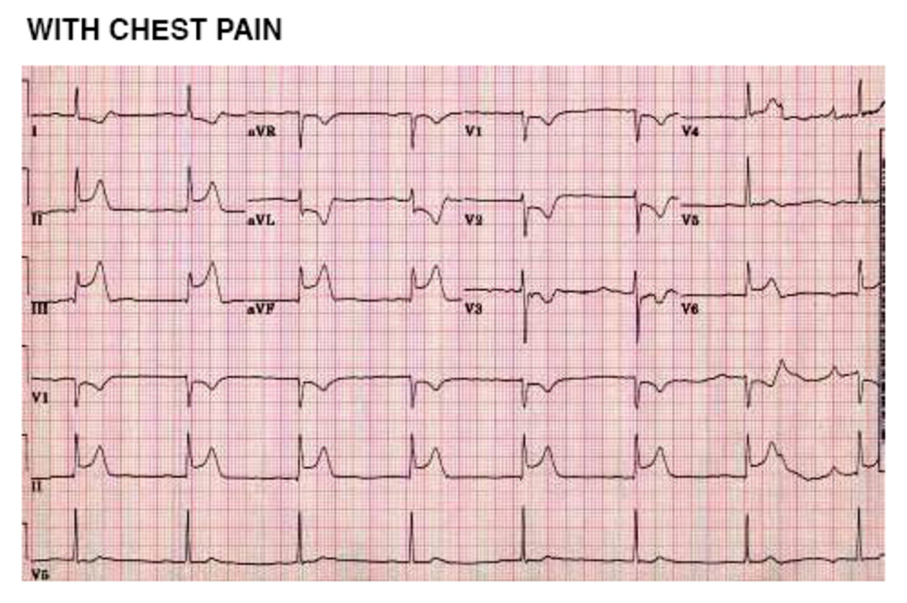
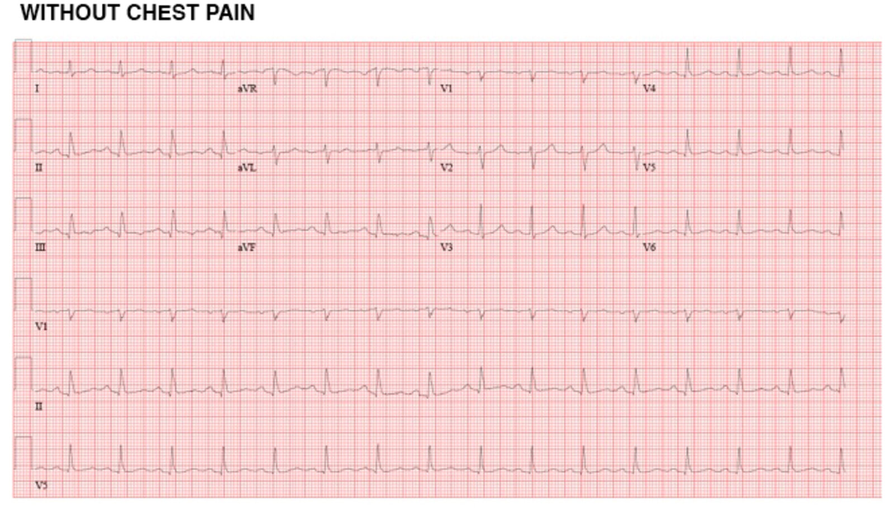

# Chronic coronary disease

*Categories: Clinical knowledge > Family medicine > Cardiovascular disorders > Chronic coronary disease*

[Original Article Link](https://coursology-qbank.com/amboss/article/jv0_-3)

---

## Summary

Chronic coronary disease (CCD) is characterized by chronic <u>myocardial</u> <u>ischemia</u> due to <u>atherosclerosis</u>, <u>endothelial</u> dysfunction, and/or <u>microvascular</u> disease. CCD encompasses all stable manifestations of <u>ischemic heart disease</u>, including <u>coronary artery disease</u> (<u>CAD</u>) and <u>ischemia with nonobstructive coronary arteries</u> (<u>INOCA</u>). Symptoms include <u>stable angina</u> or <u>anginal equivalents</u> (e.g., <u>dyspnea</u>). Some patients remain asymptomatic or have atypical symptoms. The diagnostic approach should begin with evaluation for <u>CAD</u>, the most common and severe cause of CCD, and it can involve <u>ECG</u>, <u>cardiac imaging</u> (e.g., <u>CAC score</u>, <u>CTA</u>), <u>cardiac stress testing</u>, and <u>invasive coronary angiography</u>. <u>Management of CCD</u> includes optimizing <u>cardiovascular risk factors</u> through lifestyle modifications (e.g., <u>smoking cessation</u>, exercise), treating comorbidities (e.g., <u>diabetes</u>, <u>hypertension</u>, <u>dyslipidemia</u>), <u>antiplatelet therapy</u>, and symptomatic treatment with <u>antianginal medication</u> (e.g., <u>beta blockers</u>, <u>calcium channel blockers</u>, <u>nitrates</u>). For some patients with <u>CAD</u>, <u>coronary revascularization</u> is necessary to reduce the risk of <u>major adverse cardiovascular events</u> (<u>MACE</u>).

For approaches to <u>acute chest pain</u>, see “<u>Acute coronary syndrome</u>” and “<u>Chest pain</u>.” See “<u>Atherosclerotic cardiovascular disease</u>” for further details on <u>risk factors</u> and risk calculation for <u>CAD</u>.

---

## Definitions

* <u>Ischemic heart disease</u> (IHD): a condition of inadequate <u>myocardial</u> <u>perfusion</u> (<u>myocardial</u> oxygen supply-demand mismatch and <u>ischemia</u>) [[2]](https://coursology-qbank.com/amboss/article/zIdr2r0)

* Chronic coronary disease (CCD): an umbrella term for all stable forms of IHD; applies to patients diagnosed with: [[3]](https://coursology-qbank.com/amboss/article/b1dH2K0)[[4]](https://coursology-qbank.com/amboss/article/Urdbgr0)

* <u>Stable CAD</u>

* <u>Obstructive CAD</u>

* Nonobstructive <u>CAD</u>

* History of <u>acute coronary syndrome</u> and/or <u>coronary artery revascularization</u>

* <u>Ischemic cardiomyopathy</u> with or without reduced <u>LVEF</u>

* <u>Ischemia with nonobstructive coronary arteries</u> (<u>INOCA</u>): a type of IHD without obstruction of <u>coronary arteries</u>

* <u>Vasospastic angina</u>: episodic obstruction of epicardial <u>coronary arteries</u> due to vasomotor disorders

* <u>Microvascular angina</u>: <u>ischemia</u> due to <u>microvascular</u> dysfunction

* Presumed IHD based on symptoms or screening

* Medically controlled <u>stable angina</u> (regardless of imaging studies)

* Positive <u>screening test</u> (e.g., <u>cardiac stress testing</u> or <u>CTA</u>)

* Reduced <u>LVEF</u> of suspected <u>ischemic</u> origin

---

## Ischemia with nonobstructive coronary arteries (INOCA)

### Vasospastic angina [[3]](https://coursology-qbank.com/amboss/article/b1dH2K0)

<u>Vasospastic angina</u> is caused by ; coronary vasomotor dysfunction that leads to transient coronary spasms and <u>myocardial</u> <u>ischemia</u>.

#### <u>Epidemiology</u> [[13]](https://coursology-qbank.com/amboss/article/SBdyZs0)

* Highest <u>prevalence</u>: Japanese population (especially women)

* Average age of onset: 40–70 years [[13]](https://coursology-qbank.com/amboss/article/SBdyZs0)

#### Etiology [[14]](https://coursology-qbank.com/amboss/article/OnYItp)

* <u>Cigarette smoking</u>; use of stimulants (e.g., <u>cocaine</u>, <u>amphetamines</u>), <u>alcohol</u>, or <u>triptans</u> [[14]](https://coursology-qbank.com/amboss/article/OnYItp)[[15]](https://coursology-qbank.com/amboss/article/hBdc0s0)[[16]](https://coursology-qbank.com/amboss/article/3BdS0s0)

* Associated with other vasospastic disorders (e.g., <u>Raynaud phenomenon</u>; , <u>migraine headaches</u>) [[17]](https://coursology-qbank.com/amboss/article/L0Xwg9)[[18]](https://coursology-qbank.com/amboss/article/N8X-5-)

* Triggers (e.g., <u>stress</u>, <u>hyperventilation</u>, exposure to cold)

> [!TIP]
> <u>ASCVD risk factors</u> (except smoking) do not apply to <u>vasospastic angina</u>.

#### Clinical features [[14]](https://coursology-qbank.com/amboss/article/OnYItp)

* <u>Angina</u> not affected by exertion (may also occur at rest)

* Typically occurs early in the morning

#### Diagnosis [[18]](https://coursology-qbank.com/amboss/article/N8X-5-)[[19]](https://coursology-qbank.com/amboss/article/l8Xv5-)

The goal of diagnostic testing is to detect transient <u>ischemic</u> changes and/or <u>coronary artery spasm</u> during <u>anginal</u> episodes as well as concomitant <u>coronary artery stenosis</u>. Specialist consultation is advised. [[14]](https://coursology-qbank.com/amboss/article/OnYItp)

* Initial testing [[18]](https://coursology-qbank.com/amboss/article/N8X-5-)[[20]](https://coursology-qbank.com/amboss/article/l9XvnZ0)

* Resting <u>ECG</u>: Obtain during an acute <u>anginal</u> attack.

* Consider <u>Holter monitor</u> in patients with : [[20]](https://coursology-qbank.com/amboss/article/l9XvnZ0) 

* No <u>ischemic</u> changes on resting <u>ECG</u>

* <u>Syncope</u> or <u>bradyarrhythmias</u>  [[18]](https://coursology-qbank.com/amboss/article/N8X-5-)[[20]](https://coursology-qbank.com/amboss/article/l9XvnZ0)

* <u>Exercise stress test</u>

* Consider if <u>ischemic</u> changes have not been identified using other methods.

* Approx. one-third of patients with <u>vasospastic angina</u> do not have <u>ST segment</u> changes during an <u>exercise stress test</u>. [[18]](https://coursology-qbank.com/amboss/article/N8X-5-)

* <u>Cardiac biomarkers</u>

* Measure serial <u>troponin I</u> and/or <u>troponin T</u> levels during periods of <u>acute chest pain</u> (i.e., at arrival and 1–6 hours later) if <u>acute coronary syndrome</u> is suspected (see also “Complications”).

* Serial <u>troponin</u> levels are unlikely to be elevated in patients with transient <u>ischemic</u> changes. [[14]](https://coursology-qbank.com/amboss/article/OnYItp)[[21]](https://coursology-qbank.com/amboss/article/kabmkH)

* Advanced testing [[18]](https://coursology-qbank.com/amboss/article/N8X-5-)[[19]](https://coursology-qbank.com/amboss/article/l8Xv5-)

* <u>Coronary angiography</u>: commonly indicated in <u>vasospastic angina</u> with <u>ST-segment elevation</u> to rule out underlying <u>coronary artery stenosis</u>

* Coronary artery spasm provocation testing [[18]](https://coursology-qbank.com/amboss/article/N8X-5-)[[19]](https://coursology-qbank.com/amboss/article/l8Xv5-)

* Usually only performed to aid diagnosis or treatment decisions when further information is required following other tests

* Not recommended for patients with severe <u>coronary artery stenosis</u> or <u>advanced heart failure</u> [[14]](https://coursology-qbank.com/amboss/article/OnYItp)

* Spasms are usually induced pharmacologically.

* <u>Nitrates</u> and <u>calcium channel blockers</u> (<u>CCBs</u>) should be held before testing.

* Noninvasive <u>coronary artery spasm provocation testing</u> is not advised.  [[19]](https://coursology-qbank.com/amboss/article/l8Xv5-)

|  Diagnostic criteria for vasospastic angina [[3]](https://coursology-qbank.com/amboss/article/b1dH2K0)[[18]](https://coursology-qbank.com/amboss/article/N8X-5-)[[19]](https://coursology-qbank.com/amboss/article/l8Xv5-)  |  |
| --- | --- |
| Criteria | Description |
| Typical clinical features |  * Spontaneous <u>angina</u> with a rapid response to short-acting <u>nitrates</u> and ≥ 1 of the following: [[3]](https://coursology-qbank.com/amboss/article/b1dH2K0)  * Occurrence at rest (especially at night or early morning)  * Precipitated by <u>hyperventilation</u>  * Responsive to <u>CCBs</u> (but not <u>beta blockers</u>)  * Reported lower exercise tolerance in the morning   |
|  Transient <u>ischemic ECG changes</u>   |  * One of the following <u>ECG</u> changes in ≥ 2 contiguous leads during an <u>anginal</u> episode : [[3]](https://coursology-qbank.com/amboss/article/b1dH2K0)  * <u>ST elevation</u> or <u>ST depression</u> ≥ 0.1 mV (1 mm)  * New negative <u>U waves</u>   |
| <u>Coronary spasm</u> on <u>angiography</u> |  * <u>Coronary artery</u> constriction > 90% (spontaneous or induced by provocation testing), associated with <u>angina</u> and <u>ischemic ECG changes</u> [[3]](https://coursology-qbank.com/amboss/article/b1dH2K0)[[18]](https://coursology-qbank.com/amboss/article/N8X-5-)[[19]](https://coursology-qbank.com/amboss/article/l8Xv5-)   |
|   * Definitive <u>vasospastic angina</u>: typical clinical features as well as documentation of either transient <u>ischemic ECG changes</u> or <u>coronary spasm</u> during <u>coronary angiography</u> [[3]](https://coursology-qbank.com/amboss/article/b1dH2K0)  * Suspected <u>vasospastic angina</u>: typical clinical features as well as equivocal or unavailable transient <u>ischemic ECG changes</u> and equivocal <u>coronary artery spasm</u> criteria (i.e., changes are seen but do not meet the criteria listed above) [[3]](https://coursology-qbank.com/amboss/article/b1dH2K0)    |  |

> [!WARNING]
> Noninvasive bedside <u>coronary artery spasm provocation testing</u> can lead to significant adverse effects and even <u>death</u>. Provocation testing to diagnose <u>vasospastic angina</u> should only be attempted by a specialist, and usually only during <u>coronary angiography</u>. [[19]](https://coursology-qbank.com/amboss/article/l8Xv5-)

Prinzmetal's variant angina (1/2)

Prinzmetal's variant angina (2/2)

#### Treatment of vasospastic angina [[3]](https://coursology-qbank.com/amboss/article/b1dH2K0)[[14]](https://coursology-qbank.com/amboss/article/OnYItp)[[18]](https://coursology-qbank.com/amboss/article/N8X-5-)[[22]](https://coursology-qbank.com/amboss/article/m8XVM-)

* General recommendations

* <u>Smoking cessation</u>

* Avoidance of <u>beta blockers</u> (particularly <u>nonselective beta blockers</u>)  and other agents that induce <u>vasoconstriction</u>, e.g.: [[20]](https://coursology-qbank.com/amboss/article/l9XvnZ0)[[22]](https://coursology-qbank.com/amboss/article/m8XVM-)

* <u>Triptans</u>

* High-dose <u>aspirin</u> (> 325 mg)  [[20]](https://coursology-qbank.com/amboss/article/l9XvnZ0)[[22]](https://coursology-qbank.com/amboss/article/m8XVM-)

* Certain <u>chemotherapeutic agents</u>

* <u>Alcohol</u> and recreational use of drugs

* <u>Atherosclerotic risk factor</u> modification, as appropriate (see “<u>Management of ASCVD</u>”) [[3]](https://coursology-qbank.com/amboss/article/b1dH2K0)[[14]](https://coursology-qbank.com/amboss/article/OnYItp)

* Pharmacological treatment  [[18]](https://coursology-qbank.com/amboss/article/N8X-5-)[[20]](https://coursology-qbank.com/amboss/article/l9XvnZ0)

* First-line: <u>calcium channel blockers</u> (e.g., <u>verapamil</u> DOSAGE) [[3]](https://coursology-qbank.com/amboss/article/b1dH2K0)

* Second-line

* Long-acting <u>nitrates</u> (e.g., <u>isosorbide dinitrate</u> DOSAGE) [[3]](https://coursology-qbank.com/amboss/article/b1dH2K0)

* Combination therapy for symptom control: <u>nitrates</u> with up to two <u>CCBs</u> from different classes  [[14]](https://coursology-qbank.com/amboss/article/OnYItp)[[18]](https://coursology-qbank.com/amboss/article/N8X-5-)

* Additional therapy

* Short-acting <u>nitrates</u> (e.g., <u>nitroglycerin</u> DOSAGE) [[3]](https://coursology-qbank.com/amboss/article/b1dH2K0)

* May be used during acute attacks

* Patients should seek medical attention if <u>pain</u> persists after three doses of <u>nitroglycerin</u> taken over 15 minutes.

* <u>Statins</u> (e.g., <u>fluvastatin</u> DOSAGE) can further prevent <u>coronary artery spasm</u> when added to <u>CCB</u> treatment.  [[14]](https://coursology-qbank.com/amboss/article/OnYItp)[[23]](https://coursology-qbank.com/amboss/article/P9XWnZ0)

* <u>Alpha blockers</u>: The addition of <u>prazosin</u> DOSAGE to <u>CCBs</u> or long-acting <u>nitrates</u> may reduce episodes of spasm. [[14]](https://coursology-qbank.com/amboss/article/OnYItp)[[22]](https://coursology-qbank.com/amboss/article/m8XVM-)

* <u>Magnesium</u> supplementation may help prevent spasms. [[14]](https://coursology-qbank.com/amboss/article/OnYItp)[[20]](https://coursology-qbank.com/amboss/article/l9XvnZ0)[[24]](https://coursology-qbank.com/amboss/article/v9XA6Z0)

#### Complications [[18]](https://coursology-qbank.com/amboss/article/N8X-5-)[[20]](https://coursology-qbank.com/amboss/article/l9XvnZ0)

* <u>Myocardial infarction</u>

* May occur with prolonged spasms or in patients with concomitant <u>coronary artery stenosis</u>

* See “<u>Acute coronary syndrome</u>.”

* <u>Arrhythmias</u> [[18]](https://coursology-qbank.com/amboss/article/N8X-5-)

* <u>AV block</u>: A pacemaker may be required (see “<u>Management approach to patients with AV block</u>”).

* <u>Ventricular arrhythmia</u> and <u>sudden cardiac death</u>: An <u>implantable cardioverter defibrillator</u> may be required.

> [!WARNING]
> Prolonged <u>coronary artery spasms</u> can lead to <u>MI</u> or fatal <u>arrhythmias</u>. [[18]](https://coursology-qbank.com/amboss/article/N8X-5-)

#### Prognosis

* The 5-year survival rate is > 90% with treatment. [[25]](https://coursology-qbank.com/amboss/article/j0X_f9)

* The persistence of symptoms is common.

> [!TIP]
> <u>Coronary artery stenosis</u>, which is caused by obstructive <u>atherosclerotic plaques</u>, can coexist with <u>vasospastic angina</u> and is associated with a worse prognosis than <u>vasospastic angina</u> alone. [[14]](https://coursology-qbank.com/amboss/article/OnYItp)

### Microvascular angina [[3]](https://coursology-qbank.com/amboss/article/b1dH2K0)[[26]](https://coursology-qbank.com/amboss/article/zrdrPr0)

<u>Microvascular angina</u> is caused by <u>coronary microvascular dysfunction</u> (CMD). [[3]](https://coursology-qbank.com/amboss/article/b1dH2K0)

#### <u>Epidemiology</u> [[26]](https://coursology-qbank.com/amboss/article/zrdrPr0)

* <u>Prevalence</u> in individuals with <u>chest pain</u> but nonobstructive <u>CAD</u>: 30–50% [[26]](https://coursology-qbank.com/amboss/article/zrdrPr0)

* <u>♀</u> > <u>♂</u> [[26]](https://coursology-qbank.com/amboss/article/zrdrPr0)

#### Etiology [[27]](https://coursology-qbank.com/amboss/article/_rd5Pr0)[[28]](https://coursology-qbank.com/amboss/article/BvdzXH0)

* The etiology is not fully understood.

* <u>Chronic inflammatory response</u> to <u>risk factors for CAD</u> (e.g., smoking, <u>hypertension</u>) is a significant factor.

#### Pathophysiology [[3]](https://coursology-qbank.com/amboss/article/b1dH2K0)

* Multifactorial

* Mechanisms include:

* <u>Endothelial</u> dysfunction: ↓ coronary vasorelaxation, ↓ microvasodilator capacity

* Nonendothelial dysfunction: ↑ <u>microvascular</u> resistance, <u>microvascular</u> spasm

* Structural factors

#### Clinical features [[26]](https://coursology-qbank.com/amboss/article/zrdrPr0)[[28]](https://coursology-qbank.com/amboss/article/BvdzXH0)

* Patients may be asymptomatic or present with <u>angina</u> or <u>anginal equivalents</u>.

* Symptoms can occur at rest or during or after exertion.

* Less pronounced response to <u>nitrates</u> than patients with <u>obstructive CAD</u>

#### Diagnosis [[5]](https://coursology-qbank.com/amboss/article/OS1I-T0)[[26]](https://coursology-qbank.com/amboss/article/zrdrPr0)[[27]](https://coursology-qbank.com/amboss/article/_rd5Pr0)

* Refer to a specialist.

* Rule out flow-limiting coronary stenosis using <u>CCTA</u> or <u>invasive coronary angiography</u>. [[27]](https://coursology-qbank.com/amboss/article/_rd5Pr0)

* Confirm signs of cardiac <u>ischemia</u> on noninvasive testing (resting <u>ECG</u> and/or <u>cardiac stress testing</u>).

* Obtain coronary function testing to confirm impaired coronary <u>microvascular</u> function.

|  Diagnostic criteria for microvascular angina [[3]](https://coursology-qbank.com/amboss/article/b1dH2K0)[[26]](https://coursology-qbank.com/amboss/article/zrdrPr0)  |  |
| --- | --- |
| Criteria | Specific findings |
| <u>Ischemic</u> symptoms |  * <u>Angina</u> and/or <u>anginal equivalents</u>   |
| Absence of epicardial <u>coronary artery</u> obstruction |  * No <u>obstructive CAD</u> on <u>CCTA</u> or <u>invasive coronary angiography</u>   |
| Evidence of cardiac <u>ischemia</u> |  * <u>Chest pain</u> with simultaneous <u>ECG</u> findings suggestive of <u>ischemia</u> and one or more of the following:  * <u>Stress</u>-induced <u>chest pain</u> (with or without reversible wall motion and/or <u>myocardial</u> <u>perfusion</u> abnormality)  * <u>Stress</u>-induced <u>ECG</u> findings suggestive of <u>ischemia</u> (with or without reversible wall motion and/or <u>myocardial</u> <u>perfusion</u> abnormality)   |
| Evidence of impaired coronary <u>microvascular</u> function |  * One or more of the following on invasive coronary function testing:  * ↓ Coronary flow reserve (<u>CFR</u>)  [[27]](https://coursology-qbank.com/amboss/article/_rd5Pr0)  * ↑ Coronary <u>microvascular</u> resistance  [[27]](https://coursology-qbank.com/amboss/article/_rd5Pr0)  * Coronary slow flow phenomenon  [[27]](https://coursology-qbank.com/amboss/article/_rd5Pr0)  * Diagnosed coronary <u>microvascular</u> spasm   |
|   * Definitive <u>microvascular angina</u>: All four criteria are met.  * Suspected <u>microvascular angina</u>: <u>ischemic</u> symptoms without <u>obstructive CAD</u>, but accompanied only by evidence of cardiac <u>ischemia</u> or CMD    |  |

> [!TIP]
> <u>Obstructive CAD</u> can coexist with CMD. [[28]](https://coursology-qbank.com/amboss/article/BvdzXH0)

#### Treatment of microvascular angina [[3]](https://coursology-qbank.com/amboss/article/b1dH2K0)

* General recommendations (all patients)

* <u>Lifestyle modifications for ASCVD prevention</u>

* Consider indications for <u>aspirin</u>, <u>statin</u>, and <u>ACE-inhibitor</u> therapy.

* Antianginal pharmacological treatment

* First-line: <u>beta blockers</u> (e.g., <u>carvedilol</u>)

* Second line : <u>nondihydropyridine CCBs</u> (e.g., <u>verapamil</u>)

* Third-line: additional therapy

* Sublingual <u>nitroglycerin</u> as needed for <u>angina</u> symptoms

* <u>Dihydropyridine CCBs</u>, e.g., <u>amlodipine</u> (only for patients on <u>beta blockers</u>)

* <u>Ranolazine</u>

#### Complications [[27]](https://coursology-qbank.com/amboss/article/_rd5Pr0)

* <u>HFpEF</u>

* <u>Myocardial infarction</u> with nonobstructive <u>coronary arteries</u> (MINOCA) is rare.

#### Prognosis

* CMD increases the risk of <u>MACE</u> in patients with nonobstructive <u>CAD</u>. [[29]](https://coursology-qbank.com/amboss/article/wrdhjr0)

* Women are more likely than men to have persistent symptoms. [[30]](https://coursology-qbank.com/amboss/article/Z7dZ4r0)

---