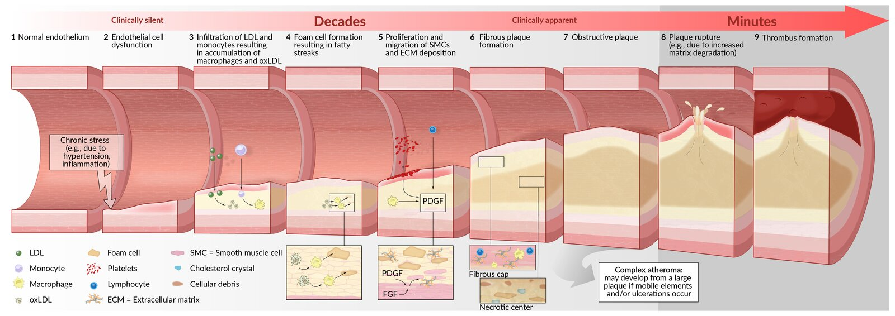
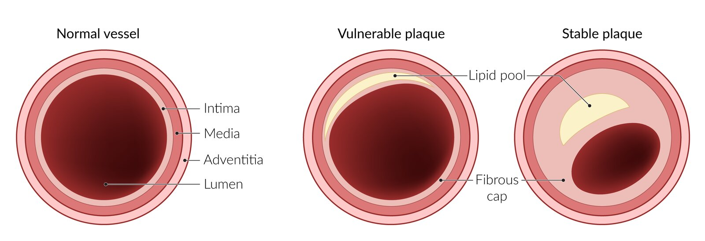
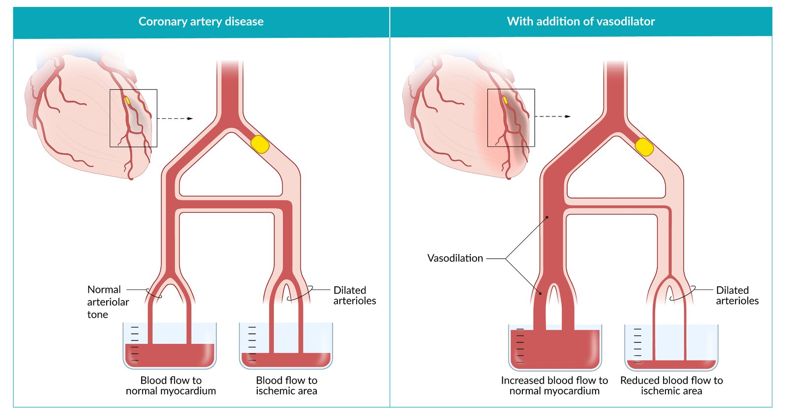
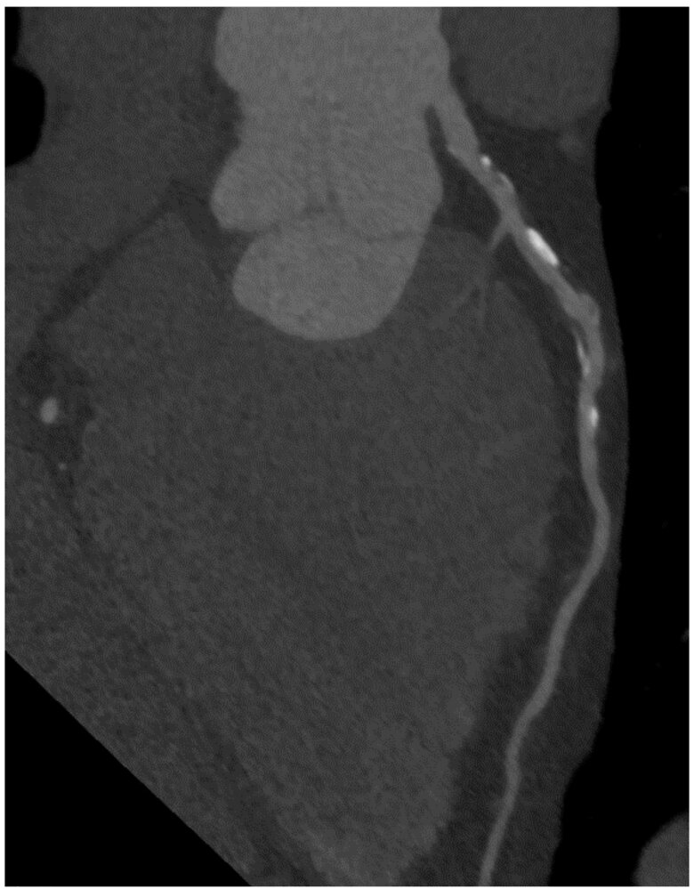
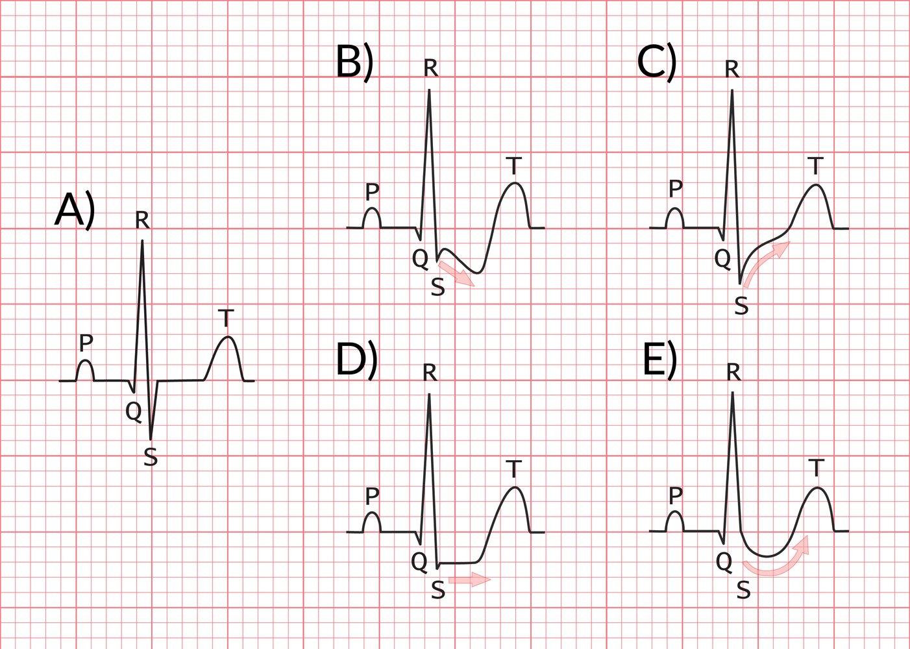
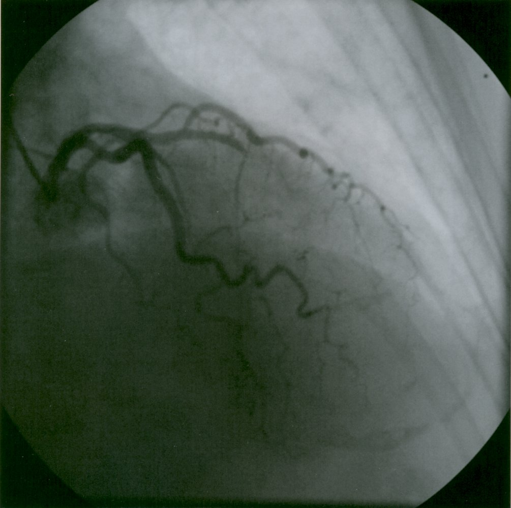
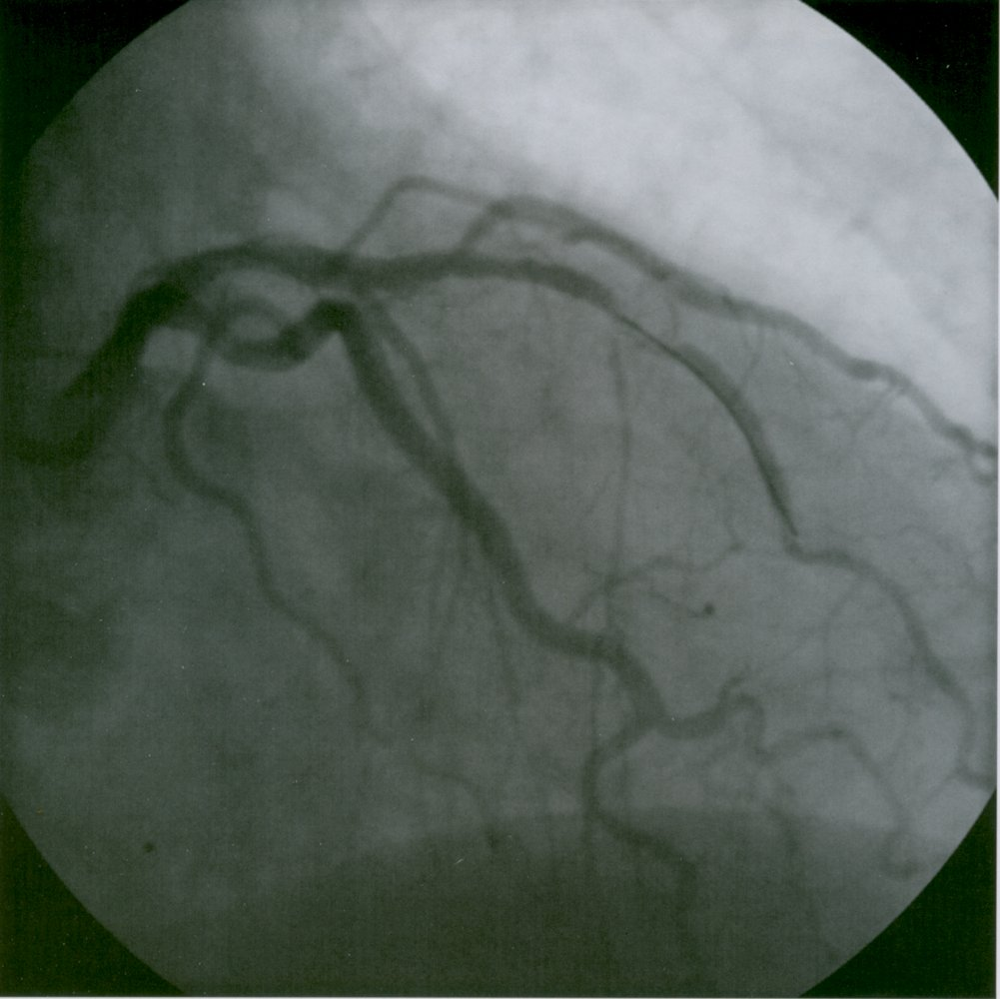
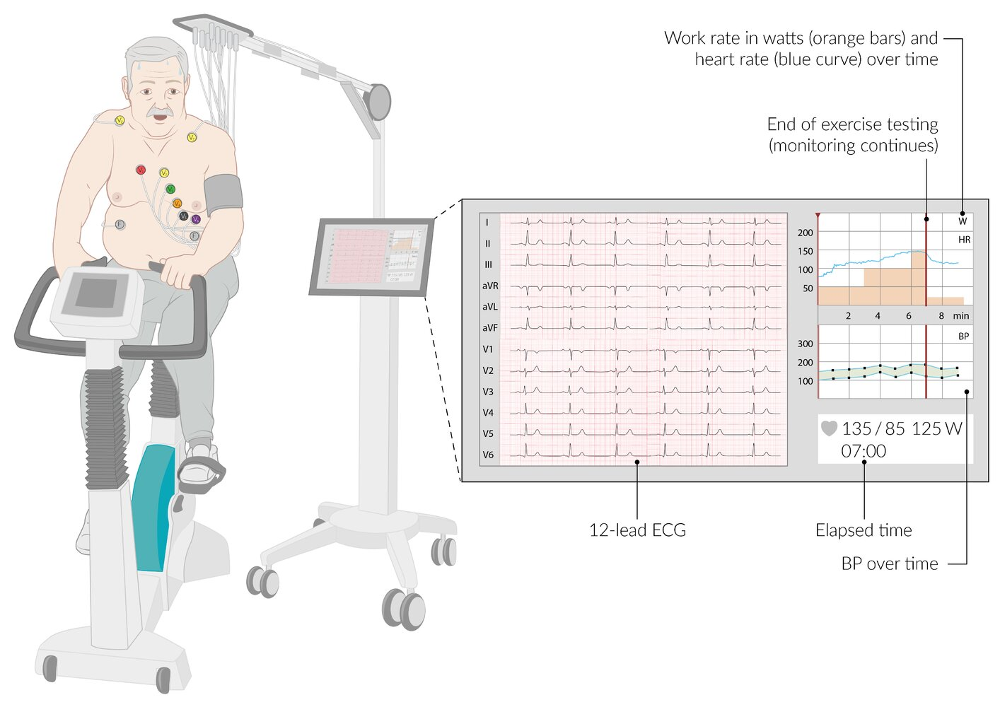
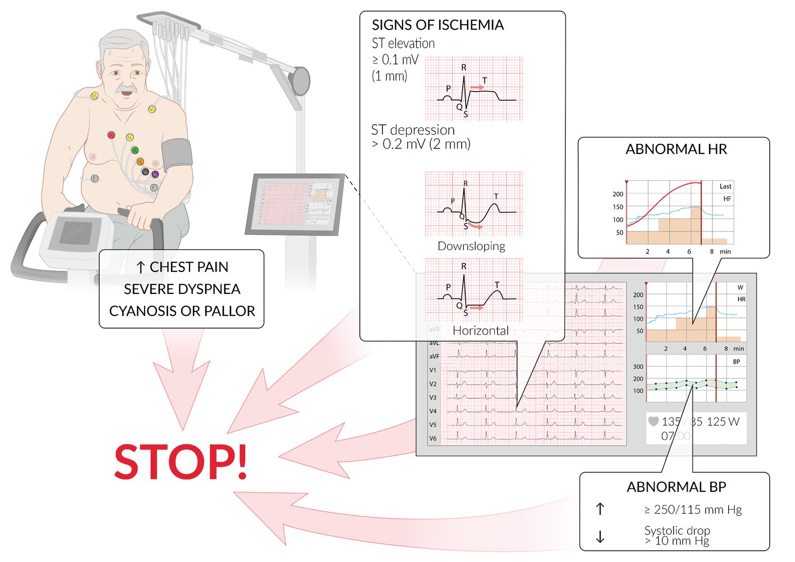

# Coronary artery disease

*Categories: Clinical knowledge > Family medicine > Cardiovascular disorders > Coronary artery disease*

[Original Article Link](https://coursology-qbank.com/amboss/article/DS01bf)

---

## Summary

<u>Coronary artery</u> disease (<u>CAD</u>) is characterized by the buildup of <u>atherosclerotic plaque</u> in the <u>coronary arteries</u>, leading to reduced <u>myocardial</u> blood flow and oxygen supply-demand mismatch. The cardinal symptom is retrosternal <u>chest pain</u> (<u>angina pectoris</u>), which may be accompanied by <u>dyspnea</u>, <u>diaphoresis</u>, <u>nausea</u>, and/or <u>pain</u> radiating to the <u>jaw</u> or left arm. Patients with <u>stable CAD</u> typically present with predictable, exertional <u>chest pain</u> that resolves with rest and/or <u>nitroglycerin</u>, while progression to <u>acute coronary syndrome</u> can result in <u>myocardial infarction</u> (<u>MI</u>). Diagnosis involves risk <u>stratification</u> using <u>pretest probability</u> assessment followed by testing: <u>coronary CT angiography</u> (<u>CCTA</u>) for patients under 65 years of age with intermediate-to-high <u>pretest probability</u>, or <u>cardiac stress testing</u> for older patients or those unable to undergo <u>CCTA</u>. Management includes comprehensive cardiovascular risk reduction (<u>smoking cessation</u>, <u>diabetes</u> and <u>hypertension management</u>, lipid optimization), <u>antiplatelet therapy</u>, antianginal treatment (e.g., with <u>beta blockers</u>), and <u>revascularization</u> with <u>percutaneous coronary intervention</u> (<u>PCI</u>) or <u>coronary artery bypass grafting</u> (<u>CABG</u>) for high-risk anatomic lesions or refractory symptoms despite optimal medical therapy.

For approaches to <u>acute chest pain</u>, see “<u>Acute coronary syndrome</u>” and “<u>Chest pain</u>.” See “<u>Chronic coronary disease</u>” for details on other causes of <u>stable ischemic heart disease</u> (IHD), including diagnosis and management of <u>ischemia with nonobstructive coronary arteries</u>.

---

## Definitions

### <u>Coronary artery</u> disease

* <u>Coronary artery</u> disease (<u>CAD</u>)

* A type of IHD caused by atherosclerotic changes to <u>coronary arteries</u>

* Can reduce <u>myocardial</u> blood supply, causing <u>myocardial</u> <u>ischemia</u> [[1]](https://coursology-qbank.com/amboss/article/OS1I-T0)

* <u>Stable CAD</u>: a non-acute form of IHD that causes reversible <u>myocardial</u> <u>ischemia</u>; often used synonymously with “<u>chronic coronary disease</u>” (CCD)  [[2]](https://coursology-qbank.com/amboss/article/z9drJH0)[[3]](https://coursology-qbank.com/amboss/article/50Xig9)

* Obstructive CAD: typically defined as the presence of a ≥ 50% atherosclerotic <u>coronary artery stenosis</u> [[1]](https://coursology-qbank.com/amboss/article/OS1I-T0)

* Nonobstructive <u>CAD</u>: typically defined as atherosclerotic changes to <u>coronary arteries</u> without stenosis above 50% [[1]](https://coursology-qbank.com/amboss/article/OS1I-T0)

### <u>Chest pain</u> and <u>angina</u> [[1]](https://coursology-qbank.com/amboss/article/OS1I-T0)[[4]](https://coursology-qbank.com/amboss/article/3tXSW-)[[5]](https://coursology-qbank.com/amboss/article/1612P30)

#### Preferred terminology for <u>causes of chest pain</u> or discomfort

The patient's description of their symptoms may be used to inform the suspected cause of <u>chest pain</u> and the <u>probability</u> of cardiac <u>ischemia</u> on a spectrum from low to high <u>probability</u>.

* Cardiac: likely associated with cardiac <u>ischemia</u> based on symptom description (e.g., central, retrosternal, squeezing, pressure, exertional)

* Possible cardiac: may be associated with cardiac <u>ischemia</u> based on symptom description (e.g., stabbing, tearing, ripping, burning)

* Noncardiac: unlikely to be associated with cardiac <u>ischemia</u> based on symptom description (e.g., pleuritic, positional, fleeting)

#### Historical terminology for types of <u>chest pain</u>

Use of the following terms is no longer recommended.  [[1]](https://coursology-qbank.com/amboss/article/OS1I-T0)[[4]](https://coursology-qbank.com/amboss/article/3tXSW-)[[5]](https://coursology-qbank.com/amboss/article/1612P30)

* Typical angina fulfills all of the following criteria:

* Retrosternal <u>chest pain</u> of characteristic nature and duration (e.g., transient retrosternal pressure)

* Provoked by exertion or emotional <u>stress</u>

* Relieved by rest and/or <u>nitroglycerin</u>

* Atypical angina: fulfills only two of the above criteria

* Nonanginal chest pain: fulfills one or none of the above criteria

---

## Epidemiology

* <u>CAD</u> is the leading <u>cause of death</u> in the US and worldwide. [[6]](https://coursology-qbank.com/amboss/article/5hYieK)

* The lifetime risk of <u>coronary artery</u> disease at age 50 is approx. 50% for men and 40% for women. [[7]](https://coursology-qbank.com/amboss/article/G8YBLI)

Epidemiological data refers to the US, unless otherwise specified.

---

## Etiology

* <u>CAD</u> is caused by <u>atherosclerosis</u>.

* See “<u>Risk factors for atherosclerosis</u>.”

---

## Pathophysiology

### <u>Plaque</u> formation and coronary artery stenosis [[8]](https://coursology-qbank.com/amboss/article/3w0SiR)[[9]](https://coursology-qbank.com/amboss/article/Rw0liR)

* For <u>plaque</u> formation, see “<u>Pathogenesis of atherosclerosis</u>.”

* Stable atherosclerotic <u>plaque</u> → vascular stenosis → increased resistance to blood flow in the <u>coronary arteries</u> → decreased <u>myocardial</u> blood flow → oxygen supply-demand mismatch → <u>myocardial</u> <u>ischemia</u>

* The extent of coronary stenosis determines the severity of the oxygen supply-demand mismatch and, thus, the severity of <u>myocardial</u> <u>ischemia</u>.

* Severe <u>ischemia</u> results in <u>MI</u> (see “<u>Acute coronary syndrome</u>”).

* Coronary flow reserve (<u>CFR</u>): the difference between maximum coronary blood flow and coronary flow at rest (denoting the ability of the coronary <u>capillaries</u> to dilate and increase blood flow to the <u>myocardium</u>)

* Expressed as a <u>ratio</u> of <u>hyperemic</u> blood flow to blood flow at rest

* Serves as a marker for <u>microvascular</u> function

* In healthy individuals, the <u>CFR</u> can be up to 4 times higher on exertion than at rest.

* <u>CFR</u> is reduced in individuals with <u>CAD</u> due to vascular stenosis and reduced <u>vascular compliance</u>.

Pathogenesis of atherosclerosis

Types of plaques in coronary artery disease

### Effect of vascular stenosis on resistance to blood flow [[10]](https://coursology-qbank.com/amboss/article/5fYi5o)

* The resistance to blood flow within the <u>coronary arteries</u> is calculated using the <u>Poiseuille equation</u>: R = 8Lη/(πr4), where R = resistance to flow, L = length of the vessel, η = viscosity of blood, and r = radius of the vessel.

* Provided the length of the vessel and viscosity of blood remain constant; , the degree of resistance can be calculated using the simplified formula: R ≈ 1/r4

> [!NOTE]
> Vascular stenosis increases <u>vascular resistance</u> significantly. For example, a 50% reduction in radius results in a 16-fold increase in resistance: R ≈ 1/(0.5 x r)4= [1/(0.5 x r)]4 = (2/r)4= 16/r4.

### <u>Myocardial</u> oxygen supply-demand mismatch [[11]](https://coursology-qbank.com/amboss/article/b3YHSK)

* Definition: mismatch between the amount of oxygen the <u>myocardium</u> receives and the amount it requires

* Factors reducing oxygen supply

* Coronary <u>atherosclerosis</u> ;  and sequelae, including:

* Rupture of an unstable <u>atherosclerotic plaque</u> (most common cause)

* <u>Thrombosis</u>

* Stenosis

* Vasospasms

* ↑ <u>Heart rate</u>

* <u>Anemia</u>

* Factors increasing oxygen demand (e.g., during physical exertion or <u>stress</u>, or in chronic <u>hypertension</u>)

* ↑ <u>Heart rate</u>

* ↑ <u>Afterload</u>

* <u>Anemia</u>

> [!TIP]
> An increased <u>heart rate</u> reduces oxygen supply and increases oxygen demand.

### <u>Myocardial</u> <u>ischemia</u> [[11]](https://coursology-qbank.com/amboss/article/b3YHSK)

* Reversible <u>ischemia</u>: Tissue is <u>ischemic</u> but still potentially salvageable.

* Myocardial stunning: acutely <u>ischemic</u> <u>myocardial</u> segments with transiently impaired but completely reversible contractility

* Hibernating myocardium: a state in which <u>myocardial</u> tissue has persistently impaired contractility due to repetitive or persistent <u>ischemia</u>

* Partially or completely reversible when adequate oxygen supply is restored (e.g., after <u>coronary revascularization</u>)

* Seen in <u>angina pectoris</u>, <u>left ventricular dysfunction</u>, and/or <u>heart failure</u>

* Irreversible <u>ischemia</u>: tissue <u>necrosis</u> (<u>myocardial</u> scars)

### Coronary steal syndrome

* Definition: a phenomenon of <u>vasodilator</u>-induced alteration of coronary blood flow in patients with coronary <u>atherosclerosis</u> resulting in <u>myocardial</u> <u>ischemia</u> and symptoms of <u>angina</u>

* Pathomechanism  

* Long-standing <u>CAD</u> requires maximal coronary arterial dilation <u>distal</u> to the stenosis to maintain normal <u>myocardial</u> function.

* In <u>CAD</u>, the affected <u>coronary artery</u> is maximally dilated <u>distal</u> to the stenosis to compensate for the reduced blood flow .

* If a <u>vasodilator</u> (e.g., <u>dipyridamole</u>) is administered, the subsequent <u>vasodilation</u> of healthy vessels causes these to “steal” blood from the stenotic <u>blood vessels</u>, resulting in poststenotic <u>myocardial</u> <u>ischemia</u>.

* Clinical relevance

* <u>Coronary steal</u> is the underlying mechanism of <u>pharmacological stress testing</u>.

* Administration of <u>vasodilators</u> (e.g., <u>dipyridamole</u>) → coronary <u>vasodilation</u> → decreased <u>hydrostatic pressure</u> in the normal <u>coronary arteries</u> → blood shunting back to well-<u>perfused</u> <u>myocardium</u> → decreased flow to the <u>ischemic</u> <u>myocardium</u> → <u>myocardial</u> <u>ischemia</u> downstream to the pathologically dilated vessels → <u>angina pectoris</u> and/or <u>ECG</u> changes

> [!NOTE]
> <u>Coronary steal syndrome</u> should not be confused with <u>coronary-subclavian steal syndrome</u>.

Coronary steal syndrome

---

## Clinical features

### <u>Angina</u> and <u>anginal equivalents</u>

<u>Angina pectoris</u> is the cardinal symptom of <u>CAD</u> but may be absent, especially in older patients and patients with <u>diabetes mellitus</u>. [[1]](https://coursology-qbank.com/amboss/article/OS1I-T0)[[12]](https://coursology-qbank.com/amboss/article/i0XJf9)

#### Angina pectoris [[1]](https://coursology-qbank.com/amboss/article/OS1I-T0)

* <u>Paroxysmal</u> attacks of retrosternal <u>chest pain</u>, pressure, discomfort, or tightness caused by <u>myocardial</u> <u>ischemia</u>

* Common triggers include physical and/or mental <u>stress</u> and exposure to cold.

* Typical characteristics include:

* No <u>chest wall</u> tenderness

* Gradual increase in intensity

* Radiates to adjacent areas (e.g., left arm, neck, <u>jaw</u>,;  epigastric region, and/or back)

* Not affected by body position or respiration

* Typically triggered by exertion or <u>stress</u> but can occur at rest

#### Anginal equivalents [[1]](https://coursology-qbank.com/amboss/article/OS1I-T0)[[4]](https://coursology-qbank.com/amboss/article/3tXSW-)[[13]](https://coursology-qbank.com/amboss/article/N8X-5-)

* Symptoms of <u>myocardial</u> <u>ischemia</u> other than <u>chest pain</u>

* Women are more likely than men to present with accompanying symptoms. [[1]](https://coursology-qbank.com/amboss/article/OS1I-T0)

* Possible manifestations include:

* Gastrointestinal discomfort

* <u>Dyspnea</u>

* <u>Dizziness</u>, <u>palpitations</u>

* Restlessness, <u>anxiety</u>

* Autonomic symptoms (e.g., <u>diaphoresis</u>, <u>nausea</u>, <u>vomiting</u>, <u>syncope</u>)

* Acute <u>delirium</u> and/or unexplained falls in patients > 75 years of age

### Stable angina [[1]](https://coursology-qbank.com/amboss/article/OS1I-T0)[[14]](https://coursology-qbank.com/amboss/article/OCdIHH0)

* Symptoms are reproducible.

* Severity, frequency, and threshold for the reproduction of symptoms are predictable.

* Symptoms often subside within minutes with rest and/or administration of <u>nitroglycerin</u>  [[1]](https://coursology-qbank.com/amboss/article/OS1I-T0)

---

## Diagnosis

The following recommendations apply to patients with no history of <u>CAD</u> who present with symptoms consistent with chronic <u>stable angina</u>. For evaluation of <u>unstable angina</u> (e.g., new or worsening <u>chest pain</u>), see “<u>Diagnosis of ACS</u>.”

### Approach [[1]](https://coursology-qbank.com/amboss/article/OS1I-T0)[[4]](https://coursology-qbank.com/amboss/article/3tXSW-)[[16]](https://coursology-qbank.com/amboss/article/b1dH2K0)

* Perform a clinical evaluation.

* Obtain a resting <u>ECG</u>.

* Determine the <u>pretest probability (PTP) for obstructive CAD</u>.

* Additional diagnostic testing is based on the <u>PTP</u> of <u>CAD</u>.

> [!TIP]
> <u>Physical examination</u> findings may be normal in patients with <u>CAD</u>.

### Clinical evaluation [[1]](https://coursology-qbank.com/amboss/article/OS1I-T0)

* Obtain focused <u>patient history</u>.

* Determine the nature and frequency of symptoms, including <u>angina</u> episodes.

* Assess for symptoms of <u>ischemia</u> other than <u>chest pain</u> (e.g., <u>anginal equivalents</u>).

* Identify <u>ASCVD risk factors</u>.

* Perform a <u>physical examination</u> to assess for:

* <u>Clinical features of peripheral vascular disease</u>

* <u>Clinical features of heart failure</u>

* Features of <u>valvular heart diseases</u>

### Resting <u>ECG</u> [[1]](https://coursology-qbank.com/amboss/article/OS1I-T0)[[3]](https://coursology-qbank.com/amboss/article/50Xig9)

* Indication: all patients with <u>angina</u> or <u>anginal equivalents</u> [[1]](https://coursology-qbank.com/amboss/article/OS1I-T0)

* Goal: assess for <u>ischemic ECG changes</u>

* Findings

* Usually normal in <u>stable angina</u>

* Absence of <u>ischemic</u> changes does not rule out underlying <u>ischemia</u> (e.g., an <u>uninterpretable ECG</u> can mask <u>ischemic</u> changes).

> [!TIP]
> Patients with obvious noncardiac <u>chest pain</u> (e.g., <u>herpes zoster</u>, <u>rib fracture</u>) and reassuring <u>ECG</u> do not require further cardiac testing. [[1]](https://coursology-qbank.com/amboss/article/OS1I-T0)

> [!WARNING]
> Initiate immediate <u>diagnosis of ACS</u> in patients with <u>ischemic ECG changes</u> consistent with acute <u>ischemia</u>.

### Assessment of pretest probability for obstructive CAD [[1]](https://coursology-qbank.com/amboss/article/OS1I-T0)[[17]](https://coursology-qbank.com/amboss/article/QtXuW-)

Models and scores to estimate <u>PTP for obstructive CAD</u> include:

* <u>Extended CAD consortium model</u>

* <u>PTP</u> model for <u>obstructive CAD</u>

#### <u>PTP</u> model for <u>obstructive CAD</u> based on age, sex, and symptoms [[1]](https://coursology-qbank.com/amboss/article/OS1I-T0)

|  <u>PTP</u> model for <u>obstructive CAD</u> [[1]](https://coursology-qbank.com/amboss/article/OS1I-T0)  |  |  |  |  |
| --- | --- | --- | --- | --- |
| Age | Men |  | Women |  |
|  | <u>Chest pain</u> | <u>Dyspnea</u> | <u>Chest pain</u> or <u>dyspnea</u> |  |
| 30–39 years | Low <u>PTP</u>   | Low <u>PTP</u>  | Low <u>PTP</u>  |  |
| 40–49 years | Intermediate <u>PTP</u>   |  |  |  |
| 50–59 years | Intermediate <u>PTP</u>  |  |  |  |
| 60–69 years | Intermediate <u>PTP</u>  |  |  |  |
| ≥ 70 years | High <u>PTP</u>   |  |  |  |

#### Other factors that independently increase <u>PTP</u> [[4]](https://coursology-qbank.com/amboss/article/3tXSW-)

* Presence of <u>traditional ASCVD risk factors</u> (e.g., <u>diabetes mellitus</u>)

* Concerning <u>ECG</u> findings (e.g., <u>Q waves</u> that suggest prior <u>infarction</u>)

* Previously documented <u>coronary artery</u> <u>calcium</u> (CAC) scores or visual estimation of CAC on prior noncardiac chest CT [[1]](https://coursology-qbank.com/amboss/article/OS1I-T0)

### Approach to sequential diagnostic testing [[1]](https://coursology-qbank.com/amboss/article/OS1I-T0)

#### Patients with low <u>PTP of obstructive CAD</u>

* Cardiac testing is not routinely recommended.

* Studies considered in select patients 

* <u>CAC scoring</u> (to rule out <u>CAD</u>)

* <u>Exercise ECG testing</u> (to rule out <u>myocardial</u> <u>ischemia</u>)

> [!TIP]
> Additional cardiac testing is not routinely recommended in patients with a low <u>PTP for obstructive CAD</u>. [[1]](https://coursology-qbank.com/amboss/article/OS1I-T0)

#### Patients with intermediate to high <u>PTP of obstructive CAD</u>

* Initial test

* <u>CCTA</u>: preferred for patients aged < 65 years, if less <u>obstructive CAD</u> is suspected, or if <u>stress</u> testing is contraindicated

* OR <u>cardiac stress testing</u>: preferred for patients aged ≥ 65 years, if more <u>obstructive CAD</u> is suspected, or if <u>CCTA</u> is contraindicated

* <u>Stress</u> imaging is usually preferred.

* <u>Stress ECG</u> testing may be reasonable in the absence of an <u>uninterpretable ECG</u>.

* Subsequent testing

* If <u>CCTA</u> or <u>cardiac stress test</u> results indicate <u>CAD</u>: Obtain <u>invasive coronary angiography</u> to confirm diagnosis.

* If <u>CCTA</u> is inconclusive: Consider <u>stress</u> imaging.

* If <u>cardiac stress testing</u> results are inconclusive or negative despite persistent symptoms:

* Consider <u>CCTA</u>.

* <u>Coronary angiography</u> may be considered if there is high clinical suspicion for <u>CAD</u>.

* Intermediate to high <u>PTP</u> with concerning <u>ECG</u> findings, <u>signs of heart failure</u>, or <u>heart murmur</u>: Consider <u>TTE</u> to evaluate <u>LVEF</u> and assess for other cardiac abnormalities.

> [!TIP]
> <u>Exercise stress testing</u> is preferred over <u>pharmacological stress testing</u> in patients who can exercise.

### Diagnostic tests

The following tests can be used to diagnose <u>CAD</u> and/or assess risk for cardiac events.

#### <u>CAC score</u> [[1]](https://coursology-qbank.com/amboss/article/OS1I-T0)[[18]](https://coursology-qbank.com/amboss/article/Urdbgr0)

* Use: measures the amount of calcification in the <u>coronary arteries</u>

* Indications

* May be considered in select patients with low <u>PTP for obstructive CAD</u> to rule out <u>CAD</u>

* May be used in patients who have intermediate to high <u>PTP for obstructive CAD</u> and are undergoing <u>stress</u> testing

* Interpretation: A score of 0 in patients with low <u>PTP for obstructive CAD</u> can eliminate the need for further testing.

#### <u>CCTA</u> [[1]](https://coursology-qbank.com/amboss/article/OS1I-T0)

* Use: visualizes <u>coronary artery</u> anatomy

* Indication

* Symptomatic patients with intermediate to high <u>PTP for obstructive CAD</u> (to support diagnosis, <u>stratify</u> risk, and/or guide treatment decisions)

* Select asymptomatic patients with high risk for <u>CAD</u> [[19]](https://coursology-qbank.com/amboss/article/rcdfdK0)

* Findings in <u>CAD</u>  [[20]](https://coursology-qbank.com/amboss/article/yEXdy-)

* May show calcified or noncalcified <u>plaques</u>

* May show coronary stenosis

Calcified and noncalcified coronary artery plaques

#### <u>Cardiac stress testing</u> [[1]](https://coursology-qbank.com/amboss/article/OS1I-T0)

See “<u>Cardiac stress testing</u>” for procedure details.

* Indications

* Intermediate to high <u>PTP for obstructive CAD</u>

* May be considered in select patients with low <u>PTP for obstructive CAD</u> to rule out <u>myocardial</u> <u>ischemia</u>

* Findings suggesting <u>CAD</u> [[3]](https://coursology-qbank.com/amboss/article/50Xig9)

* <u>Stress ECG</u>

* <u>Downsloping ST depression</u> or <u>horizontal ST depression</u> of ≥ 0.1 mV (1 mm) at peak exercise intensity

* <u>ST elevation</u> of ≥ 0.1 mV (1 mm) in leads with no preexisting <u>Q waves</u> (except in V1 or aVR) : high-risk <u>ECG</u> finding consistent with <u>acute coronary syndrome</u>

* <u>STEMI-equivalent ECG findings</u>

* <u>Stress echocardiography</u>

* New or worsening wall motion abnormalities

* Changes in <u>global</u> <u>left ventricular</u> function

* <u>Stress myocardial perfusion imaging</u>: decreased <u>myocardial</u> <u>perfusion</u>

* <u>Stress CMR</u>: new wall motion abnormality or <u>perfusion</u> abnormality

Types of ST segment depression

#### <u>Invasive coronary angiography</u> [[1]](https://coursology-qbank.com/amboss/article/OS1I-T0)[[16]](https://coursology-qbank.com/amboss/article/b1dH2K0)

See “<u>Cardiac catheterization</u>” for details on procedure and other indications.

* Indications

* May be considered in select patients with abnormal noninvasive cardiac testing results, e.g.:

* <u>Obstructive CAD</u> on <u>CCTA</u> and one or more of the following:

* Frequent symptoms

* High-risk <u>CAD</u> (e.g., significant left main disease)

* Additional findings (e.g., moderate to severe <u>ischemia</u> on <u>stress</u> testing)

* Moderate-severe <u>ischemia</u> on <u>stress</u> testing and persistent symptoms of <u>ischemia</u> despite appropriate therapy

* May be considered if clinical suspicion for <u>CAD</u> is high despite negative or inconclusive results on <u>stress</u> imaging

* Uses

* Direct visualization of <u>coronary arteries</u>

* Determine feasibility of <u>PCI</u>

* Interpretation  [[3]](https://coursology-qbank.com/amboss/article/50Xig9)

* Extent of disease is reported as either the number of involved vessels (1-, 2-, or <u>3-vessel disease</u>) or involvement of the <u>left main coronary artery</u> (<u>LMCA</u>).

* Significant coronary artery stenosis is usually defined as one of the following:

* ≥ 50% narrowing of the <u>LMCA</u>

* ≥ 70% narrowing of other <u>coronary arteries</u> (e.g., <u>RCA</u>, <u>LCX</u>, <u>LAD</u>)

> [!WARNING]
> <u>Cardiac catheterization</u> is indicated in patients with <u>acute chest pain</u> and other concerning clinical findings (e.g., <u>hypotension</u>) or <u>ECG</u> changes that suggest <u>acute coronary syndrome</u> (e.g., new <u>heart blocks</u> or <u>arrhythmias</u>).

> [!TIP]
> Other indications for <u>invasive coronary angiography</u> include known CCD with any of the following: either worsening symptoms or functional capacity despite optimized management, new <u>LV dysfunction</u>, and/or new <u>heart failure</u>. [[1]](https://coursology-qbank.com/amboss/article/OS1I-T0)[[16]](https://coursology-qbank.com/amboss/article/b1dH2K0)

Coronary angiography (1/2)

Coronary angiography (2/2)

Illustration of coronary angiography; right coronary artery (RCA)

Illustration of coronary angiography; left coronary artery (LCA)

---

## Cardiac stress testing

### Description [[1]](https://coursology-qbank.com/amboss/article/OS1I-T0)[[3]](https://coursology-qbank.com/amboss/article/50Xig9)[[4]](https://coursology-qbank.com/amboss/article/3tXSW-)[[21]](https://coursology-qbank.com/amboss/article/vtXA2-)[[22]](https://coursology-qbank.com/amboss/article/DtX1f-)[[23]](https://coursology-qbank.com/amboss/article/3CXS7Z0)

* The goal is to detect evidence of <u>stress</u>-induced <u>ischemia</u>.

* <u>Heart rate</u> is monitored throughout the study [[24]](https://coursology-qbank.com/amboss/article/r8XfL-)

* Estimated maximum <u>heart rate</u> = 220 – age (in years)

* Target <u>heart rate</u> = 85% of the <u>maximum heart rate</u>

* 12-lead <u>ECG</u> is used for monitoring throughout the study.

> [!TIP]
> Achievement of 85% of the patient's estimated <u>maximum heart rate</u>, no exaggerated BP response, and no <u>ST-segment</u> abnormalities during <u>exercise stress testing</u> confer a low <u>probability</u> of <u>CAD</u> (i.e., a normal test). [[25]](https://coursology-qbank.com/amboss/article/1CX2IZ0)

### Types of <u>stress</u> induction

* <u>Exercise stress tests</u> (e.g., treadmill or bicycle): first-line  [[17]](https://coursology-qbank.com/amboss/article/QtXuW-)[[23]](https://coursology-qbank.com/amboss/article/3CXS7Z0)

* <u>Pharmacological stress tests</u> (e.g., <u>vasodilator</u> or <u>inotropic</u> medication): alternative in patients unable to exercise [[4]](https://coursology-qbank.com/amboss/article/3tXSW-)

|  Comparison of <u>cardiac stress tests</u> [[1]](https://coursology-qbank.com/amboss/article/OS1I-T0)[[3]](https://coursology-qbank.com/amboss/article/50Xig9)[[4]](https://coursology-qbank.com/amboss/article/3tXSW-)[[17]](https://coursology-qbank.com/amboss/article/QtXuW-)[[21]](https://coursology-qbank.com/amboss/article/vtXA2-)  |  |  |  |
| --- | --- | --- | --- |
| Test characteristics |  | Cardiac exercise stress test | Cardiac pharmacological stress test |
| Procedure |  |   * <u>Stress</u> is induced by exercise on a treadmill or bicycle.  * Duration varies by protocol (e.g., <u>Bruce protocol</u>).   [[25]](https://coursology-qbank.com/amboss/article/1CX2IZ0)  * Metabolic equivalents (<u>METs</u>): A measure of <u>energy expenditure</u> used to estimate exercise tolerance. [[23]](https://coursology-qbank.com/amboss/article/3CXS7Z0)  * 1 <u>MET</u> = 3.5 mL O2/kg/minute  * Approx. 5 <u>METs</u> are required to fulfill everyday activities, such as climbing a flight of stairs.    |  * <u>Stress</u> is induced by substances that simulate the effect of exercise on the <u>myocardium</u>:  * Positive <u>inotropes</u> or <u>chronotropes</u> (e.g., <u>dobutamine</u>)  * <u>Vasodilators</u> (e.g., <u>dipyridamole</u>, <u>adenosine</u>, or <u>regadenoson</u>)   |
|  Typical modalities [[4]](https://coursology-qbank.com/amboss/article/3tXSW-)  |  |   * Exercise ECG testing: <u>ECG</u> is used to assess <u>ischemia</u>  * OR exercise stress imaging: cardiac (e.g., <u>echocardiography</u>, <u>radionuclide myocardial perfusion imaging</u>, or <u>CMR</u>) are used to assess <u>ischemia</u>    |   * One of the following imaging modalities:  * <u>Echocardiography</u>  * Radionuclide myocardial perfusion imaging: a <u>nuclear scan</u> that uses a radioactive tracer to evaluate <u>myocardial</u> viability, detect <u>ischemia</u>, and assess <u>perfusion</u> and LV function  * <u>CMR</u>  * <u>ECG</u> monitoring is typically added to <u>cardiac imaging</u>    |
| Contraindications |  |   * Physical impairment to exercise  * Hemodynamically significant <u>arrhythmias</u>  * <u>Unstable angina</u> or acute <u>MI</u> (within the past 2 days)  * Symptomatic <u>severe aortic stenosis</u>  * Acute <u>heart</u> disease: e.g., active <u>endocarditis</u>, acute <u>myocarditis</u> or <u>pericarditis</u>, <u>decompensated heart failure</u>    |   * If using <u>dobutamine</u>: obstructive <u>cardiomyopathy</u>, <u>aortic dissection</u>, <u>tachyarrhythmias</u>  * If using <u>adenosine</u>, <u>regadenoson</u>, or <u>dipyridamole</u>:  * Active <u>bronchospasm</u> or <u>reactive airway disease</u>  * Low systolic BP (< 90 mm Hg)  * <u>Second-degree AV block</u>, <u>third-degree AV block</u>, or sinus node disease in patients without a pacemaker  * Systolic blood pressure (BP) > 200 mm Hg or <u>diastolic</u> BP > 110 mm Hg  * <u>Unstable angina</u>, <u>acute coronary syndrome</u>, and being within 2–4 days of <u>MI</u>    |
|  Specific criteria for test termination    | Clinical |   * <u>Cyanosis</u>, <u>pallor</u>, <u>ataxia</u>, <u>dizziness</u>, or near-<u>syncope</u>  * Severe <u>dyspnea</u>  * Moderate to severe <u>angina</u>  * Decrease in systolic BP > 10 mm Hg below the patient's resting BP with other signs of <u>ischemia</u>  * Consider in patients with an exaggerated hypertensive response (relative indication).    |   * <u>Wheezing</u>, <u>cyanosis</u>, <u>pallor</u>  * Systolic BP < 80 mm Hg  * For <u>dobutamine</u> only:  * Exaggerated hypertensive response  * Systolic BP > 230 mm Hg  * OR <u>diastolic</u> BP > 115 mm Hg  * Target <u>heart rate</u> exceeded    |
| <u>ECG</u> |  * Consider if excessive <u>downsloping ST depression</u> or <u>horizontal ST depression</u> of > 0.2 mV (2 mm) is detected.   |   * <u>Chest pain</u> with excessive <u>downsloping ST depression</u> or <u>horizontal ST depression</u> of > 0.2 mV (2 mm) at any point  * Symptomatic <u>second-degree AV block</u> or <u>third-degree AV block</u>    |  |

Types of ST segment depression

Exercise ECG testing (stationary bicycle)

Indications for early termination of exercise ECG testing

### Test preparation

* Hold <u>methylxanthines</u> (e.g., <u>caffeine</u>, aminophylline) for 12 hours prior to testing (no need to hold for <u>dobutamine</u> testing).

* Hold <u>dipyridamole</u> for 48 hours prior to <u>adenosine</u> and <u>regadenoson</u> <u>stress</u> tests.

* <u>Beta blockers</u>, <u>CCBs</u>, and <u>nitrates</u> can affect diagnostic value and may be held prior to testing at the treating clinician's discretion. [[25]](https://coursology-qbank.com/amboss/article/1CX2IZ0)

### General criteria for test termination

Some clinical and <u>ECG</u> criteria vary between <u>exercise stress tests</u> and <u>pharmacological stress tests</u> (see “Comparison of <u>cardiac stress tests</u>” for details). General criteria include the following:

* A diagnostic <u>endpoint</u> is reached (preferred).  [[17]](https://coursology-qbank.com/amboss/article/QtXuW-)[[24]](https://coursology-qbank.com/amboss/article/r8XfL-)[[25]](https://coursology-qbank.com/amboss/article/1CX2IZ0)

* A target <u>heart rate</u> threshold is achieved (i.e., if no diagnostic <u>endpoint</u> is reached)

* Significant <u>cardiac arrhythmia</u>

* Technical issues with patient monitoring

* Patient request

---

## Differential diagnoses

See “<u>Differential diagnosis of chest pain</u>.”

The differential diagnoses listed here are not exhaustive.

---

## Management

The following content applies to patients with diagnosed <u>CAD</u>. See “<u>ACS management</u>” for patients with acute symptoms and "<u>Prevention of recurrent myocardial infarction</u>" for further details on pharmacological treatment in the 12 months post-<u>ACS</u>.

### Approach [[16]](https://coursology-qbank.com/amboss/article/b1dH2K0)[[26]](https://coursology-qbank.com/amboss/article/mycVfU0)

* Start <u>antianginal therapy</u> as necessary.

* For all patients, initiate measures to prevent cardiovascular events, including:

* <u>Lifestyle modifications for ASCVD prevention</u>

* <u>Antiplatelet therapy</u>

* Lipid-lowering therapy

* <u>Colchicine</u> therapy may be considered.

* Manage comorbidities.

* Consider <u>coronary artery revascularization</u> for select patients (e.g., patients with new LV <u>systolic dysfunction</u> and/or <u>heart failure</u>).

* Offer select patients <u>cardiac rehabilitation</u> (e.g., after <u>PCI</u> or <u>CABG</u>).

> [!TIP]
> All patients with <u>CAD</u> should receive education on <u>risk factor</u> reduction as well as treatment with <u>antiplatelet agents</u> and <u>statins</u>; <u>antianginal medications</u> are indicated if symptomatic. [[16]](https://coursology-qbank.com/amboss/article/b1dH2K0)

### Antianginal therapy for CAD [[16]](https://coursology-qbank.com/amboss/article/b1dH2K0)

* Short-term relief and/or prevention of exertional <u>angina</u>: short-acting <u>nitrates</u> (e.g., sublingual <u>nitroglycerin</u> DOSAGE)

* Longterm management

* First-line agents: 

* <u>Beta blockers</u> (e.g., <u>carvedilol</u> DOSAGE, <u>metoprolol</u> DOSAGE, <u>bisoprolol</u> DOSAGE)

* OR <u>CCBs</u> (e.g., <u>amlodipine</u> DOSAGE, <u>nifedipine</u> DOSAGE, <u>verapamil</u> DOSAGE)

* OR long-acting <u>nitrates</u> (e.g., <u>isosorbide dinitrate</u> DOSAGE, <u>isosorbide mononitrate</u> DOSAGE)

* If symptoms persist, begin combination therapy with a second first-line agent, i.e.:

* A <u>beta blocker</u> PLUS a long-acting <u>nitrate</u> or a <u>dihydropyridine CCB</u>

* A <u>CCB</u> PLUS a long-acting <u>nitrate</u>

* Consider <u>ranolazine</u>  DOSAGE if first-line agents are ineffective or not tolerated.

* Cautions

* <u>Nondihydropyridine CCBs</u> (e.g., <u>verapamil</u>) can worsen cardiac conduction and function in patients on <u>beta blockers</u> or with <u>LV dysfunction</u>. [[16]](https://coursology-qbank.com/amboss/article/b1dH2K0)

* Concomitant use of <u>nitrates</u> and <u>PDE-5 inhibitors</u> (e.g., <u>sildenafil</u>) can cause severe <u>hypotension</u>.

* Avoid partial <u>beta agonists</u> (e.g., <u>pindolol</u>, <u>acebutolol</u>) as their <u>sympathomimetic</u> activity can increase <u>MVO2</u>. [[3]](https://coursology-qbank.com/amboss/article/50Xig9)[[27]](https://coursology-qbank.com/amboss/article/OzaIGM)

> [!TIP]
> <u>Beta blockers</u> should only be given if there is a specific indication (e.g., post-<u>MI</u>, <u>angina pectoris</u>, or <u>LVEF</u> ≤ 50%). [[16]](https://coursology-qbank.com/amboss/article/b1dH2K0)

### Prevention of cardiovascular events [[16]](https://coursology-qbank.com/amboss/article/b1dH2K0)

<u>Coronary artery</u> disease is a type of <u>ASCVD</u>. See also “<u>Management of ASCVD</u>.”

#### General measures [[16]](https://coursology-qbank.com/amboss/article/b1dH2K0)

* <u>Age-appropriate immunizations</u> (e.g., <u>COVID-19 vaccination</u>, <u>pneumococcal vaccine</u>, and annual <u>influenza vaccination</u>)

* <u>Lifestyle modifications for ASCVD prevention</u>

* Diet emphasizing healthy plant-based foods and lean protein (e.g., <u>plant-based diet</u>)

* <u>Smoking cessation</u>

* Increased physical activity

* Limiting <u>alcohol</u> consumption

* <u>Obesity management</u> if indicated

* Minimizing exposure to <u>air pollution</u>

#### <u>Antiplatelet therapy</u> [[16]](https://coursology-qbank.com/amboss/article/b1dH2K0)

* Start single-agent <u>antiplatelet therapy</u> with either:

* <u>Aspirin</u>  DOSAGE (preferred) [[16]](https://coursology-qbank.com/amboss/article/b1dH2K0)

* OR <u>clopidogrel</u> DOSAGE (if <u>aspirin</u> is not tolerated)

* <u>Dual antiplatelet therapy</u> (<u>DAPT</u>) with <u>aspirin</u> and <u>clopidogrel</u>  for a limited time may be used if indicated (e.g., for 6 months after <u>PCI</u> followed by single <u>antiplatelet therapy</u>).

* <u>DAPT</u> may be extended in certain patients (e.g., 1–3 years after <u>MI</u> in patients with low bleeding risk).

* <u>Aspirin</u> PLUS <u>vorapaxar</u> may be considered in select patients with low <u>stroke</u> risk in consultation with a cardiologist

* <u>Aspirin</u> PLUS low-dose <u>DOAC</u> (e.g., <u>rivaroxaban</u> DOSAGE) can be considered for patients at high risk of <u>MACE</u> and low to moderate bleeding risk but no other indication for <u>DAPT</u> or therapeutic <u>DOAC</u>. [[16]](https://coursology-qbank.com/amboss/article/b1dH2K0)

* In patients on <u>DOAC</u> therapy who require <u>antiplatelet therapy</u>, consider treatment strategy based on bleeding risk and <u>thrombotic</u> risk in consultation with a cardiologist.

> [!WARNING]
> Long-term NSAIDS should not be used in patients with CCD, as they can increase cardiovascular complications.

> [!TIP]
> <u>Proton pump inhibitors</u> can reduce the risk of <u>GI bleeding</u> in patients on <u>DAPT</u>.

#### <u>Beta blockers</u> [[16]](https://coursology-qbank.com/amboss/article/b1dH2K0)

* Indication: patients with concurrent <u>LVEF</u> ≤ 40% (irrespective of history of prior <u>MI</u>)

* See "<u>Pharmacotherapy for heart failure</u>" for agents and dosages.

#### Lipid-lowering therapy [[16]](https://coursology-qbank.com/amboss/article/b1dH2K0)

* Start <u>high-intensity statin therapy</u>; aim to reduce <u>LDL</u>-C by ≥ 50%.

* Consider addition of <u>nonstatin lipid-lowering agents</u> (e.g., <u>ezetimibe</u>) in patients with both of the following:

* <u>Very high risk of future ASCVD events</u>

* Inadequate response to <u>statin</u> monotherapy

* Check lipids 4–12 weeks following dose adjustment and every 3–12 months thereafter.

* See “<u>Lipid-lowering therapy for ASCVD</u>” for details, including agents and dosages.

#### <u>RAAS inhibitor</u> therapy

* Indication: patients with co-occuring <u>hypertension</u>, <u>diabetes mellitus</u>, <u>LVEF</u> ≤ 40%, and/or <u>CKD</u>  [[16]](https://coursology-qbank.com/amboss/article/b1dH2K0)

* Preferred: <u>ACE inhibitors</u> (e.g., <u>lisinopril</u> DOSAGE, <u>ramipril</u> DOSAGE)

* Alternative (if <u>ACE inhibitors</u> are not tolerated): <u>angiotensin receptor blockers</u> (e.g., <u>losartan</u> DOSAGE, <u>valsartan</u> DOSAGE)

#### <u>Colchicine</u>

* <u>Colchicine</u> (<u>off-label</u>) DOSAGE may be considered in patients with high risk of <u>ASCVD</u> events despite adequate management.  [[16]](https://coursology-qbank.com/amboss/article/b1dH2K0)

* Monitor patients for adverse effects.

### Revascularization for stable CAD [[16]](https://coursology-qbank.com/amboss/article/b1dH2K0)[[26]](https://coursology-qbank.com/amboss/article/mycVfU0)

<u>Revascularization</u> is not routinely indicated for patients with <u>stable CAD</u>; tailor decisions with a multidisciplinary team (e.g., interventional cardiologists, cardiac surgeons).

* Indications

* Activity-limiting symptoms due to <u>significant coronary artery stenosis</u> despite optimized pharmacological treatment

* High-risk anatomic lesions, e.g.:

* Multivessel disease, especially in patients with <u>LVEF</u> ≤ 35%  [[16]](https://coursology-qbank.com/amboss/article/b1dH2K0)[[26]](https://coursology-qbank.com/amboss/article/mycVfU0)

* Significant <u>LMCA</u> stenosis

* May be considered for significant <u>3-vessel disease</u> in patients with normal <u>LVEF</u> [[26]](https://coursology-qbank.com/amboss/article/mycVfU0)

* Newly diagnosed <u>HFrEF</u> or clinical <u>heart failure</u> [[16]](https://coursology-qbank.com/amboss/article/b1dH2K0)

* Options   [[26]](https://coursology-qbank.com/amboss/article/mycVfU0)

* <u>CABG</u> is generally preferred in complex situations, e.g.:

* Significant <u>LMCA</u> stenosis or multivessel disease in patients with complex <u>CAD</u>

* Multivessel disease with <u>proximal</u> <u>LAD</u> involvement and concomitant <u>diabetes mellitus</u> [[28]](https://coursology-qbank.com/amboss/article/lFXvR-)

* <u>PCI</u> 

* May be preferred in patients with high surgical risk

* Reasonable alternative to <u>CABG</u> in select patients

> [!WARNING]
> <u>Revascularization</u> is harmful in patients who do not meet anatomical or physiological criteria for intervention.

Percutaneous transluminal coronary angioplasty (PTCA)

---

## Pharmacodynamics of antianginal medications

<u>Antianginal medications</u> relieve symptoms by reducing <u>myocardial oxygen demand</u> (<u>MVO2</u>);  and/or increasing <u>myocardial</u> blood supply. [[16]](https://coursology-qbank.com/amboss/article/b1dH2K0)

### <u>Beta blockers</u> and <u>nitrates</u>

| Physiologic effects |  |  |  |
| --- | --- | --- | --- |
|  | <u>Beta blockers</u> | <u>Nitrates</u> | Combination of a <u>beta blocker</u> and a <u>nitrate</u> |
| Blood pressure | ↓ | ↓ | ↓ |
| <u>Heart rate</u> | ↓ | ↑ (reflectory) | Unchanged or slightly ↓ |
| <u>Inotropy</u> (contractility) | ↓ | ↑ (reflectory) | Unchanged |
| Ejection time | ↑ | ↓ | Unchanged |
| <u>End-diastolic volume</u> | Unchanged or ↑ | ↓ | Unchanged or slightly ↓ |
| Overall effect on <u>MVO2</u> | ↓ | ↓ | ↓↓ |

### Ranolazine

* <u>Ranolazine</u> is a metabolic modulator that reduces <u>MVO2</u> without altering <u>heart rate</u> or BP. [[29]](https://coursology-qbank.com/amboss/article/X8X9O-)

* Inhibition of late inward <u>sodium</u> channels on cardiac <u>myocytes</u> → reduced <u>calcium</u> influx via <u>sodium</u>-<u>calcium</u> channel pump → reduced wall <u>stress</u> and <u>MVO2</u>  [[30]](https://coursology-qbank.com/amboss/article/Y8XnO-)

* Decreased rate of <u>fatty acid</u> <u>beta-oxidation</u> (aerobic process) with a simultaneous increase in <u>glycolysis</u> (anaerobic process) [[31]](https://coursology-qbank.com/amboss/article/o0X0S9)

* Adverse effects include <u>nausea</u>, <u>constipation</u>, <u>headache</u>, <u>dizziness</u>, <u>bradyarrhythmias</u>, and QT prolongations.

---

## Management of comorbidities

### <u>Management of hypertension</u> [[16]](https://coursology-qbank.com/amboss/article/b1dH2K0)[[27]](https://coursology-qbank.com/amboss/article/OzaIGM)

* Recommend <u>lifestyle changes for managing hypertension</u> as first-line treatment for all patients.

* Target BP in <u>hypertension</u>: < 130/80 mm Hg [[27]](https://coursology-qbank.com/amboss/article/OzaIGM)

* First-line pharmacological therapy: <u>beta blockers</u>, <u>ACE inhibitors</u>, or <u>ARBs</u>

* Second-line options include dihydropiridine <u>calcium channel blockers</u> (<u>CCBs</u>), long-acting <u>thiazide diuretics</u>, and <u>mineralocorticoid receptor antagonists</u>.

* See “<u>Antihypertensive therapy</u>” for details, including agents and dosages.

### <u>Management of diabetes mellitus</u> [[16]](https://coursology-qbank.com/amboss/article/b1dH2K0)

* Individualized glycemic goals (e.g., <u>HbA1c</u> < 7%;  for patients aged < 65 years) [[16]](https://coursology-qbank.com/amboss/article/b1dH2K0)

* Use <u>noninsulin diabetes medications</u> with known protective cardiovascular effects (i.e., <u>GLP-1 receptor agonists</u> or <u>SGLT-2 inhibitors</u>). [[32]](https://coursology-qbank.com/amboss/article/b-bHDw)

* See “<u>Antihyperglycemic treatment of diabetes mellitus</u>” for details and dosages.

### <u>Management of heart failure</u> [[16]](https://coursology-qbank.com/amboss/article/b1dH2K0)

* All patients: <u>SGLT-2 inhibitor</u> therapy

* Patients with <u>HFrEF</u>

* <u>Beta blockers</u>: <u>Carvedilol</u>, <u>metoprolol</u> <u>succinate</u>, and <u>bisoprolol</u> are preferred agents in patients with <u>LVEF</u> < 50%.

* <u>ACE inhibitors</u> (e.g., <u>lisinopril</u>) or <u>ARBs</u> (e.g., <u>losartan</u>).

* See “<u>Pharmacotherapy for heart failure</u>” for details and dosages.

### <u>Management of CKD</u> [[16]](https://coursology-qbank.com/amboss/article/b1dH2K0)

* <u>ACE inhibitors</u> (e.g., <u>lisinopril</u>) or <u>ARBs</u> (e.g., <u>losartan</u>)

* See “<u>Pharmacotherapy for CKD</u>" and “<u>Antihypertensive therapy</u>” for details and dosages.

> [!WARNING]
> In patients with <u>CKD</u> who require <u>PCI</u>, take measures to avoid contrast-related <u>acute kidney injury</u> (e.g., adequate hydration, minimized volume of contrast media, high-dose <u>statins</u>). [[16]](https://coursology-qbank.com/amboss/article/b1dH2K0)

### Management of mental health conditions [[16]](https://coursology-qbank.com/amboss/article/b1dH2K0)

* Targeted <u>mental health screening for adults</u> (e.g., <u>major depressive disorder</u>, <u>anxiety disorder</u>)

* Screening for substance use (e.g., <u>alcohol</u>, <u>cocaine</u>)

* Treatment (nonpharmacological and/or pharmacological) of <u>comorbid mental health conditions</u>

### Management after <u>MI</u> [[16]](https://coursology-qbank.com/amboss/article/b1dH2K0)

* Start <u>beta blockers</u> after <u>MI</u> to reduce recurrence. [[33]](https://coursology-qbank.com/amboss/article/qGdCZ70)

* Long-term use (> 1 year) of <u>beta blockers</u> may not provide continued benefit in patients with no other indications (e.g., current or former <u>LVEF</u> ≤ 50%, <u>arrhythmias</u>, <u>angina</u>, or <u>hypertension</u>). [[16]](https://coursology-qbank.com/amboss/article/b1dH2K0)

* See "<u>Prevention of recurrent myocardial infarction</u>" for more information on post-<u>MI</u> management.

> [!TIP]
> <u>Beta blockers</u> reduce the risk of <u>MI</u>, relieve symptoms, and may improve exercise tolerance.

---

## Prognosis

* Prognostic factors

* <u>Left ventricular</u> function: increased mortality if EF < 50% [[34]](https://coursology-qbank.com/amboss/article/m0XVg9)

* Involvement of <u>left main coronary artery</u> or involvement of more than one vessel is associated with a worse prognosis.

* <u>Stable angina</u>

* Annual <u>mortality rate</u>: up to 5% [[3]](https://coursology-qbank.com/amboss/article/50Xig9)

* 25% of patients will develop acute <u>MI</u> within the first 5 years. [[35]](https://coursology-qbank.com/amboss/article/c3YahK)

* High-grade stenosis is associated with an unfavorable prognosis.

---