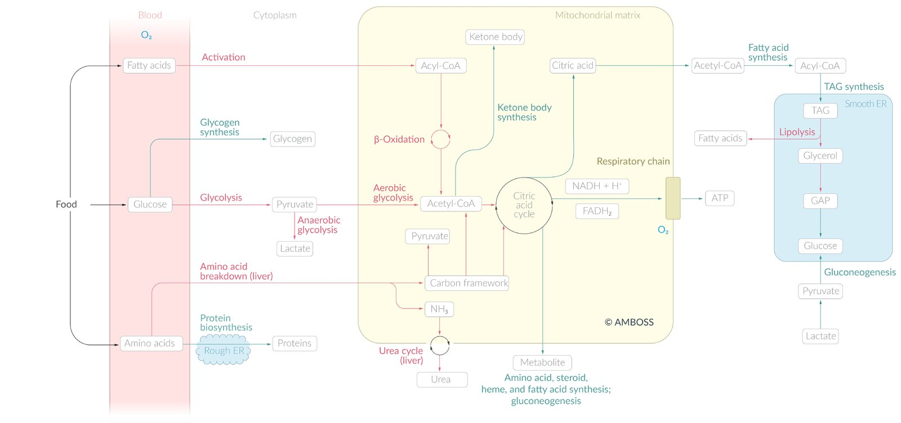
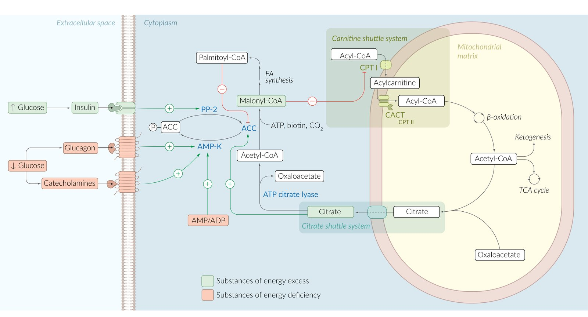
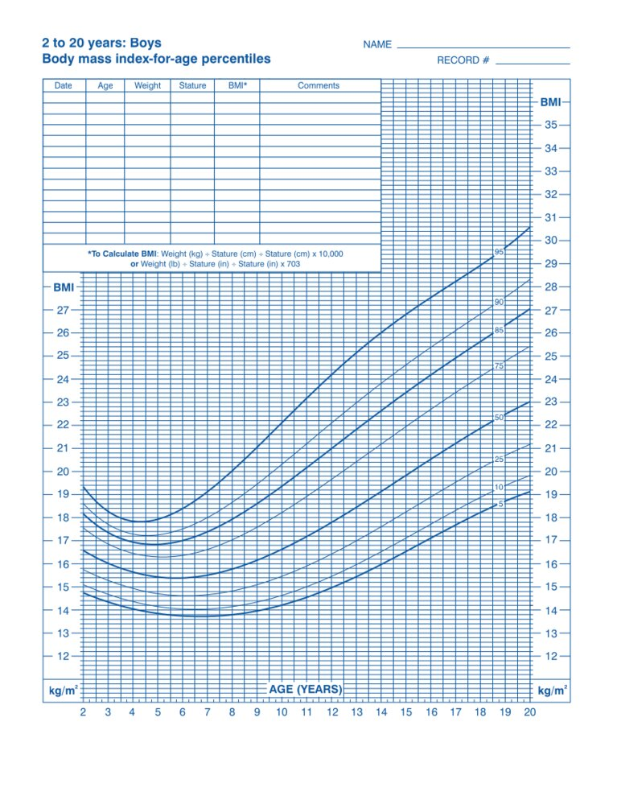
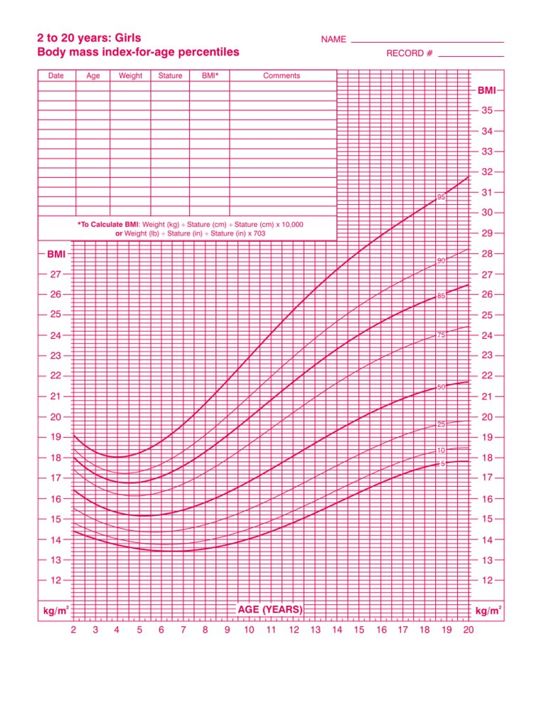
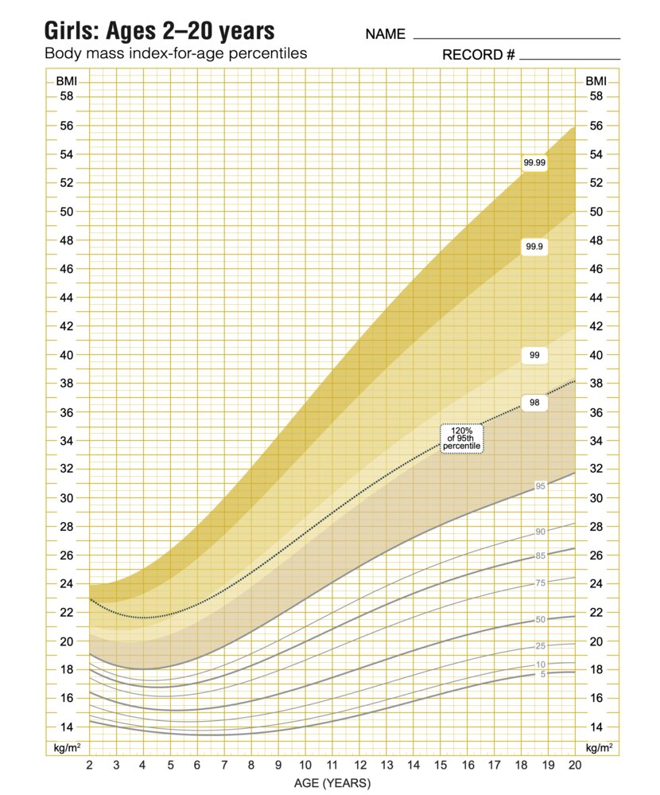
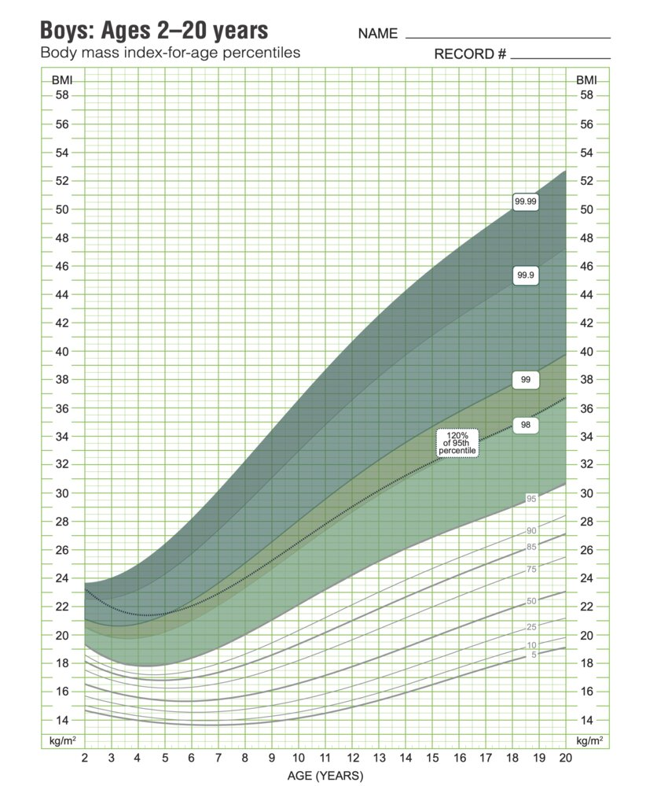

# Principles of nutrition

*Categories: Clinical knowledge > Family medicine > General medicine > Nutrition > Principles of nutrition*

[Original Article Link](https://coursology-qbank.com/amboss/article/X609jS)

---

## Summary

Nutrition is the intake and metabolization of substances the body requires to grow and maintain life. These substances are referred to as “<u>nutrients</u>,” and they are typically ingested orally as food, although <u>specialized nutrition support</u> via <u>enteral feeding</u> or <u>parenteral nutrition</u> may be necessary in patients incapable of eating (e.g., in <u>coma</u> patients and those with severe <u>dysphagia</u>). <u>Nutrients</u> can be divided into <u>essential nutrients</u>, which cannot be synthesized by the body and, therefore, require intake with food (e.g., <u>vitamins</u>, <u>minerals</u>), and <u>nonessential nutrients</u>, which can be synthesized by the body in adequate amounts but are nonetheless a vital part of a healthy diet (e.g., <u>carbohydrates</u>, <u>proteins</u>, and fats). <u>Dietary fiber</u> represents a separate class of <u>nutrients</u>, as it provides little to no actual nutrition but nonetheless has a significant impact on health. <u>Nutrients</u> can be further divided into <u>macronutrients</u>, which humans require in relatively large amounts (fats, <u>carbohydrates</u>, protein), and <u>micronutrients</u> (<u>vitamins</u> and <u>minerals</u>), which humans require in relatively small amounts. <u>Nutrients</u> provide energy; the building blocks for structural growth, maintenance, and repair; and support metabolism, enable the synthesis of <u>endogenous</u> <u>nutrients</u>, and facilitate vital chemical reactions in the body. The amount of energy a body requires depends on metabolic rate, <u>thermogenesis</u>, physical activity, and physical composition. In order to generate energy, the body converts <u>macronutrients</u> into <u>adenosine triphosphate</u> (<u>ATP</u>) through aerobic, anaerobic, protein, and <u>ketone body metabolism</u>. When nutrition provides excess energy, the body stores the excess energy as fat and <u>glycogen</u>; these stores are depleted during times of energy deficiency. Certain states and disorders can lead to nutritional deficiencies (e.g., <u>malignancy</u>), excesses (e.g., <u>metabolic syndrome</u>), or changes in nutritional demand (e.g., <u>pregnancy</u>, high level of activity), which require nutritional adjustment or supplementation. Certain elective diets such as a <u>vegetarian</u> or <u>vegan diet</u> can provide health benefits if balanced nutrition is ensured, while others, especially fad diets focused on quick weight loss or such based on pseudoscientific principles, may not provide balanced nutrition with potentially detrimental health effects. <u>Nutritional status</u> is of central clinical importance, as it can greatly influence disease outcomes and provide valuable information on <u>risk factors</u>, especially with regard to <u>obesity</u> and associated conditions. <u>Nutritional status</u> is assessed based on presentation, history, <u>BMI</u>, and <u>waist circumference</u>.

For further information and discussion of nutritional topics not covered here, see the articles on “<u>Carbohydrates</u>,” “<u>Lipids and their metabolism</u>,” “<u>Amino acids</u>,” “<u>Proteins and peptides</u>,” “<u>Vitamins</u>,” “<u>General metabolism</u>,” “Nutrition during <u>pregnancy</u>,” “<u>Infant nutrition and weaning</u>,” “<u>Specialized nutrition support</u>,” “<u>Protein-energy malnutrition</u>,” and/or ”<u>Water metabolism</u>.”

---

## Nutrients

### Essential and <u>nonessential nutrients</u> [[1]](https://coursology-qbank.com/amboss/article/89cO6e0)

|  | Essential nutrients | Nonessential nutrients |
| --- | --- | --- |
| Definition |  * <u>Nutrients</u> that the body cannot synthesize on its own in sufficient amounts and must, therefore, be taken in with food.   |  * <u>Nutrients</u> that the body can synthesize on its own in sufficient amounts.   |
| Examples |   * <u>Vitamins</u> (except <u>vitamin D</u>)  * <u>Minerals</u>  * <u>Trace elements</u>  * <u>Essential fatty acids</u> (e.g., <u>omega-3 fatty acids</u>, <u>omega-6 fatty acids</u>)  * <u>Essential amino acids</u>    |   * <u>Carbohydrates</u>  * <u>Proteins</u>  * Fats    |

### Macronutrients [[1]](https://coursology-qbank.com/amboss/article/89cO6e0)[[2]](https://coursology-qbank.com/amboss/article/aCcQqe0)

* Definition: <u>nutrients</u> that the body requires in relatively large amounts to ensure proper function, esp. <u>carbohydrates</u>, fats, and protein

| Overview of <u>macronutrients</u> |  |  |  |  |
| --- | --- | --- | --- | --- |
|  | <u>Carbohydrates</u> |  | <u>Proteins</u> | Fats |
| Digestible <u>carbohydrates</u> |  Dietary fiber [[1]](https://coursology-qbank.com/amboss/article/89cO6e0)[[3]](https://coursology-qbank.com/amboss/article/6xcjxe0)  |  |  |  |
| Definition |   * Biomolecules consisting of carbon, hydrogen, and oxygen atoms  * <u>Simple carbohydrates</u>   * <u>Monosaccharides</u> (e.g., <u>glucose</u>, fructose, galactose)  * <u>Disaccharides</u> (e.g., <u>sucrose</u>, <u>lactose</u>)  * Complex <u>carbohydrates</u>   * Oligosaccharides (e.g., raffinose, stachyose)  * <u>Polysaccharides</u> (e.g., starch, <u>cellulose</u>, and <u>glycogen</u>)    |  * Nondigestible plant <u>polysaccharides</u> (e.g., pectin, <u>cellulose</u>)   |   * Large biomolecules consisting of more than 50 <u>amino acids</u>  * The <u>amino acids</u> are connected by multiple <u>peptide bonds</u>    |  * Biomolecules that are soluble in nonpolar solvents (e.g., ethanol) but insoluble in polar solvents (e.g., water)  * Unsaturated lipids: a lipid with one or more double bonds in the <u>fatty acid</u> chain  * Saturated lipids: a lipid with only single bonds in the <u>fatty acid</u> chain   |
| Source |   * <u>Glucose</u> (e.g., candy, soft drinks)  * <u>Sucrose</u> (e.g., sugar refined from sugar cane or sugar beet)  * <u>Lactose</u> (e.g., dairy products)  * Fructose (e.g., fruit, honey)  * Starch (e.g., potatoes, bread, rice, pasta, cereals)    |   * Grains (e.g. rye, oats)  * Vegetables (e.g., carrots, beets, artichokes)  * Legumes (e.g., peas, beans)  * Fruit (e.g., pears, raspberries, apples)    |   * Animal products (e.g., lean meat, poultry, eggs, seafood)  * Legumes (e.g., peas, beans)  * Nuts and seeds    |  * Mostly in the form of <u>triglycerides</u>  * Animal products (e.g., meat, dairy products)  * Nuts (e.g., macadamia nuts, walnuts)  * Oils (e.g., olive oil, sunflower oil)   |
| <u>Recommended dietary allowances</u> |   * <u>Proportion</u> of total <u>nutrients</u>: 45–65%  * Men: 38 g  * Women: 25 g    |  * 25–30 g/day   |  * Amount of all <u>nutrients</u>  * Age 1–3 years: 5–20%  * Age 4–18 years: 10–30%  * Age > 18 years: 10–35%   |  * Amount of all <u>nutrients</u>  * Age 1–3 years: 30–40%  * Age 4–18 years: 15–25%  * Age > 18 years: 20–35%   |
| <u>Caloric value</u> |  * 4 kcal/g   |  * None   |  * 4 kcal/g   |  * 9 kcal/g   |
| Function |   * Primary source of energy  * Components of cell structures    |   * Bulking: Absorption of water in the intestine increases stool size and regularity.  * Viscosity: Dissolution in water forms a gel that increases stool motility and reduces sugar and lipid absorption.   * Cardiovascular effect: reduces risk of coronary <u>heart</u> diseases, <u>stroke</u>, <u>hypertension</u>  * Metabolic effect: reduces risk of <u>obesity</u> and <u>type 2 diabetes mellitus</u>  * Fermentation: <u>Microbiota</u> in the <u>large intestine</u> consume fiber, thereby promoting a healthy intestinal flora.    |   * Contribute to the regulation of physiological cell activity (e.g., as <u>hormones</u>, enzymes, transporters, <u>antibodies</u>)  * Components of cell structures    |   * <u>Energy storage</u> and utilization  * Substrate for:  * <u>Cell membrane</u> synthesis  * <u>Steroid hormone</u> synthesis  * <u>Vitamin D synthesis</u>  * <u>Bile</u> production  * Regulation of temperature  * Components of cell structures    |
| Storage |  * Stored as intracellular <u>glycogen</u>   |  * N/A   |  * Stored in <u>skeletal muscle</u>   |  * Stored as intracellular <u>triglycerides</u> within the muscle cells and <u>adipose tissue</u>   |
| Relevant articles |   * <u>Carbohydrates</u>  * <u>Glycolysis and gluconeogenesis</u>  * <u>Glycogen metabolism</u>    |  * Discussed here   |   * <u>Proteins and peptides</u>  * <u>Amino acids</u>  * <u>Glycolysis and gluconeogenesis</u> (<u>glucose-alanine cycle</u>)    |   * <u>Lipids and their metabolism</u>  * <u>Adipose tissue</u>    |

Overview of major metabolic pathways

Fat metabolism

### Micronutrients

* Definition: <u>nutrients</u> that the body requires in small amounts to ensure proper function, esp. <u>vitamins</u> and <u>minerals</u>

#### <u>Vitamins</u>

* Definition: a diverse class of organic compounds essential to nutrition in minute quantities

* <u>Vitamin</u>-rich foods: vegetables, fruit, whole grains, legumes, animal products (especially <u>vitamin B12</u>, <u>vitamin A</u>)

* Function: <u>coenzymes</u>, antioxidants, play a role in <u>hormone</u> function

* Types

* <u>Fat-soluble vitamins</u>

* <u>Vitamin A</u> (<u>retinol</u>)

* <u>Vitamin D</u> (<u>calciferol</u>)

* <u>Vitamin E</u> (<u>tocopherol</u>)

* <u>Vitamin K</u> (<u>phytomenadione</u>)

* <u>Water-soluble vitamins</u>

* <u>Vitamin B1</u> (<u>thiamine</u>)

* <u>Vitamin B2</u> (<u>riboflavin</u>)

* <u>Vitamin B3</u> (<u>niacin</u>)

* <u>Vitamin B5</u> (<u>pantothenic acid</u>)

* <u>Vitamin B6</u> (<u>pyridoxine</u>)

* <u>Vitamin B7</u> (<u>biotin</u>)

* <u>Vitamin B9</u> (<u>folate</u>)

* <u>Vitamin B12</u> (<u>cobalamin</u>)

* <u>Vitamin C</u> (<u>ascorbic acid</u>)

* For more information, see the article “<u>Vitamins</u>.”

### Minerals [[1]](https://coursology-qbank.com/amboss/article/89cO6e0)

* Definition: inorganic elements essential to nutrition in minute quantities [[4]](https://coursology-qbank.com/amboss/article/iY1JK20)

* Macrominerals: <u>minerals</u> required in the range of milligrams to grams per day

* <u>Trace elements</u>: <u>minerals</u> required in the range of micrograms to milligrams per day

* Sources

* Macromineral-rich foods: vegetables, fruits, grains, legumes, animal products

* <u>Trace element</u>-rich foods: animal products, legumes, nuts

* Function

* Macrominerals

* Regulatory functions (e.g., <u>fluid balance</u>, enzymatic activity, and neuromuscular transmission)

* Structural components (e.g., in bones and <u>teeth</u>)

* <u>Trace elements</u>

* <u>Cofactors</u> to reactions

* Constituents of essential molecules, <u>transcription factors</u>, and <u>amino acids</u>

* Types

* Macrominerals [[5]](https://coursology-qbank.com/amboss/article/oZ10c20)

* <u>Calcium</u>

* <u>Magnesium</u>

* <u>Phosphorus</u>

* <u>Sodium</u>

* <u>Potassium</u>

* <u>Chloride</u>

* <u>Trace elements</u> [[5]](https://coursology-qbank.com/amboss/article/oZ10c20)

* <u>Iron</u>

* <u>Copper</u>

* <u>Zinc</u>

* <u>Iodine</u>

* <u>Selenium</u>

* Sulfur

* <u>Fluoride</u>

---

## Energy

* Energy

* In a biological system, energy is ingested in the form of chemical energy stored in food and translated into other forms of energy that are either stored or used to perform and maintain physical functions.

* Energy is measured in kilocalories (kcal) or kilojoules (kJ)

* Energy balance: the balance of energy intake, generation, and expenditure

* Positive energy balance: more energy intake than expenditure → <u>energy storage</u> → weight gain

* Negative energy balance: less energy intake than expenditure → energy store depletion → weight loss

* For more info on energy generation, <u>energy expenditure</u>, and <u>energy storage</u>, please see the article "<u>Energy metabolism</u> and <u>heat loss</u>."

---

## Vegetarian and vegan diet

### Definitions [[6]](https://coursology-qbank.com/amboss/article/PzcWGU0)

* Vegetarian diets

* Lacto-<u>vegetarian diet</u>: a <u>plant-based diet</u> that includes dairy products but not eggs, meat, or seafood

* Lacto-ovo <u>vegetarian diet</u>: a <u>plant-based diet</u> that includes eggs and dairy products without the consumption of meat or seafood

* Pescetarian (pesco-<u>vegetarian</u>) diet: a <u>plant-based diet</u> that includes seafood, eggs, and dairy products but not meat

* Vegan diets: a <u>plant-based diet</u> that excludes all animal products (e.g., meat, fish, dairy, eggs, honey) [[7]](https://coursology-qbank.com/amboss/article/b_cH5U0)

* Raw <u>vegan diet</u>: a <u>vegan diet</u> in which 75–100% of the food is consumed raw

* Fruitarian diet: a <u>vegan diet</u> that includes raw fruits but no vegetables or grains; some fruitarians also eat seeds and nuts

* <u>Prevalence</u>

* Lacto-ovo <u>vegetarian diets</u>: <u>prevalence</u> approx. 5% of the US population [[8]](https://coursology-qbank.com/amboss/article/f_cknU0)

* <u>Vegan diets</u>: <u>prevalence</u> approx. 1% of the US population [[8]](https://coursology-qbank.com/amboss/article/f_cknU0)

### Positive health effects [[9]](https://coursology-qbank.com/amboss/article/4_c3oU0)[[10]](https://coursology-qbank.com/amboss/article/Q_cuLU0)

* <u>Vegetarian</u> and/or <u>vegan diets</u> rich in fruit and vegetables are also rich in fiber, <u>folic acid</u>, and antioxidants. They are also associated with lower serum lipids than diets that include meat.

* <u>Vegetarian</u> and/or <u>vegan diets</u> tend to also be lower in calories and are associated with a lower <u>BMI</u>.

* Lower risk of mortality due to <u>stroke</u> and <u>ischemic heart disease</u>

* Lower risk of <u>type 2 diabetes mellitus</u>

* Lower rate of <u>hypertension</u>

* Lower risk of cancer genesis

### Associated deficiencies [[9]](https://coursology-qbank.com/amboss/article/4_c3oU0)[[10]](https://coursology-qbank.com/amboss/article/Q_cuLU0)[[11]](https://coursology-qbank.com/amboss/article/l_cvoU0)

* <u>Vitamin B12 deficiency</u> 

* Animal sources: meat, poultry, eggs, dairy products, fish

* <u>Plant-based diet</u>: supplemental <u>vitamin B12</u> capsules or injections

* <u>Vitamin B2 deficiency</u>

* Animal sources: Meat, fish, eggs, milk

* <u>Plant-based diet</u>: green vegetables, fortified soy beverages, <u>calcium</u>-fortified orange juice, tofu, tempeh, fortified cereals and breads

* <u>Iron deficiency</u>  [[12]](https://coursology-qbank.com/amboss/article/N_c-oU0)

* Animal source: red meat, pork, poultry

* <u>Plant-based diet</u>

* Dark green leafy vegetables (e.g. spinach, rocket), dried fruits (e.g., raisins, apricots, peaches, and prunes)

* Supplemental <u>iron</u> capsules

* <u>Calcium</u> deficiency: associated with low <u>bone mineral density</u>

* Animal source: milk and dairy products

* <u>Vegan diet</u>

* Dark green leafy vegetables (e.g., kale, broccoli, bok choy, turnip greens, dried figs, Chinese cabbage)

* <u>Calcium</u>-fortified food (e.g., soy products, oat milk, mineral water)

* Supplemental <u>calcium</u>

* Avoid products with high oxalate concentration (e.g., spinach, arugula, yams, beet greens, and Swiss chard), as they decrease <u>calcium</u> absorption.

* <u>Vitamin D deficiency</u> 

* Animal source: egg yolks, animal <u>liver</u>

* <u>Plant-based diet</u>: supplemental <u>vitamin D</u> capsules, <u>vitamin D</u>-fortified foods

* <u>Omega-3 fatty acid</u> deficiency: associated with the development of several psychiatric disorders (e.g., <u>depressive disorders</u>, <u>bipolar disorder</u>, <u>schizophrenia</u>, and <u>ADHD</u>)

* Animal source: fish, organ meat, and eggs

* <u>Plant-based diet</u>

* Walnuts, soy products, flaxseed, chia seeds, hemp seeds, sea vegetables

* Supplemental <u>omega-3 fatty acids</u> capsules and/or oil

* Protein deficiency (see also “<u>Kwashiorkor</u>”) 

* Animal sources: meat, poultry, eggs, dairy products, fish

* <u>Plant-based diet</u>: legumes, grains, vegetables, seeds, nuts, soy products

---

## Enteral feeding and parenteral nutrition

<u>Specialized nutrition support</u> is required when oral intake is either limited or not possible for a prolonged period of time. For further information see “<u>Specialized nutrition support</u>.”

|  | <u>Enteral feeding</u> | <u>Parenteral nutrition</u> |
| --- | --- | --- |
| Definition |  * Administration of <u>nutrients</u> directly into the <u>stomach</u>, <u>duodenum</u>, or <u>jejunum</u> with the help of feeding tubes   |  * Intravenous administration of <u>nutrients</u> bypassing the <u>gastrointestinal tract</u>   |
| Indication |   * Acute <u>respiratory failure</u> requiring intensive care  * Mechanically ventilated patients  * <u>Comatose</u> patients  * Impaired <u>swallowing</u>    |  * Contraindications to <u>enteral nutrition</u> for < 1 week   |
| Contraindication |   * Mechanical <u>ileus</u>, <u>bowel obstruction</u>  * <u>Acute abdomen</u>  * Severe substrate <u>malabsorption</u>    |   * <u>Enteral nutrition</u> is feasible  * Severe <u>electrolyte</u> abnormalities  * <u>Volume overload</u>    |
| Complication |   * <u>Enteral nutrition-associated respiratory failure</u>  * <u>Metabolic complications of specialized nutrition support</u>  * Injury to or <u>perforation of the stomach</u> wall    |   * <u>Intestinal failure-associated liver disease</u>  * <u>Catheter-related bloodstream infection</u>  * <u>Fluid overload</u>  * <u>Metabolic complications of specialized nutrition support</u>    |

---

## Diagnostic tools for assessing healthy weight and body mass

Lower <u>BMI</u> and <u>waist circumference</u> <u>cutoff values</u> are recommended for individuals of Asian descent, who have an increased risk of <u>weight-related health problems</u> at a given level of <u>adiposity</u> compared to populations of European descent. [[13]](https://coursology-qbank.com/amboss/article/2sdT8r0)

### Body mass index [[14]](https://coursology-qbank.com/amboss/article/iKXJT_)[[15]](https://coursology-qbank.com/amboss/article/OKXIg_)[[16]](https://coursology-qbank.com/amboss/article/2udTq70)[[17]](https://coursology-qbank.com/amboss/article/3udSI70)

* Definition: the <u>ratio</u> of a person's mass (in kilograms) by the square of the body height (in meters); expressed in units of kg/m2

* Clinical uses

* Estimates an individual's overall body fat

* Identifies individuals as underweight, <u>healthy weight</u>, <u>overweight</u>, or <u>obese</u>

* Disadvantages [[15]](https://coursology-qbank.com/amboss/article/OKXIg_)

* Underestimates body fat in older adults or individuals with low muscle mass

* Overestimates body fat in muscular individuals

|  <u>BMI</u> classifications [[14]](https://coursology-qbank.com/amboss/article/iKXJT_)[[15]](https://coursology-qbank.com/amboss/article/OKXIg_)[[16]](https://coursology-qbank.com/amboss/article/2udTq70)[[17]](https://coursology-qbank.com/amboss/article/3udSI70)  |  |  |  |
| --- | --- | --- | --- |
|  |  |  Adults (absolute <u>BMI</u>) |  Children aged ≥ 2 years (<u>BMI</u> <u>percentile</u> for age and sex)  [[18]](https://coursology-qbank.com/amboss/article/VaWGjP0)[[19]](https://coursology-qbank.com/amboss/article/Fmdghq0)  |
| Underweight |  |  * < 18.5 kg/m2   |  * < 5th <u>percentile</u>   |
| <u>Healthy weight</u> |  |  * 18.5–24.9 kg/m2   |  * 5th–84th <u>percentile</u>   |
| <u>Overweight</u> |  |   * Most populations: 25–29.9 kg/m2  * Asian descent: 23–24.9 kg/m2   [[20]](https://coursology-qbank.com/amboss/article/Exd8yH0)[[21]](https://coursology-qbank.com/amboss/article/aydQds0)    |  * 85th–94th <u>percentile</u>   |
| <u>Obesity</u> |  |   * Most populations: ≥ 30 kg/m2  * Asian descent: ≥ 25 kg/m2   [[20]](https://coursology-qbank.com/amboss/article/Exd8yH0)[[21]](https://coursology-qbank.com/amboss/article/aydQds0)  * See also “<u>BMI classification for overweight and obesity</u>.”    |   * ≥ 95th <u>percentile</u>  * See also “<u>BMI classification for overweight and obesity</u>.”    |

BMI and BSA (Du Bois)

Body mass index-for-age percentiles (male individuals 2–20 years; 5ᵗʰ–95ᵗʰ percentiles)

Body mass index-for-age percentiles (female individuals 2–20 years; 5ᵗʰ–95ᵗʰ percentiles)

Body mass index-for-age percentiles (female individuals 2-20 years; 5ᵗʰ–99.99ᵗʰ percentiles)

Body mass index-for-age percentiles (male individuals 2-20 years; 5ᵗʰ–99.99ᵗʰ percentiles)

### Waist circumference [[13]](https://coursology-qbank.com/amboss/article/2sdT8r0)[[15]](https://coursology-qbank.com/amboss/article/OKXIg_)[[22]](https://coursology-qbank.com/amboss/article/QKXuT_)[[23]](https://coursology-qbank.com/amboss/article/-9cDJe0)

* Definition: the circumference of the waist measured in centimeters or inches, measured at the top of the iliac crest [[14]](https://coursology-qbank.com/amboss/article/iKXJT_)[[24]](https://coursology-qbank.com/amboss/article/8CdOFH0)

* Interpretation

* An increased <u>waist circumference</u> indicates <u>abdominal obesity</u> and is associated with an increased risk of cardiovascular disease.

* Cutoffs for <u>abdominal obesity</u> in most populations in the US

* Men: ≥ 102 cm (≥ 40 in)

* Women: ≥ 88 cm (≥ 35 in)

* See “<u>Abdominal obesity</u>” for details.

### Waist-to-height ratio

* Definition: an individual's <u>waist circumference</u> divided by their height, using the same units [[25]](https://coursology-qbank.com/amboss/article/RSVlzF0)

* Interpretation: A <u>ratio</u> ≥ 0.5 indicates <u>abdominal obesity</u> and is associated with an increased risk of cardiovascular disease. [[26]](https://coursology-qbank.com/amboss/article/-bVDwG0)

---

## Clinical significance

### <u>Carbohydrates</u>

* <u>Malabsorption</u>

* <u>Sucrose</u> <u>malabsorption</u> (<u>sucrase-isomaltase</u> deficiency)

* <u>Sorbitol</u> <u>malabsorption</u>

* Disorders of <u>glucose metabolism</u>

* <u>Diabetes mellitus type 1</u>, <u>diabetes mellitus type 2</u>

* <u>Glycogen storage disorders</u>

* <u>Von Gierke disease</u>

* <u>Pompe disease</u>

* <u>Cori disease</u>

* <u>McArdle disease</u>

* <u>Hers disease</u>

* <u>Andersen disease</u>

* Disorders of <u>galactose metabolism</u>

* <u>Galactosemia</u>

* <u>Lactose intolerance</u>

* Disorders of <u>fructose metabolism</u>

* <u>Hereditary fructose intolerance</u> (<u>autosomal recessive</u> defect of <u>aldolase B</u>)

* <u>Essential fructosuria</u> (<u>autosomal recessive</u> defect of <u>fructokinase</u>)

* <u>Alcohol-related disorders</u>

* <u>Metabolic consequences of heavy ethanol consumption</u>

* <u>Wernicke-Korsakoff syndrome</u>

* <u>Alcoholic ketoacidosis</u>

### Lipids

* <u>Hyperlipidemia</u>

* <u>Xanthoma</u> (e.g., <u>tendinous xanthoma</u>)

* <u>Xanthelasma</u>

* <u>Lipemia retinalis</u>

* <u>Arcus lipoides corneae</u>

* <u>Arcus senilis</u>

* <u>Disorders of fatty acid metabolism</u>

* <u>MCAD deficiency</u>

* <u>Primary carnitine deficiency</u>

* <u>Carnitine palmitoyltransferase II deficiency</u>

* <u>Atherosclerosis</u>

* <u>Coronary heart disease</u>

* <u>Myocardial infarction</u>

* <u>Stroke</u>

* <u>Peripheral arterial disease</u>

* <u>Carotid artery stenosis</u>

* <u>Cholesterol embolization syndrome</u>

* Others

* <u>Obesity</u> and <u>metabolic syndrome</u>

* <u>Cholelithiasis</u> (due to <u>cholesterol gallstones</u>)

* <u>Fatty liver</u>

* <u>Abetalipoproteinemia</u>

### <u>Proteins</u>

* <u>Protein-energy malnutrition</u>

* <u>Hyperammonemia</u>

* <u>Alkaptonuria</u>

* <u>Homocystinuria</u>

* <u>Phenylketonuria</u> (<u>PKU</u>)

* <u>Cystinosis</u>

* <u>Cystinuria</u>

* <u>Hartnup disease</u>

* <u>Maple syrup urine disease</u>

* <u>Histidinemia</u>

* <u>Organic acidemias</u>

* <u>Arginase deficiency</u>

* <u>Carbamoyl phosphate synthetase 1 (CPS1) deficiency</u>

* <u>N-acetylglutamate synthase deficiency</u>

### <u>Vitamins</u>

* <u>Fat-soluble vitamins</u>

* <u>Vitamin A deficiency</u>

* <u>Vitamin A toxicity</u>

* <u>Vitamin D deficiency</u>

* <u>Vitamin D toxicity</u>

* <u>Vitamin E deficiency</u>

* <u>Vitamin E toxicity</u>

* <u>Vitamin K deficiency</u>

* <u>Vitamin K toxicity</u>

* <u>Water-soluble vitamins</u>

* <u>Vitamin B1 deficiency</u>

* <u>Vitamin B2 deficiency</u>

* <u>Vitamin B3 deficiency</u>

* <u>Vitamin B3 toxicity</u>

* <u>Vitamin B5 deficiency</u>

* <u>Vitamin B6 deficiency</u>

* <u>Vitamin B6 toxicity</u>

* <u>Vitamin B7 deficiency</u>

* <u>Vitamin B9 deficiency</u>

* <u>Vitamin B12 deficiency</u>

* <u>Vitamin C deficiency</u>

* <u>Vitamin C toxicity</u>

### <u>Minerals</u>

* <u>Calcium</u> (<u>hypercalcemia</u>, <u>hypocalcemia</u>)

* <u>Chloride</u> (<u>hyperchloremia</u>, <u>hypochloremia</u>)

* <u>Potassium</u> (<u>hyperkalemia</u>, <u>hypokalemia</u>)

* <u>Sodium</u> (<u>hypernatremia</u>, <u>hyponatremia</u>)

* <u>Phosphorus</u> (<u>hyperphosphatemia</u> <u>hypophosphatemia</u>)

* <u>Magnesium</u> (<u>hypermagnesemia</u>, <u>hypomagnesemia</u>)

* See also “<u>Acid-base disorders</u>” and “<u>Electrolyte repletion</u>”.

### <u>Trace elements</u>

* <u>Iron</u>

* <u>Iron deficiency anemia</u>

* <u>Hemochromatosis</u>

* <u>Iron toxicity</u>

* <u>Copper</u>

* <u>Menkes disease</u>

* <u>Wilson disease</u>

* <u>Zinc</u>: <u>acrodermatitis enteropathica</u>

* <u>Iodine</u>

* <u>Iodine deficiency</u>

* <u>Iodine excess</u>

### Weight changes

* <u>Unintentional weight loss</u>

* <u>Malignancy</u> (e.g., <u>lung cancer</u>, <u>colorectal cancer</u>)

* Endocrinopathies (e.g., <u>hyperthyroidism</u>, <u>hypocortisolism</u>, <u>diabetes mellitus</u>)

* Gastrointestinal conditions (e.g., <u>gastritis</u>, <u>celiac disease</u>, <u>Crohn disease</u>, <u>ulcerative colitis</u>)

* Conditions with organ failure (e.g., <u>COPD</u>, <u>renal failure</u>)

* Infectious diseases (e.g., <u>tuberculosis</u>, <u>HIV</u>)

* Inherited disorders (e.g., <u>cystic fibrosis</u>)

* Psychiatric conditions (e.g., <u>schizophrenia</u>, <u>bipolar disorder</u>, major <u>depression</u>)

* <u>Polytrauma</u>

* <u>Unintentional weight gain</u>

* Endocrine changes

* ↑ <u>Cortisol</u> (associated with, e.g., <u>Cushing syndrome</u>, <u>stress</u>, <u>depression</u>, <u>anxiety</u>)

* ↑ <u>Ghrelin</u>/↓ <u>leptin</u> (associated with <u>insomnia</u>)

* ↑ <u>Insulin</u> (associated with <u>insulinoma</u>)

* ↓ <u>Thyroid hormones</u> (associated with, e.g., <u>Hashimoto thyroiditis</u>)

* ↓ <u>Growth hormone</u> (associated with, e.g., infection, <u>brain tumors</u>)

* ↑/↓ <u>Estrogen</u> (associated with, e.g., <u>polycystic ovary syndrome</u>, <u>pregnancy</u>, <u>premenopause</u>)

* Medication

* <u>Antidepressants</u> (e.g., <u>mirtazapine</u>)

* <u>Corticosteroids</u> (e.g., <u>prednisone</u>)

* <u>Antipsychotics</u> (e.g., <u>risperidone</u>)

* <u>Beta blockers</u> (e.g., <u>labetalol</u>)

* <u>Insulin</u>

* <u>Antithyroid drugs</u> (e.g., <u>methimazole</u>)

* <u>Eating disorders</u>

* <u>Anorexia nervosa</u>

* <u>Bulimia nervosa</u>

* <u>Binge eating disorder</u>

* <u>Pica</u>

* <u>Pregnancy</u> (see also: “Nutrition during <u>pregnancy</u>”)

* Gastrointestinal conditions

* <u>Gastrointestinal atresia</u> and stenosis

* <u>Esophageal atresia</u>

* <u>Hypertrophic pyloric stenosis</u>

* <u>Malabsorption</u>

* <u>Protein-losing enteropathy</u>

---