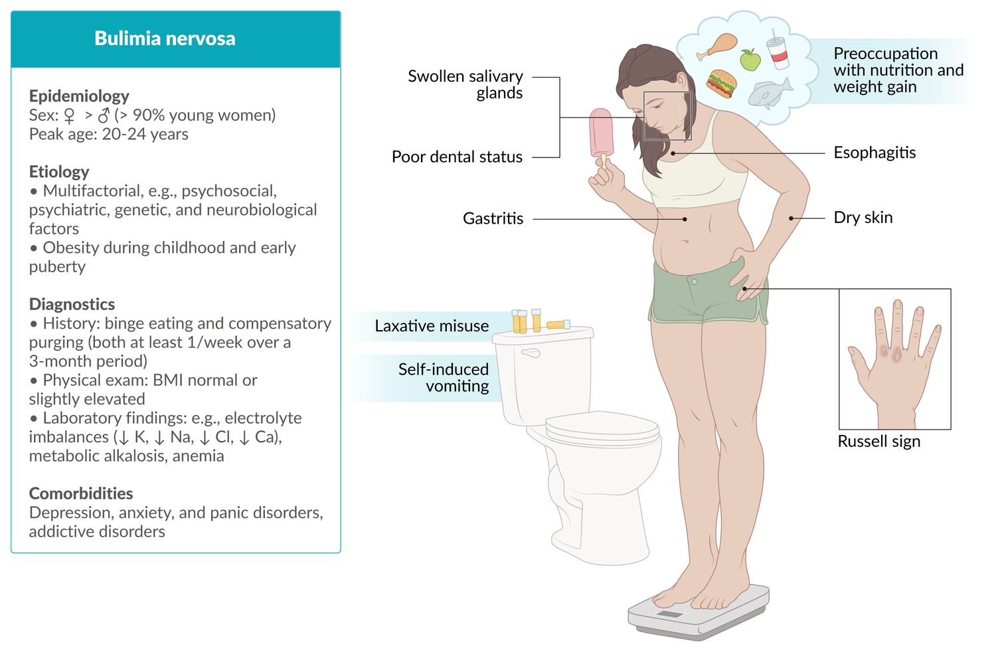

# Bulimia nervosa

*Categories: Clinical knowledge > Family medicine > Pediatric care > Bulimia nervosa*

[Original Article Link](https://coursology-qbank.com/amboss/article/vt0A23)

---

## Summary

Bulimia nervosa is an <u>eating disorder</u> characterized by recurrent <u>binge eating episodes</u>, <u>inappropriate weight compensatory behaviors</u>, and sense of self-worth disproportionately impacted by body weight and/or shape. Causes are multifactorial and similar to those of <u>anorexia nervosa</u> (e.g., genetic factors, psychiatric disorders, psychosocial factors); bulimia nervosa is associated with <u>obesity</u>. It is important to assess for <u>malnutrition</u> severity in affected individuals, regardless of body weight or <u>body mass index</u> (<u>BMI</u>). The diagnosis is confirmed if individuals fulfill all of the <u>DSM-5 diagnostic criteria for bulimia nervosa</u>. Individuals should be evaluated for associated complications (e.g., <u>electrolyte</u> abnormalities) and underlying conditions that may affect weight or cause a change in eating behaviors (e.g., <u>thyroid disorder</u>). Outpatient management is preferred, but hospitalization is indicated if <u>red flags in eating disorders</u> are present. All individuals should be referred for <u>psychotherapy</u> and nutritional management. Pharmacotherapy with <u>fluoxetine</u> may be considered as adjunctive therapy to help decrease binge eating and compensatory behaviors; other <u>SSRIs</u> may also be used to manage comorbid psychiatric conditions (e.g., <u>depression</u>).

Bulimia nervosa fact sheet

---

## Epidemiology

* <u>Prevalence</u>

* Women: 0.3%–1%

* Men: 0.1%

* Peak age: 20–24 years of age

* Sex: <u>♀</u> > <u>♂</u> (> 90% of affected individuals are young women)

Epidemiological data refers to the US, unless otherwise specified.

---

## Etiology

* Multifactorial

* Etiology is not entirely understood

* See “Etiology of <u>Anorexia nervosa</u>” for factors common to both <u>eating disorders</u>.

* <u>Obesity</u> during childhood and early <u>puberty</u>

---

## Clinical features

* Characteristic clinical features

* Recurrent <u>binge eating episodes</u> associated with <u>inappropriate weight compensatory behaviors</u>

* See <u>DSM-5 diagnostic criteria for bulimia nervosa</u> for further detail.

* <u>BMI</u>: can be normal or slightly elevated 

* > 20 years of age: ≥ 18.5 kg/m2

* ≤ 20 years of age: <u>BMI</u> ≥ 5th <u>percentile</u> for sex and age

|  Associated features of bulimia nervosa [[2]](https://coursology-qbank.com/amboss/article/Nta-dm) |  |
| --- | --- |
|  | Clinical features |
| <u>Central nervous system</u> |  * <u>Seizures</u>   |
| Cardiovascular symptoms |   * <u>Cardiac arrhythmias</u>  * <u>Hypotension</u>    |
|  <u>Gastrointestinal tract</u>  |   * <u>Esophagitis</u> and/or <u>gastritis</u>  * Esophageal/gastric <u>lacerations</u> (<u>Mallory-Weiss syndrome</u>)  * Bilateral <u>parotid gland</u> swelling (<u>sialadenosis</u>)    |
| <u>Skin</u> |   * Calluses on the knuckles (Russell sign)  * Dry <u>skin</u> and <u>brittle nails</u>    |
| <u>Teeth</u> |  * <u>Caries</u> and <u>perimolysis</u> due to frequent <u>vomiting</u>   |
| Menstrual irregularities |  * <u>Amenorrhea</u>   |

> [!WARNING]
> Recurrent <u>purging</u> can lead to severe complications such as esophageal tears, <u>cardiac arrhythmias</u>, and <u>seizures</u>. [[2]](https://coursology-qbank.com/amboss/article/Nta-dm)

> [!WARNING]
> Bulimia nervosa is associated with an increased risk of <u>suicide</u>. [[2]](https://coursology-qbank.com/amboss/article/Nta-dm)

---

## Diagnosis

### General principles [[2]](https://coursology-qbank.com/amboss/article/Nta-dm)[[5]](https://coursology-qbank.com/amboss/article/y11djf0)[[6]](https://coursology-qbank.com/amboss/article/i_cJLU0)[[7]](https://coursology-qbank.com/amboss/article/Ym1nVh0)[[8]](https://coursology-qbank.com/amboss/article/b01He20)

* See “<u>Screening for eating disorders</u>” for indications and screening modalities.

* Determine if individuals fulfill all of the <u>DSM-5 diagnostic criteria for bulimia nervosa</u> to confirm the diagnosis.

* Evaluate for complications and comorbidities, and rule out possible organic etiologies for change in weight and/or eating behaviors: See “<u>Initial evaluation for a suspected eating disorder</u>.”

### <u>DSM-5</u> diagnostic criteria [[2]](https://coursology-qbank.com/amboss/article/Nta-dm)[[6]](https://coursology-qbank.com/amboss/article/i_cJLU0)

|  DSM-5 diagnostic criteria for bulimia nervosa [[2]](https://coursology-qbank.com/amboss/article/Nta-dm)  |  |
| --- | --- |
| A |  * Recurrent <u>binge eating episodes</u>   |
| B |  * Recurrent inappropriate weight compensatory behaviors to counteract weight gain, e.g.:  * Self-induced <u>vomiting</u> after binge eating (most common)  * <u>Laxative misuse</u>, <u>diuretic misuse</u>  * Transient <u>starvation</u> periods  * Excessive exercise  * Prescription drug misuse   |
| C |  * Binge eating and <u>inappropriate weight compensatory behaviors</u> both occur at least once a week over a 3-month period (on average).   |
| D |  * Sense of self-worth disproportionately influenced by the perception of one's weight and/or body shape   |
| E |  * Binge eating and <u>inappropriate weight compensatory behaviors</u> do not occur only during episodes of <u>anorexia nervosa</u>.   |
| All criteria must be fulfilled. |  |

> [!TIP]
> <u>Binge eating episodes</u> can occur during periods of <u>stress</u> or boredom, or after an attempt to lower body weight through dietary restriction. [[2]](https://coursology-qbank.com/amboss/article/Nta-dm)

#### Severity (according to <u>DSM-5</u>) [[2]](https://coursology-qbank.com/amboss/article/Nta-dm)[[9]](https://coursology-qbank.com/amboss/article/En18Eh0)

Based on the number of episodes of <u>inappropriate weight compensatory behaviors</u> per week.

* Mild: 1–3 episodes/week

* Moderate: 4–7 episodes/week

* Severe: 8–13 episodes/week

* Extreme: ≥ 14 episodes/week

### <u>Laboratory studies</u> [[2]](https://coursology-qbank.com/amboss/article/Nta-dm)

* ↓ <u>Potassium</u>, ↓ <u>sodium</u>, ↓ <u>chloride</u>, and ↓ <u>calcium</u>

* <u>Metabolic alkalosis</u>

* Possible ↑ serum α-<u>amylase</u>

* See also “<u>Characteristic laboratory abnormalities in eating disorders</u>” for additional studies and findings.

---

## Treatment

### General principles [[6]](https://coursology-qbank.com/amboss/article/i_cJLU0)[[7]](https://coursology-qbank.com/amboss/article/Ym1nVh0)[[8]](https://coursology-qbank.com/amboss/article/b01He20)

* Disposition

* Evaluate for <u>red flag features of eating disorders</u>.

* Determine appropriate care setting; see “<u>Disposition for eating disorders</u>.”

* Discuss treatment goals, e.g.: [[7]](https://coursology-qbank.com/amboss/article/Ym1nVh0)

* Decrease the number of episodes of <u>inappropriate weight compensatory behaviors</u>.

* Improve disordered thoughts and beliefs (e.g., about body image, self-esteem, eating behaviors).

* Identify and manage complications: See “Clinical features”, and “<u>Laboratory studies</u>” in “Diagnostics.”

* Comanage nutritional management with a dietitian.

* Provide nutritional education.

* Promote healthy eating habits.

* Refer all patients for <u>psychotherapy</u>; consider pharmacotherapy only as adjunctive therapy.

* Preferred initial management in adults: <u>cognitive behavioral therapy</u> with or without an <u>SSRI</u> (<u>fluoxetine</u>)

* Preferred initial management in <u>adolescents</u> and young adults: <u>family-based therapy</u> with an involved caregiver

* Regularly reassess for remission. [[2]](https://coursology-qbank.com/amboss/article/Nta-dm)

* Partial remission : some (not all) <u>criteria for bulimia nervosa</u> are met for a sustained period of time

* Full remission : none of the <u>criteria for bulimia nervosa</u> are met for a sustained period of time

### Nutritional management [[6]](https://coursology-qbank.com/amboss/article/i_cJLU0)[[7]](https://coursology-qbank.com/amboss/article/Ym1nVh0)[[8]](https://coursology-qbank.com/amboss/article/b01He20)

* Evaluate nutritional intake.

* Educate and support patients to implement healthy eating habits, including <u>binge eating prevention strategies</u>.

* For underweight patients, guidance in <u>weight restoration for AN</u> may be appropriate. [[7]](https://coursology-qbank.com/amboss/article/Ym1nVh0)

### <u>Psychotherapy</u> [[6]](https://coursology-qbank.com/amboss/article/i_cJLU0)[[7]](https://coursology-qbank.com/amboss/article/Ym1nVh0)[[8]](https://coursology-qbank.com/amboss/article/b01He20)

First-line therapy for bulimia nervosa

#### <u>Adolescents</u> and young adults

* <u>Family-based therapy</u> with an involved caregiver (preferred)

* <u>Cognitive behavioral therapy</u>

* Guided self-help programs

#### Adults

* <u>Cognitive behavioral therapy</u> (preferred)  [[7]](https://coursology-qbank.com/amboss/article/Ym1nVh0)

* <u>Psychodynamic psychotherapy</u>

* <u>Interpersonal therapy</u>

* Guided self-help programs

> [!WARNING]
> If a guided self-help approach is used, a lack of improvement within 4 weeks of initiation should prompt referral to an <u>eating disorder</u> specialist. [[7]](https://coursology-qbank.com/amboss/article/Ym1nVh0)

### Pharmacotherapy [[6]](https://coursology-qbank.com/amboss/article/i_cJLU0)[[7]](https://coursology-qbank.com/amboss/article/Ym1nVh0)[[8]](https://coursology-qbank.com/amboss/article/b01He20)

#### Indications [[7]](https://coursology-qbank.com/amboss/article/Ym1nVh0)[[8]](https://coursology-qbank.com/amboss/article/b01He20)

* Adults: may consider either of the following  [[7]](https://coursology-qbank.com/amboss/article/Ym1nVh0)

* Initial combination treatment of pharmacotherapy and <u>psychotherapy</u>

* Addition of pharmacotherapy after a 6-week trial of <u>psychotherapy</u> alone (if there is minimal or no response)

* <u>Adolescents</u>: less evidence for use, but may be considered (<u>off-label</u>)

* All patients: management of co-occurring psychiatric conditions (e.g., <u>depression</u>, <u>obsessive compulsive disorder</u>)

> [!TIP]
> Pharmacotherapy should be used only as an adjunct to <u>psychotherapy</u> in the management of bulimia nervosa. [[6]](https://coursology-qbank.com/amboss/article/i_cJLU0)[[7]](https://coursology-qbank.com/amboss/article/Ym1nVh0)[[8]](https://coursology-qbank.com/amboss/article/b01He20)

#### Agents [[7]](https://coursology-qbank.com/amboss/article/Ym1nVh0)

* <u>Fluoxetine</u>DOSAGE [[7]](https://coursology-qbank.com/amboss/article/Ym1nVh0)[[8]](https://coursology-qbank.com/amboss/article/b01He20)

* Preferred pharmacotherapy agent for bulimia nervosa

* Can reduce <u>binge eating episodes</u> and <u>purging</u>

* Other <u>SSRIs</u>

> [!WARNING]
> The <u>antidepressant</u> <u>bupropion</u> lowers the <u>seizure</u> threshold and is contraindicated in individuals with a history of <u>anorexia nervosa</u>, bulimia nervosa, or <u>purging behaviors</u>. [[7]](https://coursology-qbank.com/amboss/article/Ym1nVh0)

> [!WARNING]
> There is an increased risk of <u>QTc prolongation</u> with high doses of <u>citalopram</u> and <u>escitalopram</u>. [[8]](https://coursology-qbank.com/amboss/article/b01He20)

> [!TIP]
> If patients do not experience symptom improvement with pharmacotherapy, determine whether the medication is being taken shortly before episodes of <u>vomiting</u>. [[7]](https://coursology-qbank.com/amboss/article/Ym1nVh0)

---

## Complications

See “<u>Complications of eating disorders</u>.”

We list the most important complications. The selection is not exhaustive.

---

## Prognosis

* Course: chronic with relapses [[6]](https://coursology-qbank.com/amboss/article/i_cJLU0)

* Mortality: 2–6 times higher than the general population [[8]](https://coursology-qbank.com/amboss/article/b01He20)[[10]](https://coursology-qbank.com/amboss/article/-6YDnJ)

* Increased risk of psychological comorbidities  [[11]](https://coursology-qbank.com/amboss/article/gZXFa9)

* Most common: <u>depression</u>, <u>anxiety</u>, and <u>panic disorders</u> (particularly social <u>phobias</u>)

* <u>Attention deficit hyperactivity disorder</u>

* <u>Alcohol</u> and drug addiction or abuse

> [!TIP]
> Bulimia nervosa can transition to <u>anorexia nervosa</u> and vice versa. [[2]](https://coursology-qbank.com/amboss/article/Nta-dm)

---