# Basics of human genetics

*Categories: Clinical knowledge > Genetics > Basics of genetics > Basics of human genetics*

[Original Article Link](https://coursology-qbank.com/amboss/article/y50d5g)

---

## Summary

Human genetics is the study of the <u>human genome</u> and the transmission of <u>genes</u> from one generation to the next. The <u>human genome</u> consists of 23 pairs of <u>chromosomes</u> (22 pairs of <u>homologous chromosomes</u> and one pair of sex <u>chromosomes</u>). All <u>homologous chromosome</u> pairs contain two variant forms of the same <u>gene</u>, called “<u>alleles</u>,” which are passed down from parent to offspring. Genetic disorders result from new or inherited <u>gene mutations</u>. <u>Epigenetic</u> regulation of <u>gene expression</u> encompasses mechanisms that allow regulating the expression of the <u>genes</u> without modification of the <u>DNA</u> sequence. Hereditary disorders are passed down from parent to offspring via different patterns of inheritance, including <u>autosomal dominant</u>, <u>autosomal recessive</u>, X-linked, and <u>mitochondrial inheritance</u>.

For an overview of <u>DNA and RNA structure</u>, see “<u>Nucleotides, DNA, and RNA</u>.”

Section 1 Genetics Overview

---

## Fundamental concepts of genetics

### <u>Genes</u>

* Gene: a <u>DNA</u> segment with a <u>nucleotide</u> sequence encoding an <u>RNA</u> product that is either directly functional or encodes a protein

* Locus: location of a <u>gene</u> or a particular <u>DNA</u> sequence (e.g., <u>promoter</u>) on a <u>chromosome</u>

* Allele: one of the variant forms a <u>gene</u> can have in a population (from a particular <u>locus</u>) 

* Wild-type allele: the <u>allele</u> that encodes for the most common <u>phenotype</u> in a population

* Mutant allele: any <u>allele</u> that does not code for the most common <u>phenotype</u> in a population

* Multiple alleles: the occurrence of more than two different <u>alleles</u> in a population (e.g., the <u>ABO blood group system</u>)  [[1]](https://coursology-qbank.com/amboss/article/YeXnxC)

* Allele frequency: the <u>prevalence</u> of a particular <u>allele</u> at a genetic <u>locus</u> within a population 
* Examples

* In a population of 250 individuals, there will be a total of 500 <u>gene</u> copies (all individuals carry two <u>alleles</u> of a <u>gene</u>).

* If 10 individuals of this population are <u>homozygotes</u> and 30 are <u>heterozygotes</u> for a certain <u>mutant allele</u>, then the total number of mutant copies is (10 x 2) + (30 x 1) = 50.

* The <u>allele frequency</u> of the <u>mutant allele</u> will be 50/500 = 0.01 = 1%.

* Genetic polymorphism: a <u>gene</u> with more than one <u>allele</u> occupying the same <u>locus</u> of that <u>gene</u>  [[2]](https://coursology-qbank.com/amboss/article/1eX2BC)

### Chromosomes

* <u>Chromosome</u>: a structure found in the <u>nucleus</u> of <u>eukaryotic</u> cells that contains <u>nucleic acids</u> and associated <u>proteins</u> (e.g., <u>nucleosomes</u>)

* Contains part or all of the genetic information for a given organism

* Each human cell contains 23 pairs of homologous chromosomes (corresponding in structure and genetic information, i.e., 23 <u>chromosomes</u> are inherited from each parent).

* Germ cells only carry one-half of a somatic cell's <u>chromosomes</u>.

* Can be visualized under a microscope during <u>metaphase</u>

* <u>Allosome</u> (sex chromosome)

* A type of <u>chromosome</u> that carries the <u>genes</u> that determine <u>chromosomal sex</u> (see “<u>Development of the reproductive system</u>”)

* Human cells contain one pair of allosomes: XX in female individuals and XY in male individuals

* Autosome

* Any <u>chromosome</u> of a cell <u>genome</u> that is not an <u>allosome</u>

* Human cells contain 22 pairs of homologous autosomes.

* Ploidy: the number of <u>chromosome</u> sets present in a cell 

* Haploid cell: contains one single unpaired set of <u>chromosomes</u> (n = 23)

* Diploid cell: carries a complete set of paired <u>chromosomes</u> (2n = 46)

* Chromatid: one of the two identical strands of a replicated <u>chromosome</u>

* Sister chromatids: two identical <u>chromatids</u> joined at the <u>centromere</u> (i.e., the duplicated <u>chromosome</u>)

* Centromere: a condensed region of <u>chromosomes</u> where <u>sister chromatids</u> join

* Divides the <u>chromatids</u> into a short p arm and a long q arm

* Mediates attachment of the <u>chromosome</u> to the <u>meiotic</u> or <u>mitotic spindle</u>.

* Depending on the <u>centromere</u> position, a <u>chromosome</u> can be:

* Metacentric: The p and q arms are of approximately identical length.

* Submetacentric: The p arm is short and the q arm is long.

* Acrocentric: The p arm is much shorter than the q arm.

* Kinetochore: a protein complex found at the <u>centromere</u> that allows for the attachment of <u>mitotic spindle</u> <u>microtubules</u> during <u>mitosis</u>

* <u>Telomere</u>

* Repetitive, noncoding <u>DNA</u> sequence at the ends of each <u>chromosome</u>, which prevents the loss of coding <u>DNA</u> sequences during <u>DNA replication</u>

* <u>Telomere shortening</u> occurs after each cell division, which can reduce a cell's life span.

> [!TIP]
> The <u>mitotic spindle</u> attaches to the <u>kinetochores</u>, not the <u>centromeres</u>.

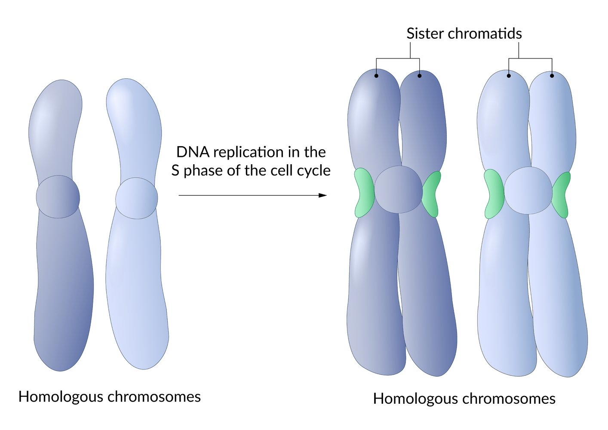

Homologous chromosomes before and after replication

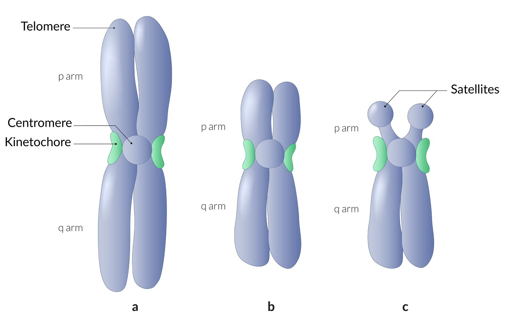

Chromosome morphology

### <u>Genotype</u> and <u>phenotype</u>

* Genotype: the chemical composition of an organism's <u>DNA</u>, contributing to that organism's <u>phenotype</u>

* The term is often used to describe a combination of <u>alleles</u> at one or more specific <u>loci</u>.

* Based on the <u>genotype</u>, the following states (zygosities) can be distinguished:

* Homozygote: The two <u>homologous chromosomes</u> contain identical <u>alleles</u> at a given <u>locus</u>.

* Heterozygote: The two <u>homologous chromosomes</u> contain different <u>alleles</u> at a given <u>locus</u>.

* Hemizygote: having only one copy of a <u>chromosome</u> pair (e.g., <u>genes</u> located on a male individual's X or Y <u>chromosomes</u>).

* Phenotype: the observable traits of an organism

* Determined by a combination of the <u>genotype</u> and environmental factors

* Includes an individual's physical traits (e.g., <u>eye</u> or <u>hair</u> color) and physiological characteristics (e.g., <u>atopy</u>)

* Dominance: the characteristic of an <u>allele</u> to mask or override the <u>phenotypical</u> effects of the <u>allele</u> on the other corresponding copy of the <u>chromosome</u> in <u>heterozygous</u> individuals

* Dominant allele: the <u>allele</u> which is <u>phenotypically</u> apparent in <u>heterozygous</u> individuals (overrides the <u>phenotypical</u> effects of the corresponding <u>allele</u> in <u>heterozygous</u> individuals)

* Recessive allele: an <u>allele</u> whose effects are overridden by the corresponding <u>dominant allele</u> in <u>heterozygous</u> individuals

* Codominance: a state in which both <u>alleles</u> are fully expressed and contribute to the <u>heterozygote</u> <u>phenotype</u> 
* Examples

* <u>ABO blood group system</u>

* <u>Human leukocyte antigens</u> (<u>HLA</u>)

* <u>α1-antitrypsin deficiency</u>

* Incomplete dominance: a type of dominance in which the <u>dominant allele</u> fails to completely override the <u>phenotypic</u> expression of the <u>recessive allele</u>, thus producing a new intermediate <u>phenotypic</u> trait (e.g., <u>sickle cell trait</u>)

> [!TIP]
> Compared to <u>dominant alleles</u>, that have the same <u>phenotypical</u> expression regardless of the <u>zygosity</u>, <u>codominant</u> <u>alleles</u> express two completely different <u>phenotypes</u> in <u>homozygous</u> and <u>heterozygous</u> individuals.

### Mendelian principles of inheritance

Three fundamental principles, originally described by Gregor Mendel through plant <u>hybridization</u> studies, explain the basic mechanisms of trait transmission between generations.

#### Law of segregation

* Principle: Each individual carries two <u>alleles</u> for every <u>gene</u>, which separate (segregate) during <u>gamete</u> formation.

* Mechanism: occurs during <u>anaphase I</u> of <u>meiosis</u> when <u>homologous chromosome</u> pairs undergo disjunction (separate), ensuring each <u>gamete</u> receives only one <u>allele</u> per <u>gene</u>

* Result: each <u>gamete</u> receives only one <u>allele</u> for each <u>gene</u>

* Clinical relevance: explains why offspring inherit one <u>allele</u> from each parent

#### Law of dominance

* Principle: In organisms carrying two different allelic variants for a single trait, one variant (dominant) will determine the observed <u>phenotype</u> while the other (recessive) remains unexpressed.

* Manifestation: <u>dominant alleles</u> are expressed in <u>heterozygous</u> individuals

* Clinical examples

* <u>Autosomal dominant</u> conditions like <u>Huntington disease</u> manifest with just one altered <u>allele</u>.

* <u>Autosomal recessive</u> disorders like <u>cystic fibrosis</u> require two altered <u>alleles</u> for expression.

* Extensions: <u>codominance</u> (ABO <u>blood groups</u>) and <u>incomplete dominance</u> represent variations of this law

#### Law of independent assortment

* Principle: <u>alleles</u> for different <u>genes</u> are distributed to <u>gametes</u> independently of each other

* Mechanism: random alignment of <u>chromosome</u> pairs during <u>metaphase I</u> of <u>meiosis</u> creates independent distribution patterns for unlinked <u>genes</u>

* Limitation: applies only to <u>genes</u> on different <u>chromosomes</u> or far apart on the same <u>chromosome</u>

* Clinical relevance: enables novel allelic combinations in offspring, contributing to population-level <u>genetic variation</u> (genetic diversity); forms the foundation for calculating inheritance <u>probabilities</u> in multi-<u>gene</u> trait analysis

### Genetic <u>penetrance</u> and <u>expressivity</u>

| Types of genetic <u>penetrance</u> and <u>expressivity</u> |  |  |
| --- | --- | --- |
| Mechanism | Definition | Example |
| Penetrance |   * The <u>proportion</u> of individuals in which a specific <u>genotype</u> manifests with a specific <u>phenotype</u>  * <u>Probability</u> of expressing a specific <u>phenotype</u> = (<u>probability</u> of inheriting the <u>genotype</u>) x (the <u>penetrance</u> of that <u>genotype</u>)    |  * N/A   |
| Complete penetrance |  * <u>Phenotypical</u> expression of a trait in all carriers of a specific <u>gene</u>   |   * All individuals with a <u>gain-of-function</u> mutation in the <u>FGFR3</u> <u>gene</u> will develop <u>achondroplasia</u>.  * All individuals with an <u>NF1</u> <u>gene</u> mutation will develop <u>neurofibromatosis type 1</u>.    |
| Incomplete penetrance |  * <u>Phenotypical</u> expression of a particular <u>gene</u> or genomic region is not observed in all individuals   |  * Approx. half of patients with <u>BRCA1</u> <u>gene</u> mutations develop <u>breast cancer</u> [[3]](https://coursology-qbank.com/amboss/article/sFbtjv)   |
| Expressivity |  * The extent to which a <u>phenotype</u> is manifested in an individual carrying a particular <u>genotype</u>.   |  * N/A   |
| Variable expressivity |  * The variable <u>phenotypic</u> expression of a given <u>genotype</u>, which implies that a genetic disorder can manifest with different signs, symptoms, and degrees of severity in different individuals   |  * <u>Marfan syndrome</u>, <u>neurofibromatosis type 1</u>, <u>ADPKD</u>   |
| Pleiotropy |  * A phenomenon in which one <u>gene</u> influences the development of multiple <u>phenotypical</u> traits   |   * <u>PAH</u> <u>gene</u> mutations result in multiple clinical features of <u>phenylketonuria</u>, including psychomotor impairment, musty body odor, and light <u>skin</u> pigmentation.  * Other examples: <u>Marfan syndrome</u>, <u>sickle cell disease</u>    |
| Compound heterozygosity |   * A phenomenon in which both <u>alleles</u> of a <u>gene</u> at a particular <u>locus</u> on <u>homologous chromosomes</u> are mutated.  * <u>Compound heterozygosity</u> explains the occurrence of recessive diseases in <u>heterozygous</u> individuals.    |  * <u>Hemochromatosis</u>   |
| Anticipation (genetics) |  * A phenomenon in which disease onset occurs earlier and/or the disease manifestation is more severe in offspring than in parents.   |  * <u>Trinucleotide repeat</u> diseases (e.g., <u>Huntington disease</u>, <u>myotonic dystrophy</u>)   |
| Allelic heterogeneity |  * A phenomenon in which different mutations of the same <u>allele</u> result in the same <u>phenotype</u>   |  * <u>G6PD deficiency</u>, <u>familial hypercholesterolemia</u>, <u>β-thalassemia</u>   |
| Locus heterogeneity |  * A phenomenon in which <u>gene mutations</u> at different <u>loci</u> produce the same <u>phenotype</u>   |  * <u>Osteogenesis imperfecta</u>, <u>albinism</u>   |
|  Linkage disequilibrium    |   * The property of particular <u>alleles</u> at two linked <u>loci</u> to be expressed more or less often than would be expected in the general population  * May vary in different populations  * May occur in settings where allelic <u>loci</u> are within close proximity to each other on a <u>chromosome</u>, therefore decreasing the <u>probability</u> of <u>DNA recombination</u>    |  * Individuals from the population who are not blood-related (i.e., in which a random association of the <u>alleles</u> would be expected).   |
| Epistasis |  * The influence of the expression of one or more <u>genes</u> on the expression of another <u>gene</u>   |  * <u>Albinism</u>  * Expression of the <u>albinism</u> <u>gene</u> influences the expression of the <u>gene</u> responsible for <u>skin</u> color.  * Therefore, if the <u>albinism</u> <u>gene</u> is expressed, the individual will be pale-skinned, regardless of what <u>skin</u> color would have otherwise been expressed <u>phenotypically</u>.   |

Section 3 Linkage Disequilibrium

### Genetic leakage

* Definition: the transfer of genetic material between species

* Can occur through:

* <u>Hybridization</u> (primarily in <u>eukaryotes</u>)

* Occurs when two different species mate and produce a hybrid offspring

* This hybrid can then mate with an individual from a parent species (backcrossing), introducing novel <u>genes</u> into that species' <u>gene pool</u>.

* Examples

* Certain species of plants can hybridize and produce fertile offspring, allowing <u>genes</u> for traits like pesticide resistance to leak from one species to another.

* A horse and a donkey can produce a mule, but mules are sterile. This is <u>hybridization</u>, but no <u>genetic leakage</u> occurs.

* <u>Horizontal gene transfer</u> (primarily in <u>prokaryotes</u>): via <u>bacterial transformation</u>, <u>bacterial transduction</u>, and <u>bacterial conjugation</u> 
* Examples: bacterial <u>antibiotic</u> resistance transfer or acquisition of <u>virulence factors</u> in bacteria, viral <u>vectors</u> (<u>gene therapy</u>/<u>vaccine</u> creation)

---

## Types of mutations

### Overview

* Mutations are alterations in a cell's <u>genome</u>.

* Mutations may have <u>endogenous</u> causes (e.g., errors in <u>DNA replication</u>, cell division, and/or <u>DNA repair mechanisms</u>) or <u>exogenous</u> ones (e.g., a variety of physical, chemical, and <u>biological agents</u> ).

Section 5 DNA Mutations

### Mutations according to the affected cell population

* Germline mutation (<u>gametic mutation</u>): a mutation of <u>germline cells</u> that can be passed on to offspring

* Somatic mutation (<u>acquired mutation</u>): a mutation of somatic cells that typically affects only one <u>allele</u> of a <u>gene</u>

* Does not occur in <u>germline cells</u> and, therefore, cannot be passed on to offspring.

* A common mechanism of <u>carcinogenesis</u>

* Mosaicism: the presence of two or more populations of cells within an organism, each with a different genetic composition

* Chromosomal mosaicism

* The presence of cell populations with different <u>karyotypes</u> in one organism

* Example: <u>sex chromosome</u> <u>mosaicism</u> is frequently seen in <u>Turner syndrome</u> (i.e., one population of XO cells and one population of XX cells)

* Gonadal mosaicism

* The selective presence of a mutation in individual germ cells

* Caused by a mutation in the <u>DNA</u> of a primordial germ cell during <u>mitosis</u>

* Clinical application: Suspect this type of <u>mosaicism</u> if no blood relatives of the affected individual have the condition.

* Somatic mosaicism

* The selective presence of a mutation in individual somatic cells

* Caused by a mutation during <u>mitosis</u> after <u>fertilization</u>

* Usually, multiple tissues or organs are affected

* Example: <u>McCune-Albright syndrome</u>

* Chimerism: The presence of two genetically distinct cell lines that arise from two different <u>zygotes</u> that fused into one single embryo.

* Chromosomal instability: a <u>chromosomal</u> state characterized by increased susceptibility to mutations

* Caused by mutations of <u>DNA repair</u> <u>genes</u>

* Results in multiple <u>chromosomal</u> translations, inversions, and deletions among daughter cells

* Examples: <u>Fanconi anemia</u>, <u>ataxia-telangiectasia</u>

* Loss of heterozygosity (LoH): loss of a normal <u>allele</u> of a <u>gene</u> with the exclusive expression of the abnormal <u>allele</u>

* The occurrence of LoH in <u>tumor suppressor genes</u> leads to malignant transformation of <u>the cell</u>.

* Example: <u>Lynch syndrome</u>

* Two-hit hypothesis: states that two mutations (i.e., “hits”) must occur in the cellular <u>DNA</u> of <u>tumor suppressor genes</u> to induce <u>oncogenesis</u> 

* First hit: One copy of a <u>tumor suppressor gene</u> is inactivated by mutation or <u>epigenetic</u> changes.

* <u>The cell</u> becomes <u>heterozygous</u>.

* The second <u>allele</u> is functional and produces a normal <u>tumor suppressor protein</u>.

* Second hit: The second copy of a <u>tumor suppressor gene</u> is inactivated by the mutation.

* LoH occurs (<u>the cell</u> becomes <u>homozygous</u>)

* No <u>tumor suppressor protein</u> is produced leading to increased risk of <u>oncogenesis</u>

* Does not apply to <u>oncogenes</u>

* Examples: <u>retinoblastoma</u>, <u>Li-Fraumeni syndrome</u>, <u>Lynch syndrome</u>, <u>familial adenomatous polyposis</u>

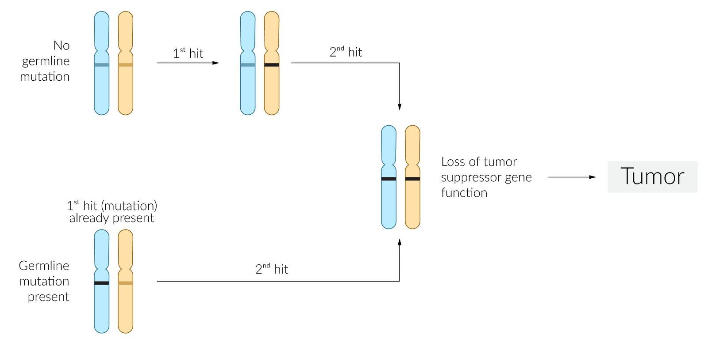

Two-hit hypothesis

### Terminology of chromosomal abnormalities

| Most common terms of <u>chromosomal abnormalities</u> |  |  |  |
| --- | --- | --- | --- |
| Abbreviation | Term | Example | Interpretation |
| del | Deletion | 46,XY, del(p5) | Deletion of the short arm of <u>chromosome</u> 5 in a male individual (e.g., <u>cri-du-chat syndrome</u>) |
| dup | Duplication | 46,XX, dup(q3) | Duplication of the long arm of <u>chromosome</u> 3 in a female individual |
| inv | <u>Inversion</u> | 46,XY, inv(3)(p23q27) | Pericentric <u>inversion</u> of the <u>chromosome</u> 3 segment with breakpoints at position 23 on the short arm and 27 on the long arm in a male individual |
| t | Translocation | 46,XY, t(14;18)(q32;q21) | Translocation between position 32 on <u>chromosome</u> 14 and position 21 on <u>chromosome</u> 18 in a male individual (e.g., <u>follicular lymphoma</u>) |
| rob | <u>Robertsonian translocation</u> | 46,XX, rob(14;21) |  <u>Chromosomal translocation</u> with fusion of the long arms of the <u>acrocentric</u> <u>chromosomes</u> 14 and 21 in a female individual. The short arms of the two <u>chromosomes</u> involved are lost. |
| / | <u>Mosaicism</u> | 45,X/46, XX | Presence of a normal cell population and one with <u>X monosomy</u> in a female individual (e.g., <u>Turner syndrome</u>) |

### Chromosomal aberrations

#### Introduction

* <u>Chromosomal aberrations</u> are mutations affecting large segments of <u>DNA</u>.

* Numerical abnormalities can be visualized on a <u>karyogram</u>, while structural <u>chromosomal</u> defects can be detected using <u>fluorescence in situ hybridization</u> (<u>FISH</u>).

* See “<u>Chromosome testing</u>” in “<u>Laboratory methods</u>.”

#### Subtypes of <u>chromosomal aberrations</u>

* Numerical chromosomal aberrations: the presence of an abnormal number of copies of a single <u>chromosome</u>, which is usually caused by the failure of <u>homologous chromosomes</u> to separate during <u>mitosis</u> or <u>meiosis</u>, also known as nondisjunction  

* Aneuploidy: an abnormal number of <u>chromosomes</u> or parts of a <u>chromosome</u> within <u>the cell</u>

* Hypoploidy: the presence of fewer <u>chromosomes</u> within a cell compared to the expected number

* Polyploidy: a state in which cells have more than two paired sets of <u>chromosomes</u>

* Monosomy

* Presence of a single copy of a <u>chromosome</u>

* Usually results in embryonic <u>death</u> due to high <u>probability</u> of recessive trait expression of the respective <u>chromosome</u>

* Exception: <u>Turner syndrome</u>, which is characterized by a <u>45,XO</u> <u>genotype</u>)

* Hyperploidy: the presence of extra <u>chromosomes</u> within a cell

* <u>Trisomy</u>: the presence of a triplicate instead of a duplicate set of <u>chromosomes</u> (e.g., <u>trisomy 21</u>, <u>trisomy 13</u>, <u>trisomy 18</u>)

* Polysomy: the presence of ≥ 3 copies of a <u>chromosome</u> in a cell (e.g., <u>trisomy</u>, tetrasomy, pentasomy)

* Structural chromosomal aberrations: an alteration of a <u>chromosome</u> structure with an identical number of <u>chromosomes</u> 

* Deletion is defined as a loss of a <u>chromosome</u> segment. Examples include: 

* <u>Cri-du-chat syndrome</u>, which is characterized by 46,XX, del(5)

* <u>Myelodysplastic syndrome</u>, which is characterized by 5q deletion

* Duplication: duplication of a <u>chromosome</u> segment

* <u>Inversion</u>: <u>chromosomal</u> rearrangement involving end-to-end reversal of a <u>chromosomal</u> segment (e.g., 46,XY, inv(3)(p23q27))

* Chromosomal translocation: relocation of one <u>chromosome</u> segment onto another (nonhomologous) <u>chromosome</u>

Meiotic nondisjunction

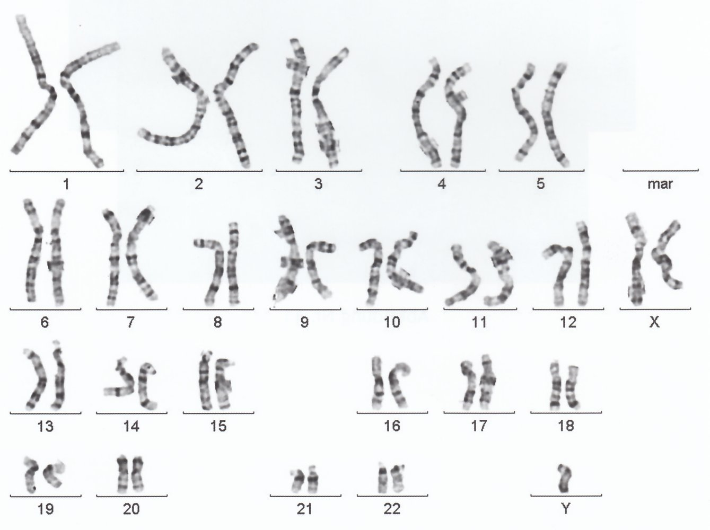

Karyotype of Klinefelter syndrome

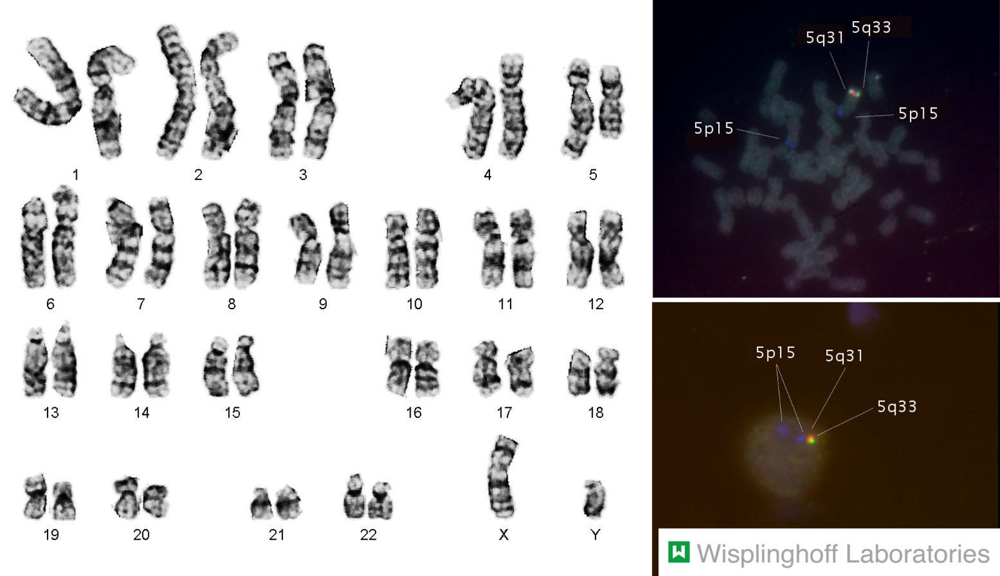

Myelodysplastic syndrome: 5q deletion

#### Types of <u>chromosomal translocations</u>

All translocations are classified as <u>structural chromosomal aberrations</u>.

* Balanced translocation: a type of translocation in which no genetic material is lost or duplicated, thus expressing a normal <u>phenotype</u>

* Unbalanced translocation

* A type of translocation in which genetic material is lost or duplicated, thus expressing an abnormal <u>phenotype</u>

* <u>Unbalanced translocations</u> can result in <u>chromosomal</u> imbalance (e.g., <u>Patau syndrome</u>), multiple <u>malformations</u>, <u>stillbirth</u>, and repeated <u>miscarriages</u>

* Robertsonian translocation: a <u>chromosomal translocation</u> that involves the fusion of the long arms of two <u>acrocentric chromosomes</u> at the <u>centromere</u> with resulting loss of the short arms of the involved <u>chromosomes</u> 

* One of the most frequent translocations [[4]](https://coursology-qbank.com/amboss/article/NfX-mx)

* May be balanced or unbalanced

* Example: Unbalanced 46,XY, rob(14;21) is a possible mechanistic cause of <u>Down syndrome</u>.

* Balanced Robertsonian translocation: translocation of the long arm of <u>chromosome</u> 21 to the long arm of <u>chromosome</u> 14 with the elimination of the respective short arms  

* <u>Karyogram</u> shows a total number of 45 <u>chromosomes</u>

* Results in a normal <u>phenotype</u>

* Affected individuals inherit a <u>balanced translocation</u> from their <u>phenotypically</u> normal parent.

* <u>Pregnancies</u> with <u>balanced translocations</u> have an increased risk of <u>miscarriage</u>. [[5]](https://coursology-qbank.com/amboss/article/csYaFq)

* Children of carriers of <u>balanced translocations</u> are at higher risk of acquiring <u>unbalanced translocation</u>

* Unbalanced Robertsonian translocation: clinical features of <u>trisomy 21</u> caused by inheritance of a translocation <u>chromosome</u> and a normal <u>chromosome</u>  

* Although there are only 46 <u>chromosomes</u> present, three copies of genetic material from <u>chromosome</u> 21 exist

* Results in the <u>karyotypes</u> 46,XX,+21,t(14;21) and 46,XY,+21,t(14;21)

* Reciprocal translocation: a translocation between nonhomologous <u>chromosomes</u> (e.g., <u>Philadelphia translocation</u>)

| Overview of common chromosomal translocations |  |  |
| --- | --- | --- |
| Translocation | <u>Gene</u> product | Associated conditions |
| t(9;22) |  * <u>BCR-ABL</u> hybrid   |  * <u>CML</u>, <u>ALL</u> (less common)   |
| t(8;14) |  * <u>C-myc</u> activation   |  * <u>Burkitt lymphoma</u>   |
| t(14:18) |  * <u>BCL-2</u> activation   |  * <u>Follicular lymphoma</u>   |
| t(11;14) |  * <u>Cyclin</u> D1 activation   |  * <u>Mantle cell lymphoma</u>   |
| t(11;18) |  * BIRC3   |  * <u>Marginal zone B-cell lymphomas</u>   |
| t(15;17) |  * Promyelocytic <u>leukemia</u> protein   |  * <u>Acute promyelocytic leukemia</u> (<u>M3-AML</u>)   |
| t(12;21) |  * TEL   |  * <u>B-cell acute lymphoblastic leukemia</u> (<u>B-cell ALL</u>)   |
| t(11;22) |  * Fusion protein EWS-FLI1   |  * <u>Ewing sarcoma</u>   |

Karyogram in balanced Robertsonian translocation (14/21)

Robertsonian Translocation 1

Robertsonian Translocation 2

#### Other <u>chromosomal aberrations</u>

* Uniparental disomy: a <u>chromosomal abnormality</u> in which offspring receive two copies of one <u>chromosome</u> from one parent and no copies from the other parent

* May be caused by errors in <u>meiosis I</u> (i.e., <u>heterodisomy</u>), <u>meiosis II</u> (i.e., <u>isodisomy</u>), or trisomic rescue

* Heterodisomy: error in <u>meiosis I</u> → two different <u>homologous chromosomes</u> from one parent passed to offspring

* Isodisomy can have two different causes:

* Error in <u>meiosis II</u> → identical <u>homologous chromosomes</u> from one parent passed to offspring

* Postzygotic <u>chromosomal</u> duplication leads to duplication of one <u>chromosome</u> of one pair and subsequent loss of the other

* Usually results in normal <u>phenotype</u> and <u>euploidy</u> in affected individuals

* Should be suspected if an individual presents with an <u>autosomal recessive</u> condition but only one parent is a carrier

* Examples

* <u>Angelman syndrome</u> (5% of cases)

* <u>Prader-Willi</u> syndrome (25% of cases)

* May also result from trisomy rescue

* When a cell containing three copies of a <u>chromosome</u> from <u>nondisjunction</u> loses one of those <u>chromosomes</u>, resulting in two <u>chromosomes</u>

* If both of the remaining <u>chromosomes</u> are from the same parent, this results in <u>uniparental disomy</u>

> [!TIP]
> <u>Uniparental disomy</u> cannot be detected via <u>karyotyping</u> because the number of <u>chromosomes</u> is normal and there is no loss of genetic material.

> [!NOTE]
> HeterodIsomy: <u>meiosis</u> I error; IsodIsomy: <u>meiosis</u> II error

> [!NOTE]
> 12–345: the <u>chromosomes</u> most frequently involved in <u>Robertsonian translocations</u> are <u>chromosomes</u> 21, 22, 13, 14, and 15.

Uniparental disomy

### Gene mutations

#### Types of <u>gene mutations</u>

* Point mutation: alteration of a single <u>DNA</u> <u>base pair</u>

* Genetic transition: the replacement of one <u>purine</u> with another <u>purine</u> (e.g., G to A), or the replacement of a <u>pyrimidine</u> with another <u>pyrimidine</u> (e.g., T to C)

* Genetic transversion: the replacement of a <u>purine</u> with a <u>pyrimidine</u> (e.g., A to C, A to T, G to C, G to T) and vice versa

* Deletion: loss of one or more <u>base pairs</u>

* Splice site mutation

* A genetic mutation at the specific site in between <u>exons</u> and <u>introns</u> that may cause changes in <u>splicing</u> that result in the inclusion of <u>introns</u> or the loss of <u>exons</u>

* Can have a variable effect on the <u>phenotype</u>, depending on the exact location of the mutation

* Insertion: addition of one or more <u>base pairs</u>

* Substitution: one or more <u>base pairs</u> are replaced by different <u>base pairs</u>

* Trinucleotide repeat expansion

* Increased repetition of base triplets that leads to faulty <u>protein synthesis</u> or folding

* Characterized by <u>genetic anticipation</u>

| Trinucleotide repeat expansion diseases |  |  |  |  |  |
| --- | --- | --- | --- | --- | --- |
|  | Mode of inheritance | Affected <u>gene</u> | <u>Chromosome</u> | <u>Trinucleotide repeat</u> | Typical features |
| <u>Huntington disease</u> | <u>Autosomal dominant</u> | <u>HTT</u> | 4 | CAG | <u>Chorea</u>, <u>akinesia</u>, cognitive decline, behavioral changes |
| <u>Fragile X syndrome</u> | <u>X-linked dominant</u> | FMR1 | X | CGG | Large protruding chin, large genitalia (<u>testes</u>), <u>hypermobile joints</u>, <u>mitral valve prolapse</u> |
| <u>Myotonic dystrophy</u> | <u>Autosomal dominant</u> | <u>DMPK</u> | 19 | <u>CTG</u> | <u>Cataracts</u>, premature <u>hair</u> loss in men, <u>myotonia</u>, <u>arrhythmia</u>, gonadal <u>atrophy</u> (men), <u>ovarian insufficiency</u> (women) |
| <u>Friedreich ataxia</u> | <u>Autosomal recessive</u> | <u>FXN</u> | 9 | GAA | <u>Ataxic gait</u>, <u>dysarthria</u>, <u>kyphoscoliosis</u>, <u>hypertrophic cardiomyopathy</u> |

Section 9 Trinucleotide Repeat Disorders

#### Classification of <u>gene mutations</u>

Grade of mutational severity in ascending order: silent < missense < nonsense < frameshift

* Frameshift mutation

* A shift in the reading frame caused by the insertion or deletion of a number of <u>nucleotides</u> not divisible by 3 that leads to modified <u>amino acid</u> coding in the <u>gene</u> segments downstream

* Results in the synthesis of shorter or longer <u>proteins</u> with a modified or absent function

* Examples: <u>Tay-Sachs disease</u>, <u>Duchenne muscular dystrophy</u>

* Nonframeshift mutation

* A mutation of a <u>gene</u> with the insertion or deletion of a number of <u>nucleotides</u> that is divisible by three.

* These types of mutations tend to be less severe than <u>frameshift mutations</u>, as the missing (or added) <u>codons</u> often lead to partially functional <u>peptides</u>.

* Nonsense mutation

* The substitution of a <u>nucleotide</u> that produces a <u>stop codon</u> (UAA, UGA, UAG) and leads to alterations in the <u>splicing</u> process with early termination of <u>translation</u>

* Typically results in nonfunctional <u>proteins</u>

* Missense mutation

* A <u>point mutation</u> resulting in the formation of a triplet that codes for another <u>amino acid</u>

* Considered a conservative <u>missense mutation</u> when the new <u>amino acid</u> is similar in chemical structure to the original <u>amino acid</u>

* Example: <u>sickle cell disease</u> (<u>glutamate</u> is substituted with <u>valine</u>)

* Silent mutation

* A <u>point mutation</u> that forms a triplet that codes for the same <u>amino acid</u>

* Often involves a base change at the <u>tRNA wobble</u> position (3rd position of the <u>codon</u>)

* In-frame deletion or insertion: deletion or insertion of three, six, nine, or more <u>base pairs</u> (always in triplets) without a shift in the reading frame, but with deletion or insertion of one, two, three, or more <u>amino acids</u> in the protein during <u>translation</u>

* Loss-of-function mutation: a mutation resulting in the expression of the <u>gene</u> product with decreased or absent function

* Gain-of-function mutation: a mutation that leads to either the expression of the larger amount of the <u>gene</u> product or increased function of the expressed <u>gene</u> product

* Splice mutation: an alteration (especially <u>point mutations</u>) in the <u>nucleotide</u> sequence required for <u>splicing</u> (e.g., the <u>exon</u>-<u>intron</u> border or at the junction) 

* Results in defective <u>mRNA</u> (e.g., due to a retained <u>intron</u>) → shortened <u>proteins</u> that are either defective or exert an altered function

* Examples include:

* Some forms of <u>β-thalassemia</u>

* <u>Gaucher disease</u>

* <u>Marfan syndrome</u>

* <u>Dementia</u>

* <u>Epilepsy</u>

* Dominant-negative mutation

* A <u>gene</u> mutation that produces a nonfunctional protein that exerts a dominant effect

* This nonfunctional protein impairs the function of the normal protein encoded by the <u>wild-type allele</u> in <u>heterozygous</u> individuals (e.g., mutant, nonfunctional <u>p53</u>, binds <u>DNA</u> and prevents the attachment of the functional <u>p53 protein</u>) [[6]](https://coursology-qbank.com/amboss/article/hgXcEx)

> [!TIP]
> Compared to missense or <u>silent mutations</u>, nonsense and <u>frameshift mutations</u> lead to fundamental structural changes of the coded <u>proteins</u>. Consequently, these mutations result in more severe disease manifestations.

> [!NOTE]
> STOP the NONSENSE: NONSENSE mutations create early STOP <u>codons</u> in the <u>RNA</u>.

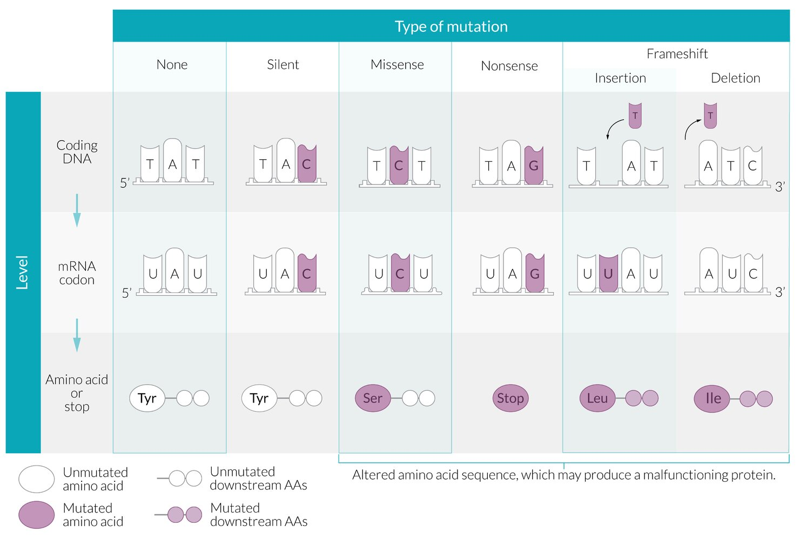

Splice site mutations

### Examples of genetic disorders by <u>chromosome</u>

| <u>Chromosome</u> | Disorders |
| --- | --- |
| 3 |   * <u>von Hippel-Lindau</u> disease  * Hereditary <u>renal cell carcinoma</u>  * <u>Spinocerebellar ataxia</u> type 7  * <u>Protein S deficiency</u>    |
| 4 |   * <u>Huntington disease</u>  * <u>Achondroplasia</u>  * <u>ADPKD</u> (<u>PKD2</u>)  * <u>Hemophilia C</u>  * <u>Mucopolysaccharidosis</u> type I    |
| 5 |   * <u>Cri-du-chat syndrome</u>  * <u>Familial adenomatous polyposis</u>  * <u>Spinal muscular atrophy</u>    |
| 6 |   * <u>Hemochromatosis</u> (<u>HFE</u>)  * <u>Congenital adrenal hyperplasia</u>    |
| 7 |   * <u>Williams syndrome</u>  * <u>Cystic fibrosis</u>  * <u>Myotonia congenita Thomsen</u>  * <u>Myotonia congenita Becker</u>    |
| 8 |   * Primary familial <u>brain</u> calcification (Fahr disease)  * <u>Burkitt lymphoma</u>    |
| 9 |   * <u>Friedreich ataxia</u>  * <u>Tuberous sclerosis</u> (<u>TSC1</u>)  * <u>Polycythemia vera</u>    |
| 11 |   * <u>Nephroblastoma</u>  * <u>Sickle cell disease</u>  * <u>β-thalassemia</u>  * <u>Multiple endocrine neoplasia</u> type 1  * <u>Niemann-Pick disease</u>  * <u>Familial Mediterranean fever</u>    |
| 13 |   * <u>Patau syndrome</u>  * <u>Wilson disease</u>  * <u>Retinoblastoma</u> (RB1)  * <u>BRCA2</u>-associated <u>breast cancer</u>  * <u>Hirschsprung disease</u>    |
| 14 |  * <u>Burkitt lymphoma</u>   |
| 15 |   * <u>Prader-Willi syndrome</u>  * <u>Angelman syndrome</u>  * <u>Marfan syndrome</u>  * <u>Tay-Sachs disease</u>    |
| 16 |   * <u>ADPKD</u> (<u>PKD1</u>)  * α-<u>thalassemia</u>  * <u>Tuberous sclerosis</u> (<u>TSC2</u>)    |
| 17 |   * <u>Neurofibromatosis type 1</u>  * <u>BRCA1</u>-associated cancers  * <u>TP53</u>-associated cancers  * <u>Glycogen storage disease</u> type 2 (<u>Pompe disease</u>)  * <u>Osteogenesis imperfecta</u>    |
| 18 |   * <u>Edwards syndrome</u>  * <u>Niemann-Pick disease</u> type C  * <u>Erythropoietic protoporphyria</u>    |
| 21 |   * <u>Down syndrome</u>  * <u>Leukocyte adhesion deficiency type 1</u>    |
| 22 |   * <u>Neurofibromatosis type 2</u>  * <u>DiGeorge syndrome</u> (22q11)  * <u>Ewing sarcoma</u>    |
| X |   * <u>Fragile X syndrome</u>  * <u>X-linked agammaglobulinemia</u>  * <u>Klinefelter syndrome</u> (XXY)  * <u>Turner syndrome</u>  * <u>Triple X syndrome</u>  * <u>Adrenoleukodystrophy</u>    |

> [!NOTE]
> “Friedrich gave the fragile hunter my <u>tonic</u>”: Friedreich <u>ataxia</u>, fragile X syndrome, Huntington disease, and myo<u>tonic</u> <u>dystrophy</u> are examples of trinucleotide expansion disorders.

> [!NOTE]
> In <u>Huntington disease</u>, a CAG <u>trinucleotide repeat</u> leads to Chorea, Akinesia, and Grotesque behavior.
> In <u>fragile X syndrome</u>, a CGG <u>trinucleotide repeat</u> leads to an X-tra large Chin and Giant Genitalia.
> In <u>myotonic dystrophy</u>, a <u>CTG</u> <u>trinucleotide repeat</u> leads to Cataracts, Thinning <u>hair</u> (premature <u>hair</u> loss), and Gonadal <u>atrophy</u>.
> In <u>Friedreich ataxia</u>, a GAA trinucleotide expansion leads to an <u>ataxic</u> GAAit.

---

## Epigenetic regulation of gene expression

### Overview

* <u>Epigenetics</u> is the study of how an individual's surrounding environment and behaviors influence <u>gene expression</u> and regulation.

* <u>Epigenetic</u> modifications influence the activation or deactivation of <u>genes</u> through reversible alterations to the <u>chromatin</u> structure.

* <u>Gene expression</u> or repression is determined by chemical modifications of <u>DNA</u> bases (e.g., <u>methylation</u>) and <u>histone</u> <u>proteins</u> (e.g., various covalent modifications), which are carried out by specialized enzymes.

* <u>Epigenetic</u> modifications do not affect the <u>DNA</u> sequence or structure of <u>DNA</u> molecules.

* See “<u>Nucleotides, DNA, and RNA</u>.”

### Main mechanisms of <u>epigenetic</u> regulation

#### DNA methylation [[7]](https://coursology-qbank.com/amboss/article/jgX_Ex)

* Definition  

* <u>DNA methylation</u> is the linkage of CH3 groups to specific <u>DNA</u> <u>cytosine</u> bases with the subsequent formation of 5-methylcytosine.

* <u>DNA methylation</u> is facilitated by DNA methyltransferases, a conserved enzyme family of <u>cytosine</u> methylases critical for <u>epigenetic</u> regulation that transfer a methyl group to <u>DNA</u>.

* The resulting <u>DNA</u> segment has an unchanged <u>genetic code</u> but differs in <u>epigenetic</u> markers (e.g., <u>methylation</u> at <u>transcriptional</u> start sites) that alter <u>DNA</u> expression.

* Results in <u>transcriptional</u> inhibition of the <u>methylated</u> <u>gene</u>

* Process of <u>methylation</u>

* A newly synthesized <u>DNA</u> strand is <u>methylated</u> after <u>DNA replication</u> (using the matrix strand as a template).

* In vertebrates, <u>methylation</u> most commonly occurs at CpG islands, a region of <u>DNA</u> enriched for repeating segments of a <u>cytosine</u> <u>nucleotide</u> that is followed by a <u>guanine</u> <u>nucleotide</u>, linked by a phosphodiester bond.

* <u>CpG islands</u> are approx. 1000 base pairs in length

* Many <u>gene</u> <u>promoter</u> regions are found within <u>CpG islands</u>

* <u>Methylation</u> within the <u>CpG islands</u> will usually lead to repression of <u>gene transcription</u>.

* Inheritance: The pattern of <u>DNA methylation</u> (e.g., specific <u>methylation</u> of <u>CpG island</u> <u>transcription</u> start sites) can be inherited during somatic cell division and may be responsible for particular genomic processes (e.g., <u>genomic imprinting</u>).  [[7]](https://coursology-qbank.com/amboss/article/jgX_Ex)

* Examples

* X <u>chromosome</u> inactivation [[8]](https://coursology-qbank.com/amboss/article/kgXmvx)

* <u>Genomic imprinting</u> [[9]](https://coursology-qbank.com/amboss/article/4gX3vx)

* Cancerogenesis [[10]](https://coursology-qbank.com/amboss/article/PgXWvx)

* <u>Aging</u> [[11]](https://coursology-qbank.com/amboss/article/lgXvvx)

* <u>Transposable element</u> repression [[12]](https://coursology-qbank.com/amboss/article/OgXIvx)

> [!NOTE]
> <u>Epigenetic</u> regulation mechanisms: Acetylation Activates <u>DNA</u>; Methylation Mutes <u>DNA</u>.

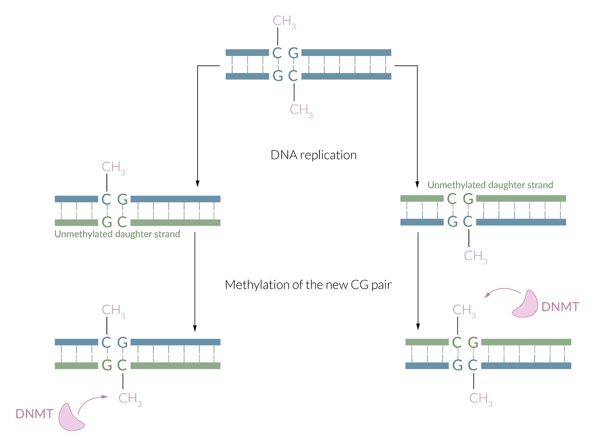

DNA methylation

#### Histone modification [[13]](https://coursology-qbank.com/amboss/article/zgXrBx)[[14]](https://coursology-qbank.com/amboss/article/-gXDBx)

* Definition

* The covalent bonding and chemical modification of <u>histone</u> <u>proteins</u> with various molecular moieties that alters the dynamic structure of <u>chromatin</u> and influence genomic regulation.

* Results in the modification of the <u>gene expression</u>

* Types of modifications: See “<u>Chromatin</u>” in “<u>Nucleotides, DNA, and RNA</u>.”

* <u>Acetylation</u>: ↑ <u>DNA</u> <u>transcription</u>

* Deacetylation: ↓ <u>DNA</u> <u>transcription</u>

* <u>Methylation</u> (of <u>lysine</u> and <u>arginine</u> residues): increased or decreased <u>gene transcription</u>

* <u>Phosphorylation</u>

* <u>Deamination</u>

* <u>Ubiquitination</u>

* Sumoylation

* <u>ADP ribosylation</u>

* Other modifications include <u>histone</u> tail <u>clipping</u>, <u>citrullination</u>, and serotonylation.

* Inheritance: the <u>histone modification</u> pattern is passed on to daughter cells during cell division

* Examples

* <u>Carcinogenesis</u>: dysregulated <u>histone deacetylases</u> (<u>HDACs</u>) can decrease the <u>transcription</u> of <u>cell cycle</u> inhibitors (e.g., <u>p21</u> in <u>colorectal cancer</u>) or <u>cell differentiation</u> factors (e.g., Runx1 in <u>leukemia</u>) [[15]](https://coursology-qbank.com/amboss/article/4rX3hz)

* <u>Aging</u>

#### Regulatory RNA [[16]](https://coursology-qbank.com/amboss/article/0SXeyx)

* Definition

* A diverse class of <u>RNA</u> molecules that play a role in the regulation of <u>chromatin</u> structure and <u>gene expression</u>

* These <u>RNA</u> molecules are typically noncoding and do not produce translated protein products.

* <u>Gene</u> regulation occurs via <u>RNA</u>-interference (<u>RNAi</u>) pathways (i.e., molecular pathways that use PIWI and Argonaute <u>proteins</u> to influence <u>histone</u> and <u>DNA</u> modifications with subsequent <u>transcriptional</u> inhibition).

* Types of <u>regulatory RNAs</u>: See “<u>RNA</u>: Structure and characteristics” in “<u>Nucleotides, DNA, and RNA</u>.”

* Long noncoding RNAs (lncRNA)

* Small interfering RNAs (<u>siRNA</u>)

* Micro RNAs (<u>miRNA</u>)

* PIWI-interacting <u>RNA</u> (piRNA)

* Examples [[17]](https://coursology-qbank.com/amboss/article/YSXnyx)

* <u>X chromosome inactivation</u>

* <u>Genomic imprinting</u>

* <u>Transposon</u> repression and silencing

### Examples of processes regulated by <u>epigenetic</u> mechanisms

#### X inactivation (<u>lyonization</u>)

* Definition

* Inactivation of one of the X <u>chromosomes</u> in individuals with two or more X <u>chromosomes</u> (e.g., female individuals or male individuals with <u>Klinefelter syndrome</u>).

* The selection of which X <u>chromosome</u> is inactivated, occurs randomly.

* Prevents a toxic double-dose of X <u>chromosome</u> <u>gene</u> products

* Occurs early during <u>embryogenesis</u>  with the affected X <u>chromosome</u> remaining inactive for the lifetime of <u>the cell</u>.

* Mechanism [[18]](https://coursology-qbank.com/amboss/article/JSXs0B)

* Multiple mechanisms of <u>lyonization</u> have been proposed including:

* <u>DNA methylation</u>

* <u>Histone</u> <u>posttranslational modifications</u>

* <u>RNAi</u> via lncRNAs such as X-inactive specific transcript <u>RNA</u> (Xist RNA), a functional <u>RNA</u> product that coats the affected X <u>chromosome</u> and serves as the initiating and, hence, most important event in the inactivation process.

* Results in a Barr body: contains the inactivated X <u>chromosome</u> packaged as <u>heterochromatin</u> 

* Transcriptionally inactive

* Located on the periphery of the <u>nucleus</u>

* Although most <u>genes</u> on the <u>Barr body</u> are inactive, some <u>genes</u> <u>escape</u> <u>lyonization</u> and remain active.

* Manifestation of X-linked disorders in female individuals

* Female individuals will only express <u>alleles</u> or <u>genes</u> located on the active X-<u>chromosome</u>.

* Therefore, the extent to which <u>heterozygous</u> female carriers of <u>X-linked recessive</u> disorders express <u>phenotypic</u> characteristics of the disease depends on the genetic inactivation pattern of the mutant versus the normal X-<u>chromosome</u>.

* This leads to <u>phenotypic</u> variation among <u>heterozygous</u> female carriers of X-linked disorders (e.g., one female carrier of an X-linked disorder may be completely asymptomatic, while another has severe manifestations of the involved disease).

* In female individuals who are <u>homozygous</u> for an <u>X-linked recessive</u> disorder, it does not matter which <u>chromosome</u> is inactivated

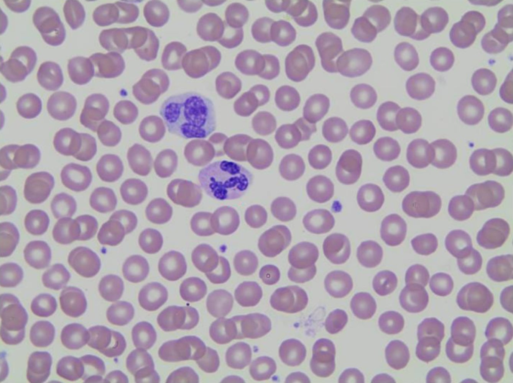

Barr body and aberrant nuclear projection

#### Genomic imprinting [[19]](https://coursology-qbank.com/amboss/article/rSXfaB)

* Definition: : a mechanism of <u>gene</u> regulation in which one <u>allele</u> of a <u>gene</u> is silenced and <u>imprinted</u> while the other <u>allele</u> is expressed depending on which parent it was inherited from (i.e., <u>parent-of-origin effect</u>) 
* Must uphold the four principles of <u>epigenetic</u> <u>imprinting</u>:
1. * The product of <u>gene transcription</u> must be affected.
2. * The <u>imprinting</u> must be heritable in a somatic lineage.
3. * The process of <u>genomic imprinting</u> is initiated during <u>gametogenesis</u>.
4. * The imprint must be eliminated in the <u>germline</u> for sex-specific reprogramming to occur in the next generation of <u>gametes</u>.

* Mechanism

* Depending on the <u>gene</u>, <u>DNA methylation</u> results in <u>epigenetic</u> silencing of either maternal or paternal <u>chromosomes</u> (e.g., if the paternal <u>gene</u> is silenced, only the maternal <u>gene</u> is expressed).

* <u>Methylation</u> results in regions called “differentially <u>methylated</u> regions” (DMRs)

* DMRs are the essential <u>imprinting</u> control regions that are responsible for allelic expression.

* <u>Imprinting</u> control regions often exist within <u>gene</u> <u>promoters</u>.

* In <u>imprinting</u> disorders, the expressed <u>allele</u> may be deleted, mutated, or not expressed at all.

* Examples of <u>genomic imprinting</u> disorders

* <u>Angelman syndrome</u>

* <u>Prader-Willi syndrome</u>

Section 2 Imprinting and Uniparental Disomy

---

## Pedigree analysis

### Overview

* Definition: the study of inherited traits or disorders and their <u>phenotypic</u> variability over several generations in a group of blood-related individuals by way of a <u>pedigree</u> chart, which depicts that group's genetic history in a <u>family tree</u>

* Elements

* Circles: female individuals

* Squares: male individuals

* Lines between circles and squares: familial relationship

* Roman numerals: generations

* Arabic numbers: children of a generation in order of <u>birth</u>

* Affected family members and carriers (i.e., <u>heterozygous</u> individuals who have the <u>allele</u> but are not <u>phenotypically</u> affected) are represented by shaded symbols.

Section 4 Pedigrees

### A basic methodological approach to <u>pedigree analysis</u>

* Question 1: Does every affected family member have an affected parent? 

* Yes: dominant inheritance of the trait

* No: recessive inheritance of the trait

* Question 2: Are the majority of affected family members male?

* Yes: most likely <u>X-linked recessive</u> inheritance

* No: Proceed to the following questions and subsequent answers.

* Question 2a: Do all affected male family members have an affected mother?

* Question 2b: Do all affected male family members have unaffected sons?

* Question 2c: Do all affected male family members have affected daughters? 

* If Questions 2a, 2b, and 2c have all been answered in the affirmative, the disease most likely follows an <u>X-linked dominant</u> pattern of inheritance.

* If Question 1 has been answered in the affirmative and either Question 2a, 2b, or 2c has been answered in the negative, the disorder is most likely <u>autosomal dominant</u>.

* If Question 2 and Questions 2a, 2b, and 2c have all been answered in the negative, the disorder is most likely <u>autosomal recessive</u>.

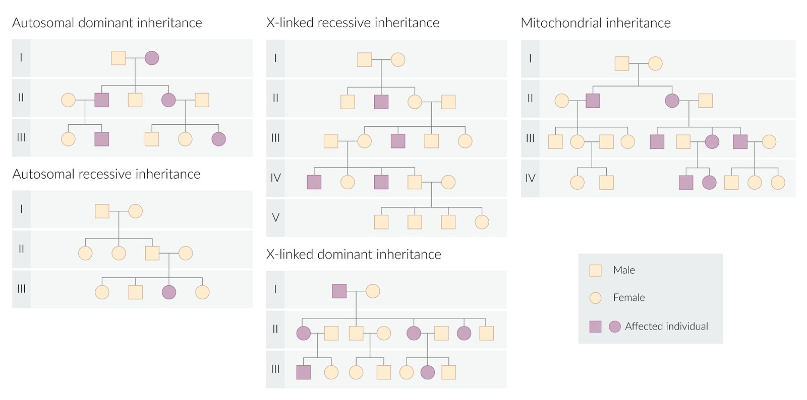

Modes of inheritance – Overview

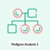

Pedigree Analysis - Part 1: Autosomal Inheritance Patterns

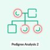

Pedigree Analysis - Part 2: Sex-linked Inheritance Patterns

---

## Autosomal dominant inheritance

### Overview

* Definition: a mode of inheritance that only requires one <u>allele</u> from a nonsex <u>chromosome</u>, passed on from either mother or father, for the <u>phenotypical</u> expression of a trait or disorder in offspring

* With regard to the <u>inheritance patterns</u> (both <u>autosomal</u> and X-linked), capital letters are used to describe the <u>dominant alleles</u> that cause the trait/disorder, while lowercase letters are used to describe the <u>recessive alleles</u> that do not cause the trait/disorder.

* <u>Autosomal dominant</u> (AD) disorders are usually due to mutations in <u>structural genes</u> (i.e., essential <u>genes</u> that code for <u>RNA</u> or protein products such as enzymes or cellular structural <u>proteins</u>).

* Every child with one parent who is affected and <u>heterozygous</u> has a 50% <u>probability</u> of inheriting the <u>allele</u> that causes the trait and, therefore, the associated trait or disorder (see tables and <u>pedigree</u> chart below).

* <u>Autosomal dominant</u> disorders are <u>pleiotropic</u> and their <u>expressivity</u> is often variable.

* Knowing about an individual's <u>family history</u> can provide vital information for diagnosis, since <u>autosomal dominant</u> conditions usually affect multiple generations, regardless of sex.

### Examples of AD <u>inheritance patterns</u>

* <u>Homozygous</u> parents: children have a 100% <u>probability</u> of inheriting the <u>allele</u> that causes the trait/disorder.

| AD <u>inheritance pattern</u> in <u>homozygous</u> parents |  |  |  |
| --- | --- | --- | --- |
|  |  |  <u>Homozygous</u> parent (affected) |  |
| N | N |  |  |
|  <u>Homozygous</u> parent (unaffected) | n | Nn (affected) | Nn (affected) |
| n | Nn (affected) | Nn (affected) |  |

* One <u>heterozygous</u> and one <u>homozygous</u> parent: Children have a 50% <u>probability</u> of inheriting the <u>allele</u> that causes the trait/disorder.

| AD inheritance pattern in heterozygous and homozygous parent |  |  |  |
| --- | --- | --- | --- |
|  |  |  <u>Heterozygous</u> parent (affected) |  |
| N | n |  |  |
|  <u>Homozygous</u> parent (unaffected) | n | Nn (affected) | nn (unaffected) |
| n | Nn (affected) | nn (unaffected) |  |

* <u>Heterozygous</u> parents: Children have a 75% <u>probability</u> of inheriting the <u>allele</u> that causes the trait/disorder.

| AD <u>inheritance pattern</u> in <u>heterozygous</u> parents |  |  |  |
| --- | --- | --- | --- |
|  |  |  <u>Heterozygous</u> parent (affected) |  |
| N | n |  |  |
|  <u>Heterozygous</u> parent (affected) | N | NN (affected) | Nn (affected) |
| n | Nn (affected) | nn (unaffected) |  |

> [!TIP]
> An <u>autosomal dominant</u> disease with <u>complete penetrance</u> will always manifest with clinical features in every generation.

### Examples of AD disorders

* <u>Achondroplasia</u>

* <u>Autosomal dominant polycystic kidney disease</u> (<u>ADPKD</u>)

* <u>Ehler-Danlos syndrome</u>

* <u>Familial adenomatous polyposis</u>

* <u>Familial hypercholesterolemia</u>

* <u>Hereditary spherocytosis</u>

* <u>Huntington disease</u>

* <u>Li-Fraumeni syndrome</u>

* <u>Marfan syndrome</u>

* <u>Multiple endocrine neoplasias</u>

* <u>Myotonic muscular dystrophy</u>

* <u>Neurofibromatosis type 1</u>

* <u>Neurofibromatosis type 2</u>

* <u>Osler-Weber-Rendu syndrome</u>

* <u>Osteogenesis imperfecta</u>

* <u>Tuberous sclerosis</u>

* <u>Von Hippel-Lindau disease</u>

Section 6 Autosomal Dominant Diseases

Section 6.1 Autosomal Dominant Diseases

---

## Autosomal recessive inheritance

### Overview

* Definition: a mode of inheritance that requires two copies of an <u>allele</u> from nonsex <u>chromosomes</u>, one from the mother and one from the father, for the <u>phenotypical</u> expression of a trait or disorder in offspring

* With regards to recessive <u>inheritance patterns</u> (both <u>autosomal</u> and X-linked), lowercase letters are used to describe the <u>recessive alleles</u> that cause trait/disorder, while capital letters are used to describe <u>dominant alleles</u> that do not cause trait/disorder.

* <u>Autosomal recessive</u> (<u>AR</u>) disorders manifest early in childhood and typically feature more severe symptoms than <u>autosomal dominant</u> disorders (e.g., <u>autosomal recessive polycystic kidney disease</u> vs. <u>autosomal dominant</u> polycystic disease).

* Normally seen only in one generation of a <u>pedigree</u>.

* Families arising from consanguineous partnerships have an increased risk for <u>autosomal recessive</u> diseases.

* <u>Autosomal recessive</u> diseases usually involve enzyme defects.

* Patterns of inheritance occur via two possible mechanisms:

* Homozygosity for the <u>allele</u> that causes the trait/disorder

* <u>Compound heterozygosity</u>

### Examples of <u>AR</u> <u>inheritance patterns</u>

* <u>Homozygous</u> parents: no children will be affected, but all will be carriers

| <u>AR</u> <u>inheritance pattern</u> in <u>homozygous</u> parents |  |  |  |
| --- | --- | --- | --- |
|  |  |  <u>Homozygous</u> parent (unaffected) |  |
| N | N |  |  |
|  <u>Homozygous</u> parent (affected) | n | Nn (carrier) | Nn (carrier) |
| n | Nn (carrier) | Nn (carrier) |  |

* One <u>heterozygous</u> and one <u>homozygous</u> parent: All children inherit the <u>allele</u> that causes the trait or disorder, but only 50% will express the trait while other 50% will be carriers.

| <u>AR</u> <u>inheritance pattern</u> in <u>heterozygous</u> and <u>homozygous</u> parent |  |  |  |
| --- | --- | --- | --- |
|  |  |  <u>Heterozygous</u> mother (carrier) |  |
| N | n |  |  |
|  <u>Homozygous</u> father (affected) | n | Nn (carrier) | nn (affected) |
| n | Nn (carrier) | nn (affected) |  |

* <u>Heterozygous</u> parents

* Half of the children will be carriers, 25% will express the trait, and 25% will not express the trait.

* Healthy individuals with an affected sibling (nn) have a two-thirds-<u>probability</u> of being a carrier (Nn, Nn, or NN).

| <u>AR</u> <u>inheritance pattern</u> in <u>heterozygous</u> parents |  |  |  |
| --- | --- | --- | --- |
|  |  |  <u>Heterozygous</u> parent (carrier) |  |
| N | n |  |  |
|  <u>Heterozygous</u> parent (carrier) | N | NN (unaffected) | Nn (carrier) |
| n | Nn (carrier) | nn (affected) |  |

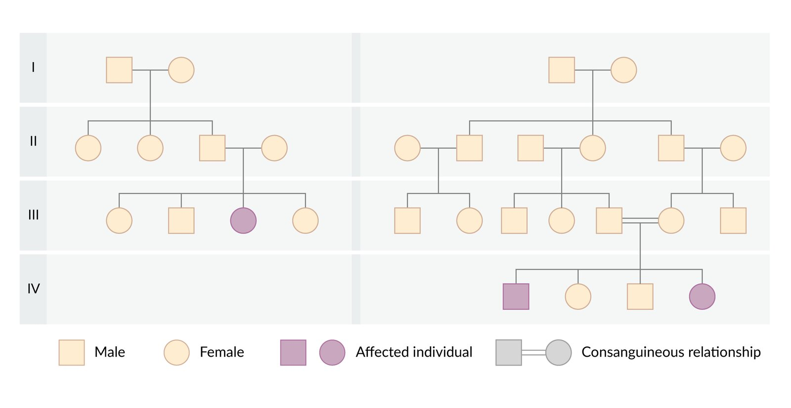

Autosomal recessive inheritance

### Examples of <u>AR</u> disorders

* <u>Oculocutaneous albinism</u>

* <u>ARPKD</u>

* <u>Cystic fibrosis</u>

* <u>Friedreich ataxia</u>

* <u>Glycogen storage diseases</u>

* <u>Hemochromatosis</u>

* <u>Kartagener syndrome</u>

* <u>Mucopolysaccharidoses</u> (except <u>Hunter syndrome</u>, which is an <u>X-linked recessive</u> disorder)

* <u>Phenylketonuria</u>

* <u>Sickle cell anemia</u>

* <u>Sphingolipidoses</u> (except <u>Fabry disease</u>, which is an <u>X-linked recessive</u> disorder)

* <u>Thalassemias</u>

* <u>Wilson disease</u>

Section 8 Autosomal Recessive Diseases

---

## X-linked recessive inheritance

### Overview

* Definition: a mode of inheritance that requires two copies of an <u>allele</u> on the X <u>chromosome</u>, one from the mother and one from the father, for the <u>phenotypical</u> expression of a trait or disorder in offspring

* <u>X-linked recessive</u> (XR) inheritance leads to the expression of the <u>phenotype</u> in all male children who inherit the mutated <u>allele</u>.

* Female individuals are more frequently carriers (unaffected) of X-linked inherited disorders than male individuals.

* Female individuals typically require the inheritance of one mutated <u>allele</u> from their father and one <u>allele</u> from their mother (affected <u>homozygous</u>) to <u>phenotypically</u> express XR disorders.

* Therefore, it is more common for female individuals to be <u>heterozygous</u> carriers of the <u>allele</u>.

* However, female individuals may also express XR <u>phenotypes</u> if the nonaffected X <u>chromosome</u> is inactivated in the majority of cells (see “<u>Manifestation of X-linked disorders in female individuals</u>” above).

* Individuals with <u>Turner syndrome</u> only have one X <u>chromosome</u> and are, therefore, more susceptible to <u>X-linked recessive</u> disorders

* Male-to-male inheritance is impossible.

* Male individuals tend to develop a more severe form of the XR disease.

* This type of inheritance frequently skips generations.

### Examples of XR <u>inheritance patterns</u>

* <u>Heterozygous</u> (carrier) mother and <u>hemizygous</u> (unaffected) father

* Children have a 50% <u>probability</u> of inheriting the X <u>chromosome</u> that causes the trait/disorder.

* Sons have a 50% <u>probability</u> of inheriting the trait or disorder.

| XR inheritance pattern in heterozygous (carrier) mother and hemizygous (unaffected) father |  |  |  |
| --- | --- | --- | --- |
|  |  |  <u>Heterozygous</u> mother (carrier) |  |
| x | X |  |  |
|  <u>Hemizygous</u> father (unaffected) | X | Xx (daughter, carrier) | XX (daughter, unaffected) |
| Y | xY (son, affected) | XY (son, unaffected) |  |

* <u>Heterozygous</u> (carrier) mother and <u>hemizygous</u> (affected) father

* Children have a 75% <u>probability</u> of inheriting the X <u>chromosome</u> responsible for the trait/disorder.

* Children have a 50% <u>probability</u> of developing the trait/disorder.

| XR <u>inheritance pattern</u> in <u>heterozygous</u> (carrier) mother and <u>hemizygous</u> (affected) father |  |  |  |
| --- | --- | --- | --- |
|  |  |  <u>Hemizygous</u> father (affected) |  |
| x | Y |  |  |
|  <u>Heterozygous</u> mother (carrier) | X | Xx (daughter, carrier) | XY (son, unaffected) |
| x | xx (daughter, affected) | xY (son, affected) |  |

* <u>Homozygous</u> (unaffected) mother and <u>hemizygous</u> (affected) father

* Children have a 50% <u>probability</u> of inheriting the X <u>chromosome</u> that causes the trait/disorder.

* None of the children will be affected.

| XR <u>inheritance pattern</u> in <u>homozygous</u> (unaffected) mother and <u>hemizygous</u> (affected) father |  |  |  |
| --- | --- | --- | --- |
|  |  |  <u>Hemizygous</u> father (affected) |  |
| x | Y |  |  |
|  <u>Homozygous</u> mother (unaffected) | X | Xx (daughter, carrier) | XY (son, unaffected) |
| X | Xx (daughter, carrier) | XY (son, unaffected) |  |

* <u>Homozygous</u> (affected) mother and <u>hemizygous</u> (affected) father: If both parents have the trait/disease then all children will invariably be affected.

| XR <u>inheritance pattern</u> in <u>homozygous</u> (affected) mother and <u>hemizygous</u> (affected) father |  |  |  |
| --- | --- | --- | --- |
|  |  |  <u>Hemizygous</u> father (affected) |  |
| x | Y |  |  |
|  <u>Homozygous</u> mother (affected) | x | xx (daughter, affected) | xY (son, affected) |
| x | xx (daughter, affected) | xY (son, affected) |  |

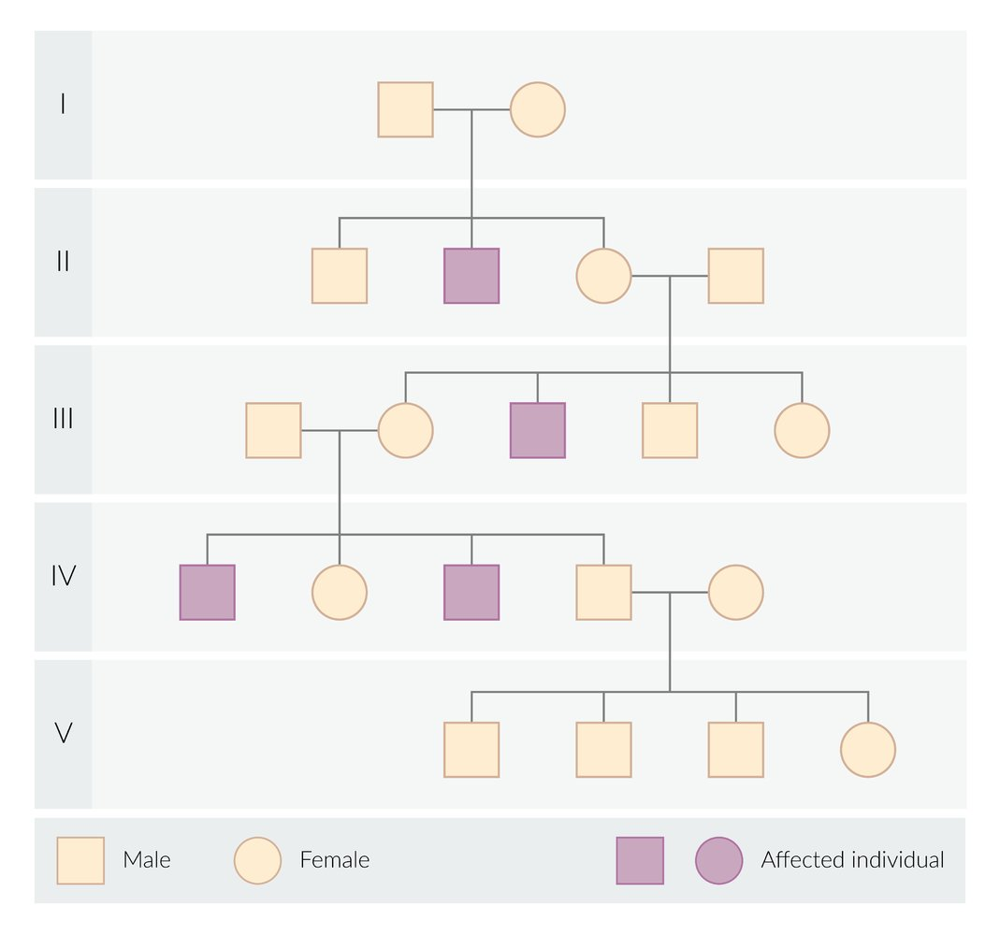

X-linked recessive inheritance

### Examples of XR disorders

* <u>Becker muscular dystrophy</u>

* <u>Bruton agammaglobulinemia</u>

* <u>Color blindness</u>

* <u>Duchenne muscular dystrophy</u>

* <u>Fabry disease</u>

* <u>G6PD deficiency</u>

* <u>Hemophilia A</u>

* <u>Hemophilia B</u>

* <u>Hunter syndrome</u>

* <u>Lesch-Nyhan syndrome</u>

* <u>Ocular albinism</u>

* <u>Ornithine transcarbamylase deficiency</u>

* <u>Wiskott-Aldrich syndrome</u>

Section 7.1 X linked Recessive Diseases

Section 7 X linked Diseases

---

## X-linked dominant inheritance

### Overview

* Definition: a mode of inheritance that only requires one copy of a mutated <u>allele</u> on the X <u>chromosome</u>, from either the mother or father, for the <u>phenotypical</u> expression of the trait or disorder in offspring

* In <u>X-linked dominant</u> (XD) inheritance, male and female individuals have an equal <u>probability</u> of inheriting the trait or disorder.

* Because female individuals have two X <u>chromosomes</u>, the inheritance of an <u>X-linked dominant</u> disorder typically manifests in a less severe form than in male individuals.

### Examples of XD <u>inheritance patterns</u>

* <u>Heterozygous</u> mother and <u>hemizygous</u> (unaffected) father: Children have a 50% <u>probability</u> of inheriting the trait/disease.

| XD <u>inheritance pattern</u> in <u>heterozygous</u> mother and <u>hemizygous</u> (unaffected) father |  |  |  |
| --- | --- | --- | --- |
|  |  |  <u>Heterozygous</u> mother (affected) |  |
| X | x |  |  |
|  <u>Hemizygous</u> father (unaffected) | x | Xx (daughter, affected) | xx (daughter, unaffected) |
| Y | XY (son, affected) | xY (son, unaffected) |  |

* <u>Homozygous</u> mother and <u>hemizygous</u> (unaffected) father: All the children will inherit the trait/disease.

| XD <u>inheritance pattern</u> in <u>homozygous</u> mother and <u>hemizygous</u> (unaffected) father |  |  |  |
| --- | --- | --- | --- |
|  |  |  <u>Homozygous</u> mother (affected) |  |
| X | X |  |  |
|  <u>Hemizygous</u> father (unaffected) | x | Xx (daughter, affected) | Xx (daughter, affected) |
| Y | XY (son, affected) | XY (son, affected) |  |

* <u>Heterozygous</u> mother and <u>hemizygous</u> (affected) father: Children have a 75% <u>probability</u> of inheriting the trait/disease.

| XD <u>inheritance pattern</u> in <u>heterozygous</u> mother and <u>hemizygous</u> (affected) father |  |  |  |
| --- | --- | --- | --- |
|  |  |  <u>Hemizygous</u> father (affected) |  |
| X | Y |  |  |
|  <u>Heterozygous</u> mother (affected) | X | XX (daughter, affected)  | XY (son, affected)  |
| x | Xx (daughter, affected)  | xY (son, unaffected)  |  |

* <u>Homozygous</u> (unaffected) mother and <u>hemizygous</u> (affected) father

* All daughters will be affected.

* Sons are invariably unaffected.

| XD <u>inheritance pattern</u> in <u>homozygous</u> (unaffected) mother and <u>hemizygous</u> (affected) father |  |  |  |
| --- | --- | --- | --- |
|  |  |  <u>Hemizygous</u> father (affected) |  |
| X | Y |  |  |
|  <u>Homozygous</u> mother (unaffected) | x | Xx (daughter, affected) | xY (son, unaffected) |
| x | Xx (daughter, affected) | xY (son, unaffected) |  |

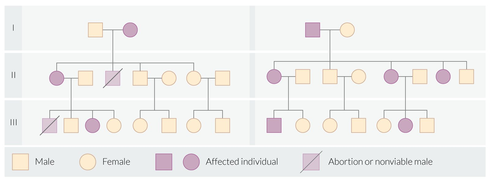

X-linked dominant inheritance

### Examples of XD disorders

* <u>Alport syndrome</u>

* <u>Fragile X syndrome</u>

* <u>Hypophosphatemic</u> <u>rickets</u>

* <u>Rett syndrome</u>

---

## Other types of inheritance

### Mitochondrial inheritance

* Definition: a mode of inheritance that involves the transmission of mutated <u>alleles</u> in the <u>mitochondrial</u> <u>genome</u> through maternal lineage only

* Features

* Diseases caused by mutations in <u>mitochondrial DNA</u> are only passed down to offspring by the mother.

* The <u>inheritance pattern</u> is hypothesized to occur for a number of reasons, including: [[20]](https://coursology-qbank.com/amboss/article/W3XPhB)

* Paternal <u>sperm</u> does not bring a significant number of <u>mitochondria</u> to the <u>oocyte</u> during <u>fertilization</u>.

* Paternal <u>mitochondria</u> are diluted during cellular division and <u>mitosis</u>.

* Paternal <u>mitochondria</u> may be destroyed through cellular mechanisms, such as <u>ubiquitination</u>.

* Each <u>mitochondrion</u> has multiple copies of <u>DNA</u> (<u>mtDNA</u>), and each cell has many <u>mitochondria</u>.

* Typically without mutations, all copies of <u>mtDNA</u> in each <u>mitochondrion</u> will be identical (i.e., homoplasmy).

* Therefore, mutations cause a state of heteroplasmy.  

* The presence of affected and unaffected <u>mtDNA</u> within different cells leads to variable disease expression.

* Severity often correlates with the <u>proportion</u> of mutated <u>mtDNA</u> copies.

* Examples

* <u>Mitochondrial myopathies</u> (e.g., <u>MELAS syndrome</u>)

* <u>Leber hereditary optic neuropathy</u>

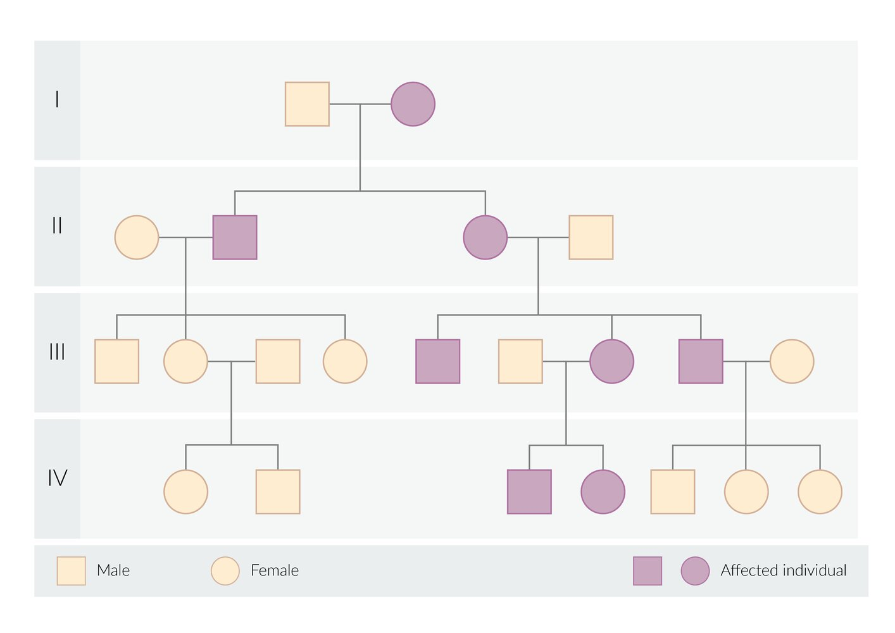

Mitochondrial inheritance

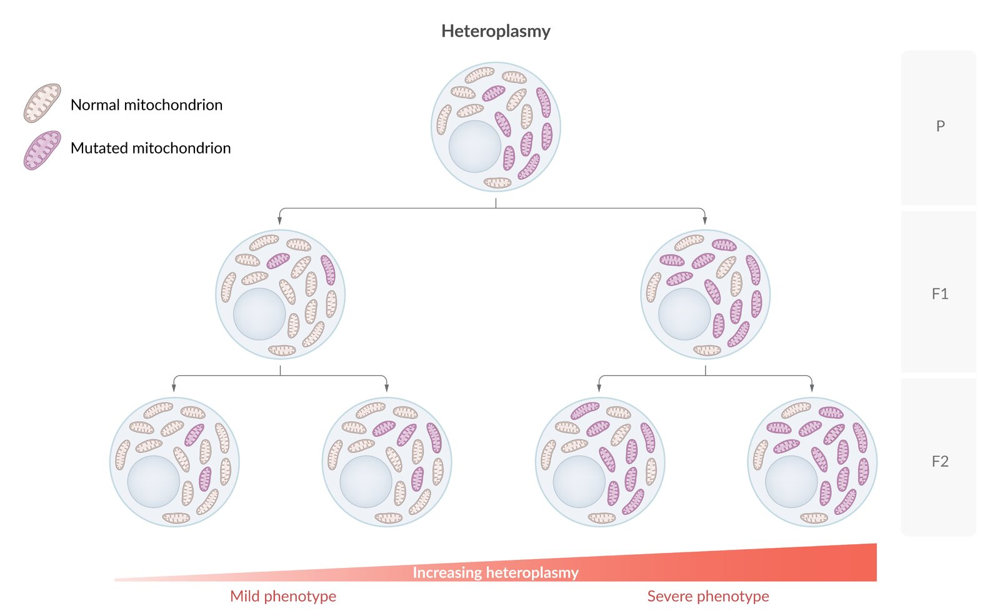

Heteroplasmy

### Polygenic inheritance

* Definition: a trait controlled by the interaction of two or more <u>genes</u> at different <u>loci</u>, without interaction with the environment

* Examples

* <u>Skin</u> pigmentation <u>eye</u> color, and most anthropometric traits (e.g., height, weight)

* <u>Polygenic inheritance</u> is involved in the development of many otherwise unrelated disorders (e.g., <u>type 1 diabetes</u>, <u>type 2 diabetes</u>, <u>hypertension</u>, <u>androgenic alopecia</u>, <u>atopy</u>, <u>psoriasis</u>, <u>schizophrenia</u>, <u>Alzheimer disease</u>)

### Multifactorial inheritance disorders (<u>MID</u>)

* Definition: disorders that result from a combination of mutations in multiple <u>genes</u> and environmental factors (e.g., <u>type 2 diabetes</u> mellitus, <u>cleft palate</u>, <u>neural tube defects</u>, <u>schizophrenia</u>, <u>coronary artery disease</u>)

* Features

* Commonly manifest with the Carter effect [[21]](https://coursology-qbank.com/amboss/article/eiXxqB)

* Individuals of the less commonly affected sex are more likely to pass on the disorder to their children if they develop the disease.

* It is hypothesized the group less commonly affected possesses a higher number of susceptibility <u>genes</u> and the trait/disorder will, therefore, manifest less frequently, requiring more genetic <u>loci</u> to be affected.

* However, the numerical increase in susceptibility <u>genes</u> leads to an increased <u>probability</u> of passing on mutated <u>alleles</u> to offspring.

* Population groups with a certain heritage are more commonly affected compared to the population at large (e.g., Hispanic, <u>Ashkenazi</u> Jewish, West African).

* One <u>gender</u> is more frequently affected.

* Isolated occurrence is possible, but familial <u>clustering</u> is frequent.

* Index case: the first person of a family to develop the trait/disorder in question

* Threshold effect: Effect observed in some MIDs, in which the disorder only develops when genetic predispositions and external factors combine to reach a certain threshold value.

* <u>Gene</u>-environment interaction: genetic predisposition affects susceptibility to the effects of environmental factors (e.g., individuals with a <u>family history</u> of <u>type II diabetes</u> may never develop the disease if they maintain a healthy lifestyle).

---

## Population genetics

### Terminology

* Population (genetics): a group of individuals that interbreed and live on the same territory at the same time point

* Gene pool: a collection of all <u>genes</u> found in a population

* Genetic variation: a variation of the <u>genome</u> between organisms within one species

### <u>Genetic variation</u> [[22]](https://coursology-qbank.com/amboss/article/lKcvgW0)[[23]](https://coursology-qbank.com/amboss/article/NKc-gW0)

The following phenomena lead to changes in <u>genetic variation</u>.

* Mutation-selection equilibrium: a balance between the rate of occurrence of deleterious alleles (<u>alleles</u>, which decrease the fitness of an individual) in a population and their elimination through the selection processes

* Genetic drift

* A change in <u>allele</u> frequencies in a population that occurs by chance in a finite population due to random sampling

* Typically leads to a decrease in <u>genetic variation</u>

* Can be encountered in the following scenarios:

* Founder effect

* A reduction in <u>genetic variation</u> resulting from the establishment of a new population by a small subset of a larger population

* Example: increased <u>incidence</u> of maple syrup disease, <u>polydactyly</u>, and other conditions in Amish individuals

* Genetic bottleneck

* A decrease in the <u>gene pool</u> and <u>genetic variation</u> caused by a dramatic decrease in the size of a population (e.g., due to <u>death</u> or reduced rate of reproduction)

* Increases risk of extinction of <u>alleles</u> from the population and accumulation of recessive traits

* Natural selection

* A process through which the population frequency of traits that increase the chance of survival of an organism increases and the frequency of traits that reduce it decreases

* If only a small number of <u>alleles</u> of a <u>gene</u> or homozygosity is beneficial, it will lead to a decrease in <u>genetic variation</u>

* If having <u>multiple alleles</u> of a <u>gene</u> or being a <u>heterozygote</u> is beneficial (heterozygous advantage), genetic diversity will be maintained

* Example: there is an increased frequency of the <u>sickle cell trait</u> (heterozygosity for the sickle-cell <u>allele</u>) in the African population because it provides a relative resistance to <u>malaria</u> while causing only mild symptoms

### Heterozygote frequency

* Definition

* The <u>proportion</u> of <u>heterozygote</u> carriers of an <u>allele</u> that causes a trait/disorder in the population

* Used to estimate a child's risk of a recessive inherited disorder if the <u>genotype</u> of the parents is unknown

* Equation: The <u>heterozygote frequency</u> is calculated by using the Hardy-Weinberg law, a principle that states that <u>genetic variation</u> in a population remains constant under a set of idealized assumptions (including random mating and no migration, mutation, or selection).

* <u>Hardy-Weinberg equilibrium</u>: (p+q)2 = <u>p2</u> + 2pq + q2= 1 (100%).

* The frequency of the independent <u>alleles</u> A and a are represented by p and q, respectively, where p + q = 1.

* <u>p2</u> = <u>homozygote</u> frequency of <u>allele</u> A

* q2 = <u>homozygote</u> frequency of <u>allele</u> a

* 2pq = <u>heterozygote</u> frequency (<u>probability</u> of carrying both an altered and an <u>allele</u> that does not cause the trait/disorder)

* For <u>X-linked recessive</u> disease, the frequency in male individuals = q and in female individuals = q2

* The <u>Hardy-Weinberg law</u> is based on the biostatistically ideal assumptions that:

* There is no <u>natural selection</u> of <u>alleles</u> in the population.

* No mutations occur in the <u>allele</u> under investigation.

* There is random mating inside the population.

* The population is large enough to rule out the effects of <u>genetic drift</u>.

* There is no migration both outside and inside the population.

* Example: <u>cystic fibrosis</u> with an <u>incidence</u> of ∼ 1:2,500

* Calculate 2pq: 2pq = 2×1×1/50 = 1/25 (4%) <u>heterozygote frequency</u>

* Calculate p: If (p + q)2 = 1 then p + q = 1 and p = 1 – q = 1 – 1/50 = 0.98 (98%) ≈ 1

* Calculate q: If q2 = 1/2,500 then q = 1/50 = 0.02 (2%)

* Since <u>cystic fibrosis</u> is a recessive disorder, only <u>homozygote</u> carriers develop the disease. The <u>incidence</u> corresponds to the <u>homozygote</u> frequency q2.

|  |  A (p) |  a (q) |
| --- | --- | --- |
|  A (p) | AA (<u>p2</u>) | Aa (pq) |
|  a (q) | Aa (pq) | aa (q2) |

Section 5 Hardy Weinberg Principle

---

## Gene therapy

* Definition: introduction of genetic material into a cell to treat diseases by changing the expression of a <u>gene</u> or modifying cellular processes [[24]](https://coursology-qbank.com/amboss/article/YJcnsW0)[[25]](https://coursology-qbank.com/amboss/article/Bpcz7W0)

* Indications

* <u>Single-gene disorders</u> (e.g., <u>cystic fibrosis</u>, <u>galactosemia</u>, <u>spinal muscular atrophy</u>)

* <u>Neoplasms</u> (e.g., <u>melanoma</u>, <u>leukemia</u>)

* Modes of therapy delivery [[26]](https://coursology-qbank.com/amboss/article/XJc9sW0)

* In-vivo

* <u>Gene therapy</u> is introduced directly into the body tissues.

* Usually targets nondividing cells (e.g., <u>neurons</u>)

* Ex-vivo

* Cells are gathered from the patient or donor, modified outside the body, and returned back to the body.

* Usually targets dividing cells (e.g., <u>white blood cells</u>)

* Methods of therapy transfer

* Viral <u>vectors</u> (e.g., lentiviruses, <u>retroviruses</u>)

* Liposomes

* Polymers

* Electroporation

* Usage of a high-<u>voltage</u> electrical field for <u>DNA</u> delivery into cells.

* Electrical field change permeability of <u>the cell</u> membrane allows for passage of the substances with large molecular weight (e.g., <u>nucleic acids</u>).

| Examples of <u>gene therapy</u> agents |  |  |
| --- | --- | --- |
| Drug | Mechanism | Indications |
| <u>Onasemnogene abeparvovec</u> |  * <u>Vector</u> based on adeno-associated <u>virus</u> delivers a normal copy of the SMN1 <u>gene</u> to the <u>neurons</u> of the <u>anterior horns</u> of the spinal cord.   |  * <u>Spinal muscular atrophy</u>   |
| Voretigene neparvovec |  * <u>Vector</u> based on adeno-associated <u>virus</u> delivers a normal copy of the RPE65 <u>gene</u> to the <u>retinal cells</u>.   |  * Retinal dystrophies associated with biallelic RPE65 mutations (e.g., Leber congenital amaurosis)   |
| Tisagenlecleucel |   * Lentiviral <u>vector</u> that has <u>DNA</u> coding for anti-<u>CD19</u> <u>chimeric</u> <u>receptor</u> is used to modify <u>autologous</u> <u>T-cells</u>.  * Modified <u>T-cells</u> fight pathological <u>B-cells</u>.    |  * Relapsing or refractory <u>acute lymphoblastic leukemia</u>   |
| Alipogene tiparvovec |  * Viral <u>vector</u> transports a <u>gain-of-function</u> variant of the <u>LPL</u> <u>gene</u> into muscle cells, which leads to synthesis of active <u>LPL</u> and subsequent transient reduction of <u>triglyceride</u> plasma levels   |  * <u>Lipoprotein lipase</u> (<u>LPL</u>) deficiency   |

---

## Genetic testing

|  Overview of clinical genetic tests [[27]](https://coursology-qbank.com/amboss/article/Dqc10d0)[[28]](https://coursology-qbank.com/amboss/article/wqch0d0)  |  |  |  |  |
| --- | --- | --- | --- | --- |
| Method | Indications | Benefits | Limitations |  |
| Single-gene sequencing |  * <u>Single-gene disorders</u> (e.g., <u>cystic fibrosis</u>, sickle-cell disease)   |  * Highly targeted   |  * Can only be used for disorders caused by a single known variant of <u>gene</u>   |  |
| <u>Gene</u> panel <u>sequencing</u> |  * Disorders that can be caused by several genetic variants (e.g., <u>spinocerebellar ataxia</u>)   |   * Cost-effective  * Can be used to test several clinical hypotheses  * Targeted    |   * A panel has a limited number of genetic variants.  * Does not detect large <u>copy number variations</u>  * Usually are not designed to test for intronic variants    |  |
|  Whole-exome <u>sequencing</u> [[28]](https://coursology-qbank.com/amboss/article/wqch0d0)  |   * Often used after more precise methods fail to reveal a causative genetic variant  * Sometimes employed in the diagnosis of disorders with many possible causative variants    |   * Can be used if a presumably causative variant is unknown  * Reinterpretation is possible    |  * High rate of incidental findings (variants of unknown significance)   |  * Does not detect intronic variants   |
| Whole-<u>genome</u> <u>sequencing</u> |  * Can detect genetic variants both in <u>introns</u> and in exomes   |   * Expensive  * Interpretation is difficult    |  |  |
| Chromosomal microarray |  * Disorders caused by <u>copy number variations</u> (e.g., some types of epilepsies, <u>autism spectrum disorder</u>, <u>intellectual disability</u>)   |   * The only method for <u>genome</u>-wide detection of <u>copy number variations</u>  * Detects small <u>chromosomal abnormalities</u>    |   * Does not detect sequence changes  * Does not detect balanced <u>chromosomal</u> rearrangements    |  |
| <u>Karyotyping</u> |  * Diseases caused by structural or numerical <u>chromosome</u> abnormalities (e.g., aneuploidies, triploidies)   |   * Cheap  * Fast to perform    |  * Does not detect small <u>chromosomal abnormalities</u>   |  |

---