# Laboratory methods

*Categories: Clinical knowledge > Genetics > Basics of genetics > Laboratory methods*

[Original Article Link](https://coursology-qbank.com/amboss/article/gp0FKS)

---

## Summary

The laboratory methods explained here are used to screen for and confirm medical conditions. For additional laboratory methods see “<u>Pathology techniques</u>.”

---

## Blotting

* A technique used to detect <u>DNA</u>, <u>RNA</u>, and <u>proteins</u> that involves transferring the <u>DNA</u>, <u>RNA</u>, or <u>proteins</u> onto a membrane. The sample of interest is then visualized using marked detector molecules (e.g., radiolabeled <u>DNA</u> or chemiluminescent detector <u>RNA</u>).

* The <u>blotting techniques</u> most commonly employed in <u>laboratory medicine</u> are Southern, western, and <u>northern blot</u>.

* All <u>blotting techniques</u> follow a similar process:
1. * <u>DNA</u>, <u>RNA</u>, or protein molecules contained in the sample are separated by <u>gel electrophoresis</u> and/or <u>electric charge</u>, depending on their size (small molecules travel faster than bigger molecules).
2. * The separated molecules are transferred from the gel onto a membrane.
3. * The <u>DNA</u>, <u>RNA</u>, or protein molecule of interest is detected by using a labeled, highly specific oligonucleotide probes, <u>antibodies</u>, or <u>x-rays</u>.

| Comparison of <u>blotting techniques</u> |  |  |  |  |
| --- | --- | --- | --- | --- |
|  | <u>Northern blot</u> | <u>Southern blot</u> | <u>Western blot</u> | <u>Southwestern blot</u> |
| Sample |  * <u>RNA</u>   |  * <u>DNA</u>   |  * <u>Proteins</u>   |  * <u>DNA</u>-binding <u>proteins</u>   |
| Detection |  * <u>Annealing</u> of radiolabeled or chemiluminescent detector <u>RNA</u> or <u>DNA</u>   |  * <u>Annealing</u> of radiolabeled or chemiluminescent detector <u>RNA</u> or <u>DNA</u>   |  * Direct or indirect detection using <u>monoclonal antibodies</u>   |  * <u>Annealing</u> of marked double-stranded <u>DNA</u> probes   |
| Use |  * Assessment of <u>gene expression</u>   |  * Detection of specific <u>genes</u> and <u>nucleotide</u> sequences   |  * Confirmation of the presence of a protein in a sample and rough estimation of its amount   |  * Identification of <u>DNA-binding proteins</u>   |

> [!NOTE]
> SNoW flakes DRoP: Southern <u>blot</u>, Northern <u>blot</u>, and Western <u>blot</u> are used on DNA, RNA, and Proteins respectively.

---

## Northern blot

* Sample: : <u>RNA</u>

* Principle of detection: <u>annealing</u> of marked detector <u>RNA</u> or <u>DNA</u> to the target <u>RNA</u> fragment

* 32P-<u>DNA</u> or -<u>RNA</u>

* <u>DNA</u> or <u>RNA</u> labeled with a chemiluminescent dye

* Procedure

* The <u>RNA</u> sample is cleaved by enzymes and separated by <u>gel electrophoresis</u> (commonly on agarose gels).

* Separated and cleaved <u>RNA</u> is transferred (blotted) to a membrane.

* The membrane is incubated with labeled probes of <u>RNA</u> or <u>DNA</u>.

* Labeled probes recognize and <u>anneal</u> to the complementary strand if it is present on the membrane.

* Result: double-stranded <u>RNA</u>

* One unlabeled strand (cleaved <u>RNA</u> sample)

* One labeled strand that can be visualized using one of the following techniques:

* When radiolabeled detector <u>DNA</u>/<u>RNA</u> is used, an <u>x-ray</u> film is placed against the <u>western blot</u>. This film develops when exposed to the label, creating dark regions that correspond to the target protein band.

* In case of chemiluminescent <u>DNA</u>/<u>RNA</u>, a <u>CCD camera</u> that captures a digital image is used.

* Uses

* Assessment of <u>gene expression</u> by measuring <u>mRNA</u> levels (e.g., expression of the <u>FMR1 gene</u> in different tissues in <u>fragile X syndrome</u>)

* Assessment of <u>RNA</u> <u>splicing</u> (including <u>splicing</u> errors)

---

## Southern blot

* Sample: <u>DNA</u> (<u>DNA</u> restriction fragments)

* Principle of detection: <u>annealing</u> of marked detector <u>RNA</u> or <u>DNA</u> to the target <u>DNA</u> fragment

* 32P-<u>DNA</u> or -<u>RNA</u>

* <u>DNA</u> or <u>RNA</u> labeled with a chemiluminescent dye

* Procedure

* The <u>DNA</u> sample is cleaved by <u>restriction enzymes</u>.

* <u>DNA</u> fragments are separated by <u>gel electrophoresis</u>.

* Separated <u>DNA</u> fragments are transferred (blotted) to a filter membrane.

* The membrane is exposed to (<u>radio</u>)labeled oligonucleotides: <u>DNA</u> probes recognize and <u>anneal</u> to the complementary strand if it is present on the membrane.

* Result: double-stranded <u>DNA</u>

* One unlabeled strand (cleaved <u>DNA</u> sample)

* One labeled strand that can be visualized when the membrane is exposed to <u>x-ray</u> film or digital imaging.

* Uses: detection of specific <u>genes</u> and <u>nucleotide</u> sequences

* <u>Restriction fragment length polymorphisms</u> (<u>RFLPs</u>)

* <u>Minisatellite DNA</u> and <u>microsatellite DNA</u> (called “<u>variable number of tandem repeats</u>,” VNTRs)

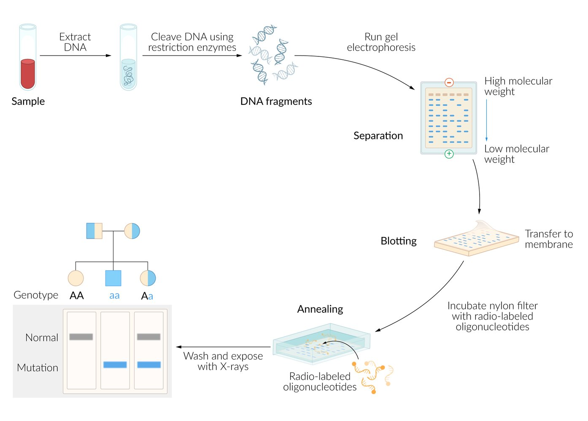

Southern Blot

---

## Western blot (immunoblot)

* Sample: <u>proteins</u>

* Principle of detection: Monoclonal antibodies (<u>immunoglobulins</u> that bind to a single, specific <u>antigen</u>) are used for the direct or indirect detection of <u>proteins</u> of interest. 

* Enzyme- or fluorophore-conjugated <u>antibodies</u>

* Radiolabeled <u>antibodies</u> (125I)

* Procedure

* The protein sample is separated by <u>gel electrophoresis</u>.

* Separated <u>proteins</u> are transferred (blotted) to a membrane.

* The protein of interest is detected by a specific <u>antibody</u> that can be labeled directly or detected by a secondary, radiolabeled <u>antibody</u>.

* Uses

* Measuring the amount of <u>antigens</u> or <u>antibodies</u>

* Confirmation of the presence of a protein in a sample (e.g., <u>confirmatory test</u> for <u>antibodies</u> against <u>Borrelia</u> in the diagnosis of <u>Lyme disease</u>)

* Rough estimation of the amount of protein in a sample

---

## Southwestern blot

* Sample: <u>DNA</u>-binding <u>proteins</u>

* Principle of detection: target <u>proteins</u> binding to radiolabeled double-stranded <u>DNA</u> probes

* Procedure [[1]](https://coursology-qbank.com/amboss/article/p4bL4F)

* <u>Proteins</u> are separated by <u>gel electrophoresis</u> and blotted onto a nitrocellulose membrane (similar to <u>western blot</u>).

* Target <u>proteins</u> bind the radiolabeled double-stranded <u>DNA</u> probes (similar to <u>Southern blot</u>).

* Uses: study of <u>DNA-binding proteins</u> (e.g., <u>transcription factors</u>, such as <u>c-Fos</u>, c-Jun)

References: [[2]](https://coursology-qbank.com/amboss/article/KRYULK)

---

## Enzyme-linked immunosorbent assay (ELISA)

### Overview

* <u>ELISA</u> is an <u>enzyme immunoassay</u> that employs enzyme-labeled immunoreactants and an immunoadsorbent to determine the presence and concentration of certain <u>proteins</u> (e.g., <u>tumor markers</u>, viral <u>proteins</u>, drugs, <u>antibodies</u>) in serum

* The detection method is based on the highly specific immunologic interaction between an <u>antibody</u> and its <u>antigen</u> (i.e., the protein of interest).
1. * The <u>antigen</u> is fixed on a microtiter plate and bound by an enzyme-coupled <u>antibody</u>.
2. * The enzyme catalyzes a reaction when incubated with its substrate which is chromogenic, chemifluorescent, or chemiluminescent.
3. * The intensity of the signal is directly proportional to the amount of captured <u>antigen</u>.

* While being highly specific and sensitive, the <u>specificity</u> of <u>ELISA</u> is lower compared to <u>western blot</u>.

* There are two main types of <u>ELISA</u> tests:

* <u>Direct ELISA</u>: tests for the <u>antigen</u> directly

* <u>Indirect ELISA</u>: tests for the <u>antibody</u>, which indicates the presence of an <u>antigen</u> (indirectly)

* A <u>sandwich ELISA</u> is an <u>indirect ELISA</u> that employs two <u>antibodies</u> that bind to different <u>epitopes</u> on the <u>antigen</u> of interest.

Section 4 Microarrays   ELISA

#### Direct ELISA

1. * The patient's sample supposedly containing the protein of interest (i.e., the <u>antigen</u>) is added to a well of microtiter plates with a buffered solution.
2. * The specific <u>antibody</u>-enzyme conjugate is added to the solution.
3. * A substrate for the enzyme is added
4. * Spectrometry is used to detect the generated chromophore 

* Higher concentration of <u>antibodies</u> binding to the <u>antigen</u> → stronger signal

* Lower concentration of <u>antibodies</u> binding to the <u>antigen</u> → weaker signal

#### Indirect ELISA

* Same procedure as <u>direct ELISA</u>, with the following exceptions:

* The <u>antibody</u> specific for the <u>antigen</u> of interest is not labeled itself and is called primary <u>antibody</u>.

* The primary <u>antibody</u> is detected by a secondary, labeled <u>antibody</u>.

#### Sandwich ELISA

1. * A surface plate is coated with capture <u>antibodies</u> (not the patient's <u>antibodies</u>).
2. * The sample is added to the coated plate where the captured <u>antibodies</u> bind the <u>antigen</u> of interest.
3. * Specific (labeled) <u>antibodies</u> for the <u>antigen</u> are added. ; if the <u>antigen</u> is present, the <u>antibody</u> binds to the <u>antigen</u>.
4. * A substrate for the enzyme is added (color, fluorescent, or electrochemical changes are due to the reaction between substrates and enzymes).
5. * <u>Spectrometry</u>, fluorescence, or electrochemical studies are performed to assess for the amount of <u>antigens</u> present.

### Uses

* Screening for <u>HIV</u> <u>antibodies</u> (high <u>sensitivity</u>, low <u>specificity</u>)

* Testing for <u>West Nile virus</u> <u>antibodies</u>

* Detection of the following organisms:

* <u>Mycobacterium tuberculosis</u>

* <u>Rotavirus</u> (in feces)

* <u>Hepatitis B</u> <u>virus</u>

* <u>E. coli</u> <u>enterotoxin</u> (in feces)

* Detection of <u>PSA</u>

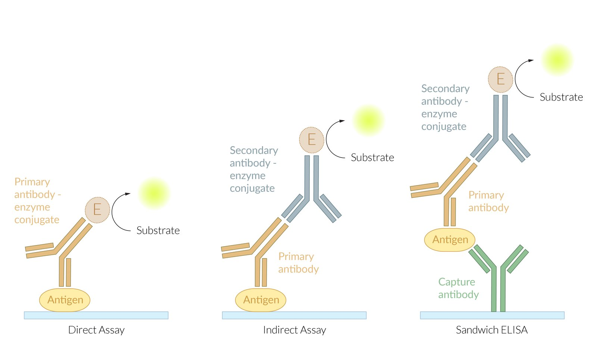

ELISA principle

References:[[3]](https://coursology-qbank.com/amboss/article/I3YYPK)

---

## Polymerase chain reaction (PCR)

### Overview

* <u>Polymerase chain reaction</u> (<u>PCR</u>) is a technique that allows amplification of specific <u>chromosome</u> segments by producing more than a billion copies. This makes testing of very small sequences of <u>DNA</u> that could not otherwise be studied possible.

* Common sequences of <u>DNA</u> studied by <u>PCR</u> include mutations, <u>microsatellite instability</u> sequences, and <u>short tandem repeats</u> (STRs).

Section 1 PCR

### Procedure

A <u>PCR</u> usually consists of 25–50 cycles, which are divided into three phases.

1. * <u>Denaturation</u>

* The sample is heated;  at a target temperature of 194–208 °F (90.0–98.0 °C) for 20–30 seconds.

* High temperature breaks the <u>hydrogen bonds</u> between complementary <u>base pairs</u>;  of the double-stranded <u>DNA</u> and produces two single <u>DNA</u> strands.
2. * Hybridization

* The sample is cooled;  at a target temperature of 122–149 °F (50.0–65.0 °C) for 20–40 seconds.

* The following is added to the sample:

* Complementary DNA primers (a short sequence of <u>DNA</u> <u>nucleotides</u> on which <u>DNA polymerase</u> initiates replication) that are necessary for annealing

* Enzymes (for <u>DNA synthesis</u>): heat-stable <u>DNA polymerase</u> (Taq DNA polymerase)

* Deoxyribonucleotides (<u>dNTPs</u>)

* Primers bind the 3′ ends of the <u>DNA</u> sequence that needs to be amplified.
3. * Elongation and amplification

* The sample is heated;  at a target temperature of 158–176 °F (70–80 °C); 72°C (162°F) is most commonly used for <u>DNA polymerase</u>.

* <u>DNA polymerase</u> uses <u>dNTPs</u> to elongate the primers, thereby replicating the sequence of the sample <u>DNA</u> strands.

* The process is repeated until it yields an amplification to 106–1010 copies of the original <u>DNA</u> fragment (approximately 25–50 cycles).

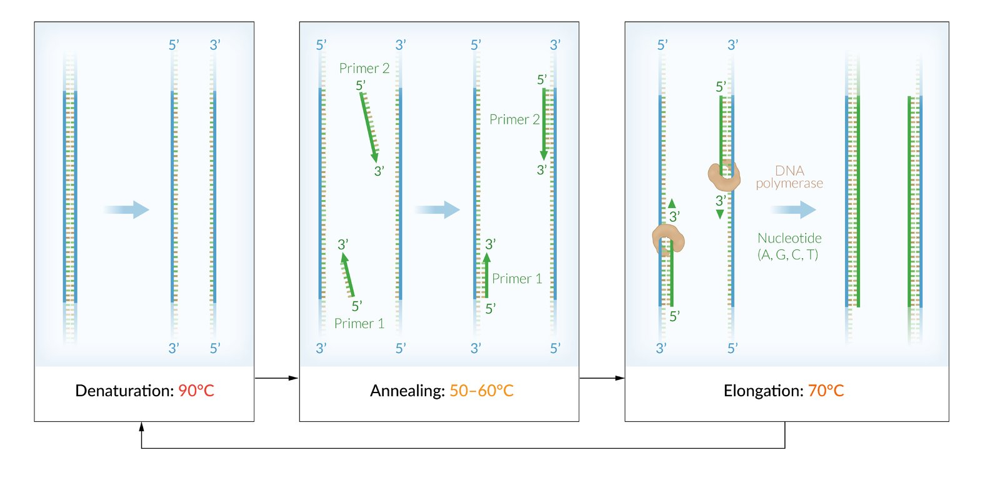

PCR scheme

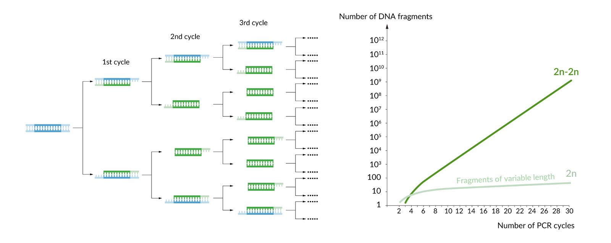

Exponential amplification during PCR

### Uses

* Detection of <u>HIV</u> (particularly when <u>ELISA</u> and <u>western blot</u> are inconclusive)

* Useful for the detection of neonatal exposure to <u>HIV</u>

* Positive early after infection

* Not affected by the immune status of the patient (e.g., <u>immunocompromised</u> patients may not produce an <u>antibody</u> response)

* Diagnosis of bacterial and viral infections (e.g., <u>Lyme disease</u>, <u>HSV encephalitis</u>)

* Diagnosis of <u>immunodeficiency</u> (e.g., <u>severe combined immunodeficiency</u>)

* Forensic analysis (e.g., comparison of <u>DNA</u> samples from suspects, paternity testing)

* <u>Sequencing</u> of mutations

### Reverse transcription polymerase chain reaction (<u>RT-PCR</u>)

* Procedure
1. * A sample <u>mRNA</u> is converted to <u>complementary DNA</u> (<u>cDNA</u>) by <u>reverse transcriptase</u>.
2. * <u>cDNA</u> is amplified by the standard <u>PCR</u> procedure (see above).

* Use: : detection and quantification of <u>mRNA</u> levels in a sample

### Real-time polymerase chain reaction (also known as <u>quantitative PCR</u>, or <u>qPCR</u>)

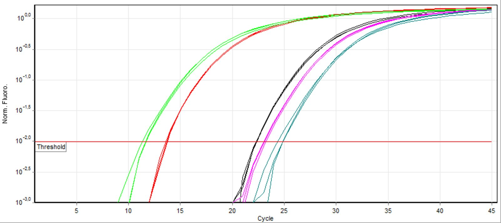

Quantitative real-time polymerase chain reaction (qPCR)

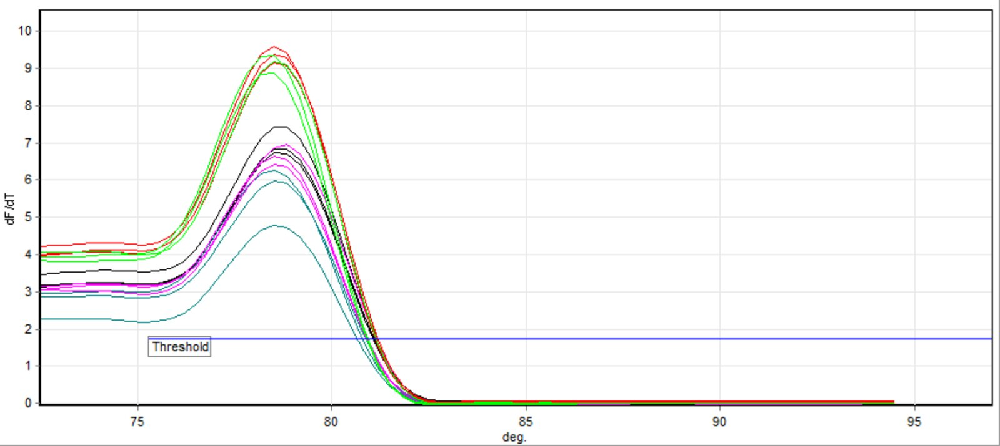

Melting temperature curve of qPCR

* Procedure

* A <u>PCR</u> technique that utilizes fluorescence (e.g., intercalating dyes or <u>DNA</u> probes) for monitoring amplification of targeted <u>DNA</u> during the <u>PCR</u> via computer software (in a graph).

* Melting temperatures specific to the amplified fragment allow for high <u>specificity</u>.

* There are many types, including quantitative reverse transcription PCR (<u>RT-qPCR</u>) and <u>semiquantitative real-time PCR</u>.

* Use

* Allows monitoring of a targeted product at any point throughout the amplification

* Rapidly detect <u>nucleic acids</u> for diagnosis (e.g., <u>RT-qPCR</u> for <u>SARS-CoV2</u>)

* Easily quantify <u>gene expression</u> (e.g., via comparing to a standard curve of serial dilutions)

* Quantify and <u>genotype</u> <u>viruses</u>

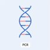

Polymerase Chain Reaction (PCR): DNA Amplification

---

## Chromosome testing

Molecular biological methods are used in the (prenatal) diagnosis of inherited disorders, e.g., to detect <u>gene mutations</u>. They are also used in the diagnosis of infectious diseases (e.g., <u>diphtheria</u>), in forensics, and in <u>tumor</u> diagnostics. Specimens include <u>DNA</u> from nucleated blood cells or, in <u>prenatal diagnostics</u>, <u>chorionic villi</u>.

### <u>Genetic markers</u>

Numerous <u>loci</u> vary dramatically in a population.  <u>Repetitive sequences</u> of various lengths are present in several noncoding regions of the <u>genome</u>. These <u>repetitive sequences</u> differ in sequence motif length. The frequency of repetition differs in each individual. <u>Polymorphisms</u> in <u>DNA</u> form the basis, e.g., for the diagnosis of diseases and allow individuals to be identified.

* Genetic markers (or <u>DNA markers</u>): individual differences in the <u>DNA</u> sequence of a specific region of the <u>genome</u>

* Three different markers are used for <u>DNA</u> analysis.

* Microsatellites (<u>short tandem repeats</u>, STRs): <u>repetitive sequences</u> of several <u>base pairs</u> in <u>DNA</u> that are highly polymorphic

* Analyzed via <u>PCR</u> to identify individuals  Very small amounts of <u>DNA</u> suffice for analysis.

* Belong to the VNTRs (variable number <u>tandem repeats</u>): Short <u>nucleotide</u> sequences in the <u>genome</u> of an individual that are repeated a variable number of times.

* SNPs (<u>single nucleotide polymorphism</u>): <u>DNA</u> sequence variants in a population that differ by only a single <u>base pair</u>. They are usually caused by errors during <u>DNA replication</u> and are <u>point mutations</u>.

* RFLP (<u>restriction fragment length polymorphism</u>): Depending on the <u>DNA</u> sequence of an individual, cleaving of <u>chromosomal</u> <u>DNA</u> with <u>restriction enzymes</u> leads to <u>DNA</u> fragments of variable lengths. 
* The fragments are analyzed using <u>Southern blot</u> and detected by probes.

* Genetic fingerprint: the <u>DNA</u> profile of an individual, especially as determined by <u>microsatellite</u> analysis

### Detection of <u>gene mutations</u> (<u>DNA</u> diagnostics, molecular <u>genetic testing</u>)

<u>DNA</u> diagnostics is suitable for the direct or indirect detection of a <u>gene</u> mutation that results in disease. It can also be used to exclude the presence of a <u>gene</u> mutation.

#### Direct detection

Various methods can be used in the direct detection of <u>gene mutations</u>.

* Prerequisite: The causal <u>gene</u> for the (suspected) disease is known.

* Process

* Amplification of a specific region of the affected <u>gene</u> using <u>PCR</u>

* Detection of a mutation, e.g., through <u>sequencing</u> or cleavage of <u>DNA</u> fragments using <u>restriction enzymes</u>
* Restriction enzymes (<u>restriction endonucleases</u>) 

* Definition: enzymes that cleave double-stranded <u>DNA</u> at an enzyme-specific <u>nucleotide</u> sequence

* Most restriction sites are <u>palindromes</u>.

* Cleavage of <u>DNA</u> using <u>restriction enzymes</u> results in sticky ends  or blunt ends.

* Origin of <u>restriction enzymes</u>: <u>prokaryotic</u> defense system against foreign <u>DNA</u>

* Analysis via <u>gel electrophoresis</u>: Detection is based on the altered mobility of the <u>DNA</u> fragments of mutated and normal <u>alleles</u> in <u>gel electrophoresis</u>.

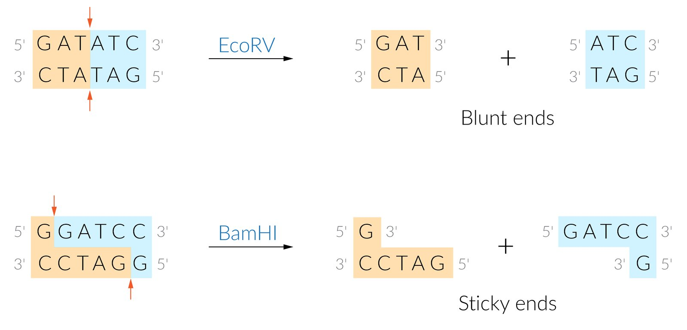

Restriction enzymes (restriction endonucleases)

#### Indirect detection (genetic linkage analysis)

Indirect <u>DNA</u> diagnostics are performed if direct detection is not possible.

* Prerequisite: The disease occurs in several family members and the suspected <u>locus</u> is known.

* Principle: analysis of <u>genetic markers</u> associated with the mutated <u>gene</u> and comparison of the patient's <u>genotype</u> with that of unaffected family members

* Result: There is no direct detection of a <u>gene</u> mutation, but a <u>probability</u> of the presence of a certain mutation that causes disease (genetic risk score) can be calculated. The <u>validity</u> of indirect <u>DNA</u> diagnostics depends on the pattern of inheritance and the number of family members being investigated.

### Identification of <u>chromosomes</u>

<u>Karyotyping</u> can be used to visualize <u>chromosomes</u> for examining <u>chromosome</u> numbers and for an overview of potential structural changes within a <u>chromosome</u>. Staining is used to visualize the special <u>banding</u> patterns that are characteristic for every <u>chromosome</u>.

* Karyotyping  

* Determines number, size, morphology, <u>banding</u> pattern, and arm-length <u>ratio</u> of <u>chromosomes</u>

* Can be performed on samples from various tissues (e.g., <u>amniotic fluid</u>, <u>bone marrow</u>, <u>placenta</u>, blood).

* Helpful for diagnosis of <u>trisomies</u>, <u>monosomies</u>, and <u>sex chromosome</u> disorders.

* <u>Banding</u> pattern: transverse bands of various widths and distribution, which can be induced depending on the preparation and staining technique 

* Preparation

* <u>The cell</u> sample is cultivated and cell division is stimulated.

* To obtain <u>chromosomes</u> during <u>metaphase</u>, the cells are arrested using the spindle inhibitor <u>colchicine</u>.

* <u>Banding</u> techniques

* Staining with quinacrine (fluorescent bands; not used routinely in diagnostics)

* Giemsa <u>banding</u> (standard <u>banding</u> technique, results in dark G bands with transcriptionally inactive <u>chromatin</u> and bright, transcriptionally active R bands)

* Analysis: assessment of an average 10–15 <u>metaphase</u> <u>chromosome</u> pairs in 1250x magnification

* Karyotype

* Evaluation of a <u>karyogram</u> according to the number and the structure (morphology, length, arm-<u>ratio</u>, pattern of <u>banding</u>, size) of the <u>chromosomes</u>

* The total number of <u>chromosomes</u> is stated first followed by the type of <u>sex chromosome</u> present (e.g., 46, XX = healthy, female <u>karyotype</u>).

* Anomalies, if present, are mentioned last (e.g., 47, XY+21: male <u>karyotype</u> with <u>trisomy 21</u>).

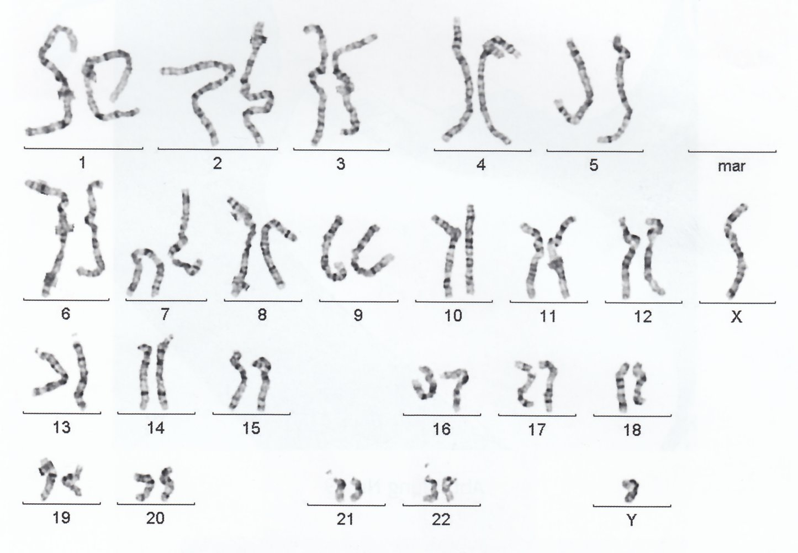

Karyogram of a male

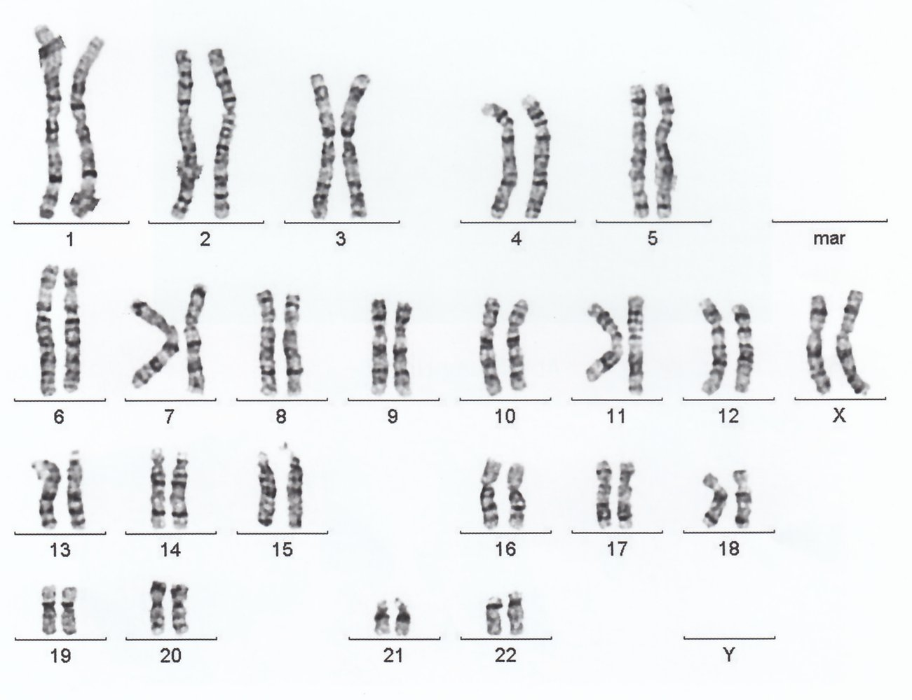

Karyogram of a female

Section 5 Karyograms   FISH

### Fluorescence in situ hybridization (<u>FISH</u>)

<u>Fluorescence in situ hybridization</u> is a method used for the staining of specific <u>DNA</u> sequences by a fluorescence-labeled <u>DNA</u> or <u>RNA</u> probe, e.g., to stain <u>chromosomes</u> in karyograms, in <u>tumor</u> diagnosis, or to map specific <u>genes</u> on <u>chromosomes</u> in <u>metaphase</u>.

* Procedure

* <u>Denaturation</u> of <u>DNA</u> in the prepared <u>chromosomes</u>

* <u>Hybridization</u> of the <u>DNA</u> with a single-stranded, fluorescence-labeled <u>DNA</u> probe that is complementary to a specific <u>DNA</u> sequence

* Analysis of the <u>chromosome</u> set in fluorescence microscopy 

* A fluorescent signal indicates the site of the bound probe.

* Microdeletion: the deleted region does not exhibit fluorescence, compared to the region present in the same <u>locus</u> of the other copy of the <u>chromosome</u>.

* Translocation: fluorescence signal from one <u>chromosome</u> is present in a different <u>chromosome</u>

* Duplication: extra copies of <u>chromosomes</u> that exhibit fluorescence in addition to the normal ones

* Result

* The specific staining increases the resolution compared to the classical <u>staining methods</u> of karyograms.

* Even minor <u>chromosomal aberrations</u> (e.g., microdeletions) can be identified.

* <u>FISH</u> is also possible on <u>chromosomes</u> in <u>interphase</u>.

* Use: direct visualization of <u>chromosomal anomalies</u> at specific <u>gene</u> <u>loci</u> on a molecular level

* Detection of microdeletions (2–3 × 106 <u>base pairs</u>) such as in <u>DiGeorge syndrome</u>

* Search for evidence of a <u>Philadelphia chromosome</u> translocation t(9;22)

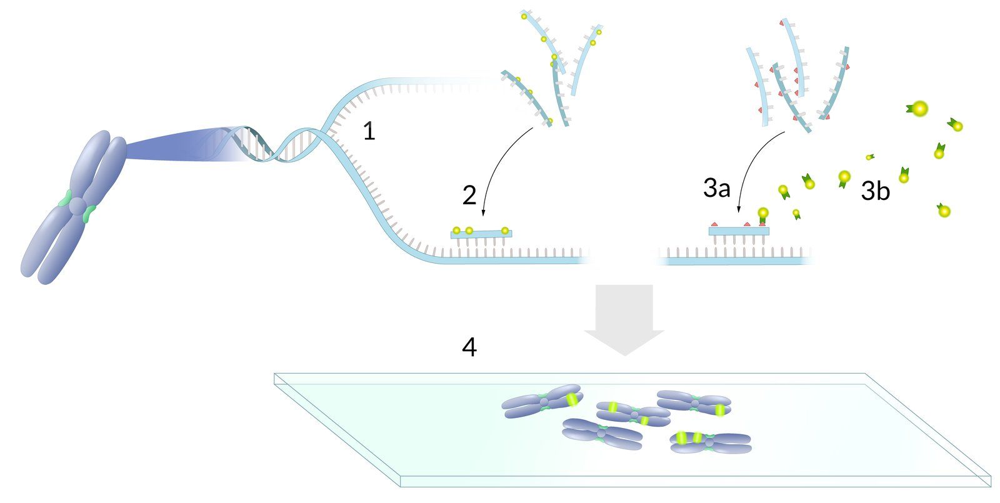

Fluorescence in situ hybridization (FISH)

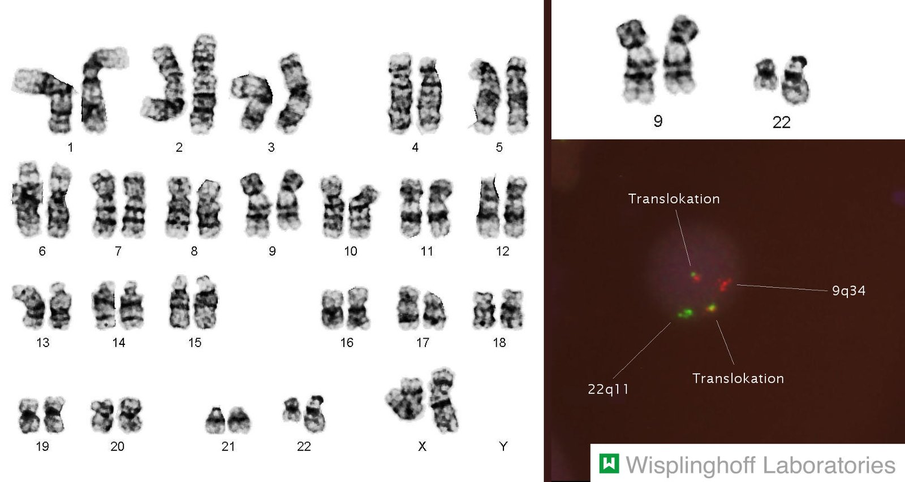

Chronic myeloid leukemia: t(9;22)(q34;q11) Philadelphia chromosome

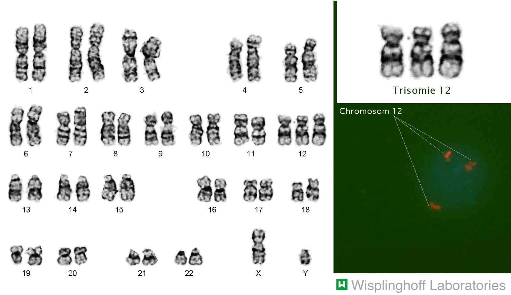

Chronic lymphocytic leukemia: Trisomy 12

Section 5 Karyograms   FISH

Section 12 Microdeletion Syndromes

### DNA microarray (array comparative <u>genome</u> <u>hybridization</u>, CGH)

Mainly used to simultaneously examine expression levels of multiple <u>genes</u> or to <u>genotype</u> many regions at the same time.

* Procedure
1. * Preparation of the sample

* A sample (m)<u>RNA</u> and control (m)<u>RNA</u> are converted to <u>complementary DNA</u> (<u>cDNA</u>) by <u>reverse transcriptase</u>.

* <u>cDNA</u> is then labeled with a fluorescent dye, one color for the sample that is being tested, another color for the control (e.g., green for the control, red for the sample being tested).

* <u>mRNA</u> is removed and samples are combined.
2. * Preparation of the chip

* Thousands of genetic sequences of <u>nucleic acid</u> (<u>DNA</u> or <u>RNA</u>) probes are attached to a chip (e.g., glass, silicon).

* Both patient and control <u>DNA</u> is applied to this chip and hybridizes to the probes on the chip.

* The chip is mounted to a scanner that can detect complementary binding of probes and sample sequences.

* Each region of the chip stands for a known genetic sequence.

* The higher the expression of the <u>gene</u> in one sample, the more intense the fluorescence.

* Uses

* Helpful for detection of copy number variations (CNVs), <u>single nucleotide polymorphisms</u> (<u>SNPs</u>) that are used for genotyping, forensic science, cancer mutations, <u>genetic linkage analysis</u>, and <u>genetic testing</u>.

* Sequencing: determination of the exact sequence of <u>base pairs</u> of a <u>gene</u>; e.g., to demonstrate an unknown mutation on a disease-causing <u>gene</u>

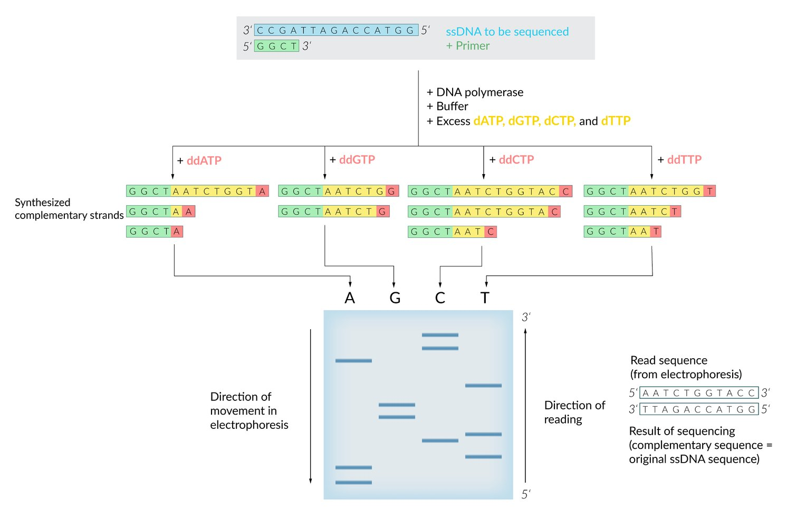

DNA sequencing (Sanger method)

References:[[4]](https://coursology-qbank.com/amboss/article/r3YfPK)

---

## CRISPR/Cas9

### Overview

<u>CRISPR</u> <u>gene</u> editing is a technique in genetic engineering that employs the <u>prokaryote</u> <u>CRISPR/Cas9</u> defense system directed against foreign <u>gene</u> sequences to modify the genomes of living organisms (e.g., adding or deleting <u>genes</u> in <u>DNA</u> sequences).

* CRISPR (clustered regularly interspaced short palindromic repeats)

* A family of <u>DNA</u> sequences of <u>prokaryotic</u> origin

* crRNA (<u>CRISPR</u> <u>RNA</u>): transcribed <u>CRISPR</u> sequence; binds to <u>Cas9</u>

* Cas9 (<u>CRISPR</u>-associated system 9)

* Enzyme (<u>endonuclease</u>) that produces single or double-strand breaks at a specific <u>nucleotide</u> sequence guided by a site-specific <u>RNA</u> (targeted <u>DNA</u> double-strand break)

* In <u>prokaryotes</u>, the guide <u>RNA</u> consists of <u>crRNA</u> and tracrRNA.

* For laboratory use, a single guide <u>RNA</u> is specifically designed and synthesized.

* The <u>cas9</u> <u>gene</u> sequence is found adjacent to the <u>CRISPR</u> sequence.

* tracrRNA (transactivating <u>crRNA</u>): <u>RNA</u> sequence that is partially complementary to <u>crRNA</u>; also binds to <u>Cas9</u> (needed for <u>Cas9</u> maturation)

Section 6 CRISPR Cas9   Molecular Cloning

### Adaptive <u>prokaryotic</u> <u>immune response</u>

1. * Foreign <u>DNA</u> is incorporated into own <u>DNA</u> at the <u>CRISPR</u> <u>locus</u> (acquisition).
2. * The <u>CRISPR</u> <u>locus</u> is transcribed together with foreign <u>DNA</u> and forms the <u>primary transcript</u>.
3. * The <u>primary transcript</u> binds tracrRNA and is processed to form a <u>crRNA</u>-tracrRNA hybrid, which contains a foreign genetic sequence.
4. * <u>crRNA</u>-tracrRNA hybrid forms a complex with <u>Cas9</u>.
5. * Now foreign <u>DNA</u> that contains the sequence complementary to the one contained by the <u>crRNA</u>/tracrRNA/<u>Cas9</u> complex can be recognized and cleaved.

### <u>CRISPR/Cas9</u> in <u>gene</u> editing

For <u>gene</u> editing purposes, tracrRNA and <u>crRNA</u> are combined into one molecule, the single synthetic guide RNA (sgRNA) that is complementary to the <u>DNA</u> sequence of interest (target <u>DNA</u>). There are three major variants of <u>Cas9</u> used in <u>CRISPR</u> <u>gene</u> editing:

* Wild-type <u>Cas9</u>

* Cleaves dsDNA

* Induced dsDNA breaks can be repaired using the wild-type <u>Cas9</u> via the following pathways:

* <u>Nonhomologous end joining</u> (<u>NHEJ</u>) pathway: deletion of the targeted <u>gene</u> (<u>gene</u> knock-out) → accidental <u>frameshift mutations</u>

* Homology-directed repair (HDR) pathway: insertion of donor <u>DNA</u> (<u>gene</u> knock-in) → mutation in the <u>gene</u> of interest

* Cas9D10A

* Cleaves only one <u>DNA</u> strand (nickase activity)

* More specific because it does not activate <u>NHEJ</u> but only the high-fidelity HDR pathway

* Nuclease-deficient <u>Cas9</u>

* Mutations in nuclease domains prevent cleavage but not binding.

* Can be used to activate or silence <u>genes</u> by creating fusion <u>proteins</u> of <u>Cas9</u> with effector <u>proteins</u>

### Potential applications of <u>CRISPR/Cas9</u>

Some of the potential applications of CRISP/<u>Cas9</u> system (not currently used in clinical medicine) include:

* Immuno-oncology: using manipulated <u>immune cells</u> to fight cancer

* Curing genetic diseases by replacing the <u>alleles</u> of <u>genes</u> associated with disease <u>phenotypes</u> with unaffected variants (e.g., <u>sickle cell disease</u>)

* Eliminating <u>virulence factors</u> of pathogens

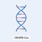

CRISPR-Cas: Gene Scissors

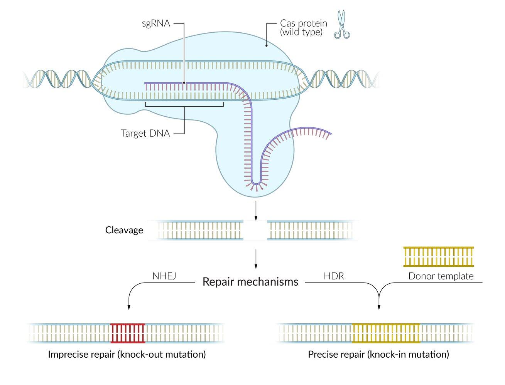

CRISPR-Cas

---

## Hemoglobin electrophoresis

### Definition

A <u>screening test</u> that detects and quantifies the types of hemoglobins present in a sample by separating them based on their electrical charge.

### Applications

* Diagnostic work-up of <u>hemolytic anemias</u>

* Screening for or evaluation of <u>hemoglobinopathies</u> in high-risk individuals (e.g., positive <u>family history</u>)

* Evaluation of abnormal <u>erythrocytes</u> on <u>peripheral blood smear</u>

### Procedure

* A sample of the patient's <u>hemoglobin</u> is obtained by hemolyzing a sample of blood using a hemolysate reagent.

* The <u>hemoglobin</u> sample is added to the gel electrophoresis buffer.

* An <u>electric field</u> is applied to the buffer that causes the different <u>hemoglobin</u> types to separate according to their electrical charge.

* A stain is applied to the gel to make the charged molecules visible.

* <u>Hemoglobin</u> is negatively charged at an alkaline <u>pH</u> and migrates on the gel towards the anode, forming <u>a band</u>.

* The degree of negative charge of the <u>hemoglobin</u> molecule determines the migration speed and distance from the cathode to the anode.

* <u>HbA</u> migrates the fastest and therefore the greatest distance, followed by <u>Hb</u> F, <u>Hb</u> S, and <u>Hb A2</u>, and <u>Hb C</u> (A > F > S > A2 and C).

* <u>Hemoglobin C</u> migrates the least because a <u>missense mutation</u> replaces the negatively charged <u>glutamic acid</u> with the positively charged <u>lysine</u>.

* <u>Hemoglobin S</u> migrates less than <u>HbA</u> because of the replacement of the negatively charged <u>glutamic acid</u> with the neutral <u>valine</u>.

> [!NOTE]
> A FaSt Car can go far (A > F > S > C).

### Expected findings

Please also see “<u>Hemoglobin patterns</u>” in <u>thalassemia</u>, <u>sickle cell disease</u>, and <u>hemoglobin C disease</u>.

* Normal (adult): wide <u>HbA</u> band (AA)

* Normal (fetal: ): <u>HbA</u> and widened <u>HbF</u> band (AF)

* <u>Beta thalassemia minor</u> (trait): narrowed <u>HbA</u> band and widened <u>HbA2</u> band

* <u>Beta thalassemia major</u>: no <u>HbA</u> band; widened <u>HbA2</u> and <u>HbF</u> bands

* <u>Sickle cell trait</u>: <u>HbA</u> and <u>HbS</u> bands (<u>AS</u>)

* <u>Sickle cell anemia</u>: no <u>HbA</u> band; wide <u>HbS</u> band (SS)

* <u>HbC trait</u>: <u>HbA</u> and <u>HbC</u> bands (AC)

* <u>HbC disease</u>: no <u>HbA</u> band; wide <u>HbC</u> band (CC)

* <u>HbSC disease</u>: no <u>HbA</u> band; <u>HbS</u> and <u>HbC</u> bands (SC)

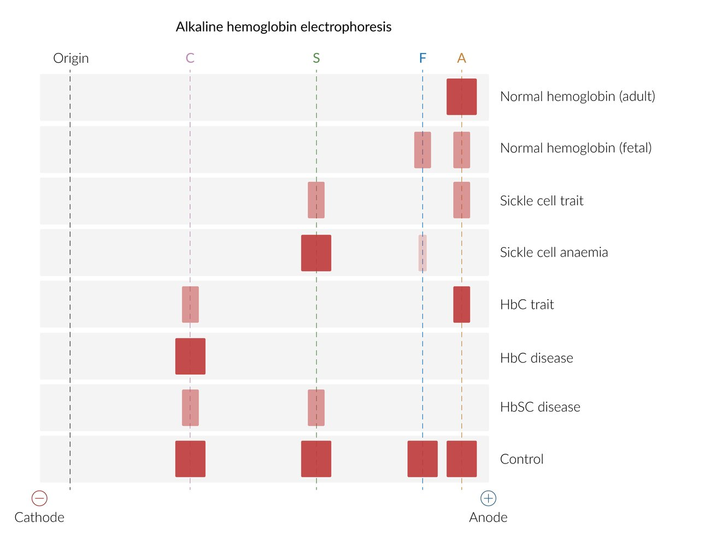

Hemoglobin electrophoresis

---

## Genetic research methods

### RNA interference (<u>RNAi</u>)

* Definition: inhibition of <u>gene expression</u> via small, non-coding <u>RNA</u> molecules that bind target <u>RNA</u> (mostly <u>mRNA</u>)

* Examples: <u>miRNAs</u>, siRNAs (See “<u>Nucleotides, DNA, and RNA</u>” for more information)

* Functions

* Inhibition of <u>gene expression</u>

* <u>Defense mechanism</u> against foreign <u>RNA</u> molecules

* Mechanisms

* Inhibition of <u>translation</u>

* <u>mRNA</u> destabilization

* Removal of <u>poly(A) tail</u> at the 3′OH-end of target <u>mRNA</u> (deadenylation)

* Decapping

* <u>mRNA</u> degradation

### Cre-Lox system

* Used to induce recombination between specific <u>DNA</u> sites (e.g., to study the effect of <u>gene</u> insertions or deletions)

* Consists of <u>Cre recombinase</u> and <u>LoxP sequences</u> 

* Cre recombinase: an enzyme that catalyzes recombination between <u>LoxP sequences</u>

* LoxP sequences: short <u>DNA</u> sequences within <u>the cell</u> <u>genome</u> that have sites for <u>Cre recombinase</u> binding

### Molecular cloning [[5]](https://coursology-qbank.com/amboss/article/i4bJQF)

* Definition: experimental production of recombinant <u>DNA</u> molecules within host organisms (e.g., bacterial hosts)

* Process
1. * Isolation of <u>eukaryotic</u> target <u>mRNA</u>
2. * Production of <u>complementary DNA</u> (<u>cDNA</u>) using <u>reverse transcriptase</u>
3. * Insertion of <u>cDNA</u> fragments into a cloning <u>vector</u> (e.g., bacterial <u>plasmids</u> carrying the <u>antibiotic</u> resistance <u>genes</u>)
4. * Transformation of the produced recombinant <u>plasmid</u> into bacteria
5. * Selection of bacteria that contains the <u>plasmid</u> (e.g., via <u>antibiotic</u> exposure when cloning <u>antibiotic</u> resistance <u>genes</u>)

* Result: synthesis of multiple copies of target <u>cDNA</u> (cloned <u>DNA</u>)

* Application: human protein production in bacteria (e.g., <u>insulin</u>, recombinant <u>factor VIII</u>, human <u>growth hormone</u>)

Section 6 CRISPR Cas9   Molecular Cloning

### DNA libraries

* Definition: organized collections of cloned <u>DNA</u> fragments for research and diagnostic applications

* Genomic libraries: contain all <u>DNA</u> sequences from an organism's <u>genome</u>

* Include coding sequences, <u>introns</u>, regulatory elements, and intergenic regions

* Constructed using <u>restriction enzymes</u> to fragment genomic <u>DNA</u>

* Maintained in <u>vectors</u> (<u>plasmids</u>, BACs, YACs) within bacterial hosts

* <u>cDNA</u> libraries: contain only expressed <u>gene</u> sequences

* Used to amplify and/or express a <u>gene</u> of interest

* Created from <u>mRNA</u> using <u>reverse transcriptase</u> to produce <u>complementary DNA</u>

* Lack <u>introns</u> and non-coding sequences

* Represent <u>genes</u> active in specific tissues, <u>developmental stages</u>, or disease states

* Example: were used to produce <u>insulin</u> and human <u>growth hormone</u> in bacteria

* Construction process
1. * <u>DNA</u> fragmentation (genomic) or <u>mRNA</u> isolation (<u>cDNA</u>)
2. * <u>Vector</u> insertion using <u>restriction enzymes</u> and ligases
3. * Transformation into bacterial hosts (typically <u>E. coli</u>)
4. * Selection and propagation of clones

* Clinical applications

* <u>Gene</u> identification and characterization for genetic disorders

* Development of diagnostic probes and genetic tests

* <u>Gene therapy</u> <u>vector</u> design

* Pharmacogenomic research

* Protein production for therapeutic use (e.g., <u>insulin</u>)

---