# Nucleotides, DNA, and RNA

*Categories: Clinical knowledge > Genetics > Basics of genetics > Nucleotides, DNA, and RNA*

[Original Article Link](https://coursology-qbank.com/amboss/article/oo001S)

---

## Summary

The genetic information of an organism is stored in the form of <u>nucleic acids</u>. <u>Nucleic acids</u>, <u>DNA</u> (<u>deoxyribonucleic acid</u>) and <u>RNA</u> (<u>ribonucleic acid</u>), are long linear polymers composed of <u>nucleotide</u> building blocks. Each <u>nucleotide</u> is comprised of a sugar, a <u>phosphate</u> residue, and a <u>nitrogenous bases</u> (a <u>purine</u> or <u>pyrimidine</u>). <u>DNA</u> is longer than <u>RNA</u> and contains the entire genetic information of an organism encoded in the sequences of the bases. In contrast, <u>RNA</u> only contains a portion of the information and can have completely different functions in <u>the cell</u>.

<u>DNA</u> is structurally characterized by its <u>double helix</u>: two opposite, complementary, <u>nucleic acids</u> strands that spiral around one another. The <u>DNA</u> backbone, with alternatively linked sugar and <u>phosphate</u> residues, is located on the outside. The bases are located inside the helix and form the <u>base pairs</u> <u>adenine</u> and <u>thymine</u> or <u>guanine</u> and <u>cytosine</u>, which are linked by <u>hydrogen bonds</u>.

The <u>human genome</u> comprises 3.2 x 109 <u>base pairs</u>, which are distributed over 23 pairs of <u>chromosomes</u>. Each <u>chromosome</u> is a linear <u>DNA</u> molecule of a certain length. The <u>chromosome</u> is only well visualized under the <u>light microscope</u> during the <u>metaphase</u> of <u>mitosis</u>, as it is maximally condensed during this phase. <u>Chromosomes</u> are present as pairs in most cells of the body. One <u>chromosome</u> in each of the 23 pairs originates from the mother and the other from the father.

Both interrelated <u>chromosomes</u> are termed homologous because they each have a variant of the same <u>gene</u>. Alterations in the number or structure of the <u>chromosomes</u> lead to various conditions, e.g., developmental disorders. <u>Chromosomal</u> assessment with different molecular biology and cytogenetic methods often allows for a clear diagnosis.

---

## Nucleotides

### Nucleotides

* Structure  

* Nitrogenous base (a <u>purine</u> or <u>pyrimidine</u>)

* Pentose sugar

* <u>Phosphate</u> group

* Bonds

* Nucleoside: base and sugar (ribose or deoxyribose), linked by an N-glycosidic bond

* <u>Nucleotide</u>: <u>nucleoside</u> and <u>phosphate</u> group, linked by a 3'-5' phosphodiester bond

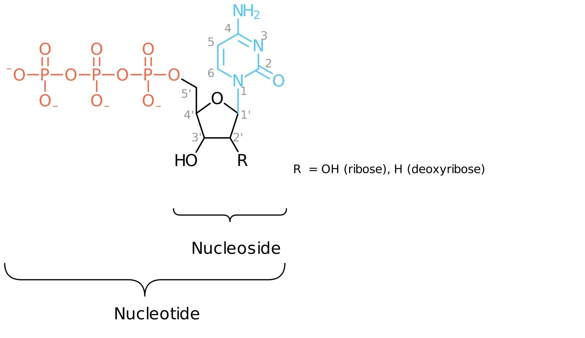

General structure of nucleosides and nucleotides

> [!NOTE]
> NucleoSides consist of base and Sugar (deoxyribose). NucleoTides consist of base, deoxyribose and phosphaTe.

#### Nucleobases

* <u>Cytosine</u> has 3 <u>H-bond</u> donors and forms a strong bond with <u>guanine</u>, which has 3 <u>H-bond</u> acceptors.

* More stable than bonds consisting of 2 <u>H bonds</u> (A-T)

* The higher the number of <u>cytosine</u>-<u>guanine</u> bonds in <u>DNA</u>, the higher its melting temperature.

* Other than <u>uracil</u>, there are many other bases that may be created after the initial <u>nucleic acid</u> chain formation, for example:

* Hypoxanthine

* Created from <u>adenine</u> via <u>deamination</u> during <u>RNA editing</u>

* Present as inosine in <u>tRNA</u> and plays an important role in ensuring proper wobble <u>base pair</u> <u>translation</u> (see “<u>Wobble hypothesis</u>”)

* Xanthine

* Intermediate of <u>purine</u> metabolism

* Created from <u>guanine</u> via <u>deamination</u>

* <u>Amino acids</u> required for <u>purine</u> synthesis 

* <u>Glycine</u>

* <u>Aspartate</u>

* <u>Glutamine</u>

* See “<u>Purines and pyrimidines</u>” for more details.

|  Overview of <u>pyrimidines</u> and <u>purines</u>   |  |  |  |  |  |
| --- | --- | --- | --- | --- | --- |
|  | Rings | Base | Notable characteristics | As a <u>nucleoside</u> unit in <u>RNA</u> | As a <u>nucleoside</u> unit in <u>DNA</u> |
|  Pyrimidines |  * 1 ring   |  * Cytosine (C)   |  * Forms 3 <u>H bonds</u>   |  * Cytidine   |  * Deoxycytidine   |
|  * Thymine (T)   |   * Created from 5-methylcytosine via <u>deamination</u>  * Also arises from <u>methylation</u> of <u>uracil</u>  * Has a methyl group  * Forms 2 <u>H bonds</u>    |  * Not present   |  * Thymidine   |  |  |
|  * Uracil (U)   |   * Created from <u>cytosine</u> via <u>deamination</u> during <u>RNA editing</u>  * Forms 2 <u>H bonds</u>    |  * Uridine   |  * Not present   |  |  |
|  Purines |  * 2 rings   |  * Adenine (A)   |  * Forms 2 <u>H bonds</u>   |  * <u>Adenosine</u>   |  * Deoxyadenosine   |
|  * Guanine (G)   |   * Has a <u>ketone</u> group  * Forms 3 <u>H bonds</u>    |  * Guanosine   |  * Deoxyguanosine   |  |  |

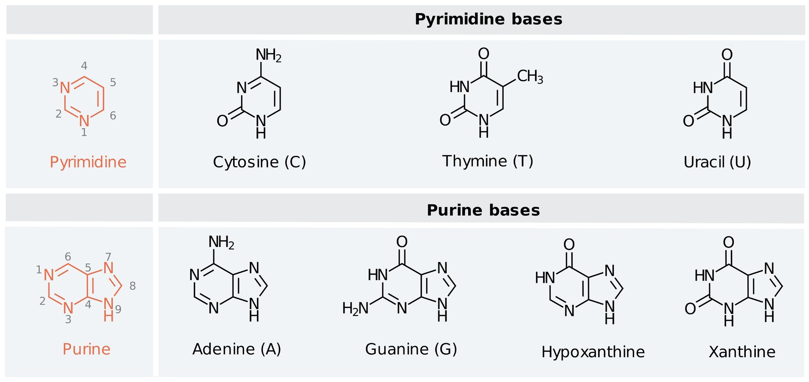

Overview of purine and pyrimidine bases

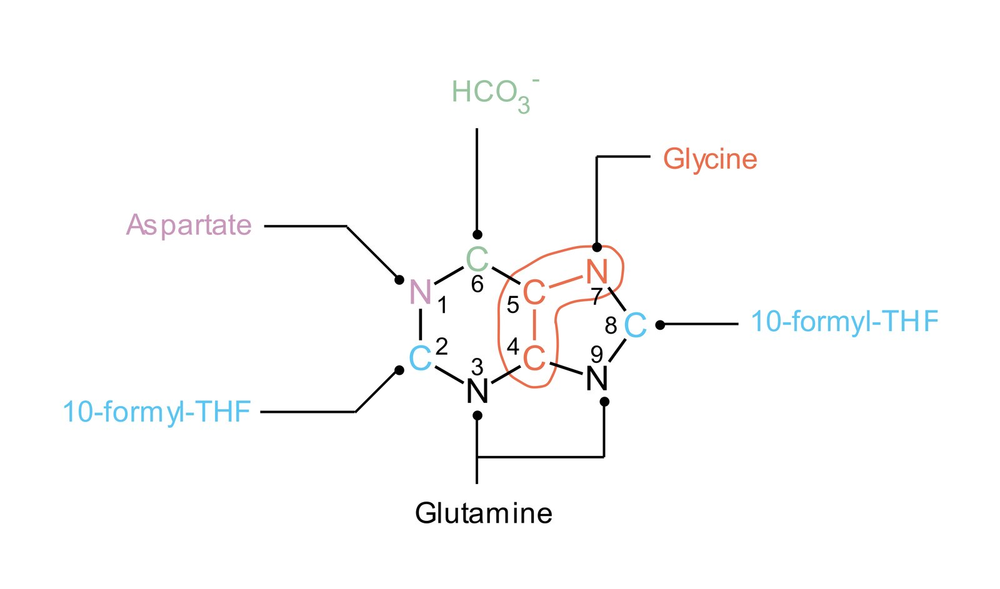

Source of atoms in the purine ring

> [!NOTE]
> “A mean person <u>GAG</u>s a PURring cat!” (Three Amino acids, Glycine, Aspartate, and Glutamine, are necessary for PURine synthesis.)

> [!NOTE]
> “C-G stabilizes <u>DNA</u> Crazy Good!” (C-G bonds are extremely stable.)

> [!NOTE]
> “PYRates Capture 1 Undersea Treasure.” (PYRimidine bases: Cytosine, Thymine, and Uracil and consist of 1 ring.)
> “PURe A Glass for 2.” (PURine bases are Adenine and Guanine and consist of 2 rings.)

> [!NOTE]
> Thymine contains a methyl group and is only found in <u>DNA</u>; <u>uracil</u> is only found in <u>RNA</u>.

#### <u>Nucleic acid</u> sugars

* Structure: The sugar found in <u>nucleic acids</u> is a pentose, which has a five-atom ring.   

* <u>DNA</u> is deoxyribose

* <u>RNA</u> is ribose

* Pentose binds

* Bases via N-glycosidic bonds

* <u>Phosphate</u> residue via phosphodiester bonds

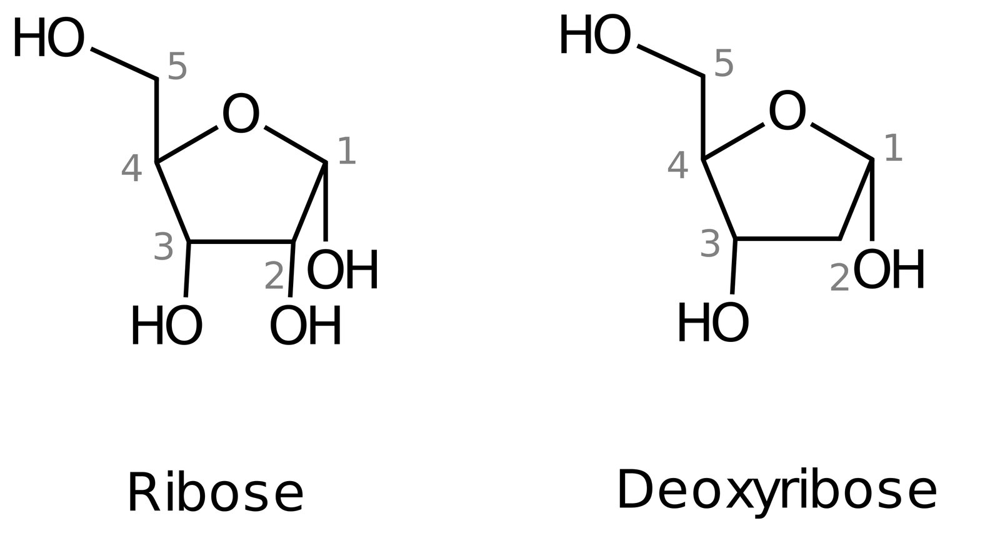

Ribose and deoxyribose

#### <u>Phosphate</u> group

* A <u>nucleotide</u> can have one, two, or three <u>phosphate</u> groups (also termed “<u>nucleoside</u> monophosphate”, “diphosphate”, and “triphosphate”, respectively).

* <u>Nucleic acids</u> are composed of <u>nucleoside</u> monophosphates.

* <u>Nucleoside</u> diphosphates and <u>nucleoside</u> triphosphates (e.g., <u>ATP</u>) are found in biochemical processes requiring energy 

* The phosphoanhydride bonds store a high amount of energy that can be utilized in biochemical processes when targeted by 3' hydroxyl attack.

* The <u>nucleotide</u> that is added to the 5' end of the <u>nucleic acid</u> initially has three <u>phosphate</u> groups. The splitting of the two end <u>phosphate</u> groups supplies the energy necessary for the phosphodiester bonds that build the <u>DNA</u> backbone.

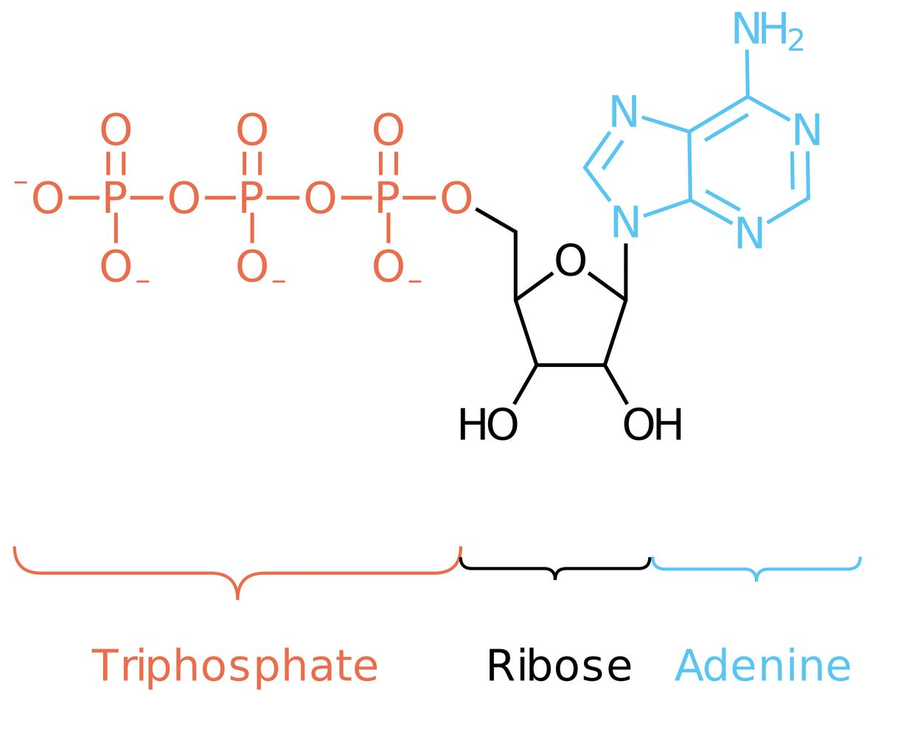

ATP

---

## Function of nucleotides and their derivates

<u>Nucleotide</u> and <u>nucleotide</u> derivatives have important functions in the body.

* Building blocks of <u>nucleic acids</u>

* Source of energy: : especially as a universal energy carrier of <u>the cell</u> in the form of <u>ATP</u>, but also <u>GTP</u>

* Signal molecules: especially the <u>second messenger</u> <u>cAMP</u> (<u>cyclic adenosine monophosphate</u>)  and <u>cGMP</u> (<u>cyclic guanosine monophosphate</u>) , both phosphoric esters

* Activators for the transfer of groups: Through the potential of forming energy-rich bonds, <u>nucleotides</u> are able to transfer a molecule onto another in biosynthesis, e.g.:

* UDP-<u>Glucose</u> is an active form of <u>glucose</u> in <u>glycogenesis</u>.

* Dietary choline can be activated to citicoline by CTP and be used in the synthesis of phosphatidylcholine.

* 3'-Phosphoadenosine-5'-phosphosulfate (<u>PAPS</u>) serves as a sulfate group donor in sulfatide synthesis.

* S-Adenosyl <u>methionine</u> (<u>SAM</u>) is formed from <u>methionine</u> and serves as a <u>cofactor</u> in <u>methylation</u> reactions.

* Regulators: enzyme reactions in <u>signal transduction</u> pathways (e.g., activates <u>GTP</u> <u>G proteins</u>)

* Carrier molecules: e.g., the electron carrier <u>nicotinamide adenine dinucleotide</u> (<u>NAD+</u>)  and <u>flavin adenine dinucleotide</u> (<u>FAD</u>)  as a component of <u>coenzymes</u> in <u>redox reactions</u>

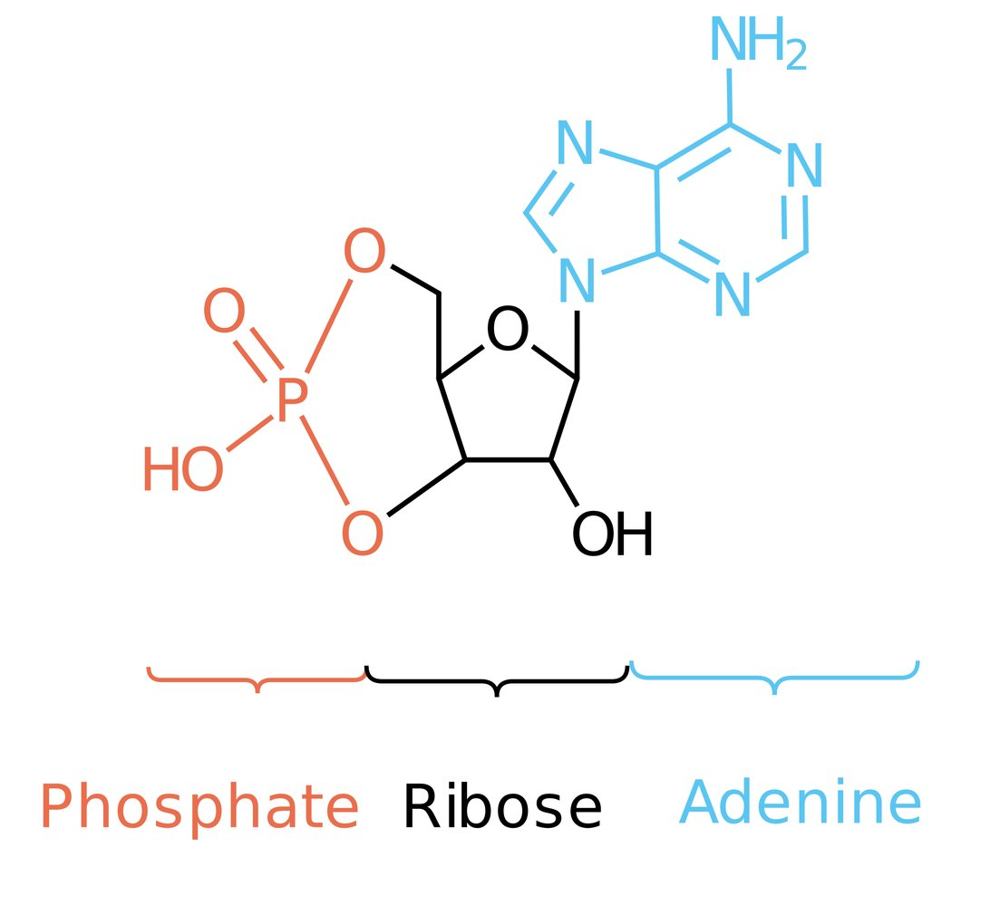

cAMP

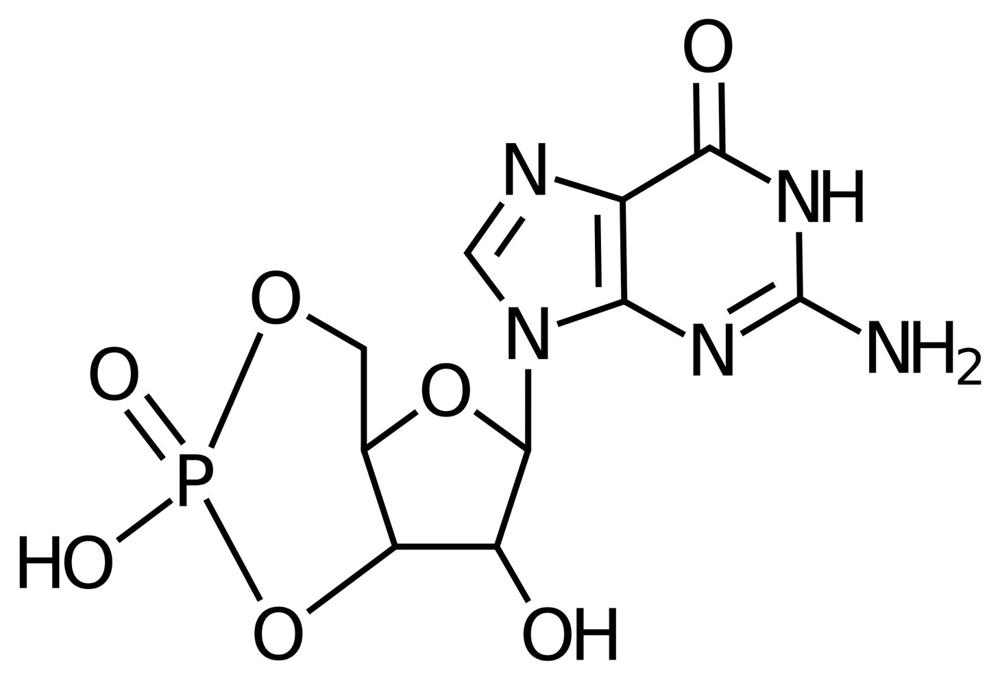

Cyclic guanosine monophosphate (cGMP)

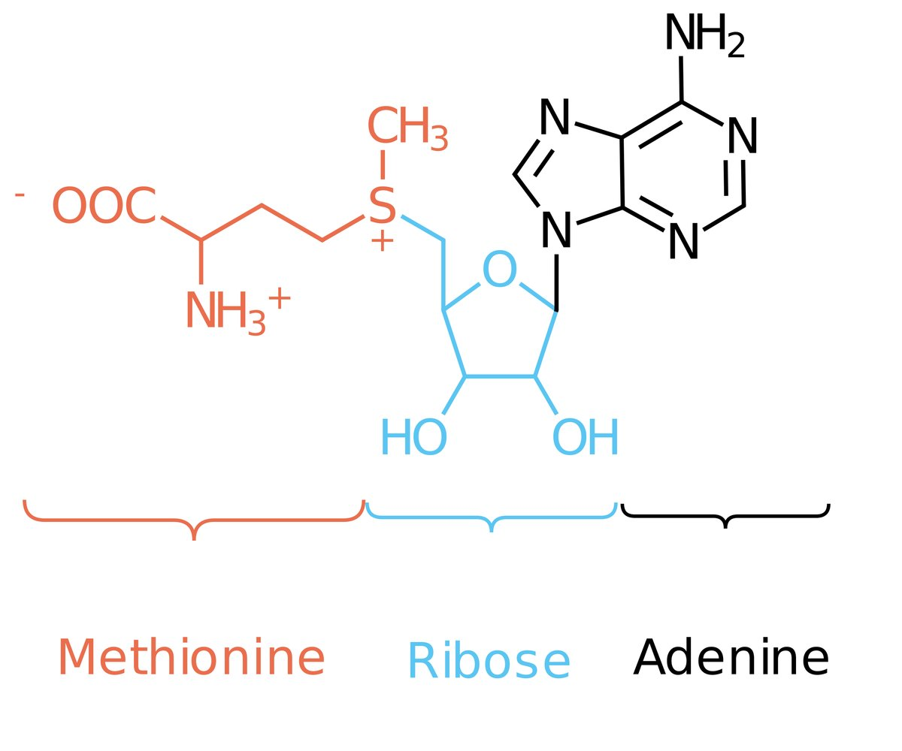

S-Adenosyl methionine (SAM)

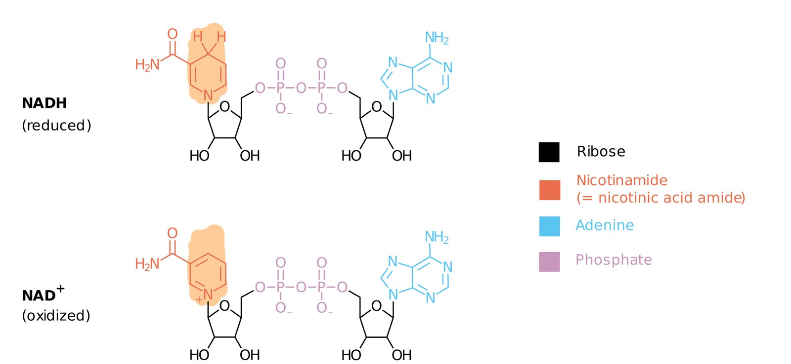

NAD+ / NADH redox pair

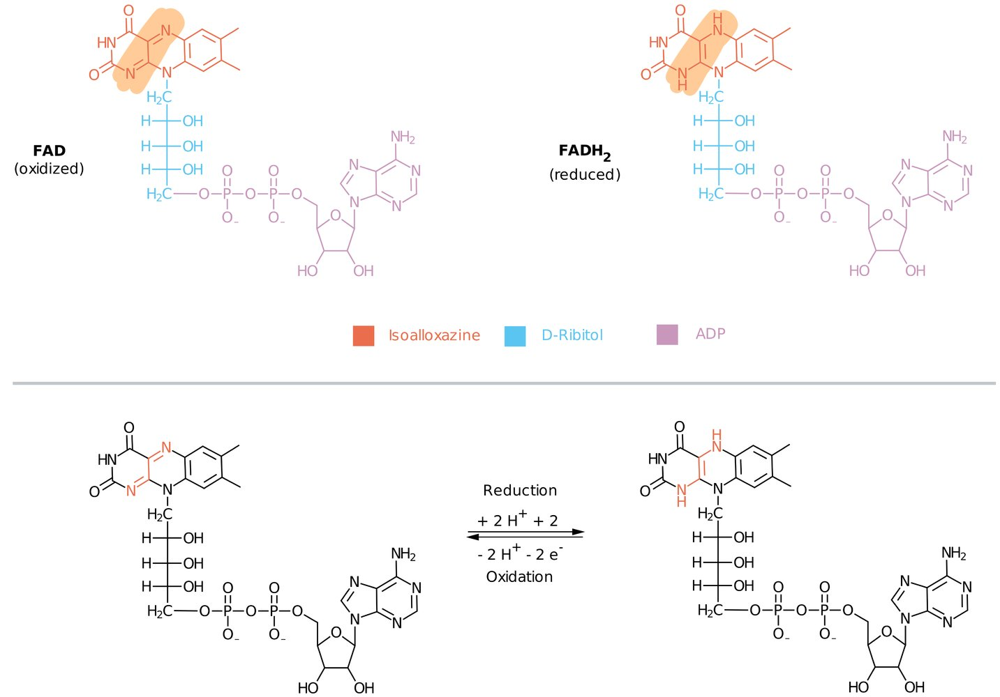

FAD / FADH2 redox pair

> [!NOTE]
> The energy carrier <u>ATP</u> contains ribose and not deoxyribose as a sugar, and therefore has a 2' OH group.

---

## Overview of nucleic acids

### Nucleic acids

* Long, linear chains (polymers) of <u>nucleotides</u>

* Alternating sugar and <u>phosphate</u> residues of individual <u>nucleotides</u>, linked by phosphodiester bonds, form the backbone

* <u>Primary structure</u> of <u>nucleic acids</u>: <u>nucleotide</u> sequence in the chain

* Phosphodiester bonds are negatively charged.

* Negative charges stabilize the <u>nucleic acids</u>.

* Phosphodiester bonds cannot be easily <u>hydrolyzed</u> like other esters.

* The chemical composition of <u>nucleic acids</u> (<u>DNA</u> and <u>RNA</u>) and their structure of repetitive <u>nucleotide</u> units allow them to function as both information carrier and mediator.

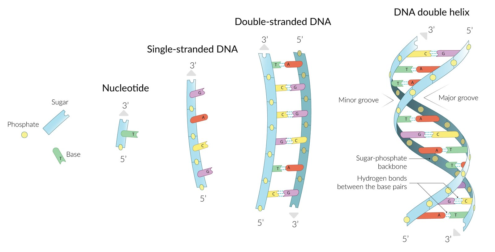

DNA structure

### Comparison of <u>DNA</u> and <u>RNA</u>

| <u>DNA</u> vs. <u>RNA</u> |  |  |
| --- | --- | --- |
|  | DNA | RNA |
| Bases |   * <u>Thymine</u>  * <u>Cytosine</u>, <u>adenine</u>, <u>guanine</u>  * Modification, especially to 5-Methylcytosine    |   * <u>Uracil</u>  * <u>Cytosine</u>, <u>adenine</u>, <u>guanine</u>  * Many unusual or modified bases are possible.    |
| Sugar |  * Deoxyribose   |  * Ribose   |
| Length |   * Depending on the organism  * Ranging from several thousand to several millions of <u>nucleotides</u>    |  * Varies considerably   |
|  Structure  |   * Double-stranded helix  * <u>Base pairing</u>  * Superhelix  * Associates with <u>proteins</u> (particularly <u>histones</u>) for dense packaging in the <u>nucleus</u>    |   * Usually single-stranded (except the double-stranded <u>miRNA</u> and <u>siRNA</u>)  * Various 3D structures are possible; e.g., loops through the formation of short sections with <u>base pairing</u> (double-stranded)    |
| Function |  * Carries the hereditary information (collectively known as the <u>genome</u>) for the construction and function of the organism   |  * Varies considerably depending on class, e.g., coding, regulatory, or enzymatic function (see table “Classification of <u>RNA</u>” below)   |

---

## DNA structure and the human genome

### Overview of double-stranded <u>DNA</u>

#### Organization of the <u>human genome</u>

* Double-stranded chain of deoxyribonucleotides in cells

* Both strands are complementary to each other and run anti-parallel. 

* <u>Nucleotides</u> form single-stranded <u>DNA</u> that stabilizes into double-stranded <u>DNA</u>

* <u>DNA</u> conforms into right-handed <u>double helix</u> that binds <u>histone octamers</u> to form <u>nucleosomes</u> (appear as “beads on a string” under <u>electron microscopy</u>)

* <u>Chromatin</u> formation begins, which is then further compacted

* During replication (<u>mitosis</u> or <u>meiosis</u>), <u>chromatin</u> maximally condenses into <u>chromosomes</u> (only visible during <u>metaphase</u> under <u>light microscopy</u>)

#### <u>Double helix</u>

* 3D structure of <u>DNA</u> in which two polynucleotide strands are intertwined, stabilized by:

* Specific base pairing via hydrogen bonds (<u>H bonds</u>) between complementary <u>nucleobases</u> of <u>DNA</u> 

* A-T bonds consist of 2 <u>H bonds</u>

* G-C bonds consist of 3 <u>H bonds</u>, resulting in a stronger bond (an ↑ in G and C in <u>DNA</u> → ↑ melting temperature of <u>DNA</u>)

* Hydrophobic effect: The negatively charged sugar-<u>phosphate</u> backbone is located on the outside of the helix, the bases on the inside.

* Base stacking: The <u>base pairs</u> are stacked on one another (stacking interactions) and interact through <u>van der Waals forces</u>, which have an additional stabilizing effect.

* <u>Double helix</u> has a minor groove and a major groove.

#### Conformations

* B conformation (B-DNA) 

* Most prevalent

* Right-handed <u>double helix</u>

* 10 <u>base pairs</u> per helical twist to a length of 3.4 nm

* Diameter of the helix: 2 nm

* Bases are approx. perpendicular to the helix axis.

* A conformation (A-<u>DNA</u>)

* Right-handed <u>double helix</u>, although broader and shorter than <u>B-DNA</u>

* <u>Base pairs</u> are not perpendicular to the helix axis but are slightly inclined toward the axis.

* <u>Dehydrated</u> form, i.e., present under experimental conditions and not in vivo.

* Z conformation (Z-DNA)

* Left-handed <u>double helix</u>

* Stretched longer than <u>B-DNA</u> resulting in a smaller diameter

* Occurs in GC-rich sequences, although they are generally rare under physiological conditions

* The <u>phosphate</u> groups of the <u>DNA</u> backbone form a zigzag pattern.

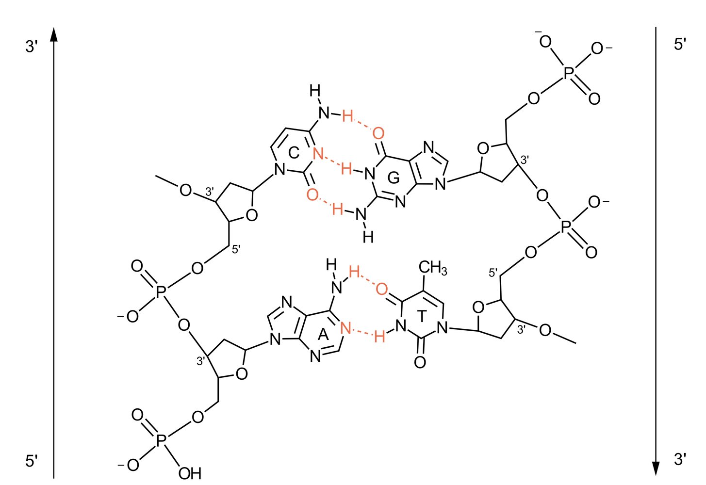

Watson-Crick base pairing

DNA structure

> [!NOTE]
> <u>Base pairs</u> in <u>DNA</u>: <u>guanine</u> pairs with <u>cytosine</u> (3 <u>H bonds</u>), <u>adenine</u> pairs with <u>thymine</u> (2 <u>H bonds</u>).

#### Supercoils

* Description: winded <u>double helix</u> , also termed “superhelix”

* Occurrence: especially in circular <u>DNA</u> molecules

* In <u>prokaryotes</u>: <u>chromosome</u> of bacteria, <u>plasmids</u>

* In <u>eukaryotes</u>

* <u>Mitochondrial DNA</u> (circular)

* “Inflexible” segment of linear, <u>chromosomal</u> <u>DNA</u>

* Function: Supercoiled <u>DNA</u> molecules have a more compact structure than the relaxed form of <u>DNA</u>.

#### Palindrome

* Description

* A <u>palindrome</u> is a sequence that reads the same forwards and backward (e.g., <u>eye</u>, level, madam).

* The molecular biological use of the term “<u>palindrome</u>” is for inverted repeats (repeated sequence in the opposite direction).

* Occurrence

* In <u>palindromic sequences</u>, a sequence of <u>base pairs</u> occurring over a certain segment is read identically on both <u>complementary DNA</u> strands, i.e., the sequence always reads the same on both strands in a 5'→3' direction.

* Bases may be present between the <u>palindromic sequences</u> that are not complementary.

* These segments are self-complementary and can form a hairpin loop.

* Results in the formation of a cross-shaped structure in double-stranded <u>DNA</u>

* Function: Some <u>proteins</u> that are capable of binding <u>DNA</u> require <u>palindromic sequences</u> as a recognition sequence, e.g., <u>steroid hormone</u> <u>receptors</u> or <u>restriction enzymes</u>.

### Chromatin

* Definition: complex of <u>DNA</u> and its associated <u>proteins</u> (both <u>histones</u> and non-<u>histones</u>) structured as repetitive units (<u>nucleosomes</u>)

* Functions

* Condensation and organization of <u>DNA</u> (a very large molecule) allow for storage inside the <u>nucleus</u> and are important for <u>gene</u> regulation

* Chromatin remodeling 

* Opening <u>chromatin</u> structure from a compact state to a more accessible arrangement

* Allows for <u>transcription factors</u> and <u>RNA polymerase</u> to access specific <u>loci</u> of <u>genes</u>

* Facilitated by various enzyme remodelers (e.g., SWI/<u>SNF</u> ATPases), <u>histone</u> <u>post-translational modifications</u> (see below), and direct modification of <u>DNA</u> itself (e.g., <u>DNA</u> demethylation).

* Types

* Heterochromatin

* Contains inactive <u>DNA</u> because the highly condensed, steric conformation does not allow <u>transcription</u>

* Darker on <u>electron microscopy</u> (EM)

* <u>DNA</u> is highly <u>methylated</u> and deacetylated

* Euchromatin

* Contains active <u>DNA</u> because the less condensed steric conformation makes <u>DNA</u> accessible for <u>transcription</u>

* Lighter on EM

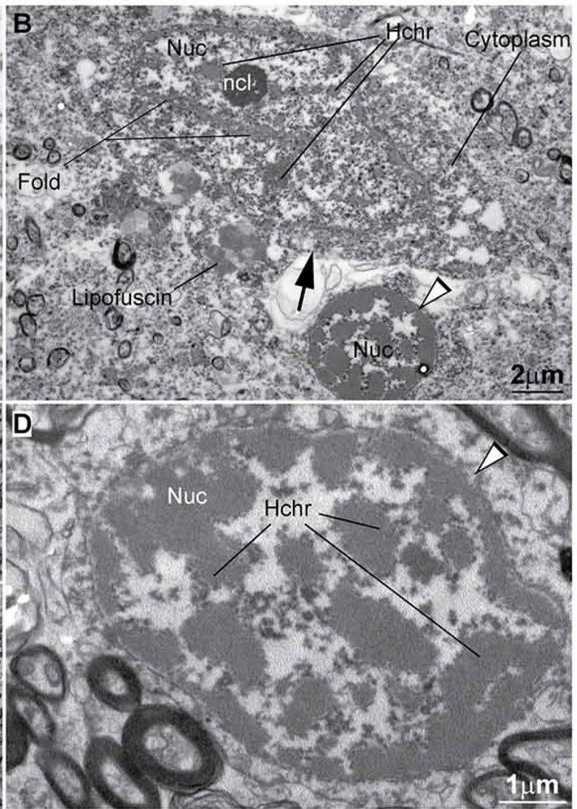

Heterochromatin

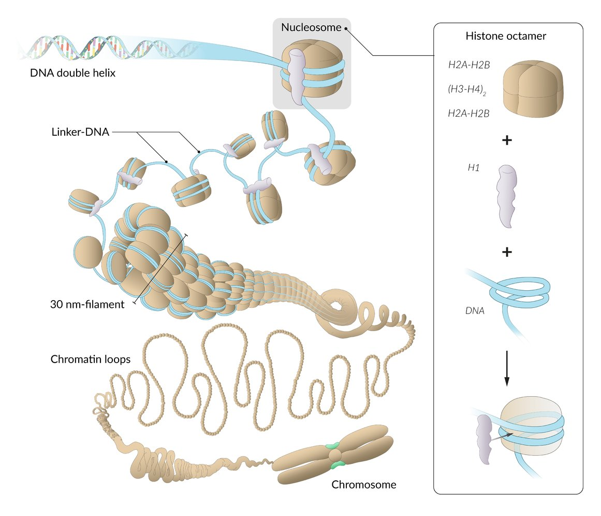

Human genome packaging

> [!NOTE]
> Heterochromatin is Hooked tight while Euchromatin is Easygoing.

#### Histones

* Definition: group of <u>proteins</u> that bind to <u>DNA</u> in the <u>nucleus</u> of <u>eukaryotes</u> to support the structure of <u>chromatin</u>

* Characteristics

* Positively charged through the high percentage (∼ 25%) of basic <u>amino acids</u> (<u>arginine</u> and <u>lysine</u>)

* Strong ionic interactions with negatively charged <u>DNA</u> (through <u>phosphate</u> groups on <u>DNA</u>)

* Synthesized during <u>S phase</u> in the <u>cytosol</u> and transported to the <u>nucleus</u>

* Types: There are four core <u>histones</u> and a linker.

* 4 Core <u>histones</u>: H2A, H2B, H3, H4 

* 2 molecules of each core <u>histone</u> form the <u>nucleosome</u> 8-protein complex core, a histone octamer, around which the <u>DNA</u> is wound in segments

* Controls <u>gene expression</u> via reversible <u>post-translational modification</u> of <u>histones</u> (<u>acetylation</u>, <u>methylation</u>, <u>phosphorylation</u>, ubiquitinylation, Sumoylation, <u>ADP-ribosylation</u>)

* Histone methylation 

* Occurs via histone methyltransferase, which targets <u>lysine</u> or <u>arginine</u> residues

* <u>Methylation</u> usually suppresses <u>transcription</u> by enabling tighter <u>DNA</u> coiling.

* Depending on the location and number of methyl groups that are attached, <u>methylation</u> can also promote <u>transcription</u>.

* Histone acetylation

* <u>Acetylation</u> of specific <u>lysine</u> residues (positively charged) in <u>histone</u> <u>proteins</u> → less positively charged <u>histones</u> → weaker binding of <u>DNA</u> → relaxation of <u>DNA</u> coiling → ↑ <u>transcription</u> activity

* Similarly, histone deacetylation via histone deacetylase tightens the coiling of <u>DNA</u> and decreases <u>transcription</u> activity (see “<u>Histone modification</u>”).

* Clinical implications: pathogenesis of <u>Huntington disease</u> (dysregulated <u>acetylation</u>, e.g., <u>histone deacetylation</u> altering <u>gene expression</u>); <u>thyroid hormone</u>-induced <u>acetylation</u> that influences <u>thyroid hormone synthesis</u>

* Linker histone (H1)

* Structure: not completely known, but a different, less uniform structure than core <u>histones</u>

* Function: binds to <u>linker DNA</u> and to the <u>nucleosome</u>, leading to stabilization of the <u>chromatin</u> fiber.

> [!NOTE]
> <u>Histone</u> Methylation Mutes <u>transcription</u>. <u>Histone</u> Acetylation Activates <u>transcription</u>.

#### Nucleosome (<u>nucleosome</u> core particle)

* Definition: a structural and functional complex of <u>DNA</u> (∼ 150 bp) and <u>histone octamer</u> that gives <u>chromatin</u> its “beads on a string” appearance

* Structure

* <u>DNA</u> wraps around the <u>nucleosome</u> core with ∼ 1.8 twists

* <u>Nucleosomes</u> are linked to one another through linker DNA (short <u>DNA</u> segment of variable lengths)

* 30 nm <u>chromatin</u> fiber (solenoid)

* <u>Nucleosome</u> strand that is spirally bound to fibers with a diameter of 30 nm

* Each twist of the 30 nm fiber contains ∼ 6 <u>nucleosomes</u>.

* <u>Chromatin</u> loop

* Condensed form of <u>DNA</u> beyond the <u>nucleosome</u> and 30 nm fibers

* The <u>histone H1</u> and nonhistones are involved in the formation of loops.

#### <u>Chromosomes</u>

See “<u>Basics of human genetics</u>” for more information.

* Description

* A denser packaging of <u>chromatin</u> that only becomes visible under the microscope during cell division (especially in <u>metaphase</u>)

* Number of <u>chromosomes</u> in the <u>human genome</u>:

* Somatic cells contain 23 pairs of homologous duplicated <u>chromosome</u> pairs (46 <u>chromosomes</u> in total).

* Germ cells only contain 23 single-stranded, unduplicated <u>chromosomes</u>.

* Structure: A <u>chromosome</u> pair consists of 2 identical <u>chromatids</u> connected at the center by a <u>centromere</u>.

### Human genome

* The <u>human genome</u> consists of ∼ 3.2 billion <u>base pairs</u> (bp).

* The <u>DNA</u> stored in a human cell would total ∼ 1.8 m in length.

* In addition to the nuclear <u>genome</u> (found in the <u>nucleus</u>), there is also a <u>mitochondrial</u> <u>genome</u> that largely codes for <u>RNA</u>-associated <u>proteins</u>

#### Nuclear <u>genome</u>

* ∼ 10% contains <u>genes</u> and related sequences

* ∼ 3% of the nuclear <u>genome</u> codes for <u>proteins</u> (including <u>introns</u>) and RNAs.

* ∼ 1% of the nuclear <u>genome</u> only codes for <u>exons</u>.

* ∼ 90% does not contain <u>genes</u>

* The function of ∼ 50% of <u>DNA</u> sequences is unknown.

* ∼ 45% is composed of <u>repetitive sequences</u> (repetitive genetic elements).

* Simple repetitive <u>DNA</u> elements (tandem repeats)

* Satellite DNA: <u>repetitive sequences</u> of up to 18,000 <u>nucleotides</u>

* Minisatellite DNA: <u>repetitive sequences</u> from 3–100 <u>nucleotides</u>

* Microsatellite DNA: <u>repetitive sequences</u> from 2–6 <u>nucleotides</u>

* Previously mobile  genetic elements (such as <u>transposons</u>, LTR , non-LTR, LINE , SINE )

* ∼ 24% of the <u>genome</u> is spanned by <u>introns</u>.

#### <u>Mitochondrial</u> <u>genome</u> (mitochondrial DNA, <u>mtDNA</u>)

* Circular <u>genome</u> of ∼ 16,500 bp

* <u>Mitochondrial DNA</u> does not utilize <u>histones</u> for <u>DNA</u> packaging.

* Over 90% of <u>mtDNA</u> codes for <u>structural genes</u>, including for <u>mRNA</u>, <u>tRNA</u>, and <u>rRNA</u>.

* 13 <u>genes</u> that code for <u>proteins</u>, i.e., for <u>mRNAs</u>

* 22 <u>genes</u> for <u>tRNAs</u>

* 2 <u>genes</u> for <u>rRNA</u>

---

## RNA: Structure and characteristics

### <u>RNA</u> classes and their structure

RNAs can be differentiated into various types, which differ in their length, structure, and function. Depending on the type, <u>RNA</u> can be a single-stranded or double-stranded segment.

| Classification of <u>RNA</u> |  |  |
| --- | --- | --- |
|  | Function | Structure |
| mRNA (<u>messenger RNA</u>) |   * Coding <u>RNA</u> that functions as a template for <u>translation</u> in <u>protein synthesis</u>  * <u>DNA</u> is used as a template for <u>mRNA</u> synthesis in the <u>nucleus</u> by <u>RNA polymerase</u> (<u>transcription</u>)  * See “<u>Gene expression and transcription</u>.”    |   * Very variable structure and length, because the <u>nucleotide</u> sequence of <u>mRNA</u> depends on the <u>nucleotide</u> sequence of the corresponding <u>DNA</u> segment  * In <u>eukaryotes</u>, the initial transcript from <u>DNA</u> is known as heterogeneous nuclear RNA (<u>hnRNA</u>).  * pre-mRNA: <u>hnRNA</u> that undergoes posttranscriptional modifications to become <u>mRNA</u>    |
|  tRNA (<u>transfer RNA</u>)   |   * Adapter molecule in <u>protein synthesis</u>  * Transports <u>amino acids</u> to the <u>ribosome</u>  * See “<u>Gene expression and transcription</u>.”    |   * <u>Secondary structure</u>  * Composed of 75–90 <u>nucleotides</u>  * Contain a large percentage of chemically modified bases  * Form a characteristic cloverleaf structure through intramolecular <u>base pairing</u>  * Anticodon loop  * Contains a three-base binding site (<u>anticodon</u>) for recognizing complementary <u>mRNA</u> sequences (<u>codon</u>)  * Located opposite of the <u>acceptor stem</u>  * Acceptor stem  * Found in <u>prokaryotes and eukaryotes</u>  * 3'OH end with the sequence 5'-<u>CCA</u>-3'  * Binding site where <u>amino acids</u> get covalently bound: formation of <u>charged tRNA</u> that matches the <u>anticodon</u>  * D-arm (or dihydrouridine loop): contains <u>dihydrouridine</u> molecules essential for correct <u>tRNA</u> recognition by the <u>aminoacyl-tRNA synthetase</u>  * T-arm (or <u>TΨC loop</u>): contains modified bases (ribothymidine, pseudouridine, <u>cytidine</u>) necessary for <u>tRNA</u> <u>ribosome</u> binding    |
|  rRNA (<u>ribosomal RNA</u>)   |  * Fulfills structural and functional tasks (<u>catalyst</u>) as part of the <u>ribosome</u> during <u>protein synthesis</u>   |  * 5S, 5.8S, 18S, and 28S <u>rRNA</u>   * 18S <u>rRNA</u>: component of the small subunit of <u>ribosomes</u> (40S)  * 5S, 5.8S, and 28SrRNA  * Components of the large subunit of <u>ribosomes</u> (60S)  * 28S <u>rRNA</u> catalyzes the formation of <u>peptide bonds</u> in the <u>ribosome</u> (often referred to as a <u>ribozyme</u>)   |
| snRNA (<u>small nuclear RNA</u>) |   * Class of noncoding RNAs in the <u>nucleus</u>  * Component of the <u>spliceosome</u>  * Involved in the <u>splicing</u> of <u>pre-mRNA</u>    |  * Composed of several hundred <u>nucleotides</u>   |
| snoRNA (<u>small nucleolar RNA</u>) |   * Class of noncoding RNAs in the <u>nucleolus</u>  * Modifying <u>RNA</u> molecules, especially <u>rRNAs</u> including through <u>methylation</u> of ribose residues    |  * Composed of 100–170 <u>nucleotides</u>   |
|  <u>RNA</u> component of signal recognition particles (scRNA; <u>small cytoplasmic RNA</u>) |  * 7S <u>RNA</u>, in addition to the six protein components of the signal recognition particles (<u>SRP</u>), which is responsible for the transport of newly formed <u>proteins</u> in the <u>ribosome</u> to intracellular compartments in the <u>cytoplasm</u>   |   * Composed of 300 <u>nucleotides</u>  * Complex structure with many double-helical segments    |
| <u>Telomerase</u> <u>RNA</u> component (<u>human telomerase RNA</u>, hTR) |   * <u>Nucleic acid</u> component of <u>telomerase</u>  * Serves as an <u>RNA</u> matrix by which the <u>telomerase</u> extends the free ends of the genomic <u>DNA</u> during <u>DNA replication</u> to prevent loss of coding <u>DNA</u> segments. Therefore, <u>telomerase</u> is a <u>reverse transcriptase</u> and brings its own matrix.    |   * In humans, the matrix sequence is 5'-UAACCCUA-3'  * Composed of 451 <u>nucleotides</u> and does not have a <u>poly(A) tail</u>    |
| miRNA (<u>microRNA</u>) |   * Class of regulatory, noncoding RNAs, naturally found in cells in the form of hairpin structures  * Encoded in <u>introns</u>  * Regulates <u>gene expression</u>  * Binding of the 3' untranslated region via <u>nucleotide</u> pairing prevents <u>translation</u> and accelerates the degradation of certain <u>mRNA</u>.  * <u>miRNA</u> binds loosely to <u>mRNA</u>, thereby allowing a higher number of related <u>mRNAs</u> to bind it.  * Dysfunctional <u>miRNA</u> expression may contribute to the development of some cancers (e.g., a <u>miRNA</u> that silences the <u>mRNA</u> of a <u>tumor suppressor gene</u>).    |   * Composed of ∼ 20–30 <u>nucleotides</u>  * Formed from precursor molecules with a <u>5' cap</u> and a poly(A) tail, but are then cleaved into smaller oligonucleotides    |
| siRNA (<u>small interfering RNA</u>) |   * Class of regulatory, noncoding RNAs that most commonly arise from <u>exogenous</u> dsRNA sources (e.g., <u>viruses</u>)  * Regulates <u>gene expression</u> via highly specific <u>nucleotide</u> pairing → ↑ <u>mRNA</u> degradation → ↓ <u>mRNA</u> <u>translation</u>  * Experimental use: <u>gene</u> “knockdown”    |   * Composed of ∼ 20–30 <u>nucleotides</u>  * Formed from double-stranded precursor molecules from a similar mechanism as for <u>miRNA</u>    |

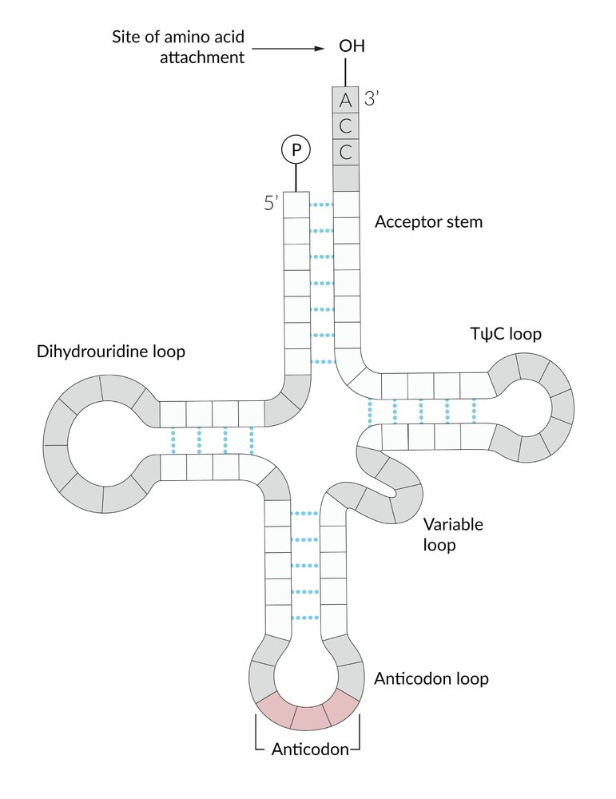

Structure of tRNA (cloverleaf model)

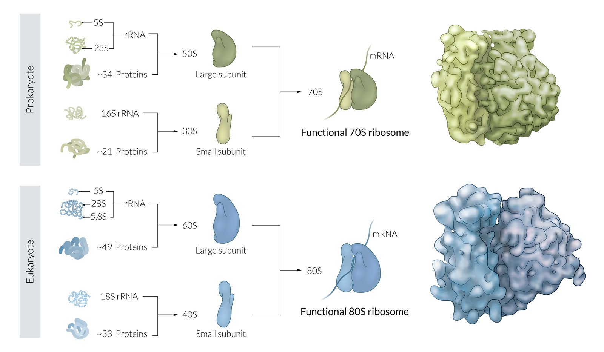

Ribosome assembly

> [!NOTE]
> To remember the features of the two <u>tRNA</u> arms, think: “Dihydrouridine and Detection” for the D-arm and “t<u>RNA</u> Tethering” for the T-arm.

> [!NOTE]
> “<u>CCA</u> Can Catch Amino acids” (function of the 5'-<u>CCA</u>-3' sequence in <u>tRNA</u>).

---