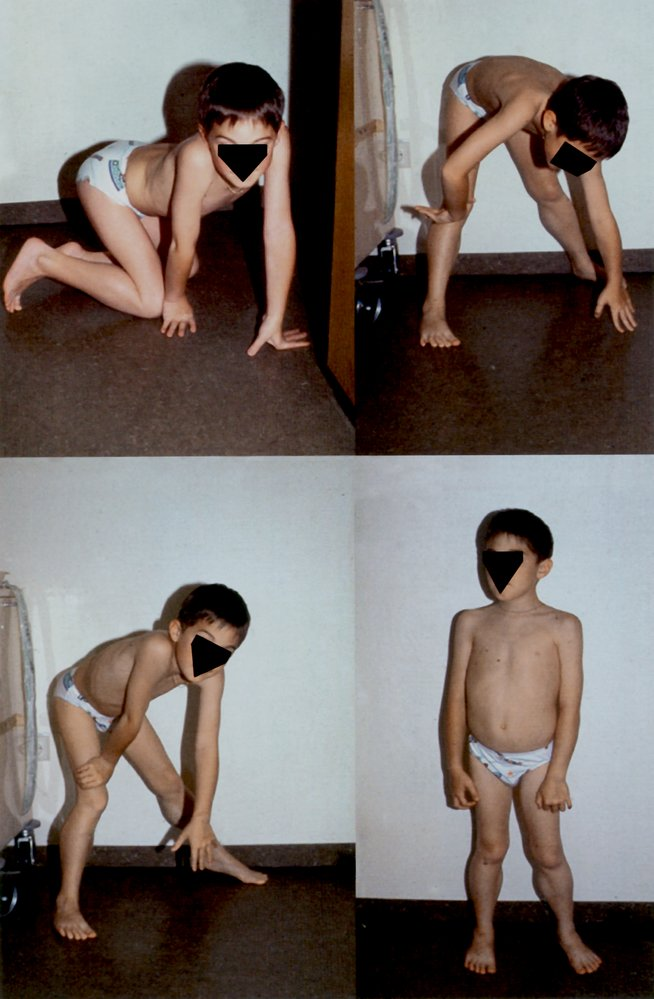
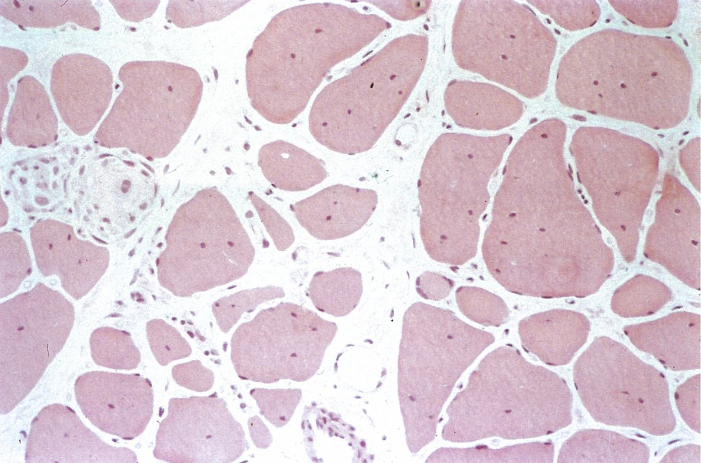
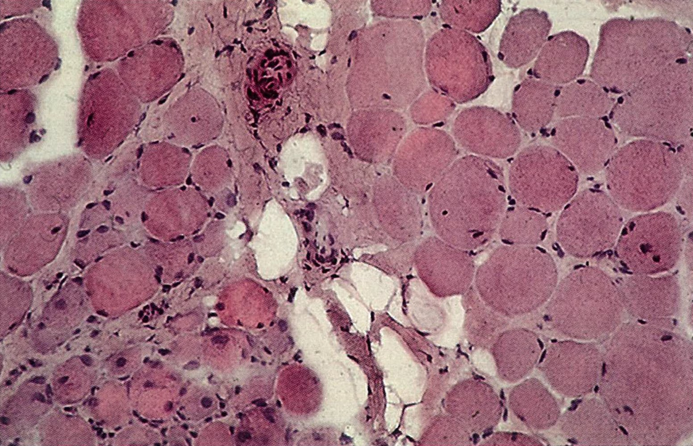
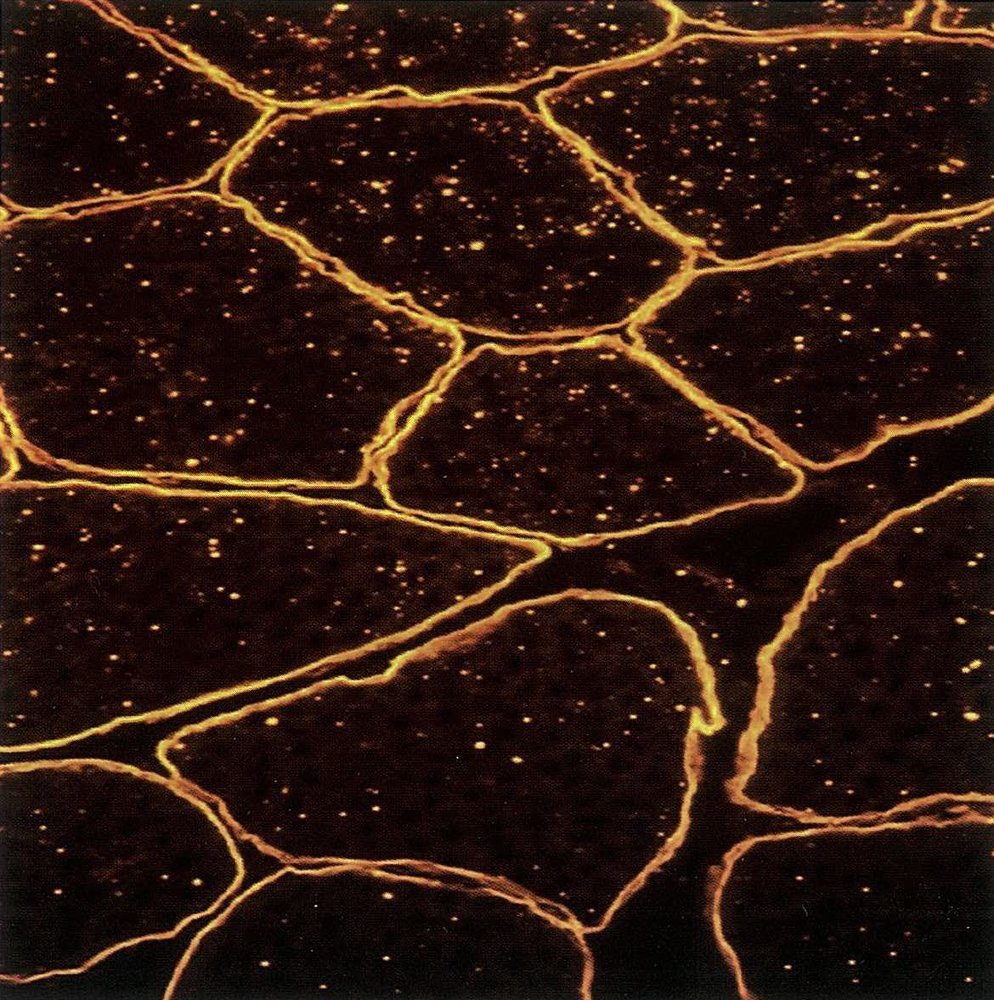
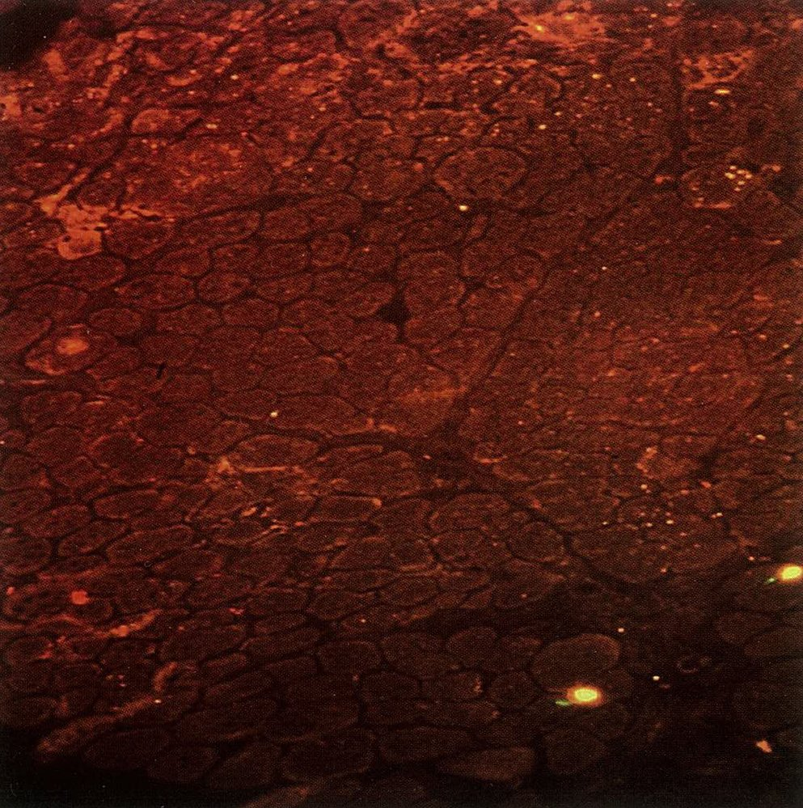

# Progressive muscular dystrophies

*Categories: Clinical knowledge > Genetics > CNS, spinal, and muscular disorders > Progressive muscular dystrophies*

[Original Article Link](https://coursology-qbank.com/amboss/article/8R0OKf)

---

## Summary

Muscular dystrophies are a group of progressive diseases that affect the <u>musculoskeletal system</u>. <u>Duchenne muscular dystrophy</u> (<u>DMD</u>) and <u>Becker muscular dystrophy</u> (<u>BMD</u>) are <u>X-linked recessive</u> diseases, whereas limb-girdle muscular <u>dystrophy</u> (<u>LGMD</u>) may be either <u>autosomal dominant</u> or recessive, and <u>facioscapulohumeral dystrophy</u> (<u>FSHD</u>) is usually <u>autosomal dominant</u>. Muscular dystrophies are commonly due to mutations involving muscular <u>genes</u> (e.g., <u>dystrophin</u>-protein coding <u>gene</u>). Patients typically present with muscular complaints affecting specific muscle groups, particularly the <u>pelvic girdle</u> musculature. <u>DMD</u> is the most severe form of muscular <u>dystrophy</u>, with disease onset typically occurring at two to three years of age. <u>BMD</u> usually does not become evident before the age of 15. <u>DMD</u> progresses rapidly and typically leads to ambulatory inability by age 12. Diagnosis of <u>DMD</u> and <u>BMD</u> is established based on blood tests that show increased <u>creatine kinase</u>, whereas diagnosis of <u>LGMD</u> and <u>FSHD</u> is mainly based on <u>genetic analysis</u>. Treatment of muscular dystrophies is usually supportive and includes <u>physiotherapy</u>, assistive devices (e.g., wheelchair), and psychological support. The <u>life expectancy</u> for patients with <u>DMD</u> is approx. 30 years, whereas patients with <u>BMD</u> and <u>LGMD</u> have a longer <u>life expectancy</u>.

Duchenne muscular dystrophy and Becker muscular dystrophy fact sheet

---

## Epidemiology

* <u>Incidence</u>

* <u>DMD</u>: 1/3500

* <u>BMD</u>: 1/30,000

* Sex: : only male individuals affected in <u>DMD</u> and <u>BMD</u>

* Age of onset

* <u>DMD</u>: 2–5 years

* <u>BMD</u>: <u>adolescence</u> or early adulthood, usually > 15 years

References:[[1]](https://coursology-qbank.com/amboss/article/saatNQ)[[2]](https://coursology-qbank.com/amboss/article/GaaBNQ)

Epidemiological data refers to the US, unless otherwise specified.

---

## Etiology

* <u>Inheritance pattern</u> (<u>DMD</u> and <u>BMD</u>): <u>X-linked recessive</u>

* <u>Chromosomal</u> mutations affecting the <u>dystrophin gene</u> on the short arm of the X <u>chromosome</u> (Xp21)

* <u>DMD</u>: frameshift deletion or nonsense mutation → shortened or absent <u>dystrophin</u> protein

* <u>BMD</u>: in-frame deletion → partially functional <u>dystrophin</u> protein

* In about two-thirds of <u>DMD</u> or <u>BMD</u> cases, deleted segments are as large as one or more <u>exons</u>.

References:[[1]](https://coursology-qbank.com/amboss/article/saatNQ)

---

## Pathophysiology

* Dystrophin protein: anchors the <u>cytoskeleton</u> of skeletal and <u>cardiac muscle cells</u> to the <u>extracellular matrix</u> by connecting <u>cytoskeletal</u> <u>actin filaments</u> to membrane-bound α- and β-dystroglycan, which are connected to extracellular <u>laminin</u>

* Dystrophin gene: largest known protein-coding <u>gene</u> in the human <u>DNA</u> 

* Because of its size, the <u>dystrophin gene</u> is at increased risk for spontaneous mutations.

* Mutations affecting the <u>dystrophin</u> gene→ alterations of <u>dystrophin</u> <u>protein structure</u> → partial (<u>BMD</u>) or almost complete (<u>DMD</u>) impairment of protein function → disturbance of numerous cellular signaling pathways → <u>necrosis</u> of affected muscle cells → replacement with <u>connective tissue</u> and <u>fatty tissue</u> → affected muscles are weak even though they appear larger (“pseudohypertrophy”)

* Errors in <u>splicing</u> in the <u>DMD gene</u> can also cause <u>DMD</u>. [[3]](https://coursology-qbank.com/amboss/article/FxWgyn0)

> [!NOTE]
> Duchenne is caused by Deleted Dystrophin.

---

## Clinical features

### Duchenne muscular dystrophy (<u>DMD</u>)

* Progressive muscle <u>paresis</u> and <u>atrophy</u>

* Starts in the <u>proximal</u> lower limbs (<u>pelvic girdle</u>)

* Extends to the upper body and <u>distal</u> limbs as the disease progresses

* Weak reflexes

* <u>Waddling gait</u> (i.e., <u>Duchenne limp</u>) with bilateral <u>Trendelenburg sign</u>

* Gower maneuver

* The individual arrives at a standing position by supporting themselves on their thighs and then using the hands to “walk up” the body until they are upright.

* Classic sign of <u>DMD</u>, but also occurs in <u>inflammatory myopathies</u> (e.g., <u>dermatomyositis</u>, <u>polymyositis</u>) and other muscular dystrophies (e.g., <u>BMD</u>)

* Calf pseudohypertrophy (see pathophysiology above)

* <u>Scoliosis</u>

* Inability to walk by approx. 12 years of age

* Cardiac and respiratory muscle involvement

* <u>Dilated cardiomyopathy</u>: common <u>cause of death</u>

* <u>Cardiac arrhythmias</u>

* <u>Respiratory insufficiency</u>

* Cognitive impairment

* In late stages: nocturnal <u>hypoventilation</u>, <u>dysphagia</u>, vomit, <u>diarrhea</u>, and <u>constipation</u>; rarely intestinal <u>pseudo-obstruction</u>

Duchenne muscular dystrophy and Becker muscular dystrophy fact sheet

Gower sign

### Becker muscular dystrophy (<u>BMD</u>)

* Symptoms similar to those of <u>DMD</u>, but less severe

* Slower progression (patients often remain ambulatory into adult life)

* <u>Heart</u> involvement is more common compared to <u>DMD</u>.

> [!NOTE]
> “Becker is Better.”

---

## Diagnosis

* Blood tests

* ↑↑ <u>Creatine kinase</u> in serum of almost all affected individuals (also, in > 50% of female carriers)

* ↑ Serum <u>aldolase</u>

* <u>Genetic analysis</u> (<u>confirmatory test</u>): detect <u>dystrophin gene</u> mutation

* Muscle <u>biopsy</u>

* Only performed if <u>genetic analysis</u> is inconclusive

* Findings

* Throughout the disease course: Muscle fiber diameter changes

* Later in the disease course: <u>necrosis</u> of <u>muscle tissue</u> and replacement with connective and <u>adipose tissue</u>

* <u>DMD</u>: absent <u>dystrophin</u>

* <u>BMD</u>: reduced <u>dystrophin</u>

Progressive muscular dystrophy (Duchenne and Becker subtypes)

Duchenne muscular dystrophy

Anti-dystrophin antibody staining of muscle tissue

Duchenne muscular dystrophy

---

## Differential diagnoses

### Facioscapulohumeral muscular dystrophy (<u>FSHD</u>) [[4]](https://coursology-qbank.com/amboss/article/miXVHB)

* Definition: a complex genetic disorder characterized by progressive <u>muscle weakness</u> of the face, <u>scapula</u>, upper arm

* Etiology

* Inheritance: <u>autosomal dominant</u> (70–90%) or sporadic

* Deletion of D4Z4 repeat units, each of which contains a copy of a double <u>homeobox</u> protein 4 <u>gene</u> (DUX4), in the 4q35 region

* <u>Epidemiology</u>: the third most common type of muscular <u>dystrophy</u>

* Clinical features

* Progressive <u>muscle weakness</u>

* Onset usually in childhood and <u>adolescence</u>

* Asymmetrical involvement

* Affects the face, <u>scapula</u>, and upper arms

* Less commonly, the girdle and/or lower leg can be involved

* Extramuscular manifestations: retinal vasculopathy, <u>hearing loss</u>

* Diagnosis: <u>genetic testing</u> to detect the D4Z4 short repeat array

### Limb-girdle muscular dystrophy (<u>LGMD</u>) [[5]](https://coursology-qbank.com/amboss/article/5iXiHB)

* Definition: a genetic disorder characterized by progressive <u>muscle weakness</u> that primarily affects the <u>pelvic</u> and <u>shoulder girdle</u>

* Etiology

* Inheritance: either <u>autosomal dominant</u> (LGMD1) or <u>autosomal recessive</u> (LGMD2)

* Many different mutations (e.g., in the calpain-3 <u>gene</u>).

* <u>Epidemiology</u>

* Fourth most common muscular <u>dystrophy</u> (after <u>dystrophinopathies</u>, <u>myotonic dystrophy</u>, and <u>FSHD</u>)

* Affects both sexes equally

* Clinical features

* Onset in childhood or <u>adolescence</u> (<u>LGMD</u> 1 can also present in late adulthood)

* <u>Paresis</u> and subsequent <u>atrophy</u> of the <u>pelvic</u> and <u>shoulder girdle</u> muscles

* Normal intellect and absent <u>distal</u> <u>muscle weakness</u>

* Diagnosis

* Elevated CK

* Muscle <u>biopsy</u> shows a decrease in <u>protease</u> calpain 3

* <u>Genetic analysis</u> to detect the underlying mutation

### Other

* <u>Polymyositis</u>

* <u>Spinal muscular atrophy</u>

* <u>Myotonic syndromes</u>

The differential diagnoses listed here are not exhaustive.

---

## Treatment

### Medical therapy

* <u>DMD</u>

* <u>Glucocorticoids</u> (e.g., <u>prednisone</u>, deflazacort)

* Eteplirsen [[6]](https://coursology-qbank.com/amboss/article/6bcjua0)

* An <u>antisense</u> oligonucleotide that binds to <u>exon</u> 51 of the <u>dystrophin</u> <u>RNA</u> prior to <u>splicing</u>, which leads to skipping of this <u>exon</u>

* Results in production of truncated but functional <u>dystrophin</u> protein

* Can only be used in individuals with mutations within <u>exon</u> 51 of the <u>dystrophin gene</u>

* <u>BMD</u>: <u>Glucocorticoids</u> may be used, although their <u>efficacy</u> is low.

### Supportive therapy

* <u>Physiotherapy</u> to reinforce preserved muscles (including respiratory muscles training) and to prevent <u>contractures</u>

* Orthopedic assistive devices (wheelchair, walkers)

* Psychological support

* Ventilation support

* If necessary, surgical treatment of the <u>contractures</u>, correction of <u>scoliosis</u>

---