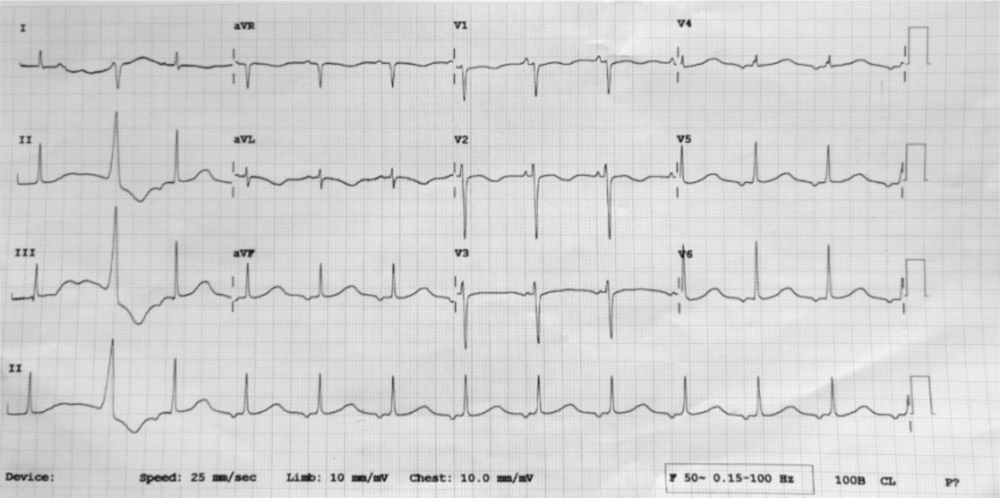

# Long QT syndrome

*Categories: Clinical knowledge > Genetics > Cardiovascular and renal disorders > Long QT syndrome*

[Original Article Link](https://coursology-qbank.com/amboss/article/uS0pYf)

---

## Summary

Long QT syndrome (LQTS) is a congenital or acquired <u>heart</u> condition in which the <u>QT interval</u> (i.e., ventricular <u>depolarization</u> and <u>repolarization</u>) is prolonged. Most patients with LQTS are asymptomatic, but some present with <u>seizures</u>, <u>syncope</u>, or even life-threatening <u>arrhythmias</u> and sudden <u>death</u>. Treatment depends on the underlying cause: <u>Beta blockers</u> and <u>implantable cardioverter defibrillator</u> (<u>ICD</u>) insertion are commonly used for <u>congenital LQTS</u>, whereas treatment of the underlying cause (drug, <u>electrolyte</u> abnormality, etc.) is the first-line therapy for <u>acquired LQTS</u>.

---

## Etiology

A <u>prolonged QT interval</u> may be congenital or acquired.

### Congenital LQTS

* <u>Congenital LQTS</u> arises from mutations in <u>genes</u> that code for ion channels within <u>myocytes</u> (e.g., KCNE1 gene, located on <u>chromosome</u> 11p that encodes <u>potassium</u> channels in the <u>heart</u> and <u>inner ear</u>)

* These mutations all cause ventricular <u>action potentials</u> to be prolonged, resulting in a lengthened <u>QT interval</u> on <u>ECG</u>. [[1]](https://coursology-qbank.com/amboss/article/df0oO2)

* LQTS type 1 [[2]](https://coursology-qbank.com/amboss/article/IRYYoK)

* Most common type of <u>congenital LQTS</u>

* <u>Loss of function mutation</u> on the KCNQ1 gene located on <u>chromosome</u> 11p → defective slow delayed rectifier <u>voltage-gated potassium channel</u> → affected <u>repolarization</u> phase [[3]](https://coursology-qbank.com/amboss/article/hzacsM)

* Subtypes

* Jervell and Lange-Nielsen syndrome [[4]](https://coursology-qbank.com/amboss/article/y-ad-M)[[5]](https://coursology-qbank.com/amboss/article/SzayHM)

* Associated with congenital <u>deafness</u>

* <u>Autosomal recessive</u>

* Associated with <u>ventricular tachyarrhythmias</u>

* Romano-Ward syndrome [[6]](https://coursology-qbank.com/amboss/article/A-aR-M)

* No associated <u>deafness</u>

* <u>Autosomal dominant</u>

* Associated with <u>ventricular tachyarrhythmias</u>

### Acquired LQTS [[7]](https://coursology-qbank.com/amboss/article/wp0h7S)[[8]](https://coursology-qbank.com/amboss/article/fTYkJo)[[9]](https://coursology-qbank.com/amboss/article/2tYT1I)[[10]](https://coursology-qbank.com/amboss/article/izaJsM)

* Drug-induced LQTS: Usually substances that block <u>potassium</u> outflow during the rapid <u>repolarization</u> phase [[11]](https://coursology-qbank.com/amboss/article/_-a5-M)

* <u>Antiarrhythmics</u> ;  [[12]](https://coursology-qbank.com/amboss/article/xBYE17)

* Class Ia (e.g., <u>quinidine</u>, <u>disopyramide</u>, <u>procainamide</u>)

* Class III (e.g., <u>sotalol</u>; uncommonly, <u>amiodarone</u>)

* <u>Antibiotics</u> (e.g., <u>macrolides</u>, <u>fluoroquinolones</u>)

* <u>Antihistamines</u> (e.g., <u>diphenhydramine</u>)

* <u>Antidepressants</u> (most <u>tricyclic antidepressants</u> and tetracyclic <u>antidepressants</u>, some <u>SSRIs</u>, <u>lithium</u>)

* <u>Antipsychotics</u> (e.g., <u>haloperidol</u>, <u>ziprasidone</u>)

* <u>Anticonvulsants</u> (e.g., <u>fosphenytoin</u>, felbamate)

* <u>Antiemetics</u> (<u>ondansetron</u>)

* <u>Antifungals</u> (e.g., <u>azoles</u>)

* <u>Antiparkinson medications</u>

* <u>Opioids</u>

* <u>Protease inhibitors</u>

* <u>Electrolyte</u> imbalances: <u>hypokalemia</u>, <u>hypomagnesemia</u>, <u>hypocalcemia</u>

* <u>Acute CNS insult</u>: <u>Ischemic stroke</u> or <u>intracranial hemorrhage</u>  [[13]](https://coursology-qbank.com/amboss/article/MiXMHB)[[14]](https://coursology-qbank.com/amboss/article/niX7HB)

* Endocrine disorders: <u>hypothyroidism</u>

* Nutritional deficiencies: severe <u>vitamin D deficiency</u> (uncommon)  [[15]](https://coursology-qbank.com/amboss/article/zIXr2z)[[16]](https://coursology-qbank.com/amboss/article/_IX52z)

> [!NOTE]
> Compared to other <u>class III antiarrhythmics</u>, <u>amiodarone</u> uncommonly causes <u>torsades de pointes</u>.

---

## Clinical features

* Often asymptomatic, especially if the <u>QT interval</u> is only minutely prolonged

* Some patients present with:

* <u>Palpitations</u>

* <u>Dizziness</u>

* <u>Syncope</u>

* <u>Cardiac arrest</u>

---

## Diagnosis

* Diagnosis of LQTS can be difficult because a slightly <u>prolonged QT interval</u> can be a normal variant (i.e., not <u>congenital LQTS</u>), and some patients with LQTS do not have a <u>prolonged QT interval</u>.

* The primary finding in LQTS is a long <u>QT interval</u> corrected for <u>heart rate</u> (<u>QTc</u>) interval.

* Males: > 440 ms

* Females: > 460 ms

* Other diagnostic criteria take <u>patient history</u> and <u>ECG</u> findings into account.

* <u>Genetic testing</u> confirms the diagnosis of LQTS.

Prolonged QT-interval (long QT syndrome)

---

## Treatment

* Both congenital and <u>acquired LQTS</u>

* Avoid activities that <u>stress</u> the <u>heart</u>

* Avoid cold temperatures (e.g., swimming, diving, skiing)

* <u>Congenital LQTS</u>

* First line: <u>beta blockers</u> (e.g., <u>propranolol</u>)

* Left cardiac <u>sympathetic denervation</u> (stellectomy): patients not responsive to <u>beta blockers</u>

* High-risk patients (recurrent <u>syncope</u> despite medical therapy, survival of <u>cardiac arrest</u>): <u>implantable cardioverter defibrillator</u> (<u>ICD</u>)

* <u>Acquired LQTS</u>: treat cause;  (remove offending drug, fix <u>electrolyte</u> imbalances, etc.)

> [!NOTE]
> All treatment modalities aim to reduce the risk and severity of cardiac events.

---

## Complications

* <u>Ventricular tachycardia</u> (<u>torsade de pointes</u>)

* <u>Ventricular fibrillation</u>

* <u>Asystole</u>

* <u>Sudden cardiac death</u>

We list the most important complications. The selection is not exhaustive.

---