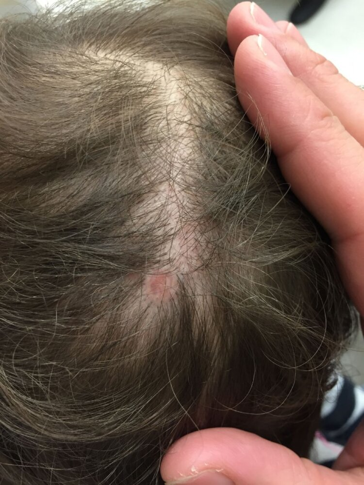

# Chromosomal abnormalities

*Categories: Clinical knowledge > Genetics > Inherited syndromes > Chromosomal abnormalities*

[Original Article Link](https://coursology-qbank.com/amboss/article/e40xRT)

---

## Summary

Structural and numerical <u>chromosomal abnormalities</u> affect either the autosomes or gonosomes and are a common <u>cause of spontaneous abortion</u>. The most frequently observed <u>autosomal</u> abnormalities are <u>trisomy 13</u> (<u>Patau syndrome</u>), <u>trisomy 18</u> (<u>Edwards syndrome</u>), and <u>trisomy 21</u> (<u>Down syndrome</u>). Individuals with these conditions have an extra copy of the <u>chromosome</u> to which their names refer. The risk of <u>autosomal</u> abnormalities increases with maternal age. Characteristic features include facial and skeletal <u>malformations</u>, which are usually recognizable at <u>birth</u>. The conditions are also associated with <u>congenital heart defects</u> and <u>malformations</u> of other internal organs. <u>Turner syndrome</u> and <u>Klinefelter syndrome</u> are gonosomal abnormalities in which individuals have a missing X <u>chromosome</u> or an additional X <u>chromosome</u>, respectively. These conditions are primarily characterized by impaired development of <u>secondary sexual characteristics</u> and <u>infertility</u> secondary to <u>gonadal dysgenesis</u>. The diagnosis for all <u>chromosomal abnormalities</u> is confirmed with <u>karyotyping</u>.

---

## Overview

### Definitions

* <u>Chromosomal abnormality</u>: deviation from the normal <u>chromosome</u> constellation

* Numerical <u>chromosomal abnormality</u>;  (e.g., <u>aneuploidy</u>, <u>polyploidy</u>)

* Structural <u>chromosomal abnormality</u>;  (e.g., deletion, translocation)

* Triploidy: : presence of three sets of <u>chromosomes</u>

* Trisomy: : presence of triplicate instead of a duplicate number of a particular <u>chromosome</u> or part of a <u>chromosome</u>

### <u>Epidemiology</u>

* <u>Chromosomal abnormalities</u> are the most common <u>cause of spontaneous abortion</u> (accounting for 60% of cases).

* Approx. 50% of anomalies are <u>trisomies</u>.

* Approx. 20% of anomalies are triploidies.

### Viable numerical <u>chromosomal abnormalities</u>

#### <u>Autosomal</u> <u>chromosomal abnormalities</u>

| Overview of autosomal chromosomal abnormalities |  |  |  |
| --- | --- | --- | --- |
|  | <u>Trisomy 13</u> (<u>Patau syndrome</u>) | <u>Trisomy 18</u> (<u>Edwards syndrome</u>) | <u>Trisomy 21</u> (<u>Down syndrome</u>) |
| <u>Karyotype</u> |   * <u>♀</u>: 47,XX,+13  * <u>♂</u>: 47,XY,+13    |   * <u>♀</u>: 47,XX,+18  * <u>♂</u>: 47,XY,+18    |   * Full <u>trisomy</u>: <u>meiotic</u> <u>nondisjunction</u>    * <u>♀</u>: 47,XX,+21  * <u>♂</u>: 47,XY,+21  * <u>Translocation trisomy 21</u>  * <u>Balanced Robertsonian translocation</u>   * <u>♀</u>: 45,XX,t(14;21)  * <u>♂</u>: 45,XY,t(14;21)  * <u>Unbalanced Robertsonian translocation</u>   * <u>♀</u>: 46,XX,+21,t(14;21)  * <u>♂</u>: 46,XY,+21,t(14;21)  * <u>Mosaic trisomy 21</u>: <u>nondisjunction</u> during <u>mitosis</u> that occurs after <u>fertilization</u>  * <u>♀</u>: 46,XX/47,XX,+21  * <u>♂</u>: 46,XY/47,XY,+21    |
| Pathogenesis |   * <u>Meiotic</u> <u>nondisjunction</u>  * Abnormal fusion of prechordal <u>mesoderm</u> → midline defects    |  * <u>Meiotic</u> <u>nondisjunction</u>   |  |
| Clinical features |   * <u>Microcephaly</u>, <u>holoprosencephaly</u>  * <u>Cleft lip</u> and <u>palate</u>  * Low-set, malformed <u>ears</u>  * <u>Microphthalmia</u>, <u>coloboma</u>  * <u>Polydactyly</u>  * <u>Rocker-bottom feet</u>  * <u>Aplasia cutis congenita</u>    |   * Low-set <u>ears</u>  * <u>Micrognathia</u>  * Prominent occiput  * Clenched fists with <u>flexion</u> <u>contractures</u> and overlapping fingers  * <u>Rocker-bottom feet</u>    |   * Upward-slanting <u>palpebral fissures</u>, <u>epicanthal folds</u>  * <u>Brushfield spots</u>  * Large, furrowed, protruding <u>tongue</u>  * <u>Brachycephaly</u>  * <u>Hypoplastic</u> <u>nasal bones</u>, broad and flat nasal bridge  * Short neck with extra nuchal folds  * <u>Transverse palmar crease</u>  * <u>Sandal gap</u>  * <u>Clinodactyly</u>  * <u>Obesity</u>  * General <u>hypotonia</u>  * <u>Short stature</u>    |
| Associated conditions |   * <u>Congenital heart defects</u> (particularly <u>VSD</u>, <u>PDA</u>)  * <u>Omphalocele</u>  * <u>Polycystic kidney disease</u>  * <u>Capillary hemangioma</u>    |   * <u>Congenital heart defects</u> (particularly <u>VSD</u>, <u>ASD</u>, <u>tetralogy of Fallot</u>)  * <u>Myelomeningocele</u>  * <u>Omphalocele</u>  * <u>Diaphragmatic hernia</u>  * <u>Horseshoe kidneys</u>    |   * <u>Congenital heart defects</u> (particularly <u>AVSD</u>; <u>VSD</u>, <u>ASD</u>, <u>tetralogy of Fallot</u>)  * <u>Duodenal atresia</u>, <u>annular pancreas</u>, <u>anal atresia</u>, <u>Hirschsprung disease</u>  * <u>Hypothyroidism</u>, <u>type 1 diabetes</u>  * Increased risk of <u>leukemia</u> (<u>AML</u>, <u>ALL</u>)  * Early-onset <u>Alzheimer disease</u>  * <u>Atlantoaxial instability</u>    |
| Neurocognitive deficiency |  * Severe <u>intellectual disability</u>   |  |  * Variable (average <u>IQ</u>: 50)   |
| <u>Life expectancy</u> |  * < 12 months of age   |  * < 12 months of age   |  * Decreased (∼ 60 years)   |

Section 10 Autosomal Trisomies

#### Gonosomal <u>chromosomal abnormalities</u>

* <u>Klinefelter syndrome</u>

* <u>Turner syndrome</u>

* <u>47,XYY syndrome</u>

* <u>47,XXX syndrome</u>

---

## Trisomy 13 (Patau syndrome)

* <u>Karyotype</u>

* <u>♀</u>: 47,XX,+13

* <u>♂</u>: 47,XY,+13

* <u>Incidence</u>: ∼ 1:7,400 <u>live births</u>  [[1]](https://coursology-qbank.com/amboss/article/FkbgpF)

* Pathogenesis

* <u>Meiotic</u> <u>nondisjunction</u>

* Abnormal fusion of prechordal <u>mesoderm</u> → midline defects

* Clinical features

* <u>Microcephaly</u>, <u>holoprosencephaly</u>

* Characteristic facial anomalies

* <u>Cleft lip</u> and <u>palate</u>

* Low-set, malformed <u>ears</u>

* Bulbous nose

* Small chin

* Microphthalmia;  (small <u>orbits</u>, which may be unilateral or bilateral), possibly <u>coloboma</u>, ocular <u>hypotelorism</u>

* <u>Polydactyly</u> (primarily hexadactyly), flexed fingers

* <u>Congenital heart defects</u> (particularly <u>ventricular septal defect</u>, <u>patent ductus arteriosus</u>)

* <u>Rocker-bottom feet</u>

* Aplasia cutis congenita; : <u>congenital absence of skin</u>; most commonly scalp lesions with a punched-out appearance that may extend to the bone or the <u>dura</u>

* <u>Omphalocele</u>

* <u>Visceral</u> and genital anomalies, especially of the <u>kidneys</u> and <u>ureters</u> (e.g., <u>polycystic kidney disease</u>)

* <u>Capillary hemangioma</u>

* Diagnostics

* Usually detected during <u>first trimester screening</u> with combined <u>ultrasound</u> and maternal serum testing (↓ <u>PAPP-A</u>, ↑ <u>nuchal translucency</u>)

* See “<u>Prenatal diagnostics</u>.”

* Prognosis: Only approx. 11% of patients survive past 12 months of age. [[2]](https://coursology-qbank.com/amboss/article/ukbppF)

> [!NOTE]
> The age of Puberty onset is 13: Patau syndrome is caused by <u>trisomy</u> 13.

> [!NOTE]
> 7 Ps of Patau syndrome: holoProsencephaly, cleft liP and Palate, Polydactyly, Pump disease (<u>congenital heart disease</u>), Polycystic <u>kidney</u> disease, <u>cutis</u> aPlasia.

Meiotic nondisjunction

Coloboma of the iris

Aplasia cutis congenita

Capillary hemangioma of the skin (cherry angioma)

Patau syndrome (trisomy 13) fact sheet

Section 10.3 Patau Syndrome

---

## Trisomy 18 (Edwards syndrome)

* <u>Karyotype</u>

* <u>♀</u>: 47,XX,+18

* <u>♂</u>: 47,XY,+18

* <u>Incidence</u>

* ∼ 1:3,300 <u>live births</u> [[1]](https://coursology-qbank.com/amboss/article/FkbgpF)

* After <u>trisomy 21</u>, <u>trisomy 18</u> is the most common <u>autosomal</u> <u>trisomy</u> in which fetuses can survive to <u>birth</u>.

* Pathogenesis: <u>meiotic</u> <u>nondisjunction</u>

* <u>Gender</u>: <u>♀</u> > <u>♂</u>

* Clinical features  

* Characteristic facial anomalies

* Low-set <u>ears</u> (malformed <u>auricle</u>)

* Micrognathia (congenital <u>mandibular hypoplasia</u>)

* Prominent occiput

* <u>Microcephaly</u>

* Broad nose

* <u>Cleft lip</u> and <u>palate</u>, high <u>palate</u>

* Clenched fists with <u>flexion</u> <u>contractures</u> and overlapping fingers

* Rocker-bottom feet: <u>convex</u> deformity of the <u>plantar</u> side of the foot, with a vertical <u>talus</u>, and prominent <u>calcaneus</u>

* <u>Congenital heart defects</u> (particularly <u>VSD</u>, <u>ASD</u>, <u>tetralogy of Fallot</u>)

* <u>Malformations</u> of internal organs: <u>diaphragmatic hernia</u>, <u>ureter</u>, and <u>kidneys</u> (<u>horseshoe kidneys</u>)

* <u>Myelomeningocele</u>

* <u>Omphalocele</u>

* Severe <u>intellectual disability</u>

* Diagnosis

* <u>Quadruple test</u>;  in the <u>second trimester</u> shows ↓ free <u>estriol</u>, ↓ <u>AFP</u>, ↓ β-<u>HCG</u>, and normal/↓ <u>inhibin A</u>

* See “<u>Prenatal diagnostics</u>.”

* Prognosis: Only approx. 13% of patients survive past 12 months of age. [[2]](https://coursology-qbank.com/amboss/article/ukbppF)

Meiotic nondisjunction

Edwards syndrome (trisomy 18) fact sheet

Section 10.2 Edwards Syndrome

> [!NOTE]
> PRINCE Edward turned 18: Prominent occiput, Rocker-bottom feet, Intellectual disability, Nondisjunction (in <u>meiosis</u>), Clenched fists, low-set Ears, and <u>chromosome</u> 18.

---

## Down syndrome (trisomy 21)

See article on “<u>Down syndrome</u>.”

Down syndrome (trisomy 21) fact sheet

---

## 47,XYY syndrome and 47,XXX syndrome

* <u>Karyotype</u>

* <u>♂</u>: 47,XYY

* <u>♀</u>: <u>47,XXX</u>

* <u>Incidence</u> [[3]](https://coursology-qbank.com/amboss/article/abaQHQ)[[4]](https://coursology-qbank.com/amboss/article/YbanHQ)

* <u>47,XYY syndrome</u>: ∼ 1/1,000 male <u>newborns</u>

* <u>47,XXX syndrome</u>: ∼ 1/1,000 female <u>newborns</u>

* Clinical features

* <u>47,XYY syndrome</u> [[5]](https://coursology-qbank.com/amboss/article/DG01Y3)

* <u>Tall stature</u>

* Mild delays in motor and <u>language development</u>

* Possible <u>fertility</u> problems (decreased <u>sperm</u> count)

* <u>47,XXX syndrome</u> [[6]](https://coursology-qbank.com/amboss/article/vG0Aa3)

* <u>Tall stature</u>

* Delayed motor and <u>language development</u>

* <u>Learning</u> disabilities

* Menstrual abnormalities, occasionally <u>fertility</u> problems

* Diagnosis [[7]](https://coursology-qbank.com/amboss/article/0baeHQ)

* The majority of women with triple X and men with double Y are never diagnosed.

* <u>Chromosome</u> analysis

* Treatment

* Only symptomatic treatment is possible.

* <u>Speech therapy</u>

* Physical, occupational, and educational therapy

* Reproductive specialist in individuals with <u>fertility</u> problems

---